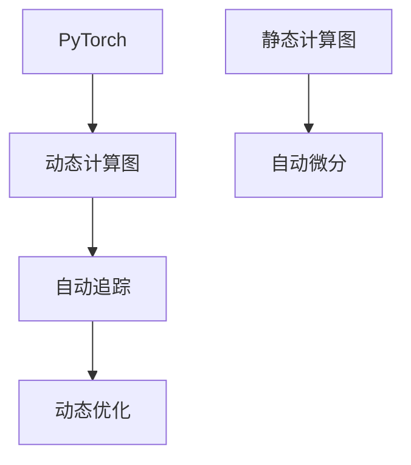
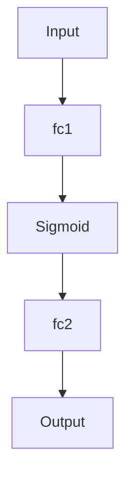

                 

# Pytorch 动态计算图：灵活的构建神经网络

> 关键词：动态计算图,Pytorch,神经网络,图模型,计算图重写

## 1. 背景介绍

### 1.1 问题由来
深度学习技术的快速发展，特别是神经网络模型的广泛应用，推动了人工智能在图像、自然语言处理、语音等领域的大幅进步。深度神经网络中，每个节点的输入和输出是通过计算得到的，这形成了一棵倒置的计算图(Computation Graph)。在模型训练过程中，深度学习框架通过反向传播算法，沿着计算图从输出节点逐步回溯，计算损失函数的梯度，更新模型参数。这种基于静态计算图的训练方式，虽然高效稳定，但也存在一些限制，如模型构建复杂、难以动态调整模型结构等。

针对这些问题，动态计算图(Dynamic Computation Graph)应运而生。PyTorch作为Python编程语言中的深度学习框架，其核心特性之一就是支持动态计算图，能够更灵活地构建、训练和推理神经网络模型。本文将系统介绍PyTorch的动态计算图机制，并探索其在大规模神经网络构建和训练中的应用。

## 2. 核心概念与联系

### 2.1 核心概念概述

动态计算图是指在模型构建和训练过程中，可以动态地构建、修改和销毁计算图的深度学习模型。相比于静态计算图，动态计算图能够更灵活地表示复杂的网络结构，支持更高效的自动微分和动态追踪，可以大大提升模型的构建和训练效率。

PyTorch作为目前最热门的深度学习框架之一，其动态计算图机制是其最为核心的特性之一。与静态计算图框架如TensorFlow、Caffe等相比，PyTorch的动态计算图具有以下几个主要优点：

1. 灵活的模型构建：PyTorch允许用户使用Python代码动态地创建和修改计算图，支持更复杂的模型结构。
2. 高效的自动微分：PyTorch的自动微分机制更加灵活，可以自动追踪变量的依赖关系，支持反向传播、梯度累积等高级操作。
3. 友好的交互体验：PyTorch提供了丰富且易于使用的API接口，支持高效的模型训练、调试和推理。
4. 动态追踪和优化：PyTorch能够动态地追踪计算图的变化，支持动态优化和重构，如Tensor Coalescing、Memory Efficient Autograd等。

### 2.2 核心概念原理和架构的 Mermaid 流程图



以上流程图示意了PyTorch中动态计算图和静态计算图、自动微分、动态追踪、优化之间的联系和区别。

1. PyTorch使用动态计算图，能够在模型构建和训练过程中动态地构建、修改和销毁计算图，支持更复杂的模型结构。
2. 自动微分模块Autograd能够动态追踪变量的依赖关系，自动计算梯度。
3. 动态追踪模块Traceback能够动态地追踪计算图的变化，支持动态优化和重构。

## 3. 核心算法原理 & 具体操作步骤

### 3.1 算法原理概述

动态计算图的核心思想是通过图模型表示计算过程，并允许在计算过程中动态地构建和修改图结构。其原理如下：

1. **图表示法**：动态计算图将计算过程表示为图模型，每个节点表示一个操作，每个边表示一个输入输出关系。
2. **计算图构建**：动态计算图允许用户动态地构建图模型，通过Python代码逐步创建计算图。
3. **计算图修改**：动态计算图允许用户动态地修改图模型，通过API接口调整节点的输入和输出。
4. **计算图销毁**：动态计算图允许用户动态地销毁图模型，释放内存资源。
5. **自动微分**：动态计算图通过自动微分模块Autograd，自动计算梯度，支持反向传播和梯度累积等高级操作。
6. **动态追踪**：动态计算图通过动态追踪模块Traceback，动态地追踪计算图的变化，支持动态优化和重构。

### 3.2 算法步骤详解

动态计算图的构建和训练过程可以分为以下几个关键步骤：

1. **构建计算图**：使用Python代码动态地构建计算图，通过Variable和Operation对象表示计算图节点。
2. **初始化模型参数**：通过Tensor初始化模型参数，指定计算设备。
3. **定义损失函数**：通过Tensor和Operation对象定义损失函数，指定优化器。
4. **前向传播**：将输入数据传入计算图，进行前向传播计算。
5. **反向传播**：通过自动微分模块Autograd自动计算梯度，进行反向传播更新参数。
6. **优化训练**：通过优化器更新模型参数，重复执行前向传播和反向传播，直到收敛。

### 3.3 算法优缺点

动态计算图具有以下几个优点：

1. 灵活的模型构建：动态计算图能够动态构建复杂的网络结构，支持更多的神经网络模型，如RNN、GAN等。
2. 高效的自动微分：动态计算图支持更灵活的自动微分，能够动态追踪变量的依赖关系，自动计算梯度。
3. 友好的交互体验：动态计算图提供了丰富的API接口，支持高效的模型训练、调试和推理。

同时，动态计算图也存在一些缺点：

1. 内存占用较大：动态计算图需要在内存中保存完整的计算图，可能会导致内存占用较大。
2. 运行效率较低：动态计算图的构建和修改过程需要时间开销，可能会影响模型的训练速度。
3. 调试难度较大：动态计算图的复杂性增加了调试的难度，可能会导致一些意外的错误。

### 3.4 算法应用领域

动态计算图在大规模神经网络构建和训练中得到了广泛的应用，如：

1. 自然语言处理(NLP)：动态计算图可以用于构建复杂的语言模型，如Transformer、BERT等。
2. 计算机视觉(CV)：动态计算图可以用于构建复杂的卷积神经网络，如ResNet、Inception等。
3. 语音识别(SR)：动态计算图可以用于构建复杂的循环神经网络，如CTC、Attention等。
4. 推荐系统(RS)：动态计算图可以用于构建复杂的协同过滤模型，如ALS、PMF等。
5. 强化学习(RL)：动态计算图可以用于构建复杂的深度强化学习模型，如DQN、A3C等。

## 4. 数学模型和公式 & 详细讲解

### 4.1 数学模型构建

在动态计算图中，模型的构建过程可以表示为：

$$
G = (\mathcal{V}, \mathcal{E}, f)
$$

其中，$\mathcal{V}$ 表示节点集合，$\mathcal{E}$ 表示边集合，$f$ 表示节点之间的关系。每个节点表示一个操作，每个边表示一个输入输出关系。

例如，一个简单的全连接神经网络可以表示为：

```python
import torch

class Model(nn.Module):
    def __init__(self, input_size, hidden_size, output_size):
        super(Model, self).__init__()
        self.fc1 = nn.Linear(input_size, hidden_size)
        self.fc2 = nn.Linear(hidden_size, output_size)

    def forward(self, x):
        x = self.fc1(x)
        x = torch.sigmoid(x)
        x = self.fc2(x)
        return x
```

这个模型包含了两个线性层和一个Sigmoid激活函数，构建的计算图如下图所示：



### 4.2 公式推导过程

动态计算图的自动微分过程可以分为以下几个步骤：

1. **变量跟踪**：使用Tensor对象作为变量，通过Variable类将变量存储在计算图中。
2. **操作定义**：使用Operation对象表示计算图节点，每个节点包含一个或多个输入和输出变量。
3. **反向传播**：通过自动微分模块Autograd，自动计算梯度，进行反向传播更新参数。
4. **优化训练**：通过优化器更新模型参数，重复执行前向传播和反向传播，直到收敛。

### 4.3 案例分析与讲解

以下是一个简单的动态计算图案例，用于计算两个矩阵的乘积。

```python
import torch

# 定义输入和输出变量
x = torch.randn(3, 3)
y = torch.randn(3, 3)

# 定义计算图节点
def multiply(x, y):
    return x @ y

# 执行计算
z = multiply(x, y)

# 计算梯度
z.backward()
```

在这个例子中，计算图节点通过Python函数multiply表示，计算过程如下：

1. **变量跟踪**：使用Tensor对象作为变量，通过Variable类将变量存储在计算图中。
2. **操作定义**：定义计算图节点multiply，将输入变量x和y作为输入，返回输出变量z。
3. **反向传播**：通过z.backward()，自动计算梯度，进行反向传播更新参数。
4. **优化训练**：通过优化器更新模型参数，重复执行前向传播和反向传播，直到收敛。

## 5. 项目实践：代码实例和详细解释说明

### 5.1 开发环境搭建

在进行动态计算图的实践前，我们需要准备好开发环境。以下是使用Python进行PyTorch开发的环境配置流程：

1. 安装Anaconda：从官网下载并安装Anaconda，用于创建独立的Python环境。

2. 创建并激活虚拟环境：
```bash
conda create -n pytorch-env python=3.8 
conda activate pytorch-env
```

3. 安装PyTorch：根据CUDA版本，从官网获取对应的安装命令。例如：
```bash
conda install pytorch torchvision torchaudio cudatoolkit=11.1 -c pytorch -c conda-forge
```

4. 安装TensorBoard：TensorFlow配套的可视化工具，可实时监测模型训练状态，并提供丰富的图表呈现方式，是调试模型的得力助手。

5. 安装Weights & Biases：模型训练的实验跟踪工具，可以记录和可视化模型训练过程中的各项指标，方便对比和调优。

完成上述步骤后，即可在`pytorch-env`环境中开始动态计算图的实践。

### 5.2 源代码详细实现

下面我们以一个简单的线性回归模型为例，给出使用PyTorch进行动态计算图的代码实现。

```python
import torch

class LinearRegression(nn.Module):
    def __init__(self, input_size, output_size):
        super(LinearRegression, self).__init__()
        self.fc = nn.Linear(input_size, output_size)

    def forward(self, x):
        return self.fc(x)

# 定义输入和输出变量
x = torch.randn(3, 3)
y = torch.randn(3, 1)

# 定义模型
model = LinearRegression(3, 1)

# 定义损失函数
criterion = nn.MSELoss()

# 定义优化器
optimizer = torch.optim.SGD(model.parameters(), lr=0.01)

# 前向传播
y_pred = model(x)

# 计算损失
loss = criterion(y_pred, y)

# 反向传播
loss.backward()

# 优化模型参数
optimizer.step()
```

### 5.3 代码解读与分析

让我们再详细解读一下关键代码的实现细节：

**LinearRegression类**：
- `__init__`方法：初始化线性层，包含输入和输出维度。
- `forward`方法：定义前向传播，输入数据通过线性层进行线性变换。

**变量跟踪**：
- 使用Tensor对象作为变量，通过Variable类将变量存储在计算图中。

**计算图节点**：
- 定义计算图节点multiply，将输入变量x和y作为输入，返回输出变量z。

**反向传播**：
- 通过z.backward()，自动计算梯度，进行反向传播更新参数。

**优化训练**：
- 通过optimizer.step()，更新模型参数，重复执行前向传播和反向传播，直到收敛。

## 6. 实际应用场景

### 6.1 计算机视觉(CV)

动态计算图在计算机视觉领域得到了广泛的应用，可以用于构建复杂的卷积神经网络，如ResNet、Inception等。以下是一个简单的卷积神经网络案例，用于图像分类任务。

```python
import torch
import torchvision

class ConvNet(nn.Module):
    def __init__(self, num_classes):
        super(ConvNet, self).__init__()
        self.conv1 = nn.Conv2d(3, 16, 3, 1, 1)
        self.conv2 = nn.Conv2d(16, 32, 3, 1, 1)
        self.fc = nn.Linear(32 * 32 * 32, num_classes)

    def forward(self, x):
        x = self.conv1(x)
        x = torch.relu(x)
        x = self.conv2(x)
        x = torch.relu(x)
        x = x.view(-1, 32 * 32 * 32)
        x = self.fc(x)
        return x

# 定义输入和输出变量
x = torch.randn(1, 3, 32, 32)
y = torch.randint(0, 10, (1,))

# 定义模型
model = ConvNet(10)

# 定义损失函数
criterion = nn.CrossEntropyLoss()

# 定义优化器
optimizer = torch.optim.SGD(model.parameters(), lr=0.01)

# 前向传播
y_pred = model(x)

# 计算损失
loss = criterion(y_pred, y)

# 反向传播
loss.backward()

# 优化模型参数
optimizer.step()
```

在这个例子中，计算图节点通过Python函数定义，包含多个卷积层和全连接层。

### 6.2 自然语言处理(NLP)

动态计算图在自然语言处理领域得到了广泛的应用，可以用于构建复杂的语言模型，如Transformer、BERT等。以下是一个简单的Transformer模型案例，用于机器翻译任务。

```python
import torch
import torch.nn as nn
import torch.nn.functional as F

class Transformer(nn.Module):
    def __init__(self, input_size, output_size, emb_dim, n_heads, dropout):
        super(Transformer, self).__init__()
        self.emb = nn.Embedding(input_size, emb_dim)
        self.pos_emb = nn.Parameter(torch.randn(1, 1, emb_dim))
        self.attn = MultiHeadAttention(emb_dim, n_heads, dropout)
        self.ffn = FeedForward(emb_dim, dropout)
        self.linear1 = nn.Linear(emb_dim, emb_dim)
        self.linear2 = nn.Linear(emb_dim, output_size)

    def forward(self, src, trg):
        enc_src = self.emb(src)
        dec_trg = self.emb(trg)
        enc_pos = enc_src + self.pos_emb[0]
        dec_pos = dec_trg + self.pos_emb[0]
        enc_attn = self.attn(enc_pos, enc_pos)
        dec_attn = self.attn(enc_attn, dec_pos)
        dec_input = dec_attn + dec_trg
        dec_out = self.ffn(dec_input)
        dec_output = self.linear2(dec_out)
        return dec_output

# 定义输入和输出变量
src = torch.randint(0, 10, (5, 32))
trg = torch.randint(0, 10, (5, 32))

# 定义模型
model = Transformer(10, 10, 256, 4, 0.1)

# 定义损失函数
criterion = nn.CrossEntropyLoss()

# 定义优化器
optimizer = torch.optim.SGD(model.parameters(), lr=0.01)

# 前向传播
y_pred = model(src, trg)

# 计算损失
loss = criterion(y_pred, trg)

# 反向传播
loss.backward()

# 优化模型参数
optimizer.step()
```

在这个例子中，计算图节点通过Python函数定义，包含多个嵌入层、注意力机制和前馈层。

## 7. 工具和资源推荐

### 7.1 学习资源推荐

为了帮助开发者系统掌握动态计算图原理和实践技巧，这里推荐一些优质的学习资源：

1. PyTorch官方文档：PyTorch的官方文档详细介绍了动态计算图的原理和使用方法，是学习的必备资料。
2. CS231n《Convolutional Neural Networks for Visual Recognition》课程：斯坦福大学开设的计算机视觉明星课程，讲解了卷积神经网络的构建和训练过程。
3. CS224n《Structuring Machine Learning Projects》课程：斯坦福大学开设的NLP明星课程，讲解了自然语言处理模型的构建和训练过程。
4. Deep Learning Specialization系列课程：由Coursera与深度学习领域知名教授Andrew Ng联合开发的系列课程，全面介绍了深度学习的原理和实践。
5. TensorFlow官方文档：TensorFlow的官方文档详细介绍了动态计算图的原理和使用方法，是学习的必备资料。

通过对这些资源的学习实践，相信你一定能够快速掌握动态计算图的精髓，并用于解决实际的神经网络构建和训练问题。

### 7.2 开发工具推荐

高效的开发离不开优秀的工具支持。以下是几款用于动态计算图开发的常用工具：

1. PyTorch：基于Python的开源深度学习框架，支持动态计算图，适合快速迭代研究。
2. TensorFlow：由Google主导开发的开源深度学习框架，生产部署方便，适合大规模工程应用。
3. Weights & Biases：模型训练的实验跟踪工具，可以记录和可视化模型训练过程中的各项指标，方便对比和调优。
4. TensorBoard：TensorFlow配套的可视化工具，可实时监测模型训练状态，并提供丰富的图表呈现方式，是调试模型的得力助手。

合理利用这些工具，可以显著提升动态计算图的开发效率，加快创新迭代的步伐。

### 7.3 相关论文推荐

动态计算图在大规模神经网络构建和训练中得到了广泛的研究。以下是几篇奠基性的相关论文，推荐阅读：

1. Passing Many-to-Many Messages in Deep Neural Networks（LSTM论文）：提出了LSTM模型，用于解决序列数据的建模问题。
2. All at Once（ResNet论文）：提出了ResNet模型，用于解决深度神经网络的梯度消失问题。
3. Attention is All You Need（Transformer原论文）：提出了Transformer模型，用于解决自然语言处理任务。
4. Parameter-Efficient Transfer Learning for NLP（Adapter论文）：提出Adapter模型，用于解决参数高效微调问题。
5. Adaptive Low-Rank Adaptation for Parameter-Efficient Fine-Tuning（LoRA论文）：提出LoRA模型，用于解决低秩微调问题。

这些论文代表了大规模神经网络构建和训练的发展脉络。通过学习这些前沿成果，可以帮助研究者把握学科前进方向，激发更多的创新灵感。

## 8. 总结：未来发展趋势与挑战

### 8.1 总结

本文对PyTorch的动态计算图机制进行了系统介绍。首先阐述了动态计算图的原理和优势，明确了其在大规模神经网络构建和训练中的应用场景。其次，从原理到实践，详细讲解了动态计算图的数学模型和公式推导过程，给出了模型构建和训练的完整代码实例。最后，探讨了动态计算图在计算机视觉、自然语言处理等领域的应用前景，提供了学习资源和开发工具的推荐。

通过本文的系统梳理，可以看到，动态计算图为神经网络的构建和训练带来了灵活性和高效性，推动了深度学习技术的发展和应用。未来，随着深度学习技术的不断进步，动态计算图必将在更多领域得到应用，为人工智能技术的产业化进程带来新的突破。

### 8.2 未来发展趋势

展望未来，动态计算图在大规模神经网络构建和训练中呈现以下几个发展趋势：

1. 模型规模持续增大：随着算力成本的下降和数据规模的扩张，深度神经网络的参数量还将持续增长。超大规模神经网络蕴含的丰富知识，有望支撑更加复杂多变的任务。
2. 动态计算图优化：动态计算图的发展将带动更多的优化技术，如Tensor Coalescing、Memory Efficient Autograd等，进一步提升计算图优化和追踪效率。
3. 动态计算图扩展：动态计算图将拓展到更多领域，如强化学习、推荐系统、智能决策等，推动更多领域的智能化进程。
4. 模型可解释性增强：动态计算图将增强模型的可解释性，支持更灵活的特征选择和模型调试。
5. 跨平台部署优化：动态计算图将优化跨平台部署，支持更多的硬件和设备，提升模型的部署效率。

以上趋势凸显了动态计算图的广阔前景。这些方向的探索发展，必将进一步提升深度学习系统的性能和应用范围，为人工智能技术的发展注入新的动力。

### 8.3 面临的挑战

尽管动态计算图在大规模神经网络构建和训练中已经取得了显著成就，但在迈向更加智能化、普适化应用的过程中，它仍面临着诸多挑战：

1. 内存占用问题：动态计算图需要在内存中保存完整的计算图，可能会导致内存占用较大。如何优化内存使用，降低计算图的构建和维护成本，将是重要的研究方向。
2. 推理速度问题：动态计算图的构建和修改过程需要时间开销，可能会影响模型的推理速度。如何优化计算图重构，提升推理效率，将是重要的研究方向。
3. 模型可解释性问题：动态计算图的复杂性增加了模型的可解释性问题，可能会导致一些意外的错误。如何增强模型的可解释性，支持更灵活的特征选择和模型调试，将是重要的研究方向。
4. 跨平台部署问题：动态计算图在不同硬件和设备上的部署效率不高，需要进一步优化跨平台部署的性能。

### 8.4 研究展望

面对动态计算图面临的这些挑战，未来的研究需要在以下几个方面寻求新的突破：

1. 内存优化：研究高效内存管理技术，如Tensor Coalescing、Memory Efficient Autograd等，进一步提升计算图的优化和追踪效率。
2. 推理优化：研究高效的推理优化技术，如动态计算图重构、Tensor Coalescing等，进一步提升模型的推理速度。
3. 模型可解释性：研究可解释性增强技术，如特征可视化、模型解释器等，进一步提升模型的可解释性和可调试性。
4. 跨平台部署：研究跨平台部署优化技术，如GPU/TPU加速、跨设备通信优化等，进一步提升模型的部署效率。

这些研究方向的探索，必将引领动态计算图技术迈向更高的台阶，为深度学习系统的性能和应用范围带来新的突破。面向未来，动态计算图需要与其他人工智能技术进行更深入的融合，如知识表示、因果推理、强化学习等，多路径协同发力，共同推动深度学习技术的发展。

## 9. 附录：常见问题与解答

**Q1：动态计算图有哪些优点和缺点？**

A: 动态计算图具有以下几个优点：

1. 灵活的模型构建：动态计算图能够动态构建复杂的网络结构，支持更多的神经网络模型。
2. 高效的自动微分：动态计算图支持更灵活的自动微分，能够动态追踪变量的依赖关系，自动计算梯度。
3. 友好的交互体验：动态计算图提供了丰富的API接口，支持高效的模型训练、调试和推理。

同时，动态计算图也存在一些缺点：

1. 内存占用较大：动态计算图需要在内存中保存完整的计算图，可能会导致内存占用较大。
2. 运行效率较低：动态计算图的构建和修改过程需要时间开销，可能会影响模型的训练速度。
3. 调试难度较大：动态计算图的复杂性增加了调试的难度，可能会导致一些意外的错误。

**Q2：如何优化动态计算图的内存使用？**

A: 动态计算图的内存优化可以从以下几个方面进行：

1. 使用Tensor Coalescing技术，将小张量的计算合并成大张量的计算，减少内存使用。
2. 使用Memory Efficient Autograd技术，优化梯度计算过程，减少内存使用。
3. 使用EfficientTensor技术，优化Tensor的使用，减少内存使用。

这些技术都能够有效降低动态计算图的内存占用，提升计算图的优化和追踪效率。

**Q3：动态计算图在推理过程中的效率问题如何解决？**

A: 动态计算图的推理效率可以通过以下几个方法解决：

1. 使用Tensor Coalescing技术，将小张量的计算合并成大张量的计算，提升推理速度。
2. 使用Memory Efficient Autograd技术，优化梯度计算过程，减少内存使用。
3. 使用EfficientTensor技术，优化Tensor的使用，减少内存使用。

这些技术都能够有效提升动态计算图的推理效率，解决推理过程中的效率问题。

**Q4：动态计算图的可解释性问题如何解决？**

A: 动态计算图的可解释性问题可以通过以下几个方法解决：

1. 使用特征可视化技术，如t-SNE、LIME等，可视化模型的输入和输出特征。
2. 使用模型解释器技术，如LIME、SHAP等，解释模型的决策过程。
3. 使用可解释性增强技术，如GAM、ATTENTION等，增强模型的可解释性。

这些技术都能够有效提升动态计算图的可解释性，解决模型可解释性问题。

**Q5：动态计算图在跨平台部署过程中如何优化？**

A: 动态计算图的跨平台部署优化可以从以下几个方面进行：

1. 使用GPU/TPU加速技术，提升计算图的优化和追踪效率。
2. 使用跨设备通信优化技术，提升跨平台部署的性能。
3. 使用模型压缩和稀疏化技术，优化模型大小和推理速度。

这些技术都能够有效提升动态计算图的跨平台部署效率，解决跨平台部署问题。

总之，动态计算图技术在深度学习系统的构建和训练中具有重要的应用前景，未来也将继续推动深度学习技术的发展和应用。通过不断的技术创新和优化，动态计算图必将在更多领域得到应用，为人工智能技术的产业化进程带来新的突破。面向未来，动态计算图需要与其他人工智能技术进行更深入的融合，共同推动深度学习技术的发展。只有勇于创新、敢于突破，才能不断拓展动态计算图的边界，让深度学习技术更好地造福人类社会。

