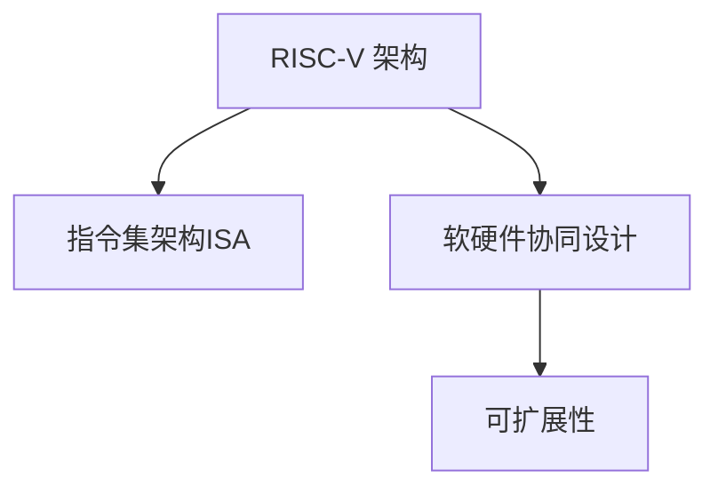
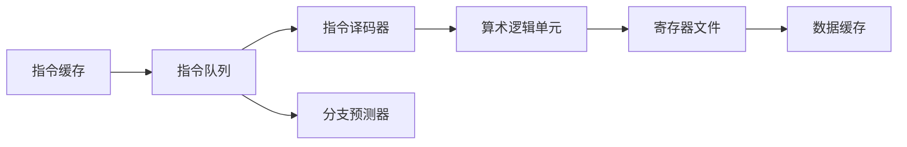

                 

# RISC-V：开源指令集架构的崛起

> 关键词：RISC-V, 开源指令集架构, 计算效率, 能效比, 芯片设计, 教育与研究

## 1. 背景介绍

### 1.1 问题由来

随着微处理器的发展，传统冯诺依曼架构逐渐被打破。过去几十年中，各大厂商通过垂直整合生产芯片，建立了属于自己的处理器架构，这不仅限制了技术的扩散，还加剧了竞争格局，使得高性能计算系统面临严重的性能和能效瓶颈。同时，知识产权（IP）费用高昂，更是阻碍了新设计者的市场准入。

RISC-V 作为开源的、可扩展的指令集架构，为解决上述问题提供了一种全新的解决方案。RISC-V 指令集架构完全开放，拥有丰富的工具链和生态系统，无需高昂的 IP 费用，其灵活性和可定制性使得它能够在学术界、工业界以及嵌入式市场等众多领域得以广泛应用。

### 1.2 问题核心关键点

RISC-V 的发展从根本上打破了传统硬件架构的垄断，推动了 CPU 设计的普及和创新。它在低能耗、高效率以及自由开放的架构理念上，得到了学术界和工业界的广泛认可。

1. **开放的源代码和架构**：RISC-V 源代码和架构完全开放，可自由修改、使用和发布。
2. **高度的灵活性和可扩展性**：支持多维度的可定制设计，能够轻松应对各种复杂计算任务。
3. **高计算效率和能效比**：RISC-V 设计理念注重提高指令执行效率，适合多核、大规模并行计算。
4. **社区驱动的发展**：全球众多公司和学术机构共同参与，RISC-V 生态系统不断壮大。

## 2. 核心概念与联系

### 2.1 核心概念概述

为更好地理解 RISC-V 架构的崛起，本节将介绍几个关键概念：

- **RISC-V 架构**：一种精简指令集计算（RISC）架构，设计精简、高效，适合嵌入式、移动设备等资源有限的环境。
- **指令集架构（ISA）**：定义了处理器执行的指令集合、指令格式、寄存器数量和架构等基本特性。
- **软硬件协同设计**：将硬件和软件设计紧密结合，优化资源利用率。
- **可扩展性**：指架构在保持性能和能效的同时，能够适应各种复杂的计算任务。

这些概念之间的逻辑关系可以通过以下 Mermaid 流程图来展示：



这个流程图展示了一个 RISC-V 处理器从设计到应用的过程：

1. RISC-V 架构通过精简指令集提高计算效率。
2. 指令集架构（ISA）定义了 RISC-V 执行的具体指令集合。
3. 软硬件协同设计确保硬件与软件的紧密合作。
4. 可扩展性保证了架构的多功能性。

## 3. 核心算法原理 & 具体操作步骤

### 3.1 算法原理概述

RISC-V 架构的核心思想是精简指令集，以提高指令执行效率和系统的能效比。其设计理念如下：

- **单周期指令**：尽量使每个指令在一个时钟周期内完成。
- **固定长度的指令编码**：方便指令译码和调度。
- **零开销的条件跳转**：使用“分支延迟槽”机制，提高分支指令的执行效率。
- **广泛的指令格式**：支持单/双字长、单/双操作数、单/双寄存器格式，提高指令的灵活性。

RISC-V 架构包含两组指令集：RVC（RISC-V Classic）和 RVV（RISC-V Vector）。RVC 主要用于基本计算任务，RVV 则支持向量化计算，进一步提高并行性能。

### 3.2 算法步骤详解

RISC-V 架构的实施通常包含以下几个关键步骤：

**Step 1: 硬件设计**
- 选择或设计适合的处理器核心，支持 RISC-V 架构。
- 设计数据通路、指令译码器、寄存器文件等组件。
- 设计并行计算单元（如向量单元）以支持 RVV 指令集。

**Step 2: 软件栈构建**
- 开发 RISC-V 的汇编语言和编译器。
- 实现操作系统、库和中间件，支持各种应用程序。
- 开发工具链和仿真器，方便调试和开发。

**Step 3: 应用集成**
- 将 RISC-V 处理器集成到硬件系统中，如 FPGA、ASIC 等。
- 进行系统调优和性能测试，确保稳定运行。
- 提供 SDK 和开发文档，方便应用开发者使用。

**Step 4: 生态系统扩展**
- 吸引开发者和企业参与，共同推进 RISC-V 的发展。
- 与其他开源社区合作，推动软硬件生态系统的完善。
- 参加国际学术会议和技术峰会，推广 RISC-V 架构。

### 3.3 算法优缺点

RISC-V 架构的优点包括：

1. **灵活性和可扩展性**：支持多种处理器类型，适用于各种计算场景。
2. **高效能和低成本**：设计精简、高效，适用于资源受限的环境。
3. **开放性**：免除高昂的 IP 费用，推动了架构的普及和创新。

RISC-V 架构的缺点包括：

1. **生态系统不完善**：虽然发展迅速，但与成熟架构相比，生态系统仍需进一步完善。
2. **市场接受度较低**：初期的设计成本和技术门槛较高，可能导致市场接受度低。
3. **性能上限**：尽管设计高效，但在高端计算场景中，可能与成熟的 x86/x64 架构存在性能差距。

### 3.4 算法应用领域

RISC-V 架构已在多个领域得到应用：

- **嵌入式系统**：如物联网、智能家居、汽车电子等，资源受限且性能要求不高。
- **教育与研究**：学术界常用于研究和教学，帮助理解 CPU 设计。
- **高性能计算**：如高性能计算集群、数据中心等，需要高计算效率和能效比。
- **商业芯片设计**：如 MIPS、IBM、Razertack 等公司，积极开发基于 RISC-V 的商用处理器。

## 4. 数学模型和公式 & 详细讲解

### 4.1 数学模型构建

RISC-V 指令集架构的数学模型通常包括对指令集的定义和计算流程的描述。RISC-V 的指令集包括整数、浮点数、分支、原子操作、向量等基本指令。

### 4.2 公式推导过程

以整数加法指令 `add` 为例，其对应的汇编代码可能为 `add t0, t1, t2`，其中 `t0` 为计算结果，`t1` 和 `t2` 为操作数。

- 对于单周期整数加法指令，其计算流程为：
  $$
  \text{R-Type} \quad add\, t0, t1, t2
  $$
  $$
  t0 \leftarrow t1 + t2
  $$
- 对于向量加法指令，其计算流程为：
  $$
  \text{R-Type} \quad vadd\, v1, v2, v3
  $$
  $$
  v1 \leftarrow v2 + v3
  $$

### 4.3 案例分析与讲解

我们通过一个简单的 RISC-V 处理器微结构图，来分析指令执行过程。



在这个微结构图中：
- 指令缓存存储待执行的指令。
- 指令队列负责指令的调度和执行顺序。
- 指令译码器将指令分解成微操作。
- 算术逻辑单元执行实际的加法操作。
- 寄存器文件负责读写操作数和结果。
- 数据缓存存储操作数和中间结果。

## 5. 项目实践：代码实例和详细解释说明

### 5.1 开发环境搭建

在 RISC-V 处理器开发中，Python 是常用的编程语言之一。以下是 Python 开发环境的搭建步骤：

1. 安装 Python：可以从官网下载并安装 Python。
2. 安装 pip：执行 `python -m pip install pip`。
3. 安装 RISC-V 工具链：执行 `riscv64-unknown-linux-gnu-gcc` 和 `riscv64-unknown-linux-gnu-ld`。
4. 安装 OpenOCD：通过编译源代码安装。
5. 连接 RISC-V 板卡：将板卡通过 USB 接口连接到计算机，并使用 OpenOCD 调试。

### 5.2 源代码详细实现

我们以简单的 RISC-V 处理器为例，展示其源代码实现：

```python
class RISCVProcessor:
    def __init__(self):
        self.registers = [0] * 32
        self.pc = 0
        self.ir = [0] * 32
        self.scratchpad = [0] * 32
        self.instruction_cache = [0] * 1024
        self.data_cache = [0] * 1024
    
    def load_instruction(self, addr):
        if addr < 1024:
            return self.instruction_cache[addr]
        raise Exception("Instruction cache miss.")
    
    def fetch_instruction(self):
        self.ir[0] = self.load_instruction(self.pc)
        self.pc += 4
        return self.ir[0]
    
    def decode(self, inst):
        opcode = (inst >> 26) & 0x3f
        if opcode == 0x0:
            return self.handle_integer_instr(inst)
        elif opcode == 0x2:
            return self.handle_vector_instr(inst)
        else:
            raise Exception("Invalid opcode.")
    
    def handle_integer_instr(self, inst):
        ...
    
    def handle_vector_instr(self, inst):
        ...
    
    def execute(self):
        inst = self.fetch_instruction()
        self.decode(inst)
    
    def run(self):
        while True:
            self.execute()
```

### 5.3 代码解读与分析

**RISCVProcessor 类**：
- 初始化寄存器、程序计数器、指令缓存、数据缓存等。
- 实现 `load_instruction` 方法从缓存中加载指令。
- 实现 `fetch_instruction` 方法获取当前指令并更新程序计数器。
- 实现 `decode` 方法解码指令。
- 实现 `handle_integer_instr` 方法处理整数指令。
- 实现 `handle_vector_instr` 方法处理向量指令。
- 实现 `execute` 方法执行指令。
- 实现 `run` 方法循环执行指令。

**指令解码与执行**：
- `handle_integer_instr` 方法处理整数指令，例如 `add t0, t1, t2`，通过运算器计算结果，并更新寄存器值。
- `handle_vector_instr` 方法处理向量指令，例如 `vadd v1, v2, v3`，通过向量运算器计算结果，并更新向量寄存器值。

**运行循环**：
- `while True` 循环执行指令，通过 `execute` 方法不断读取、解码和执行指令。

## 6. 实际应用场景

### 6.1 嵌入式系统

在嵌入式系统中，资源有限且计算需求简单。RISC-V 架构的精简设计，可以最大化利用有限的硬件资源，同时保持高效性能。

例如，在物联网设备中，RISC-V 处理器可用于传感器数据处理、通信协议栈等任务，具有低功耗和快速响应的特点。

### 6.2 高性能计算

在数据中心和高性能计算领域，RISC-V 架构的并行计算能力和高能效比，使得其成为替代传统架构的有力竞争者。

例如，RISC-V 架构的向量指令支持，可以优化深度学习模型的并行计算，提高训练和推理速度。

### 6.3 教育与研究

在教育与研究领域，RISC-V 架构的开放性使得学生和研究人员能够轻松地进行 CPU 设计和实验，帮助他们理解现代处理器架构的设计原理和实现方法。

### 6.4 未来应用展望

随着 RISC-V 生态系统的不断完善，未来其应用场景将更加广泛。除了上述领域外，RISC-V 还有可能在以下领域取得突破：

- **云计算与数据中心**：优化服务器硬件架构，提升计算效率和能效比。
- **人工智能与机器学习**：推动深度学习算法的优化和部署，加速智能应用的发展。
- **物联网与边缘计算**：提供低功耗、高性能的边缘计算平台，支持智能家居、工业控制等应用。

## 7. 工具和资源推荐

### 7.1 学习资源推荐

为了帮助开发者系统掌握 RISC-V 架构的理论基础和实践技巧，这里推荐一些优质的学习资源：

1. **《RISC-V 架构设计》**：深入介绍 RISC-V 指令集和处理器设计，适合硬件设计师和研究者。
2. **RISC-V 官方网站**：提供全面的架构文档、工具链和社区支持。
3. **RISC-V 标准文档**：提供标准的指令集定义和实现指南。
4. **《RISC-V 编程基础》**：介绍 RISC-V 汇编语言和编程技巧，适合开发者入门。
5. **RISC-V 博客和论坛**：提供最新的研究动态、开发实践和技术分享。

通过对这些资源的学习实践，相信你一定能够快速掌握 RISC-V 架构的理论基础和实践技巧，并用于解决实际的计算任务。

### 7.2 开发工具推荐

RISC-V 架构的开发工具众多，以下是几款常用的工具：

1. **OpenOCD**：开源的 JTAG 调试工具，支持多种 RISC-V 板卡。
2. **QEMU**：用于硬件模拟器，支持多种架构和平台。
3. **GDB**：开源的调试工具，支持 RISC-V 处理器调试。
4. **LLVM**：用于编译器和优化器，支持多种 RISC-V 工具链。
5. **Chisel**：用于硬件设计描述语言，方便进行设计自动化。
6. **iverilog**：开源的 Verilog 编译器，支持 RISC-V 处理器验证。

合理利用这些工具，可以显著提升 RISC-V 处理器开发的效率，加快创新迭代的步伐。

### 7.3 相关论文推荐

RISC-V 架构的研究和发展得益于学界的持续贡献。以下是几篇奠基性的相关论文，推荐阅读：

1. **RISC-V Instruction Set Manual**：介绍 RISC-V 指令集及其规范。
2. **A Survey on RISC-V Processors and Systems**：综述 RISC-V 处理器及其应用。
3. **RISC-V Instruction Set Design**：详细介绍 RISC-V 指令集设计。
4. **A Case Study on RISC-V-Based Accelerator for Inference**：介绍 RISC-V 加速器的设计和实现。
5. **Optimizing RISC-V Vectorization for Machine Learning Applications**：探讨 RISC-V 向量计算在机器学习中的应用。

这些论文代表了大规模指令集架构的研究进展。通过学习这些前沿成果，可以帮助研究者把握学科前进方向，激发更多的创新灵感。

## 8. 总结：未来发展趋势与挑战

### 8.1 总结

本文对 RISC-V 架构的发展进行了全面系统的介绍。首先阐述了 RISC-V 架构的崛起背景，明确了其开放、灵活和高效的设计理念。其次，从原理到实践，详细讲解了 RISC-V 架构的设计原则和关键步骤，给出了架构实现的完整代码实例。同时，本文还探讨了 RISC-V 架构在多个领域的应用前景，展示了其广泛的适用性和潜在的市场价值。

通过本文的系统梳理，可以看到，RISC-V 架构的发展源于学术界和工业界的共同努力，它打破了传统硬件架构的垄断，推动了 CPU 设计的普及和创新。未来，伴随 RISC-V 生态系统的不断完善，其应用场景将进一步扩大，为计算技术的发展注入新的动力。

### 8.2 未来发展趋势

展望未来，RISC-V 架构将呈现以下几个发展趋势：

1. **生态系统的完善**：RISC-V 社区将继续吸引更多开发者和企业，推动工具链和生态系统的完善。
2. **高性能计算的优化**：RISC-V 架构的并行计算能力和高能效比，将推动其在高性能计算和数据中心的应用。
3. **教育与研究的深化**：RISC-V 架构的开放性，将促进教育与研究领域的进一步发展。
4. **应用场景的拓展**：RISC-V 架构的灵活性和可扩展性，将使其在更多领域获得应用。

### 8.3 面临的挑战

尽管 RISC-V 架构取得了显著进展，但在迈向更加智能化、普适化应用的过程中，仍面临以下挑战：

1. **生态系统的不完善**：尽管生态系统在快速壮大，但与成熟架构相比，仍需进一步完善。
2. **市场接受度较低**：初期的设计成本和技术门槛较高，可能导致市场接受度低。
3. **性能上限**：尽管设计高效，但在高端计算场景中，可能与成熟的 x86/x64 架构存在性能差距。
4. **标准不一致**：RISC-V 架构尚未形成统一的标准，可能导致不同厂商之间的兼容性和互操作性问题。

### 8.4 研究展望

未来，RISC-V 架构的研究需要在以下几个方面寻求新的突破：

1. **硬件和软件的协同优化**：进一步优化硬件架构和软件栈，提升整体性能和能效比。
2. **面向新应用的扩展**：开发更多针对特定应用场景的 RISC-V 处理器和工具链。
3. **性能与功耗的平衡**：探索更多节能技术，提高 RISC-V 架构的计算效率和能效比。
4. **跨平台兼容性**：推动 RISC-V 标准化的进程，提升不同平台之间的互操作性。

总之，RISC-V 架构的发展需要学术界和工业界的共同努力。只有在多方面协同推进，才能克服当前挑战，实现更为广泛的应用和突破。面向未来，RISC-V 架构将带来更多计算技术的革新，为构建安全、可靠、可扩展的计算平台提供有力支持。

## 9. 附录：常见问题与解答

**Q1：RISC-V 架构的优势是什么？**

A: RISC-V 架构的优势在于其开放、灵活和高效的设计理念。其精简指令集和广泛的指令格式，使其能够在资源受限的环境下提供高效性能。此外，RISC-V 的开放性减少了 IP 费用，推动了架构的普及和创新。

**Q2：RISC-V 架构的缺点是什么？**

A: RISC-V 架构的缺点在于其生态系统尚未完全成熟，以及市场接受度较低。尽管设计高效，但在高端计算场景中，可能与成熟的 x86/x64 架构存在性能差距。此外，不同厂商之间的兼容性问题也可能影响其普及应用。

**Q3：RISC-V 架构的应用场景有哪些？**

A: RISC-V 架构的应用场景包括嵌入式系统、教育与研究、高性能计算、物联网、云计算等。其精简设计和高效性能，使其能够在这些领域提供良好的支持。

**Q4：RISC-V 架构的优化方向有哪些？**

A: RISC-V 架构的优化方向包括硬件和软件的协同优化、面向新应用的扩展、性能与功耗的平衡以及跨平台兼容性。这些优化方向将推动 RISC-V 架构的进一步发展和应用。

**Q5：RISC-V 架构的未来发展方向是什么？**

A: RISC-V 架构的未来发展方向包括生态系统的完善、高性能计算的优化、教育与研究的深化以及应用场景的拓展。其开放性和灵活性，将使其在更多领域获得应用，推动计算技术的发展和创新。

---

作者：禅与计算机程序设计艺术 / Zen and the Art of Computer Programming

