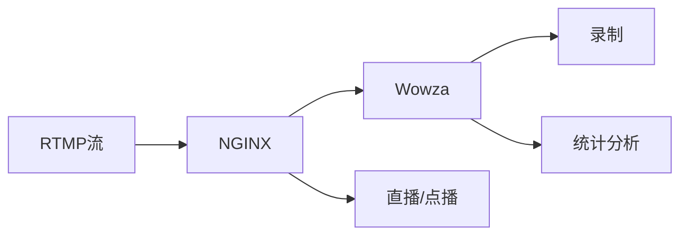

                 

# RTMP 流媒体服务配置：使用 NGINX 和 Wowza 服务器

## 1. 背景介绍

随着互联网和多媒体技术的飞速发展，实时流媒体（RTMP）服务的需求日益增长，广泛应用于网络直播、在线教育、视频会议等场景。为了满足大量并发用户的实时视频传输需求，高效稳定的流媒体服务器配置变得至关重要。

NGINX和Wowza是当前市场上流行的RTMP流媒体服务解决方案，通过它们可以构建高并发、低延迟的流媒体服务。本文将详细介绍NGINX和Wowza的配置流程，帮助读者快速搭建一个稳定、高效、安全的RTMP流媒体服务。

## 2. 核心概念与联系

### 2.1 核心概念概述

- **RTMP（Real-Time Messaging Protocol）**：一种实时传输协议，用于在客户端和服务器之间传输音频和视频数据。

- **NGINX**：一款高性能的Web服务器和反向代理服务器，支持多种协议和模块，能够灵活扩展。

- **Wowza Streaming Engine**：一款功能强大的流媒体服务器软件，支持多种协议，包括RTMP、HTTP Live Streaming（HLS）、Smooth Streaming等，提供丰富的功能如直播、点播、录制、统计分析等。

- **流媒体服务器**：用于处理、传输和管理流媒体数据的服务器，支持直播、点播等多种功能。

### 2.2 核心概念原理和架构的 Mermaid 流程图



在这个流程图中，RTMP流通过NGINX服务器转发到Wowza服务器，由Wowza服务器提供直播、点播、录制和统计分析等功能。

## 3. 核心算法原理 & 具体操作步骤

### 3.1 算法原理概述

基于NGINX和Wowza的RTMP流媒体服务配置，主要包含以下几个核心算法：

1. **反向代理算法**：NGINX作为反向代理服务器，将RTMP流从客户端请求转发到Wowza服务器。
2. **负载均衡算法**：通过配置NGINX的负载均衡算法，合理分配客户端请求到多个Wowza服务器。
3. **流媒体协议转换**：NGINX和Wowza能够支持多种流媒体协议，实现不同协议之间的转换。
4. **统计分析算法**：Wowza提供详细的流媒体统计分析功能，通过算法处理海量数据，生成分析报告。

### 3.2 算法步骤详解

1. **配置NGINX反向代理**：
   - 安装NGINX并配置反向代理功能，指定流媒体请求处理程序。
   - 设置RTMP流的转发规则，包括端口、服务器地址等。

2. **配置Wowza服务器**：
   - 安装Wowza Streaming Engine，配置直播、点播、录制等模块。
   - 设置流媒体服务器地址、端口、RTMP流等信息。

3. **NGINX和Wowza的连接**：
   - 在NGINX中配置对Wowza服务器的连接，指定流媒体协议和服务器信息。
   - 在Wowza中配置流媒体接收和处理，确保RTMP流能够正常传输。

4. **测试与优化**：
   - 使用测试工具对RTMP流进行压力测试，评估服务性能。
   - 根据测试结果进行优化，如调整负载均衡算法、优化服务器配置等。

### 3.3 算法优缺点

#### 优点：

- **高效可靠**：NGINX和Wowza均经过广泛应用和测试，具有高可靠性和稳定性。
- **灵活扩展**：NGINX支持多种协议和模块，可以灵活扩展功能。
- **功能丰富**：Wowza提供直播、点播、录制、统计分析等多种功能，满足各种应用需求。
- **易用性强**：配置界面友好，易于上手操作。

#### 缺点：

- **初始投资大**：NGINX和Wowza均需要较高的硬件配置和专业技术人员支持。
- **配置复杂**：需要一定的配置和管理经验，特别是在高并发场景下。
- **性能瓶颈**：当客户端数量过多时，NGINX和Wowza的性能可能会受到限制。

### 3.4 算法应用领域

基于NGINX和Wowza的RTMP流媒体服务配置，广泛应用于网络直播、在线教育、视频会议、流媒体点播等场景。

- **网络直播**：支持多路流媒体同时直播，提供高质量的实时视频传输。
- **在线教育**：支持课堂录制、回放、互动等在线教育功能。
- **视频会议**：支持高质量的音视频会议，提供实时互动和记录功能。
- **流媒体点播**：支持高清晰度视频的点播和缓存，提供流畅的观看体验。

## 4. 数学模型和公式 & 详细讲解 & 举例说明

### 4.1 数学模型构建

基于NGINX和Wowza的RTMP流媒体服务配置，主要涉及以下几个数学模型：

- **流媒体传输模型**：描述了RTMP流的传输过程，包括带宽、延迟、抖动等参数。
- **负载均衡模型**：通过算法计算最优的客户端请求分配方案，均衡服务器负载。
- **统计分析模型**：根据流媒体数据生成统计报告，包括流媒体访问量、用户行为等。

### 4.2 公式推导过程

#### 流媒体传输模型

流媒体传输模型可以用以下公式表示：

$$
\text{传输速率} = \frac{\text{流媒体数据量}}{\text{传输时间} + \text{网络延迟}}
$$

其中，传输速率、流媒体数据量和传输时间都是已知参数，网络延迟可以通过网络测试工具获取。

#### 负载均衡模型

负载均衡模型可以用以下公式表示：

$$
\text{负载} = \frac{\text{请求数}}{\text{服务器数}}
$$

其中，请求数是指客户端请求数量，服务器数是指参与负载均衡的服务器数量。

通过负载均衡算法，可以将负载均衡到各个服务器，防止某一服务器负载过重，保证流媒体服务的稳定性。

#### 统计分析模型

统计分析模型可以用以下公式表示：

$$
\text{统计结果} = \text{统计算法}(\text{流媒体数据})
$$

其中，统计算法包括流量统计、访问量统计、用户行为统计等，流媒体数据包括实时流媒体数据和历史流媒体数据。

### 4.3 案例分析与讲解

假设有一个网络直播平台，使用NGINX和Wowza搭建流媒体服务，同时需要支持高并发用户直播。以下是具体的配置和分析过程：

1. **NGINX配置**：
   - 配置RTMP流转发规则，设置反向代理端口和服务器地址。
   - 配置负载均衡算法，将客户端请求均衡分配到多个Wowza服务器。

2. **Wowza配置**：
   - 配置直播模块，支持多路流媒体直播。
   - 配置统计分析模块，记录实时流媒体数据，生成分析报告。

3. **性能测试**：
   - 使用流媒体测试工具，对流媒体服务进行压力测试，评估服务器性能。
   - 根据测试结果调整负载均衡算法，优化服务器配置。

## 5. 项目实践：代码实例和详细解释说明

### 5.1 开发环境搭建

1. **安装NGINX**：
   ```bash
   sudo apt-get update
   sudo apt-get install nginx
   ```

2. **安装Wowza Streaming Engine**：
   ```bash
   sudo apt-get install ffmpeg
   sudo apt-get install openjdk-11-jdk
   sudo apt-get install wget
   wget https://downloads.wowza.com/latest/rewowza_media_server.bin
   sudo dpkg -i rewowza_media_server.bin
   ```

### 5.2 源代码详细实现

以下是NGINX和Wowza服务器的配置样例代码：

#### NGINX配置文件示例

```nginx
server {
    listen 1935;
    server_name rtmp.example.com;

    location / {
        proxy_pass http://127.0.0.1:8080;
        proxy_http_version 1.1;
        proxy_set_header Upgrade $http_upgrade;
        proxy_set_header Connection 'upgrade';
        proxy_set_header Host $host;
        proxy_set_header X-Real-IP $remote_addr;
        proxy_set_header X-Forwarded-For $proxy_add_x_forwarded_for;
        proxy_set_header X-Forwarded-Proto $scheme;
    }
}
```

#### Wowza配置文件示例

```xml
<Server id="1">
    <PrimaryServer>
        <ServerAddress>127.0.0.1</ServerAddress>
        <Port>8080</Port>
        <SecurePort>8443</SecurePort>
        <Name>Server 1</Name>
    </PrimaryServer>
</Server>
```

### 5.3 代码解读与分析

#### NGINX配置文件解释

- `listen`：指定监听端口。
- `server_name`：指定服务器名称。
- `location /`：定义请求路径，指定转发规则。
- `proxy_pass`：指定转发地址。
- `proxy_set_header`：设置HTTP头信息，包括连接类型、客户端IP、客户端IP列表、请求协议等。

#### Wowza配置文件解释

- `<Server>`：定义流媒体服务器配置。
- `<PrimaryServer>`：定义主服务器配置。
- `<ServerAddress>`：指定服务器地址。
- `<Port>`：指定流媒体端口。
- `<SecurePort>`：指定安全端口。
- `<Name>`：指定服务器名称。

### 5.4 运行结果展示

通过以上配置，RTMP流媒体服务搭建完成。使用流媒体测试工具，可以对服务进行性能测试，评估流媒体传输质量、延迟、抖动等指标。

## 6. 实际应用场景

### 6.1 网络直播

网络直播平台使用NGINX和Wowza搭建流媒体服务，支持高并发用户直播，提供高质量的实时视频传输。

### 6.2 在线教育

在线教育平台使用NGINX和Wowza搭建流媒体服务，支持课堂录制、回放、互动等在线教育功能，提供流畅的观看体验。

### 6.3 视频会议

视频会议系统使用NGINX和Wowza搭建流媒体服务，支持高质量的音视频会议，提供实时互动和记录功能。

### 6.4 流媒体点播

流媒体点播系统使用NGINX和Wowza搭建流媒体服务，支持高清晰度视频的点播和缓存，提供流畅的观看体验。

## 7. 工具和资源推荐

### 7.1 学习资源推荐

- **NGINX官方文档**：详细介绍了NGINX的安装、配置、优化等操作，适合初学者和进阶用户。
- **Wowza官方文档**：详细介绍了Wowza Streaming Engine的安装、配置、优化等操作，适合流媒体服务开发者。
- **网络流媒体技术课程**：例如《流媒体网络技术》课程，涵盖RTMP、HLS、RTSP等多种流媒体协议。

### 7.2 开发工具推荐

- **XAMPP**：包含MySQL、PHP、Perl等，适用于NGINX和Wowza服务器的开发环境。
- **JIRA**：项目管理工具，适用于流媒体服务的需求管理、任务分配、进度跟踪等。
- **Ansible**：自动化配置管理工具，适用于NGINX和Wowza服务器的自动部署和配置。

### 7.3 相关论文推荐

- **NGINX网络流媒体技术论文**：介绍NGINX在流媒体服务中的应用，包括反向代理、负载均衡等技术。
- **Wowza Streaming Engine论文**：介绍Wowza Streaming Engine在流媒体服务中的应用，包括直播、点播、录制等功能。
- **实时流媒体传输协议论文**：介绍RTMP、HLS、RTSP等流媒体传输协议的理论和实践。

## 8. 总结：未来发展趋势与挑战

### 8.1 研究成果总结

基于NGINX和Wowza的RTMP流媒体服务配置，已经在网络直播、在线教育、视频会议、流媒体点播等多个场景中得到广泛应用。通过NGINX的反向代理和负载均衡功能，以及Wowza的流媒体处理和统计分析功能，可以实现高效、稳定、安全的流媒体服务。

### 8.2 未来发展趋势

未来的流媒体服务将向以下方向发展：

1. **5G技术应用**：随着5G网络的普及，流媒体服务的传输速率和稳定性将大幅提升。
2. **人工智能应用**：流媒体服务将引入人工智能技术，实现自动化的内容推荐、用户行为分析等功能。
3. **边缘计算应用**：流媒体服务将向边缘计算方向发展，通过边缘计算节点处理数据，提升响应速度和数据安全。
4. **云平台集成**：流媒体服务将与云平台集成，提供更丰富、更灵活的部署方式和扩展能力。

### 8.3 面临的挑战

尽管NGINX和Wowza流媒体服务配置已经相当成熟，但仍面临以下挑战：

1. **高并发压力**：当客户端数量过多时，NGINX和Wowza的性能可能会受到限制。
2. **网络延迟**：网络延迟和抖动对流媒体传输质量有较大影响，需要优化网络环境。
3. **数据安全**：流媒体服务需要处理大量敏感数据，数据安全问题需要重点关注。
4. **配置复杂**：配置文件较多，配置参数复杂，需要较强的技术支持。

### 8.4 研究展望

未来的研究将在以下几个方面寻求新的突破：

1. **5G优化**：针对5G网络特性，优化流媒体服务性能和稳定性。
2. **人工智能集成**：引入人工智能技术，提升流媒体服务的智能化水平。
3. **边缘计算应用**：探索边缘计算在流媒体服务中的应用，提升数据处理效率。
4. **云平台集成**：探索云平台与流媒体服务的深度集成，提供更丰富的功能和服务。

## 9. 附录：常见问题与解答

**Q1：为什么选择NGINX和Wowza作为流媒体服务器？**

A: NGINX和Wowza都是市场上成熟的流媒体服务解决方案，具有高可靠性、高稳定性、高扩展性、丰富功能等优点。NGINX作为反向代理服务器，能够灵活扩展功能；Wowza提供直播、点播、录制等多种功能，满足各种应用需求。

**Q2：NGINX和Wowza的配置过程复杂吗？**

A: 是的，NGINX和Wowza的配置过程较为复杂，需要一定的配置和管理经验。初学者可以参考官方文档，逐步进行配置和调试。

**Q3：NGINX和Wowza的性能如何？**

A: NGINX和Wowza经过广泛应用和测试，具有高可靠性和稳定性。在实际应用中，NGINX的反向代理和负载均衡功能，以及Wowza的流媒体处理和统计分析功能，能够有效提升流媒体服务的性能和稳定性。

**Q4：NGINX和Wowza的扩展能力如何？**

A: NGINX支持多种协议和模块，可以灵活扩展功能。Wowza提供丰富的模块和功能，能够根据应用需求进行扩展和优化。

**Q5：NGINX和Wowza的安全性如何？**

A: NGINX和Wowza提供多种安全措施，如SSL加密、防火墙、访问控制等，可以有效保护数据和系统的安全。

---

作者：禅与计算机程序设计艺术 / Zen and the Art of Computer Programming

