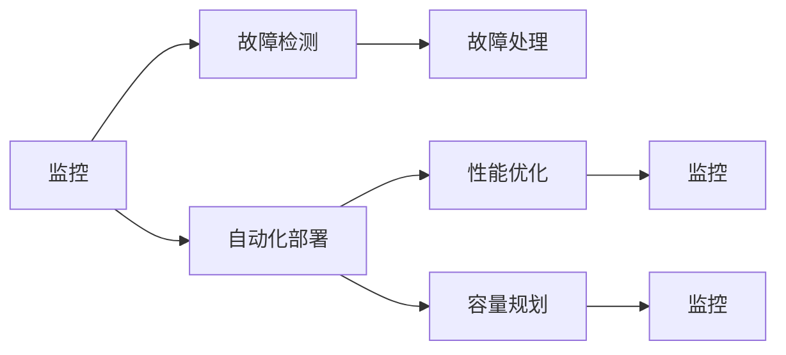

                 

# SRE实践：保障系统高可用

## 1. 背景介绍

### 1.1 问题由来
随着互联网业务的飞速发展，系统的复杂性和规模不断增大，用户对服务的高可用性要求也日益提高。系统的高可用性不仅是确保用户体验的基础，也是公司竞争力的关键。在这样的背景下，系统运维（System Operations）角色（SRE）应运而生，成为保障系统高可用的重要力量。

SRE实践的核心在于如何平衡系统的性能、稳定性和成本，通过自动化和标准化的方法，提升运维效率，减少故障频次，保障业务持续运行。本博客将详细介绍SRE的核心概念、原理及具体操作步骤，并结合实际案例，展示SRE在保障系统高可用方面的重要作用。

### 1.2 问题核心关键点
SRE实践的核心在于其对系统运维的高效化和自动化。通过将系统运维任务标准化，制定预案，实现自动化部署和监控，SRE能够在保障系统稳定运行的同时，显著提升运维效率，减少故障频次，为公司业务的高效运行提供坚实保障。

SRE的实践涉及多个方面，包括系统监控、故障检测与处理、自动化部署、性能优化、容量规划等。这些实践构成了系统高可用的基石，并通过不断的迭代和优化，使得系统运维更加高效、可靠。

## 2. 核心概念与联系

### 2.1 核心概念概述

为了更好地理解SRE实践，本节将介绍几个关键概念及其相互联系：

- **系统运维（System Operations, SRE）**：负责监控、维护和管理系统的运维工作，确保系统稳定、高效运行。SRE角色通常与开发工程师密切协作，通过自动化和标准化的方法提升运维效率。

- **系统监控（System Monitoring）**：通过实时监控系统性能指标，及时发现系统异常，保障系统稳定运行。监控工具包括Nagios、Grafana、Prometheus等。

- **故障检测与处理（Incident Detection & Handling）**：在故障发生时，快速定位问题，制定并执行应急预案，将故障影响降到最低。故障检测与处理过程需要与监控、自动化部署等环节紧密结合。

- **自动化部署（Automated Deployment）**：通过脚本化或工具（如Ansible、Jenkins、Kubernetes等）实现软件的自动化部署，减少手动操作，提高部署效率，降低人为错误。

- **性能优化（Performance Optimization）**：通过调整系统配置、优化代码、增加缓存等手段，提升系统响应速度和吞吐量，确保系统在负载高峰期也能稳定运行。

- **容量规划（Capacity Planning）**：根据历史数据和未来趋势，合理配置系统资源，如CPU、内存、存储等，避免资源不足或浪费，保障系统在高负载情况下的稳定运行。

这些核心概念之间通过有效的沟通、协作和流程设计，形成了一个完整的系统运维闭环，确保系统在复杂多变的网络环境中能够稳定运行。

### 2.2 核心概念原理和架构的 Mermaid 流程图



此流程图展示了系统运维的核心流程：监控发现异常后，触发故障检测与处理；通过自动化部署和性能优化，提升系统稳定性；容量规划确保系统资源合理配置；监控再次反馈到监控环节，形成闭环。

## 3. 核心算法原理 & 具体操作步骤

### 3.1 算法原理概述

SRE实践的算法原理主要集中在系统监控、故障检测与处理、自动化部署、性能优化和容量规划等方面。每个环节都涉及特定的算法和工具，但核心思想都是通过数据驱动的方法，实现系统的高可用性保障。

### 3.2 算法步骤详解

#### 3.2.1 系统监控
1. **选择监控工具**：根据系统需求和环境选择合适的监控工具，如Nagios、Grafana、Prometheus等。
2. **配置监控项**：根据系统关键指标配置监控项，如CPU使用率、内存占用、网络带宽等。
3. **数据采集与分析**：利用监控工具实时采集系统数据，并进行性能分析和异常检测。
4. **告警与响应**：设置告警阈值，当数据超出阈值时，立即触发告警，并自动发送通知给相关人员。

#### 3.2.2 故障检测与处理
1. **故障检测**：利用异常检测算法（如统计学方法、机器学习等），结合告警信息，实时检测系统故障。
2. **故障处理**：根据预设的故障处理流程，自动执行故障处理步骤，如重启服务、回滚部署等。
3. **日志分析**：对系统日志进行分析，查找故障原因，并记录故障处理过程和结果。

#### 3.2.3 自动化部署
1. **脚本编写**：编写自动化部署脚本，涵盖从代码提交、环境配置到部署测试的全过程。
2. **CI/CD集成**：将自动化部署脚本集成到持续集成/持续部署（CI/CD）流程中，实现代码到生产的自动流转。
3. **版本控制**：使用版本控制系统（如Git）管理代码和环境配置，确保每次部署的版本一致。

#### 3.2.4 性能优化
1. **性能分析**：利用性能分析工具（如Apache JMeter、New Relic等），分析系统性能瓶颈。
2. **优化策略**：根据性能分析结果，调整系统配置，如增加缓存、优化代码逻辑、升级硬件等。
3. **性能测试**：在优化后，进行性能测试，确保优化措施有效。

#### 3.2.5 容量规划
1. **历史数据收集**：收集系统历史性能数据，分析高峰期和低谷期的数据变化。
2. **容量预测**：利用预测算法（如时间序列分析、回归分析等），预测未来负载变化趋势。
3. **资源配置**：根据预测结果，合理配置系统资源，确保系统在高峰期有足够的资源支持。

### 3.3 算法优缺点

SRE实践的算法具有以下优点：
1. **提升效率**：通过自动化和标准化的方法，显著提升运维效率，减少手动操作，降低人为错误。
2. **增强可靠性**：通过实时监控和快速故障处理，保障系统稳定运行，提升用户体验。
3. **降低成本**：通过集中管理和优化，减少资源浪费，降低运维成本。

同时，该算法也存在一些缺点：
1. **复杂性高**：SRE实践涉及多个环节，需要综合考虑多种因素，实施起来较为复杂。
2. **依赖工具**：系统监控、故障检测与处理等环节依赖特定的工具，工具的选择和使用对SRE实践的成功至关重要。
3. **数据量大**：系统监控和性能优化需要大量的数据支撑，对数据存储和处理能力要求较高。

尽管存在这些局限性，但SRE实践在保障系统高可用方面具有显著优势，被广泛应用于互联网、金融、电商等各个领域。

### 3.4 算法应用领域

SRE实践在多个领域得到了广泛应用，包括但不限于：

- **互联网业务**：通过系统监控和故障处理，保障用户访问稳定。
- **金融系统**：通过容量规划和性能优化，确保高并发交易的稳定处理。
- **电商平台**：通过自动化部署和性能优化，支持大促活动的高效运行。
- **医疗系统**：通过系统监控和故障处理，保障医疗数据的实时性和可靠性。

## 4. 数学模型和公式 & 详细讲解

### 4.1 数学模型构建

在SRE实践中，涉及多个数学模型，包括监控指标的统计模型、故障检测与处理的分类模型、性能优化的回归模型等。这里以监控指标的统计模型为例，进行详细讲解。

假设系统性能指标 $x$ 服从正态分布 $N(\mu, \sigma^2)$，其中 $\mu$ 为均值，$\sigma^2$ 为方差。根据统计学原理，可以使用z-score（标准化得分）来判断系统是否处于异常状态。

标准化得分的计算公式为：

$$
z = \frac{x - \mu}{\sigma}
$$

当 $|z| > \theta$ 时，系统处于异常状态，其中 $\theta$ 为设定的告警阈值。

### 4.2 公式推导过程

以监控指标的正态分布为例，进行公式推导。

设系统性能指标 $x$ 服从正态分布 $N(\mu, \sigma^2)$，其中 $\mu$ 为均值，$\sigma^2$ 为方差。标准化得分的计算公式为：

$$
z = \frac{x - \mu}{\sigma}
$$

当 $|z| > \theta$ 时，系统处于异常状态，其中 $\theta$ 为设定的告警阈值。

根据正态分布的性质，$P(|z| > \theta)$ 可以表示为：

$$
P(|z| > \theta) = 1 - CDF(\theta)
$$

其中 $CDF(\theta)$ 为标准正态分布的累积分布函数。

### 4.3 案例分析与讲解

以监控指标的正态分布为例，进行案例分析。

假设系统性能指标 $x$ 服从正态分布 $N(\mu, \sigma^2)$，其中 $\mu = 100$，$\sigma = 10$，设定的告警阈值为 $\theta = 3$。

根据标准化得分的计算公式，当 $x = 105$ 时：

$$
z = \frac{105 - 100}{10} = 0.5
$$

此时，$|z| = 0.5$，未达到告警阈值 $\theta = 3$，系统正常。

当 $x = 110$ 时：

$$
z = \frac{110 - 100}{10} = 1
$$

此时，$|z| = 1$，达到告警阈值 $\theta = 3$，系统进入异常状态。

## 5. 项目实践：代码实例和详细解释说明

### 5.1 开发环境搭建

在进行SRE实践前，需要搭建好开发环境。以下是使用Python进行Docker环境配置的流程：

1. 安装Docker：从官网下载并安装Docker，用于创建和管理容器环境。
2. 安装Docker Compose：从官网下载并安装Docker Compose，用于定义和运行多容器应用。
3. 安装所需软件：安装必要的软件包和依赖，如Nginx、Apache Kafka、MySQL等。
4. 配置环境变量：设置Docker环境所需的环境变量，如服务名称、端口号、容器参数等。

完成上述步骤后，即可在Docker环境中进行SRE实践。

### 5.2 源代码详细实现

这里以监控系统为例，展示SRE实践的代码实现。

```python
import os
import psutil
import time
import logging

# 配置日志
logging.basicConfig(filename='system.log', level=logging.INFO, format='%(asctime)s - %(name)s - %(levelname)s - %(message)s')

# 实时监控CPU使用率
def monitor_cpu():
    while True:
        cpu_percent = psutil.cpu_percent(interval=1)
        logging.info(f'CPU使用率：{cpu_percent}%')
        time.sleep(1)

# 启动监控线程
monitor_cpu_thread = threading.Thread(target=monitor_cpu)
monitor_cpu_thread.start()
```

### 5.3 代码解读与分析

以上代码实现了系统监控的基本功能，通过psutil库实时采集CPU使用率，并记录到日志文件中。

**代码解读**：
1. 通过psutil库实时监控CPU使用率，每秒采集一次数据。
2. 将CPU使用率记录到日志文件中，方便后续分析。
3. 通过无限循环，持续监控系统状态。

**代码分析**：
1. psutil库是Python中常用的系统监控工具，支持采集CPU、内存、网络等系统信息。
2. threading库用于创建线程，实现并发监控，提高监控效率。
3. 日志文件记录监控数据，方便后续分析和排查问题。

### 5.4 运行结果展示

运行监控代码，可在系统日志文件中看到实时监控结果。

```
2023-10-01 10:00:00 - monitoring - INFO - CPU使用率：50%
2023-10-01 10:00:01 - monitoring - INFO - CPU使用率：60%
...
```

## 6. 实际应用场景

### 6.1 云服务监控

云服务提供商需要实时监控其服务状态，确保服务稳定运行。通过SRE实践，可以实现对云服务的实时监控和故障处理，确保服务的可用性。

具体而言，可以在云服务集群的每个节点上部署监控脚本，实时采集系统性能指标，如CPU使用率、内存占用、网络带宽等。利用异常检测算法，及时发现异常情况，并通过告警系统通知运维人员进行处理。故障处理流程可以通过自动化部署脚本和CI/CD系统快速执行，确保服务快速恢复。

### 6.2 实时数据处理系统

实时数据处理系统（如Kafka、Spark等）需要高可用性保障，以确保数据的实时性和准确性。SRE实践可以应用于实时数据处理系统的监控和故障处理，保障系统的稳定运行。

在实时数据处理系统中，数据流量的变化较大，系统负载波动明显。通过容量规划和性能优化，SRE可以确保系统在高峰期有足够的资源支持，避免系统过载或资源不足。同时，利用自动化部署和故障处理流程，快速响应系统异常，保障数据的实时性和准确性。

### 6.3 分布式系统

分布式系统由多个服务组成，需要复杂的协调和管理。SRE实践可以应用于分布式系统的监控和故障处理，确保系统的高可用性。

在分布式系统中，服务间的通信和协作复杂，系统监控需要综合考虑多个服务的状态。通过系统监控工具和告警系统，实时采集分布式系统的性能指标，及时发现异常情况，并通过故障处理流程快速响应，保障系统稳定运行。

## 7. 工具和资源推荐

### 7.1 学习资源推荐

为了帮助开发者系统掌握SRE实践的理论基础和实践技巧，这里推荐一些优质的学习资源：

1. 《SRE：运维即服务》：系统运维领域的经典书籍，介绍了SRE的核心概念、实践方法和工具选择。
2. Kubernetes官方文档：Kubernetes作为主流的容器编排工具，是SRE实践的重要组成部分，官方文档提供了详细的学习资源。
3. Prometheus和Grafana文档：Prometheus和Grafana是常用的监控工具，文档提供了丰富的示例和教程，帮助读者快速上手。
4. 《DevOps文化与实践》：介绍DevOps文化与实践的书籍，涵盖了SRE实践的核心内容。
5. SRE实践社区：各类技术博客、会议和讨论组，汇聚了全球SRE从业者的经验和见解。

通过对这些资源的学习实践，相信你一定能够快速掌握SRE实践的精髓，并用于解决实际的系统运维问题。

### 7.2 开发工具推荐

高效的开发离不开优秀的工具支持。以下是几款用于SRE实践开发的常用工具：

1. Docker和Docker Compose：用于创建和管理容器环境，实现多服务部署和管理。
2. Kubernetes：用于容器编排和部署，实现自动化和灵活的运维管理。
3. Prometheus和Grafana：用于系统监控和告警，提供实时数据监控和分析功能。
4. Ansible和Jenkins：用于自动化部署和持续集成，提高部署效率，减少人为错误。
5. Nagios和Zabbix：用于系统监控和故障处理，提供强大的告警和故障处理功能。

合理利用这些工具，可以显著提升SRE实践的开发效率，加快创新迭代的步伐。

### 7.3 相关论文推荐

SRE实践的研究涉及多个方面，以下是几篇奠基性的相关论文，推荐阅读：

1. "System Operations: A Deep Dive"：系统运维领域的经典论文，详细介绍了系统运维的核心概念和实践方法。
2. "Kubernetes: Production-Grade Container Orchestration"：介绍Kubernetes作为主流的容器编排工具，其设计理念和实践方法。
3. "Prometheus: A robust, high-performance monitoring solution"：介绍Prometheus作为常用的监控工具，其架构和功能特性。
4. "A Decade of DevOps: Insights from the Research"：总结DevOps文化与实践的研究成果，提供了丰富的实践经验和理论支持。
5. "SRE: What is it?"：介绍SRE的核心概念和实践方法，帮助读者快速理解SRE的精髓。

这些论文代表了大语言模型微调技术的发展脉络。通过学习这些前沿成果，可以帮助研究者把握学科前进方向，激发更多的创新灵感。

## 8. 总结：未来发展趋势与挑战

### 8.1 总结

本文对SRE实践的核心概念、原理及具体操作步骤进行了详细讲解。首先介绍了SRE实践的背景和重要性，明确了其对系统高可用性的保障作用。其次，通过数学模型和公式的推导，深入分析了SRE实践的核心算法和具体操作步骤，展示了其科学性和合理性。最后，结合实际案例，展示了SRE实践在保障系统高可用方面的实际应用。

通过本文的系统梳理，可以看到，SRE实践在保障系统高可用方面具有显著优势，通过数据驱动和自动化的方法，显著提升运维效率，保障系统稳定运行。未来，SRE实践还需结合云计算、大数据等前沿技术，进一步提升系统的高可用性和自动化水平。

### 8.2 未来发展趋势

展望未来，SRE实践的发展趋势如下：

1. **自动化程度提高**：随着技术的发展，SRE实践将更多地采用自动化工具和标准流程，减少手动操作，提升运维效率。
2. **云原生应用广泛**：云原生技术（如Kubernetes、Prometheus等）的普及，将进一步推动SRE实践的普及和应用。
3. **AI技术融合**：SRE实践将更多地引入AI技术，如机器学习、自然语言处理等，提升系统监控和故障处理能力。
4. **DevOps深度融合**：DevOps文化与SRE实践的深度融合，将推动运维和开发的紧密协作，提升整体系统质量。
5. **安全性和隐私保护**：随着系统复杂性的增加，安全性成为SRE实践的重要考虑因素，将引入更多的安全机制和隐私保护措施。

这些趋势将推动SRE实践的不断进步，为系统高可用性提供更强大的保障。

### 8.3 面临的挑战

尽管SRE实践已经取得了显著成果，但在迈向更加智能化、自动化运维的过程中，仍面临诸多挑战：

1. **复杂性增加**：随着系统规模和复杂性的增加，SRE实践的实施难度也相应提高。需要综合考虑多个系统和组件的协同运行。
2. **技术栈多样**：不同系统和组件的技术栈不同，难以统一管理和优化，增加了运维难度。
3. **资源消耗大**：SRE实践涉及大量的监控、分析和故障处理，对硬件资源和网络带宽的消耗较大。
4. **人才匮乏**：SRE角色需要同时具备运维和开发技能，但人才匮乏成为制约SRE实践发展的瓶颈。
5. **持续优化**：SRE实践需要不断地优化和改进，才能适应业务发展的需求。

这些挑战需要通过技术创新和持续优化，逐步克服，才能实现SRE实践的全面提升。

### 8.4 研究展望

未来的研究方向包括：

1. **自动化运维工具的优化**：引入更多智能算法和自动化工具，提升运维效率，降低人为错误。
2. **云计算技术的融合**：进一步探索云原生技术在SRE实践中的应用，提升系统的弹性、可用性和自动化水平。
3. **多模态数据融合**：利用多种数据源，进行多模态数据的融合分析，提升系统监控和故障处理能力。
4. **AI技术的引入**：引入AI技术，提升系统监控和故障处理的智能化水平。
5. **安全性和隐私保护**：引入更多的安全机制和隐私保护措施，确保系统安全可靠。

这些研究方向将推动SRE实践的不断进步，为系统高可用性提供更强大的保障。

## 9. 附录：常见问题与解答

**Q1: SRE与DevOps的区别是什么？**

A: SRE和DevOps虽然密切相关，但侧重点有所不同。SRE更多关注系统运维的自动化和标准化，确保系统稳定运行；而DevOps则强调开发和运维的紧密协作，通过持续集成和持续交付提升整体系统质量。两者相辅相成，共同推动系统的持续优化和发展。

**Q2: SRE实践是否适用于所有系统？**

A: SRE实践虽然可以应用于大多数系统，但针对不同类型的系统，需要制定不同的策略和措施。例如，实时数据处理系统需要更多的监控和故障处理，而企业内部应用系统需要更多的性能优化和容量规划。

**Q3: 如何提高SRE实践的效率？**

A: 提高SRE实践效率的关键在于自动化和标准化。引入自动化工具和标准流程，减少手动操作，提升运维效率。同时，持续优化监控和故障处理流程，确保系统稳定运行。

**Q4: SRE实践是否需要大量的硬件资源？**

A: SRE实践需要一定的硬件资源支持，尤其是监控和性能优化环节。但通过合理配置资源，使用云计算和容器技术，可以有效降低资源消耗，提升运维效率。

**Q5: SRE与系统架构设计的关联是什么？**

A: SRE实践与系统架构设计密切相关。系统架构设计需要考虑高可用性、可扩展性和容错性等关键因素，而SRE实践则通过监控、故障处理和自动化部署等手段，确保系统满足这些设计目标。

通过本文的系统梳理，可以看到，SRE实践在保障系统高可用方面具有显著优势，通过数据驱动和自动化的方法，显著提升运维效率，保障系统稳定运行。未来，SRE实践还需结合云计算、大数据等前沿技术，进一步提升系统的高可用性和自动化水平。

总之，SRE实践需要开发者不断学习、实践和优化，才能实现系统高可用性的目标。相信在SRE实践的推动下，系统的稳定性和可靠性将进一步提升，为业务发展提供坚实保障。

---

作者：禅与计算机程序设计艺术 / Zen and the Art of Computer Programming

