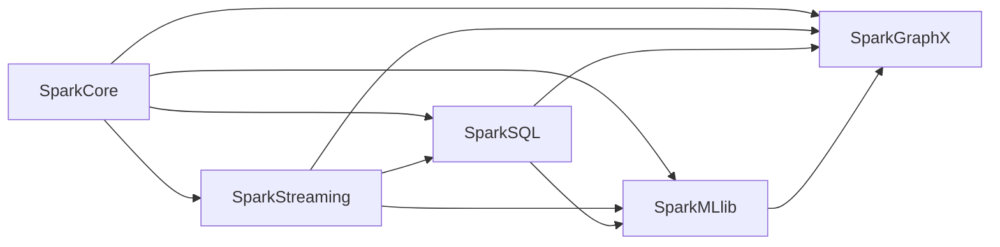

                 

# Spark大数据实时计算框架

> 关键词：Spark, 大数据, 实时计算, 流式处理, 容错性, 弹性, 数据仓库, 机器学习

## 1. 背景介绍

### 1.1 问题由来
随着互联网和移动互联网的飞速发展，全球产生了海量数据。在各个行业中，数据驱动决策、优化流程、提升效率和盈利能力等需求日益增加。为解决这些挑战，大数据技术应运而生。大数据技术的核心在于数据集成、存储、计算与分析，旨在挖掘数据的内在价值，为企业决策提供有力支持。

近年来，大数据技术经历了迅猛发展。由Apache基金会主持开发的Apache Hadoop项目，首创了基于HDFS（Hadoop Distributed File System）的分布式存储系统和MapReduce分布式计算框架，成功推动了大数据技术的普及应用。然而，Hadoop架构存在一些不足，例如：

1. **延迟较大**：传统的MapReduce模式数据处理延迟较大，无法满足实时数据处理需求。
2. **系统复杂**：Hadoop生态系统复杂，学习和使用门槛较高。
3. **存储和计算分离**：Hadoop对存储和计算分离管理，无法高效利用硬件资源。
4. **扩展性问题**：Hadoop纵向扩展较难，难以支持海量数据处理。

针对这些问题，Spark项目应运而生。Spark是一种通用的、快速的、分布式计算系统，能够支持批处理、流处理、图计算等多种数据处理模式。Spark的核心特性包括：

1. **内存计算**：Spark将中间结果保存在内存中，大幅提升计算速度。
2. **分布式计算**：Spark使用弹性分布式数据集（RDD），支持大规模数据处理。
3. **流式处理**：Spark Streaming支持实时数据流处理，提供微秒级延迟。
4. **机器学习库**：Spark MLlib提供了强大的机器学习支持，涵盖数据预处理、算法实现、模型评估等全流程。
5. **交互式查询**：Spark SQL支持交互式SQL查询，方便数据处理和分析。
6. **容错性**：Spark具备完善的容错机制，确保数据处理可靠。
7. **弹性扩展**：Spark支持水平扩展，可以根据数据量和任务需求动态调整资源。

### 1.2 问题核心关键点
Spark的核心优势在于其高性能、高容错、弹性扩展的特性。Spark的大数据处理能力覆盖了批处理、流处理、图计算等场景，并支持多种数据源和数据存储格式，如Hadoop、Hive、Parquet、JSON等。此外，Spark还提供了丰富的生态系统和工具，如Spark SQL、Spark Streaming、Spark MLlib、Spark GraphX等。

Spark的架构设计是其成功的关键之一。Spark采用弹性分布式数据集（RDD）作为数据抽象，支持分布式计算和数据并行处理。Spark中的RDD可以通过不同的操作（如map、reduce、join等）进行转换和操作，其容错性通过线性的RDD检查点（checkpoint）机制实现。Spark的执行引擎采用基于内存的DAG（Directed Acyclic Graph）调度，确保任务在高效内存中进行计算。

## 2. 核心概念与联系

### 2.1 核心概念概述

为更好地理解Spark大数据实时计算框架，本节将介绍几个密切相关的核心概念：

- **Spark Core**：Spark的核心部分，包括弹性分布式数据集（RDD）、计算任务调度与执行等核心功能。
- **Spark Streaming**：Spark的流式处理组件，支持微秒级延迟的实时数据流处理。
- **Spark SQL**：Spark的交互式查询组件，支持SQL查询和数据仓库功能。
- **Spark MLlib**：Spark的机器学习库，提供多种机器学习算法和工具。
- **Spark GraphX**：Spark的图计算组件，支持大规模图数据处理。

这些核心概念共同构成了Spark的大数据处理框架，提供了批处理、流处理、图处理和交互式查询等丰富功能，满足不同场景下的数据处理需求。

### 2.2 核心概念原理和架构的 Mermaid 流程图



该图展示了Spark Core与其他组件之间的关系。Spark Core是Spark的基础部分，支持分布式计算和数据处理。Spark Streaming、Spark SQL、Spark MLlib和Spark GraphX分别提供了流处理、交互式查询、机器学习和图计算功能，都建立在Spark Core之上，共享其分布式计算和内存计算的优势。

## 3. 核心算法原理 & 具体操作步骤

### 3.1 算法原理概述

Spark的核心算法原理主要包括以下几个方面：

- **弹性分布式数据集（RDD）**：Spark使用RDD作为分布式计算的基本数据抽象。RDD表示一个分布式集合并提供了map、reduce、join等多种操作。Spark中的每个操作都会生成一个新的RDD，新的RDD可以依赖于之前的RDD，形成DAG调度图。
- **弹性调度与执行**：Spark通过弹性调度引擎实现任务的自动优化和调度。Spark中的任务被划分为多个阶段（Stage），每个阶段包括多个分区（Partition），Spark会根据任务复杂度和资源状况进行合理的任务划分和调度，确保任务高效执行。
- **内存计算与容错机制**：Spark采用基于内存的计算方式，将中间结果保存在内存中，减少磁盘IO操作，提升计算速度。同时，Spark通过RDD检查点机制实现容错，确保数据处理可靠性。

### 3.2 算法步骤详解

Spark的核心算法步骤主要包括以下几个方面：

**Step 1: 安装与配置**

- 安装Spark：根据操作系统和硬件配置，从Apache官网下载相应的Spark安装包。
- 配置环境：设置Spark的核心配置参数，如Spark Master、Spark Worker、Spark应用程序等。
- 启动Spark：启动Spark Master和Spark Worker，确保Spark集群正常工作。

**Step 2: 数据加载与转换**

- 数据源选择：根据数据存储格式（如HDFS、Hive、Parquet、JSON等），选择合适的数据源。
- RDD创建：使用Spark RDD API创建分布式数据集，可以使用Spark Shell或Spark Python API进行操作。
- 数据转换：对RDD进行map、reduce、filter等操作，处理数据并生成新的RDD。

**Step 3: 分布式计算与任务调度**

- DAG调度：Spark中的任务被划分为多个阶段（Stage），每个阶段包括多个分区（Partition）。Spark会根据任务复杂度和资源状况进行合理的任务划分和调度，确保任务高效执行。
- 任务执行：Spark会将每个分区分配给一个Worker节点执行，同时使用内存计算方式处理数据，确保计算效率。

**Step 4: 数据存储与输出**

- 数据持久化：将计算结果持久化到磁盘或分布式文件系统中，方便后续使用。
- 数据输出：将计算结果以文件、数据库、流等多种形式输出，支持多目标数据处理。

### 3.3 算法优缺点

Spark的核心算法具有以下优点：

1. **高性能**：Spark使用内存计算方式，大幅提升计算速度。
2. **高容错**：Spark通过RDD检查点机制实现容错，确保数据处理可靠性。
3. **弹性扩展**：Spark支持水平扩展，可以根据数据量和任务需求动态调整资源。
4. **丰富的API支持**：Spark提供了多种API接口，支持Scala、Java、Python、R等多种编程语言，方便用户使用。
5. **生态系统完善**：Spark具备完善的生态系统，支持SQL、Streaming、ML、Graph等多种应用场景。

同时，Spark也存在一些缺点：

1. **内存限制**：Spark对内存要求较高，对于大规模数据处理需要较大的内存资源。
2. **复杂度高**：Spark的生态系统和配置参数较多，学习和使用门槛较高。
3. **安装和部署难度大**：Spark集群搭建和配置较为复杂，需要较高的运维技能。
4. **数据一致性问题**：Spark中的数据一致性保障依赖于RDD检查点机制，可能存在一定延迟和开销。

### 3.4 算法应用领域

Spark的大数据处理能力覆盖了多个应用领域，包括但不限于以下几类：

- **批处理**：Spark支持批处理模式，可用于数据仓库、ETL（Extract, Transform, Load）等场景。
- **流处理**：Spark Streaming支持实时数据流处理，可用于监控、日志分析、实时推荐等场景。
- **机器学习**：Spark MLlib提供了强大的机器学习支持，可用于分类、回归、聚类等场景。
- **图计算**：Spark GraphX支持大规模图数据处理，可用于社交网络分析、推荐系统等场景。
- **交互式查询**：Spark SQL支持SQL查询和数据仓库功能，可用于数据分析和报表生成等场景。
- **大数据管理**：Spark结合Hadoop生态系统，支持大数据管理，可用于数据存储和元数据管理等场景。

## 4. 数学模型和公式 & 详细讲解

### 4.1 数学模型构建

Spark的核心数学模型主要基于分布式计算和内存计算，以下以Spark Streaming为例，介绍其数学模型构建：

Spark Streaming使用微秒级延迟的实时数据流处理。假设输入数据流为 $D=\{d_1, d_2, ..., d_t, ..., d_n\}$，Spark Streaming的输入数据流处理可以表示为：

$$
\hat{D} = \{d_1, d_2, ..., d_t, ..., d_n\}
$$

其中，$d_t$ 表示第 $t$ 个数据元组，$\hat{D}$ 表示经过Spark Streaming处理后的数据流。

Spark Streaming通过批量处理的方式对数据流进行计算，将数据流划分为多个时间窗口，每个时间窗口内的数据处理为一个微批（Micro-batch），通常为2秒或1秒。Spark Streaming的计算过程可以表示为：

$$
\hat{d}_t = f(d_t, d_{t-1}, ..., d_{t-\delta})
$$

其中，$f$ 表示微批处理函数，$d_{t-\delta}$ 表示历史数据，$\delta$ 表示微批大小。

Spark Streaming的计算过程可以进一步表示为：

$$
\hat{D} = \{f(d_t, d_{t-1}, ..., d_{t-\delta})\}_{t=1}^n
$$

### 4.2 公式推导过程

Spark Streaming的微批处理过程可以分为两个步骤：

**Step 1: 数据采样**

Spark Streaming会对输入数据流进行采样，获取历史数据 $d_{t-\delta}$，作为微批处理的输入。假设数据流 $D$ 在时间窗口 $[t-1, t]$ 内的平均速率是 $\mu$，则数据采样过程可以表示为：

$$
d_t = \mu * \delta
$$

其中，$\delta$ 表示微批大小。

**Step 2: 微批处理**

Spark Streaming对微批进行处理，将数据流划分为多个子流，每个子流进行单独处理。假设微批处理函数为 $f$，则微批处理过程可以表示为：

$$
\hat{d}_t = f(d_t, d_{t-1}, ..., d_{t-\delta})
$$

将微批处理结果 $\hat{d}_t$ 添加到输出数据流 $\hat{D}$ 中，最终得到处理后的数据流 $\hat{D}$。

### 4.3 案例分析与讲解

以Spark Streaming在日志分析中的应用为例，进行详细讲解：

假设某公司生产系统中，每秒钟生成一条日志记录，每条日志记录包含多个字段，如时间戳、IP地址、请求路径、请求方法等。Spark Streaming可以将每条日志记录转化为微批进行处理，实时分析日志数据。

假设每条日志记录的平均大小为100字节，微批大小为2秒，则每2秒钟Spark Streaming会将2秒内的日志记录组成一个微批进行处理。假设数据采样率 $\mu$ 为2条/秒，则Spark Streaming会将每个微批处理结果添加到输出数据流 $\hat{D}$ 中，实现实时日志分析。

## 5. 项目实践：代码实例和详细解释说明

### 5.1 开发环境搭建

在开始Spark项目实践前，需要准备好开发环境。以下是使用Spark Shell进行开发的示例环境配置流程：

1. 安装Spark：根据操作系统和硬件配置，从Apache官网下载相应的Spark安装包。
2. 配置环境：设置Spark的核心配置参数，如Spark Master、Spark Worker、Spark应用程序等。
3. 启动Spark：启动Spark Master和Spark Worker，确保Spark集群正常工作。

### 5.2 源代码详细实现

以下是一个简单的Spark Streaming应用示例，用于实时计算单词频率：

```python
from pyspark import SparkContext, SparkConf

# 初始化Spark上下文
conf = SparkConf().setMaster('local').setAppName('WordCount')
sc = SparkContext(conf=conf)

# 加载数据
data = sc.textFile("hdfs://localhost:9000/user/input.txt")

# 分词
words = data.flatMap(lambda line: line.split(" "))

# 计算单词频率
wordCounts = words.map(lambda word: (word, 1)).reduceByKey(lambda a, b: a + b)

# 输出结果
wordCounts.foreach(lambda x: print(x))
```

### 5.3 代码解读与分析

上述代码实现了Spark Streaming的实时单词频率计算。具体步骤如下：

1. 初始化Spark上下文：设置Spark Master和Spark Worker，创建Spark上下文。
2. 加载数据：使用`textFile`函数加载HDFS上的文本文件。
3. 分词：使用`flatMap`函数将文本文件中的每一行字符串进行分词。
4. 计算单词频率：使用`map`函数将单词转化为键值对，使用`reduceByKey`函数计算每个单词的出现频率。
5. 输出结果：使用`foreach`函数将计算结果输出到控制台。

在实际应用中，Spark Streaming可以处理多种数据源和数据格式，通过使用不同的RDD操作进行数据处理和计算。开发者可以根据具体场景和需求，灵活运用Spark API，实现各种数据处理和计算任务。

## 6. 实际应用场景

### 6.1 智能推荐系统

Spark的流处理能力可以用于实时推荐系统，分析用户行为数据，实时计算推荐结果。例如，某电商网站可以使用Spark Streaming实时处理用户的浏览、点击、购买行为数据，根据用户的历史行为和实时行为，实时计算推荐结果，提升用户满意度。

### 6.2 实时监控系统

Spark的流处理能力可以用于实时监控系统，实时处理和分析监控数据，发现异常情况并及时报警。例如，某金融公司可以使用Spark Streaming实时处理交易数据、用户登录数据等，实时检测异常交易和异常登录行为，保障系统安全。

### 6.3 实时数据仓库

Spark的批处理和流处理能力可以用于实时数据仓库，实时处理和分析数据，快速生成报表和分析结果。例如，某公司可以使用Spark Streaming实时处理生产数据，实时计算生产报表，帮助生产部门优化生产流程。

### 6.4 未来应用展望

随着Spark的不断发展和优化，其应用场景将不断扩展和深化。未来，Spark将进一步优化内存计算、容错机制和弹性扩展，支持更多数据源和数据格式，提供更高效、更可靠的数据处理能力。

Spark还将与其他大数据技术如Hadoop、Flink等进行更深入的融合，构建更强大、更灵活的大数据处理生态系统。例如，Spark可以将Hadoop的存储能力和Flink的实时处理能力进行结合，构建更高效、更灵活的数据处理系统。

## 7. 工具和资源推荐

### 7.1 学习资源推荐

为了帮助开发者系统掌握Spark的核心技术，以下推荐一些优质的学习资源：

1. **《Spark官方文档》**：Spark官方文档提供了详细的API文档、配置参数和配置示例，是Spark学习的必备资料。
2. **《Spark实战》**：《Spark实战》一书详细介绍了Spark的核心概念、编程模型和实践案例，适合初学者和进阶用户。
3. **《Spark课程》**：各大在线教育平台（如Coursera、edX、Udemy等）提供了丰富的Spark课程，包括理论知识、实践案例和项目实战。
4. **Apache Spark Meetup**：Spark Meetup组织定期的技术交流和分享活动，邀请Spark专家和用户分享经验和技术，交流学习。
5. **Apache Spark GitHub**：Apache Spark GitHub社区提供了丰富的代码示例和项目源码，适合开发者学习和参考。

### 7.2 开发工具推荐

为了提高Spark项目的开发效率，以下推荐一些常用的开发工具：

1. **IntelliJ IDEA**：IntelliJ IDEA是Java开发的IDE，支持Spark插件，提供代码自动补全、代码调试、代码运行等高效开发功能。
2. **PyCharm**：PyCharm是Python开发的IDE，支持Spark和Scala插件，提供高效的开发和调试功能。
3. **Spark Shell**：Spark Shell是Spark的命令行工具，支持简单的数据处理和计算任务，适合快速开发和调试。
4. **Spark Python API**：Spark Python API是Spark的Python编程接口，支持Scala、Java、Python等多种编程语言，方便用户使用。
5. **Spark SQL**：Spark SQL是Spark的交互式查询组件，支持SQL查询和数据仓库功能，方便数据处理和分析。

### 7.3 相关论文推荐

Spark的核心技术源于学术界的持续研究，以下是几篇奠基性的相关论文，推荐阅读：

1. **《Resilient Distributed Datasets: A Fault-Tolerant Abstraction for In-Memory Cluster Computing》**：Resilient Distributed Datasets（RDD）是Spark的核心数据抽象，本文详细介绍了RDD的设计原理和实现机制。
2. **《Spark: Cluster Computing with Fault Tolerance》**：本文是Spark的原论文，详细介绍了Spark的设计理念、架构和核心组件。
3. **《Fast and Fault-Tolerant Distributed Collective Operations》**：本文详细介绍了Spark的分布式计算和容错机制，奠定了Spark的高效计算基础。
4. **《Spark Streaming: Fault-Tolerant, Scalable Streaming with Apache Hadoop》**：本文介绍了Spark Streaming的设计原理和实现机制，奠定了Spark流处理的基础。
5. **《Spark GraphX: A Graph Processing Library for Apache Spark》**：本文介绍了Spark GraphX的设计原理和实现机制，奠定了Spark图计算的基础。

这些论文代表了大数据处理技术的发展脉络，通过学习这些前沿成果，可以帮助研究者把握学科前进方向，激发更多的创新灵感。

## 8. 总结：未来发展趋势与挑战

### 8.1 研究成果总结

Spark作为一款高性能、高容错、弹性扩展的大数据处理框架，已经成为大数据处理的主流工具之一。Spark的核心算法原理包括弹性分布式数据集（RDD）、分布式计算、内存计算和容错机制，支持批处理、流处理、图计算和交互式查询等多种数据处理模式。Spark的生态系统完善，具备丰富的API接口和工具支持，支持多种数据源和数据格式。

### 8.2 未来发展趋势

Spark的未来发展趋势主要包括以下几个方面：

1. **内存计算优化**：Spark将继续优化内存计算性能，提升计算速度和资源利用率。
2. **流处理优化**：Spark将优化流处理性能，提升实时数据处理能力。
3. **弹性扩展优化**：Spark将优化弹性扩展机制，提升集群性能和资源利用率。
4. **机器学习优化**：Spark将优化机器学习库，提升机器学习算法性能。
5. **图计算优化**：Spark将优化图计算性能，提升大规模图数据处理能力。
6. **交互式查询优化**：Spark将优化交互式查询性能，提升数据处理和分析速度。
7. **跨平台支持**：Spark将优化跨平台支持，支持更多操作系统和硬件平台。
8. **生态系统完善**：Spark将完善生态系统，提供更多工具和库，支持更多数据源和数据格式。

### 8.3 面临的挑战

尽管Spark取得了显著的成就，但在迈向更加智能化、普适化应用的过程中，仍然面临一些挑战：

1. **内存限制**：Spark对内存要求较高，对于大规模数据处理需要较大的内存资源。
2. **系统复杂性**：Spark的生态系统和配置参数较多，学习和使用门槛较高。
3. **安装和部署难度**：Spark集群搭建和配置较为复杂，需要较高的运维技能。
4. **数据一致性问题**：Spark中的数据一致性保障依赖于RDD检查点机制，可能存在一定延迟和开销。
5. **扩展性问题**：Spark的扩展性在某些场景下仍然存在瓶颈，难以应对海量数据处理。

### 8.4 研究展望

为了应对这些挑战，未来的研究需要在以下几个方面寻求新的突破：

1. **内存优化**：Spark需要优化内存计算性能，提升计算速度和资源利用率。
2. **流处理优化**：Spark需要优化流处理性能，提升实时数据处理能力。
3. **弹性扩展优化**：Spark需要优化弹性扩展机制，提升集群性能和资源利用率。
4. **机器学习优化**：Spark需要优化机器学习库，提升机器学习算法性能。
5. **图计算优化**：Spark需要优化图计算性能，提升大规模图数据处理能力。
6. **交互式查询优化**：Spark需要优化交互式查询性能，提升数据处理和分析速度。
7. **跨平台支持**：Spark需要优化跨平台支持，支持更多操作系统和硬件平台。
8. **生态系统完善**：Spark需要完善生态系统，提供更多工具和库，支持更多数据源和数据格式。

总之，Spark作为一款高性能、高容错、弹性扩展的大数据处理框架，具备丰富的功能和完善的生态系统。Spark将继续优化内存计算、容错机制和弹性扩展，支持更多数据源和数据格式，提供更高效、更可靠的数据处理能力。未来，Spark必将在大数据处理领域发挥更加重要的作用，推动人工智能技术的深入应用。

## 9. 附录：常见问题与解答

**Q1：Spark的核心组件是什么？**

A: Spark的核心组件主要包括：

1. **弹性分布式数据集（RDD）**：Spark使用RDD作为分布式计算的基本数据抽象，支持map、reduce、join等多种操作。
2. **Spark Core**：Spark Core是Spark的基础部分，包括计算任务调度与执行等核心功能。
3. **Spark Streaming**：Spark Streaming支持实时数据流处理，提供微秒级延迟。
4. **Spark SQL**：Spark SQL支持SQL查询和数据仓库功能。
5. **Spark MLlib**：Spark MLlib提供强大的机器学习支持。
6. **Spark GraphX**：Spark GraphX支持大规模图数据处理。

这些组件共同构成了Spark的大数据处理框架，提供丰富的功能和强大的处理能力。

**Q2：Spark的流处理机制是什么？**

A: Spark的流处理机制基于微批处理（Micro-batch Processing），将数据流划分为多个时间窗口，每个时间窗口内的数据处理为一个微批。Spark Streaming对每个微批进行处理，将微批处理结果添加到输出数据流中，实现实时数据处理。Spark Streaming的微批处理过程可以分为两个步骤：数据采样和微批处理。

**Q3：Spark的弹性扩展机制是什么？**

A: Spark的弹性扩展机制基于YARN（Yet Another Resource Negotiator）调度器，支持水平扩展。Spark集群可以根据任务需求动态调整资源，确保任务高效执行。Spark的弹性扩展机制包括任务划分、任务调度、任务执行和任务监控等环节，确保集群性能和资源利用率。

**Q4：Spark的机器学习库是什么？**

A: Spark的机器学习库是Spark MLlib，提供多种机器学习算法和工具。Spark MLlib支持数据预处理、算法实现、模型评估等全流程，涵盖分类、回归、聚类等常用算法。Spark MLlib还提供了各种工具函数和数据转换，方便用户进行机器学习任务开发和应用。

**Q5：Spark的未来发展方向是什么？**

A: Spark的未来发展方向主要包括以下几个方面：

1. **内存计算优化**：Spark将继续优化内存计算性能，提升计算速度和资源利用率。
2. **流处理优化**：Spark将优化流处理性能，提升实时数据处理能力。
3. **弹性扩展优化**：Spark将优化弹性扩展机制，提升集群性能和资源利用率。
4. **机器学习优化**：Spark将优化机器学习库，提升机器学习算法性能。
5. **图计算优化**：Spark将优化图计算性能，提升大规模图数据处理能力。
6. **交互式查询优化**：Spark将优化交互式查询性能，提升数据处理和分析速度。
7. **跨平台支持**：Spark将优化跨平台支持，支持更多操作系统和硬件平台。
8. **生态系统完善**：Spark将完善生态系统，提供更多工具和库，支持更多数据源和数据格式。

总之，Spark作为一款高性能、高容错、弹性扩展的大数据处理框架，具备丰富的功能和完善的生态系统。Spark将继续优化内存计算、容错机制和弹性扩展，支持更多数据源和数据格式，提供更高效、更可靠的数据处理能力。未来，Spark必将在大数据处理领域发挥更加重要的作用，推动人工智能技术的深入应用。

---

作者：禅与计算机程序设计艺术 / Zen and the Art of Computer Programming

