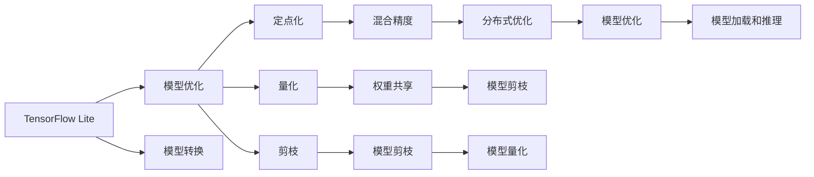

                 

## TensorFlow Lite：移动设备上的AI应用

> 关键词：TensorFlow Lite, 移动设备, 人工智能, AI应用, 模型优化, 模型部署, 模型压缩, 移动应用开发

## 1. 背景介绍

### 1.1 问题由来
近年来，人工智能(AI)技术在移动设备上得到了广泛应用，特别是在智能手机、平板和物联网设备等轻量级硬件上。然而，标准的深度学习框架如TensorFlow、PyTorch等，需要强大的计算资源和丰富的硬件资源支持，难以在移动设备上高效运行。为了满足移动设备的AI应用需求，Google开源了TensorFlow Lite(TFLite)，以提供轻量级、高效能的AI模型部署平台。

TFLite的诞生，解决了移动设备资源受限的问题，使得AI应用可以轻量级运行在各种移动设备上，加速了AI技术在移动应用领域的落地，提升了用户体验，拓展了AI应用的边界。TFLite的性能和优化技术，使其成为了移动AI应用开发的关键工具。

### 1.2 问题核心关键点
TFLite的核心目标是将大型的AI模型压缩和优化，以适配各种移动设备的计算和存储资源限制。其核心原理包括模型优化、模型压缩、模型转换等关键技术，使得AI模型能够在移动设备上以接近原模型的精度和性能运行。

具体来说，TFLite包括以下几个关键点：
1. **模型优化**：TFLite提供了多种优化技术，如定点化、量化等，以减少模型大小和计算量。
2. **模型压缩**：TFLite通过剪枝、混合精度等方法，进一步压缩模型以适配移动设备资源。
3. **模型转换**：TFLite支持多种深度学习框架的模型转换，如TensorFlow、Keras等，使得开发者能够轻松地将模型部署到移动设备上。
4. **模型加载和推理**：TFLite优化了模型加载和推理的流程，提供了高效的模型部署方式。

这些关键技术使得TFLite成为了移动AI应用开发的重要工具，支持开发者在移动设备上快速、高效地部署AI应用。

### 1.3 问题研究意义
TFLite的研究和应用具有重要意义：

1. **加速移动AI应用落地**：TFLite使得深度学习模型能够轻量化运行在移动设备上，大大降低了AI应用的开发和部署成本，加速了AI技术在移动应用领域的普及。
2. **提升用户体验**：通过优化和压缩AI模型，TFLite使得移动应用中的AI功能更加流畅和快速，提升了用户的使用体验。
3. **拓展AI应用边界**：TFLite支持多种AI应用场景，如图像识别、语音识别、自然语言处理等，为AI技术在更广泛的应用场景中的探索和应用提供了可能。
4. **推动移动计算发展**：TFLite的成功应用，促进了移动设备AI功能的不断提升，推动了移动计算和智能设备的快速发展。

## 2. 核心概念与联系

### 2.1 核心概念概述

TFLite的核心概念包括以下几个方面：

- **TensorFlow Lite**：Google开发的轻量级AI模型部署平台，提供了模型压缩、优化、转换等功能，支持多种移动设备。
- **模型优化**：通过定点化、量化、剪枝等方法，减少模型大小和计算量，提升模型在移动设备上的运行效率。
- **模型压缩**：通过剪枝、混合精度等技术，进一步压缩模型，使其更轻量，适配移动设备资源。
- **模型转换**：将不同深度学习框架的模型转换为TFLite模型，以便于在移动设备上部署。
- **模型加载和推理**：优化模型加载和推理流程，提供高效的模型部署方式，确保模型在移动设备上的快速运行。

这些核心概念构成了TFLite的技术基础，使得AI模型能够在移动设备上高效运行，推动了AI技术在移动设备上的广泛应用。

### 2.2 核心概念原理和架构的 Mermaid 流程图



这个Mermaid流程图展示了TFLite的核心技术架构和流程：

1. **模型优化**：包括定点化、量化、剪枝等技术，减少模型大小和计算量。
2. **模型压缩**：通过混合精度、权重共享、分布式优化等技术，进一步压缩模型。
3. **模型转换**：将不同深度学习框架的模型转换为TFLite模型。
4. **模型加载和推理**：优化模型加载和推理流程，提供高效的模型部署方式。

## 3. 核心算法原理 & 具体操作步骤
### 3.1 算法原理概述

TFLite的核心算法原理基于模型优化、模型压缩和模型转换等技术。其核心思想是通过一系列的技术手段，将大型深度学习模型适配到资源受限的移动设备上，同时保持模型的精度和性能。

### 3.2 算法步骤详解

TFLite的模型优化和压缩过程主要包括以下几个步骤：

1. **模型转换**：将现有深度学习框架（如TensorFlow、Keras等）的模型转换为TFLite模型。
2. **模型优化**：对模型进行优化，包括定点化、量化、剪枝等技术，以减少模型大小和计算量。
3. **模型压缩**：进一步压缩模型，以适配移动设备的资源限制。
4. **模型加载和推理**：优化模型加载和推理流程，确保模型在移动设备上的高效运行。

### 3.3 算法优缺点

**优点**：
1. **高效运行**：TFLite通过优化和压缩技术，使得AI模型能够在移动设备上高效运行，无需高性能计算资源。
2. **模型适配**：支持多种深度学习框架的模型转换，使得开发者能够轻松地将模型部署到移动设备上。
3. **资源优化**：通过剪枝、混合精度等技术，进一步压缩模型，适配移动设备的计算和存储资源限制。

**缺点**：
1. **精度损失**：一些优化和压缩技术可能会引入精度损失，需要开发者权衡精度和性能。
2. **开发复杂度**：TFLite的学习曲线较陡峭，需要开发者掌握一定的模型优化和压缩技术。
3. **功能限制**：TFLite支持的功能和深度学习框架存在一定差异，可能无法支持所有复杂的模型结构和算法。

### 3.4 算法应用领域

TFLite在多个领域得到了广泛应用，包括但不限于：

- **图像识别**：通过优化和压缩的模型，支持实时图像识别功能，如人脸识别、物体识别等。
- **语音识别**：通过优化和压缩的模型，支持实时语音识别功能，如语音助手、语音转文本等。
- **自然语言处理**：通过优化和压缩的模型，支持实时文本处理功能，如语音到文本、文本分类等。
- **推荐系统**：通过优化和压缩的模型，支持实时推荐系统，如电商推荐、新闻推荐等。
- **智能家居**：通过优化和压缩的模型，支持智能家居设备之间的互动和控制，如智能音箱、智能门锁等。

## 4. 数学模型和公式 & 详细讲解 & 举例说明

### 4.1 数学模型构建

TFLite的数学模型构建基于深度学习框架的模型优化和压缩技术。以下以一个简单的卷积神经网络(CNN)模型为例，展示TFLite的数学模型构建过程。

假设原始CNN模型的数学公式为：
$$
f(x) = \sum_{i=1}^{n} w_i h_i(x) + b
$$
其中，$x$为输入，$w_i$为权重，$h_i(x)$为卷积核，$b$为偏置。

### 4.2 公式推导过程

TFLite对CNN模型进行优化和压缩，主要包括以下几个步骤：

1. **定点化**：将浮点数乘法和加法操作转换为定点运算，减少计算量。
2. **量化**：将模型的权重和激活值进行量化，进一步压缩模型。
3. **剪枝**：去除网络中不必要的连接，减少模型参数和计算量。
4. **混合精度**：采用混合精度技术，减少模型计算量。

以定点化和量化为例，进行详细推导：

**定点化**：将浮点数操作转换为定点运算，可以减少计算量。假设将浮点数乘法 $w_i h_i(x) + b$ 转换为定点乘法 $w_i^{pu} h_i^{pu}(x) + b^{pu}$，其中 $w_i^{pu}$ 和 $h_i^{pu}$ 为定点乘法的权重和卷积核，$b^{pu}$ 为定点偏置。

**量化**：将模型的权重和激活值进行量化，可以减少模型大小。假设将原始权重 $w_i$ 量化为 $w_i^{q}$，激活值 $h_i(x)$ 量化为 $h_i^{q}(x)$。

### 4.3 案例分析与讲解

以一个简单的图像分类任务为例，展示TFLite的模型优化和压缩过程：

1. **模型构建**：使用TensorFlow构建一个简单的CNN模型，包含卷积层、池化层和全连接层。
2. **模型优化**：使用TFLite提供的优化器，进行定点化和量化操作，减少计算量和模型大小。
3. **模型压缩**：使用TFLite提供的剪枝工具，去除不必要的连接，进一步压缩模型。
4. **模型加载和推理**：将优化和压缩后的模型加载到移动设备上，进行实时推理。

## 5. 项目实践：代码实例和详细解释说明

### 5.1 开发环境搭建

在开始TFLite的开发之前，需要搭建相应的开发环境。以下是搭建环境的详细步骤：

1. **安装TensorFlow**：使用pip安装TensorFlow，并配置好所需的依赖库。
2. **安装TFLite**：使用pip安装TFLite库，并配置好所需的依赖库。
3. **配置开发环境**：配置好PyCharm等开发工具，并进行环境变量设置。
4. **下载模型数据**：下载所需的图像数据集，并进行预处理。

### 5.2 源代码详细实现

以下是使用TensorFlow构建和优化CNN模型的代码实现：

```python
import tensorflow as tf
from tensorflow import keras

# 定义CNN模型
model = keras.Sequential([
    keras.layers.Conv2D(32, (3, 3), activation='relu', input_shape=(28, 28, 1)),
    keras.layers.MaxPooling2D((2, 2)),
    keras.layers.Flatten(),
    keras.layers.Dense(10, activation='softmax')
])

# 编译模型
model.compile(optimizer='adam', loss='sparse_categorical_crossentropy', metrics=['accuracy'])

# 训练模型
model.fit(train_images, train_labels, epochs=10, validation_data=(test_images, test_labels))

# 保存模型
model.save('my_model.h5')
```

### 5.3 代码解读与分析

上述代码实现了使用TensorFlow构建一个简单的CNN模型，并进行训练和保存。具体分析如下：

1. **模型定义**：使用keras.Sequential定义了一个包含卷积层、池化层和全连接层的CNN模型。
2. **模型编译**：使用adam优化器和交叉熵损失函数编译模型。
3. **模型训练**：使用train_images和train_labels训练模型，并在validation_data上进行验证。
4. **模型保存**：将训练好的模型保存为.h5文件，以便后续优化和部署。

### 5.4 运行结果展示

训练完成后，可以使用TFLite对模型进行优化和压缩：

```python
import tensorflow as tf
import tensorflow_lite as lite

# 加载模型
model = keras.models.load_model('my_model.h5')

# 转换为TFLite模型
converter = tf.lite.TFLiteConverter.from_keras_model(model)
tflite_model = converter.convert()

# 加载TFLite模型
interpreter = lite.Interpreter(model_content=tflite_model)
interpreter.allocate_tensors()

# 获取输入和输出张量
input_details = interpreter.get_input_details()
output_details = interpreter.get_output_details()

# 加载图像数据并进行推理
input_data = np.array([img_data]).astype('float32')
input_data = np.expand_dims(input_data, axis=0)
interpreter.set_tensor(input_details[0]['index'], input_data)
interpreter.invoke()

# 获取输出结果
output_data = interpreter.get_tensor(output_details[0]['index'])[0]
```

## 6. 实际应用场景

### 6.1 智能家居

TFLite在智能家居领域得到了广泛应用，通过优化和压缩的模型，支持智能设备之间的互动和控制。例如，智能音箱可以通过语音识别和自然语言处理技术，实现语音控制其他智能设备，如智能门锁、智能灯光等。

### 6.2 健康医疗

TFLite在健康医疗领域也有着广泛的应用，通过优化和压缩的模型，支持实时监测和分析患者数据。例如，智能手表可以通过优化和压缩的模型，实时监测心率、血压等生理指标，并通过自然语言处理技术，与患者进行互动，提供健康建议。

### 6.3 金融服务

TFLite在金融服务领域也有着重要的应用，通过优化和压缩的模型，支持实时分析和预测股市趋势。例如，银行可以通过优化和压缩的模型，实时监测市场舆情，预测股票走势，并进行投资决策。

## 7. 工具和资源推荐

### 7.1 学习资源推荐

为了帮助开发者系统掌握TFLite的相关技术，以下是一些优质的学习资源：

1. **TFLite官方文档**：Google提供的TFLite官方文档，包含详细的API文档和示例代码，是学习TFLite的重要资源。
2. **TensorFlow官网**：TensorFlow官网提供了大量关于TFLite的教程和示例，帮助开发者深入理解TFLite的原理和应用。
3. **PyTorch官网**：PyTorch官网提供了TFLite的教程和示例，帮助开发者从不同深度学习框架的角度学习TFLite。
4. **Kaggle**：Kaggle平台提供了大量使用TFLite进行模型优化和压缩的竞赛和项目，帮助开发者实战练习。

### 7.2 开发工具推荐

以下是一些常用的TFLite开发工具：

1. **PyCharm**：一款功能强大的Python开发工具，支持TensorFlow和TFLite的集成开发。
2. **Android Studio**：Google提供的Android开发工具，支持在Android设备上部署和测试TFLite模型。
3. **Flutter**：Google提供的跨平台开发框架，支持在iOS、Android和Web等平台上部署TFLite模型。
4. **AWS**：亚马逊提供的云计算平台，支持在云平台上部署和优化TFLite模型。

### 7.3 相关论文推荐

以下是一些关于TFLite的相关论文，供读者深入阅读：

1. **TensorFlow Lite: A Compilation Toolchain for Mobile and Edge Devices**：Google开发的TFLite论文，介绍了TFLite的架构和技术细节。
2. **Towards a Unified Model Representation for Deep Learning**：斯坦福大学的研究，讨论了深度学习模型的统一表示，为TFLite的模型转换提供了理论基础。
3. **MobileNets: Efficient Convolutional Neural Networks for Mobile Vision Applications**：Google的研究，介绍了MobileNet模型，并讨论了其在移动设备上的应用。

## 8. 总结：未来发展趋势与挑战

### 8.1 研究成果总结

TFLite的研究成果显著，其高效、轻量、易用的特点，使其在移动设备上得到了广泛应用。通过优化和压缩技术，TFLite使得深度学习模型能够在移动设备上高效运行，极大地推动了AI技术在移动应用领域的普及。

### 8.2 未来发展趋势

未来，TFLite的发展趋势如下：

1. **模型优化和压缩技术**：随着AI模型的不断增长，TFLite将继续优化和压缩技术，使得模型能够在更低的计算和存储资源下运行。
2. **跨平台支持**：TFLite将支持更多的平台和设备，使得模型能够在更多场景下应用。
3. **功能扩展**：TFLite将支持更多的AI应用场景，如计算机视觉、自然语言处理等。
4. **社区发展**：TFLite将加强社区建设，鼓励开发者贡献代码和工具，共同推动TFLite的发展。

### 8.3 面临的挑战

TFLite在发展过程中也面临一些挑战：

1. **精度损失**：优化和压缩技术可能会引入精度损失，需要开发者权衡精度和性能。
2. **资源限制**：移动设备的计算和存储资源有限，TFLite需要进一步优化模型以适应这些限制。
3. **功能不足**：TFLite目前支持的功能和深度学习框架存在一定差异，可能无法支持所有复杂的模型结构和算法。
4. **开发者门槛**：TFLite的学习曲线较陡峭，需要开发者掌握一定的模型优化和压缩技术。

### 8.4 研究展望

未来的研究展望如下：

1. **提高精度**：探索新的优化和压缩技术，在保持模型压缩的同时，进一步提高模型的精度。
2. **扩展功能**：加强TFLite的功能扩展，支持更多的AI应用场景和深度学习框架。
3. **降低门槛**：开发更多的工具和资源，降低开发者使用TFLite的门槛，使得更多人能够快速上手。
4. **社区共建**：加强TFLite社区建设，鼓励开发者贡献代码和工具，共同推动TFLite的发展。

## 9. 附录：常见问题与解答

**Q1：如何使用TFLite进行模型优化和压缩？**

A: 使用TFLite提供的优化器和转换器，将深度学习模型转换为TFLite模型，并进行优化和压缩。具体步骤如下：
1. 使用TensorFlow构建深度学习模型。
2. 使用TFLite提供的优化器，对模型进行定点化、量化、剪枝等优化。
3. 使用TFLite提供的转换器，将优化后的模型转换为TFLite模型。
4. 使用TFLite提供的解释器，加载和推理优化后的模型。

**Q2：TFLite支持的深度学习框架有哪些？**

A: TFLite支持多种深度学习框架的模型转换，如TensorFlow、Keras、PyTorch等。具体步骤如下：
1. 使用TensorFlow、Keras、PyTorch等深度学习框架构建模型。
2. 使用TFLite提供的转换器，将深度学习框架的模型转换为TFLite模型。
3. 使用TFLite提供的解释器，加载和推理优化后的模型。

**Q3：TFLite的性能和精度如何？**

A: TFLite的性能和精度取决于模型的大小和复杂度。通过优化和压缩技术，TFLite可以在保持模型精度的同时，显著提高模型在移动设备上的性能。具体步骤如下：
1. 使用TensorFlow构建深度学习模型。
2. 使用TFLite提供的优化器，对模型进行定点化、量化、剪枝等优化。
3. 使用TFLite提供的转换器，将优化后的模型转换为TFLite模型。
4. 使用TFLite提供的解释器，加载和推理优化后的模型。

**Q4：TFLite的应用场景有哪些？**

A: TFLite支持多种AI应用场景，如计算机视觉、自然语言处理、智能家居、健康医疗、金融服务等。具体步骤如下：
1. 根据应用场景选择相应的AI任务，如图像识别、语音识别、自然语言处理等。
2. 使用TensorFlow构建深度学习模型。
3. 使用TFLite提供的优化器，对模型进行定点化、量化、剪枝等优化。
4. 使用TFLite提供的转换器，将优化后的模型转换为TFLite模型。
5. 使用TFLite提供的解释器，加载和推理优化后的模型。

**Q5：如何提高TFLite模型的精度？**

A: 提高TFLite模型的精度可以通过以下方法实现：
1. 优化和压缩技术：通过优化和压缩技术，减少模型大小和计算量，提高模型精度。
2. 提高数据质量：使用高质量的数据进行训练，提高模型泛化能力。
3. 提高模型复杂度：在资源允许的情况下，提高模型的复杂度，以提高模型精度。
4. 调整超参数：调整深度学习模型的超参数，如学习率、批大小、优化器等，以提高模型精度。

**Q6：TFLite有哪些开发工具？**

A: TFLite的开发工具包括PyCharm、Android Studio、Flutter、AWS等。具体步骤如下：
1. 在PyCharm中安装TensorFlow和TFLite的扩展。
2. 使用Android Studio开发Android应用，并加载TFLite模型进行推理。
3. 使用Flutter开发跨平台应用，并加载TFLite模型进行推理。
4. 在AWS云平台上部署和优化TFLite模型。

**Q7：TFLite的学习曲线陡峭吗？**

A: TFLite的学习曲线相对较陡峭，需要开发者掌握一定的模型优化和压缩技术。具体步骤如下：
1. 学习TFLite的基本概念和架构。
2. 使用TensorFlow构建深度学习模型。
3. 使用TFLite提供的优化器，对模型进行定点化、量化、剪枝等优化。
4. 使用TFLite提供的转换器，将优化后的模型转换为TFLite模型。
5. 使用TFLite提供的解释器，加载和推理优化后的模型。

作者：禅与计算机程序设计艺术 / Zen and the Art of Computer Programming

