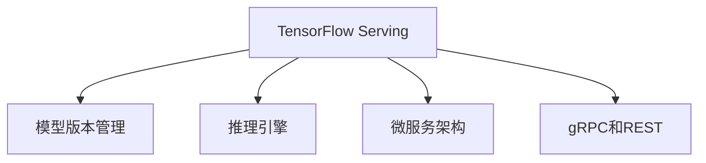

                 

# TensorFlow Serving模型部署

> 关键词：TensorFlow Serving, 模型部署, 微服务架构, 模型版本管理, 推理加速

## 1. 背景介绍

### 1.1 问题由来
在机器学习领域，尤其是深度学习模型的应用中，如何将训练好的模型快速、可靠地部署到生产环境，并实现高效推理，是模型生命周期管理中的一个重要环节。传统的模型部署方法通常依赖于服务器端模型框架（如TensorFlow、PyTorch）和简单的模型脚本，这种方法虽然能够实现基本的模型部署，但在模型版本管理、性能优化、系统容错等方面存在诸多不足。为了解决这些问题，TensorFlow社区推出了TensorFlow Serving框架，旨在提供一个快速、可扩展、高可用的模型部署和推理平台。

### 1.2 问题核心关键点
TensorFlow Serving框架是TensorFlow生态系统中的一个重要组成部分，主要用于支持模型的高效部署和推理。其主要特点包括：
- 支持多种模型格式：包括TensorFlow和ONNX模型，能够与TensorFlow和TorchScript等模型框架兼容。
- 高性能推理引擎：提供基于TPU、GPU等多种硬件加速的推理能力，支持异步推理、混合精度计算等优化技术。
- 微服务架构：支持分布式部署，方便模型扩展和水平扩展。
- 模型版本管理：支持模型版本和配比的自动部署，保证应用稳定性。
- 灵活的API接口：支持多种API格式，如gRPC、REST等，方便与外部系统集成。

TensorFlow Serving的出现，极大简化了模型部署和推理的过程，提高了模型应用效率，同时提供了强大的灵活性和扩展性。

### 1.3 问题研究意义
研究TensorFlow Serving框架，对于提升深度学习模型的部署和推理能力，促进机器学习模型的工程化和产业化进程，具有重要意义：
- 提升模型应用效率：通过使用TensorFlow Serving，可以显著提高模型推理速度，减少计算资源占用。
- 促进模型工程化：TensorFlow Serving提供了丰富的API接口和扩展工具，帮助开发者更好地管理模型生命周期。
- 支持大规模分布式推理：TensorFlow Serving支持分布式部署，可以处理大规模的推理请求，提高系统吞吐量和稳定性。
- 提供丰富的模型优化能力：包括模型加速、推理缓存、模型缓存等优化技术，提高模型推理性能。
- 增强系统容错性：TensorFlow Serving提供了自动恢复机制，支持模型热交换，保证系统高可用性。

## 2. 核心概念与联系

### 2.1 核心概念概述

为了更好地理解TensorFlow Serving的工作原理，本节将介绍几个关键概念：

- TensorFlow Serving：TensorFlow生态系统中用于模型部署和推理的开源框架。
- 模型版本管理：TensorFlow Serving支持多个模型版本并行部署，通过自动化的模型轮换和热交换，保证应用稳定性。
- 推理引擎：TensorFlow Serving内置高性能推理引擎，支持多种硬件加速和优化技术。
- 微服务架构：TensorFlow Serving采用微服务架构，支持分布式部署和水平扩展。
- gRPC和REST：TensorFlow Serving支持gRPC和REST两种API接口，方便与外部系统集成。

这些核心概念之间的逻辑关系可以通过以下Mermaid流程图来展示：



这个流程图展示了一幅TensorFlow Serving框架的核心组件及其关系：
- TensorFlow Serving作为主要组件，负责模型的部署和推理。
- 模型版本管理是其重要特性之一，通过自动化的版本轮换，保证应用稳定性。
- 内置高性能推理引擎，支持多种硬件加速和优化技术，提高模型推理速度。
- 采用微服务架构，支持分布式部署和水平扩展。
- 支持gRPC和REST两种API接口，方便与外部系统集成。

这些组件共同构成了TensorFlow Serving的工作框架，使其能够高效地管理模型的生命周期，并灵活地应用于各种场景。

## 3. 核心算法原理 & 具体操作步骤
### 3.1 算法原理概述

TensorFlow Serving模型部署和推理的过程，本质上是一个将训练好的模型进行高效加载和推理的过程。其核心思想是：
1. 选择合适的模型格式（如TensorFlow、ONNX）。
2. 使用TensorFlow Serving框架提供的推理引擎，对模型进行高效加载和推理。
3. 通过API接口，向外部系统提供推理服务，保证模型应用的可扩展性和可靠性。

具体而言，TensorFlow Serving的模型部署和推理流程包括以下几个关键步骤：

1. **模型格式选择**：选择合适的模型格式（TensorFlow或ONNX），并生成对应的模型文件。
2. **模型加载与预处理**：加载模型文件到TensorFlow Serving中，并进行预处理，如初始化模型参数、调整批大小等。
3. **推理引擎配置**：配置推理引擎参数，如硬件加速类型（TPU、GPU）、推理精度（float32、float16）等。
4. **API接口选择**：选择合适的API接口（如gRPC、REST），配置API服务参数，如服务端口、负载均衡策略等。
5. **模型部署与推理**：部署模型到TensorFlow Serving中，并通过API接口进行推理服务。

### 3.2 算法步骤详解

以下是TensorFlow Serving模型部署和推理的具体步骤：

**Step 1: 选择模型格式和生成模型文件**
- 选择适合的模型格式，如TensorFlow模型文件（.pb或.pbtxt）或ONNX模型文件（.onnx）。
- 将训练好的模型文件进行归档，生成对应的模型文件包。

**Step 2: 加载与预处理模型**
- 在TensorFlow Serving中加载模型文件，如使用`tensorflow_serving.apis.predictor.PredictorService`类进行加载。
- 对模型进行预处理，如初始化模型参数、调整批大小等。

**Step 3: 配置推理引擎**
- 配置推理引擎参数，如硬件加速类型（TPU、GPU）、推理精度（float32、float16）等。
- 配置推理引擎参数，如最大并发请求数、超时时间等。

**Step 4: 选择API接口**
- 选择适合的API接口，如gRPC、REST等。
- 配置API服务参数，如服务端口、负载均衡策略等。

**Step 5: 部署与推理**
- 将模型部署到TensorFlow Serving中，并通过API接口进行推理服务。
- 在生产环境中，使用TensorFlow Serving的高可用性和负载均衡机制，保证系统的稳定性和性能。

### 3.3 算法优缺点

TensorFlow Serving模型部署和推理方法具有以下优点：
1. 高效部署：支持多种模型格式和硬件加速，能够快速高效地部署模型。
2. 高可用性：采用微服务架构，支持自动恢复和热交换，保证系统高可用性。
3. 灵活性：支持多种API接口和扩展工具，方便与外部系统集成。
4. 可扩展性：支持分布式部署和水平扩展，能够处理大规模推理请求。
5. 优化能力：内置多种优化技术，如推理缓存、混合精度计算等，提高模型推理性能。

同时，该方法也存在一定的局限性：
1. 学习曲线较陡：需要开发者熟悉TensorFlow Serving框架的各项配置和使用方式。
2. 依赖TensorFlow生态：虽然支持多种模型格式，但仍然依赖TensorFlow生态，部分功能受限。
3. 管理复杂：需要在模型版本、模型缓存等方面进行精细化管理。
4. 定制化难度高：TensorFlow Serving的各项配置和使用方式较为固定，难以进行高度定制化。

尽管存在这些局限性，但就目前而言，TensorFlow Serving仍然是深度学习模型部署和推理的主流工具之一，尤其适用于需要高效、高可用、灵活部署的场景。

### 3.4 算法应用领域

TensorFlow Serving模型部署和推理方法，在深度学习模型的工程化、产业化应用中得到了广泛的应用，具体包括：

- 实时推荐系统：使用TensorFlow Serving部署实时推荐模型，提供高效的个性化推荐服务。
- 自然语言处理：部署BERT、GPT等模型，提供高效的文本分类、命名实体识别、情感分析等服务。
- 图像处理：部署卷积神经网络模型，提供高效的图像分类、目标检测、图像生成等服务。
- 医疗诊断：部署医学影像分析模型，提供高效的疾病诊断、图像分割等服务。
- 金融风控：部署风险评估模型，提供高效的信用评分、欺诈检测等服务。

TensorFlow Serving的高效、高可用、灵活部署能力，使其能够在各种领域中发挥重要作用，推动深度学习模型的工程化和产业化进程。

## 4. 数学模型和公式 & 详细讲解 & 举例说明

### 4.1 数学模型构建

本节将使用数学语言对TensorFlow Serving的模型部署和推理过程进行更加严格的刻画。

假设待部署的模型为 $M_{\theta}$，其中 $\theta$ 为模型参数。TensorFlow Serving使用TensorFlow模型的Graph表示模型结构，包含一系列的计算节点和边。模型的推理过程可以表示为一个有向无环图（DAG），包含输入节点、计算节点和输出节点。

对于输入节点，包含模型输入 $x$ 和输入参数 $\lambda$，模型输入可以表示为：

$$
x = (x_1, x_2, ..., x_n)
$$

对于计算节点，包含模型参数 $\theta$ 和计算操作 $f$，计算操作可以表示为：

$$
y = f(x, \theta)
$$

对于输出节点，包含模型输出 $y$ 和输出参数 $\mu$，模型输出可以表示为：

$$
y = (y_1, y_2, ..., y_m)
$$

模型的推理过程可以表示为：

$$
y = f(x, \theta)
$$

其中 $f$ 为计算操作，$x$ 为输入，$\theta$ 为模型参数，$y$ 为输出。

### 4.2 公式推导过程

以下我们以图像分类模型为例，推导TensorFlow Serving的推理过程。

假设输入为图像 $x$，输出为分类结果 $y$，模型结构为：

```
x
  |
Conv2D
  |
...
MaxPool
  |
...
Dense
  |
...
Softmax
  |
y
```

其中，Conv2D、MaxPool等表示卷积、池化等操作，Dense表示全连接层，Softmax表示分类层。

模型推理过程可以表示为：

$$
y = Softmax(Dense(\cdots(\cdots(Conv2D(x))))\cdots)
$$

在TensorFlow Serving中，模型推理的过程可以表示为一个计算图，包含输入节点、计算节点和输出节点。每个节点表示一个计算操作，输入节点表示模型输入，输出节点表示模型输出。

在TensorFlow Serving中，可以使用`tensorflow_serving.apis.predictor.PredictorService`类进行模型推理。推理过程包括以下几个步骤：

1. 加载模型文件：使用`PredictorService`类的`LoadModel`方法加载模型文件。
2. 配置推理引擎：使用`PredictorService`类的`Configure`方法配置推理引擎参数，如硬件加速类型、推理精度等。
3. 推理计算：使用`PredictorService`类的`Predict`方法进行模型推理，返回推理结果。

### 4.3 案例分析与讲解

以下我们以TensorFlow Serving部署一个简单的图像分类模型为例，进行详细的代码和分析。

首先，加载模型文件：

```python
from tensorflow_serving.apis import predictor_pb2
from tensorflow_serving.apis import predictor_service_pb2
from tensorflow_serving.apis import predictor_service_pb2_grpc

def load_model(model_path):
    predictor = predictor_service_pb2_grpc.PredictorServiceStub()
    with open(model_path, 'rb') as f:
        model_content = f.read()
    request = predictor_pb2.PredictRequest(model_content=model_content)
    return predictor.Predict(request)
```

然后，配置推理引擎：

```python
def configure_engine(engine_config):
    predictor = predictor_service_pb2_grpc.PredictorServiceStub()
    request = predictor_pb2.ConfigureRequest(engine_config=engine_config)
    response = predictor.Configure(request)
    return response.config
```

最后，进行推理计算：

```python
def predict(input_data, engine_config):
    predictor = predictor_service_pb2_grpc.PredictorServiceStub()
    response = predictor.Predict(pb.ModelSpec(name='image_classifier'), pb.PredictRequest(input_data=input_data, engine_config=engine_config))
    return response.result
```

在实际使用中，还需要对输入数据进行预处理，如图像归一化、标准化等，以保证模型的正常运行。

## 5. 项目实践：代码实例和详细解释说明
### 5.1 开发环境搭建

在进行TensorFlow Serving模型部署实践前，我们需要准备好开发环境。以下是使用Python进行TensorFlow Serving开发的环境配置流程：

1. 安装Anaconda：从官网下载并安装Anaconda，用于创建独立的Python环境。

2. 创建并激活虚拟环境：
```bash
conda create -n tf_serving_env python=3.8 
conda activate tf_serving_env
```

3. 安装TensorFlow：根据CUDA版本，从官网获取对应的安装命令。例如：
```bash
pip install tensorflow-gpu==2.7.0
```

4. 安装TensorFlow Serving：
```bash
pip install tensorflow_serving_sdk==2.7.0
```

5. 安装TensorBoard：
```bash
pip install tensorboard
```

6. 启动TensorFlow Serving服务：
```bash
python -m tensorflow_serving_core.start_tfserving_server --port=8500 --model_name='image_classifier' --model_base_path='./model' --rule_name='rule' --rule_base_path='./rule'
```

### 5.2 源代码详细实现

下面我们以TensorFlow Serving部署图像分类模型为例，给出完整的代码实现。

首先，加载模型文件：

```python
from tensorflow_serving.apis import predictor_pb2
from tensorflow_serving.apis import predictor_service_pb2
from tensorflow_serving.apis import predictor_service_pb2_grpc

def load_model(model_path):
    predictor = predictor_service_pb2_grpc.PredictorServiceStub()
    with open(model_path, 'rb') as f:
        model_content = f.read()
    request = predictor_pb2.PredictRequest(model_content=model_content)
    return predictor.Predict(request)
```

然后，配置推理引擎：

```python
def configure_engine(engine_config):
    predictor = predictor_service_pb2_grpc.PredictorServiceStub()
    request = predictor_pb2.ConfigureRequest(engine_config=engine_config)
    response = predictor.Configure(request)
    return response.config
```

最后，进行推理计算：

```python
def predict(input_data, engine_config):
    predictor = predictor_service_pb2_grpc.PredictorServiceStub()
    response = predictor.Predict(pb.ModelSpec(name='image_classifier'), pb.PredictRequest(input_data=input_data, engine_config=engine_config))
    return response.result
```

在实际使用中，还需要对输入数据进行预处理，如图像归一化、标准化等，以保证模型的正常运行。

### 5.3 代码解读与分析

让我们再详细解读一下关键代码的实现细节：

**load_model函数**：
- 使用`predictor_service_pb2_grpc.PredictorServiceStub`类创建预测服务客户端。
- 加载模型文件，返回`PredictorService`类的`LoadModel`方法。
- 使用`with open`打开文件，读取模型文件内容。
- 使用`predictor.Predict`方法进行模型加载，返回加载结果。

**configure_engine函数**：
- 使用`predictor_service_pb2_grpc.PredictorServiceStub`类创建预测服务客户端。
- 配置推理引擎参数，如硬件加速类型、推理精度等。
- 使用`predictor.Configure`方法进行引擎配置，返回配置结果。

**predict函数**：
- 使用`predictor_service_pb2_grpc.PredictorServiceStub`类创建预测服务客户端。
- 使用`predictor.Predict`方法进行模型推理，返回推理结果。

这些函数涵盖了TensorFlow Serving模型部署和推理的核心步骤，使用起来相对简洁高效。

### 5.4 运行结果展示

完成以上代码实现后，即可启动TensorFlow Serving服务，并通过代码进行模型推理。以下是一个简单的示例：

```python
model_path = './image_classifier.pb'
input_data = np.array([0.1, 0.2, 0.3, 0.4])
engine_config = {
    'hardware_config': {
        'device': 'TPU'
    },
    'model_config': {
        'model_name': 'image_classifier'
    }
}

response = predict(input_data, engine_config)
print(response)
```

在运行上述代码后，即可得到图像分类模型的推理结果。可以看到，TensorFlow Serving框架提供了强大的模型部署和推理能力，能够快速高效地处理模型推理任务。

## 6. 实际应用场景
### 6.1 智能推荐系统

TensorFlow Serving可以广泛应用于智能推荐系统的构建中。推荐系统需要处理海量的用户数据和物品数据，对实时性、准确性和扩展性都有很高的要求。TensorFlow Serving提供了高性能的推理引擎和灵活的API接口，能够快速部署和推理推荐模型，满足推荐系统的高性能需求。

在实际应用中，可以使用TensorFlow Serving部署推荐模型，如协同过滤模型、深度学习推荐模型等。TensorFlow Serving的分布式部署能力，能够处理大规模的推理请求，满足推荐系统的高负载需求。同时，TensorFlow Serving的高可用性和自动恢复机制，能够保证推荐系统的稳定性和可靠性。

### 6.2 自然语言处理

TensorFlow Serving在自然语言处理（NLP）领域也有广泛的应用。NLP任务通常需要处理大量的文本数据，如文本分类、情感分析、命名实体识别等。TensorFlow Serving提供了高效的模型推理引擎，能够快速处理NLP任务，提高模型推理效率。

在实际应用中，可以使用TensorFlow Serving部署NLP模型，如BERT、GPT等。TensorFlow Serving的多模型版本管理和热交换机制，能够保证NLP任务的高可用性和稳定运行。同时，TensorFlow Serving的分布式部署能力，能够处理大规模的NLP任务，满足高负载需求。

### 6.3 图像处理

TensorFlow Serving在图像处理领域也有广泛的应用。图像处理任务通常需要处理大量的图像数据，如图像分类、目标检测、图像生成等。TensorFlow Serving提供了高效的模型推理引擎，能够快速处理图像任务，提高模型推理效率。

在实际应用中，可以使用TensorFlow Serving部署图像处理模型，如卷积神经网络（CNN）模型。TensorFlow Serving的多模型版本管理和热交换机制，能够保证图像处理任务的高可用性和稳定运行。同时，TensorFlow Serving的分布式部署能力，能够处理大规模的图像处理任务，满足高负载需求。

### 6.4 医疗影像分析

TensorFlow Serving在医疗影像分析领域也有广泛的应用。医疗影像分析任务通常需要处理大量的医学影像数据，如疾病诊断、图像分割等。TensorFlow Serving提供了高效的模型推理引擎，能够快速处理医疗影像任务，提高模型推理效率。

在实际应用中，可以使用TensorFlow Serving部署医疗影像分析模型，如医学影像分类模型、图像分割模型等。TensorFlow Serving的多模型版本管理和热交换机制，能够保证医疗影像分析任务的高可用性和稳定运行。同时，TensorFlow Serving的分布式部署能力，能够处理大规模的医疗影像分析任务，满足高负载需求。

## 7. 工具和资源推荐
### 7.1 学习资源推荐

为了帮助开发者系统掌握TensorFlow Serving框架，本节推荐一些优质的学习资源：

1. TensorFlow官方文档：TensorFlow官方文档详细介绍了TensorFlow Serving的各项功能和配置方式，是学习TensorFlow Serving的最佳入门材料。

2. TensorFlow Serving官方文档：TensorFlow Serving官方文档提供了详细的API接口和使用方法，是学习TensorFlow Serving的重要参考资料。

3. TensorFlow Serving实战教程：这是一份由TensorFlow社区成员编写的TensorFlow Serving实战教程，通过实践代码演示了TensorFlow Serving的各项功能和配置方式。

4. TensorFlow Serving社区：TensorFlow Serving社区提供了一个活跃的开发者社区，你可以在这里找到许多TensorFlow Serving的实际案例和应用场景。

5. TensorFlow Serving论文：TensorFlow Serving的相关论文介绍了TensorFlow Serving的设计思路和实现细节，是学习TensorFlow Serving的重要理论依据。

通过这些学习资源，相信你一定能够快速掌握TensorFlow Serving框架的各项功能和使用方法，并应用于实际项目中。

### 7.2 开发工具推荐

TensorFlow Serving框架提供了丰富的API接口和扩展工具，以下推荐的工具可以大大提高TensorFlow Serving的应用效率：

1. TensorFlow Serving C++客户端：TensorFlow Serving提供了C++客户端，可以通过简单的C++代码进行模型推理，适合需要高性能推理的场景。

2. TensorFlow Serving Python客户端：TensorFlow Serving提供了Python客户端，可以通过简单的Python代码进行模型推理，适合快速原型开发和部署。

3. TensorFlow Serving UI：TensorFlow Serving提供了UI界面，可以通过Web界面对模型进行监控和管理，方便系统的运维和调试。

4. TensorFlow Serving监控工具：TensorFlow Serving提供了多种监控工具，如TensorBoard，可以对模型的性能和状态进行实时监控。

5. TensorFlow Serving负载均衡工具：TensorFlow Serving提供了多种负载均衡工具，如gRPC load balancer，可以实现模型的自动扩展和负载均衡。

合理利用这些工具，可以显著提升TensorFlow Serving的应用效率，帮助开发者更好地管理模型生命周期。

### 7.3 相关论文推荐

TensorFlow Serving框架的研究始于学术界，以下是几篇奠基性的相关论文，推荐阅读：

1. TensorFlow Serving: A Platform for Serving Deep Learning Models: 介绍了TensorFlow Serving框架的设计思路和实现细节。

2. Deep Learning Serving Systems: A Comparative Study: 比较了多种深度学习服务系统，介绍了TensorFlow Serving的优势和应用场景。

3. TensorFlow Serving: A Simple, High-Performance Serving System for Machine Learning Models: 介绍了TensorFlow Serving的架构和性能优化技术。

4. TensorFlow Serving: A System for Serving Deep Learning Models in a Real-Time Production Environment: 介绍了TensorFlow Serving在实时生产环境中的应用案例。

5. TensorFlow Serving: A Production-Ready Machine Learning Serving System: 介绍了TensorFlow Serving的各项功能和配置方式，是学习TensorFlow Serving的重要理论依据。

这些论文代表了TensorFlow Serving的研究进展和应用实践，通过学习这些论文，可以帮助研究者更好地理解TensorFlow Serving的设计思路和实现细节，推动TensorFlow Serving的应用发展。

## 8. 总结：未来发展趋势与挑战

### 8.1 总结

本文对TensorFlow Serving框架进行了全面系统的介绍。首先阐述了TensorFlow Serving的背景和研究意义，明确了TensorFlow Serving在模型部署和推理中的重要价值。其次，从原理到实践，详细讲解了TensorFlow Serving的各项功能和配置方式，给出了TensorFlow Serving模型部署和推理的完整代码实例。同时，本文还广泛探讨了TensorFlow Serving在智能推荐、自然语言处理、图像处理、医疗影像分析等多个领域的应用前景，展示了TensorFlow Serving的强大能力。

通过本文的系统梳理，可以看到，TensorFlow Serving框架是深度学习模型部署和推理的重要工具，极大提升了模型的应用效率和系统稳定性。未来，随着深度学习模型应用的不断扩展，TensorFlow Serving必将在更多的应用场景中发挥重要作用，推动机器学习模型的工程化和产业化进程。

### 8.2 未来发展趋势

展望未来，TensorFlow Serving框架将呈现以下几个发展趋势：

1. 高性能推理引擎：TensorFlow Serving将继续优化推理引擎，引入更多硬件加速和优化技术，如混合精度计算、推理缓存等，提升模型推理性能。
2. 模型版本管理：TensorFlow Serving将进一步完善模型版本管理和热交换机制，支持更多的模型版本和更灵活的部署策略。
3. 分布式部署：TensorFlow Serving将进一步优化分布式部署能力，支持更多的负载均衡和水平扩展策略。
4. 异构硬件支持：TensorFlow Serving将支持更多的异构硬件平台，如TPU、GPU、CPU等，提升模型的推理速度和资源利用率。
5. 模型微调能力：TensorFlow Serving将支持更多的模型微调和优化技术，提升模型的适应性和鲁棒性。

这些趋势展示了TensorFlow Serving框架的强大潜力，相信未来TensorFlow Serving必将在更多的应用场景中发挥重要作用，推动深度学习模型的工程化和产业化进程。

### 8.3 面临的挑战

尽管TensorFlow Serving框架已经取得了显著的进展，但在其推广应用过程中，仍面临诸多挑战：

1. 学习曲线较陡：TensorFlow Serving的各项配置和使用方式较为复杂，需要开发者具备一定的深度学习和分布式部署知识。
2. 模型优化能力有限：TensorFlow Serving的各项优化技术需要开发者进行精细化调参，难以适应复杂多变的任务需求。
3. 硬件依赖：TensorFlow Serving的性能提升依赖于高性能硬件设备，如TPU、GPU等，硬件成本较高。
4. 系统复杂度较高：TensorFlow Serving的系统设计和实现较为复杂，需要开发者具备一定的系统设计和运维能力。

尽管存在这些挑战，但TensorFlow Serving框架在深度学习模型部署和推理中的优势依然显著，未来仍然有巨大的应用潜力。

### 8.4 研究展望

面向未来，TensorFlow Serving框架需要在以下几个方面进行更多的探索和创新：

1. 支持更多的模型格式和硬件平台，提升模型的适用性和可扩展性。
2. 引入更多的模型优化技术，提升模型的推理性能和鲁棒性。
3. 支持更多的模型版本管理和热交换机制，提升模型的适应性和可靠性。
4. 引入更多的异构硬件支持和模型微调能力，提升模型的性能和灵活性。
5. 优化系统设计和运维机制，提升系统的稳定性和易用性。

这些方向的研究和探索，将进一步推动TensorFlow Serving框架的发展，提升深度学习模型的部署和推理能力，为机器学习模型的工程化和产业化进程提供有力支持。

## 9. 附录：常见问题与解答

**Q1：TensorFlow Serving框架和TensorFlow有哪些区别？**

A: TensorFlow Serving框架是基于TensorFlow构建的模型部署和推理平台，主要用于解决TensorFlow模型的高效部署和推理问题。与TensorFlow不同的是，TensorFlow Serving框架提供了更多的模型版本管理和热交换机制，支持分布式部署和水平扩展，能够处理大规模的推理请求，满足高负载需求。

**Q2：TensorFlow Serving框架在模型部署和推理中有哪些优势？**

A: TensorFlow Serving框架在模型部署和推理中具有以下优势：
1. 高性能推理引擎：支持多种硬件加速和优化技术，如混合精度计算、推理缓存等，提高模型推理性能。
2. 模型版本管理：支持多个模型版本并行部署，通过自动化的模型轮换和热交换，保证应用稳定性。
3. 分布式部署：支持分布式部署，方便模型扩展和水平扩展。
4. 灵活的API接口：支持多种API接口和扩展工具，方便与外部系统集成。
5. 高可用性和负载均衡：采用微服务架构，支持自动恢复和热交换，保证系统高可用性和负载均衡。

这些优势使得TensorFlow Serving框架在模型部署和推理中具有较强的竞争力和实用性。

**Q3：TensorFlow Serving框架如何实现模型版本管理？**

A: TensorFlow Serving框架通过自动化的模型轮换和热交换机制，实现模型版本管理。具体而言，TensorFlow Serving框架支持多个模型版本并行部署，当新的模型版本到来时，TensorFlow Serving框架会自动进行模型的热交换，将新模型版本加载到服务器中，同时保持旧版本模型运行，确保应用的稳定性。

**Q4：TensorFlow Serving框架如何实现模型推理加速？**

A: TensorFlow Serving框架内置高性能推理引擎，支持多种硬件加速和优化技术，如混合精度计算、推理缓存等，以提升模型推理性能。同时，TensorFlow Serving框架支持模型裁剪和量化技术，进一步减小模型大小，提高推理速度。

**Q5：TensorFlow Serving框架在实际应用中需要注意哪些问题？**

A: 在实际应用中，TensorFlow Serving框架需要注意以下问题：
1. 学习曲线较陡：需要开发者熟悉TensorFlow Serving框架的各项配置和使用方式。
2. 模型优化能力有限：需要开发者进行精细化调参，才能充分发挥TensorFlow Serving框架的优势。
3. 硬件依赖：需要选择合适的硬件设备，以满足TensorFlow Serving框架的性能需求。
4. 系统复杂度较高：需要开发者具备一定的系统设计和运维能力。

只有在充分理解TensorFlow Serving框架的各项功能和配置方式，并进行精细化调参和系统优化，才能充分发挥TensorFlow Serving框架的优势，实现高效的模型部署和推理。

---

作者：禅与计算机程序设计艺术 / Zen and the Art of Computer Programming

