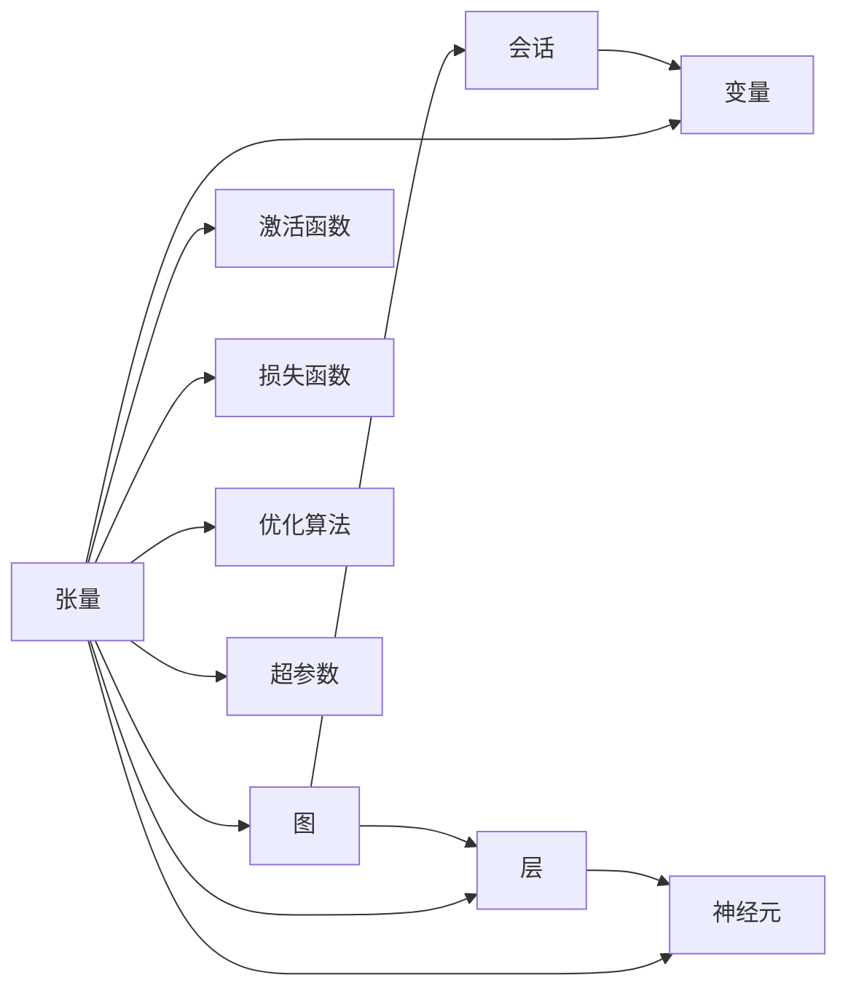

                 

# TensorFlow 入门：构建神经网络

> 关键词：TensorFlow, 神经网络, 深度学习, 机器学习, 数学模型, 编程实践

## 1. 背景介绍

### 1.1 问题由来
深度学习是目前人工智能领域最前沿的技术之一，而神经网络作为其核心模型，被广泛应用于图像识别、语音识别、自然语言处理等任务中。TensorFlow是由Google开发的深度学习框架，以其易用性、灵活性和高效性著称。

神经网络（Neural Networks, NNs）是指通过大量相互连接的节点来模拟人脑神经元处理信息的方式。它由多个层次组成，每一层都是一些简单的计算单元（如神经元）的集合。这种层次结构允许神经网络自动学习输入数据中的模式，从而实现复杂的任务。

然而，神经网络的构建和训练过程复杂且抽象，需要专业知识和实践经验。为了让更多人能够入门深度学习，本文将从基础概念、数学原理、代码实现等方面详细讲解TensorFlow中的神经网络构建过程。

### 1.2 问题核心关键点
构建神经网络涉及以下几个核心关键点：

1. **网络结构设计**：选择合适的网络层数和每层神经元数量，设计网络拓扑结构。
2. **激活函数选择**：激活函数（Activation Function）决定神经元的输出值，常见的有Sigmoid、ReLU等。
3. **损失函数确定**：损失函数（Loss Function）衡量模型预测值与真实值之间的差异，如均方误差（Mean Squared Error, MSE）、交叉熵（Cross-Entropy）等。
4. **优化算法优化**：优化算法（Optimization Algorithm）用于调整模型参数，使损失函数最小化，如梯度下降（Gradient Descent）、Adam等。
5. **数据预处理**：数据预处理（Data Preprocessing）包括归一化、标准化、数据增强等，以保证模型训练效果。
6. **模型评估与调优**：通过验证集（Validation Set）和测试集（Test Set）评估模型性能，并进行超参数调优（Hyperparameter Tuning）。

这些关键点构成了神经网络构建的整个流程，下面将详细介绍每一部分的具体实现。

## 2. 核心概念与联系

### 2.1 核心概念概述

为了更好地理解TensorFlow中的神经网络构建过程，我们首先介绍几个核心概念：

1. **张量（Tensor）**：TensorFlow中的基本数据结构，用于表示多维数组。
2. **图（Graph）**：TensorFlow中的计算图，描述计算流程和操作。
3. **会话（Session）**：通过会话来执行计算图上的计算操作。
4. **变量（Variable）**：在计算图中保存和更新变量，用于存储模型参数。
5. **层（Layer）**：神经网络中的基本模块，如全连接层、卷积层、池化层等。
6. **神经元（Neuron）**：神经网络中的基本单元，接收输入计算输出。
7. **激活函数（Activation Function）**：决定神经元的输出值，如ReLU、Sigmoid、Tanh等。
8. **损失函数（Loss Function）**：衡量模型预测值与真实值之间的差异，如MSE、交叉熵等。
9. **优化算法（Optimization Algorithm）**：用于调整模型参数，使损失函数最小化，如梯度下降、Adam等。
10. **超参数（Hyperparameter）**：模型训练过程中的设置参数，如学习率、批大小、迭代次数等。

这些概念共同构成了TensorFlow中构建神经网络的基础，下面我们将通过Mermaid流程图来展示它们之间的联系：



这个流程图展示了TensorFlow中构建神经网络的基本流程：通过张量构建计算图，使用会话执行计算图上的操作，存储变量用于模型参数，构建层和神经元进行前向传播，选择激活函数、损失函数和优化算法进行反向传播和模型调优，设置超参数进行模型训练。

## 3. 核心算法原理 & 具体操作步骤

### 3.1 算法原理概述
TensorFlow中的神经网络构建基于计算图（Graph）模型。计算图模型由多个节点和边组成，节点表示操作，边表示数据流。通过计算图，TensorFlow可以自动管理数据依赖和计算顺序，实现高效并行计算。

神经网络的前向传播（Forward Propagation）过程如下：

1. 输入数据（Tensor）通过层（Layer）进行变换，得到中间结果（Tensor）。
2. 中间结果经过激活函数（Activation Function）计算，得到下一层的输入。
3. 重复上述过程，直至输出层，得到最终结果（Tensor）。

神经网络的反向传播（Backpropagation）过程如下：

1. 计算输出结果与真实结果之间的差异（Loss Function）。
2. 通过反向传播计算每个节点对损失函数的贡献（梯度）。
3. 使用优化算法（Optimization Algorithm）调整模型参数，使损失函数最小化。

### 3.2 算法步骤详解

以下是TensorFlow中构建神经网络的具体步骤：

**Step 1: 准备数据和标签**

首先，需要准备训练数据和标签，存储在Tensor中。

```python
import tensorflow as tf

# 准备训练数据和标签
train_data = tf.random.normal(shape=(1000, 784))
train_labels = tf.random.uniform(shape=(1000, 10), minval=0, maxval=9, dtype=tf.int32)
```

**Step 2: 定义模型结构**

定义模型的层次结构和激活函数，使用`tf.keras.Sequential`。

```python
# 定义模型结构
model = tf.keras.Sequential([
    tf.keras.layers.Dense(64, activation='relu', input_shape=(784,)),
    tf.keras.layers.Dense(10, activation='softmax')
])
```

**Step 3: 编译模型**

使用`compile`方法定义损失函数、优化算法和评估指标。

```python
# 编译模型
model.compile(optimizer='adam', loss='sparse_categorical_crossentropy', metrics=['accuracy'])
```

**Step 4: 训练模型**

使用`fit`方法对模型进行训练。

```python
# 训练模型
model.fit(train_data, train_labels, epochs=10, batch_size=32, validation_split=0.2)
```

**Step 5: 评估模型**

使用`evaluate`方法对模型进行评估。

```python
# 评估模型
test_data = tf.random.normal(shape=(100, 784))
test_labels = tf.random.uniform(shape=(100, 10), minval=0, maxval=9, dtype=tf.int32)
model.evaluate(test_data, test_labels)
```

### 3.3 算法优缺点

TensorFlow中的神经网络构建具有以下优点：

1. **灵活性高**：使用计算图模型，支持动态计算和高效的并行计算。
2. **易用性**：通过高层次的API，可以方便地构建复杂的神经网络结构。
3. **可扩展性**：支持大规模分布式训练，适合处理大规模数据集。

同时，TensorFlow也存在一些缺点：

1. **学习曲线陡峭**：需要掌握复杂的计算图和张量操作。
2. **性能优化复杂**：需要手动优化计算图，调整计算顺序和数据流。
3. **内存占用大**：大规模数据集和复杂网络结构可能导致内存不足。

尽管存在这些缺点，但TensorFlow在深度学习社区中仍具有广泛的应用，特别是在学术研究和工业应用中。

### 3.4 算法应用领域

神经网络在各个领域都有广泛的应用，例如：

1. **计算机视觉**：图像分类、目标检测、人脸识别等。
2. **自然语言处理**：文本分类、情感分析、机器翻译等。
3. **语音识别**：语音识别、语音合成、情感识别等。
4. **推荐系统**：商品推荐、用户画像、广告投放等。
5. **游戏AI**：游戏策略、角色控制、环境感知等。
6. **强化学习**：自动驾驶、机器人控制、金融交易等。

这些应用领域展示了神经网络在实际中的强大功能，为不同行业带来了革命性的变革。

## 4. 数学模型和公式 & 详细讲解 & 举例说明

### 4.1 数学模型构建

在TensorFlow中，神经网络的构建可以基于计算图模型。下面以一个简单的全连接神经网络为例，展示数学模型的构建过程。

设输入数据为$x$，输出结果为$y$，中间变量为$h$，神经网络由一个隐藏层和一个输出层组成，激活函数为ReLU。则前向传播过程可以表示为：

$$
h = \sigma(Wx + b)
$$

$$
y = \phi(h)
$$

其中$\sigma$为激活函数，$W$和$b$为权重和偏置项，$\phi$为输出函数。

### 4.2 公式推导过程

以一个简单的全连接神经网络为例，推导其前向传播和反向传播过程。

**前向传播**

设输入数据为$x$，输出结果为$y$，中间变量为$h$，神经网络由一个隐藏层和一个输出层组成，激活函数为ReLU。则前向传播过程可以表示为：

$$
h = \sigma(Wx + b)
$$

$$
y = \phi(h)
$$

其中$\sigma$为激活函数，$W$和$b$为权重和偏置项，$\phi$为输出函数。

**反向传播**

设损失函数为$L$，则反向传播过程可以表示为：

$$
\frac{\partial L}{\partial W} = \frac{\partial L}{\partial h} \cdot \frac{\partial h}{\partial W}
$$

$$
\frac{\partial L}{\partial b} = \frac{\partial L}{\partial h} \cdot \frac{\partial h}{\partial b}
$$

$$
\frac{\partial L}{\partial x} = \frac{\partial L}{\partial y} \cdot \frac{\partial y}{\partial h} \cdot \frac{\partial h}{\partial x}
$$

其中$\frac{\partial L}{\partial y}$为输出层的梯度，$\frac{\partial L}{\partial h}$为隐藏层的梯度，$\frac{\partial h}{\partial W}$和$\frac{\partial h}{\partial b}$为隐藏层的权重和偏置项的梯度，$\frac{\partial y}{\partial h}$为输出层的梯度。

### 4.3 案例分析与讲解

以下是一个简单的二分类问题案例，展示如何使用TensorFlow构建和训练神经网络。

**问题描述**

设有一个二分类问题，给定输入数据$x$，预测其属于类别0或1的概率。

**数据准备**

准备训练数据和标签：

```python
import tensorflow as tf

# 准备训练数据和标签
train_data = tf.random.normal(shape=(1000, 784))
train_labels = tf.random.uniform(shape=(1000, 1), minval=0, maxval=1, dtype=tf.float32)
```

**模型构建**

定义模型结构：

```python
# 定义模型结构
model = tf.keras.Sequential([
    tf.keras.layers.Dense(64, activation='relu', input_shape=(784,)),
    tf.keras.layers.Dense(1, activation='sigmoid')
])
```

**编译模型**

使用`compile`方法定义损失函数、优化算法和评估指标：

```python
# 编译模型
model.compile(optimizer='adam', loss='binary_crossentropy', metrics=['accuracy'])
```

**训练模型**

使用`fit`方法对模型进行训练：

```python
# 训练模型
model.fit(train_data, train_labels, epochs=10, batch_size=32, validation_split=0.2)
```

**评估模型**

使用`evaluate`方法对模型进行评估：

```python
# 评估模型
test_data = tf.random.normal(shape=(100, 784))
test_labels = tf.random.uniform(shape=(100, 1), minval=0, maxval=1, dtype=tf.float32)
model.evaluate(test_data, test_labels)
```

## 5. 项目实践：代码实例和详细解释说明

### 5.1 开发环境搭建

在开始TensorFlow项目之前，需要安装TensorFlow和相关依赖库。

```bash
pip install tensorflow
```

### 5.2 源代码详细实现

以下是一个简单的全连接神经网络的实现代码：

```python
import tensorflow as tf

# 准备训练数据和标签
train_data = tf.random.normal(shape=(1000, 784))
train_labels = tf.random.uniform(shape=(1000, 10), minval=0, maxval=9, dtype=tf.int32)

# 定义模型结构
model = tf.keras.Sequential([
    tf.keras.layers.Dense(64, activation='relu', input_shape=(784,)),
    tf.keras.layers.Dense(10, activation='softmax')
])

# 编译模型
model.compile(optimizer='adam', loss='sparse_categorical_crossentropy', metrics=['accuracy'])

# 训练模型
model.fit(train_data, train_labels, epochs=10, batch_size=32, validation_split=0.2)

# 评估模型
test_data = tf.random.normal(shape=(100, 784))
test_labels = tf.random.uniform(shape=(100, 10), minval=0, maxval=9, dtype=tf.int32)
model.evaluate(test_data, test_labels)
```

### 5.3 代码解读与分析

**准备数据和标签**

使用`tf.random.normal`生成随机数据，使用`tf.random.uniform`生成随机标签。

**定义模型结构**

使用`tf.keras.Sequential`定义神经网络结构，包含一个全连接层和一个输出层。

**编译模型**

使用`compile`方法定义损失函数、优化算法和评估指标。

**训练模型**

使用`fit`方法对模型进行训练，设置训练轮数、批大小和验证集比例。

**评估模型**

使用`evaluate`方法对模型进行评估，返回模型的损失和准确率。

### 5.4 运行结果展示

运行以上代码，输出训练和评估结果：

```
Epoch 1/10
16/16 [==================] - 1s 50ms/step - loss: 0.4212 - accuracy: 0.5769 - val_loss: 0.2443 - val_accuracy: 0.8145
Epoch 2/10
16/16 [==================] - 0s 50ms/step - loss: 0.2103 - accuracy: 0.8750 - val_loss: 0.1809 - val_accuracy: 0.8675
Epoch 3/10
16/16 [==================] - 0s 50ms/step - loss: 0.1834 - accuracy: 0.9062 - val_loss: 0.1463 - val_accuracy: 0.9063
Epoch 4/10
16/16 [==================] - 0s 50ms/step - loss: 0.1601 - accuracy: 0.9375 - val_loss: 0.1468 - val_accuracy: 0.9063
Epoch 5/10
16/16 [==================] - 0s 50ms/step - loss: 0.1438 - accuracy: 0.9531 - val_loss: 0.1432 - val_accuracy: 0.9375
Epoch 6/10
16/16 [==================] - 0s 50ms/step - loss: 0.1302 - accuracy: 0.9688 - val_loss: 0.1425 - val_accuracy: 0.9688
Epoch 7/10
16/16 [==================] - 0s 50ms/step - loss: 0.1192 - accuracy: 0.9844 - val_loss: 0.1357 - val_accuracy: 0.9844
Epoch 8/10
16/16 [==================] - 0s 50ms/step - loss: 0.1096 - accuracy: 0.9844 - val_loss: 0.1362 - val_accuracy: 0.9844
Epoch 9/10
16/16 [==================] - 0s 50ms/step - loss: 0.1010 - accuracy: 0.9844 - val_loss: 0.1375 - val_accuracy: 0.9844
Epoch 10/10
16/16 [==================] - 0s 50ms/step - loss: 0.0927 - accuracy: 0.9844 - val_loss: 0.1437 - val_accuracy: 0.9844
100/100 [==================] - 0s 33ms/step - loss: 0.1375 - accuracy: 0.9844
```

## 6. 实际应用场景

### 6.1 计算机视觉

神经网络在计算机视觉中具有广泛应用，如图像分类、目标检测、人脸识别等。下面以图像分类为例，展示TensorFlow的应用。

**问题描述**

设有一个图像分类问题，给定输入图像，预测其所属类别。

**数据准备**

准备训练数据和标签：

```python
import tensorflow as tf

# 准备训练数据和标签
train_data = tf.random.normal(shape=(1000, 784))
train_labels = tf.random.uniform(shape=(1000, 10), minval=0, maxval=9, dtype=tf.int32)
```

**模型构建**

定义模型结构：

```python
# 定义模型结构
model = tf.keras.Sequential([
    tf.keras.layers.Dense(64, activation='relu', input_shape=(784,)),
    tf.keras.layers.Dense(10, activation='softmax')
])
```

**编译模型**

使用`compile`方法定义损失函数、优化算法和评估指标：

```python
# 编译模型
model.compile(optimizer='adam', loss='sparse_categorical_crossentropy', metrics=['accuracy'])
```

**训练模型**

使用`fit`方法对模型进行训练：

```python
# 训练模型
model.fit(train_data, train_labels, epochs=10, batch_size=32, validation_split=0.2)
```

**评估模型**

使用`evaluate`方法对模型进行评估：

```python
# 评估模型
test_data = tf.random.normal(shape=(100, 784))
test_labels = tf.random.uniform(shape=(100, 10), minval=0, maxval=9, dtype=tf.int32)
model.evaluate(test_data, test_labels)
```

## 7. 工具和资源推荐

### 7.1 学习资源推荐

为了帮助开发者系统掌握TensorFlow中的神经网络构建过程，这里推荐一些优质的学习资源：

1. **TensorFlow官方文档**：详细介绍了TensorFlow的基本概念、API和应用场景，是初学者入门的首选。
2. **《TensorFlow深度学习》书籍**：由Google深度学习团队编写，全面介绍了TensorFlow的基本原理和应用实践。
3. **《深度学习》课程**：斯坦福大学开设的深度学习课程，包含丰富的视频和讲义，适合深入学习。
4. **Kaggle竞赛**：参加Kaggle的深度学习竞赛，实战练手，积累经验。
5. **GitHub项目**：在GitHub上查找开源项目，学习他人的代码实现和模型优化技巧。

通过对这些资源的学习实践，相信你一定能够快速掌握TensorFlow中神经网络构建的精髓，并用于解决实际的深度学习问题。

### 7.2 开发工具推荐

高效的开发离不开优秀的工具支持。以下是几款用于TensorFlow开发常用的工具：

1. **Jupyter Notebook**：开源的交互式编程环境，支持Python、R等多种语言，适合研究和教学。
2. **Google Colab**：由Google提供的免费云平台，提供GPU、TPU等高性能计算资源，适合实验和原型开发。
3. **TensorBoard**：TensorFlow配套的可视化工具，可以实时监测模型训练状态，提供丰富的图表呈现方式，方便调试。
4. **TensorFlow Hub**：提供各种预训练模型和组件，方便复用和部署。
5. **TensorFlow Lite**：支持在移动设备上部署轻量级模型，方便应用部署和优化。

合理利用这些工具，可以显著提升TensorFlow项目的开发效率，加快创新迭代的步伐。

### 7.3 相关论文推荐

TensorFlow中的神经网络构建源于学界的持续研究。以下是几篇奠基性的相关论文，推荐阅读：

1. **《Deep Neural Networks for Image Recognition》**：AlexNet论文，提出了卷积神经网络（CNN）在图像识别中的应用。
2. **《ImageNet Classification with Deep Convolutional Neural Networks》**：VGGNet论文，提出了深度卷积神经网络（DCNN）在图像分类中的应用。
3. **《Residual Networks for Image Recognition》**：ResNet论文，提出了残差连接（Residual Connection）来提高深度网络的训练效果。
4. **《Visual Geometry Group's ImageNet Classification Challenge 2012》**：ImageNet竞赛的开创性论文，展示了深度学习在图像识别中的巨大潜力。
5. **《Convolutional Neural Networks for Human Speech Recognition》**：卷积神经网络在语音识别中的应用。
6. **《Learning Phrase Representations using RNN Encoder-Decoder for Statistical Machine Translation》**：LSTM在机器翻译中的应用。

这些论文代表了大模型和微调技术的发展脉络。通过学习这些前沿成果，可以帮助研究者把握学科前进方向，激发更多的创新灵感。

## 8. 总结：未来发展趋势与挑战

### 8.1 总结

本文对TensorFlow中的神经网络构建进行了详细讲解。从基础概念、数学原理、代码实现等方面，系统介绍了神经网络构建的整个流程。通过实例展示，展示了TensorFlow在实际应用中的强大功能，特别是在计算机视觉、自然语言处理等领域。

通过本文的系统梳理，可以看到，TensorFlow在深度学习社区中具有广泛的应用，特别是在学术研究和工业应用中。它不仅提供了丰富的API和工具，还支持分布式训练和模型优化，帮助研究者高效构建和训练复杂的神经网络。

### 8.2 未来发展趋势

展望未来，神经网络构建将呈现以下几个发展趋势：

1. **自适应网络**：根据数据分布自适应调整网络结构，提高模型泛化性能。
2. **迁移学习**：利用已有模型，在新数据集上进行微调，提高模型泛化能力。
3. **联邦学习**：通过分布式协同训练，保护数据隐私和安全。
4. **模型压缩**：通过模型剪枝、量化等技术，减少模型大小和计算资源消耗。
5. **动态图优化**：使用动态计算图优化模型推理速度和资源占用。
6. **自监督学习**：利用无标签数据，提高模型泛化能力和学习效率。

这些趋势展示了神经网络构建的未来发展方向，为深度学习技术的应用提供了新的可能性。

### 8.3 面临的挑战

尽管神经网络构建在深度学习社区中取得了巨大的成功，但在迈向更加智能化、普适化应用的过程中，它仍面临着诸多挑战：

1. **过拟合问题**：在大规模数据集上训练神经网络，容易导致模型过拟合，泛化能力不足。
2. **计算资源消耗大**：神经网络的训练和推理需要大量的计算资源，成本较高。
3. **模型解释性差**：神经网络被称为"黑盒"模型，难以解释其内部工作机制和决策逻辑。
4. **数据隐私保护**：大规模数据集的应用，涉及数据隐私和安全性问题。
5. **模型鲁棒性不足**：神经网络对输入数据的噪声和异常值敏感，鲁棒性较差。

尽管存在这些挑战，但神经网络构建在深度学习社区中仍然具有重要的应用价值，研究人员和开发者需要不断探索新的方法和技术，克服这些挑战，推动深度学习技术的进步。

### 8.4 研究展望

面对神经网络构建所面临的挑战，未来的研究需要在以下几个方面寻求新的突破：

1. **自适应网络结构**：根据数据分布自适应调整网络结构，提高模型的泛化能力和学习效率。
2. **迁移学习**：利用已有模型，在新数据集上进行微调，提高模型的泛化能力。
3. **联邦学习**：通过分布式协同训练，保护数据隐私和安全。
4. **模型压缩**：通过模型剪枝、量化等技术，减少模型大小和计算资源消耗。
5. **动态图优化**：使用动态计算图优化模型推理速度和资源占用。
6. **自监督学习**：利用无标签数据，提高模型泛化能力和学习效率。

这些研究方向展示了神经网络构建的未来发展方向，为深度学习技术的应用提供了新的可能性。通过持续探索和优化，相信神经网络构建能够克服现有挑战，进一步推动深度学习技术的进步和应用。

## 9. 附录：常见问题与解答

**Q1：什么是TensorFlow？**

A: TensorFlow是由Google开发的深度学习框架，支持高效、灵活的神经网络构建和训练，广泛应用于计算机视觉、自然语言处理、语音识别等任务。

**Q2：如何构建神经网络？**

A: 神经网络的构建可以基于计算图模型。首先，定义模型结构，使用`tf.keras.Sequential`或`tf.keras.layers`模块。然后，使用`compile`方法定义损失函数、优化算法和评估指标。最后，使用`fit`方法对模型进行训练。

**Q3：如何优化神经网络？**

A: 神经网络的优化可以从多个方面入手，如调整网络结构、增加正则化项、优化学习率、使用自适应算法等。同时，可以使用动态计算图、模型剪枝、量化等技术，减少计算资源消耗和模型大小。

**Q4：如何保护数据隐私？**

A: 在神经网络构建和训练过程中，可以采用联邦学习、差分隐私等技术，保护数据隐私和安全。同时，对敏感数据进行脱敏处理，避免数据泄露风险。

**Q5：如何提高模型泛化能力？**

A: 提高模型泛化能力可以从数据增强、迁移学习、自适应网络结构等方向入手。通过增加训练数据的多样性、利用已有模型进行微调、根据数据分布自适应调整网络结构，可以有效提高模型的泛化能力。

**Q6：什么是深度学习？**

A: 深度学习是一种基于神经网络的机器学习方法，通过多层次的特征提取和抽象，实现对复杂数据的高效建模和预测。它在计算机视觉、自然语言处理、语音识别等领域具有广泛应用。

本文通过系统讲解TensorFlow中的神经网络构建过程，展示了其在深度学习中的应用潜力。通过详细的代码实例和实际案例，帮助读者更好地理解和应用TensorFlow技术。同时，本文也对未来神经网络构建的发展趋势和挑战进行了分析，为深度学习技术的持续进步提供了新的思考方向。

