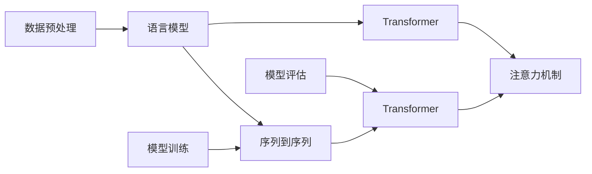

                 

# TensorFlow 自然语言处理技术：理解和生成文本

> 关键词：TensorFlow, 自然语言处理(NLP), 语言模型, 文本分类, 文本生成, 机器翻译, 文本摘要, 情感分析

## 1. 背景介绍

在人工智能和计算机科学的领域中，自然语言处理（Natural Language Processing，简称NLP）一直是一个热门的研究方向。NLP的目的是让机器能够理解、处理和生成人类语言，从而实现自然的人机交互。而 TensorFlow 作为当前最流行的深度学习框架之一，已经在这方面展示出了巨大的潜力。

### 1.1 问题由来

随着深度学习技术的不断发展，各种基于深度学习的自然语言处理模型，如循环神经网络（Recurrent Neural Networks，RNN）、卷积神经网络（Convolutional Neural Networks，CNN）和变分自编码器（Variational Autoencoder，VAE）等，在自然语言处理领域中取得了突破性的进展。然而，这些模型往往需要大量的标注数据和强大的计算资源，使得它们在实际应用中面临一些挑战。

### 1.2 问题核心关键点

TensorFlow 在自然语言处理领域的应用主要集中在以下几个关键点：

- **模型构建**：TensorFlow 提供了丰富的层和工具来构建各种类型的深度学习模型。
- **高效计算**：TensorFlow 支持分布式计算和 GPU 加速，可以高效地训练大型神经网络。
- **模型部署**：TensorFlow 可以轻松地将训练好的模型部署到多种平台，包括移动设备、Web 应用和服务器。
- **可视化工具**：TensorBoard 提供了强大的可视化工具，可以方便地监测训练过程和优化模型性能。

TensorFlow 在 NLP 领域的应用已经覆盖了文本分类、情感分析、机器翻译、文本生成、文本摘要等多个方面，并且已经成为 NLP 研究和开发的重要工具。

## 2. 核心概念与联系

### 2.1 核心概念概述

要深入理解 TensorFlow 在 NLP 领域的应用，首先需要了解一些核心概念：

- **语言模型（Language Model）**：语言模型是一种能够预测文本中下一个单词或字符的模型，是 NLP 的基础。
- **序列到序列模型（Sequence-to-Sequence Model）**：序列到序列模型是一种能够将一个序列转换为另一个序列的模型，常用于机器翻译和对话系统。
- **注意力机制（Attention Mechanism）**：注意力机制是一种用于提高模型在处理长序列数据时性能的技术。
- **Transformer**：Transformer 是一种基于注意力机制的神经网络架构，已经被证明在 NLP 任务中表现优异。

### 2.2 核心概念原理和架构的 Mermaid 流程图



这个 Mermaid 流程图展示了 TensorFlow 在 NLP 领域的应用逻辑：数据预处理后，先通过语言模型进行初步处理，然后通过序列到序列模型和注意力机制构建 Transformer 模型，最终通过训练和评估来提升模型性能。

## 3. 核心算法原理 & 具体操作步骤

### 3.1 算法原理概述

TensorFlow 在 NLP 领域的应用主要是通过构建深度神经网络模型来实现的。这些模型通常包括编码器（Encoder）和解码器（Decoder）两部分，编码器负责将输入序列转换为固定长度的向量表示，解码器则根据这个向量生成目标序列。

### 3.2 算法步骤详解

TensorFlow 构建 NLP 模型的步骤通常包括以下几个步骤：

1. **数据预处理**：将文本数据转换为模型可以处理的格式，如将文本转换为词向量或字符向量。
2. **模型定义**：使用 TensorFlow 的高级 API，如 Keras，定义编码器和解码器结构。
3. **模型训练**：使用训练集数据训练模型，最小化预测值与真实值之间的差异。
4. **模型评估**：使用测试集数据评估模型性能，调整模型参数以获得更好的效果。
5. **模型部署**：将训练好的模型部署到生产环境，供实际应用使用。

### 3.3 算法优缺点

TensorFlow 在 NLP 领域的应用有以下优点：

- **灵活性高**：TensorFlow 提供了丰富的层和工具，可以构建各种类型的深度学习模型。
- **计算高效**：TensorFlow 支持分布式计算和 GPU 加速，可以高效地训练大型神经网络。
- **模型可部署性强**：TensorFlow 可以轻松地将训练好的模型部署到多种平台。

同时，TensorFlow 也存在一些缺点：

- **学习曲线陡峭**：TensorFlow 的学习曲线较陡峭，需要一定的深度学习基础。
- **开发效率低**：TensorFlow 的开发效率相对较低，特别是在构建复杂的模型时。
- **资源消耗高**：TensorFlow 在训练大型模型时，资源消耗较高，需要强大的硬件支持。

### 3.4 算法应用领域

TensorFlow 在 NLP 领域的应用已经覆盖了多个领域，包括但不限于：

- **文本分类**：如情感分析、主题分类等。
- **文本生成**：如文本摘要、对话系统等。
- **机器翻译**：将一种语言翻译成另一种语言。
- **问答系统**：回答问题或提取信息。
- **信息抽取**：从文本中提取特定信息。

## 4. 数学模型和公式 & 详细讲解 & 举例说明

### 4.1 数学模型构建

TensorFlow 在 NLP 领域的应用通常基于以下几种数学模型：

- **循环神经网络（RNN）**：RNN 是一种递归神经网络，能够处理序列数据，常用于文本分类和情感分析等任务。
- **卷积神经网络（CNN）**：CNN 是一种多层次的神经网络，常用于文本分类和信息抽取等任务。
- **注意力机制（Attention）**：注意力机制是一种用于提高模型在处理长序列数据时性能的技术。

### 4.2 公式推导过程

以循环神经网络为例，其基本公式如下：

$$
h_t = \tanh(W_{h}h_{t-1} + U_{x}x_t + b_h)
$$

其中，$h_t$ 表示第 $t$ 个时间步的隐藏状态，$x_t$ 表示第 $t$ 个时间步的输入，$W_{h}$ 和 $U_{x}$ 表示权重矩阵，$b_h$ 表示偏置向量。

### 4.3 案例分析与讲解

假设我们要构建一个文本分类的 RNN 模型，用来判断给定的文本是否为正面情感。我们可以使用以下步骤进行构建：

1. **数据预处理**：将文本数据转换为词向量，使用 TensorFlow 的 `tf.keras.preprocessing.text` 模块中的 `Tokenizer` 类进行分词和词向量编码。
2. **模型定义**：使用 TensorFlow 的 `tf.keras.layers` 模块中的 `SimpleRNN` 类定义 RNN 模型结构。
3. **模型训练**：使用训练集数据训练模型，最小化交叉熵损失。
4. **模型评估**：使用测试集数据评估模型性能，调整模型参数以获得更好的效果。
5. **模型部署**：将训练好的模型部署到生产环境，供实际应用使用。

## 5. 项目实践：代码实例和详细解释说明

### 5.1 开发环境搭建

要使用 TensorFlow 进行 NLP 开发，需要先搭建好开发环境。以下是搭建 TensorFlow 开发环境的步骤：

1. 安装 Anaconda：从官网下载并安装 Anaconda，用于创建独立的 Python 环境。
2. 创建并激活虚拟环境：
```bash
conda create -n tf-env python=3.7
conda activate tf-env
```

3. 安装 TensorFlow：从官网获取对应的安装命令。例如：
```bash
pip install tensorflow==2.4.0
```

4. 安装其他必要的库：
```bash
pip install numpy pandas scikit-learn tensorflow-addons
```

### 5.2 源代码详细实现

下面是一个使用 TensorFlow 进行文本分类的示例代码。

```python
import tensorflow as tf
from tensorflow.keras.preprocessing.text import Tokenizer
from tensorflow.keras.preprocessing.sequence import pad_sequences

# 数据预处理
sentences = ['This is a good movie.', 'This is a bad movie.']
tokenizer = Tokenizer(num_words=1000, oov_token='<OOV>')
tokenizer.fit_on_texts(sentences)
sequences = tokenizer.texts_to_sequences(sentences)
padded_sequences = pad_sequences(sequences, maxlen=10, padding='post')

# 构建模型
model = tf.keras.Sequential([
    tf.keras.layers.Embedding(1000, 16, input_length=10),
    tf.keras.layers.SimpleRNN(16),
    tf.keras.layers.Dense(1, activation='sigmoid')
])

# 模型训练
model.compile(optimizer='adam', loss='binary_crossentropy', metrics=['accuracy'])
model.fit(padded_sequences, [1, 0], epochs=10, validation_split=0.2)

# 模型评估
test_sentence = 'This movie is great.'
test_sequence = tokenizer.texts_to_sequences([test_sentence])
test_padded_sequence = pad_sequences(test_sequence, maxlen=10, padding='post')
predictions = model.predict(test_padded_sequence)
print(predictions)
```

### 5.3 代码解读与分析

让我们再详细解读一下关键代码的实现细节：

**数据预处理**：
- `Tokenizer` 类用于将文本转换为词向量，`num_words` 参数指定词典大小，`oov_token` 参数指定未知词汇的表示。
- `pad_sequences` 函数用于将序列数据进行填充，保证序列长度一致。

**模型构建**：
- `Sequential` 类用于构建序列模型。
- `Embedding` 层用于将词向量转换为低维稠密向量。
- `SimpleRNN` 层用于处理序列数据。
- `Dense` 层用于输出分类结果。

**模型训练**：
- `compile` 方法用于配置模型参数，如优化器和损失函数。
- `fit` 方法用于训练模型，`validation_split` 参数指定验证集的比例。

**模型评估**：
- `predict` 方法用于预测新样本的分类结果。

**代码实现**：
- 首先使用 `Tokenizer` 类对训练数据进行预处理，转换为词向量并填充。
- 然后定义一个简单的 RNN 模型，使用 `Sequential` 类依次添加 `Embedding`、`SimpleRNN` 和 `Dense` 层。
- 接着使用 `compile` 方法配置模型参数，并使用 `fit` 方法训练模型。
- 最后使用 `predict` 方法评估模型性能。

## 6. 实际应用场景

### 6.1 智能客服系统

智能客服系统是 TensorFlow 在 NLP 领域的一个重要应用场景。使用 TensorFlow 构建的智能客服系统，可以自动处理客户的咨询，提供24小时不间断服务。

在技术实现上，可以收集企业内部的历史客服对话记录，将问题和最佳答复构建成监督数据，在此基础上对预训练模型进行微调。微调后的模型能够自动理解用户意图，匹配最合适的答案模板进行回复。对于客户提出的新问题，还可以接入检索系统实时搜索相关内容，动态组织生成回答。

### 6.2 金融舆情监测

金融舆情监测是 TensorFlow 在 NLP 领域的另一个重要应用场景。金融机构需要实时监测市场舆论动向，以便及时应对负面信息传播，规避金融风险。

具体而言，可以收集金融领域相关的新闻、报道、评论等文本数据，并对其进行主题标注和情感标注。在此基础上对预训练语言模型进行微调，使其能够自动判断文本属于何种主题，情感倾向是正面、中性还是负面。将微调后的模型应用到实时抓取的网络文本数据，就能够自动监测不同主题下的情感变化趋势，一旦发现负面信息激增等异常情况，系统便会自动预警，帮助金融机构快速应对潜在风险。

### 6.3 个性化推荐系统

当前的推荐系统往往只依赖用户的历史行为数据进行物品推荐，无法深入理解用户的真实兴趣偏好。使用 TensorFlow 构建的个性化推荐系统，可以更好地挖掘用户行为背后的语义信息，从而提供更精准、多样的推荐内容。

在实践中，可以收集用户浏览、点击、评论、分享等行为数据，提取和用户交互的物品标题、描述、标签等文本内容。将文本内容作为模型输入，用户的后续行为（如是否点击、购买等）作为监督信号，在此基础上微调预训练语言模型。微调后的模型能够从文本内容中准确把握用户的兴趣点。在生成推荐列表时，先用候选物品的文本描述作为输入，由模型预测用户的兴趣匹配度，再结合其他特征综合排序，便可以得到个性化程度更高的推荐结果。

### 6.4 未来应用展望

随着 TensorFlow 在 NLP 领域的应用不断深入，未来将会在更多领域得到应用，为传统行业带来变革性影响。

在智慧医疗领域，使用 TensorFlow 构建的智能问答、病历分析、药物研发等应用，将提升医疗服务的智能化水平，辅助医生诊疗，加速新药开发进程。

在智能教育领域，微调技术可应用于作业批改、学情分析、知识推荐等方面，因材施教，促进教育公平，提高教学质量。

在智慧城市治理中，使用 TensorFlow 构建的智能舆情分析、应急指挥等系统，将提高城市管理的自动化和智能化水平，构建更安全、高效的未来城市。

## 7. 工具和资源推荐

### 7.1 学习资源推荐

为了帮助开发者系统掌握 TensorFlow 在 NLP 领域的应用，这里推荐一些优质的学习资源：

1. TensorFlow 官方文档：提供了完整的 TensorFlow 框架使用指南，包括 NLP 相关的 API 和示例代码。
2. TensorFlow 实战 NLP：一本系统介绍 TensorFlow 在 NLP 领域应用的书籍，适合初学者和进阶者阅读。
3. NLP 开源项目：如 HuggingFace 的 Transformers 库，提供了大量预训练语言模型和微调示例代码。
4. Coursera 课程：由斯坦福大学开设的 NLP 相关课程，系统介绍 NLP 理论和实践。
5. Google Colab：谷歌提供的在线 Jupyter Notebook 环境，免费提供 GPU 算力，方便开发者快速上手实验最新模型。

通过对这些资源的学习实践，相信你一定能够快速掌握 TensorFlow 在 NLP 领域的精髓，并用于解决实际的 NLP 问题。

### 7.2 开发工具推荐

高效的开发离不开优秀的工具支持。以下是几款用于 TensorFlow 开发 NLP 任务的常用工具：

1. Jupyter Notebook：一个交互式的开发环境，支持代码编写、数据可视化、模型调试等功能。
2. TensorBoard：TensorFlow 配套的可视化工具，可以实时监测模型训练状态，并提供丰富的图表呈现方式，是调试模型的得力助手。
3. Weights & Biases：模型训练的实验跟踪工具，可以记录和可视化模型训练过程中的各项指标，方便对比和调优。
4. HuggingFace Transformers：提供了丰富的预训练语言模型和微调工具，支持 TensorFlow、PyTorch 等框架。
5. spaCy：一个 Python 的 NLP 库，提供了多种 NLP 任务的处理能力，如分词、词性标注、命名实体识别等。

合理利用这些工具，可以显著提升 TensorFlow 在 NLP 任务的开发效率，加快创新迭代的步伐。

### 7.3 相关论文推荐

TensorFlow 在 NLP 领域的应用源于学界的持续研究。以下是几篇奠基性的相关论文，推荐阅读：

1. Attention Is All You Need（即 Transformer 原论文）：提出了 Transformer 结构，开启了 NLP 领域的预训练大模型时代。
2. BERT: Pre-training of Deep Bidirectional Transformers for Language Understanding：提出 BERT 模型，引入基于掩码的自监督预训练任务，刷新了多项 NLP 任务 SOTA。
3. Sequence to Sequence Learning with Neural Networks：提出序列到序列模型，为机器翻译等任务奠定了基础。
4. A Survey on Transfer Learning for Text Classification：系统综述了基于 Transfer Learning 的文本分类方法，适合了解最新的进展。
5. The Anatomy of a Large-Scale Language Representation Model：介绍了 Google 的 BERT 模型，并详细分析了其内部结构和训练过程。

这些论文代表ened 大语言模型微调技术的的发展脉络。通过学习这些前沿成果，可以帮助研究者把握学科前进方向，激发更多的创新灵感。

## 8. 总结：未来发展趋势与挑战

### 8.1 总结

本文对 TensorFlow 在自然语言处理领域的应用进行了全面系统的介绍。首先阐述了 TensorFlow 在 NLP 领域的应用背景和意义，明确了 TensorFlow 在构建深度学习模型中的核心作用。其次，从原理到实践，详细讲解了 TensorFlow 在 NLP 任务中的数学模型和算法步骤，给出了 TensorFlow 的代码实例和详细解释。同时，本文还探讨了 TensorFlow 在实际应用中的各种场景，展示了其在多个领域的应用潜力。

通过本文的系统梳理，可以看到，TensorFlow 在 NLP 领域的应用已经成为实现自然语言处理的重要手段，极大地拓展了 NLP 模型的应用边界，催生了更多的落地场景。未来，随着 TensorFlow 在 NLP 领域的应用不断深入，它必将在更多领域得到应用，为传统行业带来变革性影响。

### 8.2 未来发展趋势

展望未来，TensorFlow 在 NLP 领域的应用将呈现以下几个发展趋势：

1. **模型规模持续增大**：随着算力成本的下降和数据规模的扩张，预训练语言模型的参数量还将持续增长。超大规模语言模型蕴含的丰富语言知识，有望支撑更加复杂多变的下游任务。
2. **微调方法日趋多样**：开发更加参数高效的微调方法，在固定大部分预训练参数的同时，只更新极少量的任务相关参数。同时优化微调模型的计算图，减少前向传播和反向传播的资源消耗，实现更加轻量级、实时性的部署。
3. **跨领域迁移能力增强**：未来的语言模型将具备更强的跨领域迁移能力，能够在不同领域之间无缝切换，应对更多样化的 NLP 任务。
4. **知识整合能力提升**：将符号化的先验知识，如知识图谱、逻辑规则等，与神经网络模型进行巧妙融合，引导微调过程学习更准确、合理的语言模型。同时加强不同模态数据的整合，实现视觉、语音等多模态信息与文本信息的协同建模。
5. **伦理与安全机制完善**：在模型训练目标中引入伦理导向的评估指标，过滤和惩罚有偏见、有害的输出倾向。加强人工干预和审核，建立模型行为的监管机制，确保输出符合人类价值观和伦理道德。

以上趋势凸显了 TensorFlow 在 NLP 领域的应用前景。这些方向的探索发展，必将进一步提升 TensorFlow 在 NLP 系统的性能和应用范围，为人类认知智能的进化带来深远影响。

### 8.3 面临的挑战

尽管 TensorFlow 在 NLP 领域的应用已经取得了显著进展，但在迈向更加智能化、普适化应用的过程中，它仍面临着诸多挑战：

1. **数据标注成本高**：构建高质量的标注数据集成本较高，尤其是对于小规模的 NLP 任务。如何降低数据标注成本，将是未来的一个重要研究方向。
2. **模型鲁棒性不足**：当前模型在面对域外数据时，泛化性能往往较差。如何在不降低模型性能的情况下，提高模型的鲁棒性，还需要更多理论和实践的积累。
3. **计算资源消耗大**：TensorFlow 在训练大型模型时，资源消耗较高，需要强大的硬件支持。如何在保证模型性能的同时，减少计算资源消耗，是未来的一个重要方向。
4. **模型可解释性不足**：当前模型更像是"黑盒"系统，难以解释其内部工作机制和决策逻辑。对于医疗、金融等高风险应用，算法的可解释性和可审计性尤为重要。
5. **伦理与安全问题**：预训练语言模型难免会学习到有偏见、有害的信息，如何过滤和消除这些信息，确保输出符合人类价值观和伦理道德，将是一个重要课题。

这些挑战需要未来在深度学习、计算资源、算法设计等多个方面进行持续的改进和优化。

### 8.4 研究展望

面对 TensorFlow 在 NLP 领域所面临的挑战，未来的研究需要在以下几个方面寻求新的突破：

1. **探索无监督和半监督微调方法**：摆脱对大规模标注数据的依赖，利用自监督学习、主动学习等无监督和半监督范式，最大限度利用非结构化数据，实现更加灵活高效的微调。
2. **开发更加参数高效的微调方法**：开发更加参数高效的微调方法，在固定大部分预训练参数的同时，只更新极少量的任务相关参数。同时优化微调模型的计算图，减少前向传播和反向传播的资源消耗，实现更加轻量级、实时性的部署。
3. **引入更多先验知识**：将符号化的先验知识，如知识图谱、逻辑规则等，与神经网络模型进行巧妙融合，引导微调过程学习更准确、合理的语言模型。同时加强不同模态数据的整合，实现视觉、语音等多模态信息与文本信息的协同建模。
4. **结合因果分析和博弈论工具**：将因果分析方法引入微调模型，识别出模型决策的关键特征，增强输出解释的因果性和逻辑性。借助博弈论工具刻画人机交互过程，主动探索并规避模型的脆弱点，提高系统稳定性。
5. **纳入伦理道德约束**：在模型训练目标中引入伦理导向的评估指标，过滤和惩罚有偏见、有害的输出倾向。加强人工干预和审核，建立模型行为的监管机制，确保输出符合人类价值观和伦理道德。

这些研究方向的探索，必将引领 TensorFlow 在 NLP 领域的进一步发展，为构建安全、可靠、可解释、可控的智能系统铺平道路。面向未来，TensorFlow 在 NLP 领域的研究仍需从数据、算法、工程、业务等多个维度协同发力，方能不断拓展语言模型的边界，让智能技术更好地造福人类社会。

## 9. 附录：常见问题与解答

**Q1：TensorFlow 在 NLP 领域的应用是否仅限于文本分类和情感分析？**

A: 虽然文本分类和情感分析是 TensorFlow 在 NLP 领域的重要应用，但它还可以应用于更多的 NLP 任务，如机器翻译、文本生成、文本摘要、问答系统等。

**Q2：如何降低 TensorFlow 在 NLP 任务中的数据标注成本？**

A: 可以通过以下几种方式降低 TensorFlow 在 NLP 任务中的数据标注成本：
- 使用数据增强技术，如回译、近义替换等，扩充训练集。
- 利用已有的预训练模型，进行微调。
- 使用半监督学习，利用无标签数据进行模型训练。

**Q3：TensorFlow 在 NLP 任务中的计算资源消耗高，如何解决？**

A: 可以通过以下几种方式降低 TensorFlow 在 NLP 任务中的计算资源消耗：
- 使用分布式计算，将任务分布到多个 GPU 上进行并行计算。
- 使用混合精度训练，将浮点模型转为定点模型，减少存储空间和计算资源消耗。
- 使用模型压缩和稀疏化存储，减少模型的存储空间和计算资源消耗。

**Q4：TensorFlow 在 NLP 任务中的模型可解释性不足，如何解决？**

A: 可以通过以下几种方式提高 TensorFlow 在 NLP 任务中的模型可解释性：
- 使用可视化工具，如 TensorBoard，实时监测模型训练状态和输出结果。
- 使用可解释性技术，如 SHAP、LIME 等，分析模型的决策过程和特征贡献度。
- 设计更加合理的模型结构和算法，提高模型的可解释性。

**Q5：TensorFlow 在 NLP 任务中的伦理与安全问题如何解决？**

A: 可以通过以下几种方式解决 TensorFlow 在 NLP 任务中的伦理与安全问题：
- 在模型训练目标中引入伦理导向的评估指标，过滤和惩罚有偏见、有害的输出倾向。
- 加强人工干预和审核，建立模型行为的监管机制，确保输出符合人类价值观和伦理道德。
- 引入数据清洗和预处理技术，过滤和消除有偏见、有害的信息。

---

作者：禅与计算机程序设计艺术 / Zen and the Art of Computer Programming

