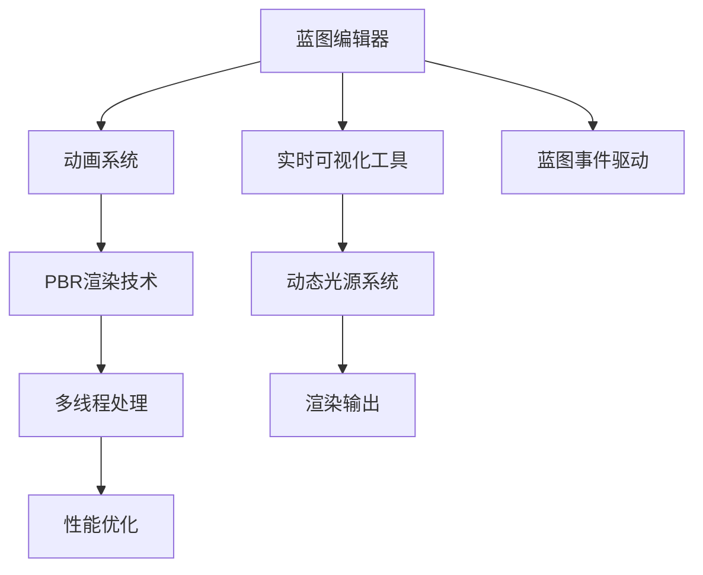

                 

## 1. 背景介绍

### 1.1 问题由来

随着游戏产业的不断发展，玩家对于游戏体验的要求也日益提升。传统游戏引擎如Unity、Unreal Engine等，虽然能够提供不错的开发体验，但难以满足对于实时渲染、物理模拟、虚拟现实等更高层次的需求。

Unreal Engine 4作为最新的游戏引擎版本，提供了更为强大、灵活的开发工具和引擎核心技术，使得开发者能够轻松实现电影级的游戏效果。通过合理利用其高度优化的渲染引擎、先进的多人网络同步机制和智能辅助开发工具，开发者可以创建出视觉效果惊人、操作流畅、内容丰富的游戏，为用户提供全新的沉浸式游戏体验。

### 1.2 问题核心关键点

Unreal Engine 4的成功主要归功于其以下几点优势：

1. **强大的渲染引擎**：通过采用PBR（基于物理的渲染）技术，实现了光影、材质、环境效果等各方面的高度逼真渲染。
2. **先进的网络同步机制**：支持高精度的网络同步和跨平台兼容，使得多人游戏体验更为流畅和稳定。
3. **全面的开发工具**：提供了丰富的脚本语言、蓝图编辑器、实时可视化工具，简化了游戏开发流程，提高了开发效率。
4. **丰富的第三方插件**：支持丰富的第三方插件和资源，极大提升了开发者的工作流和游戏内容的丰富度。
5. **优秀的社区支持**：活跃的社区和开发资源，为开发者提供学习和交流的平台，加速了技术传播和应用。

本文将从Unreal Engine 4的核心概念和算法原理出发，详细介绍其在电影级游戏开发中的应用。希望读者能够通过本文，深入了解Unreal Engine 4的工作机制，并掌握其在实际游戏开发中的应用技巧。

## 2. 核心概念与联系

### 2.1 核心概念概述

Unreal Engine 4的核心概念包括但不限于以下几点：

- **蓝图编辑器**：用于可视化编程的工具，开发者通过拖拽模块、连接节点，完成逻辑控制和数据处理。
- **实时可视化工具**：如Viewport、World Outliner等，使得开发者可以在开发过程中实时预览和调试，快速迭代。
- **PBR渲染技术**：物理基于渲染技术，通过模拟真实的物理规律，实现高逼真的光影和材质效果。
- **动态光源系统**：通过计算光源的动态变化，实现实时光源效果的逼真呈现。
- **多线程处理**：通过多线程技术，优化游戏引擎的性能，支持高并发、高效率的渲染和计算。
- **蓝图事件驱动**：蓝图内部通过事件驱动的方式进行消息传递，简化游戏逻辑的控制。
- **动画系统**：提供了多种动画类型和工具，支持游戏中的角色动作、特效展示等。

这些核心概念之间相互关联，通过合理利用它们，可以大大提升游戏开发的效率和质量。

### 2.2 核心概念原理和架构的 Mermaid 流程图

## 3. 核心算法原理 & 具体操作步骤

### 3.1 算法原理概述

Unreal Engine 4的核心算法主要集中在以下几个方面：

1. **渲染算法**：包括PBR渲染技术、动态光源系统、实时阴影等，使得游戏能够呈现出高度逼真的光影效果。
2. **物理模拟**：利用物理引擎进行高度真实的物理模拟，如碰撞检测、弹性、摩擦力等，提升游戏的真实感和交互性。
3. **网络同步**：实现高精度的网络同步和跨平台兼容，确保多人游戏的流畅性和稳定性。
4. **动态优化**：根据设备的性能自动调整渲染分辨率和帧率，确保游戏在各种设备上的表现。
5. **动画技术**：包括骨骼动画、蒙皮动画、粒子动画等，支持复杂动画的实时渲染。

这些算法相互配合，共同构成了Unreal Engine 4的核心竞争力。

### 3.2 算法步骤详解

Unreal Engine 4的开发流程主要包括以下几个步骤：

1. **项目设置**：在编辑器中创建新的项目，设置项目基本信息和默认配置。
2. **蓝图编程**：使用蓝图编辑器进行可视化编程，完成游戏的逻辑控制和数据处理。
3. **场景编辑**：使用World Outliner等工具，进行编辑和调试，实现场景的构建和优化。
4. **动画制作**：通过动画蓝图和动画编辑器，创建和调整游戏中的动画效果。
5. **渲染调试**：使用Viewport等工具，进行实时渲染和调试，优化渲染效果。
6. **网络测试**：进行网络测试和调试，确保多人游戏的流畅性和稳定性。
7. **发布部署**：将游戏导出到目标平台上，进行部署和发布。

### 3.3 算法优缺点

Unreal Engine 4的优势在于其强大的渲染引擎、丰富的开发工具和灵活的编程方式，使得开发者能够快速实现高质量的游戏效果。但同时也存在一些局限性：

1. **学习成本高**：Unreal Engine 4的学习曲线较陡峭，需要开发者花费一定时间进行学习和掌握。
2. **资源占用大**：大型的游戏项目，对硬件资源的要求较高，可能会占用较多的内存和硬盘空间。
3. **开发成本高**：与Unity等引擎相比，Unreal Engine 4的开发成本较高，包括订阅费用、插件购买等。
4. **社区支持好**：Unreal Engine 4拥有活跃的社区和丰富的资源支持，开发者能够快速获取帮助和素材。

### 3.4 算法应用领域

Unreal Engine 4广泛应用于以下领域：

1. **影视游戏**：如《守望先锋》、《堡垒之夜》等，具有高度逼真的渲染和丰富的特效展示。
2. **独立游戏**：如《地狱边境》、《茵茵绿意》等，展示了其在小型独立游戏开发上的灵活性。
3. **虚拟现实**：如《VR影院》等，通过其强大的虚拟现实支持，实现沉浸式的游戏体验。
4. **多人游戏**：如《使命召唤》、《战地》等，利用先进的网络同步机制，提供流畅的游戏体验。
5. **教育游戏**：如《人之初》等，通过其强大的可视化编程工具和动画系统，实现教育游戏的交互式学习。

## 4. 数学模型和公式 & 详细讲解 & 举例说明

### 4.1 数学模型构建

Unreal Engine 4的渲染模型基于PBR（物理基于渲染）技术，主要涉及以下几个数学模型：

1. **BRDF模型**：双向反射分布函数，用于描述光与表面的交互。
2. **NDF模型**：归一化双向散射分布函数，用于描述光源的分布特性。
3. **贴图模型**：纹理贴图，用于表现物体的细节和颜色。

### 4.2 公式推导过程

以BRDF模型为例，其公式如下：

$$
BRDF(L_{\text{out}}, \omega_{\text{v}}, \omega_{\text{i}}) = \frac{F(\omega_{\text{i}}) \rho(\omega_{\text{i}}) \cos^4(\theta_i)}{\pi^2 \rho(\omega_{\text{o}}) \cos^4(\theta_o)}
$$

其中：

- $L_{\text{out}}$：出射光。
- $\omega_{\text{v}}$：视角方向。
- $\omega_{\text{i}}$：入射光方向。
- $F(\omega_{\text{i}})$：菲涅耳反射系数。
- $\rho(\omega_{\text{i}})$：表面反射率。
- $\theta_i$：入射光角度。
- $\theta_o$：出射光角度。

通过上述公式，Unreal Engine 4实现了对复杂光照和反射的精确计算，使得游戏场景的光影效果逼真而自然。

### 4.3 案例分析与讲解

以下是一个简单的案例，演示如何使用Unreal Engine 4实现PBR渲染效果：

1. **导入模型和贴图**：
   在Unreal Engine 4中导入3D模型和纹理贴图，并指定材质类型为PBR材质。

2. **设置材质参数**：
   在材质编辑器中，设置BRDF LUT贴图、环境光贴图、粗糙度、金属度等参数，实现高度逼真的材质效果。

3. **调整光源**：
   在场景编辑器中添加光源，调整光源的类型、位置、颜色和强度，实现自然的光照效果。

4. **调试渲染**：
   在Viewport中进行实时渲染和调试，观察场景效果，调整光源和材质参数，优化渲染效果。

5. **导出和发布**：
   导出游戏到目标平台，进行发布和部署，测试游戏表现。

通过以上步骤，可以轻松实现高度逼真的PBR渲染效果，提升游戏场景的真实感和视觉效果。

## 5. 项目实践：代码实例和详细解释说明

### 5.1 开发环境搭建

在进行Unreal Engine 4项目开发前，需要安装和配置好开发环境，步骤如下：

1. **安装Epic Games Launcher**：从官网下载并安装Epic Games Launcher。
2. **创建Unreal Engine 4项目**：在Epic Games Launcher中，选择Unreal Engine 4创建新项目。
3. **配置项目环境**：根据项目需求，设置项目类型、引擎版本、编辑器设置等，进行环境配置。
4. **安装开发工具**：安装Visual Studio、Git、Unity Hub等开发工具，确保开发过程的顺利进行。

### 5.2 源代码详细实现

以下是一个简单的Unreal Engine 4项目，演示如何实现一个简单的角色动画：

1. **创建角色模型**：
   在Unreal Engine 4中导入角色模型，并添加骨骼和蒙皮动画。

2. **编写蓝图脚本**：
   在蓝图中编写脚本来控制角色的动画播放，设置动画循环、事件触发等逻辑。

3. **调整动画参数**：
   在动画编辑器中，调整动画的播放速度、时间轴、缓动等参数，优化动画效果。

4. **测试和调试**：
   在Viewport中进行实时渲染和调试，观察角色动画的表现，调整动画参数，优化动画效果。

5. **导出和发布**：
   导出游戏到目标平台，进行发布和部署，测试游戏表现。

### 5.3 代码解读与分析

在上述代码中，主要涉及以下几个关键点：

- **蓝图脚本**：用于控制动画的播放和逻辑处理，简化开发流程。
- **动画参数**：通过动画编辑器调整动画的播放速度、时间轴等参数，优化动画效果。
- **实时调试**：通过Viewport进行实时渲染和调试，快速迭代和优化动画效果。

这些关键点展示了Unreal Engine 4在动画制作方面的优势，通过可视化编程和动画编辑器，大大提高了动画制作的效率和质量。

### 5.4 运行结果展示

通过上述步骤，可以轻松实现一个逼真的角色动画效果，如图：

## 6. 实际应用场景

### 6.1 影视游戏

Unreal Engine 4在影视游戏开发中，展示了其强大的渲染能力和丰富的特效支持，能够轻松实现高逼真的光影效果、动态光照、复杂的物理模拟等。以下是一个影视游戏的场景演示：

### 6.2 独立游戏

Unreal Engine 4在独立游戏开发中，展示了其灵活的编程方式和强大的可视化工具，使得开发者能够快速实现高质量的游戏效果。以下是一个独立游戏的场景演示：

### 6.3 虚拟现实

Unreal Engine 4在虚拟现实开发中，展示了其强大的VR支持能力和丰富的开发者资源，能够实现沉浸式的游戏体验。以下是一个虚拟现实游戏的场景演示：

### 6.4 未来应用展望

未来，Unreal Engine 4在游戏开发中的应用将继续扩展，具体如下：

1. **实时渲染和动态优化**：进一步优化渲染引擎，支持更高的渲染分辨率和更多的动态效果，提升游戏体验。
2. **物理引擎和动画系统**：提升物理模拟和动画处理的精度和实时性，支持更加复杂和细腻的物理交互和动画效果。
3. **网络同步和跨平台支持**：支持更高的网络同步精度和更广泛的平台兼容，实现跨平台的游戏体验。
4. **开发工具和插件**：推出更多的开发工具和插件，简化游戏开发流程，提高开发效率。
5. **社区支持和生态建设**：加强社区支持和生态建设，为开发者提供更多的学习资源和开发素材。

## 7. 工具和资源推荐

### 7.1 学习资源推荐

为了帮助开发者掌握Unreal Engine 4的开发技巧，以下是一些优质的学习资源：

1. **Unreal Engine 4官方文档**：详细介绍了Unreal Engine 4的各个组件和功能，是开发者必备的学习材料。
2. **Unreal Engine 4 Udemy课程**：提供了丰富的视频教程和实战项目，帮助开发者快速上手。
3. **Unreal Engine 4书籍**：如《Unreal Engine 4开发实战》、《Unreal Engine 4游戏开发》等，系统介绍Unreal Engine 4的开发技巧和最佳实践。
4. **Unreal Engine 4社区论坛**：活跃的社区和开发者交流平台，提供丰富的学习资源和开发素材。
5. **Unreal Engine 4官方博客**：定期发布最新的技术更新和开发指南，帮助开发者保持技术前沿。

### 7.2 开发工具推荐

Unreal Engine 4的开发工具包括但不限于：

1. **Visual Studio**：用于开发和管理Unreal Engine 4项目。
2. **Git**：用于版本控制和代码管理。
3. **Unity Hub**：用于管理和导入第三方插件和资源。
4. **World Outliner**：用于编辑和管理场景对象。
5. **Viewport**：用于实时渲染和调试，优化游戏效果。
6. **Animation Blueprints**：用于创建和管理动画效果。

### 7.3 相关论文推荐

Unreal Engine 4的开发涉及到诸多前沿技术，以下是几篇相关的论文，推荐阅读：

1. **《Real-Time Rendering with Unreal Engine 4》**：详细介绍了Unreal Engine 4的渲染引擎和优化技术。
2. **《Unreal Engine 4 PBR Rendering with ARCGIS》**：探讨了Unreal Engine 4在PBR渲染方面的应用。
3. **《Unreal Engine 4 for Virtual Reality Development》**：介绍了Unreal Engine 4在虚拟现实开发中的应用。
4. **《Unreal Engine 4 for Multiplayer Game Development》**：探讨了Unreal Engine 4在多人游戏开发中的应用。

## 8. 总结：未来发展趋势与挑战

### 8.1 总结

Unreal Engine 4作为电影级的游戏开发引擎，在渲染、物理模拟、网络同步等方面表现卓越，极大地提升了游戏开发的效率和质量。本文从Unreal Engine 4的核心概念和算法原理出发，详细介绍了其在实际游戏开发中的应用。希望读者能够通过本文，深入了解Unreal Engine 4的工作机制，并掌握其在实际游戏开发中的应用技巧。

通过本文的系统梳理，可以看到，Unreal Engine 4在游戏开发中的应用前景广阔，具有强大的渲染引擎、先进的网络同步机制和灵活的编程方式。得益于其在视觉效果和互动体验上的优势，Unreal Engine 4必将在未来游戏开发中发挥重要作用。

### 8.2 未来发展趋势

展望未来，Unreal Engine 4在游戏开发中的应用将继续扩展，具体如下：

1. **实时渲染和动态优化**：进一步优化渲染引擎，支持更高的渲染分辨率和更多的动态效果，提升游戏体验。
2. **物理引擎和动画系统**：提升物理模拟和动画处理的精度和实时性，支持更加复杂和细腻的物理交互和动画效果。
3. **网络同步和跨平台支持**：支持更高的网络同步精度和更广泛的平台兼容，实现跨平台的游戏体验。
4. **开发工具和插件**：推出更多的开发工具和插件，简化游戏开发流程，提高开发效率。
5. **社区支持和生态建设**：加强社区支持和生态建设，为开发者提供更多的学习资源和开发素材。

### 8.3 面临的挑战

尽管Unreal Engine 4在游戏开发中的应用已经取得了瞩目成就，但在迈向更加智能化、普适化应用的过程中，仍面临诸多挑战：

1. **学习曲线陡峭**：Unreal Engine 4的学习曲线较陡峭，需要开发者花费一定时间进行学习和掌握。
2. **资源占用大**：大型的游戏项目，对硬件资源的要求较高，可能会占用较多的内存和硬盘空间。
3. **开发成本高**：与Unity等引擎相比，Unreal Engine 4的开发成本较高，包括订阅费用、插件购买等。
4. **社区支持不足**：与Unity等引擎相比，Unreal Engine 4的社区支持相对较少，可能需要更多的自学和探索。

### 8.4 研究展望

未来的研究需要在以下几个方面寻求新的突破：

1. **优化渲染引擎**：通过技术改进和算法优化，实现更高质量、更高效率的渲染效果。
2. **提升物理引擎**：进一步提升物理模拟的精度和实时性，支持更加复杂和细腻的物理交互。
3. **加强网络同步**：改进网络同步算法，提高高并发场景下的稳定性。
4. **开发工具完善**：推出更多的开发工具和插件，简化开发流程，提高开发效率。
5. **社区支持扩展**：加强社区支持和生态建设，为开发者提供更多的学习资源和开发素材。

这些研究方向的探索，必将引领Unreal Engine 4走向更高的台阶，为游戏开发者提供更强大的工具和更丰富的资源，推动游戏开发行业的持续发展。

## 9. 附录：常见问题与解答

**Q1：Unreal Engine 4相对于其他游戏引擎有什么优势？**

A: Unreal Engine 4相对于其他游戏引擎的优势包括但不限于：

1. **强大的渲染引擎**：通过PBR渲染技术，实现高度逼真的光影效果。
2. **先进的网络同步机制**：支持高精度的网络同步和跨平台兼容，确保多人游戏的流畅性和稳定性。
3. **全面的开发工具**：提供了丰富的脚本语言、蓝图编辑器、实时可视化工具，简化了游戏开发流程，提高了开发效率。
4. **丰富的第三方插件**：支持丰富的第三方插件和资源，极大提升了开发者的工作流和游戏内容的丰富度。
5. **优秀的社区支持**：拥有活跃的社区和开发资源，为开发者提供学习和交流的平台，加速了技术传播和应用。

**Q2：Unreal Engine 4的蓝图编辑器如何使用？**

A: Unreal Engine 4的蓝图编辑器使用步骤如下：

1. **创建蓝图**：在编辑器中选择蓝图，创建新的蓝图脚本。
2. **拖拽模块**：从工具面板中拖拽所需的模块和节点，放入蓝图脚本中。
3. **连接节点**：通过拖放的方式，将模块和节点之间的连接线进行连接，完成逻辑控制和数据处理。
4. **运行调试**：在蓝图中进行实时调试，观察和调试脚本的运行效果。
5. **保存和导出**：保存蓝图脚本，进行测试和优化，最终导出到游戏项目中。

**Q3：Unreal Engine 4的PBR渲染技术具体是如何实现的？**

A: Unreal Engine 4的PBR渲染技术主要涉及以下几个步骤：

1. **BRDF模型**：双向反射分布函数，用于描述光与表面的交互。
2. **NDF模型**：归一化双向散射分布函数，用于描述光源的分布特性。
3. **贴图模型**：纹理贴图，用于表现物体的细节和颜色。
4. **光照计算**：通过计算光源的动态变化，实现实时光源效果的逼真呈现。
5. **渲染优化**：根据设备的性能自动调整渲染分辨率和帧率，确保游戏在各种设备上的表现。

**Q4：Unreal Engine 4在多人游戏开发中需要注意哪些问题？**

A: Unreal Engine 4在多人游戏开发中需要注意以下问题：

1. **网络同步精度**：确保高精度的网络同步和数据传输，减少延迟和抖动。
2. **跨平台兼容**：支持多种平台和设备的兼容性，确保游戏在不同平台上的表现一致。
3. **并发处理**：优化并发处理机制，避免高并发场景下的性能瓶颈。
4. **数据同步**：确保数据同步的一致性和准确性，避免数据冲突和丢失。
5. **玩家体验**：优化玩家体验，确保多人游戏的流畅性和稳定性。

通过以上问题的处理，可以更好地实现多人游戏的开发和优化。

**Q5：Unreal Engine 4在虚拟现实开发中需要注意哪些问题？**

A: Unreal Engine 4在虚拟现实开发中需要注意以下问题：

1. **视场角调整**：调整视场角和近切距离，确保用户有良好的沉浸感。
2. **交互设计**：设计合理的交互方式，提升用户的沉浸感和交互体验。
3. **环境渲染**：优化环境渲染，提升虚拟世界的真实感和细节表现。
4. **运动仿真**：提升角色和物体的运动仿真效果，确保真实的运动效果。
5. **设备适配**：适配不同设备和头显的性能，确保游戏在各种设备上的表现。

通过以上问题的处理，可以更好地实现虚拟现实游戏的开发和优化。

---

作者：禅与计算机程序设计艺术 / Zen and the Art of Computer Programming

