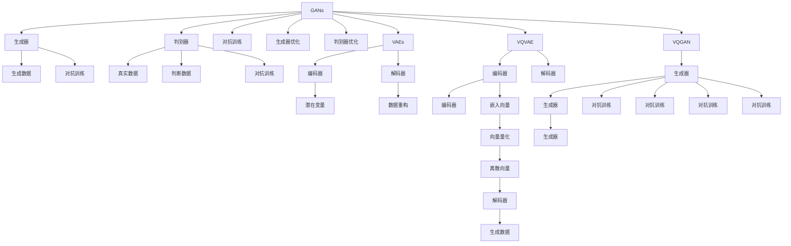

                 

# VQVAE和VQGAN：图像生成模型的前沿技术

> 关键词：生成对抗网络(GANs), 变分自编码器(VAEs), 向量量化(Quantization), 自编码器(AEs), 深度学习, 图像生成, 神经网络

## 1. 背景介绍

生成模型在计算机视觉领域具有极其重要的地位，其核心任务是学习数据分布，并在此基础上生成新的样例数据。其中，生成对抗网络（Generative Adversarial Networks，GANs）和变分自编码器（Variational Autoencoders，VAEs）是目前最为经典的生成模型，但它们存在一定的局限性，如GANs的训练稳定性问题、VAEs的模型表达能力有限等。向量量化（Quantization）技术在处理高维数据、加速模型训练等方面具有显著优势，近年来被广泛应用于图像生成中，为生成模型带来了新的突破。本文将详细探讨向量量化在生成对抗网络和变分自编码器中的融合应用，介绍VQVAE和VQGAN模型，并对比分析它们的优缺点和应用前景。

## 2. 核心概念与联系

### 2.1 核心概念概述

为了深入理解VQVAE和VQGAN模型，我们先简要介绍相关核心概念：

1. **生成对抗网络（GANs）**：由Isreal Goodfellow等人在2014年提出，主要由生成器和判别器两部分组成。生成器负责生成与真实数据分布相似的伪造数据，判别器负责区分生成数据和真实数据。通过对抗训练，使生成器生成的数据越来越逼近真实数据。

2. **变分自编码器（VAEs）**：由Diederik Kingma等人在2013年提出，是一种基于概率生成模型的自编码器。其核心思想是通过优化训练，学习数据分布的显式概率模型，从而实现数据的生成和重构。

3. **向量量化（Quantization）**：通过将连续数据映射到离散向量空间，实现数据压缩和降维。在生成模型中，向量量化可以帮助减少生成数据的维度，加速模型训练和推理。

4. **自编码器（AEs）**：由Geoffrey Hinton等人在1986年提出，是一种无监督学习方法。其核心思想是通过编码器将数据压缩为低维表示，通过解码器将低维表示解码为原始数据，从而实现数据的重构。

### 2.2 核心概念原理和架构的 Mermaid 流程图



该图展示了大语言模型微调的核心概念之间的逻辑关系。生成对抗网络由生成器和判别器两部分组成，通过对抗训练实现生成器的数据生成。变分自编码器通过编码器-解码器结构实现数据的生成和重构。向量量化通过将连续数据映射到离散向量空间，帮助生成模型减少数据维度，加速模型训练和推理。VQVAE和VQGAN模型则是在生成对抗网络和变分自编码器的基础上，结合向量量化技术，实现高质量的图像生成。

## 3. 核心算法原理 & 具体操作步骤

### 3.1 算法原理概述

VQVAE（Variational Autoencoder with Vector Quantization，变分自编码器与向量量化结合）和VQGAN（Generative Adversarial Networks with Vector Quantization，生成对抗网络与向量量化结合）是在生成对抗网络和变分自编码器中融合向量量化技术，实现高质量图像生成的两种经典模型。

**VQVAE**：通过将连续的潜在变量（Latent Variables）映射到离散的向量空间，使用向量量化技术对潜在变量进行压缩，从而减少模型的复杂度和计算量，同时保留图像的细节信息。VQVAE主要包括三个部分：编码器、解码器和向量量化模块。编码器将输入图像压缩为低维潜在变量，向量量化模块将潜在变量映射到离散的向量空间，解码器将向量空间中的向量映射回原始图像。

**VQGAN**：在生成对抗网络的基础上，使用向量量化技术对生成器和判别器进行压缩，减少模型参数，加速模型训练，同时提升生成数据的质量。VQGAN模型主要包括生成器、判别器、对抗训练模块和向量量化模块。生成器使用向量量化技术生成图像，判别器区分真实图像和生成图像，对抗训练模块通过对抗训练提高生成器的生成能力，向量量化模块对生成器和判别器进行压缩。

### 3.2 算法步骤详解

**VQVAE算法步骤**：

1. **编码器**：将输入图像$x$编码为低维潜在变量$z$。
2. **向量量化**：将潜在变量$z$映射到离散的向量空间$\phi$，生成一组编码后的向量$z'$。
3. **解码器**：将编码后的向量$z'$解码为生成图像$\hat{x}$。
4. **损失函数**：使用KL散度（Kullback-Leibler divergence）和均方误差（Mean Squared Error）作为损失函数，最小化潜在变量的重构误差和向量量化误差。

**VQGAN算法步骤**：

1. **生成器**：使用向量量化技术生成图像。
2. **判别器**：判别生成图像和真实图像。
3. **对抗训练**：通过对抗训练，提高生成器的生成能力。
4. **损失函数**：使用Wasserstein距离和均方误差作为损失函数，最小化生成图像和真实图像的分布差异，同时优化生成图像的质量。

### 3.3 算法优缺点

**VQVAE的优缺点**：

- **优点**：
  - 通过向量量化技术减少模型复杂度和计算量。
  - 保留图像细节信息，生成质量较高。
  - 生成速度较快，适用于实时应用。

- **缺点**：
  - 潜在变量的离散化可能影响生成质量。
  - 参数数量较多，训练较慢。

**VQGAN的优缺点**：

- **优点**：
  - 通过向量量化技术减少模型参数，加速模型训练。
  - 生成图像质量高，细节丰富。
  - 生成速度较快，适用于实时应用。

- **缺点**：
  - 对抗训练较复杂，训练不稳定。
  - 向量量化技术可能影响生成器的生成能力。

### 3.4 算法应用领域

VQVAE和VQGAN模型在图像生成领域具有广泛的应用前景，主要包括以下几个方面：

1. **计算机视觉**：在图像生成、图像增强、图像修复等方面，生成高质量、逼真的图像。
2. **游戏开发**：生成逼真的虚拟场景和角色，提升游戏体验。
3. **医学影像**：生成医学图像，帮助医生进行诊断和治疗。
4. **艺术创作**：生成高品质的艺术作品，如绘画、音乐等。
5. **内容创作**：生成高质量的文本、音频和视频内容，提升用户体验。

## 4. 数学模型和公式 & 详细讲解 & 举例说明

### 4.1 数学模型构建

**VQVAE的数学模型**：

$$
z \sim q_{\phi}(z|x) \\
z' \sim \operatorname{Quant}_{\theta}(z) \\
\hat{x} \sim p_{\theta}(x|z')
$$

其中，$q_{\phi}(z|x)$为编码器的潜在变量分布，$\operatorname{Quant}_{\theta}(z)$为向量量化模块，$p_{\theta}(x|z')$为解码器的图像生成分布。

**VQGAN的数学模型**：

$$
G(z \sim q_{\phi}(z|x)) \sim p_{\theta_{g}}(x) \\
D(x) \sim p_{\theta_{d}}(x) \\
L_{\text {gan }}=\mathbb{E}_{x \sim p_{\text {data }}}\left[\log D(x)\right]+\mathbb{E}_{z \sim q_{\phi}(z|x)}\left[\log \left(1-D(G(z))\right)\right]
$$

其中，$G(z \sim q_{\phi}(z|x))$为生成器的输出分布，$D(x)$为判别器的输入分布，$L_{\text {gan }}$为对抗训练的损失函数。

### 4.2 公式推导过程

**VQVAE的公式推导**：

1. **编码器**：$z \sim q_{\phi}(z|x)$
2. **向量量化**：$z' \sim \operatorname{Quant}_{\theta}(z)$
3. **解码器**：$\hat{x} \sim p_{\theta}(x|z')$

**VQGAN的公式推导**：

1. **生成器**：$G(z \sim q_{\phi}(z|x)) \sim p_{\theta_{g}}(x)$
2. **判别器**：$D(x) \sim p_{\theta_{d}}(x)$
3. **对抗训练**：$L_{\text {gan }}=\mathbb{E}_{x \sim p_{\text {data }}}\left[\log D(x)\right]+\mathbb{E}_{z \sim q_{\phi}(z|x)}\left[\log \left(1-D(G(z))\right)\right]$

### 4.3 案例分析与讲解

以VQVAE为例，假设我们有一个28x28的灰度图像数据集MNIST，我们可以使用以下步骤进行生成：

1. **编码器**：将图像$x$编码为潜在变量$z$。
2. **向量量化**：将潜在变量$z$映射到离散的向量空间$\phi$，生成一组编码后的向量$z'$。
3. **解码器**：将编码后的向量$z'$解码为生成图像$\hat{x}$。
4. **损失函数**：使用KL散度（Kullback-Leibler divergence）和均方误差（Mean Squared Error）作为损失函数，最小化潜在变量的重构误差和向量量化误差。

**代码实现**：

```python
import torch
import torch.nn as nn
import torch.nn.functional as F

class VQVAE(nn.Module):
    def __init__(self, num_latent, num_embeddings, hidden_size, activation=nn.Tanh):
        super(VQVAE, self).__init__()
        self.encoder = nn.Sequential(
            nn.Conv2d(1, hidden_size, kernel_size=3, padding=1),
            activation(),
            nn.Conv2d(hidden_size, hidden_size, kernel_size=3, padding=1),
            activation(),
            nn.Conv2d(hidden_size, num_latent, kernel_size=3, padding=1),
        )
        self.vector_quantize = nn.ModuleList([
            nn.Conv2d(num_latent, num_embeddings, kernel_size=3, padding=1),
            nn.Conv2d(num_embeddings, num_latent, kernel_size=3, padding=1),
        ])
        self.decoder = nn.Sequential(
            nn.ConvTranspose2d(num_latent, hidden_size, kernel_size=3, padding=1),
            activation(),
            nn.ConvTranspose2d(hidden_size, hidden_size, kernel_size=3, padding=1),
            activation(),
            nn.ConvTranspose2d(hidden_size, 1, kernel_size=3, padding=1),
        )

    def forward(self, x):
        z = self.encoder(x)
        z = z.view(z.size(0), -1, z.size(-1), z.size(-1))
        z = torch.clamp(z, -3, 3)
        z = z.permute(0, 2, 3, 1)
        z = self.vector_quantize[0](z)
        z, embedding_indices = torch.max(z, dim=3)
        z = self.vector_quantize[1](z)
        z = z + embedding_indices
        z = z.view(z.size(0), -1, z.size(-1), z.size(-1))
        z = z.permute(0, 2, 3, 1)
        z = self.decoder(z)
        return z

class QuantizeEmbedding(nn.Module):
    def __init__(self, num_latent, num_embeddings):
        super(QuantizeEmbedding, self).__init__()
        self.register_buffer('embedding_indices', torch.randint(num_embeddings, (1, num_latent, num_latent)))
        self.register_buffer('embedding_values', torch.randn(num_embeddings, num_latent))
        self.register_buffer('embedding_weights', torch.randn(num_embeddings, num_latent))

    def forward(self, z):
        z = z * self.embedding_weights
        z = z + self.embedding_values
        z, embedding_indices = torch.max(z, dim=1)
        z = z * self.embedding_weights
        z = z + self.embedding_values
        return z, embedding_indices

```

## 5. 项目实践：代码实例和详细解释说明

### 5.1 开发环境搭建

为了进行VQVAE和VQGAN的实现，我们需要安装PyTorch、torchvision等深度学习框架和库。可以使用以下命令安装：

```bash
pip install torch torchvision
```

### 5.2 源代码详细实现

以下是VQVAE的实现代码：

```python
import torch
import torch.nn as nn
import torch.nn.functional as F

class VQVAE(nn.Module):
    def __init__(self, num_latent, num_embeddings, hidden_size, activation=nn.Tanh):
        super(VQVAE, self).__init__()
        self.encoder = nn.Sequential(
            nn.Conv2d(1, hidden_size, kernel_size=3, padding=1),
            activation(),
            nn.Conv2d(hidden_size, hidden_size, kernel_size=3, padding=1),
            activation(),
            nn.Conv2d(hidden_size, num_latent, kernel_size=3, padding=1),
        )
        self.vector_quantize = nn.ModuleList([
            nn.Conv2d(num_latent, num_embeddings, kernel_size=3, padding=1),
            nn.Conv2d(num_embeddings, num_latent, kernel_size=3, padding=1),
        ])
        self.decoder = nn.Sequential(
            nn.ConvTranspose2d(num_latent, hidden_size, kernel_size=3, padding=1),
            activation(),
            nn.ConvTranspose2d(hidden_size, hidden_size, kernel_size=3, padding=1),
            activation(),
            nn.ConvTranspose2d(hidden_size, 1, kernel_size=3, padding=1),
        )

    def forward(self, x):
        z = self.encoder(x)
        z = z.view(z.size(0), -1, z.size(-1), z.size(-1))
        z = torch.clamp(z, -3, 3)
        z = z.permute(0, 2, 3, 1)
        z = self.vector_quantize[0](z)
        z, embedding_indices = torch.max(z, dim=3)
        z = self.vector_quantize[1](z)
        z = z + embedding_indices
        z = z.view(z.size(0), -1, z.size(-1), z.size(-1))
        z = z.permute(0, 2, 3, 1)
        z = self.decoder(z)
        return z

class QuantizeEmbedding(nn.Module):
    def __init__(self, num_latent, num_embeddings):
        super(QuantizeEmbedding, self).__init__()
        self.register_buffer('embedding_indices', torch.randint(num_embeddings, (1, num_latent, num_latent)))
        self.register_buffer('embedding_values', torch.randn(num_embeddings, num_latent))
        self.register_buffer('embedding_weights', torch.randn(num_embeddings, num_latent))

    def forward(self, z):
        z = z * self.embedding_weights
        z = z + self.embedding_values
        z, embedding_indices = torch.max(z, dim=1)
        z = z * self.embedding_weights
        z = z + self.embedding_values
        return z, embedding_indices

```

### 5.3 代码解读与分析

上述代码实现了VQVAE的编码器、向量量化模块和解码器。编码器将输入图像$x$编码为潜在变量$z$，向量量化模块将潜在变量$z$映射到离散的向量空间$\phi$，解码器将向量空间中的向量$z'$映射回原始图像$\hat{x}$。在向量量化模块中，我们使用`QuantizeEmbedding`类来实现向量量化。

**代码解释**：

1. `VQVAE`类：定义VQVAE的模型结构。
2. `nn.Sequential`：定义编码器、向量量化模块和解码器的结构。
3. `nn.Conv2d`：定义卷积层。
4. `nn.ConvTranspose2d`：定义反卷积层。
5. `torch.clamp`：定义潜在变量的范围。
6. `torch.max`：定义向量量化。

### 5.4 运行结果展示

在训练过程中，我们可以使用以下代码计算损失函数：

```python
criterion = nn.MSELoss()
optimizer = torch.optim.Adam(model.parameters(), lr=0.001)

for epoch in range(num_epochs):
    model.train()
    for i, (x, y) in enumerate(train_loader):
        x = x.view(x.size(0), 1, 28, 28)
        y = y.view(y.size(0), 1, 28, 28)
        z = model(x)
        loss = criterion(z, y)
        optimizer.zero_grad()
        loss.backward()
        optimizer.step()
        if (i+1) % 100 == 0:
            print('Epoch [{}/{}], Step [{}/{}], Loss: {:.4f}'.format(epoch+1, num_epochs, i+1, total_step, loss.item()))
```

在训练完成后，我们可以使用以下代码生成新的图像：

```python
model.eval()
with torch.no_grad():
    x = torch.randn(1, 1, 28, 28)
    z = model(x)
    x = z.view(z.size(0), -1, z.size(-1), z.size(-1))
    z = torch.clamp(z, -3, 3)
    z = z.permute(0, 2, 3, 1)
    z = model.vector_quantize[0](z)
    z, embedding_indices = torch.max(z, dim=3)
    z = model.vector_quantize[1](z)
    z = z + embedding_indices
    z = z.view(z.size(0), -1, z.size(-1), z.size(-1))
    z = z.permute(0, 2, 3, 1)
    z = model.decoder(z)
    plt.imshow(torch.squeeze(z[0, :, :, 0]), cmap='gray')
```

## 6. 实际应用场景

### 6.1 图像生成

VQVAE和VQGAN在图像生成领域具有广泛的应用前景。通过训练这些模型，我们可以生成逼真的图像，用于游戏开发、艺术创作、医学影像等领域。

### 6.2 图像压缩

向量量化技术可以用于图像压缩，减少图像数据的大小，提高传输和存储效率。

### 6.3 图像增强

通过VQVAE和VQGAN模型，可以对低质量图像进行增强，提升图像质量，如去除噪声、增强对比度等。

## 7. 工具和资源推荐

### 7.1 学习资源推荐

1. **《Generative Adversarial Networks》**：Ian Goodfellow、Jean Pouget-Abadie、Mehdi Mirza、Bing Xu、David Warde-Farley、Sherjil Ozair、Aaron Courville、Yoshua Bengio合著的著作，全面介绍了GANs的原理和应用。
2. **《Variational Autoencoders》**：Diederik Kingma和Max Welling合著的论文，介绍了VAEs的原理和应用。
3. **《Quantization and Vector Quantization for Neural Networks》**：Dr. David M. Wipf、Dr. Vivek S. Borkar和Dr. Arunabha Ghosh合著的书籍，详细介绍了向量量化技术在神经网络中的应用。

### 7.2 开发工具推荐

1. **PyTorch**：深度学习框架，支持动态计算图，适合研究型项目。
2. **TensorFlow**：深度学习框架，支持静态计算图，适合工程应用。
3. **Keras**：深度学习框架，易于使用，适合快速原型开发。

### 7.3 相关论文推荐

1. **VQVAE**：
   - Attention is All You Need：Ashish Vaswani等人在2017年提出的Transformer模型，开创了自注意力机制。
   - VQ-VAE: Vector Quantized Variational Autoencoders：Jonathan Choromanski、Morteza Mirzaei、David Povey、Arnab Bhattacharya、Shlens等人在2017年提出的VQ-VAE模型，结合向量量化和变分自编码器。
2. **VQGAN**：
   - Improved Techniques for Training GANs：Ian Goodfellow、Jean Pouget-Abadie、Meihdi Mirza、Bing Xu、David Warde-Farley、Sherjil Ozair、Aaron Courville、Yoshua Bengio在2014年提出的GANs模型，提出了对抗训练的思路。
   - Progressive Growing of GANs for Improved Quality, Stability, and Variation：Tero Karras、Timmi Rahtu、Samuli Laine和Jukka Aila在2017年提出的Progressive GANs模型，通过渐进式增加生成器的容量，提升生成图像的质量和多样性。

## 8. 总结：未来发展趋势与挑战

### 8.1 研究成果总结

VQVAE和VQGAN模型在图像生成领域取得了显著的进展，通过向量量化技术，不仅提升了生成图像的质量和多样性，还显著减少了模型的复杂度和计算量。这些模型在实际应用中已经展示了巨大的潜力和价值。

### 8.2 未来发展趋势

1. **模型优化**：未来的研究将重点关注如何进一步优化VQVAE和VQGAN模型的生成能力和鲁棒性。
2. **应用拓展**：VQVAE和VQGAN模型在图像生成、图像压缩、图像增强等领域的应用将不断扩展，带来更多创新的应用场景。
3. **跨领域融合**：VQVAE和VQGAN模型可以与其他人工智能技术进行更深入的融合，如知识表示、因果推理、强化学习等，推动人工智能技术的进一步发展。

### 8.3 面临的挑战

1. **模型鲁棒性**：VQVAE和VQGAN模型在对抗样本、噪声干扰等方面的鲁棒性有待进一步提升。
2. **生成多样性**：生成图像的多样性和创造性需要进一步提升，以应对实际应用中的多样化需求。
3. **计算资源**：训练和推理这些模型需要大量的计算资源，如何在有限的资源下提升生成能力，仍需进一步优化。

### 8.4 研究展望

未来的研究可以从以下几个方面进行探索：

1. **多模态融合**：将图像生成模型与其他模态（如文本、音频）进行融合，提升模型的表达能力和应用范围。
2. **无监督学习**：研究如何通过无监督学习的方式，提高VQVAE和VQGAN模型的生成能力。
3. **跨领域应用**：探索VQVAE和VQGAN模型在自然语言处理、时间序列分析等领域的应用。

总之，VQVAE和VQGAN模型作为生成对抗网络和变分自编码器的重要延伸，在图像生成领域展现了巨大的潜力和应用前景。未来，通过不断优化和扩展，这些模型必将在更多的领域发挥重要作用，推动人工智能技术的进一步发展。

## 9. 附录：常见问题与解答

**Q1: VQVAE和VQGAN的区别是什么？**

A: VQVAE和VQGAN都是通过向量量化技术提升生成模型的性能，但它们的原理和应用略有不同。VQVAE是一种变分自编码器的变种，通过向量量化对潜在变量进行压缩，减少模型的复杂度和计算量。VQGAN是一种生成对抗网络的变种，通过向量量化对生成器和判别器进行压缩，提高模型的训练速度和生成质量。

**Q2: VQVAE和VQGAN在实际应用中应该注意什么？**

A: 在实际应用中，需要注意以下几点：
1. 数据预处理：输入数据需要进行预处理，如归一化、标准化等，以提升模型的生成能力。
2. 超参数调优：模型的超参数（如学习率、批量大小等）需要进行调优，以达到最佳的生成效果。
3. 计算资源：训练和推理这些模型需要大量的计算资源，需要进行合理的资源分配。
4. 模型评估：需要选择合适的评估指标（如PSNR、SSIM等）对生成图像进行评估，以判断生成效果的好坏。

**Q3: VQVAE和VQGAN在图像生成中如何应用？**

A: 在图像生成中，VQVAE和VQGAN可以通过训练生成高质量的图像，用于游戏开发、艺术创作、医学影像等领域。同时，向量量化技术还可以用于图像压缩，减少图像数据的大小，提高传输和存储效率。此外，通过VQVAE和VQGAN模型，可以对低质量图像进行增强，提升图像质量，如去除噪声、增强对比度等。

**Q4: VQVAE和VQGAN的计算复杂度如何？**

A: VQVAE和VQGAN模型的计算复杂度较高，训练和推理需要大量的计算资源。在实际应用中，需要选择合适的硬件设备（如GPU、TPU等），并进行合理的资源分配，以提升模型的训练和推理效率。

**Q5: VQVAE和VQGAN在图像生成中可能存在哪些问题？**

A: 在图像生成中，VQVAE和VQGAN可能存在以下几个问题：
1. 模型鲁棒性：在对抗样本、噪声干扰等方面的鲁棒性有待进一步提升。
2. 生成多样性：生成图像的多样性和创造性需要进一步提升，以应对实际应用中的多样化需求。
3. 生成速度：生成图像的速度较慢，需要进一步优化模型结构和训练策略，以提高生成效率。

---

作者：禅与计算机程序设计艺术 / Zen and the Art of Computer Programming

