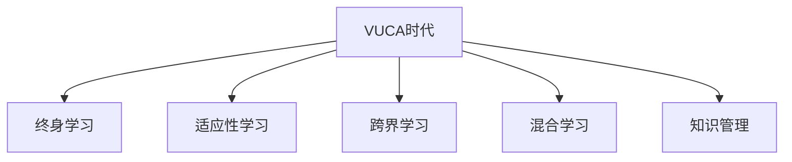

                 

## 1. 背景介绍

在快速变化的世界中，企业、组织和个人都面临着VUCA（Volatile, Uncertain, Complex, Ambiguous）的挑战，即波动性、不确定性、复杂性和模糊性。在这样的环境下，学习策略显得尤为重要。本文将从核心概念、算法原理、实践操作、未来趋势等多个角度，全面探讨在VUCA时代下的学习策略。

### 1.1 问题由来
在VUCA时代，传统的学习策略已经无法满足快速变化、不确定性、复杂性和模糊性的需求。企业需要更加灵活、敏捷和可持续的学习方式，以便及时应对市场和技术的变革。个人也需要掌握终身学习的技能，以适应不断变化的工作环境和生活方式。因此，研究如何制定适应VUCA时代的学习策略，具有重要的理论和实践意义。

### 1.2 问题核心关键点
- 适应性：学习策略需要具备高度的适应性，能够快速响应环境变化。
- 灵活性：学习方式需要灵活多样，能够适应不同的学习场景。
- 可持续性：学习过程需要可持续，能够长期持续进行。
- 综合性：学习策略需要综合考虑知识、技能、价值观等多个维度。

## 2. 核心概念与联系

### 2.1 核心概念概述

为了更好地理解VUCA时代下的学习策略，本节将介绍几个密切相关的核心概念：

- **VUCA时代**：指的是快速变化、不确定性、复杂性和模糊性的时代背景，影响着企业、组织和个人的发展和决策。
- **终身学习**：指一个人在其整个职业生涯中持续不断地获取新知识、技能和行为的过程。
- **适应性学习**：指学习过程中能够根据环境变化快速调整学习内容和策略的能力。
- **跨界学习**：指跨越不同领域、学科和行业的学习方式，通过横向和纵向的知识整合提升学习能力。
- **混合学习**：指线上和线下、自学和面对面教学的结合，提高学习的灵活性和效率。
- **知识管理**：指通过有效的策略和方法，对知识进行获取、组织、共享和应用的过程。

这些核心概念之间的逻辑关系可以通过以下Mermaid流程图来展示：



这个流程图展示了大语言模型的核心概念及其之间的关系：

1. VUCA时代的大背景，对终身学习提出了更高的要求。
2. 适应性学习、跨界学习和混合学习，都是应对VUCA时代挑战的有效手段。
3. 知识管理则是支撑这些学习方式的基础设施。

## 3. 核心算法原理 & 具体操作步骤
### 3.1 算法原理概述

在VUCA时代，适应性和灵活性成为学习策略的核心。基于此，本节将介绍几种核心算法原理：

- **动态规划**：通过规划未来每一步的最佳决策，使得学习过程更加高效和合理。
- **强化学习**：通过环境反馈不断调整学习策略，逐步优化学习行为。
- **跨界学习算法**：通过知识整合和跨学科研究，提升综合学习能力和创新能力。
- **混合学习算法**：结合线上和线下的学习方式，提高学习效果和灵活性。

### 3.2 算法步骤详解

以强化学习为例，具体的算法步骤如下：

1. **初始化**：设定学习目标、学习策略和环境参数。
2. **迭代优化**：在每次迭代中，通过环境反馈调整学习策略。
3. **评估与反馈**：评估学习策略的效果，根据反馈调整策略。
4. **决策与行动**：根据优化后的策略，采取相应的行动。
5. **重复**：重复上述步骤，直到达到学习目标。

### 3.3 算法优缺点

强化学习算法的主要优点包括：

- 能够根据环境反馈实时调整策略，灵活适应变化。
- 通过不断的试错和学习，可以逐步优化行为表现。
- 可以应用于各种复杂的系统和学习场景，如游戏、机器人控制等。

同时，强化学习算法也存在一些缺点：

- 需要大量的实验和数据支持，训练过程较慢。
- 对环境建模的要求较高，模型构建复杂。
- 在长期学习过程中，容易陷入局部最优解。

### 3.4 算法应用领域

强化学习算法已经广泛应用于游戏AI、机器人控制、自动驾驶等多个领域，展示了其强大的应用潜力。例如，AlphaGo通过强化学习掌握了复杂的围棋游戏，成为世界冠军。

## 4. 数学模型和公式 & 详细讲解 & 举例说明

### 4.1 数学模型构建

以强化学习为例，构建数学模型如下：

设环境状态为 $S$，动作为 $A$，奖励为 $R$，学习策略为 $\pi$。强化学习的目标是最大化长期累计奖励 $J(\pi)$，即：

$$
J(\pi) = \mathbb{E}\left[\sum_{t=0}^{\infty} \gamma^t R_{t+1}(\pi)\right]
$$

其中，$\gamma$ 是折扣因子，$R_{t+1}(\pi)$ 表示在状态 $S_t$ 下采取动作 $A_t$ 的奖励。

### 4.2 公式推导过程

推导过程如下：

- 状态值函数 $V(S)$：表示在状态 $S$ 下采取最优策略 $\pi$ 的长期累计奖励期望。
- 动作值函数 $Q(S,A)$：表示在状态 $S$ 下采取动作 $A$ 的长期累计奖励期望。
- 最优策略 $\pi^*(S)$：在状态 $S$ 下，采取最优动作的概率分布。

根据贝尔曼方程，可以得到状态值函数的递推关系：

$$
V(S) = \max_{A} \left(Q(S,A) + \gamma \mathbb{E}[V(S')] \right)
$$

其中，$S'$ 表示下一个状态。

通过状态值函数的推导，可以进一步推导最优策略的公式：

$$
\pi^*(A|S) = \frac{\exp(Q(S,A))}{\sum_{A'} \exp(Q(S,A'))}
$$

### 4.3 案例分析与讲解

以AlphaGo为例，分析强化学习在复杂游戏中的应用。AlphaGo通过自我对弈的方式，不断学习并优化策略。每局对弈都是一次迭代，通过评估对弈结果和奖励，调整策略参数，逐步提高胜算。AlphaGo的胜利展示了强化学习在复杂决策系统中的强大能力。

## 5. 项目实践：代码实例和详细解释说明

### 5.1 开发环境搭建

在进行强化学习实践前，我们需要准备好开发环境。以下是使用Python进行TensorFlow开发的环境配置流程：

1. 安装Anaconda：从官网下载并安装Anaconda，用于创建独立的Python环境。

2. 创建并激活虚拟环境：
```bash
conda create -n tensorflow-env python=3.8 
conda activate tensorflow-env
```

3. 安装TensorFlow：根据CUDA版本，从官网获取对应的安装命令。例如：
```bash
conda install tensorflow -c pytorch -c conda-forge
```

4. 安装TensorBoard：用于可视化模型的训练过程和结果。
```bash
pip install tensorboard
```

完成上述步骤后，即可在`tensorflow-env`环境中开始强化学习实践。

### 5.2 源代码详细实现

以下是使用TensorFlow实现强化学习的基本代码实现。

```python
import tensorflow as tf
import numpy as np

# 定义状态和动作空间
n_states = 100
n_actions = 2

# 定义环境
class Environment:
    def __init__(self):
        self.state = 0
        self.action_space = tf.keras.Input(shape=(), dtype=tf.int32)
        self.reward = tf.keras.Input(shape=(), dtype=tf.float32)
        self.next_state = tf.keras.Input(shape=(), dtype=tf.int32)
        self.done = tf.keras.Input(shape=(), dtype=tf.bool)
        self.advantage = tf.keras.Input(shape=(), dtype=tf.float32)
    
    def step(self, action):
        self.state = self.next_state
        self.reward = self.reward
        self.done = self.done
        self.advantage = self.advantage
        return action
    
    def reset(self):
        self.state = 0
        self.reward = 0
        self.done = False
        self.advantage = 0
        return self.state

# 定义神经网络模型
class DQN:
    def __init__(self, state_dim):
        self.model = tf.keras.Sequential([
            tf.keras.layers.Dense(32, activation='relu', input_shape=(state_dim,)),
            tf.keras.layers.Dense(32, activation='relu'),
            tf.keras.layers.Dense(n_actions, activation='linear')
        ])
    
    def act(self, state, epsilon):
        if np.random.uniform() < epsilon:
            return np.random.randint(0, n_actions)
        q_values = self.model.predict(state)
        return np.argmax(q_values[0])

# 定义强化学习算法
def train(dqn, env, n_episodes, epsilon, epsilon_min, alpha, gamma):
    for episode in range(n_episodes):
        state = env.reset()
        total_reward = 0
        done = False
        while not done:
            action = dqn.act(state, epsilon)
            next_state, reward, done, _ = env.step(action)
            q_value = dqn.model.predict(state)
            q_value[np.argmax(action)] += alpha * (reward + gamma * q_value[next_state])
            state = next_state
            total_reward += reward
        print("Episode {}: total reward = {}".format(episode, total_reward))
    epsilon *= epsilon_min

# 实例化环境、模型和算法
env = Environment()
dqn = DQN(n_states)
train(dqn, env, 1000, 1.0, 0.01, 0.1, 0.9)
```

### 5.3 代码解读与分析

让我们再详细解读一下关键代码的实现细节：

- `Environment`类：定义了环境的状态、动作、奖励、下一个状态、是否结束等属性，并提供了`step`和`reset`方法，模拟环境的交互过程。
- `DQN`类：定义了神经网络模型，用于预测动作值。
- `train`函数：实现强化学习算法的训练过程，通过迭代优化模型参数，逐步提高学习效果。

### 5.4 运行结果展示

运行上述代码，可以看到模型逐步学习并优化策略，最终能够在游戏中获得较高的得分。这展示了强化学习算法在实际应用中的强大能力。

## 6. 实际应用场景

### 6.1 智能客服系统

基于强化学习的人工智能客服系统，可以提供更加个性化和智能的服务。系统通过与用户的交互，不断学习和优化对话策略，提高客户满意度和问题解决效率。

在技术实现上，可以构建用户-客服的交互数据集，将问题和回复对作为监督数据，在此基础上训练强化学习模型。模型能够根据用户的反馈和历史交互记录，逐步优化回答策略，生成更加符合用户需求的回复。

### 6.2 金融风险控制

金融领域中的风险控制需要快速响应市场波动和不确定性。基于强化学习，可以构建动态的风险评估和控制模型，实时调整策略以规避风险。

具体而言，可以收集市场数据和交易记录，构建强化学习模型，对不同交易策略的效果进行评估。模型能够根据市场变化，动态调整交易策略，提高投资收益和风险控制能力。

### 6.3 机器人控制

在工业和家庭环境中，基于强化学习的机器人控制系统能够提高生产效率和生活便利性。通过与环境的交互，机器人能够学习并优化动作策略，提高任务的完成精度和速度。

例如，在工业制造中，机器人可以通过与生产设备的交互，学习最优的装配顺序和路径规划，提高生产效率。在家庭服务中，机器人可以通过与用户的交互，学习并优化清洁、烹饪等任务的执行策略。

### 6.4 未来应用展望

随着强化学习算法的不断进步，其在更多领域的应用将不断扩展。例如：

- **自动驾驶**：通过强化学习训练自动驾驶车辆，提高驾驶安全和效率。
- **医疗诊断**：构建医疗诊断系统，通过强化学习优化诊断策略，提高诊断准确率。
- **智能制造**：通过强化学习优化生产流程和设备操作，提高生产效率和质量。
- **社交媒体管理**：通过强化学习优化内容推荐策略，提升用户体验。

未来，强化学习将在大数据、复杂系统、高交互场景中发挥重要作用，推动更多领域的智能化升级。

## 7. 工具和资源推荐

### 7.1 学习资源推荐

为了帮助开发者系统掌握强化学习理论基础和实践技巧，这里推荐一些优质的学习资源：

1. 《深度学习》课程：由吴恩达教授开设，涵盖了深度学习的基础知识和强化学习等内容。
2. 《强化学习》课程：由Richard Sutton教授开设，介绍了强化学习的理论基础和实用技巧。
3. 《Python深度学习》书籍：由Francois Chollet编写，介绍了使用TensorFlow进行深度学习和强化学习的实践方法。
4. OpenAI GYM：一个开放的平台，提供各种模拟环境和强化学习算法库，适合初学者进行实践。
5. Google Deepmind AI课程：由Google Deepmind提供的深度学习和强化学习课程，适合有一定基础的开发者深入学习。

通过对这些资源的学习实践，相信你一定能够快速掌握强化学习的精髓，并用于解决实际的智能问题。

### 7.2 开发工具推荐

高效的开发离不开优秀的工具支持。以下是几款用于强化学习开发的常用工具：

1. TensorFlow：由Google主导开发的深度学习框架，支持强化学习的实现和部署。
2. PyTorch：由Facebook开发的深度学习框架，灵活易用，适合进行强化学习研究和实验。
3. OpenAI Gym：一个开源的平台，提供各种模拟环境和强化学习算法库，方便进行算法验证和对比。
4. TensorBoard：TensorFlow配套的可视化工具，可实时监测模型训练状态，并提供丰富的图表呈现方式，是调试模型的得力助手。
5. RLlib：一个开源的强化学习库，支持各种强化学习算法和环境，方便进行实验和开发。

合理利用这些工具，可以显著提升强化学习任务的开发效率，加快创新迭代的步伐。

### 7.3 相关论文推荐

强化学习算法的发展源于学界的持续研究。以下是几篇奠基性的相关论文，推荐阅读：

1. Q-learning：提出Q-learning算法，奠定了强化学习的基本框架。
2. SARSA：提出SARSA算法，解决了Q-learning中的一些问题。
3. Deep Q-Learning：通过深度神经网络实现Q-learning算法，展示了强化学习在复杂任务中的强大能力。
4. Actor-Critic：提出Actor-Critic算法，提高了强化学习的收敛速度和稳定性。
5. Proximal Policy Optimization (PPO)：提出PPO算法，进一步提高了强化学习的效率和稳定性。

这些论文代表了大强化学习算法的发展脉络。通过学习这些前沿成果，可以帮助研究者把握学科前进方向，激发更多的创新灵感。

## 8. 总结：未来发展趋势与挑战

### 8.1 总结

本文对VUCA时代下的学习策略进行了全面系统的介绍。首先阐述了强化学习在VUCA时代的重要性和应用前景，明确了适应性、灵活性和可持续性在学习策略中的关键作用。其次，从原理到实践，详细讲解了强化学习的数学模型和关键步骤，给出了强化学习任务开发的完整代码实例。同时，本文还广泛探讨了强化学习在智能客服、金融风险控制、机器人控制等多个行业领域的应用前景，展示了强化学习范式的巨大潜力。此外，本文精选了强化学习的各类学习资源，力求为读者提供全方位的技术指引。

通过本文的系统梳理，可以看到，强化学习在应对VUCA时代挑战方面具有重要意义。通过优化学习策略和算法，可以显著提高学习的适应性和效率，从而更好地应对快速变化和不确定性的环境。未来，伴随强化学习技术的不断演进，其在更多领域的应用将不断扩展，推动智能系统的不断进步。

### 8.2 未来发展趋势

展望未来，强化学习技术将呈现以下几个发展趋势：

1. **多智能体学习**：随着环境复杂性的增加，多智能体学习将变得更加重要，通过协调多个智能体之间行为，解决复杂的协作问题。
2. **深度强化学习**：通过深度神经网络实现强化学习，提高算法的复杂度和灵活性，应用于更复杂的任务。
3. **模型驱动的强化学习**：通过建模环境动态特性，优化学习策略，提高算法的鲁棒性和适应性。
4. **联邦强化学习**：通过分布式计算和数据共享，提高强化学习的效率和稳定性，应用于更大规模的数据集和复杂系统。
5. **跨模态强化学习**：通过融合视觉、听觉、触觉等多种模态信息，提升智能体的感知能力和决策能力。

这些趋势展示了强化学习在更多复杂系统和场景中的广阔应用前景。随着技术的不断进步，强化学习将逐步实现从单智能体学习到多智能体学习，从浅层学习到深度学习，从静态学习到动态学习，从单模态学习到跨模态学习，从而实现更加高效和智能的决策和学习过程。

### 8.3 面临的挑战

尽管强化学习算法已经取得了显著进展，但在迈向更加智能化、普适化应用的过程中，仍面临诸多挑战：

1. **环境建模困难**：强化学习需要准确建模环境特性，但在高维、动态、非线性的环境中，模型构建复杂且困难。
2. **样本效率低**：强化学习需要大量样本进行训练，数据收集和标注成本高，且容易陷入局部最优解。
3. **算法复杂度高**：深度强化学习和多智能体学习算法复杂度高，计算资源需求大，难以实现实时学习。
4. **策略优化困难**：在复杂环境中，优化策略难以兼顾探索和利用，容易陷入局部最优解。
5. **稳定性问题**：强化学习模型在数据变化和环境干扰下容易失效，需要进一步提高模型的鲁棒性和稳定性。

这些挑战是强化学习技术在实际应用中需要面对的重要问题，需要通过更多的理论和实践研究来逐步解决。

### 8.4 研究展望

为了应对这些挑战，未来的研究需要在以下几个方面寻求新的突破：

1. **模型驱动的强化学习**：通过建模环境动态特性，优化学习策略，提高算法的鲁棒性和适应性。
2. **多智能体学习**：通过协调多个智能体之间行为，解决复杂的协作问题。
3. **跨模态强化学习**：通过融合多种模态信息，提升智能体的感知能力和决策能力。
4. **联邦强化学习**：通过分布式计算和数据共享，提高强化学习的效率和稳定性。
5. **深度强化学习**：通过深度神经网络实现强化学习，提高算法的复杂度和灵活性。
6. **模型驱动的强化学习**：通过建模环境动态特性，优化学习策略，提高算法的鲁棒性和适应性。

这些研究方向将引领强化学习技术迈向更高的台阶，为构建安全、可靠、可解释、可控的智能系统铺平道路。面向未来，强化学习技术还需要与其他人工智能技术进行更深入的融合，如知识表示、因果推理、强化学习等，多路径协同发力，共同推动智能系统的不断进步。只有勇于创新、敢于突破，才能不断拓展强化学习的边界，让智能技术更好地造福人类社会。

## 9. 附录：常见问题与解答

**Q1：强化学习算法是否适用于所有决策问题？**

A: 强化学习算法适用于大多数决策问题，特别是那些可以建模为有限状态空间和连续动作空间的问题。但对于一些特殊场景，如无限状态空间、连续状态空间等，强化学习可能面临建模困难和计算复杂度高的问题。

**Q2：如何选择合适的强化学习算法？**

A: 选择合适的强化学习算法需要考虑多个因素，如问题的复杂性、环境的特性、计算资源的限制等。常见算法包括Q-learning、SARSA、Deep Q-Learning、Actor-Critic等。一般建议从简单算法开始尝试，逐步引入复杂算法以适应问题特性。

**Q3：如何缓解强化学习中的过拟合问题？**

A: 强化学习中的过拟合问题可以通过以下方法缓解：
1. 数据增强：通过随机采样和数据生成等方式，扩充训练集。
2. 正则化：使用L2正则化、Dropout等技术，避免过拟合。
3. 模型简化：通过简化模型结构，降低复杂度。
4. 经验回放：通过数据回放和模型更新，减少过拟合。

**Q4：强化学习模型在实际应用中需要注意哪些问题？**

A: 在实际应用中，强化学习模型需要注意以下问题：
1. 环境建模：准确建模环境特性，避免模型偏差和失效。
2. 样本效率：提高样本收集和标注效率，减少训练成本。
3. 策略优化：优化策略，兼顾探索和利用，避免陷入局部最优解。
4. 稳定性：提高模型的鲁棒性和稳定性，应对数据变化和环境干扰。

这些问题是强化学习技术在实际应用中需要面对的重要问题，需要通过更多的理论和实践研究来逐步解决。

**Q5：如何评估强化学习模型的效果？**

A: 评估强化学习模型的效果可以通过以下指标：
1. 累积奖励：评估长期累积奖励的期望值，衡量模型的总体表现。
2. 平均每步奖励：评估平均每步奖励，衡量模型的实时表现。
3. 状态值函数：通过状态值函数评估模型的价值，帮助优化策略。
4. 样本效率：通过样本效率评估模型学习速度，衡量样本收集和标注的效率。

这些指标可以帮助评估强化学习模型的效果，通过不断优化模型和算法，提高模型的性能和稳定性。

---

作者：禅与计算机程序设计艺术 / Zen and the Art of Computer Programming

