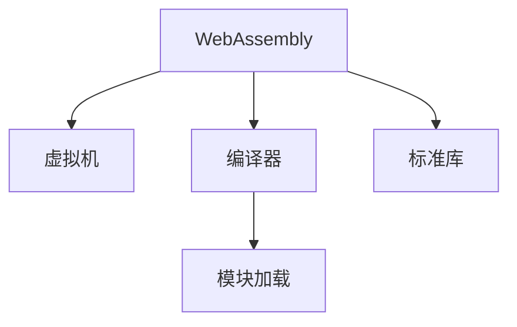
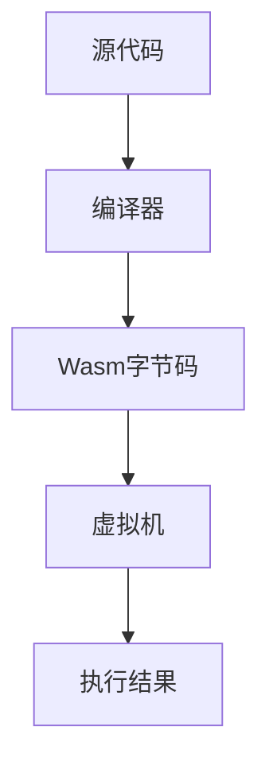
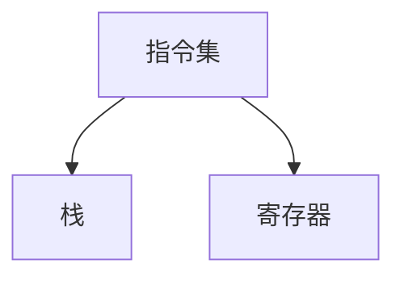

                 

# WebAssembly：Web平台的高性能编程

> 关键词：WebAssembly, 高性能编程, Web浏览器, 跨平台, 静态类型语言, 虚拟机, 编译器, 模块加载

## 1. 背景介绍

### 1.1 问题由来

随着Web技术的蓬勃发展，Web应用已经成为了互联网生态的重要组成部分。从传统的文本网页到复杂的交互式应用，Web平台的覆盖范围和功能越来越广泛。然而，由于JavaScript运行在Web浏览器中，其在执行性能和内存管理上存在诸多限制，难以满足高性能计算和复杂逻辑处理的需求。

为了解决这一问题，WebAssembly应运而生。WebAssembly（简称Wasm）是一种低级字节码格式，可以在Web浏览器中高效运行，并提供了接近本地机器码的执行速度。它采用静态类型语言（如C、C++等）的语法，并且与现有Web技术栈（如JavaScript、HTML、CSS等）完美兼容。

WebAssembly的出现，极大地提升了Web应用的表现力和安全性，成为Web平台高性能编程的重要工具。本文将系统介绍WebAssembly的核心概念、工作原理、编程实践和未来展望，帮助读者深入理解并运用这一前沿技术。

## 2. 核心概念与联系

### 2.1 核心概念概述

为更好地理解WebAssembly，我们将介绍几个关键概念：

- **WebAssembly (Wasm)**：一种低级字节码格式，可以在Web浏览器中高效运行，具有接近本地机器码的执行速度。它采用静态类型语言的语法，提供丰富的内存管理能力，支持跨平台部署。

- **虚拟机**：Wasm不依赖特定的硬件平台，通过一个通用的虚拟机执行其字节码，确保代码的跨平台兼容性。

- **编译器**：将高级编程语言编写的代码编译为Wasm字节码的过程。常见的编译器包括LLVM、Clang、Emscripten等。

- **模块加载**：WebAssembly以模块的形式加载，每个模块由一段编译后的Wasm代码和一个初始化函数组成，可以在Web应用中灵活调用。

- **标准库**：Wasm提供了一个标准库，包含一些常用的数学函数、内存管理函数等，方便开发者在Wasm中编写实用程序。

这些概念之间的逻辑关系可以通过以下Mermaid流程图来展示：



这个流程图展示了大语言模型的核心概念及其之间的关系：

1. WebAssembly通过编译器转化为字节码。
2. 字节码通过虚拟机的执行环境在Web浏览器中运行。
3. 模块加载使得Wasm代码可以动态调用。
4. 标准库提供了常用的功能函数。

## 3. 核心算法原理 & 具体操作步骤

### 3.1 算法原理概述

WebAssembly的核心思想是通过编译器将高级语言代码编译为高效的Wasm字节码，然后通过虚拟机在Web浏览器中运行这些字节码，从而实现接近本地机器码的执行性能。

WebAssembly的编译器负责将源代码转换为Wasm字节码，其工作原理包括以下几个步骤：

1. **语法分析**：分析源代码的语法结构，生成抽象语法树。
2. **语义分析**：检查语法结构是否合法，并生成符号表。
3. **中间代码生成**：将语法分析生成的抽象语法树转换为中间代码。
4. **代码优化**：对中间代码进行优化，包括常量折叠、死代码消除等。
5. **代码生成**：将优化后的中间代码转换为Wasm字节码。

WebAssembly的虚拟机负责解释执行Wasm字节码，其工作原理包括以下几个步骤：

1. **字节码验证**：检查字节码是否符合规范，确保代码安全。
2. **内存管理**：分配和管理内存空间，处理内存引用。
3. **指令执行**：按顺序执行Wasm字节码指令，完成计算和数据处理。

### 3.2 算法步骤详解

WebAssembly的编译和运行流程如图1所示：



以下是详细的操作步骤：

**步骤1：编写源代码**

开发者可以使用任何静态类型编程语言（如C、C++、Rust等）编写源代码。

**步骤2：编译为Wasm字节码**

将源代码通过编译器（如LLVM、Clang、Emscripten等）编译为Wasm字节码。

**步骤3：加载并执行**

将Wasm字节码加载到Web浏览器中，通过WebAssembly的API调用标准库函数，执行实际的业务逻辑。

### 3.3 算法优缺点

WebAssembly具有以下优点：

- **高性能**：Wasm字节码接近本地机器码，执行速度非常快。
- **跨平台**：Wasm不依赖特定的硬件平台，可以在多个操作系统和设备上运行。
- **内存管理**：Wasm提供了丰富的内存管理能力，能够高效地管理内存空间。

然而，WebAssembly也存在一些缺点：

- **学习曲线陡峭**：由于Wasm采用静态类型语言，需要一定的编程基础。
- **工具链复杂**：Wasm的编译和运行需要依赖复杂的工具链，对开发环境要求较高。
- **标准不统一**：由于WebAssembly仍在快速发展中，不同编译器和浏览器版本可能存在兼容性问题。

### 3.4 算法应用领域

WebAssembly在多个领域中得到了广泛应用，包括但不限于以下几个方面：

- **高性能计算**：WebAssembly非常适合执行复杂的数学计算和图像处理等任务。
- **游戏开发**：Wasm的高性能和跨平台特性使得游戏开发变得更加灵活。
- **桌面应用**：Wasm可以运行在Web浏览器中，也可以编译为本地二进制文件，实现Web和桌面应用的完美结合。
- **物联网设备**：Wasm可以运行在低功耗物联网设备上，支持轻量级的嵌入式系统开发。

## 4. 数学模型和公式 & 详细讲解 & 举例说明

### 4.1 数学模型构建

WebAssembly的执行模型基于栈（Stack）和寄存器（Register）的架构，通过指令序列实现计算和数据处理。其数学模型如图2所示：



Wasm指令集分为运算指令、数据流控制指令和内存操作指令三类。

- **运算指令**：包括算术运算、逻辑运算、比较运算等，用于执行基本的数学计算。
- **数据流控制指令**：包括条件分支、循环控制等，用于控制程序的流程。
- **内存操作指令**：包括内存分配、读写等，用于管理内存空间。

### 4.2 公式推导过程

Wasm的指令集可以表示为一系列的函数和操作数。例如，加法指令 `i32.add` 可以表示为：

$$
\text{add}(x, y) = x + y
$$

其中 $x$ 和 $y$ 是操作数，可以是任意整数。

Wasm的内存操作指令可以表示为：

$$
\text{memref} = \text{alloc}(\text{size})
$$

其中 $\text{alloc}$ 表示分配内存，$\text{size}$ 表示分配的内存大小。

### 4.3 案例分析与讲解

以下是一个简单的Wasm示例，用于计算两个整数的和：

```wasm
(module 
    (func $main (param $x i32) (param $y i32) (result i32)
        i32.add $x $y
    )
    (export "main" $main)
)
```

这段Wasm代码定义了一个名为 `main` 的函数，接收两个整型参数 `x` 和 `y`，返回它们的和。

## 5. 项目实践：代码实例和详细解释说明

### 5.1 开发环境搭建

为了进行WebAssembly的开发，需要搭建一个支持Wasm的环境。以下是在Linux系统下搭建开发环境的步骤：

1. 安装LLVM编译器：

```bash
sudo apt-get install llvm
```

2. 安装Emscripten编译器：

```bash
curl https://emscripten.org/updater/updater.js | eval
```

3. 安装必要的开发工具：

```bash
sudo apt-get install build-essential
sudo apt-get install g++-7
```

### 5.2 源代码详细实现

以下是一个简单的C程序，用于计算两个整数的和：

```c
#include <stdio.h>
#include <emscripten/emscripten.h>

int main() {
    int x = 2, y = 3;
    printf("%d\n", x + y);
    return 0;
}
```

将其编译为Wasm字节码：

```bash
emcc main.c -s WASM=1 -s MODULAR=1 -o main.wasm
```

### 5.3 代码解读与分析

编译后的Wasm字节码可以加载到Web浏览器中，通过以下JavaScript代码进行执行：

```javascript
let main = await import('./main.wasm');
let result = await main.main(2, 3);
console.log(result);
```

这段代码首先使用 `import` 函数加载Wasm模块，然后调用 `main` 函数并传递参数 `2` 和 `3`，最终输出结果 `5`。

## 6. 实际应用场景

### 6.1 游戏开发

WebAssembly在游戏开发中得到了广泛应用，特别是在Web浏览器中运行游戏。Wasm的高性能和跨平台特性使得开发者能够灵活地开发和部署游戏，满足了不同设备和用户的需求。

例如，Unity3D游戏引擎可以通过WebAssembly编译为Wasm字节码，在Web浏览器中运行。这样的游戏可以在桌面和移动设备上运行，而且无需安装额外的软件。

### 6.2 桌面应用

WebAssembly可以运行在Web浏览器中，也可以编译为本地二进制文件，实现Web和桌面应用的完美结合。这种方式可以提高应用的性能，同时保持了Web应用的便捷性和跨平台性。

例如，Chrome浏览器提供了Wasm的沙盒环境，允许开发者在浏览器中运行Wasm代码，实现桌面应用的功能。这种方式可以避免桌面应用的安装和部署问题，提升了用户体验。

### 6.3 物联网设备

WebAssembly适合在低功耗物联网设备上运行，支持轻量级的嵌入式系统开发。Wasm的跨平台特性使得开发者可以在不同平台上运行相同的代码，降低了开发成本。

例如，Wasm可以在树莓派等嵌入式设备上运行，实现网络监控、智能家居等应用。

## 7. 工具和资源推荐

### 7.1 学习资源推荐

为了帮助开发者系统掌握WebAssembly的技术，以下是几本优秀的学习资源：

1.《WebAssembly设计与实现》：这本书详细介绍了WebAssembly的核心概念和工作原理，适合有一定编程基础的读者。

2.《WebAssembly入门指南》：这本书提供了WebAssembly的基本概念和编程技巧，适合初学者入门。

3.《WebAssembly高级编程》：这本书介绍了WebAssembly的高级特性和应用场景，适合有一定编程经验的开发者。

4. Emscripten官方文档：Emscripten编译器的官方文档，提供了详细的编译器和API使用指南。

5. WebAssembly.org：WebAssembly官方网站，提供了最新的标准和社区资源。

### 7.2 开发工具推荐

WebAssembly的开发需要使用多种工具，以下是一些常用的工具：

1. LLVM编译器：用于将高级编程语言编译为Wasm字节码。

2. Emscripten编译器：用于将C/C++等语言编译为Wasm字节码。

3. V8 JavaScript引擎：用于在Web浏览器中执行JavaScript代码。

4. Google Chrome浏览器：提供了Wasm的沙盒环境，支持WebAssembly的运行。

5. Visual Studio Code：支持WebAssembly开发的IDE，提供了丰富的开发工具和插件。

### 7.3 相关论文推荐

WebAssembly是一个新兴的技术，研究论文相对较少。以下是几篇关于WebAssembly的重要论文：

1. "WebAssembly: A Portable Target for the Web"：这是WebAssembly的创始论文，详细介绍了WebAssembly的设计和实现。

2. "Emscripten: Compiling C/C++ to JavaScript and WebAssembly"：这篇论文介绍了Emscripten编译器的设计与实现。

3. "WebAssembly in Real-world Applications"：这篇论文介绍了WebAssembly在实际应用中的几个典型案例。

## 8. 总结：未来发展趋势与挑战

### 8.1 总结

本文对WebAssembly的核心概念、工作原理、编程实践和未来展望进行了全面系统的介绍。首先阐述了WebAssembly的研究背景和意义，明确了其高性能、跨平台、安全可靠的特点。其次，从原理到实践，详细讲解了WebAssembly的编译和运行过程，提供了代码实例和详细分析。同时，本文还探讨了WebAssembly在实际应用中的多种场景，展示了其广泛的应用前景。最后，本文精选了WebAssembly的学习资源和开发工具，力求为读者提供全方位的技术指引。

通过本文的系统梳理，可以看到，WebAssembly已成为Web平台高性能编程的重要工具，极大地提升了Web应用的表现力和安全性。未来，WebAssembly将在更多领域得到应用，为Web技术的演进带来新的机遇和挑战。

### 8.2 未来发展趋势

展望未来，WebAssembly将呈现以下几个发展趋势：

1. **性能持续提升**：随着WebAssembly编译器和运行时环境的不停优化，其执行性能将持续提升，逐渐接近本地机器码的执行速度。

2. **跨平台能力增强**：WebAssembly将不断拓展其跨平台的适用性，支持更多操作系统和设备。

3. **应用场景多样化**：WebAssembly将拓展到更多领域，如金融、医疗、工业物联网等，满足不同行业的需求。

4. **标准规范完善**：WebAssembly将逐渐完善其标准规范，确保不同编译器和浏览器的兼容性。

5. **工具链优化**：WebAssembly的工具链将不断优化，简化开发流程，提升开发效率。

以上趋势凸显了WebAssembly的广阔前景。这些方向的探索发展，将使得WebAssembly在Web平台的高性能编程中发挥更大的作用，推动Web技术的不断进步。

### 8.3 面临的挑战

尽管WebAssembly已经取得了显著进展，但在迈向更加智能化、普适化应用的过程中，仍面临诸多挑战：

1. **开发复杂度**：WebAssembly的编程语言和工具链相对复杂，对开发者的要求较高。

2. **兼容性问题**：不同编译器和浏览器版本可能存在兼容性问题，需要开发者进行额外的测试和调试。

3. **安全问题**：WebAssembly的高性能特性使得攻击者更容易编写恶意代码，需要严格的安全措施来保障应用安全。

4. **生态系统不完善**：WebAssembly的生态系统尚不完善，缺乏成熟的第三方库和框架。

5. **资源消耗**：WebAssembly的高性能特性带来了较大的内存和计算资源消耗，需要优化以适应移动设备等低功耗设备。

以上挑战需要开发者和社区共同努力，通过不断的技术创新和实践优化，逐步解决这些问题，推动WebAssembly的进一步发展。

### 8.4 研究展望

未来的研究需要在以下几个方面寻求新的突破：

1. **优化编译器性能**：提高编译器效率，减少编译时间和资源消耗。

2. **改进运行时环境**：优化虚拟机性能，提高Wasm的执行效率。

3. **增强安全机制**：引入更多的安全机制，防止恶意代码的攻击。

4. **拓展应用场景**：将WebAssembly应用于更多领域，推动其在实际应用中的广泛应用。

5. **标准化工作**：推进WebAssembly的标准化工作，确保不同平台和浏览器的兼容性。

这些研究方向的探索，将使得WebAssembly在Web平台的高性能编程中发挥更大的作用，推动Web技术的不断进步。

## 9. 附录：常见问题与解答

**Q1：WebAssembly是否可以执行任意的编程语言代码？**

A: WebAssembly只能执行编译后的字节码，不支持动态语言和解释型语言。但是，可以使用编译器将任意编程语言编译为Wasm字节码，实现在Web浏览器中执行的效果。

**Q2：WebAssembly是否支持并发编程？**

A: WebAssembly本身不支持并发编程，但是可以通过JavaScript的多线程API（如Web Workers、WebAssembly Workers等）实现并发执行。

**Q3：WebAssembly是否可以运行在Web服务器上？**

A: WebAssembly可以运行在Web服务器上，但是需要在服务器端进行编译和加载。这种方式可以提高服务器的执行效率，但会增加服务器的部署和维护成本。

**Q4：WebAssembly是否支持分布式计算？**

A: WebAssembly本身不支持分布式计算，但是可以通过WebAssembly Workers和JavaScript的分布式计算API（如Fetch API、WebSocket等）实现分布式计算。

**Q5：WebAssembly是否支持异步编程？**

A: WebAssembly本身不支持异步编程，但是可以通过JavaScript的异步编程API（如Promise、async/await等）实现异步执行。

这些问题的解答有助于开发者更好地理解WebAssembly的适用范围和局限性，从而在实际开发中做出正确的决策。

---

作者：禅与计算机程序设计艺术 / Zen and the Art of Computer Programming

