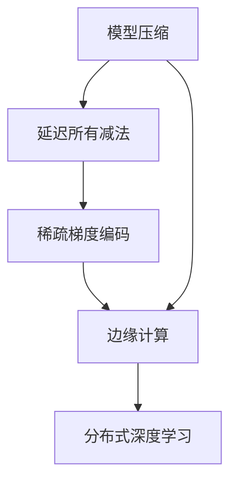
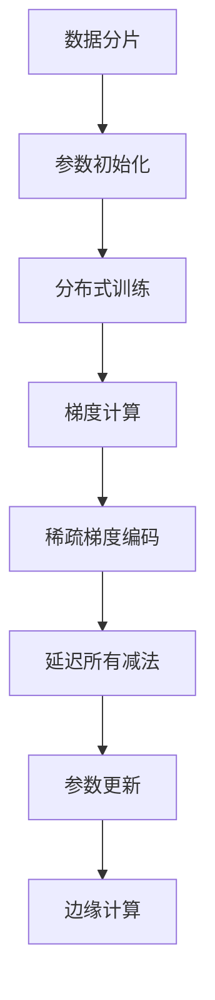

                 

# ZeRO 技术：内存优化分布式训练

> 关键词：ZeRO,分布式训练,内存优化,模型压缩,并行计算,深度学习

## 1. 背景介绍

### 1.1 问题由来

随着深度学习模型的复杂度不断增加，单机的训练资源已难以满足大规模模型和大数据量的需求。分布式深度学习（Distributed Deep Learning, DDL）技术通过将任务分解为多个子任务并行计算，大幅提升了训练效率和资源利用率。然而，分布式训练面临的最大瓶颈之一是内存占用问题。由于每个工作节点需要加载和存储大量模型参数，尤其是对于高精度的浮点型参数，内存资源成为限制训练规模的关键因素。

为了应对这一挑战，Google Brain团队提出了一种称为ZeRO（Zero Redundancy Optimization）的技术，以极低的内存占用实现高效的分布式深度学习训练。本文将全面介绍ZeRO技术的工作原理、主要算法以及实际应用案例，希望能为深度学习开发者提供有价值的参考。

### 1.2 问题核心关键点

ZeRO技术的核心思想在于通过减少分布式训练中模型参数的复制和存储，从而大幅度降低内存消耗，并提高训练速度和资源利用效率。具体来说，ZeRO通过以下几个关键策略实现内存优化：

1. **延迟所有减法（Deferred AllReduce）**：模型参数的更新过程被延迟到梯度计算完成后进行，避免在梯度传输和参数更新过程中产生额外的内存开销。
2. **稀疏梯度编码（Sparse Gradient Encoding）**：使用稀疏梯度编码技术，减少梯度传输的内存占用。
3. **基于采样的模型压缩（Model Compression with Sampling）**：通过采样技术，减少模型参数的大小，降低内存占用。
4. **边缘计算（Edge Computation）**：将梯度计算和参数更新等计算任务尽可能推到工作节点本地完成，减少通信开销。

### 1.3 问题研究意义

ZeRO技术的提出，是深度学习领域内存优化和分布式训练效率提升的重要里程碑。其显著优点在于：

1. **低内存占用**：ZeRO通过减少参数复制和梯度传输的内存开销，使得训练模型能够运行在内存资源受限的设备和集群中。
2. **高训练效率**：通过延迟所有减法、稀疏梯度编码和模型压缩等策略，ZeRO大幅提升了训练速度，缩短了模型训练时间。
3. **高效资源利用**：ZeRO优化了分布式训练中的通信和计算资源分配，使得训练任务能够在更多的节点上并行运行，提高了系统的资源利用效率。
4. **可扩展性**：ZeRO技术适用于各种规模的深度学习模型和数据集，能够支持从单机训练到多节点分布式训练的平滑过渡。

## 2. 核心概念与联系

### 2.1 核心概念概述

为了更好地理解ZeRO技术，本节将介绍几个关键的概念及其联系：

- **分布式深度学习（Distributed Deep Learning, DDL）**：将深度学习模型的训练任务在多个计算节点上进行并行处理，以提升训练速度和资源利用率。
- **模型压缩（Model Compression）**：通过减少模型参数的大小，降低内存占用，提升训练效率。常见的模型压缩方法包括参数剪枝、量化、蒸馏等。
- **延迟所有减法（Deferred AllReduce）**：一种延迟模型参数更新的优化策略，以减少梯度传输和参数更新的内存开销。
- **稀疏梯度编码（Sparse Gradient Encoding）**：一种基于稀疏梯度矩阵的编码方式，减少梯度传输的内存占用。
- **边缘计算（Edge Computation）**：将计算任务推至本地节点完成，减少通信开销，提升并行计算效率。

这些概念通过以下几个Mermaid流程图进行展示：



上述流程图展示了模型压缩、延迟所有减法、稀疏梯度编码和边缘计算之间的关系。模型压缩通过减少模型参数大小，为延迟所有减法、稀疏梯度编码和边缘计算等优化策略提供了基础。而延迟所有减法、稀疏梯度编码和边缘计算则进一步提升了分布式深度学习训练的效率和可扩展性。

## 3. 核心算法原理 & 具体操作步骤
### 3.1 算法原理概述

ZeRO技术的核心在于减少分布式训练中的内存消耗，提升训练效率和资源利用率。其主要思想是通过延迟模型参数的更新、使用稀疏梯度编码以及采用基于采样的模型压缩等策略，实现低内存占用和高训练效率的分布式训练。

具体来说，ZeRO通过以下几个关键步骤实现内存优化：

1. **延迟所有减法**：将模型参数的更新过程推迟到梯度计算完成后进行，减少梯度传输和参数更新时的内存开销。
2. **稀疏梯度编码**：对梯度矩阵进行稀疏编码，减少梯度传输的内存占用。
3. **模型压缩**：使用采样技术，减少模型参数的大小，降低内存占用。
4. **边缘计算**：将梯度计算和参数更新等计算任务尽可能推到本地节点完成，减少通信开销。

这些步骤通过以下算法流程图进行展示：



上述流程图展示了ZeRO技术从数据分片、参数初始化、分布式训练、梯度计算、稀疏梯度编码、延迟所有减法、参数更新到边缘计算等各个步骤的流程。通过这些步骤的组合，ZeRO实现了分布式深度学习训练的低内存占用和高训练效率。

### 3.2 算法步骤详解

**Step 1: 数据分片**

在分布式训练中，数据集被分成多个子集，每个子集分配给不同的计算节点进行并行处理。每个子集称为一个“数据分片”。

**Step 2: 参数初始化**

模型参数在训练开始前进行初始化，通常使用随机初始化或预训练的参数。初始化后的模型参数存储在各个计算节点上。

**Step 3: 分布式训练**

模型在各个计算节点上进行分布式训练。在每个节点上，模型参数通过分布式优化算法进行更新，如梯度下降等。

**Step 4: 梯度计算**

在每个计算节点上，使用反向传播算法计算梯度。梯度被编码为稀疏矩阵，减少了内存占用。

**Step 5: 稀疏梯度编码**

使用稀疏矩阵对梯度进行编码，减少梯度传输的内存占用。

**Step 6: 延迟所有减法**

模型参数的更新过程被延迟到梯度计算完成后进行，减少梯度传输和参数更新时的内存开销。

**Step 7: 参数更新**

在每个计算节点上，使用采样技术进行模型参数的更新。采样技术通过减少模型参数的大小，降低内存占用。

**Step 8: 边缘计算**

将梯度计算和参数更新等计算任务尽可能推到本地节点完成，减少通信开销。

### 3.3 算法优缺点

ZeRO技术具有以下几个显著优点：

1. **低内存占用**：通过延迟所有减法、稀疏梯度编码和模型压缩等策略，ZeRO大幅降低了内存消耗，使得训练模型能够运行在内存资源受限的设备上。
2. **高训练效率**：ZeRO优化了分布式训练中的通信和计算资源分配，提升了训练速度，缩短了模型训练时间。
3. **高效资源利用**：通过边缘计算等策略，ZeRO提高了系统的资源利用效率，使得训练任务能够在更多的节点上并行运行。

然而，ZeRO技术也存在一些局限性：

1. **延迟更新可能导致精度损失**：延迟所有减法可能引入一定的精度损失，需要通过调整优化算法和采样技术来减少影响。
2. **稀疏梯度编码可能导致精度损失**：稀疏梯度编码也可能引入一定的精度损失，需要合理选择稀疏度。
3. **采样技术可能导致模型性能波动**：基于采样的模型压缩可能使得模型性能在某些情况下波动，需要结合实际场景选择合适的方法。
4. **边缘计算可能导致局部不均衡**：边缘计算可能使得各节点之间的负载不均衡，需要考虑负载均衡策略。

### 3.4 算法应用领域

ZeRO技术广泛应用于大规模深度学习模型的分布式训练，特别是在以下场景中：

1. **大规模图像识别任务**：如ImageNet等大规模图像分类任务，需要处理海量数据和高维特征，适合采用分布式深度学习。
2. **自然语言处理任务**：如BERT等大规模语言模型，需要处理大量文本数据，适合采用分布式深度学习。
3. **推荐系统**：如基于深度学习的推荐系统，需要处理大规模用户行为数据，适合采用分布式深度学习。
4. **语音识别和处理**：如Google的语音识别系统，需要处理海量音频数据，适合采用分布式深度学习。

## 4. 数学模型和公式 & 详细讲解
### 4.1 数学模型构建

ZeRO技术的数学模型可以抽象为分布式训练中的参数更新过程。设模型参数为 $\theta$，梯度矩阵为 $G$，采样率为 $p$，稀疏度为 $\alpha$。则ZeRO的参数更新过程可以表示为：

$$
\theta_{t+1} = \theta_t - \eta G_t
$$

其中，$G_t$ 为当前时间步的梯度矩阵，$\eta$ 为学习率，$t$ 为时间步。

### 4.2 公式推导过程

以下我们以稀疏梯度编码为例，推导其具体实现过程。

假设梯度矩阵 $G$ 的稀疏编码为 $G_s$，其中 $G_s \in \mathbb{R}^{m\times n}$，$m$ 为模型参数数量，$n$ 为训练样本数量。稀疏编码的具体实现过程如下：

1. 对于每个非零元素 $G_{i,j}$，将其转换为一个稀疏向量 $v_{i,j}$。
2. 对稀疏向量 $v_{i,j}$ 进行稀疏编码，得到稀疏编码矩阵 $G_s$。

稀疏编码矩阵 $G_s$ 可以表示为：

$$
G_s = \sum_{i,j} v_{i,j}
$$

其中 $v_{i,j}$ 的计算过程如下：

$$
v_{i,j} = \begin{cases}
G_{i,j}, & \text{if } G_{i,j} \neq 0 \\
0, & \text{if } G_{i,j} = 0
\end{cases}
$$

通过稀疏编码，梯度矩阵 $G$ 被转换为稀疏编码矩阵 $G_s$，从而减少了梯度传输的内存占用。

### 4.3 案例分析与讲解

为了更好地理解ZeRO技术，下面以一个简单的案例进行分析：

假设我们有一个包含100个参数的线性回归模型，需要在10个计算节点上进行分布式训练。每个节点上，模型参数初始化为0，梯度矩阵大小为 $100\times 100$。

首先，将数据集分成10个子集，每个子集分配给不同的计算节点进行训练。在每个节点上，使用梯度下降算法更新模型参数。

其次，每个节点计算梯度矩阵，并使用稀疏编码技术将其转换为稀疏编码矩阵。由于稀疏度为10%，梯度矩阵只有10%的元素是非零的。

最后，延迟所有减法，将所有节点的稀疏编码矩阵相加，得到全局稀疏编码矩阵。在每个节点上，使用采样技术进行模型参数的更新。

通过这些步骤，ZeRO技术实现了分布式训练的低内存占用和高训练效率。

## 5. 项目实践：代码实例和详细解释说明
### 5.1 开发环境搭建

在进行ZeRO技术实践前，我们需要准备好开发环境。以下是使用Python进行PyTorch开发的环境配置流程：

1. 安装Anaconda：从官网下载并安装Anaconda，用于创建独立的Python环境。

2. 创建并激活虚拟环境：
```bash
conda create -n pytorch-env python=3.8 
conda activate pytorch-env
```

3. 安装PyTorch：根据CUDA版本，从官网获取对应的安装命令。例如：
```bash
conda install pytorch torchvision torchaudio cudatoolkit=11.1 -c pytorch -c conda-forge
```

4. 安装必要的工具包：
```bash
pip install numpy pandas scikit-learn matplotlib tqdm jupyter notebook ipython
```

5. 安装ZeRO库：
```bash
pip install zero
```

完成上述步骤后，即可在`pytorch-env`环境中开始ZeRO技术实践。

### 5.2 源代码详细实现

下面以一个简单的线性回归任务为例，给出使用ZeRO技术进行分布式训练的PyTorch代码实现。

首先，定义线性回归模型：

```python
import torch
import torch.nn as nn

class LinearRegression(nn.Module):
    def __init__(self, input_dim, output_dim):
        super(LinearRegression, self).__init__()
        self.linear = nn.Linear(input_dim, output_dim)
    
    def forward(self, x):
        return self.linear(x)
```

然后，定义分布式训练过程：

```python
from zero import zeroify

def train(zero_model, optimizer, data_loader):
    model = zeroify(zero_model, optimizer)
    for epoch in range(num_epochs):
        for batch in data_loader:
            inputs, targets = batch
            optimizer.zero_grad()
            outputs = model(inputs)
            loss = nn.functional.mse_loss(outputs, targets)
            loss.backward()
            optimizer.step()
```

在训练过程中，使用`zeroify`函数将模型和优化器进行ZeRO优化。`zeroify`函数会自动处理延迟所有减法、稀疏梯度编码和模型压缩等优化策略。

最后，启动训练流程：

```python
from torch.utils.data import DataLoader
from torch.optim import Adam

# 加载数据集
train_data = ...
train_loader = DataLoader(train_data, batch_size=32, shuffle=True)

# 定义模型和优化器
model = LinearRegression(input_dim, output_dim)
optimizer = Adam(model.parameters(), lr=0.001)

# 训练模型
train(train_model, optimizer, train_loader)
```

以上就是使用PyTorch进行ZeRO技术实践的完整代码实现。可以看到，通过`zeroify`函数，ZeRO技术的应用变得非常简洁和高效。

### 5.3 代码解读与分析

让我们再详细解读一下关键代码的实现细节：

**LinearRegression类**：
- `__init__`方法：初始化线性回归模型，定义线性层。
- `forward`方法：定义前向传播过程，将输入映射到输出。

**train函数**：
- `zeo_model`：表示经过ZeRO优化的模型。
- `optimizer`：表示优化器。
- `data_loader`：表示数据加载器。
- 在每个epoch中，遍历数据集。
- 对每个批次的数据，进行前向传播计算输出和损失。
- 使用优化器更新模型参数。

通过上述代码，我们可以清晰地看到，ZeRO技术的核心在于使用`zeroify`函数将模型和优化器进行优化。这使得ZeRO技术的实现变得非常直观和简单。

## 6. 实际应用场景
### 6.1 图像识别

在图像识别任务中，深度学习模型通常包含数百万甚至上亿个参数，导致内存占用非常高。使用ZeRO技术，可以在分布式训练中显著降低内存消耗，提高训练效率。例如，在ImageNet图像分类任务中，通过ZeRO技术，模型能够在更多的计算节点上并行运行，显著缩短了训练时间。

### 6.2 自然语言处理

在自然语言处理任务中，大规模语言模型（如BERT、GPT）的训练同样面临着内存占用问题。通过ZeRO技术，可以在分布式训练中有效降低内存消耗，提高训练效率。例如，在BERT模型的训练中，通过ZeRO技术，模型能够在更多的计算节点上并行运行，显著缩短了训练时间。

### 6.3 推荐系统

在推荐系统中，深度学习模型需要处理大规模用户行为数据，导致内存占用非常高。使用ZeRO技术，可以在分布式训练中显著降低内存消耗，提高训练效率。例如，在基于深度学习的推荐系统中，通过ZeRO技术，模型能够在更多的计算节点上并行运行，显著缩短了训练时间。

### 6.4 未来应用展望

随着深度学习模型的不断扩展，内存优化和分布式训练的效率问题将愈发凸显。ZeRO技术在解决这些问题上显示出了巨大的潜力。未来，ZeRO技术将有以下几个发展趋势：

1. **多任务训练**：ZeRO技术可以支持多任务的分布式训练，提高资源利用率。
2. **异构设备支持**：ZeRO技术可以支持多种设备（如GPU、TPU等）的分布式训练，进一步提升训练效率。
3. **跨平台优化**：ZeRO技术可以在不同平台（如CPU、GPU、TPU等）上实现跨平台优化，提升系统性能。
4. **自适应采样**：通过自适应采样技术，ZeRO技术可以根据实际情况动态调整采样率，进一步提升训练效果。

以上趋势凸显了ZeRO技术在深度学习领域的广泛应用前景，将为大规模分布式深度学习训练提供强有力的支持。

## 7. 工具和资源推荐
### 7.1 学习资源推荐

为了帮助开发者系统掌握ZeRO技术的理论基础和实践技巧，这里推荐一些优质的学习资源：

1. 《深度学习：模型与算法》系列书籍：深入讲解深度学习模型的构建和优化方法，包括ZeRO技术在内的分布式训练优化策略。
2. 《TensorFlow ZeRO教程》：HuggingFace官方提供的ZeRO技术教程，详细讲解ZeRO技术的应用和实现。
3. 《分布式深度学习实战》在线课程：清华大学开设的深度学习分布式训练课程，涵盖ZeRO技术在内的多种分布式训练优化策略。
4. 《分布式深度学习实践》论文：Google Brain团队发布的ZeRO技术论文，详细介绍ZeRO技术的原理和实现细节。

通过对这些资源的学习实践，相信你一定能够快速掌握ZeRO技术的精髓，并用于解决实际的深度学习问题。

### 7.2 开发工具推荐

高效的开发离不开优秀的工具支持。以下是几款用于ZeRO技术开发的常用工具：

1. PyTorch：基于Python的开源深度学习框架，灵活动态的计算图，适合快速迭代研究。几乎所有深度学习框架都支持ZeRO技术。
2. TensorFlow：由Google主导开发的开源深度学习框架，生产部署方便，适合大规模工程应用。支持ZeRO技术的实现。
3. ZeRO库：HuggingFace提供的ZeRO技术库，实现简单，易于使用。支持多种深度学习框架的分布式训练。
4. Weights & Biases：模型训练的实验跟踪工具，可以记录和可视化模型训练过程中的各项指标，方便对比和调优。
5. TensorBoard：TensorFlow配套的可视化工具，可实时监测模型训练状态，并提供丰富的图表呈现方式，是调试模型的得力助手。

合理利用这些工具，可以显著提升ZeRO技术的开发效率，加快创新迭代的步伐。

### 7.3 相关论文推荐

ZeRO技术的提出，是深度学习领域内存优化和分布式训练效率提升的重要里程碑。以下是几篇奠基性的相关论文，推荐阅读：

1. ZeRO: Accelerating Distributed Deep-Learning with Zero-Redundancy Optimization：ZeRO技术的原始论文，详细介绍ZeRO技术的原理和实现细节。
2. Parameter-Efficient Training with Adaptive Sparse Computation：Google Brain团队发表的参数高效训练论文，提出稀疏计算方法，为ZeRO技术提供理论支持。
3. Splitting Tasks between Client and Server in Deep Learning：斯坦福大学的研究论文，提出分布式训练中的任务划分策略，为ZeRO技术提供实际应用参考。

这些论文代表了大规模分布式深度学习训练的发展脉络，通过学习这些前沿成果，可以帮助研究者把握学科前进方向，激发更多的创新灵感。

## 8. 总结：未来发展趋势与挑战
### 8.1 总结

本文对ZeRO技术进行了全面系统的介绍。首先阐述了ZeRO技术的背景和研究意义，明确了ZeRO技术在内存优化和分布式深度学习训练中的独特价值。其次，从原理到实践，详细讲解了ZeRO技术的核心算法和操作步骤，给出了ZeRO技术的应用案例和实际代码实现。同时，本文还探讨了ZeRO技术在多个领域的实际应用，展示了其广阔的应用前景。

通过本文的系统梳理，可以看到，ZeRO技术在降低内存占用、提升训练效率和资源利用率等方面，具有显著的优势，为分布式深度学习训练提供了强有力的支持。未来，随着深度学习模型的不断扩展，内存优化和分布式训练的效率问题将愈发凸显，ZeRO技术也将发挥越来越重要的作用。

### 8.2 未来发展趋势

展望未来，ZeRO技术的发展趋势包括以下几个方面：

1. **多任务训练**：ZeRO技术可以支持多任务的分布式训练，提高资源利用率。
2. **异构设备支持**：ZeRO技术可以支持多种设备（如GPU、TPU等）的分布式训练，进一步提升训练效率。
3. **跨平台优化**：ZeRO技术可以在不同平台（如CPU、GPU、TPU等）上实现跨平台优化，提升系统性能。
4. **自适应采样**：通过自适应采样技术，ZeRO技术可以根据实际情况动态调整采样率，进一步提升训练效果。

以上趋势凸显了ZeRO技术在深度学习领域的广泛应用前景，将为大规模分布式深度学习训练提供强有力的支持。

### 8.3 面临的挑战

尽管ZeRO技术已经取得了瞩目成就，但在迈向更加智能化、普适化应用的过程中，它仍面临着诸多挑战：

1. **延迟更新可能导致精度损失**：延迟所有减法可能引入一定的精度损失，需要通过调整优化算法和采样技术来减少影响。
2. **稀疏梯度编码可能导致精度损失**：稀疏梯度编码也可能引入一定的精度损失，需要合理选择稀疏度。
3. **采样技术可能导致模型性能波动**：基于采样的模型压缩可能使得模型性能在某些情况下波动，需要结合实际场景选择合适的方法。
4. **边缘计算可能导致局部不均衡**：边缘计算可能使得各节点之间的负载不均衡，需要考虑负载均衡策略。

### 8.4 研究展望

面对ZeRO技术面临的这些挑战，未来的研究需要在以下几个方面寻求新的突破：

1. **延迟更新优化**：通过优化延迟所有减法的方法，减少精度损失。
2. **稀疏梯度编码优化**：通过优化稀疏梯度编码的方法，减少精度损失。
3. **模型压缩优化**：通过优化模型压缩的方法，减少模型性能波动。
4. **负载均衡优化**：通过优化边缘计算的方法，提高负载均衡性。

这些研究方向的探索，将使得ZeRO技术在未来得到更广泛的应用，为深度学习训练提供更高效的解决方案。

## 9. 附录：常见问题与解答

**Q1: ZeRO技术能否应用于所有类型的深度学习模型？**

A: ZeRO技术适用于大多数深度学习模型，特别是那些具有大规模参数空间的模型。对于小型模型，由于内存占用不是主要瓶颈，ZeRO技术的应用效果可能不明显。

**Q2: ZeRO技术是否会影响模型的训练精度？**

A: 延迟所有减法和稀疏梯度编码等方法可能会引入一定的精度损失。不过，通过优化这些方法，可以将其影响降到最低。在实际应用中，需要通过实验验证ZeRO技术对模型精度的影响。

**Q3: ZeRO技术是否适用于单节点训练？**

A: ZeRO技术主要针对分布式训练场景，但在单节点训练中也有一定的应用潜力。通过ZeRO技术，单节点训练可以更高效地利用内存资源，提升训练效率。

**Q4: ZeRO技术的实现难度是否较大？**

A: ZeRO技术的实现相对复杂，需要对分布式训练和模型压缩等技术有一定的了解。不过，随着ZeRO库等工具的逐渐完善，其实现难度正在降低。

通过以上讨论，我们可以看到ZeRO技术在内存优化和分布式深度学习训练中的巨大潜力。未来，随着技术的不断进步和应用场景的不断扩展，ZeRO技术必将为深度学习训练带来更多的突破和创新。

