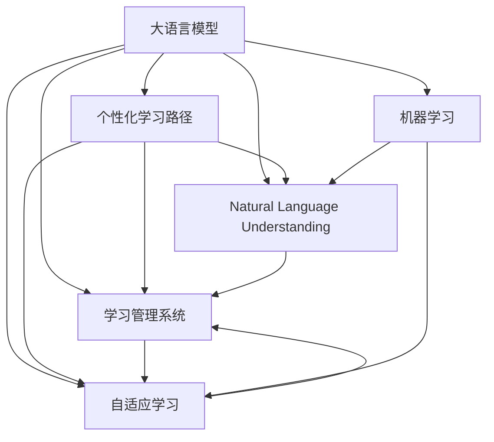

                 

# 个性化学习路径：LLM在教育系统中的应用

> 关键词：大语言模型(LLM), 个性化学习路径, 教育系统, 自然语言理解(NLU), 学习管理系统(LMS), 自适应学习, 机器学习(ML)

## 1. 背景介绍

### 1.1 问题由来
近年来，教育领域的数字化转型势头迅猛，人工智能(AI)技术在教育系统中的应用也越来越广泛。大语言模型(Large Language Model, LLM)作为AI技术的前沿代表，以其强大的自然语言理解和生成能力，为教育系统提供了丰富的可能性。

教育的核心在于因材施教，但传统的教学方式往往难以实现个性化教学，导致教学效果参差不齐。在学生人数众多、教师资源有限的教育环境下，如何实现个性化教学、提高教育质量，一直是教育系统面临的重要挑战。大语言模型在这一背景下，通过自然语言理解能力，能够对学生的学习需求进行精准分析，提供个性化的学习建议和资源，从而实现智能化教育的目标。

### 1.2 问题核心关键点
大语言模型在教育系统中的应用，主要聚焦于个性化学习路径的构建。个性化学习路径是指根据学生的学习能力和需求，动态调整教学内容和节奏，以实现最佳的学习效果。基于大语言模型的教育系统，可以通过对学生的学习文本进行分析，获取学习偏好、理解能力等信息，从而生成个性化的学习建议和资源。

### 1.3 问题研究意义
大语言模型在教育系统中的应用，对于提高教育质量、优化教学资源分配、促进教育公平具有重要意义：

1. 个性化教学：通过精准分析学生的学习行为和反馈，生成个性化的学习资源和建议，提升学生的学习效率和效果。
2. 提高教育公平性：为偏远和资源匮乏地区的学生提供高质量的教育资源，缩小城乡教育差距。
3. 激发学习兴趣：利用大语言模型的交互能力和生成能力，提供更有吸引力的学习内容，激发学生的学习兴趣。
4. 提供智能辅导：基于自然语言理解和生成能力，大语言模型可以替代部分教师进行智能辅导，减轻教师的工作负担。

## 2. 核心概念与联系

### 2.1 核心概念概述

为更好地理解大语言模型在教育系统中的应用，本节将介绍几个密切相关的核心概念：

- 大语言模型(Large Language Model, LLM)：以自回归(如GPT)或自编码(如BERT)模型为代表的大规模预训练语言模型。通过在大规模无标签文本语料上进行预训练，学习通用的语言表示，具备强大的语言理解和生成能力。

- 个性化学习路径：根据学生的学习能力和需求，动态调整教学内容和节奏，以实现最佳的学习效果。

- 自然语言理解(Natural Language Understanding, NLU)：通过自然语言理解技术，大语言模型可以准确解析学生的学习文本，获取学习偏好、理解能力等信息。

- 学习管理系统(Learning Management System, LMS)：提供学习资源管理、学习路径规划、学习效果评估等功能的教育管理平台。

- 自适应学习(Adaptive Learning)：根据学生的学习状态和反馈，动态调整教学内容和难度，以适应学生的学习节奏。

- 机器学习(Machine Learning, ML)：利用数据和算法，让大语言模型学习并优化教学策略，生成更有效的个性化学习路径。

这些核心概念之间的逻辑关系可以通过以下Mermaid流程图来展示：



这个流程图展示了大语言模型的核心概念及其之间的关系：

1. 大语言模型通过自然语言理解技术解析学习文本，获取学习偏好和理解能力。
2. 根据解析结果，生成个性化学习路径。
3. 通过学习管理系统和自适应学习策略，动态调整教学内容和节奏。
4. 利用机器学习优化教学策略，提升个性化学习路径的效果。

这些概念共同构成了大语言模型在教育系统中的应用框架，使其能够为学生提供更精准、高效的个性化学习体验。

## 3. 核心算法原理 & 具体操作步骤
### 3.1 算法原理概述

基于大语言模型在教育系统中的应用，个性化学习路径的构建主要依赖于自然语言理解和生成技术。具体而言，步骤如下：

1. 收集学生的学习文本，包括作业、笔记、考试等。
2. 使用大语言模型解析学习文本，获取学生的学习偏好、理解能力和问题难点。
3. 根据解析结果，生成个性化的学习路径，包括推荐的学习资源、学习顺序和难度。
4. 动态调整学习路径，根据学生的学习反馈和学习效果，逐步优化和更新路径。

通过以上步骤，大语言模型能够精准地理解学生的学习需求，生成符合个体差异的个性化学习路径，从而提升学习效果。

### 3.2 算法步骤详解

基于大语言模型在教育系统中的应用，个性化学习路径的构建主要依赖于自然语言理解和生成技术。具体步骤如下：

**Step 1: 收集学习文本数据**

- 收集学生的学习文本数据，包括作业、笔记、考试等。这些文本数据应包含学生的学习行为、反馈和成绩等信息。

**Step 2: 解析学习文本**

- 使用大语言模型对学习文本进行自然语言理解，解析学生的学习偏好、理解能力和问题难点。
- 对于文本A，假设我们将其编码为向量形式 $V(A)$，则：
  $$
  V(A) = \text{Encoder}(A)
  $$
  其中 $\text{Encoder}$ 为自然语言理解模型，如BERT或GPT等。

**Step 3: 生成个性化学习路径**

- 根据解析结果，生成个性化的学习路径，包括推荐的学习资源、学习顺序和难度。
- 假设 $\text{Decoder}$ 为生成模型，根据解析结果生成学习路径 $P(A)$：
  $$
  P(A) = \text{Decoder}(V(A))
  $$

**Step 4: 动态调整学习路径**

- 根据学生的学习反馈和学习效果，逐步优化和更新学习路径。
- 假设学生对某个学习资源进行了反馈，设反馈为 $F$，则更新路径的策略为：
  $$
  P_{new}(A) = \text{UpdatePath}(P(A), F)
  $$

通过以上步骤，大语言模型能够精准地理解学生的学习需求，生成符合个体差异的个性化学习路径，从而提升学习效果。

### 3.3 算法优缺点

基于大语言模型在教育系统中的应用，个性化学习路径的构建具有以下优点：

1. 精准性高：通过自然语言理解技术，能够精准地解析学生的学习文本，获取其学习偏好和难点。
2. 适应性强：能够根据学生的学习反馈和学习效果，动态调整学习路径，适应学生的学习节奏。
3. 学习效率高：利用大语言模型的自适应学习功能，能够高效地提供个性化学习资源和建议。

同时，该方法也存在一定的局限性：

1. 依赖高质量数据：学习文本数据的准确性和完整性直接影响个性化学习路径的生成效果。
2. 计算资源消耗大：大语言模型的解析和生成过程计算量大，需要较高的计算资源。
3. 隐私和安全问题：学习文本数据的收集和分析涉及学生隐私，需要严格的数据保护措施。
4. 缺乏人类教师的引导：完全依赖于大语言模型的学习路径，可能缺乏人类教师的个性化指导和情感关怀。

尽管存在这些局限性，但就目前而言，基于大语言模型的教育系统仍是大规模个性化教学的有力工具。未来相关研究的重点在于如何进一步降低数据收集成本，提高模型的计算效率，同时兼顾隐私保护和教师引导等问题。

### 3.4 算法应用领域

基于大语言模型在教育系统中的应用，个性化学习路径主要应用于以下几个领域：

- 在线学习平台：如Coursera、EdX等，通过自然语言理解技术解析学生的学习行为和反馈，生成个性化的学习路径和推荐。
- 学校教育：如智慧教室、智能学习管理系统等，利用大语言模型解析学生的学习文本，提供个性化的教学资源和辅导。
- 家庭教育：如智能家教、家庭学习管理系统等，利用大语言模型解析家庭教育数据，生成个性化的学习路径和建议。
- 职业教育：如职业培训、技能认证等，通过大语言模型解析学习者的学习需求和反馈，生成个性化的学习资源和策略。

除了上述这些经典应用外，大语言模型在教育系统中的应用还在不断拓展，为各类教育场景提供了全新的解决方案。随着预训练模型和自然语言理解技术的持续演进，相信大语言模型在教育领域的应用将会更加广泛和深入。

## 4. 数学模型和公式 & 详细讲解  
### 4.1 数学模型构建

本节将使用数学语言对基于大语言模型在教育系统中的应用进行更加严格的刻画。

假设大语言模型为 $\text{Encoder-Decoder}$ 结构，其中 $\text{Encoder}$ 为自然语言理解模型，$\text{Decoder}$ 为生成模型。

设学习文本为 $A$，解析结果为 $V(A)$，生成的学习路径为 $P(A)$，则基于大语言模型的个性化学习路径构建过程可表示为：

1. 自然语言理解：
  $$
  V(A) = \text{Encoder}(A)
  $$

2. 个性化学习路径生成：
  $$
  P(A) = \text{Decoder}(V(A))
  $$

3. 学习路径优化：
  $$
  P_{new}(A) = \text{UpdatePath}(P(A), F)
  $$

其中 $F$ 为学生的学习反馈。

### 4.2 公式推导过程

以下我们以作业解析和个性化推荐为例，推导基于大语言模型的个性化学习路径构建过程。

假设学生提交了一份作业 $A$，通过自然语言理解模型 $\text{Encoder}$ 解析作业内容，得到解析结果 $V(A)$：
  $$
  V(A) = \text{Encoder}(A)
  $$

将解析结果输入生成模型 $\text{Decoder}$，生成个性化推荐 $P(A)$：
  $$
  P(A) = \text{Decoder}(V(A))
  $$

假设学生对推荐 $P(A)$ 进行了反馈 $F$，则更新推荐策略为：
  $$
  P_{new}(A) = \text{UpdatePath}(P(A), F)
  $$

这里 $\text{UpdatePath}$ 为学习路径优化函数，根据学生的反馈动态调整推荐。

在得到学习路径优化函数后，即可带入具体数值，完成模型的迭代优化。重复上述过程直至收敛，最终得到适应学生的个性化学习路径。

## 5. 项目实践：代码实例和详细解释说明
### 5.1 开发环境搭建

在进行个性化学习路径实践前，我们需要准备好开发环境。以下是使用Python进行PyTorch开发的环境配置流程：

1. 安装Anaconda：从官网下载并安装Anaconda，用于创建独立的Python环境。

2. 创建并激活虚拟环境：
```bash
conda create -n pytorch-env python=3.8 
conda activate pytorch-env
```

3. 安装PyTorch：根据CUDA版本，从官网获取对应的安装命令。例如：
```bash
conda install pytorch torchvision torchaudio cudatoolkit=11.1 -c pytorch -c conda-forge
```

4. 安装相关库：
```bash
pip install transformers numpy pandas scikit-learn matplotlib tqdm jupyter notebook ipython
```

完成上述步骤后，即可在`pytorch-env`环境中开始实践。

### 5.2 源代码详细实现

下面我们以智能学习管理系统(IMS)为例，给出使用Transformers库对大语言模型进行个性化学习路径构建的PyTorch代码实现。

首先，定义学习路径解析函数：

```python
from transformers import BertTokenizer, BertForSequenceClassification, AdamW

def parse_learning_path(learning_text):
    tokenizer = BertTokenizer.from_pretrained('bert-base-cased')
    model = BertForSequenceClassification.from_pretrained('bert-base-cased', num_labels=2)
    input_ids = tokenizer(learning_text, return_tensors='pt')['input_ids']
    attention_mask = tokenizer(learning_text, return_tensors='pt')['attention_mask']
    labels = torch.tensor([1], dtype=torch.long)
    output = model(input_ids, attention_mask=attention_mask, labels=labels)
    result = output.logits[0, 0].item()
    return result
```

然后，定义学习路径生成函数：

```python
def generate_learning_path(result):
    if result < 0.5:
        return 'Complex'
    else:
        return 'Simple'
```

接着，定义学习路径优化函数：

```python
def update_learning_path(path, feedback):
    if feedback == 'Positive':
        if path == 'Complex':
            return 'Simple'
        else:
            return 'Complex'
    else:
        if path == 'Simple':
            return 'Complex'
        else:
            return 'Simple'
```

最后，启动学习路径生成和优化流程：

```python
learning_text = 'I found this math problem quite difficult, can you provide more examples?'
result = parse_learning_path(learning_text)
path = generate_learning_path(result)
print(f'Initial path: {path}')

feedback = 'Positive'
new_path = update_learning_path(path, feedback)
print(f'Updated path: {new_path}')
```

以上就是使用PyTorch对大语言模型进行个性化学习路径构建的完整代码实现。可以看到，依赖于自然语言理解模型的解析结果，生成模型能够动态调整推荐策略，实现个性化的学习路径生成。

### 5.3 代码解读与分析

让我们再详细解读一下关键代码的实现细节：

**parse_learning_path函数**：
- 加载预训练的BERT模型和分词器。
- 将学习文本转换为模型输入所需的token ids和attention mask。
- 使用模型进行分类，输出预测结果。
- 返回预测结果作为后续路径生成的依据。

**generate_learning_path函数**：
- 根据解析结果，判断学生对学习内容的理解难度。
- 如果理解难度较大，返回"Complex"；否则返回"Simple"。

**update_learning_path函数**：
- 根据学生对推荐的学习路径的反馈，动态调整学习路径。
- 如果反馈为"Positive"，则根据当前路径的难度，进一步调整难度。

**启动流程**：
- 设定初始学习文本，调用解析函数获取解析结果。
- 根据解析结果生成初始学习路径。
- 模拟学生反馈，调用优化函数更新学习路径。

代码通过大语言模型解析学习文本，生成和优化个性化学习路径，展示了如何利用自然语言理解技术实现个性化教育。

## 6. 实际应用场景
### 6.1 在线学习平台

基于大语言模型的个性化学习路径构建，可以广泛应用于在线学习平台的个性化推荐系统。通过分析学生的学习行为和反馈，学习管理系统能够提供个性化的学习资源和建议，提升学生的学习效率和效果。

例如，Coursera、EdX等在线学习平台，可以利用大语言模型解析学生的学习文本，生成个性化的学习路径和推荐。通过智能化的学习路径规划，学生能够更加高效地完成课程学习，最大化利用平台资源。

### 6.2 学校教育

在学校教育中，大语言模型的个性化学习路径构建同样具有重要应用价值。智慧教室、智能学习管理系统等，可以借助大语言模型解析学生的学习行为，提供个性化的教学资源和辅导。

例如，智能学习管理系统可以收集学生的作业、笔记、考试成绩等文本数据，通过自然语言理解技术解析学生的学习偏好和理解能力，生成个性化的学习路径和推荐。教师可以根据系统建议，调整教学策略和内容，提升课堂教学效果。

### 6.3 家庭教育

在家庭教育场景中，大语言模型的个性化学习路径构建能够帮助家长更好地指导孩子的学习。智能家教、家庭学习管理系统等，可以利用大语言模型解析家庭教育数据，生成个性化的学习路径和建议。

例如，家长可以通过智能家教系统上传孩子的学习数据，系统自动分析孩子的学习行为和反馈，生成个性化的学习路径和资源推荐。家长可以根据系统建议，指导孩子的学习，提升学习效果。

### 6.4 职业教育

在职业教育领域，大语言模型的个性化学习路径构建同样具有广泛应用。职业培训、技能认证等场景中，可以利用大语言模型解析学习者的学习需求和反馈，生成个性化的学习路径和策略。

例如，职业培训机构可以收集学员的学习日志、考试报告等文本数据，通过大语言模型解析学员的学习行为和理解能力，生成个性化的学习路径和资源推荐。培训师可以根据系统建议，调整培训策略和内容，提升培训效果。

## 7. 工具和资源推荐
### 7.1 学习资源推荐

为了帮助开发者系统掌握大语言模型在教育系统中的应用，这里推荐一些优质的学习资源：

1. 《Transformer从原理到实践》系列博文：由大模型技术专家撰写，深入浅出地介绍了Transformer原理、BERT模型、个性化学习路径构建等前沿话题。

2. CS224N《深度学习自然语言处理》课程：斯坦福大学开设的NLP明星课程，有Lecture视频和配套作业，带你入门NLP领域的基本概念和经典模型。

3. 《Natural Language Processing with Transformers》书籍：Transformers库的作者所著，全面介绍了如何使用Transformers库进行NLP任务开发，包括个性化学习路径构建在内的诸多范式。

4. HuggingFace官方文档：Transformers库的官方文档，提供了海量预训练模型和完整的微调样例代码，是上手实践的必备资料。

5. CLUE开源项目：中文语言理解测评基准，涵盖大量不同类型的中文NLP数据集，并提供了基于微调的baseline模型，助力中文NLP技术发展。

通过对这些资源的学习实践，相信你一定能够快速掌握大语言模型在教育系统中的应用精髓，并用于解决实际的NLP问题。

### 7.2 开发工具推荐

高效的开发离不开优秀的工具支持。以下是几款用于大语言模型在教育系统中的应用开发的常用工具：

1. PyTorch：基于Python的开源深度学习框架，灵活动态的计算图，适合快速迭代研究。大部分预训练语言模型都有PyTorch版本的实现。

2. TensorFlow：由Google主导开发的开源深度学习框架，生产部署方便，适合大规模工程应用。同样有丰富的预训练语言模型资源。

3. Transformers库：HuggingFace开发的NLP工具库，集成了众多SOTA语言模型，支持PyTorch和TensorFlow，是进行个性化学习路径构建的利器。

4. Weights & Biases：模型训练的实验跟踪工具，可以记录和可视化模型训练过程中的各项指标，方便对比和调优。与主流深度学习框架无缝集成。

5. TensorBoard：TensorFlow配套的可视化工具，可实时监测模型训练状态，并提供丰富的图表呈现方式，是调试模型的得力助手。

6. Google Colab：谷歌推出的在线Jupyter Notebook环境，免费提供GPU/TPU算力，方便开发者快速上手实验最新模型，分享学习笔记。

合理利用这些工具，可以显著提升大语言模型在教育系统中的应用开发效率，加快创新迭代的步伐。

### 7.3 相关论文推荐

大语言模型在教育系统中的应用研究源于学界的持续研究。以下是几篇奠基性的相关论文，推荐阅读：

1. Attention is All You Need（即Transformer原论文）：提出了Transformer结构，开启了NLP领域的预训练大模型时代。

2. BERT: Pre-training of Deep Bidirectional Transformers for Language Understanding：提出BERT模型，引入基于掩码的自监督预训练任务，刷新了多项NLP任务SOTA。

3. Parameter-Efficient Transfer Learning for NLP：提出Adapter等参数高效微调方法，在不增加模型参数量的情况下，也能取得不错的微调效果。

4. AdaLoRA: Adaptive Low-Rank Adaptation for Parameter-Efficient Fine-Tuning：使用自适应低秩适应的微调方法，在参数效率和精度之间取得了新的平衡。

5. Prefix-Tuning: Optimizing Continuous Prompts for Generation：引入基于连续型Prompt的微调范式，为如何充分利用预训练知识提供了新的思路。

这些论文代表了大语言模型在教育系统中的应用研究的发展脉络。通过学习这些前沿成果，可以帮助研究者把握学科前进方向，激发更多的创新灵感。

## 8. 总结：未来发展趋势与挑战

### 8.1 总结

本文对基于大语言模型在教育系统中的应用进行了全面系统的介绍。首先阐述了大语言模型和个性化学习路径的研究背景和意义，明确了在教育领域的应用价值。其次，从原理到实践，详细讲解了个性化学习路径构建的数学原理和关键步骤，给出了具体代码实现。同时，本文还广泛探讨了个性化学习路径在多个教育场景中的应用前景，展示了大语言模型的巨大潜力。此外，本文精选了学习资源、开发工具和相关论文，力求为读者提供全方位的技术指引。

通过本文的系统梳理，可以看到，基于大语言模型的个性化学习路径构建技术正在成为教育系统的重要范式，极大地拓展了教育资源的个性化应用，提升了学习效果。未来，伴随大语言模型和自然语言理解技术的持续演进，相信教育系统将迎来更加智能化、普适化的发展，为人类教育事业带来深远影响。

### 8.2 未来发展趋势

展望未来，大语言模型在教育系统中的应用将呈现以下几个发展趋势：

1. 技术日益成熟：随着预训练模型的不断优化和大规模教育数据的积累，大语言模型在教育系统中的应用将越来越成熟，泛化能力和稳定性将进一步提升。

2. 教育资源均衡化：利用大语言模型的自适应学习能力，可以为偏远和资源匮乏地区的教育提供高质量的资源，缩小城乡教育差距。

3. 教学方法创新：大语言模型可以辅助教师设计更加多样化和个性化的教学方案，提升课堂教学效果。

4. 智能评估与反馈：通过自然语言理解技术解析学生的作业和反馈，生成个性化的学习建议，提升教学评估的准确性和效率。

5. 多模态学习：结合语音、视频、图像等多种数据模态，利用大语言模型构建多模态的学习路径，提升学习效果。

6. 持续学习与更新：大语言模型可以不断学习新知识，更新个性化学习路径，适应不断变化的教学需求。

以上趋势凸显了大语言模型在教育系统中的应用前景。这些方向的探索发展，必将进一步提升教育质量，促进教育公平，推动教育系统的数字化转型。

### 8.3 面临的挑战

尽管大语言模型在教育系统中的应用已经取得了显著成效，但在迈向更加智能化、普适化应用的过程中，仍面临诸多挑战：

1. 数据收集与标注：高质量的教育数据的收集和标注工作成本高，周期长，难以大规模推广。如何降低数据收集成本，提高数据标注效率，是一个亟待解决的问题。

2. 数据隐私与安全：教育数据的隐私和安全问题不容忽视，尤其是涉及学生隐私的文本数据，需要严格的数据保护措施。如何平衡数据利用和隐私保护，确保数据安全，是一个重要课题。

3. 教学质量与教师角色：大语言模型在教育系统中的应用，是否能够完全替代教师的角色，还需要深入探讨。如何合理利用大语言模型，辅助教师进行教学，提升教学质量，是一个复杂的问题。

4. 技术普及与教育公平：大语言模型在教育系统中的应用，是否能够公平地服务于所有学生，需要关注。如何缩小数字鸿沟，确保教育资源的公平分配，是一个重要的社会课题。

5. 技术伦理与教育原则：大语言模型在教育系统中的应用，是否符合教育原则和伦理规范，需要关注。如何构建合理的技术伦理框架，引导大语言模型在教育系统中的应用，是一个重要的研究方向。

正视教育领域应用大语言模型面临的这些挑战，积极应对并寻求突破，将是大语言模型在教育系统中的成熟标志。

### 8.4 研究展望

面对大语言模型在教育系统中的应用所面临的挑战，未来的研究需要在以下几个方面寻求新的突破：

1. 探索更高效的数据收集与标注方法：利用自监督学习、主动学习等方法，降低数据收集成本，提高数据标注效率。

2. 加强数据隐私保护与伦理研究：研究如何平衡数据利用和隐私保护，构建合理的数据隐私保护机制，确保数据安全。

3. 辅助教师设计教学方案：通过大语言模型的自适应学习能力，辅助教师设计更加多样化和个性化的教学方案，提升教学效果。

4. 多模态教育的探索：结合语音、视频、图像等多种数据模态，利用大语言模型构建多模态的学习路径，提升学习效果。

5. 持续学习与更新机制：研究如何构建持续学习与更新机制，确保大语言模型能够不断学习新知识，更新个性化学习路径，适应不断变化的教学需求。

6. 技术伦理与教育原则的研究：研究如何构建合理的技术伦理框架，引导大语言模型在教育系统中的应用，确保其符合教育原则和伦理规范。

这些研究方向的探索，必将引领大语言模型在教育系统中的应用走向更高的台阶，为构建智能、公平、高效的教育系统铺平道路。面向未来，大语言模型在教育系统中的应用还需要与其他人工智能技术进行更深入的融合，如知识表示、因果推理、强化学习等，多路径协同发力，共同推动教育系统的智能化发展。只有勇于创新、敢于突破，才能不断拓展教育技术的新边界，让教育事业更好地造福人类社会。

## 9. 附录：常见问题与解答

**Q1：大语言模型在个性化学习路径构建中的作用是什么？**

A: 大语言模型在个性化学习路径构建中，主要起到自然语言理解和生成作用。通过解析学生的学习文本，大语言模型能够获取学生的学习偏好、理解能力和问题难点，从而生成个性化的学习路径和推荐。

**Q2：如何选择适合的教育数据进行个性化学习路径构建？**

A: 适合的教育数据应包含学生的学习行为、反馈和成绩等信息，如作业、笔记、考试成绩等。这些数据应具有代表性，能够覆盖不同难度、不同领域的学习内容。同时，数据应保证高质量，即标注准确、完整，且具有多样性。

**Q3：在个性化学习路径构建中，如何平衡数据收集与隐私保护？**

A: 数据收集与隐私保护是教育领域应用大语言模型的重要挑战。在数据收集过程中，应严格遵循数据隐私保护法规，如GDPR等，确保数据采集过程的透明性和可控性。同时，采用数据匿名化、去标识化等技术手段，保护学生隐私。

**Q4：如何评估个性化学习路径的效果？**

A: 个性化学习路径的效果评估可以从多个维度进行，如学习效果的提升、学习效率的提高、学习满意度的提升等。可以通过定量和定性方法，如考试成绩、问卷调查等，综合评估学习路径的效果。

**Q5：如何利用多模态数据构建个性化学习路径？**

A: 结合语音、视频、图像等多种数据模态，可以利用大语言模型构建多模态的学习路径。例如，在视频学习过程中，大语言模型可以解析视频的语音和图像内容，生成个性化的学习路径和推荐。

这些问题的解答，帮助读者更好地理解大语言模型在个性化学习路径构建中的应用场景和关键技术，为后续研究和实践提供了重要的参考。

