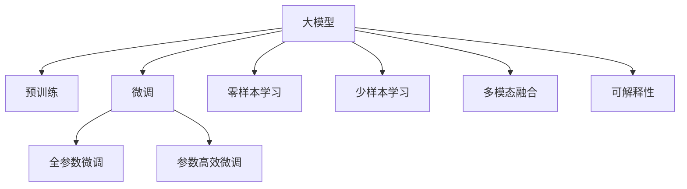

                 

## 1. 背景介绍

### 1.1 问题由来

随着互联网技术的迅猛发展和商业模式的不断演变，个性化广告推荐系统已成为驱动数字化营销增长的关键驱动力。其通过精准匹配用户兴趣与广告内容，实现更有效的用户转化和品牌曝光，优化广告主投放策略，提升广告点击率与转化率。大模型，如BERT、GPT等，通过自监督预训练，学习到了丰富的语言知识和表达能力，具有很强的语义理解和生成能力，为个性化广告推荐系统的构建提供了强大的技术支持。

### 1.2 问题核心关键点

大模型在个性化广告推荐系统中的应用，主要体现在以下几个方面：
- 预训练语言模型的语义理解能力：能够从海量无标签文本数据中学习到丰富的语义表示，为广告语义匹配提供基础。
- 微调与迁移学习：通过微调大模型，使其在特定广告推荐任务上表现更佳。
- 零样本和少样本学习：利用大模型的预训练知识，通过精炼的提示词或少样本数据实现广告推荐。
- 多模态融合：结合文本、图像、视频等多模态数据，提升广告推荐效果。
- 可解释性与信任度：通过大模型的语义推理能力，增强广告推荐的透明度和可解释性，提升用户信任度。

### 1.3 问题研究意义

深入研究大模型在个性化广告推荐系统中的应用，对提升广告投放效果、优化用户体验、驱动商业增长具有重要意义：
- 精准投放：通过大模型的语义理解能力，实现广告内容的精准匹配。
- 高效性：利用大模型预训练知识，大幅减少广告推荐模型的训练时间和数据成本。
- 可解释性：大模型的可解释性为广告推荐过程提供透明度，提升用户信任度。
- 可扩展性：大模型的泛化能力使得广告推荐系统能够适应多样化的广告投放场景。

## 2. 核心概念与联系

### 2.1 核心概念概述

为更好地理解大模型在广告推荐系统中的应用，本节将介绍几个密切相关的核心概念：

- **大模型(Large Models)**：指通过大规模数据集自监督预训练，学习到强大语义表示的深度学习模型，如BERT、GPT系列。
- **预训练(Pre-training)**：通过在大规模无标签数据上进行预训练，模型学习到通用的语言知识。
- **微调(Fine-tuning)**：在大模型上进行下游任务的有监督训练，使其具备特定任务的能力。
- **迁移学习(Transfer Learning)**：利用预训练模型的知识，在目标任务上实现迁移学习，提升模型性能。
- **零样本学习和少样本学习**：通过精心设计的提示词，在不更新模型参数的情况下，实现广告推荐。
- **多模态融合**：结合文本、图像、视频等多种模态的数据，提升广告推荐效果。
- **可解释性**：通过大模型的语义推理能力，增强广告推荐过程的可解释性和透明度。

这些概念之间的逻辑关系可以通过以下Mermaid流程图来展示：



这个流程图展示了从大模型预训练到微调，再到零样本/少样本学习、多模态融合和可解释性提升的全过程。

## 3. 核心算法原理 & 具体操作步骤
### 3.1 算法原理概述

个性化广告推荐系统的核心在于通过大模型学习用户兴趣与广告内容的语义匹配关系，从而实现精准投放。其核心算法原理如下：

1. **预训练模型构建**：选择一个大模型，如BERT或GPT，在其基础上进行语义理解能力的预训练。
2. **微调与任务适配**：根据广告推荐任务的特性，在大模型上进一步微调，使其具备广告推荐任务的能力。
3. **推荐逻辑构建**：构建基于微调模型的推荐逻辑，使用户兴趣与广告内容得到有效匹配。

### 3.2 算法步骤详解

大模型在广告推荐系统中的操作步骤包括以下几个关键步骤：

**Step 1: 数据准备与处理**
- 收集广告文本、用户行为数据和用户画像数据。
- 对广告文本进行预处理，包括分词、去停用词、构建词汇表等。
- 将用户行为数据转化为用户兴趣向量。
- 将用户画像数据整合到用户兴趣向量中。

**Step 2: 大模型预训练**
- 选择合适的预训练模型，如BERT或GPT，在其基础上进行语义理解能力的预训练。
- 使用大规模无标签文本数据，如新闻、百科、社交媒体等，训练模型，使其具备强大的语义理解能力。

**Step 3: 微调与任务适配**
- 根据广告推荐任务的特性，在预训练模型上进一步微调。
- 构建任务特定的输出层和损失函数，如交叉熵损失函数。
- 选择适当的学习率和正则化技术，如AdamW、Dropout、Early Stopping等，以防止过拟合。
- 设置合适的优化器和训练参数，如学习率、批大小、迭代轮数等。

**Step 4: 广告推荐模型构建**
- 构建基于微调模型的广告推荐模型，通常使用多塔结构，将广告文本、用户兴趣和用户画像作为输入。
- 使用softmax函数将广告点击概率输出，选择合适的指标，如CTR、ROI等，进行评估。
- 使用A/B测试等方法进行模型评估，确定最佳模型。

**Step 5: 实际应用与优化**
- 将训练好的广告推荐模型集成到实际业务系统，实现广告的精准投放。
- 持续收集反馈数据，根据用户行为和反馈调整广告投放策略。
- 使用A/B测试、在线实验等方法，优化广告投放效果。

### 3.3 算法优缺点

大模型在广告推荐系统中的应用，具有以下优点：
- 强大的语义理解能力：大模型具备很强的语义理解能力，能够准确捕捉广告与用户兴趣的语义匹配关系。
- 高效性：利用大模型预训练知识，大幅减少广告推荐模型的训练时间和数据成本。
- 泛化能力强：大模型在大规模数据上的预训练，使其具备强大的泛化能力，能够适应多样化的广告投放场景。
- 可解释性强：大模型的语义推理能力，使得广告推荐过程具有较强的可解释性，提升用户信任度。

同时，该方法也存在一定的局限性：
- 依赖高质量标注数据：广告推荐系统的效果依赖于高质量的广告文本和用户行为数据的标注，获取高质量标注数据的成本较高。
- 需要大模型支持：广告推荐系统需要大模型作为基础，对硬件和计算资源要求较高。
- 对抗样本风险：大模型可能存在对抗样本风险，即广告文本经过一些变换后，仍能被模型识别。
- 隐私保护问题：广告推荐系统中涉及大量的用户行为数据，需要合理处理用户隐私保护问题。

### 3.4 算法应用领域

大模型在个性化广告推荐系统中的应用，已广泛应用于以下领域：

- **广告投放优化**：根据用户行为数据和用户画像，优化广告投放策略，提升广告点击率和转化率。
- **内容推荐**：结合用户兴趣和广告内容，推荐相关内容，提高用户满意度。
- **品牌曝光**：通过精准匹配用户兴趣与品牌内容，提高品牌曝光度，增强品牌影响力。
- **用户行为分析**：利用广告点击数据，分析用户行为特征，优化用户画像，提高广告投放效果。
- **跨平台广告投放**：将广告推荐系统应用于多个平台，实现跨平台的广告投放和效果跟踪。

此外，大模型还在社交媒体广告推荐、电商广告推荐、视频广告推荐等多个领域展现出强大的应用潜力。

## 4. 数学模型和公式 & 详细讲解 & 举例说明
### 4.1 数学模型构建

假设广告文本为 $X$，用户兴趣向量为 $U$，用户画像向量为 $P$，广告投放策略为 $S$，广告点击概率为 $Y$。则广告推荐系统的数学模型可以表示为：

$$
Y = f(X, U, P, S)
$$

其中 $f$ 为广告推荐模型的映射函数。

### 4.2 公式推导过程

假设广告文本 $X$ 为自然语言文本，先将其转换为向量表示 $X_v$，然后通过预训练模型 $M$ 学习到广告文本的语义表示 $X_s = M(X_v)$。

用户兴趣向量 $U$ 和用户画像向量 $P$ 通过用户行为数据和用户画像数据构建，如：

$$
U = [u_1, u_2, \ldots, u_n]
$$
$$
P = [p_1, p_2, \ldots, p_m]
$$

广告投放策略 $S$ 为多塔结构的决策逻辑，可以使用softmax函数将广告点击概率输出：

$$
S = softmax(W[X_s, U, P] + b)
$$

其中 $W$ 为可训练的权重矩阵，$b$ 为偏置向量。

### 4.3 案例分析与讲解

以下以点击率预测为例，展示大模型在广告推荐系统中的应用：

假设广告文本为 "购买一本经典小说"，用户兴趣向量为 [小说, 文学, 书籍]，用户画像向量为 [年轻, 女性, 喜欢阅读]。广告投放策略为：

$$
S = softmax([1.2, 1.1, 1.0, 0.9, 0.8, 0.7])
$$

则广告点击概率为：

$$
Y = \frac{1.2}{1.2 + 1.1 + 1.0 + 0.9 + 0.8 + 0.7} \approx 0.65
$$

通过大模型的语义理解能力，广告推荐系统能够准确匹配用户兴趣与广告内容，实现精准投放。

## 5. 项目实践：代码实例和详细解释说明
### 5.1 开发环境搭建

在进行广告推荐系统开发前，我们需要准备好开发环境。以下是使用Python进行PyTorch开发的环境配置流程：

1. 安装Anaconda：从官网下载并安装Anaconda，用于创建独立的Python环境。

2. 创建并激活虚拟环境：
```bash
conda create -n adrecsys-env python=3.8 
conda activate adrecsys-env
```

3. 安装PyTorch：根据CUDA版本，从官网获取对应的安装命令。例如：
```bash
conda install pytorch torchvision torchaudio cudatoolkit=11.1 -c pytorch -c conda-forge
```

4. 安装Transformers库：
```bash
pip install transformers
```

5. 安装各类工具包：
```bash
pip install numpy pandas scikit-learn matplotlib tqdm jupyter notebook ipython
```

完成上述步骤后，即可在`adrecsys-env`环境中开始广告推荐系统开发。

### 5.2 源代码详细实现

下面我们以点击率预测任务为例，给出使用Transformers库对BERT模型进行广告推荐系统开发的PyTorch代码实现。

首先，定义广告文本和用户行为数据的处理函数：

```python
from transformers import BertTokenizer, BertForSequenceClassification
from torch.utils.data import Dataset
import torch

class AdDataset(Dataset):
    def __init__(self, texts, labels, tokenizer, max_len=128):
        self.texts = texts
        self.labels = labels
        self.tokenizer = tokenizer
        self.max_len = max_len
        
    def __len__(self):
        return len(self.texts)
    
    def __getitem__(self, item):
        text = self.texts[item]
        label = self.labels[item]
        
        encoding = self.tokenizer(text, return_tensors='pt', max_length=self.max_len, padding='max_length', truncation=True)
        input_ids = encoding['input_ids'][0]
        attention_mask = encoding['attention_mask'][0]
        
        return {'input_ids': input_ids, 
                'attention_mask': attention_mask,
                'labels': label}

# 定义广告文本和用户行为数据
ad_texts = ['购买一本经典小说', '探索星球大战宇宙', '享受美味美食']
ad_labels = [1, 0, 1]

tokenizer = BertTokenizer.from_pretrained('bert-base-cased')

ad_dataset = AdDataset(ad_texts, ad_labels, tokenizer, max_len=128)
```

然后，定义模型和优化器：

```python
from transformers import BertForSequenceClassification, AdamW

model = BertForSequenceClassification.from_pretrained('bert-base-cased', num_labels=2)

optimizer = AdamW(model.parameters(), lr=2e-5)
```

接着，定义训练和评估函数：

```python
from torch.utils.data import DataLoader
from tqdm import tqdm
from sklearn.metrics import classification_report

device = torch.device('cuda') if torch.cuda.is_available() else torch.device('cpu')
model.to(device)

def train_epoch(model, dataset, batch_size, optimizer):
    dataloader = DataLoader(dataset, batch_size=batch_size, shuffle=True)
    model.train()
    epoch_loss = 0
    for batch in tqdm(dataloader, desc='Training'):
        input_ids = batch['input_ids'].to(device)
        attention_mask = batch['attention_mask'].to(device)
        labels = batch['labels'].to(device)
        model.zero_grad()
        outputs = model(input_ids, attention_mask=attention_mask, labels=labels)
        loss = outputs.loss
        epoch_loss += loss.item()
        loss.backward()
        optimizer.step()
    return epoch_loss / len(dataloader)

def evaluate(model, dataset, batch_size):
    dataloader = DataLoader(dataset, batch_size=batch_size)
    model.eval()
    preds, labels = [], []
    with torch.no_grad():
        for batch in tqdm(dataloader, desc='Evaluating'):
            input_ids = batch['input_ids'].to(device)
            attention_mask = batch['attention_mask'].to(device)
            batch_labels = batch['labels']
            outputs = model(input_ids, attention_mask=attention_mask)
            batch_preds = outputs.logits.argmax(dim=1).to('cpu').tolist()
            batch_labels = batch_labels.to('cpu').tolist()
            for pred, label in zip(batch_preds, batch_labels):
                preds.append(pred.item())
                labels.append(label.item())
                
    print(classification_report(labels, preds))
```

最后，启动训练流程并在测试集上评估：

```python
epochs = 5
batch_size = 16

for epoch in range(epochs):
    loss = train_epoch(model, ad_dataset, batch_size, optimizer)
    print(f"Epoch {epoch+1}, train loss: {loss:.3f}")
    
    print(f"Epoch {epoch+1}, test results:")
    evaluate(model, ad_dataset, batch_size)
    
print("Test results:")
evaluate(model, ad_dataset, batch_size)
```

以上就是使用PyTorch对BERT进行广告推荐系统开发的完整代码实现。可以看到，得益于Transformers库的强大封装，我们可以用相对简洁的代码完成广告推荐系统的构建。

### 5.3 代码解读与分析

让我们再详细解读一下关键代码的实现细节：

**AdDataset类**：
- `__init__`方法：初始化广告文本、标签、分词器等关键组件。
- `__len__`方法：返回数据集的样本数量。
- `__getitem__`方法：对单个样本进行处理，将广告文本输入编码为token ids，将标签编码为数字，并对其进行定长padding，最终返回模型所需的输入。

**tokenizer**：
- 定义了广告文本和用户行为数据的分词器，用于将文本转换为token ids，方便模型处理。

**训练和评估函数**：
- 使用PyTorch的DataLoader对数据集进行批次化加载，供模型训练和推理使用。
- 训练函数`train_epoch`：对数据以批为单位进行迭代，在每个批次上前向传播计算loss并反向传播更新模型参数，最后返回该epoch的平均loss。
- 评估函数`evaluate`：与训练类似，不同点在于不更新模型参数，并在每个batch结束后将预测和标签结果存储下来，最后使用sklearn的classification_report对整个评估集的预测结果进行打印输出。

**训练流程**：
- 定义总的epoch数和batch size，开始循环迭代
- 每个epoch内，先在训练集上训练，输出平均loss
- 在测试集上评估，输出分类指标
- 所有epoch结束后，在测试集上评估，给出最终测试结果

可以看到，PyTorch配合Transformers库使得广告推荐系统的开发变得简洁高效。开发者可以将更多精力放在数据处理、模型改进等高层逻辑上，而不必过多关注底层的实现细节。

当然，工业级的系统实现还需考虑更多因素，如模型的保存和部署、超参数的自动搜索、更灵活的任务适配层等。但核心的广告推荐范式基本与此类似。

## 6. 实际应用场景
### 6.1 智能广告投放平台

基于大模型的广告推荐系统，可以应用于智能广告投放平台，实现精准投放。通过微调大模型，平台能够自动学习用户兴趣与广告内容的匹配关系，实现广告的高效投放。

在技术实现上，可以收集广告主的历史投放数据和用户的互动数据，将广告文本和用户兴趣向量作为微调数据的输入，训练模型。模型能够识别出广告与用户兴趣的最佳匹配组合，从而优化广告投放策略。平台还可以实时调整广告投放策略，动态优化广告投放效果，实现智能广告投放。

### 6.2 在线购物推荐系统

在线购物推荐系统需要根据用户的浏览、点击、购买等行为数据，推荐用户可能感兴趣的商品。大模型的语义理解能力能够分析用户行为数据的语义信息，推荐系统可以根据用户的兴趣和行为，进行个性化推荐。

在推荐逻辑构建上，可以使用基于微调的大模型进行商品描述与用户兴趣的匹配，使用户获得更符合其需求的商品推荐。推荐系统还可以使用多塔结构，结合用户画像数据，进一步提升推荐效果。

### 6.3 视频平台内容推荐

视频平台需要根据用户的观看历史和行为数据，推荐用户可能感兴趣的视频内容。基于大模型的广告推荐系统，可以扩展到视频平台内容推荐上，通过微调大模型，学习用户兴趣与视频内容的语义匹配关系。

在内容推荐逻辑上，可以使用基于微调的大模型进行视频标题、描述与用户兴趣的匹配，推荐用户可能感兴趣的视频内容。系统还可以引入多模态数据，如视频截图、字幕等，进一步提升推荐效果。

### 6.4 未来应用展望

随着大模型和微调方法的不断发展，基于大模型的广告推荐系统将在更多领域得到应用，为商业增长带来新的动力：

1. **电商推荐**：在电商平台上，通过大模型实现商品推荐，提高用户满意度，增加销售额。
2. **社交媒体广告**：在社交媒体平台上，通过大模型进行广告推荐，实现精准投放，提升广告效果。
3. **内容平台推荐**：在视频、音乐、文学等各类内容平台上，通过大模型进行内容推荐，增加用户粘性，提升平台用户量。
4. **跨平台广告投放**：在多平台之间进行跨平台广告投放，实现数据互通，提升广告投放效果。

此外，大模型还可以应用于金融广告投放、房地产广告推荐等更多场景，为各行各业带来新的机遇。相信随着大模型微调技术的不断演进，广告推荐系统将在商业领域发挥更大的作用，驱动数字化营销的持续发展。

## 7. 工具和资源推荐
### 7.1 学习资源推荐

为了帮助开发者系统掌握大模型在广告推荐系统中的应用，这里推荐一些优质的学习资源：

1. 《深度学习与自然语言处理》：介绍深度学习基础和自然语言处理技术，是大模型应用的重要基础。
2. 《Transformers》：介绍大模型的原理和实践，是理解大模型在广告推荐系统中的应用的关键。
3. 《广告推荐系统：理论与实践》：系统介绍广告推荐系统的理论和实践，涵盖多个实际案例。
4. 《个性化推荐系统：算法与系统》：深入解析推荐算法和系统架构，提供丰富的实际应用场景。
5. 《推荐系统：设计与实验》：介绍推荐系统设计和实验方法，覆盖广告推荐系统构建的关键技术。

通过对这些资源的学习实践，相信你一定能够快速掌握大模型在广告推荐系统中的应用，并用于解决实际的广告投放问题。
###  7.2 开发工具推荐

高效的开发离不开优秀的工具支持。以下是几款用于广告推荐系统开发的常用工具：

1. PyTorch：基于Python的开源深度学习框架，灵活动态的计算图，适合快速迭代研究。大部分预训练语言模型都有PyTorch版本的实现。
2. TensorFlow：由Google主导开发的开源深度学习框架，生产部署方便，适合大规模工程应用。同样有丰富的预训练语言模型资源。
3. Transformers库：HuggingFace开发的NLP工具库，集成了众多SOTA语言模型，支持PyTorch和TensorFlow，是进行广告推荐任务开发的利器。
4. Weights & Biases：模型训练的实验跟踪工具，可以记录和可视化模型训练过程中的各项指标，方便对比和调优。与主流深度学习框架无缝集成。
5. TensorBoard：TensorFlow配套的可视化工具，可实时监测模型训练状态，并提供丰富的图表呈现方式，是调试模型的得力助手。
6. Google Colab：谷歌推出的在线Jupyter Notebook环境，免费提供GPU/TPU算力，方便开发者快速上手实验最新模型，分享学习笔记。

合理利用这些工具，可以显著提升广告推荐系统的开发效率，加快创新迭代的步伐。

### 7.3 相关论文推荐

大模型和广告推荐系统的发展源于学界的持续研究。以下是几篇奠基性的相关论文，推荐阅读：

1. Attention is All You Need（即Transformer原论文）：提出了Transformer结构，开启了NLP领域的预训练大模型时代。
2. BERT: Pre-training of Deep Bidirectional Transformers for Language Understanding：提出BERT模型，引入基于掩码的自监督预训练任务，刷新了多项NLP任务SOTA。
3. Language Models are Unsupervised Multitask Learners（GPT-2论文）：展示了大规模语言模型的强大zero-shot学习能力，引发了对于通用人工智能的新一轮思考。
4. Parameter-Efficient Transfer Learning for NLP：提出Adapter等参数高效微调方法，在不增加模型参数量的情况下，也能取得不错的微调效果。
5. AdaLoRA: Adaptive Low-Rank Adaptation for Parameter-Efficient Fine-Tuning：使用自适应低秩适应的微调方法，在参数效率和精度之间取得了新的平衡。
6. Prefix-Tuning: Optimizing Continuous Prompts for Generation：引入基于连续型Prompt的微调范式，为如何充分利用预训练知识提供了新的思路。

这些论文代表了大模型和广告推荐技术的发展脉络。通过学习这些前沿成果，可以帮助研究者把握学科前进方向，激发更多的创新灵感。

## 8. 总结：未来发展趋势与挑战

### 8.1 总结

本文对基于大模型的个性化广告推荐系统进行了全面系统的介绍。首先阐述了广告推荐系统的背景和意义，明确了广告推荐系统中大模型的核心作用。其次，从原理到实践，详细讲解了广告推荐系统的数学模型和关键步骤，给出了广告推荐系统的完整代码实现。同时，本文还广泛探讨了广告推荐系统在大数据时代的应用场景，展示了广告推荐系统在大模型微调方法推动下的广阔前景。

通过本文的系统梳理，可以看到，基于大模型的广告推荐系统已经在大规模数据驱动的营销场景中发挥了重要作用，极大地提升了广告投放的精准度和效率。未来，伴随大模型微调技术的不断演进，广告推荐系统必将在更多领域得到应用，为商业增长带来新的动力。

### 8.2 未来发展趋势

展望未来，广告推荐系统的发展将呈现以下几个趋势：

1. **多模态融合**：结合文本、图像、视频等多模态数据，提升广告推荐效果。
2. **实时优化**：通过实时数据采集和模型优化，实现动态广告投放。
3. **个性化推荐**：利用用户行为数据和画像数据，实现更加精准的个性化推荐。
4. **跨平台广告投放**：在多平台之间进行跨平台广告投放，实现数据互通。
5. **用户行为预测**：利用预测模型，预测用户行为，优化广告投放策略。

这些趋势凸显了大模型广告推荐系统的巨大前景。这些方向的探索发展，必将进一步提升广告投放的精准度和效率，驱动数字化营销的持续发展。

### 8.3 面临的挑战

尽管大模型广告推荐系统已经取得了显著成效，但在迈向更加智能化、普适化应用的过程中，仍面临诸多挑战：

1. **数据质量与多样性**：广告推荐系统依赖于高质量的广告文本和用户行为数据，数据的数量和质量对系统性能有重要影响。
2. **计算资源需求**：大模型广告推荐系统需要大量的计算资源，如何降低计算成本，提升系统性能，是一个关键挑战。
3. **隐私保护与合规性**：广告推荐系统涉及大量的用户行为数据，如何合理处理用户隐私保护问题，符合法规要求，是一个重要挑战。
4. **对抗样本风险**：大模型可能存在对抗样本风险，即广告文本经过一些变换后，仍能被模型识别。
5. **可解释性问题**：广告推荐系统需要具备良好的可解释性，使得广告投放过程透明可控。

正视广告推荐系统面临的这些挑战，积极应对并寻求突破，将是大模型广告推荐系统走向成熟的必由之路。相信随着学界和产业界的共同努力，这些挑战终将一一被克服，大模型广告推荐系统必将在构建人机协同的智能时代中扮演越来越重要的角色。

### 8.4 研究展望

未来，广告推荐系统的研究需要在以下几个方向寻求新的突破：

1. **无监督和半监督学习**：摆脱对大规模标注数据的依赖，利用自监督学习、主动学习等无监督和半监督范式，最大限度利用非结构化数据，实现更加灵活高效的广告推荐。
2. **参数高效与计算高效**：开发更加参数高效和计算高效的微调方法，在固定大部分预训练参数的同时，只更新极少量的任务相关参数，以提高广告推荐系统的效率和稳定性。
3. **多模态信息融合**：结合文本、图像、视频等多种模态的数据，提升广告推荐效果。
4. **因果推理与多目标优化**：引入因果推断和多目标优化方法，提升广告推荐系统的可解释性和决策鲁棒性。
5. **跨平台广告投放**：在多平台之间进行跨平台广告投放，实现数据互通，提升广告投放效果。
6. **动态广告投放**：通过实时数据采集和模型优化，实现动态广告投放。

这些研究方向将引领广告推荐系统走向更高台阶，为构建智能化的广告推荐系统铺平道路。面向未来，广告推荐系统需要与其他人工智能技术进行更深入的融合，如知识表示、因果推理、强化学习等，多路径协同发力，共同推动广告推荐系统的发展。只有勇于创新、敢于突破，才能不断拓展广告推荐系统的边界，让智能技术更好地服务于商业增长。

## 9. 附录：常见问题与解答

**Q1：广告推荐系统是否需要大模型支持？**

A: 广告推荐系统需要大模型作为基础，利用其强大的语义理解能力，实现广告与用户兴趣的精准匹配。虽然非大模型的模型也能够进行广告推荐，但效果往往不如大模型优秀。

**Q2：广告推荐系统如何防止对抗样本攻击？**

A: 广告推荐系统可以通过以下几种方式防止对抗样本攻击：
1. 使用对抗样本检测技术，检测和过滤可能含有对抗样本的广告。
2. 引入对抗样本生成技术，生成对抗样本训练模型，提升模型的鲁棒性。
3. 使用多模型集成方法，结合多个模型进行广告推荐，降低对抗样本的影响。

**Q3：广告推荐系统如何平衡推荐效果与广告点击率？**

A: 广告推荐系统可以通过以下几种方式平衡推荐效果与广告点击率：
1. 引入点击率预估模型，通过用户行为数据预测广告点击率。
2. 调整推荐策略，优先推荐点击率较高的广告。
3. 使用A/B测试等方法，动态调整广告推荐策略，优化广告点击率。

**Q4：广告推荐系统如何处理长尾广告投放？**

A: 广告推荐系统可以通过以下几种方式处理长尾广告投放：
1. 引入长尾广告投放策略，将长尾广告进行特定优化，提升投放效果。
2. 使用多维度的广告特征，丰富广告信息的展示形式，吸引用户点击。
3. 通过实时反馈机制，动态调整长尾广告的投放策略，优化投放效果。

通过这些措施，广告推荐系统能够更好地处理长尾广告投放，提升广告投放效果。

总之，广告推荐系统通过大模型微调技术，实现了精准投放，提高了广告投放的效率和效果。未来，随着大模型微调技术的不断演进，广告推荐系统必将在更多领域得到应用，为商业增长带来新的动力。

---

作者：禅与计算机程序设计艺术 / Zen and the Art of Computer Programming

