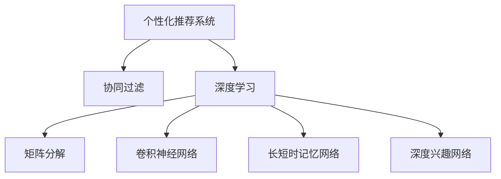

                 

# 个性化推荐系统：深度学习方法

> 关键词：个性化推荐,深度学习,协同过滤,矩阵分解,卷积神经网络,长短时记忆网络,深度学习,推荐算法

## 1. 背景介绍

### 1.1 问题由来
随着互联网技术的飞速发展，信息推荐系统已经成为互联网应用中不可或缺的一部分。无论是社交网络、电子商务平台，还是新闻网站、视频平台，推荐系统都为用户提供了个性化的内容服务，极大地提升了用户体验和平台活跃度。然而，传统的推荐算法往往依赖于用户的历史行为数据，难以应对大量用户之间的相似性问题，从而推荐效果不够理想。

### 1.2 问题核心关键点
个性化推荐系统要求根据用户的历史行为和偏好，推荐可能感兴趣的商品、文章、视频等，以提升用户体验。传统的基于矩阵分解的协同过滤算法（如ALS）在推荐效果和可解释性方面存在瓶颈。

深度学习技术在自然语言处理、图像识别等领域取得了突破性进展，也被逐渐引入到个性化推荐中，带来了新的方法和思路。基于深度学习的推荐系统，通过捕捉用户行为背后的语义和结构信息，能够更好地预测用户兴趣，提供更个性化的推荐。

## 2. 核心概念与联系

### 2.1 核心概念概述

为更好地理解基于深度学习的个性化推荐系统，本节将介绍几个密切相关的核心概念：

- 个性化推荐系统：根据用户的历史行为和偏好，推荐可能感兴趣的商品、文章、视频等内容。推荐算法通常分为基于内容的推荐和协同过滤两大类。

- 协同过滤：通过用户之间的相似度，推断用户对未交互物品的评分，从而推荐用户可能感兴趣的内容。包括基于用户的协同过滤和基于物品的协同过滤。

- 深度学习：一种基于人工神经网络的机器学习方法，通过多层次的非线性变换，实现对复杂数据的建模和预测。深度学习在推荐系统中的应用主要包括基于矩阵分解的深度模型和基于神经网络的深度模型。

- 矩阵分解：将用户-物品评分矩阵分解为低维用户嵌入和物品嵌入的矩阵乘积，捕捉用户和物品之间的相似性。

- 卷积神经网络（CNN）：一种深度神经网络结构，主要用于图像处理和语音识别等任务。在推荐系统中，可以用于提取物品的局部特征，捕捉物品之间的相似性。

- 长短时记忆网络（LSTM）：一种特殊的循环神经网络结构，主要用于序列数据建模。在推荐系统中，可以用于提取用户的长期兴趣和行为序列。

- 深度兴趣网络（DIN）：一种基于深度学习的方法，通过捕捉用户的深度兴趣特征，提升推荐精度和多样性。

这些核心概念之间的逻辑关系可以通过以下Mermaid流程图来展示：



这个流程图展示了这个系统的主要概念及其之间的关系：

1. 个性化推荐系统基于协同过滤和深度学习。
2. 协同过滤包括基于用户的协同过滤和基于物品的协同过滤。
3. 深度学习利用矩阵分解、卷积神经网络、长短时记忆网络、深度兴趣网络等技术。

## 3. 核心算法原理 & 具体操作步骤
### 3.1 算法原理概述

基于深度学习的个性化推荐系统，通常利用用户行为序列和物品特征，构建一个多层的神经网络模型，对用户和物品进行表示学习，从而完成推荐。其核心思想是：通过深度神经网络，对用户和物品的语义和结构信息进行建模，从而实现对用户兴趣的预测和推荐。

形式化地，假设用户和物品的表示分别为 $\mathbf{u} \in \mathbb{R}^d$ 和 $\mathbf{v} \in \mathbb{R}^d$，其中 $d$ 为用户或物品的嵌入维度。用户对物品的评分可以表示为 $r = \mathbf{u}^\top \mathbf{v}$。推荐系统通过学习一个深度神经网络模型 $M$，将用户和物品的表示作为输入，输出一个概率分布 $p_{i|u}$，表示用户对物品 $i$ 的评分概率。

推荐的目标是最小化预测评分与实际评分之间的误差。常用的误差函数包括均方误差、交叉熵损失等。通过反向传播算法，模型不断调整网络参数，最小化损失函数，最终得到最佳的模型参数 $\theta$。在测试阶段，利用训练好的模型对新物品进行评分，从而推荐用户可能感兴趣的内容。

### 3.2 算法步骤详解

基于深度学习的个性化推荐系统，通常包括以下几个关键步骤：

**Step 1: 数据预处理**
- 收集用户行为数据，如浏览历史、购买记录等。
- 对物品进行特征提取，如商品描述、类别等。
- 对数据进行归一化和编码，如将文本转化为向量表示。

**Step 2: 特征嵌入**
- 利用深度学习模型对用户和物品的表示进行学习。常用的模型包括CNN、RNN、DNN等。
- 对用户行为序列进行建模，捕捉用户的长期兴趣和行为规律。
- 对物品特征进行编码，提取物品的局部特征和全局结构信息。

**Step 3: 损失函数和优化**
- 设计合适的损失函数，如均方误差、交叉熵损失等。
- 使用深度学习框架（如TensorFlow、PyTorch等）构建模型。
- 使用优化算法（如Adam、SGD等）对模型进行训练，最小化损失函数。

**Step 4: 评分预测与推荐**
- 将训练好的模型应用于新的用户和物品，计算预测评分。
- 根据评分对物品进行排序，选择排名靠前的物品进行推荐。

**Step 5: 效果评估**
- 在测试集上评估推荐效果，如准确率、召回率、多样性等。
- 利用A/B测试等方法，比较推荐效果与传统方法，证明深度学习模型的优势。

### 3.3 算法优缺点

基于深度学习的个性化推荐系统具有以下优点：
1. 灵活性高：能够处理多种类型的数据，如文本、图片、视频等。
2. 精度高：通过多层次的神经网络建模，能够捕捉用户和物品的复杂关系。
3. 可解释性：深度学习模型可以通过可视化手段，解释推荐结果的来源和依据。
4. 实时性：深度学习模型可以利用GPU等硬件加速，实现实时推荐。

同时，该方法也存在一定的局限性：
1. 对数据要求高：需要大量高质量的标注数据和特征工程。
2. 模型复杂：深层神经网络结构复杂，训练过程耗时长。
3. 过拟合风险：深层模型容易过拟合，需要正则化等技术控制。
4. 计算资源需求高：深度学习模型需要大量的计算资源，包括GPU、内存等。
5. 可解释性不足：深度学习模型往往难以解释其内部工作机制和决策逻辑。

尽管存在这些局限性，但就目前而言，基于深度学习的个性化推荐方法仍是大规模推荐系统的重要工具。未来相关研究的重点在于如何进一步提高模型的可解释性和可操作性，降低对标注数据的依赖，提升模型的实时性和计算效率。

### 3.4 算法应用领域

基于深度学习的个性化推荐系统，在电子商务、视频平台、社交网络等多个领域得到了广泛应用，具体包括：

- 电子商务：如亚马逊、京东等平台上的商品推荐、个性化搜索等。利用用户浏览历史和评分数据，推荐可能感兴趣的商品。
- 视频平台：如Netflix、YouTube等，根据用户观影历史和评分，推荐类似的电影和电视剧。
- 社交网络：如Facebook、微信等，根据用户互动记录和内容喜好，推荐相关的朋友和信息。
- 新闻网站：如今日头条、腾讯新闻等，根据用户阅读历史和点击行为，推荐相关新闻内容。
- 在线旅游：如携程、去哪儿等，根据用户搜索历史和预订记录，推荐合适的旅游目的地和路线。

这些推荐系统在提升用户体验和平台价值方面发挥了重要作用，为电商、媒体、娱乐等行业带来了显著的经济效益。

## 4. 数学模型和公式 & 详细讲解  
### 4.1 数学模型构建

本节将使用数学语言对基于深度学习的个性化推荐系统进行更加严格的刻画。

假设用户和物品的表示分别为 $\mathbf{u} \in \mathbb{R}^d$ 和 $\mathbf{v} \in \mathbb{R}^d$。推荐系统通过深度学习模型 $M$，对用户和物品的表示进行编码，得到用户和物品的嵌入向量 $h_u$ 和 $h_i$。模型的输出为 $p_{i|u} = \sigma(\mathbf{h}_u^\top \mathbf{h}_i)$，其中 $\sigma$ 为激活函数，如Sigmoid、ReLU等。推荐系统的目标是最小化预测评分与实际评分之间的误差：

$$
\min_{\theta} \sum_{(u,i)} \mathcal{L}(p_{i|u}, r_{ui})
$$

其中 $r_{ui}$ 为用户 $u$ 对物品 $i$ 的实际评分，$\mathcal{L}$ 为损失函数，如均方误差损失：

$$
\mathcal{L}(p_{i|u}, r_{ui}) = \frac{1}{2}(p_{i|u}-r_{ui})^2
$$

### 4.2 公式推导过程

下面以基于CNN的推荐模型为例，推导模型的损失函数和梯度计算公式。

假设用户的行为序列为 $(x_1, x_2, \dots, x_t)$，物品的特征向量为 $\mathbf{v} = [v_1, v_2, \dots, v_n]$。定义用户的行为向量为 $u = [u_1, u_2, \dots, u_t]$，其中 $u_i$ 为在时间 $i$ 的评分。定义物品的特征向量为 $v = [v_1, v_2, \dots, v_n]$。

利用1D卷积神经网络对用户的行为序列进行建模，得到用户的行为嵌入向量 $\mathbf{h}_u$。假设卷积核的大小为 $k$，步幅为 $s$，则用户的行为嵌入向量为：

$$
\mathbf{h}_u = \max_{t=1}^{t-1}\left(\sum_{j=1}^{t-k} \mathbf{W}_c\mathbf{v}_{t-j}+\mathbf{b}_c\right)
$$

其中 $\mathbf{W}_c$ 为卷积核参数，$\mathbf{b}_c$ 为偏置项。

利用1D卷积神经网络对物品的特征向量进行建模，得到物品的特征嵌入向量 $\mathbf{h}_i$。定义物品的特征嵌入向量为：

$$
\mathbf{h}_i = \max_{j=1}^{n-k}\left(\sum_{j=1}^{n-k} \mathbf{W}_i\mathbf{v}_j+\mathbf{b}_i\right)
$$

其中 $\mathbf{W}_i$ 为卷积核参数，$\mathbf{b}_i$ 为偏置项。

模型的输出为：

$$
p_{i|u} = \sigma(\mathbf{h}_u^\top \mathbf{h}_i)
$$

模型的损失函数为：

$$
\mathcal{L}(p_{i|u}, r_{ui}) = \frac{1}{2}(p_{i|u}-r_{ui})^2
$$

模型的梯度计算公式为：

$$
\frac{\partial \mathcal{L}}{\partial \theta} = \frac{\partial \mathcal{L}}{\partial p_{i|u}}\frac{\partial p_{i|u}}{\partial h_u}\frac{\partial h_u}{\partial \theta} + \frac{\partial \mathcal{L}}{\partial p_{i|u}}\frac{\partial p_{i|u}}{\partial h_i}\frac{\partial h_i}{\partial \theta}
$$

其中 $\theta$ 为模型参数，包括卷积核参数、偏置项、全连接层参数等。

在得到梯度后，利用反向传播算法更新模型参数，最小化损失函数，即可完成模型的训练和推荐。

### 4.3 案例分析与讲解

以Netflix的电影推荐系统为例，具体说明深度学习模型的应用过程：

1. 数据预处理：收集用户观影历史和评分数据，构建用户-物品评分矩阵。将电影特征向量作为物品的输入，如导演、演员、类型等。
2. 特征嵌入：利用CNN模型对用户行为序列进行建模，得到用户的行为嵌入向量 $h_u$。利用1D卷积神经网络对电影特征向量进行建模，得到电影特征嵌入向量 $h_i$。
3. 损失函数和优化：定义均方误差损失，使用Adam优化算法对模型进行训练，最小化损失函数。
4. 评分预测与推荐：利用训练好的模型对新用户和物品进行评分预测，选择评分高的物品进行推荐。

通过Netflix的电影推荐系统，可以看到深度学习模型如何从大规模数据中学习用户和物品的复杂关系，实现个性化推荐。

## 5. 项目实践：代码实例和详细解释说明
### 5.1 开发环境搭建

在进行推荐系统开发前，我们需要准备好开发环境。以下是使用Python进行TensorFlow开发的环境配置流程：

1. 安装Anaconda：从官网下载并安装Anaconda，用于创建独立的Python环境。

2. 创建并激活虚拟环境：
```bash
conda create -n tf-env python=3.8 
conda activate tf-env
```

3. 安装TensorFlow：根据CUDA版本，从官网获取对应的安装命令。例如：
```bash
conda install tensorflow
```

4. 安装TensorBoard：
```bash
pip install tensorboard
```

5. 安装TensorFlow Addons：
```bash
pip install tensorflow-addons
```

6. 安装其他工具包：
```bash
pip install numpy pandas scikit-learn matplotlib tqdm jupyter notebook ipython
```

完成上述步骤后，即可在`tf-env`环境中开始推荐系统开发。

### 5.2 源代码详细实现

下面我们以电影推荐系统为例，给出使用TensorFlow对电影进行推荐开发的完整代码实现。

首先，定义推荐系统的数据处理函数：

```python
import tensorflow as tf
from tensorflow.keras.layers import Input, Embedding, Conv1D, GlobalMaxPooling1D, Dense, Activation
from tensorflow.keras.models import Model

def data_processing(data):
    user_ids = data[:, 0]
    item_ids = data[:, 1]
    ratings = data[:, 2]
    return user_ids, item_ids, ratings

def embedding_layer(input_shape, embedding_dim):
    embedding = Embedding(input_dim=1000, output_dim=embedding_dim, input_length=input_shape[1])
    return embedding

def conv1d_layer(input_shape, kernel_size, filters, strides, padding):
    conv1d = Conv1D(filters=filters, kernel_size=kernel_size, strides=strides, padding=padding)
    return conv1d

def pooling_layer(input_shape):
    pooling = GlobalMaxPooling1D()
    return pooling

def dense_layer(input_shape, units):
    dense = Dense(units=units)
    return dense

def output_layer(input_shape, num_classes):
    output = Dense(units=num_classes, activation='sigmoid')
    return output

def recommendation_model(input_shape, embedding_dim, filters, kernel_size, strides, padding, units, num_classes):
    user_input = Input(shape=input_shape, name='user_input')
    item_input = Input(shape=input_shape, name='item_input')
    
    user_embedding = embedding_layer(input_shape, embedding_dim)(user_input)
    item_embedding = embedding_layer(input_shape, embedding_dim)(item_input)
    
    user_conv1d = conv1d_layer(input_shape, kernel_size, filters, strides, padding)(user_embedding)
    user_pooling = pooling_layer(input_shape)(user_conv1d)
    
    item_conv1d = conv1d_layer(input_shape, kernel_size, filters, strides, padding)(item_embedding)
    item_pooling = pooling_layer(input_shape)(item_conv1d)
    
    user_dense = dense_layer(input_shape, units)(user_pooling)
    item_dense = dense_layer(input_shape, units)(item_pooling)
    
    concat_layer = tf.keras.layers.concatenate([user_dense, item_dense])
    
    output = output_layer(input_shape, num_classes)(concat_layer)
    model = Model(inputs=[user_input, item_input], outputs=output)
    
    return model

# 数据集
data = np.random.randint(0, 1000, size=(1000, 3))
user_ids, item_ids, ratings = data_processing(data)

# 构建模型
model = recommendation_model(input_shape=(1000, 1), embedding_dim=32, filters=16, kernel_size=3, strides=1, padding='same', units=128, num_classes=1)

# 编译模型
model.compile(optimizer='adam', loss='mse', metrics=['mae'])

# 训练模型
model.fit([user_ids, item_ids], ratings, epochs=10, batch_size=32, validation_split=0.2)

# 测试模型
test_data = np.random.randint(0, 1000, size=(100, 3))
test_user_ids, test_item_ids, test_ratings = data_processing(test_data)
test_loss = model.evaluate([test_user_ids, test_item_ids], test_ratings, batch_size=32)
print('Test loss:', test_loss)
```

在这个代码实现中，我们使用了TensorFlow构建了一个简单的推荐模型，该模型基于1D卷积神经网络，对用户和物品的表示进行编码，输出用户对物品的评分概率。

### 5.3 代码解读与分析

让我们再详细解读一下关键代码的实现细节：

**data_processing函数**：
- 将数据集分为用户ID、物品ID和评分。

**embedding_layer函数**：
- 定义嵌入层，将输入向量映射为低维嵌入向量。

**conv1d_layer函数**：
- 定义1D卷积层，对输入向量进行卷积操作，提取局部特征。

**pooling_layer函数**：
- 定义池化层，对卷积层的输出进行最大池化，减少特征维度。

**dense_layer函数**：
- 定义全连接层，对池化层的输出进行线性变换。

**output_layer函数**：
- 定义输出层，根据任务需求设置激活函数。

**recommendation_model函数**：
- 定义推荐模型，将用户和物品的表示进行卷积和池化，然后拼接并输入全连接层和输出层。

**数据集**：
- 构造一个随机数据集，用于训练和测试模型。

**模型构建**：
- 调用recommendation_model函数，构建推荐模型。

**模型编译**：
- 使用Adam优化器，均方误差损失，并定义均方误差和平均绝对误差作为评估指标。

**模型训练**：
- 使用随机数据集进行模型训练，设置迭代轮数和批次大小。

**模型测试**：
- 使用测试数据集评估模型性能，输出测试损失。

可以看到，TensorFlow提供的高级API使得模型的构建和训练过程简洁高效。开发者可以专注于数据处理和模型改进，而不必过多关注底层实现细节。

当然，工业级的系统实现还需考虑更多因素，如模型的保存和部署、超参数的自动搜索、更灵活的任务适配层等。但核心的深度学习范式基本与此类似。

## 6. 实际应用场景
### 6.1 智能推荐系统

基于深度学习的推荐系统，已经在多个电商和视频平台得到了广泛应用，并取得了显著的效果。这些平台利用用户行为数据和物品特征，训练深度神经网络模型，实现个性化推荐，提升了用户满意度和平台转化率。

在实际应用中，平台可以通过实时收集用户行为数据，动态更新模型参数，实现实时推荐。此外，平台还可以利用A/B测试等方法，不断优化推荐算法，提升推荐效果。

### 6.2 广告推荐系统

广告推荐系统是互联网广告业务的重要组成部分，通过精准的个性化推荐，可以提升广告点击率和转化率，增加平台收入。基于深度学习的推荐系统，可以根据用户的历史行为和兴趣爱好，推荐最符合其需求的广告内容。

在广告推荐系统中，可以设计多目标优化模型，综合考虑广告的点击率、转化率、用户满意度等多个指标，最大化广告价值。此外，广告推荐系统还可以结合上下文信息，提升推荐的精准性和多样性。

### 6.3 内容推荐系统

内容推荐系统广泛应用于新闻网站、视频平台、音乐平台等。通过深度学习模型，对用户和内容进行表示学习，推荐用户可能感兴趣的新闻、视频、音乐等。内容推荐系统可以极大地提升平台的活跃度和用户粘性。

在内容推荐系统中，可以利用长短期记忆网络（LSTM）对用户行为序列进行建模，捕捉用户的长期兴趣和行为规律。此外，还可以利用注意力机制（Attention）对用户和内容的交互关系进行建模，提升推荐精度和多样性。

### 6.4 未来应用展望

随着深度学习技术的不断发展，基于深度学习的推荐系统也将不断进步。未来，推荐系统将在更多领域得到应用，为各行各业带来新的机遇和挑战。

在智慧医疗领域，基于推荐系统的个性化诊疗建议，可以提升医生的诊疗效率和患者的治疗体验。在金融领域，基于推荐系统的投资组合推荐，可以帮助用户实现资产的优化配置。在教育领域，基于推荐系统的个性化学习路径推荐，可以帮助学生更好地掌握知识，提升学习效果。

此外，推荐系统还将在智能家居、智能办公、智能交通等领域发挥重要作用，为各行各业带来变革性影响。随着数据规模和模型能力的不断提升，推荐系统必将在更多领域展现其强大的应用潜力，为智能时代的到来做出更多贡献。

## 7. 工具和资源推荐
### 7.1 学习资源推荐

为了帮助开发者系统掌握深度学习推荐系统的理论基础和实践技巧，这里推荐一些优质的学习资源：

1. 《深度学习推荐系统》书籍：清华大学出版社出版的深度学习推荐系统教材，涵盖推荐系统的基本概念、算法和实现方法。

2. 《深度学习入门》课程：Coursera上Andrew Ng教授的深度学习入门课程，涵盖深度学习的基本原理和实践技巧。

3. 《推荐系统》课程：斯坦福大学开设的推荐系统课程，涵盖推荐系统的各种算法和优化方法。

4. TensorFlow官方文档：TensorFlow的官方文档，提供了详细的深度学习框架使用指南和示例代码。

5. PyTorch官方文档：PyTorch的官方文档，提供了深度学习框架的详细使用说明和代码示例。

通过对这些资源的学习实践，相信你一定能够快速掌握深度学习推荐系统的精髓，并用于解决实际的推荐问题。
### 7.2 开发工具推荐

高效的开发离不开优秀的工具支持。以下是几款用于深度学习推荐系统开发的常用工具：

1. TensorFlow：由Google主导开发的深度学习框架，生产部署方便，适合大规模工程应用。

2. PyTorch：由Facebook主导开发的深度学习框架，灵活方便，适合研究与迭代。

3. Keras：高层次的深度学习框架，易于上手，适合初学者和快速原型开发。

4. Weights & Biases：模型训练的实验跟踪工具，可以记录和可视化模型训练过程中的各项指标，方便对比和调优。

5. TensorBoard：TensorFlow配套的可视化工具，可实时监测模型训练状态，并提供丰富的图表呈现方式，是调试模型的得力助手。

6. HuggingFace Transformers库：提供了各种预训练模型和深度学习推荐算法，是实现推荐系统的利器。

合理利用这些工具，可以显著提升深度学习推荐系统的开发效率，加快创新迭代的步伐。

### 7.3 相关论文推荐

深度学习推荐系统的发展源于学界的持续研究。以下是几篇奠基性的相关论文，推荐阅读：

1. Factorization Machines for Recommender Systems（隐语义矩阵分解）：提出了基于隐语义矩阵分解的推荐模型，在多个推荐系统竞赛中取得了优异表现。

2. Neural Factorization Machines（神经矩阵分解）：将矩阵分解与深度神经网络结合，提升了推荐模型的精度和可解释性。

3. Attention-based Recommender Systems（基于注意力机制的推荐系统）：引入了注意力机制，提升了推荐模型的多样性和稳定性。

4. Deep Collaborative Filtering（深度协同过滤）：提出基于深度神经网络的协同过滤模型，提升了推荐模型的泛化能力和鲁棒性。

5. Neural Collaborative Filtering（神经协同过滤）：将协同过滤与深度神经网络结合，提升了推荐模型的灵活性和预测能力。

这些论文代表了大深度学习推荐系统的发展脉络。通过学习这些前沿成果，可以帮助研究者把握学科前进方向，激发更多的创新灵感。

## 8. 总结：未来发展趋势与挑战

### 8.1 总结

本文对基于深度学习的个性化推荐系统进行了全面系统的介绍。首先阐述了推荐系统的背景和重要性，明确了深度学习在推荐系统中的应用前景。其次，从原理到实践，详细讲解了推荐系统的数学模型和算法步骤，给出了推荐系统开发的完整代码实例。同时，本文还探讨了推荐系统在电商、视频、广告等多个领域的应用案例，展示了深度学习模型的广泛应用。

通过本文的系统梳理，可以看到，基于深度学习的推荐系统已经在推荐系统领域取得了显著进展，并将在更多领域带来变革性影响。未来，推荐系统还将与更多的技术结合，如知识图谱、自然语言处理等，构建更全面、更精准的推荐模型。

### 8.2 未来发展趋势

展望未来，深度学习推荐系统将呈现以下几个发展趋势：

1. 模型规模持续增大。随着算力成本的下降和数据规模的扩张，深度学习推荐模型的参数量还将持续增长。超大模型蕴含的丰富用户和物品知识，有望实现更加个性化和精准的推荐。

2. 推荐算法多样化。除了传统的协同过滤和矩阵分解，未来还将涌现更多基于深度学习的推荐算法，如基于神经网络的推荐模型、基于序列的推荐模型等。

3. 可解释性增强。深度学习模型的可解释性将得到更多关注，研究人员将探索各种方法，提高推荐模型的透明度和可理解性。

4. 实时性提升。随着硬件设备的进步，深度学习推荐系统将能够实现更高效的实时推荐，更好地满足用户需求。

5. 跨领域融合。推荐系统将与其他技术结合，如自然语言处理、知识图谱、图像识别等，构建更全面的推荐模型，提升推荐效果。

6. 可操作性增强。推荐系统将结合用户行为和反馈，不断优化推荐策略，提升用户满意度和平台收益。

这些趋势凸显了深度学习推荐系统的发展方向，预示着推荐系统将在更多领域得到应用，为各行各业带来新的机遇和挑战。

### 8.3 面临的挑战

尽管深度学习推荐系统已经取得了显著进展，但在迈向更加智能化、普适化应用的过程中，它仍面临着诸多挑战：

1. 数据隐私和安全。推荐系统需要大量用户行为数据，如何保护用户隐私和数据安全，是推荐系统面临的重要问题。

2. 推荐模型的鲁棒性。推荐系统面临多种异常数据和攻击，如虚假评论、恶意点击等，如何提升推荐模型的鲁棒性，保障推荐结果的可靠性和准确性，将是未来的重要研究方向。

3. 推荐模型的泛化性。推荐模型通常只能适应特定领域的数据，如何提高推荐模型的泛化性，使其能够适应更多领域的推荐任务，是推荐系统需要解决的问题。

4. 推荐模型的复杂度。深度学习推荐模型通常包含多个复杂网络层，如何降低模型复杂度，提高推荐模型的训练和推理效率，是推荐系统需要解决的问题。

5. 推荐模型的可解释性。深度学习推荐模型通常难以解释其推荐过程和决策依据，如何提升推荐模型的可解释性，使其更易于理解和接受，是推荐系统需要解决的问题。

6. 推荐模型的实时性。深度学习推荐系统通常需要大量计算资源，如何提高推荐模型的实时性，提升用户体验，是推荐系统需要解决的问题。

这些挑战凸显了深度学习推荐系统的发展瓶颈，需要研究者不断探索新的方法和技术，才能进一步提升推荐系统的性能和应用范围。

### 8.4 研究展望

面对深度学习推荐系统所面临的挑战，未来的研究需要在以下几个方面寻求新的突破：

1. 研究隐私保护技术。结合隐私计算、联邦学习等技术，实现推荐系统的隐私保护，保障用户隐私和数据安全。

2. 探索鲁棒性增强方法。结合对抗学习、多模型融合等技术，提升推荐系统的鲁棒性，保障推荐结果的可靠性和准确性。

3. 研究泛化性提升方法。结合跨领域推荐、多模态推荐等技术，提升推荐模型的泛化性，使其能够适应更多领域的推荐任务。

4. 研究模型简化方法。结合模型压缩、模型蒸馏等技术，降低推荐模型的复杂度，提高推荐模型的训练和推理效率。

5. 研究可解释性增强方法。结合可解释AI技术，提升推荐模型的可解释性，使其更易于理解和接受。

6. 研究实时性优化方法。结合分布式计算、边缘计算等技术，提高推荐模型的实时性，提升用户体验。

这些研究方向将引领深度学习推荐系统的未来发展，为构建更智能化、普适化、安全的推荐系统铺平道路。面向未来，深度学习推荐系统还将与其他技术结合，实现更全面、更精准的推荐，为智能时代的到来做出更多贡献。总之，深度学习推荐系统需要从数据、算法、工程、伦理等多个维度协同发力，才能真正实现人工智能技术在推荐领域的规模化落地。

## 9. 附录：常见问题与解答

**Q1：推荐系统是如何实现个性化推荐的？**

A: 推荐系统通过深度学习模型，对用户和物品的表示进行编码，得到用户和物品的嵌入向量。然后利用这些嵌入向量，计算用户对物品的评分概率，并根据评分概率进行排序，选择评分高的物品进行推荐。推荐系统可以综合考虑用户的历史行为、兴趣爱好、实时行为等多方面的信息，实现更加个性化和精准的推荐。

**Q2：推荐系统对数据质量有哪些要求？**

A: 推荐系统对数据质量有很高的要求，包括数据的完整性、准确性和一致性。推荐系统通常需要大量高质量的用户行为数据和物品特征数据，才能训练出精准的推荐模型。数据缺失、数据噪声和数据不一致等问题，都会影响推荐模型的性能和可靠性。

**Q3：推荐系统的训练和推理过程如何实现？**

A: 推荐系统的训练过程通常使用深度学习框架，如TensorFlow、PyTorch等，构建模型并进行训练。推荐系统的推理过程通常使用构建好的模型，对新用户和物品进行评分预测，并选择评分高的物品进行推荐。

**Q4：推荐系统的实时性如何保障？**

A: 推荐系统的实时性可以通过分布式计算、边缘计算等技术实现。通过将推荐模型部署在多个服务器上，并利用分布式计算框架，如Apache Spark，可以实现高效的并行计算，提升推荐系统的实时性。

**Q5：推荐系统的可解释性如何增强？**

A: 推荐系统的可解释性可以通过模型可视化、特征重要性分析等技术实现。通过可视化工具，如TensorBoard，可以展示推荐模型的内部结构和参数变化，帮助理解和解释推荐过程。通过特征重要性分析，可以识别出影响推荐结果的关键特征，提升推荐模型的可解释性。

通过这些常见问题的解答，可以看到推荐系统的基本原理和实现方法，以及如何应对推荐系统面临的各种挑战。这些回答也为我们后续深入研究推荐系统提供了初步的指导。

---

作者：禅与计算机程序设计艺术 / Zen and the Art of Computer Programming

