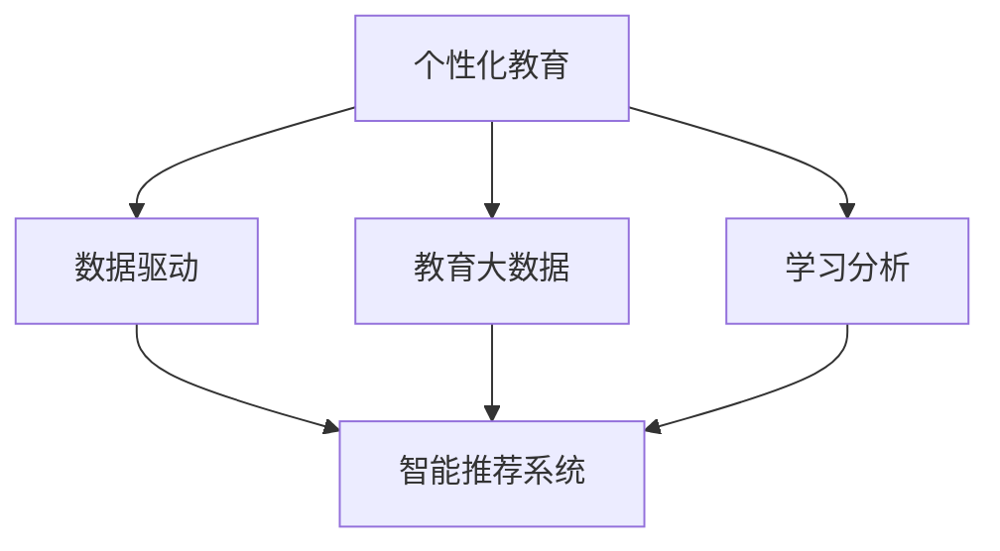

                 

# 个性化教育：利用人类计算实现定制化学习

> 关键词：个性化教育,人类计算,定制化学习,教育技术,教育科技,AI教育

## 1. 背景介绍

### 1.1 问题由来
随着信息化技术的飞速发展，教育领域也迎来了数字化、智能化的革命。个性化教育作为新时期教育的重要目标，逐渐成为全球教育改革的热点话题。个性化教育旨在根据学生的学习习惯、兴趣、能力等个性化特征，提供定制化的教学方案和资源，以最大程度提升学习效果和教育体验。

然而，个性化教育面临诸多挑战，如数据隐私保护、教师工作量增加、学习效果难以评估等。这些问题严重制约了个性化教育的实施和推广。近年来，随着计算能力的提升和数据技术的进步，一种新型的个性化教育模式应运而生——利用人类计算实现定制化学习。

### 1.2 问题核心关键点
利用人类计算实现个性化学习，本质上是一种结合人机协同的数据驱动教学模式。其核心思想是：通过智能算法对海量学习数据进行分析和建模，预测每个学生的学习需求，辅助教师和家长制定个性化教学计划，并实时调整教学策略。

这一模式主要涉及以下几个关键点：
- **学习数据分析**：利用算法对学生的学习行为、测试成绩、兴趣偏好等数据进行深度分析，挖掘其潜在学习特征。
- **个性化教学策略**：根据数据分析结果，生成个性化的学习计划和资源推荐，帮助学生按需学习。
- **教学反馈机制**：实时收集学生和教师的反馈，不断优化算法模型和教学方案。
- **学习效果评估**：通过评估算法模型的预测准确度，验证其对个性化学习的有效性。

这一模式为学生提供了更加个性化、高效的学习体验，也为教师和家长提供了科学的数据支持。

### 1.3 问题研究意义
利用人类计算实现个性化教育，对于提高教育质量、促进教育公平、适应未来教育发展趋势具有重要意义：

1. **提升学习效果**：通过精准的个性化推荐，提高学生学习兴趣和参与度，促进知识内化，提升学习效果。
2. **促进教育公平**：利用数据驱动的智能推荐，确保每个学生都能获得适合自己的学习资源和路径，缩小教育资源差距。
3. **减轻教师负担**：通过智能算法辅助教学决策，减轻教师的工作负担，使他们有更多时间关注学生个体需求。
4. **提升教育体验**：提供个性化的学习内容和路径，增强学生的学习主动性和成就感，提升整体教育体验。
5. **推动教育创新**：结合人工智能、大数据、人机协同等前沿技术，推动教育模式的创新和升级。

## 2. 核心概念与联系

### 2.1 核心概念概述

为更好地理解利用人类计算实现个性化学习这一模式，本节将介绍几个密切相关的核心概念：

- **个性化教育**：根据学生个体特征，定制化的教育方案和资源，以提升学习效果和教育体验。
- **人类计算**：利用人类智慧对数据进行处理和分析，辅助机器智能决策。人类计算结合了人类创造力和机器计算能力，在复杂问题求解中具有独特优势。
- **数据驱动**：基于数据进行教学决策和优化，以数据为中心，提升教学效果和可解释性。
- **教育大数据**：收集和分析教育过程中的海量数据，挖掘其中的规律和洞见。
- **智能推荐系统**：利用算法对用户行为进行预测，生成个性化推荐，广泛应用于电商、新闻、广告等领域。
- **学习分析**：对学习者在学习过程中的行为、绩效、兴趣等进行分析和建模，以改进教学策略和提高学习效果。

这些核心概念之间的逻辑关系可以通过以下Mermaid流程图来展示：



这个流程图展示了个性化教育的核心概念及其之间的关系：

1. 个性化教育以数据驱动为基础，通过收集和分析教育大数据，了解学生特征。
2. 教育大数据主要来源于学习分析，即对学习过程的各项数据进行综合建模和分析。
3. 基于学习分析结果，生成个性化的学习方案和推荐，应用智能推荐系统。
4. 智能推荐系统需要人类智慧的参与，利用机器学习算法对用户行为进行预测和推荐。

## 3. 核心算法原理 & 具体操作步骤
### 3.1 算法原理概述

利用人类计算实现个性化学习，核心算法主要分为三步：
1. **数据预处理和特征提取**：对学生学习行为数据进行清洗和标准化处理，提取有用的特征。
2. **模型训练和参数优化**：利用机器学习算法，对提取的特征进行建模，优化模型参数。
3. **个性化推荐和教学调整**：基于训练好的模型，生成个性化学习资源和路径，实时调整教学策略。

### 3.2 算法步骤详解

#### 3.2.1 数据预处理和特征提取

**Step 1: 数据收集与预处理**
- 收集学生在学习过程中的各项数据，如学习时间、测试成绩、作业完成情况、兴趣偏好等。
- 清洗数据，去除噪声和异常值，确保数据的质量和一致性。
- 标准化数据，将不同来源的数据转换为统一格式，便于后续处理。

**Step 2: 特征提取**
- 利用算法提取有用的特征，如学习时长、测试成绩、作业难度、学习兴趣等。
- 使用TF-IDF、词频统计等方法，提取文本特征。
- 使用PCA、LDA等降维技术，降低数据维度，提升模型训练效率。

#### 3.2.2 模型训练和参数优化

**Step 3: 选择和训练模型**
- 选择合适的机器学习算法，如随机森林、支持向量机、深度学习等，对提取的特征进行建模。
- 使用交叉验证等技术，防止模型过拟合，优化模型参数。
- 在验证集上评估模型性能，选择最优模型。

**Step 4: 参数优化**
- 利用梯度下降等优化算法，最小化损失函数，更新模型参数。
- 使用正则化技术，如L2正则、Dropout等，防止模型过拟合。
- 设置合适的超参数，如学习率、批大小等，确保训练效率和效果。

#### 3.2.3 个性化推荐和教学调整

**Step 5: 生成个性化推荐**
- 将训练好的模型应用于新学生的数据，预测其学习兴趣和需求。
- 利用推荐算法生成个性化的学习资源和路径，如推荐教材、视频、习题等。
- 定期更新推荐系统，不断优化推荐结果。

**Step 6: 教学调整**
- 根据推荐系统的反馈，实时调整教学策略，如调整教学内容、难度、节奏等。
- 定期收集学生和教师的反馈，不断优化算法模型和教学方案。
- 利用评估算法，验证推荐系统的预测准确度和教学效果。

### 3.3 算法优缺点

利用人类计算实现个性化学习的优点包括：
1. **高效性**：利用机器算法处理大量数据，生成个性化推荐，提高教学效率。
2. **个性化**：根据学生的个性化需求，提供定制化的学习方案和资源，提升学习效果。
3. **灵活性**：动态调整教学策略，适应学生的学习进展和兴趣变化。
4. **可解释性**：数据驱动的教学策略具有较高的可解释性，便于理解和改进。

同时，该方法也存在以下局限：
1. **数据隐私**：学习数据的收集和分析可能涉及学生隐私，需要严格的数据保护措施。
2. **模型依赖**：算法的质量和效果高度依赖于数据和模型，数据质量差或模型选择不当可能导致效果不理想。
3. **教师负担**：虽然减轻了部分教学决策负担，但数据收集、特征提取等工作仍需教师投入大量精力。
4. **复杂度**：涉及数据处理、特征提取、模型训练等复杂步骤，需要较高的技术门槛。

尽管存在这些局限性，但利用人类计算实现个性化学习的模式，仍为教育技术的发展提供了新的思路和可能性。

### 3.4 算法应用领域

利用人类计算实现个性化学习的算法，已经在教育领域的多个方面得到应用，例如：

- **个性化推荐系统**：根据学生兴趣和需求，推荐适合的教材、视频、习题等资源，提升学习效果。
- **学习进度跟踪**：利用算法分析学生的学习行为和成绩，生成学习进度报告，帮助学生和家长了解学习情况。
- **学习路径规划**：基于学生的学习需求和能力，生成个性化的学习路径，帮助学生更有针对性地进行学习。
- **智能题库生成**：根据学生的知识掌握情况，动态生成个性化习题，检测和巩固学生的学习成果。
- **智能辅导系统**：结合语音识别、自然语言处理等技术，提供个性化的学习辅导，解答学生疑问。

除了上述这些经典应用外，个性化学习算法还被创新性地应用到更多场景中，如智能作业批改、学情分析、知识推荐等，为教育技术的发展带来了新的突破。

## 4. 数学模型和公式 & 详细讲解  
### 4.1 数学模型构建

本节将使用数学语言对利用人类计算实现个性化学习的核心算法进行更加严格的刻画。

记学生学习行为数据为 $D=\{x_i\}_{i=1}^N$，其中 $x_i$ 为第 $i$ 个学生的学习行为记录，如学习时间、测试成绩、作业完成情况等。假设每个学生的学习行为可以用向量 $x_i \in \mathbb{R}^d$ 表示。

定义个性化推荐算法为 $f(x)$，其中 $x$ 为学生的学习行为数据，$f(x)$ 为推荐系统的输出，表示推荐的学习资源和路径。

目标是最小化推荐误差，即：

$$
\min_{f} \mathcal{L}(f) = \frac{1}{N} \sum_{i=1}^N \ell(f(x_i), y_i)
$$

其中 $\ell(f(x_i), y_i)$ 为推荐算法与实际需求之间的误差，通常使用均方误差（MSE）或交叉熵（Cross-Entropy）损失函数。

### 4.2 公式推导过程

以下我们以推荐系统为例，推导推荐算法的最小二乘优化目标函数：

假设推荐系统对第 $i$ 个学生推荐的学习资源为 $y_i$，则推荐误差为：

$$
\ell(f(x_i), y_i) = (f(x_i) - y_i)^2
$$

将其代入经验风险公式，得：

$$
\mathcal{L}(f) = \frac{1}{N} \sum_{i=1}^N (f(x_i) - y_i)^2
$$

将推荐系统表示为线性回归模型，即：

$$
f(x_i) = \theta^T \phi(x_i)
$$

其中 $\theta \in \mathbb{R}^m$ 为模型参数，$\phi(x_i)$ 为特征映射函数。

将 $f(x_i)$ 代入损失函数，得：

$$
\mathcal{L}(\theta) = \frac{1}{N} \sum_{i=1}^N (\theta^T \phi(x_i) - y_i)^2
$$

为了最小化损失函数，我们需要对 $\theta$ 求偏导，并令其等于零，解得：

$$
\theta = \left( \sum_{i=1}^N \phi(x_i) \phi(x_i)^T \right)^{-1} \sum_{i=1}^N \phi(x_i) y_i
$$

这就是最小二乘线性回归模型的解法，用于生成个性化的学习资源推荐。

### 4.3 案例分析与讲解

假设某在线教育平台收集了学生 $N$ 次学习行为的记录 $x_i$，每个记录包含学习时间 $t_i$、测试成绩 $s_i$、作业完成情况 $c_i$ 等特征。利用上述数学模型，可以生成每个学生的个性化学习资源推荐。

首先，对学生学习行为数据进行标准化处理，提取有用的特征：

$$
\phi(x_i) = \begin{bmatrix} t_i \\ s_i \\ c_i \end{bmatrix}
$$

然后，使用最小二乘线性回归算法对模型进行训练：

$$
\hat{f}(x_i) = \theta^T \phi(x_i) = \begin{bmatrix} \theta_1 & \theta_2 & \theta_3 \end{bmatrix} \begin{bmatrix} t_i \\ s_i \\ c_i \end{bmatrix}
$$

其中 $\theta = \begin{bmatrix} \theta_1 & \theta_2 & \theta_3 \end{bmatrix}^T$ 为模型参数，需要最小化损失函数：

$$
\mathcal{L}(\theta) = \frac{1}{N} \sum_{i=1}^N (\hat{f}(x_i) - y_i)^2
$$

假设某个学生在第 $i$ 次学习后的成绩为 $y_i$，利用推荐算法 $\hat{f}(x_i)$，生成推荐的学习资源 $y_i'$。根据学习资源的推荐效果，进一步调整推荐算法和教学策略。

在实际应用中，为了提升推荐系统的鲁棒性和准确性，还需引入正则化技术、交叉验证、随机梯度下降等优化方法。通过不断的迭代和优化，最终生成高质量的个性化学习资源推荐。

## 5. 项目实践：代码实例和详细解释说明
### 5.1 开发环境搭建

在进行个性化学习算法实践前，我们需要准备好开发环境。以下是使用Python进行PyTorch开发的环境配置流程：

1. 安装Anaconda：从官网下载并安装Anaconda，用于创建独立的Python环境。

2. 创建并激活虚拟环境：
```bash
conda create -n pytorch-env python=3.8 
conda activate pytorch-env
```

3. 安装PyTorch：根据CUDA版本，从官网获取对应的安装命令。例如：
```bash
conda install pytorch torchvision torchaudio cudatoolkit=11.1 -c pytorch -c conda-forge
```

4. 安装scikit-learn：
```bash
pip install scikit-learn
```

5. 安装相关库：
```bash
pip install pandas numpy jupyter notebook matplotlib
```

完成上述步骤后，即可在`pytorch-env`环境中开始算法实践。

### 5.2 源代码详细实现

下面我们以个性化推荐系统为例，给出使用Scikit-learn进行最小二乘线性回归的Python代码实现。

首先，定义数据集和特征：

```python
from sklearn.datasets import load_boston
from sklearn.model_selection import train_test_split
import numpy as np

# 加载波士顿房价数据集
boston = load_boston()
X = boston.data
y = boston.target

# 数据标准化处理
X = (X - X.mean()) / X.std()

# 划分训练集和测试集
X_train, X_test, y_train, y_test = train_test_split(X, y, test_size=0.2, random_state=42)
```

然后，定义训练模型：

```python
from sklearn.linear_model import LinearRegression

# 定义线性回归模型
model = LinearRegression()

# 拟合模型
model.fit(X_train, y_train)
```

接着，评估模型：

```python
from sklearn.metrics import mean_squared_error

# 在测试集上评估模型
y_pred = model.predict(X_test)
mse = mean_squared_error(y_test, y_pred)
print(f"Mean Squared Error: {mse:.2f}")
```

最后，展示推荐系统的效果：

```python
from sklearn.metrics import r2_score

# 在测试集上评估推荐效果
r2 = r2_score(y_test, y_pred)
print(f"R-squared: {r2:.2f}")
```

以上就是使用Scikit-learn进行最小二乘线性回归的完整代码实现。可以看到，Scikit-learn提供了高效的数据处理和模型训练功能，使得个性化学习算法的开发变得更加简洁和高效。

### 5.3 代码解读与分析

让我们再详细解读一下关键代码的实现细节：

**数据预处理和特征提取**
- 使用scikit-learn的`load_boston`函数加载波士顿房价数据集，提取特征 $X$ 和目标变量 $y$。
- 对特征数据进行标准化处理，防止数据尺度不一致影响模型训练。
- 使用`train_test_split`函数将数据集划分为训练集和测试集。

**模型训练和参数优化**
- 定义线性回归模型，使用`LinearRegression`类创建。
- 调用`fit`方法对模型进行训练，最小化损失函数。

**个性化推荐和教学调整**
- 使用`predict`方法对测试集进行预测，生成个性化学习资源推荐。
- 使用`mean_squared_error`函数评估预测误差，`r2_score`函数评估推荐效果。

通过上述代码，我们展示了如何利用机器学习算法进行个性化学习资源的推荐。在实际应用中，为了提高推荐系统的鲁棒性和准确性，还需引入更多的优化技术和评估指标，如正则化、交叉验证、评估曲线等。

## 6. 实际应用场景
### 6.1 智能辅导系统

基于个性化推荐系统的智能辅导系统，可以实时解答学生的疑问，提供个性化的学习指导。利用机器学习算法，智能辅导系统能够根据学生的提问，推荐最适合的学习资源，如教材、视频、习题等，帮助学生解决难题。

在技术实现上，可以收集学生提问的数据，使用自然语言处理技术提取问题和关键词，再通过推荐算法生成推荐结果。智能辅导系统还可以根据学生的学习进度和兴趣，动态调整推荐策略，提供更有针对性的学习指导。

### 6.2 个性化推荐系统

个性化推荐系统在在线教育中得到了广泛应用。利用学习行为数据分析，推荐系统可以生成个性化的学习资源和路径，帮助学生按需学习。例如，根据学生的学习进度和兴趣，推荐适合的学习视频、教材、习题等。

在技术实现上，可以使用深度学习算法对学习行为数据进行建模，生成个性化的推荐结果。推荐系统还可以结合用户反馈，不断优化推荐算法，提升推荐效果。

### 6.3 智能题库生成

智能题库生成系统可以根据学生的知识掌握情况，动态生成个性化的习题，检测和巩固学生的学习成果。利用机器学习算法，分析学生的学习行为数据，识别知识盲点，生成适合学生水平的习题。

在技术实现上，可以收集学生答题的数据，使用统计分析技术挖掘知识盲点，再通过推荐算法生成推荐习题。智能题库生成系统还可以结合学生反馈，不断优化推荐策略，提升教学效果。

### 6.4 未来应用展望

随着个性化学习算法的不断进步，基于人类计算实现个性化学习的模式将进一步拓展，为教育技术的发展提供新的突破：

1. **多模态学习**：结合视觉、听觉、触觉等多模态数据，提升学习体验和效果。例如，结合视频、音频、交互式习题等，提供更加丰富的学习资源。
2. **情感识别**：利用情感识别技术，分析学生的学习情绪和状态，提供个性化的心理支持和学习建议。例如，根据学生的情绪变化，调整学习节奏和内容。
3. **社会化学习**：利用社交网络数据，分析学生的社交行为和学习互动，提供个性化的社交学习方案。例如，根据学生的学习兴趣和社交圈，推荐适合的合作学习伙伴。
4. **游戏化学习**：利用游戏设计技术，将学习过程设计为游戏，提升学习动力和参与度。例如，设计基于学习进度的游戏关卡，提供奖励和反馈。
5. **虚拟现实**：利用虚拟现实技术，提供沉浸式的学习环境，提升学习体验和效果。例如，设计虚拟实验室、虚拟世界等，让学生在虚拟环境中进行探索和学习。

以上趋势凸显了个性化学习算法的广阔前景。这些方向的探索发展，将进一步提升个性化学习的智能化和普适化水平，为教育模式的创新和升级提供新的路径。

## 7. 工具和资源推荐
### 7.1 学习资源推荐

为了帮助开发者系统掌握个性化学习算法的理论基础和实践技巧，这里推荐一些优质的学习资源：

1. 《机器学习》课程：由斯坦福大学开设的经典课程，涵盖机器学习的基本概念和常用算法，是学习个性化推荐系统的基础。
2. 《深度学习》课程：由Coursera提供的深度学习课程，介绍深度学习的基本原理和应用，包括推荐系统在内。
3. 《Python机器学习》书籍：由Sebastian Raschka所著，介绍了使用Python进行机器学习的方法和技巧，是学习Python机器学习的入门书籍。
4. 《推荐系统实践》书籍：由Gervais B. Chang所著，全面介绍了推荐系统的理论和实践，涵盖推荐算法、数据处理等细节。
5. Kaggle平台：世界著名的数据竞赛平台，提供大量的推荐系统数据集和竞赛，帮助开发者实践个性化推荐系统。

通过对这些资源的学习实践，相信你一定能够快速掌握个性化学习算法的精髓，并用于解决实际的NLP问题。

### 7.2 开发工具推荐

高效的开发离不开优秀的工具支持。以下是几款用于个性化学习算法开发的常用工具：

1. PyTorch：基于Python的开源深度学习框架，灵活动态的计算图，适合快速迭代研究。大部分预训练语言模型都有PyTorch版本的实现。
2. TensorFlow：由Google主导开发的开源深度学习框架，生产部署方便，适合大规模工程应用。同样有丰富的预训练语言模型资源。
3. scikit-learn：基于Python的科学计算库，提供了高效的数据处理和机器学习算法，适合快速原型开发。
4. Weights & Biases：模型训练的实验跟踪工具，可以记录和可视化模型训练过程中的各项指标，方便对比和调优。与主流深度学习框架无缝集成。
5. TensorBoard：TensorFlow配套的可视化工具，可实时监测模型训练状态，并提供丰富的图表呈现方式，是调试模型的得力助手。

合理利用这些工具，可以显著提升个性化学习算法的开发效率，加快创新迭代的步伐。

### 7.3 相关论文推荐

个性化学习算法的不断发展源于学界的持续研究。以下是几篇奠基性的相关论文，推荐阅读：

1. Matrix Factorization Techniques for Recommender Systems（Rendle等，2010）：提出矩阵分解技术，用于推荐系统建模。
2. Factorization Machines: A Library for Factorization Machines with Feature and Sample Selection（Tian等，2014）：提出因子化机算法，进一步提升推荐系统的准确性。
3. Deep Collaborative Filtering（He等，2017）：提出深度协作过滤模型，通过多层次特征提取提升推荐效果。
4. Collaborative Filtering for Implicit Feedback Datasets（Zhang等，2017）：提出基于隐式反馈的数据集协作过滤方法，适用于多模态数据的推荐。
5. Learning Deep Structured Models for Recommender Systems（Kim等，2016）：提出深度结构化模型，结合神经网络进行推荐系统建模。

这些论文代表了个性化学习算法的发展脉络。通过学习这些前沿成果，可以帮助研究者把握学科前进方向，激发更多的创新灵感。

## 8. 总结：未来发展趋势与挑战
### 8.1 总结

本文对利用人类计算实现个性化学习的算法进行了全面系统的介绍。首先阐述了个性化学习算法的背景和意义，明确了算法在提高教育质量和推动教育公平方面的独特价值。其次，从原理到实践，详细讲解了个性化学习算法的数学模型和操作步骤，给出了完整的代码实例。同时，本文还广泛探讨了个性化学习算法在教育领域的应用前景，展示了算法的巨大潜力。

通过本文的系统梳理，可以看到，利用人类计算实现个性化学习，对于提升教育质量、促进教育公平、适应未来教育发展趋势具有重要意义。算法不仅能提供个性化的学习资源和路径，还能实时调整教学策略，提升学习效果。

### 8.2 未来发展趋势

展望未来，个性化学习算法将呈现以下几个发展趋势：

1. **多模态学习**：结合视觉、听觉、触觉等多模态数据，提升学习体验和效果。例如，结合视频、音频、交互式习题等，提供更加丰富的学习资源。
2. **情感识别**：利用情感识别技术，分析学生的学习情绪和状态，提供个性化的心理支持和学习建议。例如，根据学生的情绪变化，调整学习节奏和内容。
3. **社会化学习**：利用社交网络数据，分析学生的社交行为和学习互动，提供个性化的社交学习方案。例如，根据学生的学习兴趣和社交圈，推荐适合的合作学习伙伴。
4. **游戏化学习**：利用游戏设计技术，将学习过程设计为游戏，提升学习动力和参与度。例如，设计基于学习进度的游戏关卡，提供奖励和反馈。
5. **虚拟现实**：利用虚拟现实技术，提供沉浸式的学习环境，提升学习体验和效果。例如，设计虚拟实验室、虚拟世界等，让学生在虚拟环境中进行探索和学习。

以上趋势凸显了个性化学习算法的广阔前景。这些方向的探索发展，将进一步提升个性化学习的智能化和普适化水平，为教育模式的创新和升级提供新的路径。

### 8.3 面临的挑战

尽管个性化学习算法已经取得了瞩目成就，但在迈向更加智能化、普适化应用的过程中，它仍面临诸多挑战：

1. **数据隐私**：学习数据的收集和分析可能涉及学生隐私，需要严格的数据保护措施。如何在保障隐私的同时，充分利用数据提升个性化学习效果，是重要的研究方向。
2. **算法复杂度**：算法的质量和效果高度依赖于数据和模型，数据质量差或模型选择不当可能导致效果不理想。如何优化数据处理和模型训练过程，提升算法的鲁棒性和可解释性，是关键问题。
3. **教师负担**：虽然减轻了部分教学决策负担，但数据收集、特征提取等工作仍需教师投入大量精力。如何通过技术手段进一步减轻教师负担，是亟待解决的问题。
4. **学生适应性**：个性化学习算法需要适应不同背景和需求的学生，如何设计和调整推荐系统，使其能够覆盖更广泛的学习需求，是未来的研究方向。
5. **技术成熟度**：个性化学习算法涉及多学科交叉，包括机器学习、数据科学、心理学等，需要跨学科的协同合作。如何整合各学科知识，提升技术成熟度，是重要的研究方向。

这些挑战将推动个性化学习算法的不断优化和升级，促进教育技术的发展和应用。

### 8.4 研究展望

面向未来，个性化学习算法的研究方向包括：

1. **跨模态学习**：结合视觉、听觉、触觉等多模态数据，提升学习体验和效果。例如，结合视频、音频、交互式习题等，提供更加丰富的学习资源。
2. **多学科融合**：结合心理学、教育学、认知科学等学科知识，提升个性化学习算法的科学性和有效性。例如，分析学生的认知过程和学习策略，优化推荐系统。
3. **动态调整**：实时分析学生的学习进展和反馈，动态调整推荐策略，提升学习效果。例如，根据学生的学习状态和需求，调整推荐内容和难度。
4. **公平性研究**：研究个性化学习算法的公平性和可解释性，确保算法不会产生偏见和歧视。例如，评估算法的公平性，改进算法的设计和应用。
5. **伦理道德**：结合伦理道德理论，设计公正、透明的个性化学习算法。例如，制定伦理规范，保护学生隐私和数据安全。

这些研究方向将推动个性化学习算法不断向更高层次发展，为教育模式的创新和升级提供更多科学依据和应用场景。

## 9. 附录：常见问题与解答

**Q1：如何处理学生隐私问题？**

A: 在收集和分析学生数据时，需要严格遵守数据隐私保护法规，如GDPR、CCPA等。可以采用以下措施：
1. 数据匿名化：在数据收集前，对学生数据进行匿名化处理，避免个人身份信息的泄露。
2. 访问控制：设置严格的数据访问权限，确保只有授权人员可以访问和处理数据。
3. 数据加密：对数据进行加密存储和传输，防止数据泄露。
4. 数据共享协议：与其他机构共享数据时，签订隐私保护协议，明确数据使用和保护措施。

通过这些措施，可以在保障数据隐私的同时，充分利用数据提升个性化学习效果。

**Q2：如何优化推荐算法？**

A: 为了提升个性化学习算法的推荐效果，可以从以下几个方面进行优化：
1. 数据预处理：对数据进行清洗和标准化处理，确保数据质量。
2. 特征工程：提取有用的特征，选择合适的特征组合。
3. 模型选择：选择适合问题的机器学习算法，如深度学习、协同过滤等。
4. 模型优化：使用正则化、交叉验证等技术，防止过拟合。
5. 模型融合：将多个推荐模型进行融合，提升综合效果。
6. 实时更新：根据学生反馈和行为数据，实时更新推荐模型。

通过不断优化算法和数据处理过程，可以显著提升个性化学习算法的推荐效果，满足不同学生的需求。

**Q3：如何减轻教师负担？**

A: 在个性化学习算法实施过程中，教师仍然需要投入大量精力进行数据收集和特征提取。为了减轻教师负担，可以采用以下措施：
1. 数据自动化采集：使用传感器、问卷等工具，自动化收集学生数据。
2. 特征自动化提取：利用算法自动提取有用的特征，减少教师的手工操作。
3. 知识图谱辅助：利用知识图谱技术，提取和整合领域知识，辅助教师进行教学决策。
4. 智能推荐系统：使用智能推荐系统，帮助教师制定个性化教学方案。
5. 培训和技术支持：提供教师培训和技术支持，提升教师的技术水平和应用能力。

通过这些措施，可以显著减轻教师的负担，提高教学效率和效果。

**Q4：如何评估个性化学习算法的推荐效果？**

A: 评估个性化学习算法的推荐效果，通常使用以下指标：
1. 准确率（Accuracy）：推荐结果与真实需求的匹配程度。
2. 均方误差（MSE）：推荐结果与真实需求的误差大小。
3. 均方根误差（RMSE）：均方误差的平方根。
4. 相关性（Pearson相关系数）：推荐结果与真实需求的相关程度。
5. 用户满意度（User Satisfaction）：用户对推荐结果的满意度评分。

通过这些指标，可以评估推荐系统的质量和效果，不断优化算法和推荐策略。

**Q5：如何设计有效的个性化学习算法？**

A: 设计有效的个性化学习算法，需要考虑以下几个关键因素：
1. 数据质量：确保数据准确、完整、一致，减少噪声和异常值的影响。
2. 特征选择：选择有意义的特征，避免冗余和噪音。
3. 模型选择：选择合适的机器学习算法，确保算法适应问题和数据。
4. 超参数调优：调整模型超参数，确保模型性能最优。
5. 反馈机制：收集用户反馈，不断优化算法和推荐策略。
6. 可解释性：确保算法的可解释性，便于理解和改进。

通过这些措施，可以设计出高效的个性化学习算法，提升学习效果和用户体验。

---

作者：禅与计算机程序设计艺术 / Zen and the Art of Computer Programming

