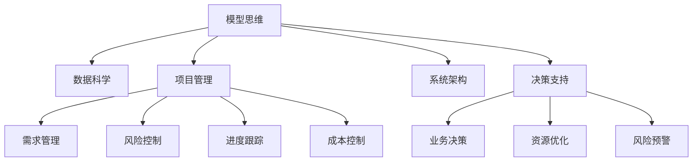

                 

# 丰富模型思维:增强管理者洞悉力

> 关键词：模型思维, 数据科学, 项目管理, 系统架构, 决策支持

## 1. 背景介绍

### 1.1 问题由来
在现代企业管理中，信息不对称和决策复杂性成为了管理层面临的主要挑战。传统的直觉和经验驱动的管理方式已经难以满足快速变化的市场需求。数据驱动决策成为了主流趋势，通过科学的方法和工具，帮助管理层进行数据洞察和模型分析，是提升企业竞争力的关键。

随着数据科学和人工智能技术的快速发展，模型思维逐渐成为企业决策支持的重要工具。管理者通过使用模型来预测市场趋势、优化资源配置、识别风险点，可以大幅提升决策的科学性和准确性。然而，模型思维的广泛应用也带来了新的挑战，如何构建和部署高质量的模型，如何解读模型的输出结果，如何持续优化和迭代模型，成为了企业需要解决的实际问题。

### 1.2 问题核心关键点
模型思维的核心在于通过数据和算法构建决策支持模型，利用历史数据和统计规律，预测未来趋势并辅助决策。模型思维的应用主要体现在以下方面：

- 风险评估：构建信用评分模型、市场风险评估模型等，辅助财务和业务风险管理。
- 业务优化：建立供应链优化模型、客户细分模型等，优化业务流程和资源配置。
- 客户洞察：开发客户行为预测模型、市场细分模型等，提升客户满意度和忠诚度。
- 产品定价：使用需求预测模型、成本分析模型等，制定科学的定价策略。

模型思维的成功应用需要满足以下关键点：
1. 数据质量：保证数据完整性、准确性和时效性。
2. 模型选择：根据业务需求选择合适的算法和模型。
3. 模型验证：对模型进行充分的验证和评估，确保其预测精度和稳定性。
4. 模型应用：将模型部署到实际业务场景，并提供简单易用的接口。
5. 模型迭代：根据业务变化和数据更新，持续优化和迭代模型。

## 2. 核心概念与联系

### 2.1 核心概念概述

为更好地理解模型思维在企业管理中的应用，本节将介绍几个关键概念：

- 模型思维：通过数据和算法构建决策支持模型，辅助管理决策的方法论。
- 数据科学：应用统计学、机器学习等方法，从数据中提取知识、洞察趋势的学科。
- 项目管理：通过计划、执行、监控和收尾等活动，控制项目范围、时间、成本和质量的过程。
- 系统架构：设计软件系统的整体结构和组件，确保系统可扩展、可维护和可重用。
- 决策支持：利用模型和数据提供决策建议，提升决策质量。

这些概念之间的联系通过以下Mermaid流程图展示：



这个流程图展示了几大关键概念及其相互关系：

1. 模型思维是数据科学在实际业务中的应用。
2. 项目管理通过需求管理、风险控制等活动，为数据科学和模型思维提供必要的支持。
3. 系统架构通过设计和部署模型应用系统，确保模型思维的成功实施。
4. 决策支持通过模型提供辅助决策，最终实现业务优化和风险控制。

## 3. 核心算法原理 & 具体操作步骤
### 3.1 算法原理概述

模型思维的核心在于构建和管理决策支持模型，其基本流程包括数据收集、模型构建、模型验证和模型应用。模型构建的算法主要包括以下几种：

- 回归模型：用于预测数值型变量，如线性回归、多项式回归等。
- 分类模型：用于分类预测，如逻辑回归、决策树、随机森林等。
- 聚类模型：用于发现数据中的自然分组，如K-Means、层次聚类等。
- 时间序列模型：用于时间趋势预测，如ARIMA、季节性分解、神经网络等。

这些模型通过拟合历史数据，学习出隐藏在数据背后的规律，并利用这些规律对未来进行预测和分析。

### 3.2 算法步骤详解

构建和部署决策支持模型的主要步骤如下：

**Step 1: 数据准备**
- 收集和清洗数据，包括数据完整性检查、缺失值处理、异常值检测等。
- 进行数据预处理，包括数据变换、特征提取和特征工程等。

**Step 2: 模型选择**
- 根据业务需求和数据特点，选择合适的模型算法。
- 考虑模型的复杂度、可解释性、预测精度等因素，选择合适的模型参数。

**Step 3: 模型训练**
- 将准备好的数据集分为训练集和验证集。
- 使用训练集对模型进行训练，调整模型参数。
- 使用验证集对模型进行验证，评估模型的预测精度和泛化能力。

**Step 4: 模型部署**
- 将训练好的模型部署到实际业务系统中，提供API接口或可视化界面。
- 根据业务需求设计数据输入和输出格式，确保模型的易用性和可扩展性。

**Step 5: 模型监控**
- 定期监测模型的预测精度和数据分布，及时发现模型异常。
- 根据业务变化和数据更新，持续优化和迭代模型。

**Step 6: 模型迭代**
- 定期重新训练模型，确保模型保持最新的预测能力。
- 根据新的业务需求和数据特性，调整模型算法和参数，提升模型性能。

### 3.3 算法优缺点

模型思维的优点在于其科学性和可量化性，能够提供决策的依据和支持，帮助管理层做出更加客观和准确的决策。其缺点在于模型的构建和部署需要较高的时间和资源投入，且模型的预测精度和稳定性受数据质量和算法选择的影响较大。

## 4. 数学模型和公式 & 详细讲解 & 举例说明

### 4.1 数学模型构建

模型思维的数学基础包括统计学和机器学习。这里以线性回归模型为例，展示模型的构建过程。

线性回归模型的目标是根据历史数据，构建一个线性函数，对未来数据进行预测。数学表达式为：

$$
y = \beta_0 + \beta_1 x_1 + \ldots + \beta_n x_n + \epsilon
$$

其中 $y$ 为预测值，$\beta_0, \beta_1, \ldots, \beta_n$ 为回归系数，$x_1, \ldots, x_n$ 为自变量，$\epsilon$ 为随机误差项。

### 4.2 公式推导过程

线性回归模型的参数估计通常采用最小二乘法。目标是最小化预测值与实际值之间的平方误差，即：

$$
\min_{\beta_0, \beta_1, \ldots, \beta_n} \sum_{i=1}^n (y_i - \beta_0 - \beta_1 x_{i1} - \ldots - \beta_n x_{in})^2
$$

求解上述最小化问题，得到回归系数的估计值：

$$
\hat{\beta} = (\sum_{i=1}^n x_i x_i^T)^{-1} \sum_{i=1}^n x_i y_i
$$

### 4.3 案例分析与讲解

以一家电商企业的销售额预测为例，展示线性回归模型的应用。

**案例背景**：一家电商平台希望预测未来季度的销售额，以优化库存和资源配置。

**数据准备**：收集过去一年的销售数据，包括月度销售额、促销活动次数、网站流量等。

**模型构建**：选择线性回归模型，以月度销售额为因变量，以促销次数和网站流量为自变量。

**模型训练**：使用过去一年的数据对模型进行训练，得到回归系数 $\hat{\beta}$。

**模型验证**：使用验证集对模型进行验证，评估预测精度和泛化能力。

**模型部署**：将训练好的模型部署到业务系统中，提供API接口，用于实时预测季度销售额。

**模型监控**：定期监测模型的预测精度和数据分布，根据实际情况进行调整。

**模型迭代**：根据新的业务数据和促销活动，重新训练模型，调整回归系数。

## 5. 项目实践：代码实例和详细解释说明

### 5.1 开发环境搭建

在进行模型实践前，我们需要准备好开发环境。以下是使用Python进行Scikit-Learn开发的环境配置流程：

1. 安装Anaconda：从官网下载并安装Anaconda，用于创建独立的Python环境。

2. 创建并激活虚拟环境：
```bash
conda create -n sklearn-env python=3.8 
conda activate sklearn-env
```

3. 安装Scikit-Learn：
```bash
conda install scikit-learn
```

4. 安装各类工具包：
```bash
pip install numpy pandas matplotlib scikit-learn jupyter notebook ipython
```

完成上述步骤后，即可在`sklearn-env`环境中开始模型实践。

### 5.2 源代码详细实现

下面我们以线性回归模型为例，给出使用Scikit-Learn库进行模型开发的PyTorch代码实现。

首先，定义数据处理函数：

```python
from sklearn.datasets import load_boston
from sklearn.model_selection import train_test_split
import pandas as pd
import numpy as np

def prepare_data():
    # 加载波士顿房价数据集
    boston = load_boston()
    X = pd.DataFrame(boston.data, columns=boston.feature_names)
    y = pd.Series(boston.target)
    
    # 数据标准化
    X_scaled = (X - X.mean()) / X.std()
    
    # 划分训练集和验证集
    X_train, X_val, y_train, y_val = train_test_split(X_scaled, y, test_size=0.2, random_state=42)
    
    return X_train, X_val, y_train, y_val
```

然后，定义模型和训练函数：

```python
from sklearn.linear_model import LinearRegression

def train_model(X_train, y_train):
    # 初始化线性回归模型
    model = LinearRegression()
    
    # 模型训练
    model.fit(X_train, y_train)
    
    return model
```

最后，启动模型训练流程：

```python
X_train, X_val, y_train, y_val = prepare_data()
model = train_model(X_train, y_train)

# 模型评估
print("R-squared score: {:.2f}".format(model.score(X_val, y_val)))
```

以上就是使用Scikit-Learn对波士顿房价数据集进行线性回归模型训练的完整代码实现。可以看到，利用Scikit-Learn库，模型构建的代码实现非常简洁高效。

### 5.3 代码解读与分析

让我们再详细解读一下关键代码的实现细节：

**prepare_data函数**：
- 加载波士顿房价数据集，并进行数据标准化。
- 划分训练集和验证集，返回模型所需的训练集、验证集、标签和验证集标签。

**train_model函数**：
- 初始化线性回归模型。
- 使用训练集数据对模型进行训练，返回训练好的模型。

**模型训练流程**：
- 准备数据集。
- 在训练集上训练模型，输出模型评估指标。

可以看到，Scikit-Learn库提供了一套完整的模型构建和训练流程，大大简化了模型开发的复杂度。开发者可以更加专注于业务逻辑和算法选择，而不必过多关注底层实现细节。

当然，工业级的系统实现还需考虑更多因素，如模型的保存和部署、超参数的自动搜索、更灵活的模型适配层等。但核心的模型构建和训练流程基本与此类似。

## 6. 实际应用场景
### 6.1 电商销售预测

基于线性回归模型，电商企业可以预测未来季度的销售额，优化库存和资源配置。具体而言，可以将历史销售数据、促销活动次数、网站流量等数据输入模型，得到未来季度的预测销售额。在实际应用中，可以定期更新模型，确保预测的准确性和时效性。

### 6.2 金融风险评估

金融行业需要评估贷款申请者的信用风险，以控制贷款损失。使用线性回归模型，可以根据历史贷款数据、申请人信息等数据，预测贷款违约概率。模型输出的信用评分可以作为贷款审批和定价的重要依据。

### 6.3 营销效果分析

市场营销部门需要评估广告投放的效果，以优化投放策略。使用线性回归模型，可以根据广告点击率、转化率等数据，预测广告的转化效果。通过模型输出的预测效果，可以评估不同广告渠道和策略的优劣，指导未来的广告投放。

### 6.4 未来应用展望

随着模型思维的广泛应用，未来的商业决策将更加数据驱动和科学化。模型思维的应用将涵盖更多的行业和场景，带来更加深刻的商业洞察和优化。

在智慧医疗领域，模型思维可以用于患者病情预测、药物效果评估等，提高医疗决策的科学性和精准性。

在智能制造领域，模型思维可以用于设备故障预测、生产效率优化等，提升制造业的自动化和智能化水平。

在智能交通领域，模型思维可以用于交通流量预测、安全预警等，提高交通系统的安全性、高效性和智能化。

总之，模型思维将在各个行业带来深刻的变革，成为推动智能经济和智慧社会的重要工具。未来，随着数据量的不断增长和算法技术的不断进步，模型思维的应用将更加广泛和深入，为人类社会带来更多的福祉和进步。

## 7. 工具和资源推荐
### 7.1 学习资源推荐

为了帮助开发者系统掌握模型思维的理论基础和实践技巧，这里推荐一些优质的学习资源：

1. 《数据科学与机器学习》系列书籍：由国内外知名专家合著，系统介绍了数据科学和机器学习的原理、算法和应用。

2. 《机器学习实战》书籍：适合初学者，通过丰富的实例代码，展示机器学习模型的构建和应用。

3. Coursera《机器学习》课程：由斯坦福大学教授Andrew Ng主讲，系统介绍机器学习的基本概念和经典算法。

4. Kaggle竞赛平台：提供大量真实数据集和竞赛题目，通过实践提高模型构建和调参能力。

5. GitHub开源项目：许多企业将内部项目开放为开源，通过阅读和参与开源项目，学习优秀的模型实践经验。

通过对这些资源的学习实践，相信你一定能够快速掌握模型思维的核心内容，并用于解决实际的商业问题。
###  7.2 开发工具推荐

高效的开发离不开优秀的工具支持。以下是几款用于模型思维开发的常用工具：

1. Scikit-Learn：基于Python的开源机器学习库，提供了丰富的模型算法和工具，适合快速迭代研究。

2. TensorFlow：由Google主导开发的开源机器学习框架，生产部署方便，适合大规模工程应用。

3. PyTorch：基于Python的开源深度学习框架，灵活动态的计算图，适合快速迭代研究。

4. Weights & Biases：模型训练的实验跟踪工具，可以记录和可视化模型训练过程中的各项指标，方便对比和调优。

5. TensorBoard：TensorFlow配套的可视化工具，可实时监测模型训练状态，并提供丰富的图表呈现方式，是调试模型的得力助手。

6. Jupyter Notebook：交互式开发环境，支持Python代码的编写和执行，方便开发者进行模型实验和结果展示。

合理利用这些工具，可以显著提升模型思维开发的效率，加快创新迭代的步伐。

### 7.3 相关论文推荐

模型思维的发展源于学界的持续研究。以下是几篇奠基性的相关论文，推荐阅读：

1. Linear Regression: A Survey of Recent Advances: 综述了线性回归模型的最新进展和应用。

2. Ensemble Methods for Statistical Learning: 介绍了集成学习的基本原理和算法，包括随机森林、Adaboost等。

3. Machine Learning: 由Tom Mitchell编写的经典教材，系统介绍了机器学习的基本概念和算法。

4. Deep Learning: 由Ian Goodfellow等人合著，全面介绍了深度学习的基本原理和应用。

这些论文代表了大数据和人工智能技术的最新进展，通过学习这些前沿成果，可以帮助研究者把握学科前进方向，激发更多的创新灵感。

## 8. 总结：未来发展趋势与挑战

### 8.1 总结

本文对模型思维在企业管理中的应用进行了全面系统的介绍。首先阐述了模型思维在决策支持中的重要性，明确了模型思维在提升决策科学性方面的独特价值。其次，从原理到实践，详细讲解了模型思维的构建过程，给出了模型构建任务开发的完整代码实例。同时，本文还广泛探讨了模型思维在电商、金融、营销等多个行业领域的应用前景，展示了模型思维的广泛应用潜力。此外，本文精选了模型思维的相关学习资源，力求为读者提供全方位的技术指引。

通过本文的系统梳理，可以看到，模型思维在现代企业管理中的应用已经成为了一个重要的趋势，极大地提升了决策的科学性和准确性。未来，伴随数据量的不断增长和算法技术的不断进步，模型思维的应用将更加广泛和深入，为商业决策提供更加精准和有力的支持。

### 8.2 未来发展趋势

展望未来，模型思维的发展将呈现以下几个趋势：

1. 数据集成和融合：随着数据来源的多样化和复杂化，模型思维将更加注重数据的集成和融合，确保模型基于全面的数据进行决策。

2. 自适应和动态优化：模型思维将变得更加灵活和自适应，能够根据环境变化动态调整模型参数和算法，适应不同的业务场景和数据特性。

3. 深度学习和大数据：深度学习和大数据技术将成为模型思维的核心驱动，模型构建和训练将更加依赖数据量和模型复杂度。

4. 模型可解释性和透明化：随着业务复杂性和决策重要性的提升，模型的可解释性和透明化将成为重要的研究课题，确保模型的决策过程和结果可以被理解和信任。

5. 模型应用生态的构建：模型思维将更多地与其他技术进行融合，如区块链、物联网、人工智能等，构建跨领域的应用生态，推动商业模式的创新和发展。

这些趋势凸显了模型思维的广阔前景和应用潜力。未来，随着学界和产业界的共同努力，模型思维必将在各个行业带来更多的创新和变革。

### 8.3 面临的挑战

尽管模型思维已经取得了显著成果，但在迈向更加智能化、普适化应用的过程中，它仍面临诸多挑战：

1. 数据质量和隐私：高质量的数据是模型思维的基础，但数据的完整性、准确性和隐私保护始终是难题。如何获取、处理和保护数据，是一个重要的研究方向。

2. 模型复杂度和可解释性：模型复杂度越高，其可解释性和透明性越差，难以理解和信任。如何在模型复杂度和可解释性之间找到平衡，是一个重要的研究挑战。

3. 模型训练和部署成本：模型训练和部署需要高昂的计算资源和时间成本，如何降低成本、提高效率，是一个重要的研究课题。

4. 模型迭代和维护：模型需要定期重新训练和维护，以适应数据分布的变化。如何在模型迭代过程中保持预测精度和稳定性，是一个重要的研究方向。

5. 模型公平性和伦理：模型可能存在偏见和歧视，如何确保模型的公平性和伦理性，是一个重要的研究挑战。

6. 模型安全和防护：模型可能受到攻击和滥用，如何保护模型的安全性和防护性，是一个重要的研究方向。

这些挑战凸显了模型思维在实际应用中的复杂性和风险性，需要研究者不断探索和突破。

### 8.4 研究展望

面对模型思维面临的种种挑战，未来的研究需要在以下几个方面寻求新的突破：

1. 大数据和深度学习：通过大数据和深度学习技术，提升模型的预测精度和泛化能力，降低数据需求和模型复杂度。

2. 模型可解释性和透明化：引入因果分析和可解释性技术，增强模型输出的解释能力和透明性，提高决策的可信度。

3. 多模态数据融合：将文本、图像、语音等多模态数据进行融合，提升模型的感知能力和决策质量。

4. 模型安全性和防护：引入对抗生成网络和防御机制，提高模型的鲁棒性和防护性，确保模型的安全性。

5. 模型公平性和伦理：引入公平性约束和伦理导向的评估指标，过滤和惩罚有偏见、有害的输出倾向，确保模型的公平性和伦理性。

这些研究方向将推动模型思维技术的不断进步，为商业决策提供更加科学、可靠和可信任的支持。

## 9. 附录：常见问题与解答

**Q1：模型思维是否适用于所有商业场景？**

A: 模型思维在许多商业场景中都取得了成功，但也存在一些限制。例如，模型需要大量历史数据进行训练，对于新的商业模式或非结构化数据，模型可能难以适应。此外，模型预测结果的解释和理解需要业务专家的支持，对于某些领域，模型的应用可能需要特定知识和经验。

**Q2：如何评估模型的预测精度？**

A: 模型的预测精度可以通过多种指标进行评估，包括均方误差(MSE)、平均绝对误差(MAE)、R-squared等。通常使用验证集或测试集对模型进行评估，计算模型预测值与真实值之间的误差。

**Q3：如何优化模型参数？**

A: 模型参数的优化可以通过网格搜索、随机搜索、贝叶斯优化等方法进行。网格搜索和随机搜索在模型空间进行穷举搜索，找到最优参数组合；贝叶斯优化使用贝叶斯模型进行参数搜索，可以更快地找到最优解。

**Q4：模型部署需要注意哪些问题？**

A: 模型部署需要考虑模型保存、模型版本控制、模型接口设计等问题。使用版本控制工具如Git可以确保模型版本的管理，使用RESTful API接口可以方便地集成模型到业务系统中。

**Q5：如何处理模型偏差和误差？**

A: 模型偏差和误差可以通过数据清洗、特征选择、模型调整等方式进行缓解。例如，使用正则化技术可以降低模型的方差，使用集成学习技术可以提高模型的稳定性和泛化能力。

通过本文的系统梳理，可以看到，模型思维在现代企业管理中的应用已经成为一种重要的趋势，极大地提升了决策的科学性和准确性。未来，随着数据量的不断增长和算法技术的不断进步，模型思维的应用将更加广泛和深入，为商业决策提供更加精准和有力的支持。

