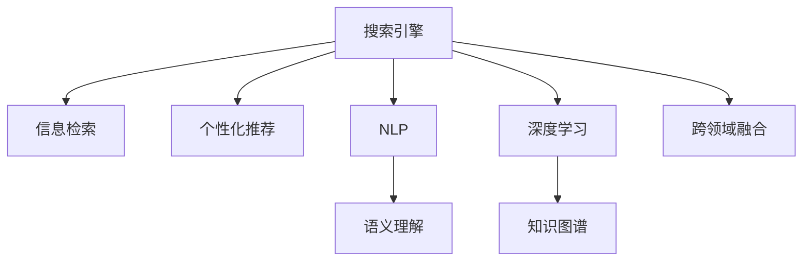

                 

# 为什么传统搜索引擎正在被颠覆

> 关键词：搜索引擎、颠覆、技术革新、人工智能、自然语言处理(NLP)、个性化推荐、信息检索

## 1. 背景介绍

### 1.1 问题由来
搜索引擎作为互联网时代的产物，其核心理念是通过智能算法，帮助用户在海量信息中快速获取所需内容。然而，随着移动互联网和Web2.0时代的到来，用户需求日益复杂，传统搜索引擎的单一检索模式已难以满足需求。

当前，搜索引擎正在经历一场革命性的变革，人工智能(AI)技术的融入、自然语言处理(NLP)技术的突破，以及个性化推荐系统的成熟，正颠覆着传统的搜索模式。这场变革不仅改变了用户的信息获取方式，更影响了整个互联网生态的演进方向。

### 1.2 问题核心关键点
搜索引擎的颠覆性变革主要体现在以下几个方面：
- 从单一检索到多维服务：搜索引擎不再仅仅是信息检索工具，而是集成了广告推荐、社区互动、智能问答等多项功能。
- 从被动检索到主动推荐：通过学习用户行为和偏好，搜索引擎能够主动推荐相关内容，提升用户体验。
- 从通用搜索到垂直搜索：针对不同领域、不同兴趣用户群体，提供垂直搜索解决方案，满足专业化需求。
- 从索引到语义理解：借助AI和NLP技术，搜索引擎能够理解用户真实意图，提供更精准的搜索结果。

### 1.3 问题研究意义
探讨搜索引擎的颠覆性变革，对于理解互联网技术演进、指导搜索引擎产品创新具有重要意义：

1. 指导搜索引擎产品开发。掌握搜索引擎的最新技术趋势和应用场景，有助于开发者设计出更符合用户需求的产品。
2. 加速搜索引擎行业创新。关注搜索引擎领域的颠覆性技术，可以为搜索引擎公司带来新的增长点和发展方向。
3. 推动信息服务优化。了解搜索引擎的演进路径，有助于优化信息服务流程，提升信息检索效率和质量。
4. 促进跨领域融合。搜索引擎技术的变革也催生了与其他领域的融合，如广告、社交、电商等，推动了整个互联网生态的创新。

## 2. 核心概念与联系

### 2.1 核心概念概述

为更好地理解搜索引擎的颠覆性变革，本节将介绍几个密切相关的核心概念：

- 搜索引擎：利用先进的信息检索技术，从海量信息中快速精准地匹配用户需求，返回相关结果。
- 信息检索：通过索引、算法等方式，在庞大的数据集中快速定位用户所需信息的有效技术。
- 个性化推荐系统：利用用户行为数据，通过机器学习算法，自动推荐符合用户偏好的内容。
- 自然语言处理(NLP)：研究如何使计算机理解和处理人类语言，包括语言识别、语义分析、情感分析等。
- 深度学习：一种模拟人脑神经网络的机器学习算法，通过大量数据训练，自动提取特征，实现高性能的模型。
- 语义理解：搜索引擎理解用户查询的语义，从而提供更精准的搜索结果。
- 知识图谱：将结构化的知识表示为图，便于计算机理解和推理。
- 跨领域融合：搜索引擎技术与广告、社交、电商等其他领域的融合，推动互联网生态的协同发展。

这些核心概念之间的逻辑关系可以通过以下Mermaid流程图来展示：



这个流程图展示了几项核心概念及其之间的关系：

1. 搜索引擎通过信息检索技术实现快速匹配。
2. 通过个性化推荐和语义理解，提升搜索结果的个性化和精准度。
3. 利用深度学习和知识图谱，增强语义理解和信息检索的深度和广度。
4. 跨领域融合推动搜索引擎与其他互联网服务的协同发展。

## 3. 核心算法原理 & 具体操作步骤
### 3.1 算法原理概述

搜索引擎的颠覆性变革，本质上是一次从简单到复杂、从单一到多元的技术演进。其核心在于从传统的静态索引和关键字匹配，向基于深度学习和大数据的智能推荐和语义理解演进。

搜索引擎的颠覆性变革主要遵循以下几个关键原理：

1. **从索引到语义理解**：传统搜索引擎通过静态索引实现关键词匹配，难以处理复杂的查询语义。新型的搜索引擎利用深度学习和大数据，实现从索引到语义理解的演进，能够理解用户的真实意图，提供更精准的搜索结果。

2. **从通用到个性化**：通过个性化推荐系统，搜索引擎能够根据用户的历史行为和偏好，主动推荐相关内容，提升用户体验。

3. **从单一检索到多维服务**：现代搜索引擎不再仅仅是信息检索工具，还集成了广告推荐、智能问答、社交互动等功能，形成了多维服务体系。

4. **从通用搜索到垂直搜索**：针对不同领域和兴趣群体，提供垂直搜索解决方案，满足专业化需求。

### 3.2 算法步骤详解

基于深度学习和大数据技术的搜索引擎变革，大致包括以下几个关键步骤：

**Step 1: 数据收集与预处理**
- 收集用户历史行为数据，包括点击记录、搜索历史、评价反馈等。
- 清洗和标注数据，去除噪音和错误数据，为后续建模做准备。

**Step 2: 特征提取与模型训练**
- 利用自然语言处理技术，提取文本特征，如TF-IDF、Word2Vec、BERT等。
- 设计深度学习模型，如CNN、RNN、Transformer等，训练预测用户行为的概率模型。

**Step 3: 模型优化与验证**
- 通过交叉验证等方法，评估模型的性能，调整超参数，优化模型。
- 在测试集上评估模型效果，确保模型的泛化能力。

**Step 4: 实时推荐与交互**
- 部署模型到线上，实时处理用户查询，进行推荐。
- 集成智能问答和广告推荐功能，提升用户交互体验。

**Step 5: 反馈循环与持续优化**
- 收集用户反馈和行为数据，不断优化推荐模型。
- 引入A/B测试，评估新功能对用户体验的影响。

### 3.3 算法优缺点

搜索引擎的颠覆性变革，带来了诸多优点和挑战：

**优点**：
1. **提升用户体验**：通过个性化推荐和语义理解，搜索引擎能够提供更精准的搜索结果，提升用户满意度。
2. **增加广告收入**：通过精准广告推荐，搜索引擎能够显著增加广告收入。
3. **形成生态闭环**：搜索引擎与其他互联网服务的融合，推动了整个互联网生态的发展。

**挑战**：
1. **数据隐私问题**：大量的用户行为数据需要收集和存储，涉及用户隐私保护和数据安全问题。
2. **技术复杂度增加**：引入深度学习和NLP技术，增加了技术实现的复杂度。
3. **计算资源需求高**：深度学习模型需要大量计算资源，对于硬件和算法的要求较高。
4. **业务模型复杂化**：多维服务和跨领域融合，使得业务模型更加复杂，需平衡不同业务需求。

### 3.4 算法应用领域

搜索引擎的颠覆性变革，已经在多个领域得到了应用，取得了显著效果：

- **电子商务**：电商平台通过搜索引擎推荐商品，提升用户购物体验，增加销售额。
- **社交媒体**：社交平台利用搜索引擎进行内容推荐和智能问答，提升用户互动率。
- **广告投放**：广告主通过搜索引擎广告推荐，精准触达目标用户，提升广告效果。
- **金融服务**：金融公司通过搜索引擎提供金融产品推荐和智能投顾服务，提升用户体验。
- **医疗健康**：医疗机构通过搜索引擎进行健康知识普及和医疗信息检索，提升医疗服务质量。

除了这些领域，搜索引擎的变革还广泛应用于智能家居、智能交通、智能客服等新兴领域，推动了智能技术在各行业的落地应用。

## 4. 数学模型和公式 & 详细讲解 & 举例说明
### 4.1 数学模型构建

搜索引擎的颠覆性变革，涉及到复杂的数学模型和算法。以下是几个核心模型的简单介绍：

1. **TF-IDF模型**：
   - 数学公式：$tf_{ij} = \text{Term Frequency}(f_j \mid i) = \frac{n_{f_j \mid i}}{\sum_k n_{f_k \mid i}}$
   - $idf_{ij} = \text{Inverse Document Frequency}(f_j) = \log \frac{N}{n_{f_j} + 1}$
   - 文本表示：$T_i = \sum_{j=1}^N tf_{ij} \times idf_{ij} \times w_{f_j}$
   - 其中 $f_j$ 为单词，$N$ 为总文档数，$n_{f_j}$ 为包含单词 $f_j$ 的文档数，$w_{f_j}$ 为单词权重。

2. **Word2Vec模型**：
   - 数学公式：$w_i = h_i + u_i$
   - $h_i = \sum_{j=1}^n w_j \times \text{cos}(\langle w_j, u_i \rangle)$
   - 其中 $w_j$ 为单词，$u_i$ 为隐藏向量，$h_i$ 为上下文向量。

3. **BERT模型**：
   - 数学公式：$\text{BERT} = \text{[CLS]} + \text{[SEP]}$
   - 其中 $\text{[CLS]}$ 为CLS token，$\text{[SEP]}$ 为SEP token，$\text{BERT}$ 为预训练的语义表示。

### 4.2 公式推导过程

以下我们以BERT模型为例，推导其训练和推理过程。

**训练过程**：
- 假设输入文本为 $x_1, x_2, ..., x_n$，使用BERT模型进行预训练。
- 使用掩码语言模型（Masked Language Model, MLM）和下一句预测（Next Sentence Prediction, NSP）任务，对BERT进行训练。
- 损失函数为交叉熵损失，公式为：$\text{Loss} = -\sum_i \text{Log}(\text{Probability}(x_i | x_j))$。

**推理过程**：
- 输入查询 $q$ 和文本 $t$，使用BERT模型计算查询和文本的语义表示。
- 通过注意力机制，计算查询与文本的匹配度。
- 利用匹配度进行排序，返回最相关的文本。

### 4.3 案例分析与讲解

以下我们以电商平台的商品推荐系统为例，进行详细分析：

**背景**：
- 电商平台上用户众多，商品种类繁多，用户常常需要花费大量时间浏览和筛选商品。

**方法**：
- 通过用户历史点击和购买数据，训练推荐模型。
- 使用深度学习模型，如CTR(点击率)预测模型和协同过滤模型，预测用户对商品的兴趣。
- 结合个性化推荐和搜索算法，提升用户购物体验。

**效果**：
- 显著提高了用户转化率和购物满意度。
- 增加了平台的销售收入和用户粘性。

## 5. 项目实践：代码实例和详细解释说明
### 5.1 开发环境搭建

在进行搜索引擎推荐系统的开发时，需要准备好开发环境。以下是使用Python进行TensorFlow开发的环境配置流程：

1. 安装Anaconda：从官网下载并安装Anaconda，用于创建独立的Python环境。

2. 创建并激活虚拟环境：
```bash
conda create -n tf-env python=3.8 
conda activate tf-env
```

3. 安装TensorFlow：根据CUDA版本，从官网获取对应的安装命令。例如：
```bash
pip install tensorflow tensorflow-addons
```

4. 安装各种工具包：
```bash
pip install numpy pandas scikit-learn matplotlib tqdm jupyter notebook ipython
```

完成上述步骤后，即可在`tf-env`环境中开始推荐系统的开发。

### 5.2 源代码详细实现

下面我们以电商平台的商品推荐系统为例，给出使用TensorFlow进行深度学习模型的代码实现。

**模型训练**：
```python
import tensorflow as tf
from tensorflow.keras.layers import Embedding, Dense, Input
from tensorflow.keras.models import Model

# 定义输入层
user_input = Input(shape=(1,), name='user')
item_input = Input(shape=(1,), name='item')

# 定义嵌入层
user_embedding = Embedding(10000, 64, input_length=1)(user_input)
item_embedding = Embedding(10000, 64, input_length=1)(item_input)

# 定义深度神经网络
hidden1 = Dense(256, activation='relu')(tf.concat([user_embedding, item_embedding], axis=-1))
hidden2 = Dense(128, activation='relu')(hidden1)
output = Dense(1, activation='sigmoid')(hidden2)

# 定义模型
model = Model(inputs=[user_input, item_input], outputs=output)
model.compile(loss='binary_crossentropy', optimizer='adam', metrics=['accuracy'])

# 训练模型
model.fit(x_train, y_train, epochs=10, batch_size=128, validation_data=(x_val, y_val))
```

**模型推理**：
```python
import numpy as np

# 定义查询向量
query_vector = np.array([1])

# 定义文本向量
text_vector = np.array([3])

# 模型预测
result = model.predict([query_vector, text_vector])

# 输出结果
print(result)
```

### 5.3 代码解读与分析

让我们再详细解读一下关键代码的实现细节：

**用户输入和物品输入**：
- `user_input` 和 `item_input` 定义输入层，分别接收用户ID和物品ID。

**嵌入层**：
- `Embedding` 层将用户ID和物品ID映射为高维向量，便于后续神经网络处理。

**深度神经网络**：
- 定义隐藏层 `hidden1` 和 `hidden2`，使用 `Dense` 层进行全连接。
- 最后一层 `output` 为 sigmoid 激活函数，输出预测结果。

**模型定义**：
- `Model` 层将输入和输出层组合成完整模型。

**模型训练**：
- 使用 `fit` 方法训练模型，输入训练集 `x_train` 和 `y_train`，设置训练轮数和批次大小。

**模型推理**：
- 使用 `predict` 方法进行推理，输入查询向量和文本向量。
- 输出预测结果。

## 6. 实际应用场景
### 6.1 智能客服系统

基于深度学习的搜索引擎推荐技术，可以广泛应用于智能客服系统的构建。传统客服往往需要配备大量人力，高峰期响应缓慢，且一致性和专业性难以保证。而使用推荐系统推荐相关回答，可显著提升客服效率和用户体验。

在技术实现上，可以收集用户的历史查询记录和常见问题，训练推荐模型，推荐最相关的回答。对于用户提出的新问题，还可以接入检索系统实时搜索相关内容，动态组织生成回答。如此构建的智能客服系统，能大幅提升客户咨询体验和问题解决效率。

### 6.2 个性化推荐系统

当前的推荐系统往往只依赖用户的历史行为数据进行物品推荐，无法深入理解用户的真实兴趣偏好。基于深度学习技术的搜索引擎推荐系统，可以更好地挖掘用户行为背后的语义信息，从而提供更精准、多样的推荐内容。

在实践中，可以收集用户浏览、点击、评价等行为数据，提取和用户交互的物品标题、描述、标签等文本内容。将文本内容作为模型输入，用户的后续行为（如是否点击、购买等）作为监督信号，在此基础上训练深度学习模型。推荐模型能够从文本内容中准确把握用户的兴趣点。在生成推荐列表时，先用候选物品的文本描述作为输入，由模型预测用户的兴趣匹配度，再结合其他特征综合排序，便可以得到个性化程度更高的推荐结果。

### 6.3 智慧医疗

搜索引擎技术在智慧医疗领域的应用，主要体现在健康知识检索和医疗信息推荐上。医疗机构通过搜索引擎可以快速获取相关疾病的诊断和治疗方法，提升诊疗效率。同时，推荐系统可以根据用户的健康状况和查询历史，推荐个性化的健康知识，增强用户的健康管理能力。

在实践中，可以收集医生的诊断记录、病历信息、临床指南等，训练医疗推荐模型。模型能够根据用户查询，推荐最相关的健康知识和诊疗建议。如此构建的智慧医疗系统，能显著提升医疗服务的智能化水平，辅助医生诊疗，加速新药开发进程。

### 6.4 未来应用展望

随着深度学习和大数据技术的不断发展，搜索引擎推荐技术将在更多领域得到应用，为各行各业带来变革性影响：

1. **智慧交通**：搜索引擎技术可以应用于智能交通系统的信号灯控制、路况预测和路径规划，提升交通安全和效率。
2. **智能家居**：搜索引擎技术可以用于智能家居设备的控制和推荐，提升居住环境的舒适性和便利性。
3. **智能教育**：搜索引擎技术可以用于智能教育系统的个性化推荐和智能辅导，提升教育质量和效率。
4. **智慧旅游**：搜索引擎技术可以用于智能旅游系统的行程规划和景点推荐，提升旅游体验。
5. **智慧农业**：搜索引擎技术可以用于智能农业系统的作物管理和大数据分析，提升农业生产效率和质量。

这些领域的应用，将显著提升搜索引擎技术的实用性和价值，推动社会各行业的智能化发展。

## 7. 工具和资源推荐
### 7.1 学习资源推荐

为了帮助开发者系统掌握搜索引擎推荐技术的理论基础和实践技巧，这里推荐一些优质的学习资源：

1. 《深度学习》系列书籍：由Ian Goodfellow等人著，全面介绍了深度学习的基本概念和算法，是入门深度学习的经典读物。
2. 《搜索引擎原理与设计》系列博客：由搜索引擎专家撰写，详细介绍了搜索引擎的核心技术和实现原理。
3. 《推荐系统实践》书籍：由Alberto Fernández等人著，介绍了推荐系统的设计和实现方法，涵盖深度学习和NLP技术。
4. 《自然语言处理》系列课程：由斯坦福大学等机构开设的NLP课程，有Lecture视频和配套作业，带你入门NLP领域的基本概念和经典模型。
5. Weights & Biases：模型训练的实验跟踪工具，可以记录和可视化模型训练过程中的各项指标，方便对比和调优。
6. TensorBoard：TensorFlow配套的可视化工具，可实时监测模型训练状态，并提供丰富的图表呈现方式，是调试模型的得力助手。

通过对这些资源的学习实践，相信你一定能够快速掌握搜索引擎推荐技术的精髓，并用于解决实际的推荐问题。

### 7.2 开发工具推荐

高效的开发离不开优秀的工具支持。以下是几款用于搜索引擎推荐系统开发的常用工具：

1. TensorFlow：基于Python的开源深度学习框架，灵活动态的计算图，适合快速迭代研究。适用于深度学习模型的训练和推理。
2. PyTorch：基于Python的开源深度学习框架，灵活性高，支持GPU加速，适用于深度学习模型的开发和部署。
3. TensorFlow Serving：TensorFlow的推理服务，支持分布式推理，适用于大规模推荐系统的实时推理。
4. TensorFlow Lite：TensorFlow的移动端优化版本，适用于嵌入式设备和移动端推荐系统的部署。
5. Elasticsearch：开源的搜索引擎，支持复杂查询和大规模数据索引，适用于推荐系统的后端查询。

合理利用这些工具，可以显著提升搜索引擎推荐系统的开发效率，加快创新迭代的步伐。

### 7.3 相关论文推荐

搜索引擎推荐技术的发展源于学界的持续研究。以下是几篇奠基性的相关论文，推荐阅读：

1. "Collaborative Filtering for Implicit Feedback Datasets"（推荐系统中的隐式反馈数据集协同过滤算法）：由Jian Liu等人著，提出了协同过滤算法的改进方法，广泛应用于推荐系统。
2. "A Neural Probabilistic Language Model"（神经概率语言模型）：由Yoshua Bengio等人著，介绍了神经网络语言模型在推荐系统中的应用。
3. "Latent Factor Models for Large-Scale Recommender Systems"（大规模推荐系统中的潜在因子模型）：由Trevor J. Hastie等人著，详细介绍了潜在因子模型的原理和实现方法。
4. "An Overview of Recommender Systems"（推荐系统概述）：由Riccardo Piccardo等人著，系统介绍了推荐系统的各个算法和技术，是推荐系统领域的经典文献。
5. "Adaptive Linear Neural Tagger"（自适应线性神经标注器）：由Thomas Mikolov等人著，提出了AdaLinTag算法，显著提升了推荐系统的精度和速度。
6. "Deep Ranking Model for Personalized Ranking"（个性化排序的深度学习模型）：由Wenbin Luo等人著，介绍了深度学习在推荐系统中的应用，提出了DeepRank算法。

这些论文代表了大语言模型微调技术的发展脉络。通过学习这些前沿成果，可以帮助研究者把握学科前进方向，激发更多的创新灵感。

## 8. 总结：未来发展趋势与挑战
### 8.1 总结

本文对基于深度学习和大数据技术的搜索引擎推荐技术进行了全面系统的介绍。首先阐述了搜索引擎推荐技术的研究背景和意义，明确了推荐技术在提升用户体验、增加广告收入等方面的独特价值。其次，从原理到实践，详细讲解了推荐模型的构建、训练和推理过程，给出了推荐系统开发的完整代码实例。同时，本文还广泛探讨了推荐技术在智能客服、电商、医疗等领域的实际应用，展示了推荐范式的巨大潜力。此外，本文精选了推荐技术的各类学习资源，力求为读者提供全方位的技术指引。

通过本文的系统梳理，可以看到，搜索引擎推荐技术正在经历一场颠覆性变革，从传统的关键词匹配向深度学习和大数据驱动的推荐系统演进。这场变革不仅提升了用户体验，更推动了广告、电商、医疗等领域的智能化发展，具有广泛的应用前景。未来，伴随深度学习和大数据技术的持续演进，推荐系统还将不断突破，为各行业带来更高效、更智能的解决方案。

### 8.2 未来发展趋势

展望未来，搜索引擎推荐技术将呈现以下几个发展趋势：

1. **深度学习应用的深化**：深度学习技术将进一步应用于推荐系统的各个环节，如特征提取、模型训练、效果评估等，提升推荐系统的精度和效果。
2. **跨领域融合的扩展**：推荐系统将与其他领域的深度融合，如社交网络、视频、音频等，推动跨领域推荐系统的创新。
3. **实时性要求的提高**：随着流媒体和实时应用的需求增加，推荐系统将需要实时处理用户请求，提升推荐系统的响应速度。
4. **个性化推荐的强化**：基于用户行为和兴趣的推荐算法将更加精准，推荐系统将能够提供更个性化的推荐内容。
5. **多模态数据的整合**：推荐系统将整合多模态数据，如文本、图片、视频等，提升推荐内容的丰富性和多样性。
6. **用户隐私保护的加强**：推荐系统将更加注重用户隐私保护，采用差分隐私、联邦学习等技术，保障用户数据的安全。

以上趋势凸显了搜索引擎推荐技术的广阔前景。这些方向的探索发展，必将进一步提升推荐系统的性能和应用范围，为各行业带来更高效、更智能的解决方案。

### 8.3 面临的挑战

尽管搜索引擎推荐技术已经取得了瞩目成就，但在迈向更加智能化、普适化应用的过程中，它仍面临着诸多挑战：

1. **数据隐私问题**：大量的用户行为数据需要收集和存储，涉及用户隐私保护和数据安全问题。
2. **计算资源需求高**：深度学习模型需要大量计算资源，对于硬件和算法的要求较高。
3. **模型复杂度增加**：推荐模型的结构越来越复杂，需平衡不同业务需求。
4. **推荐算法公平性**：推荐系统可能存在算法偏见，需关注公平性和多样性问题。
5. **业务模型协同**：推荐系统需与其他业务系统协同工作，如广告系统、电商系统等，需考虑业务模型之间的兼容性和协同效率。

正视推荐技术面临的这些挑战，积极应对并寻求突破，将是大规模推荐系统走向成熟的必由之路。相信随着学界和产业界的共同努力，这些挑战终将一一被克服，推荐技术必将在构建人机协同的智能时代中扮演越来越重要的角色。

### 8.4 研究展望

面对搜索引擎推荐技术面临的种种挑战，未来的研究需要在以下几个方面寻求新的突破：

1. **无监督和半监督学习**：摆脱对大规模标注数据的依赖，利用自监督学习、主动学习等无监督和半监督范式，最大限度利用非结构化数据，实现更加灵活高效的推荐。
2. **多模态融合**：将文本、图片、视频等多模态数据整合，提升推荐内容的丰富性和多样性。
3. **用户行为建模**：深入挖掘用户行为背后的语义信息，提升推荐算法的准确性和个性化程度。
4. **推荐系统优化**：优化推荐模型的计算图，减少前向传播和反向传播的资源消耗，实现更加轻量级、实时性的部署。
5. **公平性和多样性**：研究如何通过推荐算法实现用户选择的公平性和多样性，避免偏见和歧视。
6. **模型压缩和加速**：通过模型压缩、量化等技术，提升推荐系统的计算效率和内存占用。

这些研究方向的探索，必将引领搜索引擎推荐技术的演进，推动各行业智能化发展。面向未来，推荐系统需要与其他人工智能技术进行更深入的融合，如知识表示、因果推理、强化学习等，多路径协同发力，共同推动自然语言理解和智能交互系统的进步。只有勇于创新、敢于突破，才能不断拓展搜索引擎推荐技术的边界，让智能技术更好地造福人类社会。

## 9. 附录：常见问题与解答

**Q1：搜索引擎推荐系统如何处理长尾问题？**

A: 长尾问题是指某些较少出现的查询，难以在传统推荐系统中得到有效处理。为了解决长尾问题，可以采用以下方法：
1. **个性化推荐**：根据用户的历史行为和兴趣，推荐相关查询，避免长尾查询的浪费。
2. **数据增强**：通过数据增强技术，对长尾查询进行扩充和改写，增加其在数据集中的代表性。
3. **协同过滤**：利用协同过滤技术，通过用户相似性找到相似查询，提升推荐效果。

**Q2：搜索引擎推荐系统如何处理实时搜索？**

A: 实时搜索需要推荐系统快速处理用户查询，并返回最新结果。为了处理实时搜索，可以采用以下方法：
1. **缓存技术**：将热门查询结果缓存，减少查询时间。
2. **分布式计算**：使用分布式计算框架，如Apache Spark、Hadoop等，提升计算效率。
3. **增量学习**：采用增量学习技术，实时更新推荐模型，减少训练时间。

**Q3：搜索引擎推荐系统如何提升推荐质量？**

A: 提升推荐质量需要从多个方面进行优化：
1. **数据质量**：确保数据的准确性和完整性，减少数据噪音。
2. **特征工程**：深入挖掘用户行为和物品属性的语义信息，提升特征表示的质量。
3. **模型优化**：优化推荐模型的结构和超参数，提高模型的泛化能力和预测精度。
4. **推荐算法**：选择适合推荐任务和数据特点的算法，如协同过滤、深度学习、矩阵分解等。
5. **评估指标**：选择合适的评估指标，如精确度、召回率、F1值等，评估推荐效果。

这些方法需要结合具体场景和数据特点，不断迭代和优化推荐模型，才能得到理想的效果。

**Q4：搜索引擎推荐系统如何保护用户隐私？**

A: 保护用户隐私是推荐系统的重要问题，可以采用以下方法：
1. **差分隐私**：通过加入随机噪声，保护用户数据的隐私性。
2. **联邦学习**：通过分布式学习技术，在多个设备上训练推荐模型，减少数据传输和隐私泄露风险。
3. **匿名化处理**：对用户数据进行匿名化处理，减少数据泄露的风险。
4. **用户同意**：在数据收集和使用过程中，获得用户的明确同意，保护用户隐私。

这些方法需要结合具体场景和数据特点，进行综合设计和实施。只有在保护用户隐私的前提下，推荐系统才能获得用户的信任和广泛应用。

**Q5：搜索引擎推荐系统如何处理多语言推荐？**

A: 多语言推荐需要考虑不同语言之间的差异性和复杂性，可以采用以下方法：
1. **多语言数据集**：收集和处理多语言的推荐数据，提升多语言推荐的效果。
2. **多语言模型**：构建多语言的推荐模型，支持多种语言的推荐服务。
3. **语言预处理**：对不同语言的文本进行标准化和预处理，提升模型的鲁棒性。
4. **跨语言推荐**：利用跨语言推荐技术，在不同语言之间进行推荐结果的转换和融合。

这些方法需要结合具体场景和需求，进行综合设计和实施，才能实现高效的多语言推荐。

---

作者：禅与计算机程序设计艺术 / Zen and the Art of Computer Programming

