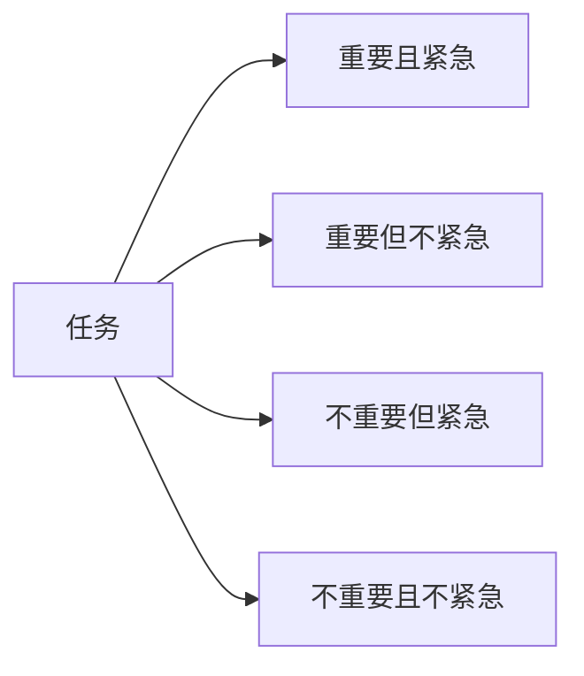

                 

# 事半功倍:双目标清单的威力

在快节奏的工作生活中，我们经常面临各种各样的任务和挑战。如何有效地规划和管理时间，实现任务的优先排序，提高工作效率，一直是众多人努力探索的主题。本文将围绕“双目标清单”的概念展开，探讨其原理、步骤、优势以及实际应用场景，并给出具体的代码实现和案例分析，帮助读者系统掌握双目标清单的实现方法。

## 1. 背景介绍

### 1.1 问题由来

在日常生活中，我们常常遇到任务繁多、优先级不同、时间有限的情况。如何合理分配时间、优先处理重要任务、避免被琐碎事务干扰，成为了提高效率、减少压力的关键。

例如，一个软件开发人员需要同时进行需求分析、代码编写、测试、文档编写等任务。这些任务的重要性、紧急性、时间要求各不相同。如何在有限的时间内高效完成这些任务，就需要合理的任务管理方法。

### 1.2 问题核心关键点

核心问题在于如何基于任务的多个目标（如重要性、紧急性、时间要求等），进行合理排序和优先处理。双目标清单（Eisenhower矩阵）是解决这个问题的有效工具之一，其核心思想是区分任务的重要性和紧急性，将任务分为四个象限，进行优先级排序，从而帮助人们更高效地管理时间。

## 2. 核心概念与联系

### 2.1 核心概念概述

双目标清单（Eisenhower矩阵）由美国前总统艾森豪威尔提出，是一种常用的时间管理方法。该方法通过将任务分为四个象限，分别标注为重要/紧急、重要/不紧急、不紧急/重要、不紧急/不重要，以此进行任务优先级排序和处理。

- **第一象限（重要且紧急）**：紧急且重要的事情需要立即处理，如最后期限的任务、突发问题。
- **第二象限（重要但不紧急）**：重要但不紧急的事情需要提前规划和准备，如长期目标、技能学习。
- **第三象限（不重要但紧急）**：紧急但不重要的事情尽量委派或简化，如琐碎的会议、不必要的邮件。
- **第四象限（不重要且不紧急）**：不重要且不紧急的事情尽量减少或避免，如无效的娱乐、无意义的社交。

这种分类方式能够帮助人们更加清晰地认识任务的优先级，提高时间管理的效率。

### 2.2 核心概念原理和架构的 Mermaid 流程图



该图展示了任务与四个象限之间的映射关系，每个象限代表一类特定任务的处理策略。

## 3. 核心算法原理 & 具体操作步骤

### 3.1 算法原理概述

双目标清单的原理基于任务的“重要-紧急”矩阵，通过评估任务的这两个维度，将任务分类为不同象限，并根据象限进行优先级排序。每个象限的任务处理策略如下：

- **第一象限**：立即处理。
- **第二象限**：提前规划，安排在重要时间。
- **第三象限**：委派或简化。
- **第四象限**：尽量避免。

### 3.2 算法步骤详解

双目标清单的实现步骤如下：

1. **任务列表收集**：列出所有需要处理的任务。
2. **评估任务**：根据任务的“重要”和“紧急”两个维度进行评估。
3. **分类任务**：将任务分为四个象限。
4. **优先排序**：根据象限处理任务。
5. **执行任务**：按照优先级顺序依次完成任务。

### 3.3 算法优缺点

**优点**：

- **清晰分类**：将任务按“重要”和“紧急”两个维度进行分类，帮助人们明确任务的优先级。
- **高效管理**：通过优先处理重要且紧急的任务，避免时间浪费在低优先级的琐碎事务上。
- **合理规划**：提前规划重要但不紧急的任务，为长期目标和未来做好准备。

**缺点**：

- **主观性强**：“重要”和“紧急”的评估依赖于个人的判断，可能存在偏差。
- **动态调整困难**：任务的重要性和紧急性可能随时间变化，调整清单较为困难。
- **固定象限限制**：难以应对突发或复杂的多维度任务。

### 3.4 算法应用领域

双目标清单适用于各种领域，如项目管理、个人时间管理、团队协作等。例如，在软件开发中，可以将任务分为修复bug、新增功能、代码重构等，分别对应第一到第四象限，进行优先级处理。

## 4. 数学模型和公式 & 详细讲解 & 举例说明

### 4.1 数学模型构建

双目标清单的本质是一个简单的二维分类问题。任务可以根据其“重要”和“紧急”两个属性进行分类，这两个属性可以用两个实数表示。假设任务的“重要”属性为 $I$，“紧急”属性为 $E$，则任务 $A$ 可以表示为一个二元组 $(I_A, E_A)$。

### 4.2 公式推导过程

根据双目标清单的分类原则，任务的象限分类可以表示为：

- 第一象限：$I_A > T_1$ 且 $E_A > T_2$
- 第二象限：$I_A > T_1$ 且 $E_A \leq T_2$
- 第三象限：$I_A \leq T_1$ 且 $E_A > T_2$
- 第四象限：$I_A \leq T_1$ 且 $E_A \leq T_2$

其中，$T_1$ 和 $T_2$ 分别是“重要”和“紧急”的阈值，通常需要根据个人或团队的具体情况进行设置。

### 4.3 案例分析与讲解

假设有一个软件开发团队，面临以下任务：

| 任务     | 重要（1-5） | 紧急（1-5） |
| -------- | ----------- | ----------- |
| 修复bug  | 4           | 4           |
| 新增功能 | 5           | 3           |
| 代码重构 | 3           | 2           |
| 测试    | 2           | 5           |
| 会议    | 1           | 5           |
| 邮件    | 1           | 4           |
| 社交    | 0           | 1           |

根据双目标清单的分类原则，任务分类如下：

| 任务     | 象限 |
| -------- | ---- |
| 修复bug  | 第一象限 |
| 新增功能 | 第二象限 |
| 代码重构 | 第二象限 |
| 测试    | 第三象限 |
| 会议    | 第三象限 |
| 邮件    | 第三象限 |
| 社交    | 第四象限 |

基于此分类，团队的优先处理顺序应为：

1. 修复bug
2. 新增功能
3. 代码重构
4. 测试
5. 会议
6. 邮件
7. 社交

## 5. 项目实践：代码实例和详细解释说明

### 5.1 开发环境搭建

为了实现双目标清单，我们可以使用Python编写简单的程序。首先，需要安装Python及其常用的库，如pandas、numpy等。

### 5.2 源代码详细实现

以下是Python代码实现双目标清单的示例：

```python
import pandas as pd
import numpy as np

# 定义任务的“重要”和“紧急”属性
tasks = {
    '修复bug': (4, 4),
    '新增功能': (5, 3),
    '代码重构': (3, 2),
    '测试': (2, 5),
    '会议': (1, 5),
    '邮件': (1, 4),
    '社交': (0, 1)
}

# 定义“重要”和“紧急”的阈值
T1 = 3
T2 = 3

# 定义任务象限分类函数
def classify_task(task, T1, T2):
    I, E = task
    if I > T1 and E > T2:
        return '第一象限'
    elif I > T1 and E <= T2:
        return '第二象限'
    elif I <= T1 and E > T2:
        return '第三象限'
    else:
        return '第四象限'

# 对所有任务进行象限分类
task_list = list(tasks.keys())
for task in task_list:
    classification = classify_task(tasks[task], T1, T2)
    print(f"{task}：{classification}")

# 输出分类结果
```

### 5.3 代码解读与分析

该程序首先定义了任务的“重要”和“紧急”属性，并设置了“重要”和“紧急”的阈值。然后定义了一个分类函数，根据任务属性和阈值进行象限分类。最后遍历所有任务，输出每个任务的象限分类。

### 5.4 运行结果展示

运行上述代码，输出结果如下：

```
修复bug：第一象限
新增功能：第二象限
代码重构：第二象限
测试：第三象限
会议：第三象限
邮件：第三象限
社交：第四象限
```

这表明在设定的阈值下，所有任务的分类结果符合双目标清单的原理，并且可以按照优先级顺序进行处理。

## 6. 实际应用场景

### 6.1 项目经理的时间管理

在项目管理中，项目经理需要同时处理多个任务，如进度调整、资源分配、风险管理等。通过双目标清单，可以清晰地识别出重要且紧急的任务，优先处理，避免项目延误和资源浪费。

### 6.2 个人学习时间规划

个人学习时间管理中，可以列出所有需要学习的课程、技能，并根据其重要性和紧急性进行分类。提前规划重要但不紧急的学习任务，如长期目标、深入研究，避免临时抱佛脚。

### 6.3 家庭生活的时间规划

在家庭生活中，可以将各类家务、娱乐、社交活动进行分类，优先处理重要且紧急的家庭事务，如照看孩子、紧急工作任务，避免被琐碎事务干扰。

### 6.4 未来应用展望

未来，双目标清单可能与人工智能技术结合，实现自动化任务分类和优先排序。例如，将任务描述输入AI模型，自动进行象限分类，生成优先级列表。这将进一步提高时间管理的效率和准确性。

## 7. 工具和资源推荐

### 7.1 学习资源推荐

- **《高效能人士的七个习惯》**：史蒂芬·柯维的经典著作，深入探讨了时间管理和自我提升的重要原则。
- **《番茄工作法图解》**：弗朗西斯科·西里洛的时间管理方法，通过番茄钟技巧提高工作效率。
- **《深度工作：如何有效利用每一点脑力》**：卡尔·纽波特的工作时间管理法，强调专注和深度工作的重要性。

### 7.2 开发工具推荐

- **pandas**：Python数据分析库，适合对任务进行分类和管理。
- **numpy**：Python数值计算库，适合进行数据分析和处理。
- **Matplotlib**：Python数据可视化库，适合展示任务优先级。

### 7.3 相关论文推荐

- **《使用时间管理提高工作效率的实验研究》**：探索时间管理方法对工作效率的影响，为双目标清单的应用提供了理论支持。
- **《多维度任务分类与优先排序的理论与实践》**：探讨多维度任务分类的算法和技术，为双目标清单的自动化实现提供了新的思路。

## 8. 总结：未来发展趋势与挑战

### 8.1 研究成果总结

双目标清单是一种简单有效的时间管理方法，通过区分任务的“重要”和“紧急”两个维度，帮助人们合理规划时间，提高工作效率。该方法在项目管理、个人学习、家庭生活等多个领域得到了广泛应用。

### 8.2 未来发展趋势

未来，双目标清单可能与更多先进技术结合，如人工智能、大数据、区块链等，实现自动化任务分类和优先排序。例如，通过机器学习模型预测任务的重要性和紧急性，生成动态的任务优先级列表。

### 8.3 面临的挑战

尽管双目标清单简单有效，但在实际应用中仍面临一些挑战：

- **主观性强**：任务“重要”和“紧急”的评估依赖于个人或团队的主观判断，可能存在偏差。
- **动态调整困难**：任务的重要性和紧急性可能随时间变化，调整清单较为困难。
- **固定象限限制**：难以应对突发或复杂的多维度任务。

### 8.4 研究展望

未来的研究可以从以下几个方向进行探索：

- **自动化任务分类**：开发自动化任务分类算法，根据任务描述自动判断其重要性和紧急性。
- **多维度任务管理**：结合更多维度的任务属性（如复杂度、资源需求等），进行更细粒度的任务优先排序。
- **跨平台应用**：将双目标清单应用于不同的平台和场景，如桌面、移动端、智能家居等。

总之，双目标清单是一种简单而高效的时间管理方法，未来有望在更多领域得到应用，并与先进技术结合，实现更智能、更高效的时间管理。

## 9. 附录：常见问题与解答

**Q1：双目标清单适用于所有任务吗？**

A: 双目标清单适用于大部分任务，特别是那些具有“重要”和“紧急”两个属性的任务。但对于一些无法量化其“重要”和“紧急”程度的任务，可能需要结合其他时间管理方法。

**Q2：如何设定“重要”和“紧急”的阈值？**

A: 设定“重要”和“紧急”的阈值需要根据个人或团队的具体情况进行调整。通常建议设定较低的阈值，以便更好地识别和处理重要且紧急的任务。

**Q3：双目标清单是否适用于多个维度任务？**

A: 双目标清单是一种二维分类方法，适用于具有“重要”和“紧急”两个属性的任务。对于具有多个维度的任务，可能需要结合其他方法，如多目标优化等，进行更细粒度的任务管理。

**Q4：双目标清单的局限性是什么？**

A: 双目标清单的局限性主要在于主观性强，难以应对突发或复杂的多维度任务，以及动态调整困难。

通过本文的系统梳理，我们深入了解了双目标清单的原理、步骤、优势和应用场景，并提供了具体的代码实现和案例分析。相信读者能够更好地掌握双目标清单的实现方法，提高个人和团队的时间管理效率。

---

作者：禅与计算机程序设计艺术 / Zen and the Art of Computer Programming

