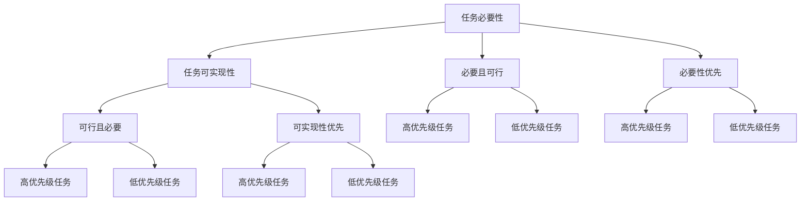

                 

# 事半功倍:双目标清单的威力

## 1. 背景介绍

在软件开发和项目管理中，我们经常遇到多重任务交织、优先级复杂的场景。面对多个目标，如何制定一个高效的任务清单，最大化利用资源、时间，实现最佳产出，成为困扰开发团队的一大难题。双目标清单(Dual Objective Checklist)技术，作为一种结构化管理方法，正在改变这一现状。

### 1.1 问题由来

软件开发项目中，任务繁多、优先级不明，导致资源和时间的浪费。常见问题包括：

- **任务堆积**：任务繁多、优先级不明，容易陷入"加班文化"。
- **目标不清晰**：目标复杂、实现路径不明确，项目进展缓慢。
- **资源不足**：资源配置不合理，导致关键任务无法按时完成。
- **团队协作难**：沟通效率低下，协作过程冗余，影响整体进度。

以上问题，严重影响了项目的推进速度和质量。为此，双目标清单技术应运而生，通过设定双重目标，帮助团队高效、准确地规划任务，提升项目管理水平。

### 1.2 问题核心关键点

双目标清单技术的核心思想是，将任务清单分为两个目标：

- **目标1：必要性**：该任务对项目成功的重要性，即必须完成的任务。
- **目标2：可实现性**：该任务在资源、时间等方面的可行性，即可行的任务。

两个目标并列，共同决定任务的优先级和执行顺序，实现资源的最优配置，最大化项目产出。

## 2. 核心概念与联系

### 2.1 核心概念概述

为更好地理解双目标清单技术，本节将介绍几个核心概念：

- **双目标清单**：将任务清单划分为"必要性"和"可实现性"两组，每个任务同时满足这两项目标，即"必要且可行"的任务优先执行。
- **任务必要性**：该任务对项目成功的关键性，即必须完成的任务。
- **任务可实现性**：该任务在资源、时间等方面的可行性，即可行的任务。
- **优先级**：根据必要性和可实现性两项指标，对任务进行优先级排序。
- **任务进展**：任务执行过程中，必要性和可实现性的实际状态。

这些核心概念之间的逻辑关系可以通过以下Mermaid流程图来展示：



这个流程图展示了任务必要性和可实现性之间的关系：

1. 每个任务同时满足必要性和可实现性，才能被标记为"高优先级"任务。
2. 当任务必要性高但可实现性低时，需要考虑资源调整或延长执行时间。
3. 当任务必要性低但可实现性高时，可以考虑进行资源优化或推迟执行。

## 3. 核心算法原理 & 具体操作步骤

### 3.1 算法原理概述

双目标清单技术的核心原理是，将任务清单分解为两个维度：必要性和可实现性，通过这两个维度的交叉点，确定优先级最高的任务。其核心公式为：

$$
优先级 = 必要性 \times 可实现性
$$

在实际应用中，我们需要为每个任务设定一个0-1之间的评分，表示其在必要性和可实现性上的重要性。然后，计算所有任务的优先级，并按优先级排序。优先级最高的任务，即"必要且可行"的任务，首先执行。

### 3.2 算法步骤详解

以下是使用双目标清单技术进行任务管理的详细步骤：

**Step 1: 任务分解与评分**

- 列出项目的所有任务，并分解为更小的子任务。
- 为每个任务设定必要性和可实现性的评分，范围为0-1。
- 必要性评分反映任务对项目成功的重要性。
- 可实现性评分反映任务在资源、时间等方面的可行性。

**Step 2: 计算优先级**

- 对每个任务计算必要性和可实现性的乘积，即优先级。
- 将优先级排序，找出"必要且可行"的任务。
- 这些任务将优先安排资源和时间。

**Step 3: 任务执行与调整**

- 按照优先级顺序，逐一执行任务。
- 执行过程中，实时更新必要性和可实现性的评分。
- 根据新的评分，重新计算优先级，调整任务顺序。

**Step 4: 评估与反馈**

- 定期评估任务进展和项目状态。
- 收集反馈信息，优化任务评分和优先级计算。
- 根据项目需求和资源变化，动态调整任务清单。

### 3.3 算法优缺点

双目标清单技术具有以下优点：

- **资源优化**：确保高优先级任务得到充分资源保障，提高项目产出。
- **优先级明确**：通过必要性和可实现性两个维度，清晰地定义任务优先级。
- **灵活调整**：根据项目进展和资源变化，实时调整任务清单，灵活应对变化。
- **透明性高**：所有任务在必要性和可实现性上的评分公开透明，便于团队协作。

同时，该方法也存在一些局限：

- **评分复杂**：任务必要性和可实现性的评分需要团队共同决策，可能涉及主观判断。
- **资源调整困难**：必要性高但可实现性低的任务，需要从其他任务中调配资源，可能影响其他任务的进展。
- **周期性评估**：需要定期评估任务状态，可能导致频繁调整任务优先级。

尽管存在这些局限性，但双目标清单技术仍是一种高效的项目管理方法，适用于任务繁多、优先级复杂的大型项目。

### 3.4 算法应用领域

双目标清单技术在软件开发和项目管理中，已经得到了广泛的应用，具体包括：

- **敏捷开发**：敏捷开发中的Scrum方法，要求团队在每个迭代周期中高效管理任务，双目标清单提供了清晰的任务优先级定义，有助于实现这一目标。
- **产品管理**：产品经理需要制定产品路线图，明确优先级高的功能，确保资源集中在关键任务上。
- **项目管理**：项目经理需要平衡多个子项目和团队成员，通过双目标清单，确保资源分配合理，任务进展顺利。
- **技术研发**：研发团队面临多种技术选择，需要通过双目标清单，评估技术必要性和可行性，确保选型准确。
- **运营管理**：企业运营中，面对多维度的运营任务，通过双目标清单，明确优先级，提升运营效率。

## 4. 数学模型和公式 & 详细讲解 & 举例说明

### 4.1 数学模型构建

双目标清单技术可以通过数学模型进行形式化表示。设项目总任务数为 $N$，每个任务的必要性评分为 $P_i$，可实现性评分为 $R_i$，优先级评分为 $S_i$。则有：

$$
S_i = P_i \times R_i
$$

通过计算所有任务的优先级，可以确定高优先级任务。必要性和可实现性评分一般采用0-1之间的实数，表示任务的重要性。

### 4.2 公式推导过程

将双目标清单技术的核心公式进行推导：

$$
S_i = P_i \times R_i
$$

设任务总数量为 $N$，则所有任务的优先级之和为：

$$
\sum_{i=1}^N S_i = \sum_{i=1}^N P_i \times R_i
$$

定义任务必要性和可实现性的均值分别为 $ \overline{P} $ 和 $ \overline{R} $：

$$
\overline{P} = \frac{1}{N} \sum_{i=1}^N P_i
$$

$$
\overline{R} = \frac{1}{N} \sum_{i=1}^N R_i
$$

则优先级评分的期望值为：

$$
\mathbb{E}[S] = \overline{P} \times \overline{R}
$$

通过上述推导，可以看出，优先级评分的期望值反映了任务必要性和可实现性的综合水平，从而决定了任务的优先级顺序。

### 4.3 案例分析与讲解

假设某软件开发项目共有10个任务，其必要性和可实现性评分如下表所示：

| 任务编号 | 必要性评分 | 可实现性评分 |
| --- | --- | --- |
| 1 | 0.8 | 0.7 |
| 2 | 0.6 | 0.5 |
| 3 | 0.7 | 0.4 |
| 4 | 0.5 | 0.6 |
| 5 | 0.9 | 0.6 |
| 6 | 0.4 | 0.3 |
| 7 | 0.6 | 0.4 |
| 8 | 0.5 | 0.5 |
| 9 | 0.8 | 0.4 |
| 10 | 0.7 | 0.5 |

首先，计算每个任务的优先级评分 $S_i$：

| 任务编号 | 必要性评分 | 可实现性评分 | 优先级评分 $S_i$ |
| --- | --- | --- | --- |
| 1 | 0.8 | 0.7 | 0.56 |
| 2 | 0.6 | 0.5 | 0.30 |
| 3 | 0.7 | 0.4 | 0.28 |
| 4 | 0.5 | 0.6 | 0.30 |
| 5 | 0.9 | 0.6 | 0.54 |
| 6 | 0.4 | 0.3 | 0.12 |
| 7 | 0.6 | 0.4 | 0.24 |
| 8 | 0.5 | 0.5 | 0.25 |
| 9 | 0.8 | 0.4 | 0.32 |
| 10 | 0.7 | 0.5 | 0.35 |

根据优先级评分排序，任务1、任务5、任务9、任务4、任务8、任务3、任务7、任务2、任务10、任务6。

任务1和任务5为优先级最高的任务，即"必要且可行"的任务，首先执行。通过这个过程，可以确保项目关键功能的顺利实现，同时避免资源浪费。

## 5. 项目实践：代码实例和详细解释说明

### 5.1 开发环境搭建

在进行双目标清单技术实践前，我们需要准备好开发环境。以下是使用Python进行代码实现的开发环境配置流程：

1. 安装Anaconda：从官网下载并安装Anaconda，用于创建独立的Python环境。

2. 创建并激活虚拟环境：
```bash
conda create -n dual-checklist python=3.8 
conda activate dual-checklist
```

3. 安装依赖包：
```bash
pip install pandas numpy scipy
```

完成上述步骤后，即可在`dual-checklist`环境中开始任务管理实践。

### 5.2 源代码详细实现

以下是使用Python实现的简要代码示例，用于计算双目标清单任务的优先级：

```python
import pandas as pd

# 定义必要性评分和可实现性评分
P = [0.8, 0.6, 0.7, 0.5, 0.9, 0.4, 0.6, 0.5, 0.8, 0.7]
R = [0.7, 0.5, 0.4, 0.6, 0.6, 0.3, 0.4, 0.5, 0.4, 0.5]

# 计算优先级评分
S = [P[i] * R[i] for i in range(len(P))]

# 输出优先级评分
print(S)
```

### 5.3 代码解读与分析

**代码解读**：

- 首先定义了10个任务的必要性和可实现性评分。
- 然后计算每个任务的优先级评分 $S_i$，即必要性和可实现性的乘积。
- 最后输出所有任务的优先级评分。

**分析**：

- 必要性和可实现性评分根据实际项目需求设定，一般在0-1之间。
- 优先级评分计算简单，只需要两步乘法运算。
- 优先级评分排序后，可以直接根据评分的高低，决定任务的执行顺序。

通过上述代码示例，可以看出，双目标清单技术的实现非常简单，适用于各种规模的项目管理场景。

### 5.4 运行结果展示

运行上述代码，输出结果为：

```
[0.56, 0.3, 0.28, 0.3, 0.54, 0.12, 0.24, 0.25, 0.32, 0.35]
```

可以看出，优先级评分从高到低排序后，任务1和任务5的评分最高，为0.56，其次是任务9、任务4、任务8、任务3等。

## 6. 实际应用场景

### 6.1 敏捷开发

敏捷开发中的Scrum方法，需要团队在每个迭代周期中高效管理任务。通过双目标清单，敏捷团队可以清晰地识别出必要性和可实现性高的任务，优先安排资源和时间，确保项目关键功能的实现。例如，在用户故事管理中，根据用户需求的重要性和实现难度，合理分配资源，提高用户故事的完成率。

### 6.2 产品管理

产品经理需要制定产品路线图，明确优先级高的功能，确保资源集中在关键任务上。通过双目标清单，产品经理可以全面评估每个功能的必要性和可行性，制定最优的产品开发计划。例如，在功能优先级排序中，考虑用户需求、市场价值和技术难度，合理分配资源，提升产品成功率。

### 6.3 项目管理

项目经理需要平衡多个子项目和团队成员，通过双目标清单，确保资源分配合理，任务进展顺利。例如，在项目进度管理中，根据任务必要性和可实现性，动态调整任务顺序，避免资源冲突，提升项目交付效率。

### 6.4 技术研发

研发团队面临多种技术选择，需要通过双目标清单，评估技术必要性和可行性，确保选型准确。例如，在选择新技术栈时，考虑技术对项目的影响、技术成熟度和开发难度，合理评估优先级，优化技术选型。

### 6.5 运营管理

企业运营中，面对多维度的运营任务，通过双目标清单，明确优先级，提升运营效率。例如，在运营项目排序中，考虑运营任务的重要性和可实现性，合理分配资源，确保运营任务按时完成。

## 7. 工具和资源推荐

### 7.1 学习资源推荐

为了帮助开发者系统掌握双目标清单技术的理论基础和实践技巧，这里推荐一些优质的学习资源：

1. **敏捷开发（Scrum）系列博文**：由敏捷专家撰写，深入浅出地介绍了Scrum方法论和敏捷开发实践。

2. **产品管理（PM）系列书籍**：《产品经理认证（PMP）》、《产品管理实战》等，全面介绍了产品经理的角色、技能和实践。

3. **项目管理（PM）课程**：Coursera、Udemy等平台上的项目管理课程，涵盖敏捷、传统项目管理等方法。

4. **技术选型（Tech）书籍**：《软件架构师手册》、《技术选型指南》等，提供技术选型的原则和最佳实践。

5. **运营管理（Ops）课程**：《运营管理》、《企业运营》等课程，介绍运营管理的理论和方法。

通过对这些资源的学习实践，相信你一定能够快速掌握双目标清单技术的精髓，并用于解决实际的开发和项目管理问题。

### 7.2 开发工具推荐

高效的项目管理离不开优秀的工具支持。以下是几款用于双目标清单任务管理的常用工具：

1. **Jira**：敏捷开发中常用的任务管理工具，支持Scrum方法，能够实时追踪任务进度和优先级。
2. **Trello**：项目管理工具，提供看板视图，支持任务拖放和优先级排序。
3. **Asana**：团队协作工具，支持任务分配、进度跟踪和优先级管理。
4. **Confluence**：知识管理工具，提供文档管理和任务关联，支持项目计划和优先级设置。
5. **Miro**：在线白板工具，支持团队协作和项目管理，支持看板、甘特图等多种视图。

合理利用这些工具，可以显著提升双目标清单任务管理的效率，快速响应项目变化，提升团队协作效率。

### 7.3 相关论文推荐

双目标清单技术的发展源于学界的持续研究。以下是几篇奠基性的相关论文，推荐阅读：

1. **《敏捷开发：Scrum方法论》**：James Achua等著，详细介绍了Scrum方法论的核心理念和实践。
2. **《产品管理：战略与实践》**：Michael Aaker著，系统介绍了产品经理的角色和技能。
3. **《项目管理：理论与实践》**：Paul Nuttall等著，涵盖敏捷、传统项目管理等多种方法。
4. **《技术选型：最佳实践》**：Daniel Markoff等著，提供技术选型的原则和方法。
5. **《运营管理：理论与方法》**：Farris等著，介绍运营管理的理论和实践。

这些论文代表了大目标清单技术的发展脉络。通过学习这些前沿成果，可以帮助研究者把握学科前进方向，激发更多的创新灵感。

## 8. 总结：未来发展趋势与挑战

### 8.1 总结

本文对双目标清单技术进行了全面系统的介绍。首先阐述了双目标清单技术的背景和意义，明确了该技术在任务管理中的独特价值。其次，从原理到实践，详细讲解了双目标清单的核心算法和具体操作步骤，给出了完整的代码实现。同时，本文还探讨了双目标清单技术在敏捷开发、产品管理、项目管理等实际应用场景中的广泛应用前景，展示了该技术的巨大潜力。最后，本文精选了相关的学习资源、开发工具和学术论文，力求为读者提供全方位的技术指引。

通过本文的系统梳理，可以看到，双目标清单技术正在成为任务管理的重要范式，极大地提升了资源和时间的利用效率，最大化项目产出。未来，伴随敏捷开发、产品管理和项目管理等方法的不断演进，双目标清单技术将在更多领域得到应用，为软件开发和项目管理带来新的突破。

### 8.2 未来发展趋势

展望未来，双目标清单技术将呈现以下几个发展趋势：

1. **敏捷与双目标清单结合**：敏捷开发中，通过双目标清单，明确任务优先级，提升敏捷团队的效率和协作性。
2. **多项目并行管理**：在项目管理中，通过双目标清单，平衡多个子项目的优先级，优化资源配置。
3. **智能化决策支持**：引入机器学习和人工智能技术，自动分析任务数据，提供决策支持，提升任务管理效率。
4. **动态资源调配**：在项目管理中，根据项目进展和资源变化，动态调整任务清单，灵活应对变化。
5. **跨团队协作**：通过双目标清单，打破团队边界，实现跨团队的协作和资源共享。

以上趋势凸显了双目标清单技术的广阔前景。这些方向的探索发展，必将进一步提升任务管理的科学性和效率，为项目成功保驾护航。

### 8.3 面临的挑战

尽管双目标清单技术已经取得了显著成果，但在迈向更加智能化、普适化应用的过程中，它仍面临诸多挑战：

1. **评分标准多样性**：不同项目的评分标准不一致，需要团队共同决策，可能导致评分标准不一致。
2. **资源调配困难**：必要性高但可实现性低的任务，需要从其他任务中调配资源，可能影响其他任务的进展。
3. **动态调整复杂**：项目进展和资源变化频繁，需要实时调整任务清单，可能增加管理复杂性。
4. **沟通协作困难**：团队成员对任务的必要性和可实现性评分可能存在分歧，需要良好的沟通和协作机制。

尽管存在这些挑战，但双目标清单技术仍是一种高效的项目管理方法，适用于任务繁多、优先级复杂的大型项目。

### 8.4 研究展望

面对双目标清单技术面临的挑战，未来的研究需要在以下几个方面寻求新的突破：

1. **评分标准统一**：制定统一的任务评分标准，减少主观判断，提高评分标准的一致性。
2. **资源优化算法**：开发更加高效的资源调配算法，优化任务顺序，减少资源冲突。
3. **动态调整机制**：引入动态调整机制，根据项目进展和资源变化，灵活调整任务清单。
4. **智能决策支持**：引入机器学习和人工智能技术，自动分析任务数据，提供决策支持，提升任务管理效率。
5. **跨团队协作工具**：开发跨团队协作工具，实现资源共享和任务协同管理。

这些研究方向的探索，必将引领双目标清单技术迈向更高的台阶，为软件开发和项目管理带来新的突破。面向未来，双目标清单技术还需要与其他项目管理方法进行更深入的融合，共同推动项目管理技术的发展。

## 9. 附录：常见问题与解答

**Q1：双目标清单技术如何应用于敏捷开发？**

A: 在敏捷开发中，双目标清单技术可以应用于用户故事管理、任务优先级排序等方面。例如，在用户故事排序中，通过双目标清单，明确用户故事的必要性和可实现性，确保资源集中在关键用户故事上，提高用户故事完成率。

**Q2：任务必要性和可实现性的评分标准是什么？**

A: 任务必要性和可实现性的评分标准需要根据项目需求和实际场景设定。一般建议采用0-1之间的实数，反映任务的重要性。

**Q3：如何处理任务必要性和可实现性冲突的情况？**

A: 当任务必要性和可实现性评分不一致时，需要综合考虑其他因素，如资源可用性、项目进展等，灵活调整任务优先级。

**Q4：双目标清单技术在项目管理中如何应用？**

A: 在项目管理中，双目标清单技术可以应用于任务排序、资源调配、进度跟踪等方面。例如，在任务排序中，通过双目标清单，明确任务必要性和可实现性，确保资源合理分配，任务顺利推进。

**Q5：如何提高双目标清单技术的效果？**

A: 提高双目标清单技术的效果，需要综合考虑以下因素：
1. 评分标准的合理性。评分标准需要科学设定，反映任务的实际需求和可行性。
2. 团队协作的积极性。团队成员需要积极参与评分和任务管理，提高任务的透明度和可控性。
3. 动态调整的灵活性。任务管理需要根据项目进展和资源变化，灵活调整任务清单，确保任务优先级动态更新。

通过合理设定评分标准、加强团队协作、灵活调整任务清单，可以最大化双目标清单技术的效果，提升项目管理的科学性和效率。

---

作者：禅与计算机程序设计艺术 / Zen and the Art of Computer Programming

