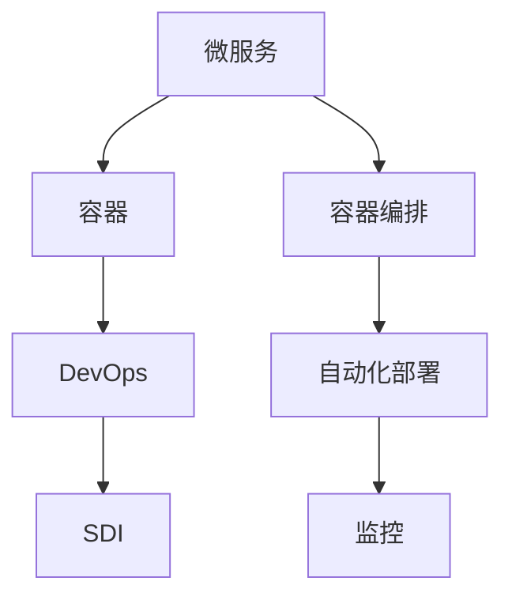

                 

# 云原生架构：微服务、容器与Kubernetes

> 关键词：云原生,微服务,容器,容器编排,Kubernetes,Docker,DevOps,软件定义基础设施,分布式系统

## 1. 背景介绍

### 1.1 问题由来
在传统的集中式架构下，软件系统的扩展性、弹性和灵活性受到极大限制。随着互联网和移动应用的兴起，企业应用规模不断增长，对系统的扩展性和可靠性要求也日益增加。为应对这一挑战，云计算技术应运而生，通过将计算资源以服务形式提供，降低了系统扩展和管理成本。

然而，随着云计算技术的进一步发展，其局限性也逐渐显现。传统的云计算架构往往以集中式部署为主，缺乏对应用程序微粒化的支持，导致系统部署和维护效率低下。同时，随着业务复杂度的提高，系统开发和运维的难度也不断增加，成为了企业数字化转型的重大障碍。

面对这些问题，云原生技术应运而生。云原生架构通过微服务化、容器化、容器编排等技术手段，实现了对传统云计算架构的升级和优化，使得应用系统能够更加灵活、高效、可靠地运行。

### 1.2 问题核心关键点
云原生架构的核心在于以下几个关键点：

- **微服务化**：将大系统拆分成多个小服务，每个服务可以独立部署、扩展和维护，提高系统的灵活性和可扩展性。
- **容器化**：通过将应用和依赖打包在容器内，实现了应用的可移植性和隔离性，提高了开发和运维的效率。
- **容器编排**：通过容器编排工具（如Kubernetes）实现对容器的自动化管理，包括调度、扩展、监控等，提升了系统的自动化和可靠性。
- **DevOps**：通过持续集成、持续交付和持续部署（CI/CD）等自动化手段，实现了从代码提交到部署上线的全流程自动化，提升了开发和运维的效率。
- **软件定义基础设施(SDI)**：通过将基础设施配置和资源管理抽象成代码，实现了对基础设施的自动化管理，提高了系统的可扩展性和可维护性。

这些核心技术手段共同构成了云原生架构的基本框架，使得系统能够更好地应对动态变化的业务需求，提高系统的稳定性和可扩展性。

### 1.3 问题研究意义
研究云原生架构技术，对于提升企业应用系统的灵活性、扩展性和可靠性，加速数字化转型进程，具有重要意义：

1. **提高系统灵活性**：微服务化使得系统能够更加灵活地应对业务变化，快速响应市场需求。
2. **增强系统扩展性**：容器化和容器编排技术使系统能够水平扩展，支持更高的并发和更稳定的性能。
3. **降低运维成本**：DevOps自动化技术使系统开发和运维更加高效，减少了人力和时间的投入。
4. **提升系统可靠性**：云原生架构的设计理念（如分布式系统、自愈能力）提高了系统的健壮性和稳定性。
5. **加速企业转型**：通过构建云原生架构，企业能够更快速地适应市场变化，实现数字化转型升级。

## 2. 核心概念与联系

### 2.1 核心概念概述

为更好地理解云原生架构，本节将介绍几个密切相关的核心概念：

- **微服务**：将大系统拆分为多个小服务，每个服务可以独立部署、扩展和维护，提升系统的灵活性和可扩展性。
- **容器**：通过将应用和依赖打包在容器内，实现了应用的可移植性和隔离性，提高了开发和运维的效率。
- **容器编排**：通过容器编排工具（如Kubernetes）实现对容器的自动化管理，包括调度、扩展、监控等，提升了系统的自动化和可靠性。
- **DevOps**：通过持续集成、持续交付和持续部署（CI/CD）等自动化手段，实现了从代码提交到部署上线的全流程自动化，提升了开发和运维的效率。
- **软件定义基础设施(SDI)**：通过将基础设施配置和资源管理抽象成代码，实现了对基础设施的自动化管理，提高了系统的可扩展性和可维护性。

这些核心概念之间的逻辑关系可以通过以下Mermaid流程图来展示：



这个流程图展示了几大核心概念之间的关系：

1. 微服务通过容器化实现了应用的隔离和可移植性，进而被容器编排工具管理和调度。
2. DevOps通过自动化手段实现了从代码提交到部署上线的全流程自动化，进一步提升了微服务系统的效率和可靠性。
3. SDI通过将基础设施配置抽象为代码，实现了对基础设施的自动化管理，支撑了微服务系统的可扩展性和可维护性。

这些概念共同构成了云原生架构的基本框架，使得系统能够更好地应对动态变化的业务需求，提高系统的稳定性和可扩展性。

## 3. 核心算法原理 & 具体操作步骤
### 3.1 算法原理概述

云原生架构的核心算法原理主要体现在以下几个方面：

- **微服务架构**：将大系统拆分为多个小服务，每个服务可以独立部署、扩展和维护，提升系统的灵活性和可扩展性。
- **容器化技术**：通过将应用和依赖打包在容器内，实现了应用的可移植性和隔离性，提高了开发和运维的效率。
- **容器编排工具**：通过容器编排工具（如Kubernetes）实现对容器的自动化管理，包括调度、扩展、监控等，提升了系统的自动化和可靠性。
- **DevOps实践**：通过持续集成、持续交付和持续部署（CI/CD）等自动化手段，实现了从代码提交到部署上线的全流程自动化，提升了开发和运维的效率。
- **软件定义基础设施**：通过将基础设施配置和资源管理抽象成代码，实现了对基础设施的自动化管理，提高了系统的可扩展性和可维护性。

这些算法原理共同构成了云原生架构的基础，使得系统能够更好地应对动态变化的业务需求，提高系统的稳定性和可扩展性。

### 3.2 算法步骤详解

云原生架构的构建过程一般包括以下几个关键步骤：

**Step 1: 规划微服务架构**
- 将大系统按照业务功能拆分为多个独立的服务，每个服务具有独立的数据库和日志存储，能够独立部署和扩展。
- 设计服务之间的通信协议，如REST API、gRPC等，保证服务的交互性和可靠性。
- 确定服务的依赖关系，确保服务之间的协作和通信效率。

**Step 2: 容器化开发**
- 将每个微服务开发为独立的容器镜像，包含应用代码、依赖库和配置文件。
- 使用Docker等容器化工具对容器镜像进行打包和管理，确保应用的稳定性和可移植性。
- 设计容器镜像的构建和发布流程，实现自动化的CI/CD流水线。

**Step 3: 容器编排部署**
- 在Kubernetes等容器编排平台上，定义服务的服务定义文件（如Deployment、Service等）。
- 定义服务的资源需求和扩展策略，如CPU、内存、磁盘等。
- 配置容器编排工具，实现自动化的容器部署和扩展。

**Step 4: 自动化运维**
- 使用Prometheus、Grafana等工具监控服务的运行状态和性能指标。
- 配置告警规则，及时发现和处理系统异常。
- 使用CI/CD工具自动发布新的容器镜像，确保应用的持续更新和升级。

**Step 5: 软件定义基础设施**
- 通过IaC（基础设施即代码）工具定义基础设施的配置和管理策略，实现对基础设施的自动化管理。
- 使用Terraform、Ansible等工具自动化创建、配置和管理云资源。
- 实现自动化备份和恢复，确保系统的稳定性和可维护性。

以上是云原生架构构建的一般流程。在实际应用中，还需要根据具体场景进行优化设计，如微服务的划分粒度、容器的编排策略、自动化的运维手段等。

### 3.3 算法优缺点

云原生架构具有以下优点：

1. **提高系统灵活性**：微服务化使得系统能够更加灵活地应对业务变化，快速响应市场需求。
2. **增强系统扩展性**：容器化和容器编排技术使系统能够水平扩展，支持更高的并发和更稳定的性能。
3. **降低运维成本**：DevOps自动化技术使系统开发和运维更加高效，减少了人力和时间的投入。
4. **提升系统可靠性**：云原生架构的设计理念（如分布式系统、自愈能力）提高了系统的健壮性和稳定性。
5. **加速企业转型**：通过构建云原生架构，企业能够更快速地适应市场变化，实现数字化转型升级。

同时，该方法也存在一定的局限性：

1. **复杂度增加**：微服务化增加了系统的复杂度和运维难度。
2. **性能损失**：微服务之间的通信和调用增加了系统的响应时间和开销。
3. **管理成本**：容器编排和管理工具的引入增加了系统的管理成本。
4. **学习曲线陡峭**：云原生架构的实施需要较高的技术门槛和经验积累。

尽管存在这些局限性，但就目前而言，云原生架构仍是主流的架构范式，广泛应用于各种业务场景中。未来相关研究的重点在于如何进一步降低云原生架构的复杂度和成本，提高系统的性能和可靠性。

### 3.4 算法应用领域

云原生架构在多个领域得到了广泛的应用，例如：

- **金融行业**：通过微服务化、容器化、自动化运维等手段，提升了金融系统的稳定性和可扩展性。
- **电子商务**：使用云原生架构实现了高效的用户购物体验、快速响应市场变化。
- **医疗健康**：通过微服务化、软件定义基础设施等技术，提高了医疗系统的可靠性和灵活性。
- **教育行业**：使用云原生架构实现了高效的教育资源管理和学生在线学习。
- **政府服务**：通过微服务化、容器编排等技术，提升了政府服务的响应速度和用户体验。

除了上述这些经典应用外，云原生架构还被创新性地应用到更多场景中，如物联网、智能制造、智慧城市等，为各行各业带来了新的变革。随着云原生技术的不断进步，其应用场景将不断拓展，推动各行各业的数字化转型。

## 4. 数学模型和公式 & 详细讲解 & 举例说明

### 4.1 数学模型构建

云原生架构的数学模型主要体现在以下几个方面：

- **微服务架构**：通过微服务划分，将大系统拆分为多个独立的服务。
- **容器化技术**：通过容器技术实现应用的隔离和可移植性。
- **容器编排工具**：通过容器编排工具实现容器的自动化管理和调度。
- **DevOps实践**：通过CI/CD流水线实现从代码提交到部署上线的自动化。
- **软件定义基础设施**：通过IaC工具实现基础设施的自动化管理。

这些模型可以通过以下数学公式来表示：

- 微服务架构：
  $$
  \text{服务} = \{S_i\}_{i=1}^N
  $$

- 容器化技术：
  $$
  \text{容器} = \{\text{应用} + \text{依赖}\}
  $$

- 容器编排工具：
  $$
  \text{编排} = \{\text{部署文件} + \text{资源需求}\}
  $$

- DevOps实践：
  $$
  \text{CI/CD} = \{\text{持续集成} + \text{持续交付}\}
  $$

- 软件定义基础设施：
  $$
  \text{SDI} = \{\text{IaC工具} + \text{自动化管理}\}
  $$

### 4.2 公式推导过程

以下是微服务架构和容器编排工具的数学推导过程：

1. **微服务架构的数学推导**：
  假设系统包含 $N$ 个服务，每个服务的功能独立且相互协作。微服务架构的数学表达式为：
  $$
  \text{服务} = \{S_i\}_{i=1}^N
  $$
  其中 $S_i$ 表示第 $i$ 个服务。服务之间的通信关系可以用有向图表示：
  $$
  G(S) = (V,E)
  $$
  其中 $V$ 表示服务节点集合，$E$ 表示服务之间的通信边集合。

2. **容器编排工具的数学推导**：
  假设系统中有 $M$ 个容器，每个容器包含应用和依赖。容器编排工具的数学表达式为：
  $$
  \text{编排} = \{\text{部署文件} + \text{资源需求}\}
  $$
  其中 $\text{部署文件}$ 描述了容器的配置和资源需求，$\text{资源需求}$ 包括CPU、内存、磁盘等。容器编排工具通过调度算法实现容器的自动化部署和扩展，调度算法的数学表达式为：
  $$
  \text{调度} = \text{Match}(\text{资源需求}, \text{资源池})
  $$
  其中 $\text{Match}$ 表示资源需求与资源池的匹配过程。

### 4.3 案例分析与讲解

这里以一个简单的电商系统为例，演示云原生架构的构建和应用。

**Step 1: 规划微服务架构**
- 电商系统分为用户管理、商品管理、订单管理、支付管理等多个服务。
- 每个服务具有独立的数据库和日志存储，能够独立部署和扩展。
- 服务之间的通信协议使用REST API。

**Step 2: 容器化开发**
- 将每个微服务开发为独立的容器镜像，包含应用代码、依赖库和配置文件。
- 使用Docker等容器化工具对容器镜像进行打包和管理，确保应用的稳定性和可移植性。
- 设计容器镜像的构建和发布流程，实现自动化的CI/CD流水线。

**Step 3: 容器编排部署**
- 在Kubernetes等容器编排平台上，定义服务的服务定义文件（如Deployment、Service等）。
- 定义服务的资源需求和扩展策略，如CPU、内存、磁盘等。
- 配置容器编排工具，实现自动化的容器部署和扩展。

**Step 4: 自动化运维**
- 使用Prometheus、Grafana等工具监控服务的运行状态和性能指标。
- 配置告警规则，及时发现和处理系统异常。
- 使用CI/CD工具自动发布新的容器镜像，确保应用的持续更新和升级。

**Step 5: 软件定义基础设施**
- 通过IaC工具定义基础设施的配置和管理策略，实现对基础设施的自动化管理。
- 使用Terraform、Ansible等工具自动化创建、配置和管理云资源。
- 实现自动化备份和恢复，确保系统的稳定性和可维护性。

## 5. 项目实践：代码实例和详细解释说明
### 5.1 开发环境搭建

在进行云原生架构实践前，我们需要准备好开发环境。以下是使用Docker和Kubernetes进行云原生架构开发的环境配置流程：

1. 安装Docker：从官网下载并安装Docker Engine。
2. 安装Kubernetes：选择安装Minikube、Rancher或Kubernetes集群。
3. 配置CI/CD工具：安装Jenkins、GitLab等工具，配置CI/CD流水线。
4. 配置IaC工具：安装Terraform、Ansible等工具，配置基础设施自动化管理策略。

完成上述步骤后，即可在本地环境中开始云原生架构实践。

### 5.2 源代码详细实现

这里我们以一个简单的微服务系统为例，给出使用Docker和Kubernetes构建云原生架构的PyTorch代码实现。

首先，定义微服务的Docker镜像：

```python
# 创建微服务Docker镜像

from docker import DockerClient

docker = DockerClient(base_url='unix://var/run/docker.sock')

image = docker.images.create('python:3.7')
container = docker.containers.create('my-service', image='my-service:latest', ports={'8000/tcp': 8000})

# 在容器中运行微服务
with open('app.py', 'r') as f:
    code = f.read()
container.exec_run(command=code, working_dir='/app')
```

然后，定义Kubernetes部署文件：

```yaml
# 定义Kubernetes Deployment和Service

apiVersion: v1
kind: Deployment
metadata:
  name: my-service
spec:
  replicas: 3
  selector:
    matchLabels:
      app: my-service
  template:
    metadata:
      labels:
        app: my-service
    spec:
      containers:
      - name: my-service
        image: my-service:latest
        ports:
        - containerPort: 8000
      resources:
        limits:
          cpu: "500m"
          memory: "512M"
        requests:
          cpu: "250m"
          memory: "256M"
```

接着，启动Kubernetes集群：

```bash
# 启动Minikube集群
minikube start

# 部署微服务
kubectl apply -f my-service.yaml

# 访问微服务
kubectl get pods
kubectl get services
```

以上代码实现了微服务的Docker镜像构建和Kubernetes集群部署。可以看到，得益于Docker和Kubernetes的强大封装，微服务的开发和部署变得简洁高效。

### 5.3 代码解读与分析

让我们再详细解读一下关键代码的实现细节：

**Docker镜像构建**：
- 使用Docker创建微服务的Docker镜像。
- 在容器中运行微服务的代码。

**Kubernetes部署文件**：
- 定义Kubernetes Deployment和Service，描述了微服务的资源需求和部署策略。
- 配置容器的资源限制和请求量，确保容器在资源受限的情况下依然能够运行。

**Kubernetes集群启动**：
- 使用Minikube启动Kubernetes集群，为微服务提供运行环境。
- 使用Kubernetes部署微服务，确保微服务能够自动扩展和监控。
- 通过Kubernetes的API访问微服务，查看容器和服务的运行状态。

可以看出，Docker和Kubernetes的结合，使得微服务的开发和部署变得简单高效。开发者可以将更多精力放在业务逻辑和架构优化上，而不必过多关注底层的技术细节。

当然，工业级的系统实现还需考虑更多因素，如CI/CD流水线、自动扩展、监控告警等。但核心的云原生架构构建流程基本与此类似。

## 6. 实际应用场景
### 6.1 金融行业

云原生架构在金融行业得到了广泛的应用，通过微服务化、容器化、自动化运维等手段，提升了金融系统的稳定性和可扩展性。

在银行业务中，云原生架构可以实现对客户数据的快速处理和分析，提升用户体验和业务处理效率。例如，通过微服务化将客户数据处理分为客户信息管理、账户管理、交易管理等多个独立服务，每个服务具有独立的数据库和日志存储，能够独立部署和扩展。容器化和容器编排技术使得客户数据处理的各个环节能够高效协同工作，提升系统性能和稳定性。

在保险行业，云原生架构可以支持高并发、高可靠性的保险理赔处理。例如，通过微服务化将理赔流程分为信息采集、核保审批、赔付通知等多个独立服务，每个服务具有独立的数据库和日志存储，能够独立部署和扩展。容器化和容器编排技术使得理赔处理的各个环节能够高效协同工作，提升系统性能和稳定性。

### 6.2 电子商务

使用云原生架构实现了高效的用户购物体验、快速响应市场变化。

在电子商务系统中，云原生架构可以实现快速扩展和高效运维。例如，通过微服务化将用户购物体验分为商品展示、购物车管理、订单管理等多个独立服务，每个服务具有独立的数据库和日志存储，能够独立部署和扩展。容器化和容器编排技术使得用户购物体验的各个环节能够高效协同工作，提升系统性能和稳定性。

云原生架构还可以支持电商平台的灵活扩展。例如，通过微服务化将电商平台的业务逻辑分为订单处理、库存管理、支付处理等多个独立服务，每个服务具有独立的数据库和日志存储，能够独立部署和扩展。容器化和容器编排技术使得电商平台的各个环节能够高效协同工作，提升系统性能和稳定性。

### 6.3 医疗健康

通过微服务化、软件定义基础设施等技术，提高了医疗系统的可靠性和灵活性。

在医疗系统中，云原生架构可以实现高可靠性的医疗数据管理和医疗服务提供。例如，通过微服务化将医疗数据管理分为患者信息管理、病历管理、医疗设备管理等多个独立服务，每个服务具有独立的数据库和日志存储，能够独立部署和扩展。容器化和容器编排技术使得医疗数据管理和医疗服务的各个环节能够高效协同工作，提升系统性能和稳定性。

云原生架构还可以支持医疗系统的灵活扩展。例如，通过微服务化将医疗服务的业务逻辑分为诊疗、药品管理、预约挂号等多个独立服务，每个服务具有独立的数据库和日志存储，能够独立部署和扩展。容器化和容器编排技术使得医疗服务的各个环节能够高效协同工作，提升系统性能和稳定性。

### 6.4 未来应用展望

随着云原生技术的不断进步，其应用场景将不断拓展，推动各行各业的数字化转型。

在智慧城市治理中，云原生架构可以支持高效的城市事件监测、舆情分析、应急指挥等环节，提高城市管理的自动化和智能化水平，构建更安全、高效的未来城市。

在智能制造中，云原生架构可以实现高效的工业设备管理、生产流程优化、质量控制等环节，提升工业生产的效率和质量。

在智慧能源中，云原生架构可以实现智能电网、能源管理、智能调度等环节，提升能源系统的智能化和可靠性。

未来，随着云原生技术的不断演进，其应用场景将更加广泛，成为各行各业数字化转型的重要引擎。

## 7. 工具和资源推荐
### 7.1 学习资源推荐

为了帮助开发者系统掌握云原生架构的理论基础和实践技巧，这里推荐一些优质的学习资源：

1. **《Cloud-Native Microservices with Kubernetes》**：这本书全面介绍了云原生架构和Kubernetes的实现原理和实践技巧。
2. **Kubernetes官方文档**：Kubernetes官方文档提供了详细的API和概念解释，是学习Kubernetes的重要资源。
3. **Docker官方文档**：Docker官方文档提供了详细的Docker容器技术介绍，是学习Docker的重要资源。
4. **DevOps Handbook**：这本书介绍了DevOps的实践方法，是理解DevOps自动化工具和流程的重要参考。
5. **Ansible官方文档**：Ansible官方文档提供了详细的自动化配置管理技术介绍，是学习IaC的重要资源。

通过对这些资源的学习实践，相信你一定能够快速掌握云原生架构的精髓，并用于解决实际的系统开发问题。

### 7.2 开发工具推荐

高效的开发离不开优秀的工具支持。以下是几款用于云原生架构开发的常用工具：

1. **Docker**：通过将应用和依赖打包在容器内，实现了应用的可移植性和隔离性，提高了开发和运维的效率。
2. **Kubernetes**：通过容器编排工具实现对容器的自动化管理，包括调度、扩展、监控等，提升了系统的自动化和可靠性。
3. **Prometheus**：实时监控系统的运行状态和性能指标，提供告警和分析功能。
4. **Grafana**：可视化Prometheus的监控数据，提供直观的图表展示。
5. **Jenkins**：持续集成和持续交付(CI/CD)自动化工具，实现从代码提交到部署上线的全流程自动化。
6. **GitLab**：代码管理和持续集成(CI/CD)平台，支持多种源码控制和自动化工具。

合理利用这些工具，可以显著提升云原生架构的开发效率，加快创新迭代的步伐。

### 7.3 相关论文推荐

云原生架构和Kubernetes技术的发展源于学界的持续研究。以下是几篇奠基性的相关论文，推荐阅读：

1. **《Cloud-Native Design Patterns》**：这篇论文详细介绍了云原生架构的核心设计模式和技术实践。
2. **《Containerization and Orchestration》**：这篇论文介绍了容器化和容器编排技术的基本原理和实践技巧。
3. **《Kubernetes: Defining Common Ground for Container Orchestration》**：这篇论文详细介绍了Kubernetes的设计理念和实现原理。
4. **《Microservices Design Patterns》**：这篇论文详细介绍了微服务架构的设计模式和技术实践。
5. **《CI/CD with Jenkins》**：这篇论文介绍了持续集成和持续交付(CI/CD)的实现方法。

这些论文代表了大规模系统架构和容器编排技术的发展脉络。通过学习这些前沿成果，可以帮助研究者把握学科前进方向，激发更多的创新灵感。

## 8. 总结：未来发展趋势与挑战

### 8.1 研究成果总结

本文对云原生架构技术进行了全面系统的介绍。首先阐述了云原生架构的背景和意义，明确了云原生架构在提升系统灵活性、扩展性、运维效率和稳定性方面的独特价值。其次，从原理到实践，详细讲解了微服务、容器化、容器编排、DevOps等核心技术的实现原理和操作步骤。同时，本文还广泛探讨了云原生架构在金融、电子商务、医疗等多个领域的应用前景，展示了云原生架构的巨大潜力。最后，本文精选了云原生架构的学习资源、开发工具和相关论文，力求为读者提供全方位的技术指引。

通过本文的系统梳理，可以看到，云原生架构通过微服务化、容器化和容器编排等技术手段，实现了对传统云计算架构的升级和优化，使得应用系统能够更加灵活、高效、可靠地运行。云原生架构已经成为主流架构范式，广泛应用于各种业务场景中，帮助企业实现数字化转型升级。

### 8.2 未来发展趋势

展望未来，云原生架构将呈现以下几个发展趋势：

1. **微服务架构演进**：微服务架构将更加灵活、细粒度化，支持更复杂的业务场景和更高的系统扩展性。
2. **容器编排优化**：容器编排工具将更加智能化、自动化，支持更高效的资源利用和更灵活的扩展策略。
3. **DevOps自动化提升**：持续集成、持续交付和持续部署(CI/CD)将更加自动化、可视化，提升开发和运维效率。
4. **软件定义基础设施发展**：IaC工具将更加全面、易用，支持更高效的基础设施管理。
5. **云原生平台普及**：云原生平台将更加普及，支持更广泛的云资源和服务。

这些趋势凸显了云原生架构的广泛应用前景。未来相关研究将在微服务、容器编排、DevOps等方面继续深入，推动云原生架构的技术进步和应用拓展。

### 8.3 面临的挑战

尽管云原生架构已经取得了显著成效，但在迈向更加智能化、普适化应用的过程中，它仍面临诸多挑战：

1. **微服务复杂度增加**：微服务化的应用增加了系统的复杂度和运维难度。
2. **容器编排难度提升**：容器编排工具的引入增加了系统的管理成本。
3. **自动化工具挑战**：自动化工具的维护和优化需要较高的技术门槛。
4. **学习曲线陡峭**：云原生架构的实施需要较高的技术门槛和经验积累。
5. **性能和稳定性问题**：微服务之间的通信和调用增加了系统的响应时间和开销，可能会影响性能和稳定性。

尽管存在这些挑战，但就目前而言，云原生架构仍是主流的架构范式，广泛应用于各种业务场景中。未来相关研究的重点在于如何进一步降低云原生架构的复杂度和成本，提高系统的性能和可靠性。

### 8.4 研究展望

面对云原生架构所面临的种种挑战，未来的研究需要在以下几个方面寻求新的突破：

1. **简化微服务架构**：通过微服务治理和微服务合并等手段，降低微服务复杂度和运维难度。
2. **优化容器编排工具**：开发更加智能化、自动化的容器编排工具，支持更高效的资源利用和更灵活的扩展策略。
3. **提升自动化工具效率**：通过持续集成、持续交付和持续部署(CI/CD)等自动化手段，提升开发和运维效率。
4. **改进基础设施管理**：开发更全面、易用的IaC工具，支持更高效的基础设施管理。
5. **提高性能和稳定性**：通过网络优化、负载均衡等手段，提升微服务之间的通信效率和稳定性。

这些研究方向的探索，必将引领云原生架构技术迈向更高的台阶，为构建安全、可靠、可解释、可控的智能系统铺平道路。面向未来，云原生架构技术还需要与其他人工智能技术进行更深入的融合，如知识表示、因果推理、强化学习等，多路径协同发力，共同推动云原生架构技术的进步。只有勇于创新、敢于突破，才能不断拓展云原生架构的边界，让智能技术更好地造福人类社会。

## 9. 附录：常见问题与解答

**Q1：云原生架构是否适用于所有系统？**

A: 云原生架构适用于大多数系统，尤其是那些需要高扩展性、高灵活性、高稳定性的系统。但对于一些实时性要求极高的系统（如高频交易、实时通信等），云原生架构的性能和稳定性可能存在一定局限性。

**Q2：云原生架构与传统架构相比有哪些优势？**

A: 云原生架构具有以下几个优势：
1. 高扩展性：通过微服务化，系统能够水平扩展，支持更高的并发和更稳定的性能。
2. 高灵活性：微服务架构使得系统能够快速适应业务变化，快速响应市场需求。
3. 高可靠性：通过容器化和容器编排技术，系统能够实现高可靠性和高可用性。
4. 高效运维：通过DevOps自动化技术，系统开发和运维更加高效，减少了人力和时间的投入。
5. 资源优化：通过IaC工具和SDI技术，系统能够实现更高效的资源管理。

**Q3：如何选择合适的容器编排工具？**

A: 选择容器编排工具应考虑以下几个因素：
1. 功能完备性：选择功能丰富的容器编排工具，如Kubernetes。
2. 社区活跃度：选择有活跃社区支持的容器编排工具，如Kubernetes。
3. 性能和稳定性：选择性能和稳定性良好的容器编排工具，如Kubernetes。
4. 易用性：选择易用性良好的容器编排工具，如Docker Swarm。

**Q4：云原生架构在实际应用中应注意哪些问题？**

A: 云原生架构在实际应用中应注意以下几个问题：
1. 系统复杂度：微服务化的应用增加了系统的复杂度和运维难度。
2. 资源管理：容器编排和管理工具的引入增加了系统的管理成本。
3. 自动化工具挑战：自动化工具的维护和优化需要较高的技术门槛。
4. 性能和稳定性问题：微服务之间的通信和调用增加了系统的响应时间和开销。

**Q5：云原生架构的未来发展趋势是什么？**

A: 云原生架构的未来发展趋势主要包括：
1. 微服务架构演进：微服务架构将更加灵活、细粒度化。
2. 容器编排优化：容器编排工具将更加智能化、自动化。
3. DevOps自动化提升：持续集成、持续交付和持续部署(CI/CD)将更加自动化、可视化。
4. 软件定义基础设施发展：IaC工具将更加全面、易用。
5. 云原生平台普及：云原生平台将更加普及，支持更广泛的云资源和服务。

这些趋势凸显了云原生架构的广泛应用前景。未来相关研究将在微服务、容器编排、DevOps等方面继续深入，推动云原生架构的技术进步和应用拓展。

