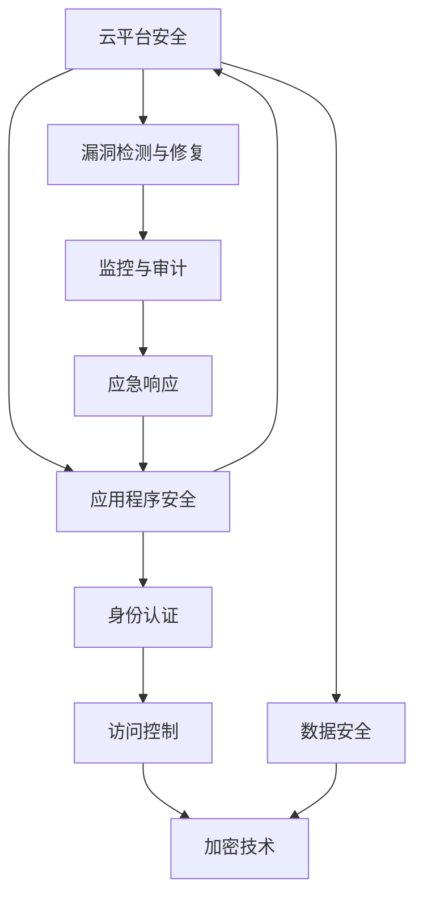

                 

# 云安全最佳实践：保护云端数据和应用程序

> 关键词：云安全,数据保护,应用程序安全,身份认证,访问控制,加密技术,漏洞检测,监控与审计,应急响应

## 1. 背景介绍

### 1.1 问题由来
随着云计算技术的迅猛发展，越来越多的企业和机构将核心业务迁移到云端，以获取更高效、灵活、低成本的服务。然而，云端环境的多租户共享、虚拟化、自动化等特点，也带来了新的安全威胁和挑战。云平台虽由云服务商负责维护，但云租户对其自身数据和应用程序的安全负有首要责任。因此，如何构建一套完备的云安全体系，以保护云端数据和应用程序，成为了当前企业和机构亟需解决的难题。

### 1.2 问题核心关键点
云安全涉及到数据、应用程序、网络、身份认证、访问控制等多个层面，以下核心关键点需要特别关注：

1. **数据加密**：保护数据在传输、存储、使用过程中的安全，防止数据泄露。
2. **身份认证**：通过有效的身份验证机制，确保只有授权用户才能访问系统。
3. **访问控制**：根据用户的角色和权限，控制其对资源的访问范围，防止未授权操作。
4. **漏洞检测与修复**：定期对云平台和应用程序进行安全漏洞扫描和修复，提升系统安全性。
5. **监控与审计**：实时监控系统活动，记录和分析安全事件，保障系统安全性。
6. **应急响应**：在发生安全事件时，能够迅速响应并采取有效措施，减少损失。

### 1.3 问题研究意义
构建完善的云安全体系，对于保障云计算环境下企业数据和应用程序的安全具有重要意义：

1. **防范数据泄露**：数据加密和访问控制可以防止敏感信息被非法获取或滥用。
2. **提升系统安全性**：漏洞检测和补丁管理可以及时修复系统中的安全漏洞，降低攻击风险。
3. **保障业务连续性**：监控与审计和应急响应机制可以在发现安全事件时快速响应，减少业务中断时间。
4. **满足合规要求**：云安全体系符合国家和行业的合规要求，避免因数据泄露等事件带来的法律和财务风险。

## 2. 核心概念与联系

### 2.1 核心概念概述

为更好地理解云安全的各项措施，本节将介绍几个关键概念及其相互联系：

- **云平台安全**：指云平台本身的安全，包括基础设施的安全、软件的安全、数据的安全等。
- **数据安全**：保护数据在传输、存储和使用过程中的完整性和机密性，防止未经授权的访问和泄露。
- **应用程序安全**：保护云应用程序的安全，防止恶意代码、漏洞、数据泄露等安全问题。
- **身份认证**：通过各种认证机制验证用户身份的真实性，防止冒充攻击。
- **访问控制**：根据用户的角色和权限，限制其对资源的访问范围，确保数据和应用的安全。
- **加密技术**：通过加密算法对数据进行加密处理，保护数据在传输和存储过程中的机密性。
- **漏洞检测与修复**：通过工具和技术检测系统中的安全漏洞，并进行修复，提升系统的安全性。
- **监控与审计**：实时监控系统活动，记录和分析安全事件，发现潜在的安全威胁和漏洞。
- **应急响应**：在检测到安全事件时，迅速采取措施，恢复系统的正常运行，减少损失。

这些核心概念之间存在密切联系，共同构成了云安全的整体框架。通过理解这些概念及其相互关系，可以更好地设计和实施云安全策略。

### 2.2 核心概念原理和架构的 Mermaid 流程图



这个流程图展示了云安全各个概念之间的联系。云平台安全是基础，涵盖数据安全、应用程序安全、身份认证、访问控制、加密技术等多个方面。其中，数据安全和应用程序安全是云安全的核心，通过身份认证和访问控制保障其安全性。漏洞检测与修复、监控与审计、应急响应等措施则用于保障整体安全，在发现和处理安全事件时发挥重要作用。

## 3. 核心算法原理 & 具体操作步骤
### 3.1 算法原理概述

云安全涉及的算法和技术众多，本节将重点介绍几个核心的算法原理及其具体操作步骤：

- **数据加密算法**：包括对称加密、非对称加密、哈希算法等，用于保护数据在传输、存储过程中的机密性。
- **身份认证算法**：如OAuth、OpenID Connect等，用于验证用户身份，防止身份冒充攻击。
- **访问控制算法**：如RBAC、ABAC等，根据用户角色和权限，控制其对资源的访问。
- **漏洞检测算法**：如静态代码分析、动态代码分析、安全扫描工具等，检测和修复系统中的漏洞。
- **监控与审计算法**：如日志记录、行为分析、异常检测等，实时监控系统活动，发现潜在威胁。
- **应急响应算法**：如威胁情报分析、入侵检测系统、应急预案等，在发现安全事件时，快速响应并采取措施。

### 3.2 算法步骤详解

以下以数据加密和身份认证为例，详细介绍其具体操作步骤：

#### 数据加密
数据加密的过程主要包括密钥生成、数据加密和解密等步骤：

1. **密钥生成**：使用密钥生成算法（如RSA、ECC等）生成一对公钥和私钥。
2. **数据加密**：使用对称加密算法（如AES、DES等）生成一个随机对称密钥，使用公钥加密该对称密钥，并将加密后的密钥与数据一起传输。
3. **数据解密**：接收方使用私钥解密加密后的对称密钥，然后使用对称密钥解密数据。

#### 身份认证
身份认证的过程主要包括用户认证和授权两个步骤：

1. **用户认证**：用户通过用户名和密码、生物特征、令牌等方式向认证服务器提交身份凭证。
2. **授权**：认证服务器验证用户身份，根据用户的角色和权限，授权其访问相应的资源。

### 3.3 算法优缺点
云安全涉及的算法和技术各有优缺点，需根据具体场景进行选择：

- **优点**：
  - **数据加密**：保护数据在传输和存储过程中的机密性，防止数据泄露。
  - **身份认证**：确保只有授权用户才能访问系统，防止身份冒充攻击。
  - **访问控制**：根据用户角色和权限，限制其对资源的访问范围，防止未授权操作。
  - **漏洞检测**：及时发现和修复系统中的安全漏洞，提升系统安全性。
  - **监控与审计**：实时监控系统活动，记录和分析安全事件，发现潜在威胁。
  - **应急响应**：在检测到安全事件时，迅速采取措施，恢复系统正常运行，减少损失。

- **缺点**：
  - **数据加密**：加密和解密过程复杂，可能影响系统性能。
  - **身份认证**：复杂的认证机制可能增加系统复杂度，增加用户操作难度。
  - **访问控制**：复杂权限管理可能导致权限冲突和资源浪费。
  - **漏洞检测**：漏洞检测工具可能存在误报和漏报问题，影响系统安全性。
  - **监控与审计**：大量的日志记录和分析可能增加系统存储和处理负担。
  - **应急响应**：应急响应机制的制定和执行需要专业知识，可能存在响应不及时或响应不当的情况。

### 3.4 算法应用领域

云安全涉及的算法和技术广泛应用于多个领域，包括但不限于：

- **金融行业**：保护客户数据、交易数据的安全，防止欺诈和洗钱。
- **医疗行业**：保护患者隐私，防止医疗数据泄露。
- **政府和企业**：保护内部数据和应用程序的安全，防止数据泄露和系统攻击。
- **教育行业**：保护学生和教师的数据，防止身份盗用和网络攻击。
- **云服务提供商**：保护客户数据和应用程序的安全，防止数据泄露和系统攻击。

## 4. 数学模型和公式 & 详细讲解 & 举例说明

### 4.1 数学模型构建

以下是云安全中常用的一些数学模型及其构建过程：

#### 对称加密算法
对称加密算法使用同一个密钥进行加密和解密，常用的算法包括AES、DES等。其基本原理是：

1. 使用明文 $m$ 和密钥 $k$，通过加密算法生成密文 $c$：
   $$
   c = E_k(m)
   $$

2. 使用密文 $c$ 和密钥 $k$，通过解密算法生成明文 $m$：
   $$
   m = D_k(c)
   $$

#### 非对称加密算法
非对称加密算法使用一对公钥和私钥，公钥用于加密，私钥用于解密，常用的算法包括RSA、ECC等。其基本原理是：

1. 使用明文 $m$ 和公钥 $k_1$，通过加密算法生成密文 $c_1$：
   $$
   c_1 = E_{k_1}(m)
   $$

2. 使用密文 $c_1$ 和私钥 $k_2$，通过解密算法生成明文 $m$：
   $$
   m = D_{k_2}(c_1)
   $$

#### 哈希算法
哈希算法将任意长度的输入数据映射为固定长度的输出值，常用的算法包括MD5、SHA-1、SHA-256等。其基本原理是：

1. 使用输入数据 $x$，通过哈希算法生成哈希值 $h$：
   $$
   h = H(x)
   $$

2. 使用哈希值 $h$ 和原始数据 $x'$，通过反向哈希算法验证数据完整性：
   $$
   x = H^{-1}(h)
   $$

### 4.2 公式推导过程

以AES算法为例，推导其加密和解密公式：

假设明文为 $m$，密钥为 $k$，则AES加密和解密过程如下：

1. 将明文 $m$ 分组为 $m_1, m_2, ..., m_n$，每个分组长度为128位。
2. 对每个分组 $m_i$，使用密钥 $k$ 进行轮密钥加和字节替换，生成新的分组 $m'_i$。
3. 将 $m'_i$ 与下一轮的子密钥进行异或操作，生成新的分组 $m''_i$。
4. 重复步骤2和步骤3，直到生成最后一轮的密文 $c$。

解密过程与加密过程类似，但需要使用密钥的逆过程。

### 4.3 案例分析与讲解

假设一个在线金融服务，需要将用户密码进行加密存储。使用AES算法加密用户密码的过程如下：

1. 生成一个128位密钥 $k$。
2. 将用户密码 $p$ 分组为 $p_1, p_2, ..., p_n$，每个分组长度为128位。
3. 对每个分组 $p_i$，使用密钥 $k$ 进行轮密钥加和字节替换，生成新的分组 $p'_i$。
4. 将 $p'_i$ 与下一轮的子密钥进行异或操作，生成新的分组 $p''_i$。
5. 重复步骤3和步骤4，直到生成最后一轮的密文 $c$。

解密时，使用相同的密钥 $k$ 进行解密，生成原始密码 $p$。

## 5. 项目实践：代码实例和详细解释说明

### 5.1 开发环境搭建

在进行云安全实践前，我们需要准备好开发环境。以下是使用Python进行OpenSSL开发的开发环境配置流程：

1. 安装Python：从官网下载并安装Python，创建虚拟环境。
2. 安装OpenSSL库：使用pip安装OpenSSL库。
3. 安装其他依赖包：如pandas、numpy、pycrypto等。

完成上述步骤后，即可在虚拟环境中开始云安全实践。

### 5.2 源代码详细实现

以下是一个使用Python和OpenSSL库实现AES加密和解密的示例代码：

```python
from Crypto.Cipher import AES
import base64

# 密钥
key = b'Sixteen byte key'

# 明文
plaintext = b'This is a secret message'

# 加密
cipher = AES.new(key, AES.MODE_ECB)
ciphertext = cipher.encrypt(plaintext)
print('密文：', base64.b64encode(ciphertext))

# 解密
cipher = AES.new(key, AES.MODE_ECB)
decrypted_plaintext = cipher.decrypt(ciphertext)
print('解密后明文：', decrypted_plaintext.decode())
```

### 5.3 代码解读与分析

让我们再详细解读一下关键代码的实现细节：

**AES加密和解密的代码实现**：
- `from Crypto.Cipher import AES`：导入AES加密模块。
- `import base64`：导入base64模块，用于编码和解码。
- `key = b'Sixteen byte key'`：生成一个16字节的密钥。
- `plaintext = b'This is a secret message'`：明文数据。
- `cipher = AES.new(key, AES.MODE_ECB)`：创建AES加密对象，使用ECB模式。
- `ciphertext = cipher.encrypt(plaintext)`：使用密钥加密明文，生成密文。
- `print('密文：', base64.b64encode(ciphertext))`：输出密文。
- `cipher = AES.new(key, AES.MODE_ECB)`：创建AES解密对象。
- `decrypted_plaintext = cipher.decrypt(ciphertext)`：使用密钥解密密文，生成解密后的明文。
- `print('解密后明文：', decrypted_plaintext.decode())`：输出解密后的明文。

通过以上代码，可以看到AES加密和解密的实现过程。

## 6. 实际应用场景

### 6.1 金融行业

金融行业对数据安全和隐私保护有极高的要求，云安全在此领域得到了广泛应用：

1. **数据加密**：保护客户交易数据、账户信息的安全，防止数据泄露和篡改。
2. **身份认证**：验证客户身份，防止身份盗用和欺诈。
3. **访问控制**：根据用户角色和权限，控制其对银行账户、交易记录等敏感数据的访问。
4. **漏洞检测与修复**：定期对金融系统进行安全漏洞扫描和修复，提升系统安全性。
5. **监控与审计**：实时监控交易行为，记录和分析安全事件，发现潜在威胁。
6. **应急响应**：在检测到安全事件时，迅速采取措施，恢复系统正常运行，减少损失。

### 6.2 医疗行业

医疗行业对患者隐私保护有严格要求，云安全在此领域同样重要：

1. **数据加密**：保护患者病历、检查报告等敏感数据的安全，防止数据泄露。
2. **身份认证**：验证医生、患者等身份，防止身份盗用和非法访问。
3. **访问控制**：根据用户角色和权限，控制其对患者病历、检查结果等敏感数据的访问。
4. **漏洞检测与修复**：定期对医疗系统进行安全漏洞扫描和修复，提升系统安全性。
5. **监控与审计**：实时监控医疗系统活动，记录和分析安全事件，发现潜在威胁。
6. **应急响应**：在检测到安全事件时，迅速采取措施，恢复系统正常运行，保障患者安全。

### 6.3 政府和企业

政府和企业对内部数据和应用程序的安全有严格要求，云安全在此领域同样重要：

1. **数据加密**：保护政府文件、企业数据的安全，防止数据泄露。
2. **身份认证**：验证员工、客户等身份，防止身份盗用和非法访问。
3. **访问控制**：根据用户角色和权限，控制其对敏感数据的访问。
4. **漏洞检测与修复**：定期对系统进行安全漏洞扫描和修复，提升系统安全性。
5. **监控与审计**：实时监控系统活动，记录和分析安全事件，发现潜在威胁。
6. **应急响应**：在检测到安全事件时，迅速采取措施，恢复系统正常运行，减少损失。

## 7. 工具和资源推荐

### 7.1 学习资源推荐

为了帮助开发者系统掌握云安全的相关知识，以下是几本经典的推荐书籍和在线课程：

1. 《网络安全基础》：介绍网络安全的基础概念和实践技术，适合初学者。
2. 《Web应用安全：从入门到精通》：讲解Web应用安全的基础知识和技术，包括XSS、SQL注入等。
3. 《云计算安全》：详细介绍云计算环境下的安全问题及其解决方法。
4. 《云安全实战》：结合实际案例，讲解云安全的实践技术。
5. Coursera的《Cloud Security Fundamentals》：介绍云计算环境下的安全基础知识和最佳实践。
6. Udemy的《Cyber Security for Beginners》：适合入门者，讲解网络安全的基础概念和实践技术。

### 7.2 开发工具推荐

以下是几款用于云安全开发的常用工具：

1. OpenSSL：开源加密库，支持对称加密、非对称加密、哈希算法等。
2. OpenSSH：安全协议，支持远程登录和数据加密传输。
3. Wireshark：网络协议分析工具，支持捕获和分析网络流量，发现潜在的安全威胁。
4. OpenVAS：漏洞扫描工具，支持对Web应用、操作系统、数据库等进行安全扫描。
5. Nagios：网络监控工具，支持监控服务器、网络设备等设备状态，发现潜在的安全漏洞。
6. Splunk：日志管理和分析工具，支持实时监控和分析系统活动，发现潜在的安全威胁。

### 7.3 相关论文推荐

云安全的研究涉及多个领域，以下是几篇经典的相关论文：

1. Yedidia, J.S. & Freund, Y. "A Generalized Framework for Multi-class Classification", JMLR 3:23-77, 2002。
2. Papadopoulos, N. & Marais, S. "A Survey of Intrusion Detection Methods for Cloud Computing", IEEE Cloud Computing 2020。
3. Swaroop, S. & Aydore, O. "Survey on Network Security Technologies in Cloud Computing", Computers and Security 22(2):153-163, 2003。
4. Harlow, M. & Kreibach, B. "Security for Smart Devices: Threat Modeling and Security Requirements", IEEE Internet of Things Journal 6(2):311-320, 2019。
5. Schindler, A. & Megevand, G. "Secure and Trustworthy Use of Public Cloud Services: Challenges and Security Requirements", IEEE Software 33(4):86-90, 2016。

## 8. 总结：未来发展趋势与挑战

### 8.1 总结

本文对云安全进行了全面系统的介绍。首先阐述了云安全的重要性及其核心关键点，明确了数据加密、身份认证、访问控制、漏洞检测、监控与审计、应急响应等措施的必要性。接着，从原理到实践，详细讲解了云安全中的算法和技术，提供了具体的实现步骤和代码示例。最后，探讨了云安全在金融、医疗、政府和企业等领域的实际应用，展示了云安全的广泛前景。

通过本文的系统梳理，可以看到，云安全体系的设计和实施需要综合考虑数据安全、应用程序安全、身份认证、访问控制等多个方面，并结合具体的业务场景进行优化和调整。只有在数据、算法、工程、业务等多个维度协同发力，才能构建一个全面、高效、安全的云安全体系。

### 8.2 未来发展趋势

展望未来，云安全将呈现以下几个发展趋势：

1. **人工智能技术的应用**：引入人工智能技术，如机器学习和自然语言处理，提升威胁检测和应急响应的效率和准确性。
2. **物联网设备的安全**：随着物联网设备的普及，需要构建物联网设备的安全体系，保护设备的安全。
3. **区块链技术的应用**：利用区块链技术的分布式特性，提升数据的安全性和透明性，防止数据篡改和泄露。
4. **零信任架构的推广**：采用零信任架构，从严格的身份认证、访问控制等方面，保障系统安全性。
5. **多云安全策略的制定**：随着多云环境的普及，需要制定多云环境下的安全策略，保护跨云应用的安全。
6. **隐私计算的推广**：利用隐私计算技术，在不泄露数据的前提下，实现数据的共享和分析。

### 8.3 面临的挑战

尽管云安全技术已经取得了一定的进展，但在迈向更加智能化、普适化应用的过程中，仍面临诸多挑战：

1. **数据泄露风险**：云平台本身的安全问题可能导致数据泄露，如何构建更加安全可靠的平台是一个重要课题。
2. **系统复杂性**：云安全体系的设计和实施需要综合考虑多个维度，系统复杂性可能增加。
3. **技术更新快速**：云安全技术更新快速，需要持续学习和跟进，保持技术领先性。
4. **成本高昂**：云安全系统的部署和维护需要较高的成本，如何降低成本是一个重要问题。
5. **法律和合规要求**：不同国家和地区对数据隐私和安全有不同的法律和合规要求，如何符合要求是一个挑战。
6. **技术普及**：云安全技术的普及需要时间和教育，需要不断推广和普及。

### 8.4 研究展望

面对云安全面临的这些挑战，未来的研究需要在以下几个方面寻求新的突破：

1. **自动化技术的应用**：利用自动化技术，如机器学习和自然语言处理，提升威胁检测和应急响应的效率和准确性。
2. **隐私保护技术**：利用隐私计算技术，在不泄露数据的前提下，实现数据的共享和分析。
3. **区块链技术**：利用区块链技术的分布式特性，提升数据的安全性和透明性，防止数据篡改和泄露。
4. **零信任架构**：采用零信任架构，从严格的身份认证、访问控制等方面，保障系统安全性。
5. **多云安全策略**：制定多云环境下的安全策略，保护跨云应用的安全。
6. **物联网设备的安全**：构建物联网设备的安全体系，保护设备的安全。

这些研究方向将引领云安全技术迈向更高的台阶，为构建安全、可靠、可控的云环境铺平道路。面向未来，云安全技术还需要与其他技术进行更深入的融合，如人工智能、物联网、区块链等，协同发力，共同推动云计算技术的安全发展。

## 9. 附录：常见问题与解答

**Q1：如何选择合适的加密算法？**

A: 选择合适的加密算法需要考虑安全性、效率和适用场景。常用的对称加密算法有AES、DES等，非对称加密算法有RSA、ECC等，哈希算法有MD5、SHA-1、SHA-256等。对于需要高安全性场景，建议选择RSA、ECC等非对称加密算法，对于需要高效率场景，建议选择AES、DES等对称加密算法。

**Q2：如何防止DDoS攻击？**

A: 防止DDoS攻击需要综合考虑多个方面：
1. 配置DDoS防护服务，如云防护服务，自动识别和过滤恶意流量。
2. 使用负载均衡技术，分散流量压力，避免单点故障。
3. 配置CDN服务，将流量分发到全球各地的节点，缓解DDoS攻击。
4. 使用Web应用防火墙(WAF)，识别和过滤恶意流量，防止攻击。
5. 部署入侵检测和防御系统(IDS/IPS)，实时监控和防御攻击。

**Q3：如何在云平台上部署云安全系统？**

A: 在云平台上部署云安全系统需要考虑多个方面：
1. 选择合适的云服务提供商，如AWS、Azure、Google Cloud等。
2. 配置云安全产品，如云防火墙、负载均衡器、DDoS防护、WAF等。
3. 定期更新云安全产品，保持产品安全性。
4. 制定云安全策略，明确安全要求和防护措施。
5. 定期进行安全审计和漏洞扫描，发现和修复潜在威胁。

**Q4：如何进行云安全应急响应？**

A: 云安全应急响应需要快速、准确、有效地处理安全事件，以下是应急响应的基本流程：
1. 发现安全事件：通过日志、监控工具等发现异常情况。
2. 初步判断安全事件：分析日志、网络流量等，初步判断事件类型和影响范围。
3. 隔离受影响的系统：切断受影响的系统与网络的连接，防止攻击扩散。
4. 收集证据：收集攻击数据、日志等，分析攻击手段和漏洞来源。
5. 修复漏洞：根据攻击来源和漏洞，修复系统和应用程序的安全漏洞。
6. 恢复系统：恢复受影响的系统，确保业务正常运行。
7. 后续跟进：分析攻击原因和影响，制定后续的防护措施。

通过以上步骤，可以最大限度地减少安全事件的影响，保障系统的正常运行。

---

作者：禅与计算机程序设计艺术 / Zen and the Art of Computer Programming

