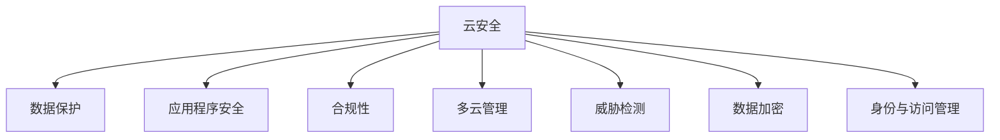

                 

# 云安全策略和合规性：保护云端数据和应用程序

> 关键词：云安全, 数据保护, 应用程序安全, 合规性, 多云管理, 威胁检测, 数据加密, 身份与访问管理

## 1. 背景介绍

在数字化转型的大背景下，越来越多的企业将业务上云，利用云计算提供的高可用性、弹性扩展、按需付费等优势，提升运营效率和业务竞争力。然而，云计算也带来了新的安全挑战和合规要求。如何构建高效、安全的云安全策略，同时确保合规，成为企业云计算架构设计中的一项关键任务。本文将系统介绍云安全策略和合规性的核心概念和实施方法，帮助企业构建健壮的云安全体系，有效保护云端数据和应用程序。

### 1.1 云安全策略的重要性
随着云技术的广泛应用，数据安全性和合规性问题愈发突出。企业在享受云服务便利的同时，也面临着云平台提供商和自身业务系统的多重安全风险。不当的云安全策略可能导致数据泄露、服务中断、法律纠纷等严重后果。因此，构建完善的云安全策略，对企业来说至关重要。

#### 1.1.1 数据泄露风险
云平台中的数据存储和管理，往往依赖第三方提供商，数据泄露风险较高。云服务提供商可能因操作失误、系统漏洞或内部恶意行为，导致数据泄漏。此外，企业内部人员的误操作也可能引发数据泄露。

#### 1.1.2 服务中断风险
云平台的服务稳定性直接影响企业的业务连续性。突发的网络攻击、自然灾害、服务商故障等事件，可能导致云服务中断，影响企业正常运营。

#### 1.1.3 法律合规风险
企业在云上存储和处理敏感数据，如个人信息、知识产权等，需要遵守《通用数据保护条例》(GDPR)、《健康保险可携性和责任法案》(HIPAA)等法律法规。如果数据处理不当，将面临高额罚款和法律诉讼风险。

## 2. 核心概念与联系

### 2.1 核心概念概述

为了更好地理解云安全策略和合规性的实施方法，本节将介绍几个密切相关的核心概念：

- **云安全(Cloud Security)**：指在云计算环境中，保护数据和应用程序免受各种威胁的保护机制和技术手段。包括身份认证与访问控制、数据加密、威胁检测与响应等。
- **数据保护(Data Protection)**：指保护数据免受未经授权的访问、泄露、破坏等行为的技术和管理措施。涵盖数据加密、数据备份、数据恢复等方面。
- **应用程序安全(Application Security)**：指保护应用程序免受网络攻击、漏洞利用的安全措施。包括代码审计、漏洞扫描、应用程序防火墙等。
- **合规性(Compliance)**：指企业必须遵循的法律法规、行业标准等规范要求。通过合规性管理，确保企业数据和应用程序的使用符合法律规定。
- **多云管理(Multicloud Management)**：指管理和优化跨多个云平台资源的能力。涵盖身份认证、访问控制、数据迁移、性能监控等方面。
- **威胁检测(Threat Detection)**：指识别和分析网络威胁的技术手段。包括入侵检测系统(IDS)、入侵防御系统(IPS)、安全信息与事件管理(SIEM)等。
- **数据加密(Data Encryption)**：指将数据转换为不可读的形式，保护数据在传输和存储过程中的安全。包括对称加密、非对称加密、哈希函数等技术。
- **身份与访问管理(Identity and Access Management, IAM)**：指管理和控制用户对系统资源的访问权限的技术和管理措施。包括单点登录(SSO)、角色基于访问控制(RBAC)、多因素认证(MFA)等。

这些核心概念之间通过以下Mermaid流程图来展示：



这个流程图展示出云安全策略的各个组成部分及其之间的联系：

1. 云安全策略通过数据保护、应用程序安全、合规性管理、多云管理、威胁检测、数据加密、身份与访问管理等手段，形成完整的安全体系。
2. 数据保护通过加密、备份等措施，保护数据免受泄露和破坏。
3. 应用程序安全通过漏洞扫描、防火墙等技术，保护应用程序免受攻击。
4. 合规性管理通过法律法规、标准规范的遵循，确保数据和应用程序的使用合法合规。
5. 多云管理通过统一身份认证、权限管理、数据迁移等技术，优化跨云平台资源的使用。
6. 威胁检测通过IDS、IPS、SIEM等工具，识别和分析潜在威胁。
7. 数据加密通过对称、非对称加密技术，保护数据在传输和存储过程中的安全。
8. 身份与访问管理通过SSO、RBAC、MFA等技术，控制用户对系统资源的访问权限。

这些核心概念共同构成了云安全策略和合规性的基础，帮助企业构建健壮的云安全体系。

## 3. 核心算法原理 & 具体操作步骤

### 3.1 算法原理概述

云安全策略和合规性的实现，主要依赖于一系列安全技术和管理机制。其核心算法原理包括以下几个方面：

- **身份与访问管理**：通过单点登录、多因素认证、角色基于访问控制(RBAC)等技术，确保只有授权用户才能访问系统和数据。
- **数据加密**：采用对称加密、非对称加密等技术，确保数据在传输和存储过程中的机密性和完整性。
- **威胁检测**：通过入侵检测系统(IDS)、入侵防御系统(IPS)、安全信息与事件管理(SIEM)等技术，实时监控网络行为，识别和响应安全威胁。
- **数据保护**：通过数据备份、数据恢复等技术，确保数据在发生灾害或意外情况时能够快速恢复。
- **合规性管理**：通过自动化的合规性审计工具，定期检查数据和应用程序的使用是否符合法律法规和行业标准。

这些技术和管理机制通过有效的集成和协调，构成了一个完整的云安全策略框架。

### 3.2 算法步骤详解

云安全策略和合规性的实施，一般包括以下几个关键步骤：

**Step 1: 确定合规要求和风险评估**
- 确定需要遵循的法律法规和行业标准，如GDPR、HIPAA等。
- 进行风险评估，识别数据和应用程序面临的安全威胁和风险。

**Step 2: 选择和配置安全技术**
- 根据风险评估结果，选择和配置相应的安全技术，如身份与访问管理、数据加密、威胁检测等。
- 确保所选技术能够满足合规性要求。

**Step 3: 实施安全措施**
- 在云平台和应用程序中实施选定的安全措施。
- 定期检查和更新安全措施，确保其有效性。

**Step 4: 监控和响应**
- 部署监控工具，实时监控系统和应用程序的安全状态。
- 对监控工具发现的异常行为进行分析和响应，采取必要的补救措施。

**Step 5: 合规性审计**
- 使用合规性审计工具，定期检查数据和应用程序的使用是否符合法律法规和行业标准。
- 根据审计结果，调整和优化安全策略。

### 3.3 算法优缺点

云安全策略和合规性的实现，具有以下优点：

1. 提高数据和应用程序的安全性。通过实施全面的安全措施，保护数据免受泄露、破坏和攻击。
2. 增强合规性。确保数据和应用程序的使用符合法律法规和行业标准，降低法律风险。
3. 提供统一的安全管理平台。通过多云管理、身份与访问管理等技术，实现跨云平台资源的安全管理。
4. 实时威胁检测和响应。通过威胁检测和响应技术，及时识别和应对潜在威胁，保障系统的安全性。

同时，这些技术和管理机制也存在一些局限性：

1. 成本高。实施全面的安全措施需要投入大量的人力和财力，初期成本较高。
2. 技术复杂。需要深入理解各类安全技术和工具，实施和维护复杂度较高。
3. 依赖第三方。云服务提供商的安全性能直接影响系统的安全性，可能存在第三方依赖。

尽管存在这些局限性，但就目前而言，云安全策略和合规性是企业云计算架构设计中的一项必要任务。通过有效的安全措施和合规管理，企业可以降低安全风险，保护数据和应用程序的安全。

### 3.4 算法应用领域

云安全策略和合规性广泛应用于多个领域，包括但不限于：

- **金融行业**：金融机构的业务数据和交易记录，涉及敏感的客户信息和交易记录，需要严格的数据保护和合规性管理。
- **医疗行业**：医疗机构存储和处理大量病人健康数据，需符合HIPAA等法规，确保数据隐私和安全。
- **政府机构**：政府部门存储和管理大量公共数据和敏感信息，需要符合GDPR等法规，保护数据隐私和安全。
- **教育行业**：教育机构存储和处理大量学生数据，需符合相关法规，确保数据隐私和安全。
- **零售行业**：零售企业存储和处理大量客户交易数据，需符合PCI-DSS等法规，保护支付信息安全。

这些领域对数据保护和合规性要求较高，云安全策略和合规性的实施显得尤为重要。

## 4. 数学模型和公式 & 详细讲解 & 举例说明

### 4.1 数学模型构建

云安全策略和合规性的实现，通常涉及多维度的数学模型。以下以数据加密为例，展示其数学模型的构建过程。

假设原始数据为 $M$，加密算法为 $E$，解密算法为 $D$，密钥为 $k$。则加密过程可以表示为：

$$
C = E(M, k)
$$

解密过程可以表示为：

$$
M' = D(C, k)
$$

其中，$C$ 为加密后的密文，$M'$ 为解密后的明文。

### 4.2 公式推导过程

对于常见的对称加密算法AES，其加密和解密公式可以表示为：

$$
C = E_K(M) = (F_k(\oplus, F_k(\oplus, M), F_k(\oplus, F_k(\oplus, M)), \ldots)
$$

$$
M' = D_K(C) = F_k^{-1}(F_k^{-1}(C))
$$

其中，$F_k$ 为轮密钥函数，$\oplus$ 为异或运算，$\oplus$ 为加密过程中使用的XOR操作。

### 4.3 案例分析与讲解

假设企业存储一个包含客户信息的敏感数据，数据量为 $M$，明文长度为 $L$，需要传输到云端进行处理。使用AES-256对称加密算法对数据进行加密，加密后的密文长度为 $C$。

1. **选择加密算法**：选择AES-256对称加密算法，因为其安全性高且计算速度快。

2. **生成密钥**：生成一个256位的随机密钥 $k$。

3. **加密数据**：使用密钥 $k$ 对数据 $M$ 进行加密，生成密文 $C$。

4. **传输密文**：将密文 $C$ 传输到云端。

5. **解密数据**：在云端使用相同的密钥 $k$ 对密文 $C$ 进行解密，生成原始数据 $M'$。

通过上述步骤，实现了数据在传输和存储过程中的加密保护，确保了数据的安全性和隐私性。

## 5. 项目实践：代码实例和详细解释说明

### 5.1 开发环境搭建

在进行云安全策略和合规性的项目实践前，我们需要准备好开发环境。以下是使用Python进行开发的环境配置流程：

1. 安装Anaconda：从官网下载并安装Anaconda，用于创建独立的Python环境。

2. 创建并激活虚拟环境：
```bash
conda create -n cloudsecurity-env python=3.8 
conda activate cloudsecurity-env
```

3. 安装Python安全库：
```bash
pip install pycryptodome
pip install requests
```

4. 安装网络安全工具：
```bash
pip install scapy
pip install sshtools
```

完成上述步骤后，即可在`cloudsecurity-env`环境中开始项目实践。

### 5.2 源代码详细实现

我们以一个简单的数据加密和解密程序为例，展示如何使用Python实现对称加密。

```python
from Crypto.Cipher import AES
from Crypto.Random import get_random_bytes
import base64

def encrypt(data, key):
    # 填充数据
    padding = AES.block_size - len(data) % AES.block_size
    data += bytes([padding]) * padding
    # 初始化加密器
    cipher = AES.new(key, AES.MODE_EAX)
    # 计算加密后的密文
    ciphertext, tag = cipher.encrypt_and_digest(data)
    return {
        "nonce": cipher.nonce,
        "ciphertext": base64.b64encode(ciphertext),
        "tag": base64.b64encode(tag)
    }

def decrypt(ciphertext, key, nonce):
    # 解码密文
    ciphertext = base64.b64decode(ciphertext["ciphertext"])
    tag = base64.b64decode(ciphertext["tag"])
    # 初始化解密器
    cipher = AES.new(key, AES.MODE_EAX, nonce=nonce)
    # 解密数据
    plaintext = cipher.decrypt_and_verify(ciphertext, tag)
    # 去除填充
    padding = plaintext[-1]
    return plaintext[:-padding]

# 示例数据和密钥
data = b"Hello, world!"
key = get_random_bytes(32)

# 加密数据
encrypted = encrypt(data, key)
print(f"加密后密文: {encrypted}")

# 解密数据
decrypted = decrypt(encrypted, key, encrypted["nonce"])
print(f"解密后明文: {decrypted}")
```

在上述代码中，我们使用了Python的Crypto库实现对称加密算法AES。通过调用encrypt和decrypt函数，实现了数据的加密和解密。

### 5.3 代码解读与分析

让我们再详细解读一下关键代码的实现细节：

**encrypt函数**：
- 接收原始数据 `data` 和密钥 `key`。
- 对原始数据进行填充，使其长度符合AES加密块大小。
- 初始化AES加密器，使用AES.MODE_EAX模式。
- 计算加密后的密文 `ciphertext` 和对应的验证标签 `tag`。
- 返回包含非加密随机数 `nonce`、密文 `ciphertext` 和验证标签 `tag` 的字典。

**decrypt函数**：
- 接收加密后的密文 `ciphertext`、密钥 `key` 和非加密随机数 `nonce`。
- 解码密文和标签，获取原始密文和标签。
- 初始化AES解密器，使用AES.MODE_EAX模式和非加密随机数 `nonce`。
- 解密数据，验证标签。
- 去除填充，返回解密后的原始数据。

**示例数据和密钥**：
- 示例数据 `data` 为"Hello, world!"。
- 密钥 `key` 通过调用Crypto库的get_random_bytes函数生成。

**加密数据**：
- 调用encrypt函数对示例数据进行加密，输出包含密文和非加密随机数的字典。
- 输出加密后的密文。

**解密数据**：
- 调用decrypt函数对密文进行解密，输出解密后的原始数据。
- 输出解密后的明文。

通过上述代码实现，我们可以实现数据的对称加密和解密，确保数据在传输和存储过程中的安全性。

## 6. 实际应用场景

### 6.1 金融行业

在金融行业，保护客户信息、交易记录等敏感数据至关重要。企业可以通过实施云安全策略和合规性措施，确保数据在传输和存储过程中的安全。具体措施包括：

- **身份与访问管理**：使用多因素认证、RBAC等技术，严格控制对敏感数据的访问权限。
- **数据加密**：对交易记录、客户信息等敏感数据进行对称或非对称加密，确保数据在传输和存储过程中的机密性和完整性。
- **威胁检测**：部署IDS、IPS、SIEM等工具，实时监控交易行为，识别和响应潜在的安全威胁。
- **合规性管理**：定期进行合规性审计，确保数据处理符合GDPR、HIPAA等法规要求。

### 6.2 医疗行业

医疗行业涉及大量敏感的病人健康数据，需要严格的数据保护和合规性管理。具体措施包括：

- **数据加密**：对病人健康数据进行加密存储，确保数据在传输和存储过程中的机密性和完整性。
- **身份与访问管理**：使用SSO、RBAC等技术，严格控制对健康数据的访问权限。
- **威胁检测**：部署IDS、IPS、SIEM等工具，实时监控系统行为，识别和响应潜在的安全威胁。
- **合规性管理**：定期进行合规性审计，确保数据处理符合HIPAA等法规要求。

### 6.3 政府机构

政府机构存储和管理大量公共数据和敏感信息，需要严格的数据保护和合规性管理。具体措施包括：

- **数据加密**：对政府数据进行加密存储，确保数据在传输和存储过程中的机密性和完整性。
- **身份与访问管理**：使用单点登录、RBAC等技术，严格控制对敏感数据的访问权限。
- **威胁检测**：部署IDS、IPS、SIEM等工具，实时监控系统行为，识别和响应潜在的安全威胁。
- **合规性管理**：定期进行合规性审计，确保数据处理符合GDPR等法规要求。

## 7. 工具和资源推荐

### 7.1 学习资源推荐

为了帮助开发者系统掌握云安全策略和合规性的理论基础和实践技巧，这里推荐一些优质的学习资源：

1. **《云安全》系列书籍**：详细介绍云安全策略和合规性的基本概念和实施方法，涵盖身份与访问管理、数据加密、威胁检测等多个方面。

2. **《合规性管理》课程**：从法规、标准、审计等多个角度讲解合规性管理的实施方法和最佳实践。

3. **《网络安全基础》课程**：介绍网络安全的基本概念和关键技术，包括身份认证、访问控制、加密技术等。

4. **《云安全认证》认证培训**：提供云安全认证培训和考试，帮助开发者提升云安全技能，获得官方认证。

5. **《云安全社区》论坛**：汇聚云安全领域的专家和开发者，提供技术交流、问题解答和资源共享的平台。

通过对这些资源的学习实践，相信你一定能够快速掌握云安全策略和合规性的精髓，并用于解决实际的云安全问题。

### 7.2 开发工具推荐

高效的开发离不开优秀的工具支持。以下是几款用于云安全策略和合规性开发的常用工具：

1. **AWS Security Hub**：提供云安全合规性管理、威胁检测、漏洞管理等服务，支持多云资源管理。

2. **Google Cloud Security Command Center**：提供身份与访问管理、威胁检测、数据保护等服务，支持跨云平台资源管理。

3. **Microsoft Azure Security Center**：提供身份与访问管理、威胁检测、合规性管理等服务，支持混合云资源管理。

4. **OpenSSL**：提供强大的加密算法和工具库，支持对称加密、非对称加密、数字证书等。

5. **scapy**：网络安全审计和渗透测试工具，支持数据包捕获、协议分析和漏洞检测。

6. **sshtools**：SSH工具库，支持安全连接和密钥管理，确保远程连接的安全性。

合理利用这些工具，可以显著提升云安全策略和合规性开发的效率，加快创新迭代的步伐。

### 7.3 相关论文推荐

云安全策略和合规性发展源于学界的持续研究。以下是几篇奠基性的相关论文，推荐阅读：

1. **《云安全架构设计》**：介绍云安全策略和合规性架构设计的基本方法和关键技术，涵盖身份与访问管理、数据加密、威胁检测等多个方面。

2. **《云合规性管理》**：从法规、标准、审计等多个角度，讲解合规性管理的实施方法和最佳实践。

3. **《云安全威胁检测》**：介绍入侵检测系统(IDS)、入侵防御系统(IPS)、安全信息与事件管理(SIEM)等工具的工作原理和应用场景。

4. **《云安全加密技术》**：详细介绍对称加密、非对称加密、哈希函数等加密算法的工作原理和实现方法。

5. **《云安全审计》**：讲解合规性审计工具的实现方法和应用场景，提供合规性管理的技术解决方案。

这些论文代表了大数据安全和合规性的发展脉络。通过学习这些前沿成果，可以帮助研究者把握学科前进方向，激发更多的创新灵感。

## 8. 总结：未来发展趋势与挑战

### 8.1 总结

本文对云安全策略和合规性的核心概念和实施方法进行了全面系统的介绍。首先阐述了云安全策略和合规性的重要性，明确了其在保护云端数据和应用程序中的关键作用。其次，从原理到实践，详细讲解了云安全策略和合规性的数学模型和实现方法，给出了云安全策略和合规性任务的完整代码实例。同时，本文还广泛探讨了云安全策略和合规性在金融、医疗、政府等多个行业领域的应用前景，展示了云安全策略和合规性的巨大潜力。此外，本文精选了云安全策略和合规性的各类学习资源，力求为读者提供全方位的技术指引。

通过本文的系统梳理，可以看到，云安全策略和合规性正在成为企业云计算架构设计中的一项关键任务。通过有效的安全措施和合规管理，企业可以降低安全风险，保护数据和应用程序的安全。未来，伴随云技术的不断演进，云安全策略和合规性将面临更多的挑战和机遇。

### 8.2 未来发展趋势

展望未来，云安全策略和合规性将呈现以下几个发展趋势：

1. **多云资源统一管理**：随着云技术的普及，企业将面临多云平台资源的统一管理和优化。多云管理平台将提供统一的身份认证、访问控制、数据迁移、性能监控等功能，实现跨云平台的无缝协同。

2. **实时威胁检测与响应**：未来将进一步提升威胁检测和响应的实时性和准确性。通过引入机器学习、人工智能等技术，实现威胁检测自动化，提高威胁响应的效率和效果。

3. **合规性自动化**：通过自动化的合规性审计工具，定期检查数据和应用程序的使用是否符合法律法规和行业标准。自动化工具将大大减少合规性管理的人力和时间成本，提高合规性管理的效率。

4. **隐私保护技术发展**：随着隐私保护法规的日益严格，隐私保护技术将得到快速发展。数据脱敏、差分隐私等技术将广泛应用于云安全策略和合规性中，保护用户隐私和数据安全。

5. **区块链技术应用**：区块链技术将为云安全策略和合规性提供新的解决方案。通过区块链技术，可以实现数据透明、不可篡改和去中心化的管理，增强数据和应用程序的安全性。

这些趋势凸显了云安全策略和合规性的广阔前景。这些方向的探索发展，将进一步提升云安全策略和合规性的性能和应用范围，为构建安全、可靠、可控的云平台提供新的技术支持。

### 8.3 面临的挑战

尽管云安全策略和合规性已经取得了一定的进展，但在迈向更加智能化、普适化应用的过程中，仍面临诸多挑战：

1. **跨云平台兼容性问题**：不同的云平台提供的API、工具和服务可能存在兼容性问题，影响多云管理的效率和效果。

2. **数据隐私和安全风险**：云平台中的数据隐私和安全风险依然存在，如何在云上存储和管理敏感数据，保护数据隐私和安全，仍是一个重要问题。

3. **技术复杂性增加**：随着云安全策略和合规性的不断发展，涉及的技术和工具也日益复杂，如何有效地管理和维护这些技术和工具，提高系统性能和稳定性，需要更多的努力。

4. **法律法规更新频繁**：随着法律法规的不断更新和完善，企业需要持续关注和更新合规性管理策略，以确保数据和应用程序的使用符合最新的法律法规要求。

5. **成本高**：实施全面的云安全策略和合规性措施需要投入大量的人力和财力，初期成本较高，需要企业在资源分配和预算管理上做出合理规划。

尽管存在这些挑战，但随着云计算技术的不断成熟和完善，云安全策略和合规性仍具有广阔的发展前景。企业需要积极应对并寻求突破，才能构建安全、可靠、可控的云平台，为数字化转型提供坚实的技术保障。

### 8.4 研究展望

面对云安全策略和合规性所面临的挑战，未来的研究需要在以下几个方面寻求新的突破：

1. **自动化和智能化**：开发更加自动化的云安全策略和合规性工具，减少人工干预，提高系统自动化和智能化水平。

2. **跨平台协同管理**：研究跨云平台资源管理的最佳实践，提高多云管理的效率和效果。

3. **隐私保护技术**：探索数据脱敏、差分隐私等隐私保护技术，增强数据隐私和安全保护能力。

4. **区块链技术应用**：研究区块链技术在云安全策略和合规性中的应用，提高数据透明性和安全性。

5. **合规性管理框架**：开发更加灵活的合规性管理框架，适应不同行业和法规要求，提高合规性管理的适应性和灵活性。

6. **威胁检测与响应**：引入机器学习和人工智能技术，提高威胁检测的实时性和准确性，增强威胁响应的自动化和智能化水平。

这些研究方向的探索，必将引领云安全策略和合规性技术迈向更高的台阶，为构建安全、可靠、可控的云平台提供新的技术支持。面向未来，云安全策略和合规性需要与其他人工智能技术进行更深入的融合，如知识表示、因果推理、强化学习等，协同发力，共同推动云安全策略和合规性的进步。只有勇于创新、敢于突破，才能不断拓展云安全策略和合规性的边界，让云计算技术更好地服务于社会和企业。

## 9. 附录：常见问题与解答

**Q1: 什么是云安全策略和合规性？**

A: 云安全策略和合规性是企业在云计算环境中，保护数据和应用程序免受各种威胁的保护机制和技术手段，同时确保数据和应用程序的使用符合法律法规和行业标准的要求。

**Q2: 云安全策略和合规性在实施过程中需要注意哪些问题？**

A: 在实施云安全策略和合规性时，需要注意以下问题：

1. 选择合适的安全技术和工具，确保其能够满足合规性要求。
2. 定期进行合规性审计，及时发现和修复潜在的安全漏洞。
3. 部署监控工具，实时监控系统和应用程序的安全状态，及时响应潜在的安全威胁。
4. 建立完善的应急响应机制，快速应对安全事件，减少损失。

**Q3: 如何降低云安全策略和合规性实施的成本？**

A: 降低云安全策略和合规性实施的成本，可以从以下几个方面入手：

1. 选择开源的云安全工具和框架，降低软件采购成本。
2. 采用多云管理平台，减少跨平台管理和维护的成本。
3. 使用自动化的安全策略和合规性审计工具，提高系统管理效率，减少人力投入。
4. 定期评估和优化云安全策略和合规性措施，避免不必要的资源浪费。

**Q4: 如何保障云平台中的数据隐私和安全？**

A: 保障云平台中的数据隐私和安全，可以采取以下措施：

1. 实施数据加密，确保数据在传输和存储过程中的机密性和完整性。
2. 控制对数据的访问权限，确保只有授权用户能够访问和修改数据。
3. 部署入侵检测和防御系统，实时监控系统行为，及时发现和响应潜在的安全威胁。
4. 定期进行合规性审计，确保数据处理符合法律法规和行业标准要求。

**Q5: 如何应对跨云平台兼容性问题？**

A: 应对跨云平台兼容性问题，可以采取以下措施：

1. 选择兼容性较好的云平台，减少不同平台之间的差异。
2. 使用多云管理平台，统一管理跨平台资源，减少兼容性的问题。
3. 开发跨平台兼容的API和工具，提高多云管理的效率和效果。

通过上述问题的详细解答，相信你对云安全策略和合规性的理解会更加深入，能够在实际工作中更好地应用这些知识和技术。

---

作者：禅与计算机程序设计艺术 / Zen and the Art of Computer Programming

