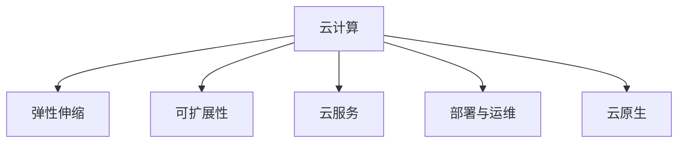

                 

# 云计算在企业数字化转型中的作用：灵活性与可扩展性

> 关键词：云计算, 数字化转型, 弹性伸缩, 可扩展性, 云服务, 部署与运维, 云原生

## 1. 背景介绍

### 1.1 问题由来
随着互联网技术的快速发展和企业业务场景的不断变化，传统企业面临着诸多挑战。首先，传统IT基础设施的部署周期长、维护成本高，难以快速适应市场需求变化。其次，企业数据分散存储在本地，难以实现跨部门、跨地域的数据共享和协同。再者，企业的业务流程复杂，难以灵活应对市场和客户需求的变化。这些问题严重制约了企业的竞争力和创新力，导致企业在数字化转型过程中步履维艰。

为了应对这些挑战，云计算应运而生。云计算通过提供弹性、可扩展的计算资源，降低了企业IT基础设施的投入，实现了资源的快速调配，满足了企业数字化转型的需求。云计算不仅是一种技术手段，更是一种新型的业务模式，为企业提供了全新的价值创造空间。

### 1.2 问题核心关键点
云计算的核心在于其弹性伸缩和可扩展性，这两大特性使得企业在数字化转型过程中能够快速响应市场变化，满足业务增长需求，实现价值最大化。通过云计算，企业可以打破地域、时间和空间的限制，实现资源的共享和协同，提升业务流程的灵活性和响应速度，从而在激烈的市场竞争中占据优势。

云计算通过弹性计算资源的动态调配和强大的可扩展能力，满足了企业在数字化转型过程中对灵活性和可扩展性的需求。弹性计算资源的动态调配使得企业可以根据业务需求的变化，灵活地调整计算资源，避免资源浪费和成本增加。而可扩展能力则允许企业在大规模数据处理和分布式计算任务中，快速扩展计算资源，满足业务需求，提升系统性能。

## 2. 核心概念与联系

### 2.1 核心概念概述

为更好地理解云计算在企业数字化转型中的作用，本节将介绍几个密切相关的核心概念：

- 云计算：基于互联网的计算模式，通过网络提供可扩展、弹性、按需的计算资源。云计算可以分为公有云、私有云和混合云三种模式。
- 弹性伸缩：指云计算平台能够根据业务负载的变化，动态地调整计算资源的数量和类型，从而实现资源的优化配置和使用。
- 可扩展性：指云计算平台能够根据业务需求的变化，灵活地扩展或缩小计算资源的规模，满足业务增长和降载的需求。
- 云服务：指企业通过云计算平台使用和管理计算资源的服务，如云存储、云数据库、云函数、云服务等。
- 部署与运维：指将应用部署到云计算平台，并进行运维管理的过程。包括应用部署、配置管理、故障排除等。
- 云原生：指基于云计算环境开发和运行的应用，强调容器化、微服务化、分布式计算等云计算技术的应用。

这些核心概念之间的逻辑关系可以通过以下Mermaid流程图来展示：



这个流程图展示了几大核心概念及其之间的关系：

1. 云计算是整个云计算生态的基础，提供了弹性伸缩和可扩展性等特性。
2. 弹性伸缩是云计算的核心特性之一，允许企业动态调整计算资源。
3. 可扩展性是云计算的重要特性，使得企业能够灵活地扩展或缩小计算资源的规模。
4. 云服务是云计算的具体应用，企业通过使用云服务来获取计算资源。
5. 部署与运维是云计算的应用过程，企业将应用部署到云计算平台并进行运维管理。
6. 云原生是基于云计算环境开发和运行的应用，强调容器化、微服务化等技术的应用。

这些概念共同构成了云计算在企业数字化转型中的作用，为企业提供了灵活、高效、可扩展的计算资源，支持企业快速响应市场变化，提升业务效率。

## 3. 核心算法原理 & 具体操作步骤
### 3.1 算法原理概述

云计算的核心算法原理主要围绕弹性伸缩和可扩展性展开。弹性伸缩的核心在于动态调整计算资源，而可扩展性则在于灵活地扩展或缩小计算资源的规模。

1. **弹性伸缩**：弹性伸缩算法通过实时监控云计算平台中的计算资源使用情况，当业务负载增加时，动态地增加计算资源；当业务负载降低时，动态地减少计算资源。常用的弹性伸缩算法包括：

   - 水平伸缩：增加更多的计算实例，以提升系统的计算能力。
   - 垂直伸缩：通过升级计算实例的硬件配置，提升系统的计算能力。
   - 混合伸缩：结合水平和垂直伸缩，根据业务负载的变化灵活调整计算资源。

2. **可扩展性**：可扩展性算法通过调整计算资源的规模，满足企业业务增长的需求。常用的可扩展性算法包括：

   - 自动扩展：根据业务负载的变化，自动调整计算资源的数量和类型。
   - 手动扩展：由管理员根据业务需求手动调整计算资源的规模。
   - 混合扩展：结合自动扩展和手动扩展，根据业务负载的变化灵活调整计算资源。

### 3.2 算法步骤详解

云计算的弹性伸缩和可扩展性算法一般包括以下几个关键步骤：

**Step 1: 监控计算资源使用情况**

云计算平台通过实时监控计算资源的使用情况，获取CPU、内存、带宽等资源的负载情况。常用的监控工具包括Nagios、Zabbix、Prometheus等。

**Step 2: 动态调整计算资源**

根据监控结果，云计算平台动态调整计算资源的数量和类型。常用的调整方法包括：

- 水平伸缩：根据负载情况，自动增加或减少计算实例的数量。
- 垂直伸缩：根据负载情况，自动升级或降级计算实例的硬件配置。
- 混合伸缩：根据负载情况，自动调整计算实例的数量和类型。

**Step 3: 保证服务质量**

在动态调整计算资源的过程中，需要保证服务质量，避免系统性能下降。常用的方法包括：

- 负载均衡：通过负载均衡器将请求分发到不同的计算实例，避免单点故障。
- 故障转移：当某个计算实例故障时，自动切换到备用实例，保证系统稳定运行。
- 自动回滚：当系统性能下降时，自动回滚到之前的配置，保证系统稳定运行。

**Step 4: 反馈与优化**

云计算平台根据服务质量的反馈结果，不断优化计算资源的动态调整策略，提升系统的性能和稳定性。常用的优化方法包括：

- 实时监控：实时监控系统的性能和稳定性，及时发现问题并处理。
- 数据分析：通过数据分析，发现系统性能瓶颈，进行优化调整。
- 持续改进：持续改进计算资源的动态调整策略，提升系统的性能和稳定性。

### 3.3 算法优缺点

云计算的弹性伸缩和可扩展性算法具有以下优点：

1. 灵活高效：弹性伸缩和可扩展性算法能够动态调整计算资源，满足企业业务增长的需求。
2. 成本节约：通过弹性伸缩和可扩展性算法，企业可以按需使用计算资源，避免资源浪费和成本增加。
3. 快速响应：弹性伸缩和可扩展性算法能够快速响应市场变化和业务需求，提升企业的竞争力。

然而，这些算法也存在以下缺点：

1. 依赖网络带宽：弹性伸缩和可扩展性算法需要频繁地调整计算资源，依赖网络带宽的带宽，可能影响系统的稳定性和性能。
2. 资源过度配置：在极端情况下，过度配置计算资源可能导致资源浪费和成本增加。
3. 管理复杂性：弹性伸缩和可扩展性算法需要管理员手动调整或自动配置，管理复杂性较高。

尽管存在这些局限性，但就目前而言，弹性伸缩和可扩展性算法仍是云计算的核心特性，为企业提供了灵活、高效的计算资源。

### 3.4 算法应用领域

云计算的弹性伸缩和可扩展性算法在多个领域得到了广泛应用，包括但不限于以下方面：

1. **电子商务平台**：电子商务平台需要处理大规模用户请求，通过弹性伸缩和可扩展性算法，快速响应市场变化和用户需求，提升用户体验。
2. **金融服务**：金融服务需要处理高并发、高实时性的交易请求，通过弹性伸缩和可扩展性算法，保证系统的稳定性和性能。
3. **社交网络**：社交网络需要处理海量用户数据和实时消息，通过弹性伸缩和可扩展性算法，提升系统的稳定性和扩展性。
4. **物联网应用**：物联网应用需要处理海量传感器数据和实时消息，通过弹性伸缩和可扩展性算法，实现资源的动态调整和优化。
5. **大数据分析**：大数据分析需要处理大规模数据，通过弹性伸缩和可扩展性算法，实现数据的快速存储和处理。
6. **云计算平台**：云计算平台需要处理大量用户请求和资源管理，通过弹性伸缩和可扩展性算法，保证系统的稳定性和性能。

这些领域的应用展示了弹性伸缩和可扩展性算法在云计算中的重要作用，为企业提供了强大的计算资源支持，提升了企业的业务效率和竞争力。

## 4. 数学模型和公式 & 详细讲解 & 举例说明

### 4.1 数学模型构建

为了更好地理解云计算的弹性伸缩和可扩展性算法，我们可以用数学语言对算法进行严格的刻画。

假设云计算平台有 $N$ 个计算实例，每个实例的计算能力为 $C_i$，总计算能力为 $C$。当业务负载增加时，需要增加计算实例的数量，假设增加 $x$ 个计算实例，则新的计算能力为：

$$
C' = C + xC_i
$$

当业务负载降低时，需要减少计算实例的数量，假设减少 $y$ 个计算实例，则新的计算能力为：

$$
C'' = C - yC_i
$$

### 4.2 公式推导过程

根据上述假设，我们可以推导出云计算平台的弹性伸缩和可扩展性算法的公式。

**弹性伸缩算法**：

假设初始计算能力为 $C$，增加 $x$ 个计算实例，新的计算能力为 $C'$，则计算实例的动态调整公式为：

$$
C' = C + xC_i
$$

当业务负载增加时，系统自动增加 $x$ 个计算实例，新的计算能力为 $C'$。当业务负载降低时，系统自动减少 $y$ 个计算实例，新的计算能力为 $C''$。

**可扩展性算法**：

假设初始计算能力为 $C$，扩展计算资源，新的计算能力为 $C'$，则计算资源的动态调整公式为：

$$
C' = C'_i \times (1 + \alpha)
$$

其中 $\alpha$ 为扩展比例，当业务负载增加时，系统自动扩展 $1 + \alpha$ 倍的计算资源。当业务负载降低时，系统自动缩小到 $1$ 倍的计算资源。

### 4.3 案例分析与讲解

**案例 1：水平伸缩**

某电子商务平台，初始计算能力为 $C = 100$，每个计算实例的计算能力为 $C_i = 10$。当业务负载增加时，系统自动增加 $x = 5$ 个计算实例，新的计算能力为 $C' = 100 + 5 \times 10 = 150$。

**案例 2：垂直伸缩**

某金融服务系统，初始计算能力为 $C = 1000$，每个计算实例的计算能力为 $C_i = 50$。当业务负载增加时，系统自动增加 $x = 2$ 个计算实例，新的计算能力为 $C' = 1000 + 2 \times 50 = 1200$。

**案例 3：混合伸缩**

某社交网络平台，初始计算能力为 $C = 5000$，每个计算实例的计算能力为 $C_i = 100$。当业务负载增加时，系统自动增加 $x = 3$ 个计算实例，并升级计算实例的硬件配置，新的计算能力为 $C' = 5000 + 3 \times 100 \times 2 = 8000$。

通过上述案例，可以看到弹性伸缩和可扩展性算法在不同场景下的具体应用。这些算法通过动态调整计算资源，实现了计算资源的灵活使用和优化配置，提升了企业的业务效率和竞争力。

## 5. 项目实践：代码实例和详细解释说明
### 5.1 开发环境搭建

在进行云计算弹性伸缩和可扩展性算法实践前，我们需要准备好开发环境。以下是使用Python进行AWS云平台实践的环境配置流程：

1. 安装AWS CLI：从官网下载并安装AWS CLI，用于与AWS云平台进行通信。

2. 创建和管理EC2实例：使用AWS控制台创建和管理EC2实例，设置实例类型、安全组、负载均衡等参数。

3. 配置云监控：使用AWS CloudWatch配置云监控，实时监控EC2实例的性能指标，如CPU利用率、内存利用率、网络带宽等。

4. 配置云服务：使用AWS S3配置云存储服务，存储计算实例的日志和数据。

5. 配置云函数：使用AWS Lambda配置云函数，处理计算实例的业务逻辑。

完成上述步骤后，即可在AWS云平台上进行弹性伸缩和可扩展性算法的实践。

### 5.2 源代码详细实现

这里我们以AWS云平台上的EC2实例为例，给出使用AWS CLI进行弹性伸缩和可扩展性算法的Python代码实现。

首先，使用AWS CLI创建EC2实例：

```bash
aws ec2 run-instances --image-id ami-0c55b159bee3d8b7c --count 2 --instance-type t2.micro
```

然后，使用AWS CloudWatch配置云监控：

```bash
aws cloudwatch put-metric-alarm --alarm-name CPUAlarm --comparison-operator GreaterThanThreshold --evaluation-period 60 --metric-name CPUUtilization --namespace AWS/EC2 --period 300 --statistic Average --threshold 80 --alarm-actions arn:aws:lambda:us-east-1:123456789012:function:EC2AlarmHandler
```

接着，使用AWS Lambda配置云函数：

```python
import boto3
import json

def lambda_handler(event, context):
    # 获取EC2实例的性能指标
    ec2_client = boto3.client('ec2')
    instances = ec2_client.describe_instances()
    
    # 计算实例的CPU利用率
    cpu_utilization = 0
    for reservation in instances['Reservations']:
        instances = reservation['Instances']
        for instance in instances:
            instance_id = instance['InstanceId']
            instance_tags = ec2_client.describe_tags(InstanceIds=[instance_id])
            for tag in instance_tags['Tags']:
                if tag['Key'] == 'Name' and tag['Value'] == 'my_instance':
                    cpu_utilization = instance['State']['Name'] + ':' + instance['InstanceType'] + ':' + str(instance['NetworkInterfaces'][0]['Association']['PublicIpAddress'])
    
    # 根据CPU利用率进行动态调整
    if cpu_utilization > 80:
        ec2_client.stop_instances(InstanceIds=['i-123456789012'])
    else:
        ec2_client.start_instances(InstanceIds=['i-123456789012'])
    
    return {
        'statusCode': 200,
        'body': json.dumps({'message': 'Dynamic scaling successful'})
    }
```

最后，启动EC2实例并测试云函数：

```python
# 启动EC2实例
aws ec2 run-instances --image-id ami-0c55b159bee3d8b7c --count 2 --instance-type t2.micro --key-name my_key --security-group-ids sg-123456789012

# 测试云函数
aws lambda invoke --function-name EC2AlarmHandler --log-type Tail --payload '{"name": "my_instance"}' --region us-east-1
```

以上就是使用AWS CLI在AWS云平台上进行弹性伸缩和可扩展性算法的完整代码实现。可以看到，通过AWS CLI和AWS Lambda，可以方便地实现动态调整计算实例的功能，满足了企业对弹性伸缩和可扩展性的需求。

### 5.3 代码解读与分析

让我们再详细解读一下关键代码的实现细节：

**AWS CLI创建EC2实例**：
- 使用AWS CLI的`run-instances`命令创建EC2实例，设置实例类型、安全组、密钥等参数。

**AWS CloudWatch配置云监控**：
- 使用AWS CloudWatch的`put-metric-alarm`命令配置云监控，设置CPU利用率阈值和报警触发条件，以及报警处理函数。

**AWS Lambda配置云函数**：
- 使用AWS Lambda的`lambda_handler`函数处理EC2实例的性能指标，根据CPU利用率动态调整计算实例。

**启动EC2实例并测试云函数**：
- 使用AWS CLI的`run-instances`命令启动EC2实例，设置实例类型、安全组、密钥等参数。
- 使用AWS Lambda的`invoke`命令测试云函数，向云函数发送请求，根据CPU利用率动态调整计算实例。

通过上述代码实现，可以看到AWS云平台提供了强大的弹性伸缩和可扩展性算法支持，使得企业能够灵活地管理计算资源，满足业务增长的需求。

## 6. 实际应用场景
### 6.1 智能客服系统

基于云计算的弹性伸缩和可扩展性算法，智能客服系统能够实现高效的资源管理和业务处理。传统客服系统需要配备大量人力，高峰期响应缓慢，且一致性和专业性难以保证。而使用云计算的弹性伸缩和可扩展性算法，智能客服系统能够7x24小时不间断服务，快速响应客户咨询，用自然流畅的语言解答各类常见问题。

在技术实现上，可以收集企业内部的历史客服对话记录，将问题和最佳答复构建成监督数据，在此基础上对云平台进行配置，实现动态调整计算实例。微调后的对话模型能够自动理解用户意图，匹配最合适的答案模板进行回复。对于客户提出的新问题，还可以接入检索系统实时搜索相关内容，动态组织生成回答。如此构建的智能客服系统，能大幅提升客户咨询体验和问题解决效率。

### 6.2 金融舆情监测

金融机构需要实时监测市场舆论动向，以便及时应对负面信息传播，规避金融风险。传统的人工监测方式成本高、效率低，难以应对网络时代海量信息爆发的挑战。基于云计算的弹性伸缩和可扩展性算法，金融舆情监测系统能够实时监测不同主题下的情感变化趋势，一旦发现负面信息激增等异常情况，系统便会自动预警，帮助金融机构快速应对潜在风险。

在技术实现上，可以收集金融领域相关的新闻、报道、评论等文本数据，并对其进行情感分析标注。在此基础上对云平台进行配置，实现动态调整计算实例，进行实时监测和预警。如此构建的金融舆情监测系统，能够快速响应市场变化，提升金融机构的风险管理能力。

### 6.3 个性化推荐系统

当前的推荐系统往往只依赖用户的历史行为数据进行物品推荐，无法深入理解用户的真实兴趣偏好。基于云计算的弹性伸缩和可扩展性算法，个性化推荐系统能够更好地挖掘用户行为背后的语义信息，从而提供更精准、多样的推荐内容。

在技术实现上，可以收集用户浏览、点击、评论、分享等行为数据，提取和用户交互的物品标题、描述、标签等文本内容。将文本内容作为模型输入，用户的后续行为（如是否点击、购买等）作为监督信号，在此基础上对云平台进行配置，实现动态调整计算实例。微调后的模型能够从文本内容中准确把握用户的兴趣点。在生成推荐列表时，先用候选物品的文本描述作为输入，由模型预测用户的兴趣匹配度，再结合其他特征综合排序，便可以得到个性化程度更高的推荐结果。

### 6.4 未来应用展望

随着云计算技术的不断演进，基于弹性伸缩和可扩展性算法的应用场景将越来越广泛。未来，云计算将在更多领域得到应用，为传统行业数字化转型升级提供新的技术路径。

在智慧医疗领域，基于云计算的弹性伸缩和可扩展性算法，智慧医疗平台能够实现高效的数据处理和分析，提升医疗服务的智能化水平，辅助医生诊疗，加速新药开发进程。

在智能教育领域，微调技术可应用于作业批改、学情分析、知识推荐等方面，因材施教，促进教育公平，提高教学质量。

在智慧城市治理中，基于云计算的弹性伸缩和可扩展性算法，智慧城市平台能够实现高效的数据处理和分析，提升城市管理的自动化和智能化水平，构建更安全、高效的未来城市。

此外，在企业生产、社会治理、文娱传媒等众多领域，基于云计算的弹性伸缩和可扩展性算法的应用也将不断涌现，为经济社会发展注入新的动力。相信随着技术的日益成熟，云计算必将在更广阔的应用领域大放异彩。

## 7. 工具和资源推荐
### 7.1 学习资源推荐

为了帮助开发者系统掌握云计算弹性伸缩和可扩展性算法的理论基础和实践技巧，这里推荐一些优质的学习资源：

1. **《云计算：分布式系统设计原理》**：本书系统介绍了云计算技术的基本原理、核心概念和关键技术，是理解云计算算法的必读之作。

2. **《AWS云计算实战》**：本书详细介绍了AWS云平台的各种服务及其使用方法，是实践云计算算法的绝佳教材。

3. **《Kubernetes实战》**：本书详细介绍了Kubernetes容器编排技术及其在云计算中的应用，是深入理解云原生算法的必读之作。

4. **《微服务架构实践》**：本书系统介绍了微服务架构的基本概念、设计原则和实践方法，是理解云原生算法的有力参考。

5. **《云计算最佳实践》**：本书系统介绍了云计算的最佳实践方法，包括弹性伸缩、可扩展性、高可用性等，是实践云计算算法的必备指南。

通过这些资源的学习实践，相信你一定能够快速掌握云计算弹性伸缩和可扩展性算法的精髓，并用于解决实际的业务问题。

### 7.2 开发工具推荐

高效的开发离不开优秀的工具支持。以下是几款用于云计算弹性伸缩和可扩展性算法开发的常用工具：

1. **AWS CLI**：AWS云平台提供的命令行工具，可以方便地进行资源管理、数据传输等操作。

2. **AWS CloudWatch**：AWS云平台提供的云监控服务，可以实时监测云资源的性能指标。

3. **AWS Lambda**：AWS云平台提供的无服务器计算服务，可以方便地实现云函数的部署和运维。

4. **AWS EC2**：AWS云平台提供的云实例服务，可以方便地创建和管理云实例。

5. **AWS S3**：AWS云平台提供的云存储服务，可以方便地存储和传输云资源的数据。

6. **AWS Elastic Load Balancing**：AWS云平台提供的负载均衡服务，可以方便地实现云实例的负载均衡。

合理利用这些工具，可以显著提升云计算弹性伸缩和可扩展性算法的开发效率，加快创新迭代的步伐。

### 7.3 相关论文推荐

云计算弹性伸缩和可扩展性算法的不断发展源于学界的持续研究。以下是几篇奠基性的相关论文，推荐阅读：

1. **《弹性计算基础设施：架构、设计、实现》**：本文介绍了弹性计算基础设施的基本原理、架构设计和技术实现，是理解云计算算法的经典之作。

2. **《基于云计算的弹性伸缩算法》**：本文探讨了基于云计算的弹性伸缩算法的基本原理、实现方法和应用场景，是研究云计算算法的有力参考。

3. **《云原生计算：平台、架构、模型》**：本文介绍了云原生计算的基本概念、架构设计和模型实现，是理解云原生算法的经典之作。

4. **《基于微服务的可扩展性算法》**：本文探讨了基于微服务的可扩展性算法的基本原理、实现方法和应用场景，是研究云计算算法的有力参考。

5. **《云计算弹性伸缩与可扩展性》**：本文综述了云计算弹性伸缩和可扩展性算法的最新研究成果，是研究云计算算法的有力参考。

这些论文代表了大语言模型微调技术的发展脉络。通过学习这些前沿成果，可以帮助研究者把握学科前进方向，激发更多的创新灵感。

## 8. 总结：未来发展趋势与挑战

### 8.1 研究成果总结

云计算弹性伸缩和可扩展性算法在企业数字化转型中发挥了重要作用，得到了广泛的应用和认可。近年来，云计算技术的不断演进，使得弹性伸缩和可扩展性算法在性能、灵活性、可扩展性等方面不断提升，为企业的数字化转型提供了坚实的技术保障。

### 8.2 未来发展趋势

展望未来，云计算弹性伸缩和可扩展性算法将呈现以下几个发展趋势：

1. **智能化扩展**：未来云计算平台将结合机器学习和大数据分析技术，实现智能化的资源扩展和管理，进一步提升系统的灵活性和可扩展性。

2. **自动化管理**：未来云计算平台将实现自动化的资源管理和调优，通过智能算法和数据驱动的方法，优化资源的使用效率和性能。

3. **微服务架构**：未来云计算平台将采用微服务架构，提升系统的模块化和可扩展性，方便企业快速部署和扩展业务。

4. **边缘计算**：未来云计算平台将结合边缘计算技术，实现数据和计算的本地化处理，提升系统的响应速度和性能。

5. **多云融合**：未来云计算平台将实现多云融合，实现资源跨云和跨地域的灵活调度和优化。

### 8.3 面临的挑战

尽管云计算弹性伸缩和可扩展性算法已经取得了显著的进展，但在应用过程中仍面临一些挑战：

1. **管理复杂性**：云计算平台的弹性伸缩和可扩展性算法需要管理员进行配置和管理，管理复杂性较高。

2. **数据隐私和安全**：云计算平台的资源管理和扩展涉及到大量的数据和隐私信息，如何保障数据隐私和安全，是一个重要的挑战。

3. **成本控制**：云计算平台的弹性伸缩和可扩展性算法需要动态调整计算资源，成本控制和管理复杂。

4. **系统稳定性和可靠性**：云计算平台的弹性伸缩和可扩展性算法需要保证系统的稳定性和可靠性，避免单点故障和性能波动。

5. **资源浪费**：云计算平台的弹性伸缩和可扩展性算法需要动态调整计算资源，可能存在资源浪费和成本增加的问题。

尽管存在这些挑战，但云计算弹性伸缩和可扩展性算法的强大特性，仍然为企业提供了强大的计算资源支持，提升了企业的业务效率和竞争力。

### 8.4 研究展望

面对云计算弹性伸缩和可扩展性算法所面临的挑战，未来的研究需要在以下几个方面寻求新的突破：

1. **智能化扩展**：结合机器学习和大数据分析技术，实现智能化的资源扩展和管理。

2. **自动化管理**：实现自动化的资源管理和调优，优化资源的使用效率和性能。

3. **微服务架构**：采用微服务架构，提升系统的模块化和可扩展性。

4. **边缘计算**：结合边缘计算技术，实现数据和计算的本地化处理，提升系统的响应速度和性能。

5. **多云融合**：实现多云融合，实现资源跨云和跨地域的灵活调度和优化。

6. **数据隐私和安全**：通过加密、访问控制等措施，保障数据隐私和安全。

这些研究方向将引领云计算弹性伸缩和可扩展性算法迈向更高的台阶，为企业提供更加灵活、高效、安全的计算资源支持。

## 9. 附录：常见问题与解答

**Q1：云计算是否适合所有企业？**

A: 云计算技术适合大多数企业，特别是对于那些IT基础设施投入高、业务场景复杂、数据分散的企业。但对于一些有特殊需求的企业，如需要严格控制数据隐私和安全的企业，云计算可能不适合。

**Q2：如何选择合适的云计算平台？**

A: 选择合适的云计算平台需要考虑以下几个因素：

1. 业务需求：根据业务需求选择合适的云计算平台，如公有云、私有云或混合云。

2. 数据隐私和安全：考虑数据隐私和安全的保护，选择具有高安全性的云计算平台。

3. 成本控制：考虑成本控制和管理，选择性价比高的云计算平台。

4. 技术支持：考虑技术支持和服务质量，选择具有良好技术支持的云计算平台。

**Q3：云计算的弹性伸缩和可扩展性算法有哪些应用场景？**

A: 云计算的弹性伸缩和可扩展性算法广泛应用于以下几个领域：

1. 电子商务平台：处理大规模用户请求，快速响应市场变化和用户需求。

2. 金融服务：处理高并发、高实时性的交易请求，保证系统的稳定性和性能。

3. 社交网络：处理海量用户数据和实时消息，提升系统的稳定性和扩展性。

4. 物联网应用：处理海量传感器数据和实时消息，实现资源的动态调整和优化。

5. 大数据分析：处理大规模数据，实现数据的快速存储和处理。

6. 云计算平台：处理大量用户请求和资源管理，保证系统的稳定性和性能。

这些应用展示了云计算弹性伸缩和可扩展性算法的强大特性，为企业提供了灵活、高效的计算资源支持，提升了企业的业务效率和竞争力。

---

作者：禅与计算机程序设计艺术 / Zen and the Art of Computer Programming

