                 

# 云计算平台：AWS、Azure 和 Google Cloud

> 关键词：云计算,AWS,Azure,Google Cloud,云服务,云架构,容器化,容器引擎,Docker,Kubernetes,基础设施即代码(IaC),虚拟机,混合云,平台即服务(PaaS),服务器less,云原生,DevOps,云安全,全球网络,市场分析

## 1. 背景介绍

### 1.1 问题由来
随着互联网技术的飞速发展和全球数据量的持续增长，云计算（Cloud Computing）正成为现代IT架构不可或缺的一部分。云计算为企业提供了前所未有的计算能力、存储空间、网络带宽和灵活性，能够帮助企业快速应对市场变化，优化IT资源利用，提升业务效率和创新能力。然而，云计算平台繁多，技术选型复杂，难以选择最适合自身需求的云服务。

### 1.2 问题核心关键点
云计算平台主要包括AWS、Azure和Google Cloud。每个平台提供的服务种类、性能指标、价格策略和技术栈都有所不同。本文将从核心概念、原理与技术架构、优缺点与适用场景等多个维度，全面介绍这些领先的云服务，帮助读者做出合理选择。

## 2. 核心概念与联系

### 2.1 核心概念概述

云计算是一个广泛的概念，包括了基础设施即服务（Infrastructure as a Service，IaaS）、平台即服务（Platform as a Service，PaaS）、软件即服务（Software as a Service，SaaS）等多种服务模式。AWS、Azure和Google Cloud是当前市场上最为知名的云服务提供商，各自有独特的优势和特点。

**AWS**：
- **基础设施即服务**：提供虚拟机、存储、数据库、网络等基础设施资源。
- **服务丰富**：涵盖计算、网络、存储、数据库、机器学习等多个领域。
- **全球覆盖**：在全球拥有多个数据中心，支持全球网络部署。

**Azure**：
- **混合云**：支持本地数据中心与公有云的无缝集成。
- **广泛生态**：与Microsoft生态系统深度整合，包括Windows Server、Office 365等。
- **安全性强**：在安全合规、身份认证、数据保护等方面有独特优势。

**Google Cloud**：
- **计算强大**：利用Google在计算和存储领域的领先技术。
- **人工智能**：深度融合人工智能技术，提供强大的机器学习和自然语言处理能力。
- **弹性伸缩**：采用先进的数据中心技术，支持自动弹性扩展。

这些云平台通过提供不同的服务和技术栈，支持企业构建多样化的云计算环境，满足各种业务需求。

### 2.2 核心概念原理和架构的 Mermaid 流程图

```mermaid
graph TB
    A[AWS] --> B[基础设施即服务]
    A --> C[计算]
    A --> D[存储]
    A --> E[数据库]
    A --> F[机器学习]
    A --> G[安全]
    A --> H[全球覆盖]
    A --> I[微服务架构]
    
    B --> J[虚拟机]
    B --> K[负载均衡]
    B --> L[网络]
    B --> M[对象存储]
    B --> N[S3存储]
    
    C --> O[EC2]
    C --> P[Lambda]
    C --> Q[ECS]
    C --> R[Fleet]
    C --> S[Auto Scaling]
    
    D --> T[EBS]
    D --> U[S3]
    D --> V[云数据库]
    
    F --> W[SageMaker]
    F --> X[Deep Learning]
    F --> Y[自然语言处理]
    
    G --> Z[安全合规]
    G --> AA[身份认证]
    G --> BB[数据加密]
    G --> CC[审计]
    
    H --> DD[全球数据中心]
    H --> EE[跨地域部署]
    H --> FF[CDN]
    
    I --> GG[容器化]
    I --> HH[Kubernetes]
    I --> II[DevOps]
    I --> JJ[微服务]
```



以上流程图展示了AWS提供的核心服务和技术栈，包括计算、存储、数据库、机器学习、安全等方面的支持。这些服务共同构成了AWS丰富的云平台生态，能够帮助企业构建稳定、高效、安全的云计算环境。

## 3. 核心算法原理 & 具体操作步骤

### 3.1 算法原理概述

云计算平台的核心算法原理主要集中在以下几个方面：

- **资源调度算法**：负责分配和调度计算、存储、网络等资源，以最优方式满足用户需求。
- **负载均衡算法**：在多台服务器间均衡分布请求，确保系统稳定性和高效性。
- **自动伸缩算法**：根据业务负载动态调整资源规模，实现高可用性和成本优化。
- **容错与恢复算法**：在硬件或软件故障时，迅速恢复服务，保证业务连续性。

### 3.2 算法步骤详解

以下是AWS、Azure和Google Cloud的算法步骤详解：

**AWS**：
1. **资源分配**：通过EC2服务分配虚拟机资源。
2. **负载均衡**：使用Elastic Load Balancing服务分配请求到多台服务器。
3. **自动伸缩**：借助Auto Scaling服务根据业务负载动态调整实例数量。
4. **故障恢复**：利用Elastic Compute Cloud（EC2）的高可用性特性，实现故障快速切换。

**Azure**：
1. **资源分配**：通过Virtual Machines服务分配虚拟机资源。
2. **负载均衡**：使用Azure Load Balancer服务分配请求到多台服务器。
3. **自动伸缩**：借助Azure Autoscale功能根据业务负载动态调整实例数量。
4. **故障恢复**：利用Azure Site Recovery服务实现跨数据中心的灾难恢复。

**Google Cloud**：
1. **资源分配**：通过Compute Engine服务分配虚拟机资源。
2. **负载均衡**：使用Google Cloud Load Balancer服务分配请求到多台服务器。
3. **自动伸缩**：借助Google Compute Engine的实例管理功能实现动态资源调整。
4. **故障恢复**：利用Google Compute Engine的高可用性特性，实现故障快速切换。

### 3.3 算法优缺点

**AWS**：
- **优点**：
  - 全球覆盖，支持全球网络部署。
  - 服务丰富，涵盖计算、网络、存储、数据库、机器学习等多个领域。
  - 强大的安全和合规功能。

- **缺点**：
  - 部分服务的价格较高。
  - 迁移成本较高，用户需要重新设计和迁移现有的IT架构。

**Azure**：
- **优点**：
  - 混合云能力，支持本地数据中心与公有云的无缝集成。
  - 与Microsoft生态系统深度整合，易于集成。
  - 强大的安全功能和身份认证能力。

- **缺点**：
  - 部分服务的稳定性不如AWS，特别是在网络吞吐量方面。
  - 微软Windows服务在某些场景下可能不如AWS灵活。

**Google Cloud**：
- **优点**：
  - 强大的计算和存储能力。
  - 深度融合人工智能技术，提供强大的机器学习和自然语言处理能力。
  - 弹性伸缩能力出色，能够自动扩展资源以应对突发需求。

- **缺点**：
  - 在某些地区的数据中心较少，网络延迟可能较大。
  - 部分服务的定价策略相对复杂。

### 3.4 算法应用领域

AWS、Azure和Google Cloud的应用领域覆盖了各个行业和场景，以下简要列举几个主要应用领域：

- **云计算**：为企业提供计算、存储、网络等基础设施服务。
- **容器化与微服务**：采用Docker、Kubernetes等技术实现容器化部署和微服务架构。
- **人工智能与机器学习**：提供强大的AI能力，支持深度学习、自然语言处理等。
- **数据分析**：提供丰富的数据处理和分析服务，支持大数据、数据仓库等。
- **物联网**：支持设备连接、数据采集、边缘计算等物联网应用。
- **安全性**：提供全面的安全服务和合规能力，确保数据和应用的安全性。
- **混合云**：支持本地数据中心与公有云的无缝集成，实现混合云部署。

这些平台在各个应用领域都有着广泛的应用，能够满足不同企业的需求。

## 4. 数学模型和公式 & 详细讲解 & 举例说明

### 4.1 数学模型构建

云计算平台的核心数学模型主要涉及资源调度、负载均衡、自动伸缩等方面。以下简要介绍这些模型的构建。

**资源调度模型**：
- **目标**：最大化资源利用率，同时保证服务响应时间。
- **数学表示**：

  $$
  \max \sum_{i} x_i \times P_i
  $$
  
  $$
  s.t. \sum_{i} x_i \times Q_i \leq C
  $$
  
  $$
  x_i \geq 0, \forall i
  $$
  
  其中，$x_i$表示第$i$个服务器的资源分配量，$P_i$表示服务器的处理能力，$Q_i$表示服务器的资源需求，$C$表示资源总预算。

**负载均衡模型**：
- **目标**：最小化响应时间，同时保证服务稳定性。
- **数学表示**：

  $$
  \min \sum_{i} x_i \times T_i
  $$
  
  $$
  s.t. \sum_{i} x_i \times R_i = S
  $$
  
  $$
  x_i \geq 0, \forall i
  $$
  
  其中，$x_i$表示第$i$个服务器的请求分配量，$T_i$表示服务器的响应时间，$R_i$表示服务器的处理能力，$S$表示总请求量。

**自动伸缩模型**：
- **目标**：最小化扩展成本，同时保证服务可用性。
- **数学表示**：

  $$
  \min \sum_{i} x_i \times C_i
  $$
  
  $$
  s.t. \sum_{i} x_i \times V_i \geq D
  $$
  
  $$
  x_i \geq 0, \forall i
  $$
  
  其中，$x_i$表示第$i$个服务的扩展量，$C_i$表示扩展服务的成本，$V_i$表示扩展服务的资源利用率，$D$表示最小可用服务量。

### 4.2 公式推导过程

以上数学模型可以采用线性规划等优化算法求解，以得到最优解。例如，资源调度模型可以使用单纯形法求解，自动伸缩模型可以使用动态规划或遗传算法求解。负载均衡模型则可以根据实际情况选择不同的优化目标和约束条件。

### 4.3 案例分析与讲解

**AWS自动伸缩案例**：
- **场景**：某电商平台在“双11”促销期间，流量突增。
- **解决方案**：使用AWS Auto Scaling服务，根据流量变化动态调整EC2实例数量。
- **效果**：在流量高峰期间，系统保持稳定，未出现宕机现象。

**Azure混合云案例**：
- **场景**：某跨国企业需要将本地数据中心与公有云无缝集成。
- **解决方案**：利用Azure混合云服务，将本地应用迁移到公有云，并实现跨数据中心的负载均衡。
- **效果**：实现跨地域数据备份和灾难恢复，提升业务连续性和可用性。

**Google Cloud弹性伸缩案例**：
- **场景**：某在线视频平台需要支持大规模用户观看。
- **解决方案**：使用Google Compute Engine的实例管理功能，根据用户观看流量动态调整实例数量。
- **效果**：在视频播放高峰期间，系统快速扩展资源，保证流畅播放。

## 5. 项目实践：代码实例和详细解释说明

### 5.1 开发环境搭建

在进行云计算平台实践前，我们需要准备好开发环境。以下是使用AWS、Azure和Google Cloud进行项目开发的常见环境配置流程：

**AWS**：
1. 安装AWS CLI。
2. 创建IAM用户和角色。
3. 安装并配置AWS SDKs。
4. 部署EC2实例。

**Azure**：
1. 安装Azure CLI。
2. 创建Azure用户和订阅。
3. 安装并配置Azure SDKs。
4. 部署VM实例。

**Google Cloud**：
1. 安装gcloud CLI。
2. 创建Google Cloud账号和项目。
3. 安装并配置Google Cloud SDKs。
4. 部署Compute Engine实例。

完成上述步骤后，即可在各自的开发环境中开始云计算平台实践。

### 5.2 源代码详细实现

以下是使用AWS、Azure和Google Cloud进行云计算平台开发的源代码实现，以AWS为例：

```python
import boto3
import botocore.exceptions

def create_ec2_instance():
    try:
        ec2 = boto3.client('ec2')
        response = ec2.run_instances(
            ImageId='ami-0abcdef1234567890', 
            InstanceType='t2.micro', 
            MinCount=1, 
            MaxCount=1
        )
        instance_id = response['Instances'][0]['InstanceId']
        print(f'EC2 instance {instance_id} created successfully.')
    except botocore.exceptions.ClientError as e:
        print(f'Error creating EC2 instance: {e}')

def delete_ec2_instance(instance_id):
    try:
        ec2 = boto3.client('ec2')
        ec2.terminate_instances(InstanceIds=[instance_id])
        print(f'EC2 instance {instance_id} deleted successfully.')
    except botocore.exceptions.ClientError as e:
        print(f'Error deleting EC2 instance: {e}')

if __name__ == '__main__':
    create_ec2_instance()
    # 使用EC2实例
    # delete_ec2_instance()
```

以上代码示例展示了使用AWS SDKs创建和删除EC2实例的基本流程。

### 5.3 代码解读与分析

**AWS SDKs**：
- **功能**：提供AWS服务的Python API，方便开发者进行资源管理和操作。
- **使用方式**：通过实例化AWS SDKs，使用其提供的方法进行API调用。
- **优点**：易于学习和使用，支持多语言API。

**Azure SDKs**：
- **功能**：提供Azure服务的Python API，方便开发者进行资源管理和操作。
- **使用方式**：通过实例化Azure SDKs，使用其提供的方法进行API调用。
- **优点**：与Microsoft生态系统深度整合，易于集成。

**Google Cloud SDKs**：
- **功能**：提供Google Cloud服务的Python API，方便开发者进行资源管理和操作。
- **使用方式**：通过实例化Google Cloud SDKs，使用其提供的方法进行API调用。
- **优点**：与Google Cloud无缝集成，提供丰富的开发工具和资源。

## 6. 实际应用场景

### 6.1 智能客服系统

**AWS**：
- **场景**：某电商企业需要构建智能客服系统。
- **解决方案**：使用AWS Lambda、Amazon Lex、Amazon S3等服务。
- **效果**：系统能够自然语言理解用户意图，自动回答常见问题，并提供实时聊天记录记录。

**Azure**：
- **场景**：某金融公司需要构建智能客服系统。
- **解决方案**：使用Azure Bot Service、Azure Cosmos DB等服务。
- **效果**：系统能够自动理解用户意图，提供个性化服务，并存储聊天记录以备分析。

**Google Cloud**：
- **场景**：某在线教育平台需要构建智能客服系统。
- **解决方案**：使用Google Cloud AI Platform、Google Cloud Storage等服务。
- **效果**：系统能够自然语言理解用户意图，自动回答常见问题，并提供实时聊天记录记录。

### 6.2 数据分析与处理

**AWS**：
- **场景**：某电商企业需要对大量用户行为数据进行分析。
- **解决方案**：使用AWS Redshift、Amazon EMR等服务。
- **效果**：系统能够高效处理海量数据，提供实时分析结果。

**Azure**：
- **场景**：某金融公司需要对大量交易数据进行分析。
- **解决方案**：使用Azure Synapse Analytics、Azure Data Lake等服务。
- **效果**：系统能够高效处理海量数据，提供实时分析结果。

**Google Cloud**：
- **场景**：某在线视频平台需要对用户观看数据进行分析。
- **解决方案**：使用Google BigQuery、Google Cloud Storage等服务。
- **效果**：系统能够高效处理海量数据，提供实时分析结果。

### 6.3 人工智能与机器学习

**AWS**：
- **场景**：某电商平台需要构建推荐系统。
- **解决方案**：使用AWS SageMaker、Amazon Kinesis等服务。
- **效果**：系统能够实时生成个性化推荐结果，提升用户购物体验。

**Azure**：
- **场景**：某金融公司需要构建风险评估系统。
- **解决方案**：使用Azure Machine Learning、Azure Cosmos DB等服务。
- **效果**：系统能够实时评估用户风险，提供个性化服务。

**Google Cloud**：
- **场景**：某在线视频平台需要构建内容推荐系统。
- **解决方案**：使用Google Cloud AI Platform、Google Cloud Storage等服务。
- **效果**：系统能够实时生成个性化推荐结果，提升用户观看体验。

## 7. 工具和资源推荐

### 7.1 学习资源推荐

为了帮助开发者深入理解云计算平台的原理和应用，以下推荐一些优质学习资源：

**AWS**：
- **官方文档**：AWS官方文档提供了详细的API文档和示例代码。
- **AWS Academy**：提供免费的在线课程和认证考试，帮助开发者掌握AWS技能。
- **《AWS Certified Solutions Architect》书籍**：详细介绍了AWS的架构和应用。

**Azure**：
- **Azure Learn**：提供免费的在线课程和实践环境，帮助开发者掌握Azure技能。
- **Azure Documentation**：提供详细的API文档和示例代码。
- **《Azure Design Patterns》书籍**：详细介绍了Azure的设计模式和最佳实践。

**Google Cloud**：
- **Google Cloud Documentation**：提供详细的API文档和示例代码。
- **Google Cloud Training Center**：提供免费的在线课程和认证考试，帮助开发者掌握Google Cloud技能。
- **《Google Cloud Platform Design Patterns》书籍**：详细介绍了Google Cloud的设计模式和最佳实践。

### 7.2 开发工具推荐

为了提高云计算平台的开发效率，以下推荐一些常用开发工具：

**AWS**：
- **AWS CLI**：提供命令行界面，方便开发者进行资源管理和操作。
- **AWS CloudFormation**：提供声明式配置，方便开发者进行基础设施即代码(IaC)开发。
- **AWS CodePipeline**：提供自动化流水线，方便开发者进行CI/CD开发。

**Azure**：
- **Azure CLI**：提供命令行界面，方便开发者进行资源管理和操作。
- **Azure Resource Manager**：提供声明式配置，方便开发者进行基础设施即代码(IaC)开发。
- **Azure DevOps**：提供自动化流水线，方便开发者进行CI/CD开发。

**Google Cloud**：
- **gcloud CLI**：提供命令行界面，方便开发者进行资源管理和操作。
- **Google Cloud Deployment Manager**：提供声明式配置，方便开发者进行基础设施即代码(IaC)开发。
- **Google Cloud Build**：提供自动化流水线，方便开发者进行CI/CD开发。

### 7.3 相关论文推荐

云计算平台的研究涉及众多前沿技术，以下推荐几篇奠基性的相关论文：

**AWS**：
- **Scalable, Reliable, and General-Purpose Cloud Storage**：详细介绍了Amazon S3的架构和应用。
- **Cloud Computing: Theory and Practice**：介绍了AWS的架构和应用。

**Azure**：
- **Azure SQL Database in a Nutshell**：详细介绍了Azure SQL Database的应用。
- **Azure Virtual Machines in a Nutshell**：详细介绍了Azure Virtual Machines的应用。

**Google Cloud**：
- **Cloud Storage, Cloud SQL, and Beyond**：详细介绍了Google Cloud Storage和Google Cloud SQL的应用。
- **Cloud Functions in Google Cloud Platform**：详细介绍了Google Cloud Functions的应用。

这些论文代表了大规模云平台的最新研究进展，通过学习这些前沿成果，可以帮助研究者把握学科前进方向，激发更多的创新灵感。

## 8. 总结：未来发展趋势与挑战

### 8.1 研究成果总结

云计算平台已经成为现代企业IT架构的重要组成部分，能够提供强大的计算、存储和网络资源，支持企业快速应对市场变化，优化IT资源利用，提升业务效率和创新能力。AWS、Azure和Google Cloud是当前市场上最为知名的云服务提供商，各自有独特的优势和特点，能够满足不同企业的业务需求。

### 8.2 未来发展趋势

展望未来，云计算平台将呈现以下几个发展趋势：

- **多云管理**：云计算平台将更加强调多云环境的管理和优化，提供统一的平台进行多云资源管理和监控。
- **混合云**：云计算平台将更加强调本地数据中心与公有云的无缝集成，支持混合云部署。
- **云原生**：云计算平台将更加强调云原生技术的应用，如Kubernetes、Docker等，提升云应用的灵活性和可移植性。
- **人工智能**：云计算平台将更加强调人工智能技术的应用，提供强大的机器学习和自然语言处理能力。
- **安全性**：云计算平台将更加强调安全性和合规性，提供全面的安全服务和合规能力，确保数据和应用的安全性。
- **全球网络**：云计算平台将更加强调全球网络部署，支持跨地域数据备份和灾难恢复。

### 8.3 面临的挑战

尽管云计算平台已经取得了瞩目成就，但在迈向更加智能化、普适化应用的过程中，它仍面临着诸多挑战：

- **数据迁移**：从传统IT架构迁移到云计算平台，需要重新设计和迁移现有的IT架构，带来较高的成本和风险。
- **安全性和合规性**：云计算平台需要提供全面的安全服务和合规能力，确保数据和应用的安全性，满足不同行业的合规要求。
- **成本控制**：云计算平台需要提供高效的成本控制和优化机制，避免不必要的资源浪费。
- **技术选型**：云计算平台提供多种服务和技术栈，企业需要根据具体需求进行合理选型，避免技术锁定。
- **技术支持**：云计算平台需要提供高效的技术支持和运维服务，帮助企业解决技术难题。

### 8.4 研究展望

面向未来，云计算平台需要在以下几个方面寻求新的突破：

- **无服务器架构**：进一步探索Serverless架构的应用，提供更加灵活和经济的云服务。
- **自动化和AI**：结合自动化和AI技术，提供更加智能和高效的云服务。
- **边缘计算**：探索边缘计算技术的应用，提供更加快速和可靠的云服务。
- **开源和社区**：更加强调开源和社区支持，提升云服务的透明性和可定制性。
- **多云平台**：探索多云平台和混合云部署，提供更加灵活和可扩展的云服务。

这些研究方向将推动云计算平台向更高层次发展，为构建稳定、高效、安全的云计算环境提供更多可能性。

## 9. 附录：常见问题与解答

### Q1：云计算平台是否适用于所有类型的企业？

A: 云计算平台适用于绝大多数企业，特别是对于需要快速应对市场变化、优化IT资源利用、提升业务效率和创新能力的企业。但部分行业（如金融、医疗等）可能需要根据具体需求进行定制化部署。

### Q2：如何在不同云平台之间进行数据迁移？

A: 数据迁移可以通过数据备份、数据复制、数据转换等方式实现。具体方法包括使用AWS Snowball、Azure Data Movement Service、Google Cloud Interconnect等工具，根据具体需求进行合理选型。

### Q3：云计算平台的安全性和合规性如何保障？

A: 云计算平台提供全面的安全服务和合规能力，包括数据加密、身份认证、审计等。企业需要根据具体需求选择合适的服务，并定期进行安全评估和合规审查。

### Q4：如何选择合适的云计算平台？

A: 企业需要根据具体需求，考虑云平台的服务种类、性能指标、价格策略、技术栈、生态系统等因素进行综合评估。同时，需要考虑数据迁移、技术锁定、多云管理等复杂性，进行合理选型。

### Q5：云计算平台的未来发展趋势是什么？

A: 云计算平台的未来发展趋势包括多云管理、混合云、云原生、人工智能、安全性、全球网络等多个方面。企业需要根据自身需求，积极探索和应用这些技术，提升云计算平台的价值。

---

作者：禅与计算机程序设计艺术 / Zen and the Art of Computer Programming

