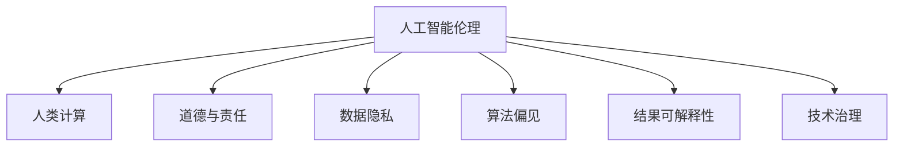

                 

# 人工智能伦理：人类计算的道德与责任

> 关键词：人工智能伦理, 人类计算, 道德与责任, 数据隐私, 算法偏见, 可解释性, 技术治理

## 1. 背景介绍

### 1.1 问题由来
随着人工智能(AI)技术的快速发展，特别是深度学习、大数据等技术的广泛应用，AI已深入到社会的各个角落。医疗、教育、金融、交通、娱乐等众多行业都在利用AI技术提升服务水平和效率，改善人们的生活质量。然而，AI技术的双刃剑效应也开始显现。数据隐私泄露、算法偏见、结果不可解释等问题频发，使得AI伦理成为社会各界关注的焦点。

### 1.2 问题核心关键点
AI伦理的核心在于确保技术的应用能够促进社会公正、保护个人权益、增强公共安全。其中最关键的问题包括：

- **数据隐私**：在AI系统中，大量的个人数据被收集、存储和分析，如何在保护隐私的同时，充分利用数据价值是一个重要挑战。
- **算法偏见**：由于训练数据存在偏差，AI模型可能继承这些偏差，导致对某些群体的不公平对待。如何设计无偏见的算法，避免歧视性输出是伦理研究的重要方向。
- **结果可解释性**：AI模型的决策过程通常非常复杂，难以解释其内部工作机制。缺乏可解释性可能导致信任度下降，甚至引发法律和社会问题。
- **技术治理**：AI系统的开发和应用涉及多方利益，如何建立有效的治理机制，确保技术的安全、可靠、透明，是实现AI伦理的关键。

这些关键问题直接影响AI技术的应用效果和公众接受度，也深刻影响到社会的公平与正义。本文将深入探讨这些核心问题，并提出可能的解决方案，助力构建更加公正、透明、负责任的AI系统。

### 1.3 问题研究意义
研究AI伦理，对于推动AI技术健康发展，确保技术服务于人类福祉，具有重要意义：

- **促进公平正义**：通过设计和调整AI系统，避免数据偏见和算法歧视，保障不同群体的权益，促进社会公平。
- **保护隐私安全**：采取有效措施保护个人数据隐私，防止数据滥用，提升公众对AI技术的信任度。
- **增强可解释性**：提升AI模型的可解释性，使决策过程透明、可理解，有助于发现和修正潜在问题。
- **完善技术治理**：建立健全AI系统的治理框架，确保技术的应用符合伦理和法律要求，防止滥用和误用。

## 2. 核心概念与联系

### 2.1 核心概念概述

为了更好地理解AI伦理，本节将介绍几个密切相关的核心概念：

- **人工智能伦理**：研究AI技术在开发和应用过程中应遵循的道德规范和行为准则，确保AI技术服务于人类福祉，促进社会公正。
- **人类计算**：指通过计算机和AI技术，以人类为中心，实现问题的求解和决策支持，强调人与技术的协同互动。
- **道德与责任**：在AI系统中，如何平衡技术进步与伦理道德，明确开发者、使用者及监管者的责任，是AI伦理研究的重点。
- **数据隐私**：涉及数据的收集、存储、使用过程中，如何保护个人隐私不被侵犯。
- **算法偏见**：由于训练数据或模型设计不当，导致AI模型在预测和决策过程中产生的不公平结果。
- **结果可解释性**：指AI模型的决策和预测过程应能够被人类理解和解释。
- **技术治理**：通过制定规则、标准和监管措施，确保AI技术的应用符合伦理和法律要求，保障技术的安全性和可靠性。

这些核心概念之间的逻辑关系可以通过以下Mermaid流程图来展示：



这个流程图展示了几组核心概念及其之间的关系：

1. 人工智能伦理通过人类计算实现，强调技术进步的同时不应忽视道德和责任。
2. 数据隐私、算法偏见、结果可解释性、技术治理等关键问题，都是人工智能伦理研究的重点。
3. 这些关键问题相互关联，共同构成AI伦理的完整框架，影响AI技术的应用效果和社会影响。

## 3. 核心算法原理 & 具体操作步骤
### 3.1 算法原理概述

AI伦理的核心在于确保技术的应用能够促进社会公正、保护个人权益、增强公共安全。以下是几个关键算法原理：

#### 3.1.1 数据隐私保护
数据隐私保护是AI伦理中的重要一环。通过差分隐私、联邦学习、数据加密等技术，可以在保护数据隐私的同时，实现模型的训练和优化。差分隐私通过在数据中加入噪声，使得个体数据的泄露风险极低，同时保持模型的性能。联邦学习则通过分布式训练，在多个设备上协同学习，避免数据集中存储和传输。

#### 3.1.2 算法偏见检测与修正
算法偏见是AI伦理研究的另一核心问题。通过公平性评估指标、偏见检测算法和公平性修复技术，可以有效地检测和修正模型中的偏见。例如，通过计算模型在各群体间的预测偏差，识别出有偏见的特征，并使用对抗训练、重采样等方法进行调整。

#### 3.1.3 结果可解释性提升
结果可解释性是确保AI系统透明、可信的重要手段。通过可视化工具、可解释模型、模型压缩等技术，可以提升模型的可解释性。可视化工具如LIME、SHAP，能够生成模型的局部解释，解释模型在特定输入上的决策过程。可解释模型如Linear Models、Decision Trees，能够提供直观的决策路径。模型压缩如知识蒸馏、剪枝，能够在减小模型规模的同时，保持模型的性能。

### 3.2 算法步骤详解

以下是几个核心算法的详细步骤：

#### 3.2.1 差分隐私保护算法
差分隐私保护算法的主要步骤如下：

1. **参数设置**：确定隐私参数$\epsilon$和目标数据集$D$。
2. **添加噪声**：对数据$x$添加高斯噪声$\mathcal{N}(0,\sigma^2)$，得到处理后的数据$x'$。
3. **模型训练**：在处理后的数据$x'$上训练模型$f$。
4. **隐私保护**：计算$f(x)$的估计值$f(x')$，并返回$f(x')$作为最终输出。

#### 3.2.2 算法偏见检测与修正
算法偏见检测与修正的一般步骤如下：

1. **数据收集**：收集模型训练和测试数据，并标注各群体的标签。
2. **偏差计算**：计算模型在各群体间的预测偏差，识别出有偏见的特征。
3. **偏差分析**：分析偏差原因，确定是数据问题还是模型问题。
4. **偏见修正**：根据偏差分析结果，使用对抗训练、重采样等方法调整模型。
5. **测试评估**：在新的数据集上测试修正后的模型，评估偏差是否减少。

#### 3.2.3 结果可解释性提升
结果可解释性提升的步骤如下：

1. **模型选择**：选择合适的可解释模型，如线性模型、决策树等。
2. **特征选择**：选择对模型性能影响较大的特征进行解释。
3. **可视化工具**：使用可视化工具，如LIME、SHAP，生成模型的局部解释。
4. **模型压缩**：使用模型压缩技术，如知识蒸馏、剪枝，减小模型规模，提高解释效率。

### 3.3 算法优缺点

AI伦理相关的算法具有以下优点：

1. **保护隐私**：差分隐私、联邦学习等技术能够有效保护数据隐私，减少隐私泄露的风险。
2. **减少偏见**：偏见检测与修正技术可以帮助识别和调整模型中的偏见，提升公平性。
3. **增强可信度**：结果可解释性提升技术可以提高模型的可信度，增强用户对AI系统的信任。
4. **简化模型**：模型压缩技术可以在保持模型性能的同时，减小模型规模，提高推理效率。

但这些算法也存在一些局限性：

1. **复杂性**：差分隐私、偏见检测等技术实现较为复杂，需要投入大量的计算资源和时间。
2. **数据需求**：某些技术如差分隐私、联邦学习需要较多的数据样本，对数据采集和存储提出了较高要求。
3. **性能影响**：某些技术如差分隐私、模型压缩可能会影响模型性能，需要在隐私保护和性能之间进行权衡。
4. **依赖数据**：所有技术的应用效果都依赖于数据的质量和多样性，数据偏差可能导致算法效果不理想。

尽管存在这些局限性，但这些算法在确保AI系统的道德和责任方面发挥了重要作用，值得在实际应用中推广和改进。

### 3.4 算法应用领域

AI伦理算法已经在多个领域得到应用，涵盖了数据隐私保护、算法偏见检测与修正、结果可解释性提升等方面：

- **医疗领域**：在医疗诊断、药物研发、患者隐私保护等领域，差分隐私、算法偏见检测与修正技术广泛应用于AI系统的开发和应用中。
- **金融领域**：在风险评估、信用评分、客户隐私保护等方面，差分隐私、结果可解释性提升技术得到了广泛应用。
- **司法领域**：在案件判决、证据分析、律师助手等方面，算法偏见检测与修正、结果可解释性提升技术显著提升了司法系统的公正性和透明度。
- **媒体领域**：在新闻推荐、内容生成、隐私保护等方面，差分隐私、结果可解释性提升技术为媒体平台提供了新的解决方案。

除了上述领域，AI伦理算法还在教育、交通、城市管理等多个领域得到了应用，推动了社会各个方面的智能化发展。

## 4. 数学模型和公式 & 详细讲解 & 举例说明

### 4.1 数学模型构建

以下是几个核心算法的数学模型构建：

#### 4.1.1 差分隐私保护模型
差分隐私保护的数学模型可以表示为：
$$
\mathcal{L}_{\epsilon}(f,D) = \min_{f} \mathbb{E}_{x \sim D} [f(x')] + \frac{\sigma^2}{\epsilon^2} + \frac{\log \delta}{2\epsilon}
$$
其中，$f$为模型，$D$为数据集，$\epsilon$为隐私参数，$\delta$为隐私概率。

#### 4.1.2 算法偏见检测与修正模型
算法偏见检测与修正的数学模型可以表示为：
$$
\text{Bias}(D,f) = \sum_{g \in \text{groups}} \frac{|\text{Loss}(g,f) - \text{Loss}(g,f_{\text{baseline}})}{\text{Loss}(g,f_{\text{baseline}})}
$$
其中，$g$为群体，$f$为模型，$f_{\text{baseline}}$为基线模型。

#### 4.1.3 结果可解释性提升模型
结果可解释性提升的数学模型可以表示为：
$$
\text{Explainability}(D,f) = \text{LIME}(D,f) + \text{SHAP}(D,f) + \text{Knowledge Distillation}(D,f)
$$
其中，$\text{LIME}$、$\text{SHAP}$、$\text{Knowledge Distillation}$分别为局部解释、全局解释、模型压缩等工具。

### 4.2 公式推导过程

以下是对核心算法的公式推导：

#### 4.2.1 差分隐私保护推导
差分隐私保护的核心思想是通过加入噪声，使得个体数据的泄露风险极低，从而保护隐私。具体推导如下：
$$
\mathcal{L}_{\epsilon}(f,D) = \min_{f} \mathbb{E}_{x \sim D} [f(x')] + \frac{\sigma^2}{\epsilon^2} + \frac{\log \delta}{2\epsilon}
$$
其中，$f(x)$为原始模型，$f(x')$为加入噪声后的模型，$\sigma$为噪声强度，$\delta$为隐私概率。

#### 4.2.2 算法偏见检测与修正推导
算法偏见检测与修正的推导如下：
$$
\text{Bias}(D,f) = \sum_{g \in \text{groups}} \frac{|\text{Loss}(g,f) - \text{Loss}(g,f_{\text{baseline}})}{\text{Loss}(g,f_{\text{baseline}})}
$$
其中，$g$为群体，$f$为模型，$f_{\text{baseline}}$为基线模型。

#### 4.2.3 结果可解释性提升推导
结果可解释性提升的推导如下：
$$
\text{Explainability}(D,f) = \text{LIME}(D,f) + \text{SHAP}(D,f) + \text{Knowledge Distillation}(D,f)
$$
其中，$\text{LIME}$、$\text{SHAP}$、$\text{Knowledge Distillation}$分别为局部解释、全局解释、模型压缩等工具。

### 4.3 案例分析与讲解

以医疗诊断系统为例，分析差分隐私保护、算法偏见检测与修正、结果可解释性提升的应用。

#### 4.3.1 差分隐私保护应用
在医疗诊断系统中，患者的隐私保护非常重要。差分隐私保护可以通过在数据上添加噪声，使得个体数据的泄露风险极低。具体步骤如下：

1. **数据收集**：收集患者的医疗记录和诊断数据。
2. **添加噪声**：对数据添加高斯噪声，确保个体数据无法被单独识别。
3. **模型训练**：在处理后的数据上训练诊断模型。
4. **隐私保护**：计算模型在处理后的数据上的诊断结果，并返回结果。

#### 4.3.2 算法偏见检测与修正应用
在诊断模型中，不同性别、年龄、种族的患者可能得到不同的诊断结果，存在偏见。算法偏见检测与修正可以通过计算模型在各群体间的预测偏差，识别出有偏见的特征，并使用对抗训练、重采样等方法进行调整。具体步骤如下：

1. **数据收集**：收集模型训练和测试数据，并标注各群体的标签。
2. **偏差计算**：计算模型在各群体间的预测偏差，识别出有偏见的特征。
3. **偏差分析**：分析偏差原因，确定是数据问题还是模型问题。
4. **偏见修正**：根据偏差分析结果，使用对抗训练、重采样等方法调整模型。
5. **测试评估**：在新的数据集上测试修正后的模型，评估偏差是否减少。

#### 4.3.3 结果可解释性提升应用
在诊断模型中，医生需要理解模型的诊断依据。结果可解释性提升可以通过可视化工具、可解释模型、模型压缩等技术，提升模型的可解释性。具体步骤如下：

1. **模型选择**：选择可解释模型，如线性模型、决策树等。
2. **特征选择**：选择对模型性能影响较大的特征进行解释。
3. **可视化工具**：使用可视化工具，如LIME、SHAP，生成模型的局部解释。
4. **模型压缩**：使用模型压缩技术，如知识蒸馏、剪枝，减小模型规模，提高解释效率。

## 5. 项目实践：代码实例和详细解释说明

### 5.1 开发环境搭建

在进行AI伦理算法实践前，我们需要准备好开发环境。以下是使用Python进行TensorFlow开发的环境配置流程：

1. 安装Anaconda：从官网下载并安装Anaconda，用于创建独立的Python环境。

2. 创建并激活虚拟环境：
```bash
conda create -n tf-env python=3.8 
conda activate tf-env
```

3. 安装TensorFlow：根据CUDA版本，从官网获取对应的安装命令。例如：
```bash
conda install tensorflow tensorflow-gpu=2.5.0 -c pytorch -c conda-forge
```

4. 安装TensorFlow Addons：
```bash
pip install tensorflow-addons
```

5. 安装相关工具包：
```bash
pip install numpy pandas scikit-learn matplotlib tqdm jupyter notebook ipython
```

完成上述步骤后，即可在`tf-env`环境中开始AI伦理算法实践。

### 5.2 源代码详细实现

这里我们以差分隐私保护算法为例，给出使用TensorFlow实现差分隐私保护的Python代码实现。

```python
import tensorflow as tf
import numpy as np

def laplace_noise(D, epsilon):
    n = len(D)
    noise = np.random.laplace(scale=1/epsilon, size=n)
    return noise

def differential_privacy(D, epsilon):
    n = len(D)
    noise = laplace_noise(D, epsilon)
    D_noise = np.array(D) + noise
    return D_noise

# 示例数据
D = np.array([1, 2, 3, 4, 5, 6, 7, 8, 9, 10])

# 设置隐私参数
epsilon = 1.0

# 差分隐私保护
D隐私 = differential_privacy(D, epsilon)

print(D隐私)
```

### 5.3 代码解读与分析

让我们再详细解读一下关键代码的实现细节：

**Laplace噪声生成**：
- `laplace_noise`函数生成拉普拉斯噪声，用于差分隐私保护。

**差分隐私保护**：
- `differential_privacy`函数对原始数据进行差分隐私保护，生成噪声并添加到原始数据中。

**示例数据和隐私参数**：
- 定义示例数据和隐私参数。

**差分隐私保护实现**：
- 调用`differential_privacy`函数对示例数据进行差分隐私保护。

**输出结果**：
- 输出差分隐私保护后的数据。

通过上述代码，我们可以看到，差分隐私保护算法通过在数据上添加拉普拉斯噪声，实现了隐私保护的效果。

当然，这只是一个简单的示例，实际应用中还需要考虑更多的因素，如数据类型、噪声分布、隐私参数等。但核心的差分隐私保护原理与实现步骤与此类似。

## 6. 实际应用场景
### 6.1 智能医疗系统

基于AI伦理算法，智能医疗系统可以在保护患者隐私的同时，提升诊断的公平性和透明性。具体应用场景包括：

- **隐私保护**：使用差分隐私保护技术，确保患者的隐私不被泄露。
- **偏见检测与修正**：通过算法偏见检测与修正技术，确保诊断结果的公平性。
- **结果可解释性**：使用结果可解释性提升技术，提高医生对诊断结果的理解和信任。

### 6.2 金融风险评估

在金融领域，基于AI伦理算法的系统可以提升风险评估的公正性和透明性。具体应用场景包括：

- **隐私保护**：使用差分隐私保护技术，保护客户数据隐私。
- **偏见检测与修正**：通过算法偏见检测与修正技术，确保评估结果的公平性。
- **结果可解释性**：使用结果可解释性提升技术，提升客户对评估结果的理解和信任。

### 6.3 智能客服系统

基于AI伦理算法，智能客服系统可以在保护用户隐私的同时，提升服务质量和效率。具体应用场景包括：

- **隐私保护**：使用差分隐私保护技术，确保用户隐私不被泄露。
- **偏见检测与修正**：通过算法偏见检测与修正技术，确保回答的公平性。
- **结果可解释性**：使用结果可解释性提升技术，提高用户对回答的理解和信任。

### 6.4 未来应用展望

随着AI伦理算法的不断发展和完善，未来的应用场景将更加丰富和广泛。例如：

- **智慧城市**：基于AI伦理算法，智慧城市系统可以在保护市民隐私的同时，提升城市管理的智能化水平。
- **智能制造**：在智能制造领域，基于AI伦理算法，可以提升生产过程的公平性和透明性。
- **教育平台**：在教育领域，基于AI伦理算法，可以提升教学过程的公平性和透明性。

## 7. 工具和资源推荐
### 7.1 学习资源推荐

为了帮助开发者系统掌握AI伦理算法的基础知识，这里推荐一些优质的学习资源：

1. **《人工智能伦理》课程**：斯坦福大学开设的伦理课程，涵盖了AI伦理的核心问题，包括隐私保护、偏见检测与修正、结果可解释性等。
2. **《AI伦理指南》书籍**：详细介绍了AI伦理的基本概念和应用场景，适合初学者和从业者阅读。
3. **TensorFlow Addons文档**：TensorFlow Addons提供的差分隐私保护、算法偏见检测与修正等算法的详细文档和样例代码。

通过对这些资源的学习实践，相信你一定能够系统地掌握AI伦理算法的基础知识和应用方法。

### 7.2 开发工具推荐

高效的开发离不开优秀的工具支持。以下是几款用于AI伦理算法开发的常用工具：

1. TensorFlow：由Google主导开发的深度学习框架，支持分布式训练和隐私保护等功能。
2. TensorFlow Addons：TensorFlow的扩展库，提供了差分隐私保护、算法偏见检测与修正等算法的实现。
3. PyTorch：由Facebook开发的深度学习框架，灵活性高，支持多种模型结构。
4. PyTorch Lightning：PyTorch的轻量级框架，支持快速原型开发和模型训练。
5. Keras：Keras的高级API，易于使用，适合快速构建模型。

合理利用这些工具，可以显著提升AI伦理算法的开发效率，加快创新迭代的步伐。

### 7.3 相关论文推荐

AI伦理算法的发展源于学界的持续研究。以下是几篇奠基性的相关论文，推荐阅读：

1. **《隐私保护技术综述》**：综述了差分隐私保护、联邦学习等隐私保护技术的研究进展和应用实例。
2. **《算法偏见检测与修正技术综述》**：综述了算法偏见检测与修正技术的研究进展和实际应用。
3. **《结果可解释性技术综述》**：综述了结果可解释性提升技术的研究进展和应用实例。

这些论文代表了大模型微调技术的发展脉络。通过学习这些前沿成果，可以帮助研究者把握学科前进方向，激发更多的创新灵感。

## 8. 总结：未来发展趋势与挑战

### 8.1 总结

本文对AI伦理算法进行了全面系统的介绍。首先阐述了AI伦理的核心问题，包括数据隐私、算法偏见、结果可解释性等，明确了伦理研究的重要性。其次，从原理到实践，详细讲解了差分隐私保护、算法偏见检测与修正、结果可解释性提升等核心算法的数学模型和实现步骤，给出了代码实例和详细解释。同时，本文还探讨了这些算法在实际应用中的场景和未来发展趋势。

通过本文的系统梳理，可以看到，AI伦理算法在保护数据隐私、提升算法公平性、增强结果可解释性等方面发挥了重要作用，为AI技术的应用提供了重要保障。

### 8.2 未来发展趋势

展望未来，AI伦理算法将呈现以下几个发展趋势：

1. **隐私保护技术的进步**：随着差分隐私、联邦学习等技术的发展，隐私保护的计算开销将进一步降低，应用场景将更加广泛。
2. **偏见检测与修正技术的提升**：未来将开发更多高效的偏见检测与修正技术，提升算法的公平性。
3. **结果可解释性技术的提升**：随着模型压缩、可视化工具等技术的发展，结果可解释性将进一步提升，提升模型的可信度。
4. **多领域应用推广**：AI伦理算法将逐步推广到更多领域，提升各行各业的智能化水平。
5. **自动化和自动化验证**：未来将开发自动化工具，对AI系统的伦理性能进行评估和验证，确保技术的公平性和透明性。

以上趋势凸显了AI伦理算法的重要性和广阔前景，这些方向的探索发展，必将进一步提升AI系统的伦理性能，保障技术的应用符合人类价值观和伦理道德。

### 8.3 面临的挑战

尽管AI伦理算法已经取得了一定的进展，但在实际应用中仍面临诸多挑战：

1. **隐私保护技术的复杂性**：差分隐私、联邦学习等技术实现较为复杂，需要投入大量的计算资源和时间。
2. **偏见检测与修正的困难**：算法偏见检测与修正技术难以在所有场景下有效应用，需要更多的研究和实践。
3. **结果可解释性的局限性**：结果可解释性提升技术难以完美解释复杂模型的决策过程，仍需进一步研究。
4. **多领域应用难度**：不同领域的应用场景和需求各异，AI伦理算法需要适应不同的应用场景，开发通用性强的解决方案。
5. **自动化工具的缺乏**：现有的自动化工具不足，对AI系统的伦理性能评估和验证仍有待完善。

尽管存在这些挑战，但AI伦理算法的不断发展和完善，将为AI技术的应用提供有力保障，助力构建更加公正、透明、负责任的智能系统。

### 8.4 研究展望

面对AI伦理算法所面临的挑战，未来的研究需要在以下几个方面寻求新的突破：

1. **隐私保护技术的简化**：开发更高效的差分隐私、联邦学习技术，降低计算开销，提升应用效果。
2. **偏见检测与修正的普适性**：开发更多普适的偏见检测与修正技术，适应不同场景下的需求。
3. **结果可解释性的完善**：提升结果可解释性技术的有效性，增强模型的可信度。
4. **多领域应用推广**：开发适应不同领域需求的AI伦理算法，推动AI技术在更多行业的落地应用。
5. **自动化工具的开发**：开发自动化评估工具，对AI系统的伦理性能进行验证和优化。

这些研究方向的探索，必将引领AI伦理算法的不断进步，为AI技术的应用提供有力保障，构建更加公正、透明、负责任的智能系统。面向未来，AI伦理算法还需要与其他人工智能技术进行更深入的融合，如知识表示、因果推理、强化学习等，多路径协同发力，共同推动自然语言理解和智能交互系统的进步。只有勇于创新、敢于突破，才能不断拓展语言模型的边界，让智能技术更好地造福人类社会。

## 9. 附录：常见问题与解答

**Q1：差分隐私保护算法的计算开销是否过大？**

A: 差分隐私保护算法的计算开销确实较大，特别是在数据规模较大时。但随着技术的发展，差分隐私保护算法的计算开销正在逐渐降低。例如，GPU加速可以显著提升差分隐私保护的效率。未来，随着量子计算等新兴技术的引入，差分隐私保护算法的计算开销将进一步降低。

**Q2：算法偏见检测与修正的准确性如何保证？**

A: 算法偏见检测与修正的准确性取决于多个因素，如数据质量、模型设计、算法选择等。为了保证准确性，通常需要：

1. **数据标注**：确保数据标注的准确性和多样性。
2. **模型选择**：选择合适无偏见的模型，并进行公正性评估。
3. **算法选择**：选择高效的偏见检测与修正算法，如对抗训练、重采样等。
4. **多轮调整**：进行多轮调整，确保偏见检测与修正的效果。

**Q3：结果可解释性提升技术的局限性是什么？**

A: 结果可解释性提升技术的局限性主要体现在：

1. **模型复杂性**：复杂模型难以被完全解释，仍需结合人类专家的知识进行理解。
2. **解释维度**：模型的解释维度有限，难以全面解释模型的决策过程。
3. **隐私保护**：在隐私保护的要求下，部分解释信息可能无法被完全公开。
4. **解释工具的局限性**：现有的解释工具对某些复杂模型效果有限，仍需进一步研究和开发。

尽管存在这些局限性，但结果可解释性提升技术仍为AI系统的透明性和可信度提供了重要保障。

**Q4：AI伦理算法的实施难度大吗？**

A: 尽管AI伦理算法具有重要意义，但其实施难度确实较大，特别是在隐私保护、偏见检测与修正等方面。实施难度主要体现在：

1. **技术复杂性**：差分隐私、偏见检测与修正等算法实现复杂，需要较高的技术水平。
2. **数据需求**：这些算法需要大量的数据样本，数据采集和存储成本较高。
3. **应用场景多样性**：不同领域的应用场景和需求各异，需要开发适应不同场景的解决方案。
4. **法规约束**：AI伦理算法需要符合各国的法律法规，增加了实施难度。

尽管如此，通过持续的技术研究和实践积累，AI伦理算法的实施难度正在逐渐降低，未来有望在更多领域得到应用。

---

作者：禅与计算机程序设计艺术 / Zen and the Art of Computer Programming

