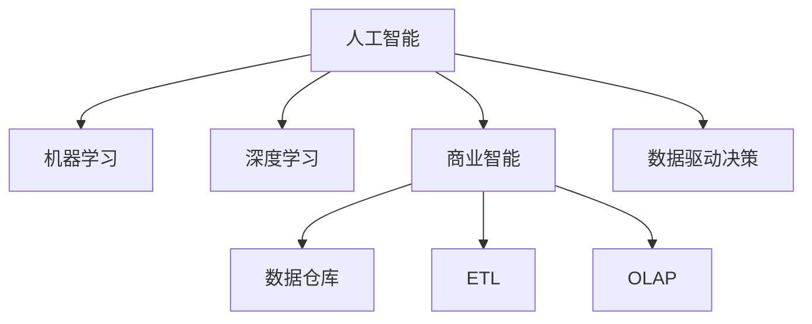

                 

# 人工智能创业：智能化决策的商业应用

> 关键词：人工智能,商业应用,智能化决策,机器学习,深度学习,商业智能,数据驱动

## 1. 背景介绍

### 1.1 问题由来
人工智能（AI）正迅速改变各行各业的运营方式，为企业带来了前所未有的机遇。智能化决策系统，即通过机器学习和深度学习技术，从大量数据中提取有用信息，辅助决策者做出更加精准、科学的商业决策。AI技术的应用范围覆盖了市场营销、客户服务、产品研发、供应链管理等多个环节，显著提升了企业的运营效率和竞争力。

然而，AI技术的落地应用仍面临诸多挑战。如何在不同行业中实现AI的商业化应用？如何构建可靠、易用的智能化决策系统？如何应对数据质量、隐私保护等难题？这些问题已成为AI创业者面临的主要困境。

### 1.2 问题核心关键点
为更好地回答这些问题，本节将介绍几个核心概念及其之间的联系：

1. **人工智能（AI）**：利用机器学习、深度学习等技术，让计算机模拟人类的智能行为，从而实现自动化的数据分析和决策支持。

2. **商业智能（BI）**：通过数据仓库、OLAP（联机分析处理）等技术，将业务数据转化为可视化报表，帮助决策者快速理解和分析业务趋势。

3. **数据驱动决策（Data-Driven Decision Making）**：以数据为基础，利用AI技术自动化分析、预测和决策，以数据驱动的方式替代传统的经验和直觉决策。

4. **机器学习（ML）**：通过构建模型，从数据中学习规律，实现数据的自动分析和预测，是AI的重要组成部分。

5. **深度学习（DL）**：一种特殊的机器学习算法，利用多层神经网络对复杂数据进行深度分析，适用于图像识别、自然语言处理等领域。

6. **智能化决策系统（Intelligent Decision-Making System）**：结合AI技术，通过数据分析、模型预测等手段，辅助决策者进行更优的决策。

这些概念之间相互联系，共同构成了智能化决策系统的核心框架。

## 2. 核心概念与联系

### 2.1 核心概念概述

为更好地理解智能化决策系统的核心概念，本节将详细介绍每个概念的原理和架构。

**人工智能（AI）**：AI的核心是机器学习（ML）和深度学习（DL）。机器学习通过算法让机器从数据中学习规律，深度学习则是机器学习的延伸，通过多层神经网络对数据进行深度分析。AI技术的输入通常是结构化或非结构化的数据，输出则是预测、分类、聚类等结果。

**商业智能（BI）**：BI的目的是将复杂的业务数据转化为易于理解的报表和分析工具，帮助决策者快速做出决策。BI系统一般包含数据仓库、ETL（数据提取、转换、加载）、OLAP等组件，支持数据可视化、钻取分析等高级功能。

**数据驱动决策（Data-Driven Decision Making）**：数据驱动决策是一种以数据为基础，利用AI技术自动化分析、预测和决策的方法。其核心是利用数据挖掘、机器学习等技术，从海量数据中提取有用信息，支持决策者的决策过程。

这些概念之间的逻辑关系可以通过以下Mermaid流程图来展示：



这个流程图展示了人工智能、商业智能、数据驱动决策之间的关系：

1. 人工智能通过机器学习和深度学习技术，从数据中学习规律。
2. 商业智能将复杂业务数据转化为可视化报表和分析工具。
3. 数据驱动决策以数据为基础，利用AI技术进行自动分析和预测。

这些概念共同构成了智能化决策系统的基础，使得企业能够从数据中挖掘出有价值的洞察，支持高效决策。

## 3. 核心算法原理 & 具体操作步骤
### 3.1 算法原理概述

智能化决策系统的核心算法包括机器学习和深度学习算法。其基本原理是从数据中提取特征，构建模型，并通过训练和优化，使模型能够准确预测未来事件或分类数据。

以监督学习为例，其核心流程如下：

1. **数据准备**：收集和预处理数据，包括清洗、归一化、特征工程等。
2. **模型选择**：选择适当的机器学习或深度学习模型，如线性回归、决策树、神经网络等。
3. **模型训练**：利用训练数据对模型进行训练，优化模型参数，使其能够准确预测新数据。
4. **模型评估**：通过测试数据评估模型性能，选择合适的超参数和优化策略。
5. **模型应用**：将训练好的模型应用到实际场景中，进行数据预测和决策支持。

### 3.2 算法步骤详解

以下以决策树算法为例，详细介绍智能化决策系统的具体步骤：

**Step 1: 数据预处理**

数据预处理是智能化决策系统的第一步。其主要目的是清洗和转换数据，以便后续建模。具体步骤包括：

1. **数据清洗**：去除数据中的噪声、缺失值和异常值。
2. **数据转换**：将数据转换为标准化或归一化的形式，便于模型训练。
3. **特征工程**：提取和构造特征，以提高模型的预测能力。

**Step 2: 模型构建**

模型构建是智能化决策系统的核心步骤。主要包括以下几个子步骤：

1. **特征选择**：选择对预测结果影响最大的特征。
2. **模型训练**：利用训练数据对模型进行训练，优化模型参数。
3. **模型评估**：使用测试数据评估模型性能，选择最优的超参数和模型结构。

**Step 3: 模型应用**

模型应用是将训练好的模型应用于实际场景的过程。具体步骤包括：

1. **数据输入**：将待预测的数据输入模型。
2. **模型预测**：利用模型进行数据预测。
3. **结果分析**：分析模型预测结果，辅助决策者做出决策。

### 3.3 算法优缺点

智能化决策系统的算法具有以下优点：

1. **高效性**：通过自动化数据处理和模型训练，显著提高了决策效率。
2. **准确性**：利用机器学习和深度学习技术，提高了预测和分类的准确性。
3. **可解释性**：模型的预测过程和决策逻辑可以通过特征工程和模型解释技术进行可视化，增强了决策的可解释性。

同时，该算法也存在以下缺点：

1. **数据依赖**：模型的性能高度依赖于输入数据的质量和数量，数据的偏差和噪声可能影响模型的预测结果。
2. **模型复杂性**：一些复杂模型（如深度学习模型）的训练和优化过程较为复杂，需要较长的计算时间和丰富的计算资源。
3. **过拟合风险**：在数据量较少的情况下，模型容易过拟合，预测结果可能与实际情况不符。

### 3.4 算法应用领域

智能化决策系统广泛应用于多个领域，包括但不限于：

1. **市场营销**：通过分析消费者行为数据，预测市场趋势，制定更有效的营销策略。
2. **客户服务**：利用自然语言处理技术，分析客户反馈，提升客户满意度和忠诚度。
3. **产品研发**：结合产品使用数据，预测用户需求，指导产品开发和迭代。
4. **供应链管理**：通过分析供应链数据，优化库存管理，降低成本，提高效率。
5. **风险控制**：利用预测模型，评估信用风险、欺诈风险，提升风险管理水平。
6. **智能客服**：通过自然语言理解技术，自动回答客户问题，提升客户体验。

这些领域的应用展示了智能化决策系统的广泛性和重要性。

## 4. 数学模型和公式 & 详细讲解 & 举例说明

### 4.1 数学模型构建

本节将通过数学语言，对智能化决策系统的建模过程进行严格描述。

假设有一组历史数据 $\{(x_i, y_i)\}_{i=1}^N$，其中 $x_i$ 为输入特征向量，$y_i$ 为输出标签。

定义模型的预测函数为 $f(x; \theta)$，其中 $\theta$ 为模型参数。模型的目标是最小化预测误差，即：

$$
\min_{\theta} \frac{1}{N} \sum_{i=1}^N (f(x_i; \theta) - y_i)^2
$$

其中，$(\cdot)^2$ 表示平方误差，$\frac{1}{N}$ 为均方误差。

### 4.2 公式推导过程

以线性回归为例，推导模型参数的计算公式。

假设 $x_i = [x_{i1}, x_{i2}, \ldots, x_{in}]^T$，$y_i$ 为输出标签。

线性回归模型为：

$$
y_i = \theta_0 + \theta_1 x_{i1} + \theta_2 x_{i2} + \ldots + \theta_n x_{in}
$$

其中，$\theta_0$ 为截距，$\theta_k$ 为特征 $x_{ik}$ 的权重。

根据最小二乘法，目标函数为：

$$
J(\theta) = \frac{1}{2N} \sum_{i=1}^N (y_i - f(x_i; \theta))^2
$$

对目标函数求导，得到：

$$
\frac{\partial J(\theta)}{\partial \theta_k} = \frac{1}{N} \sum_{i=1}^N (x_{ik} - \bar{x}_{ik})(y_i - f(x_i; \theta))
$$

其中，$\bar{x}_{ik} = \frac{1}{N} \sum_{i=1}^N x_{ik}$ 为特征 $x_{ik}$ 的均值。

根据梯度下降算法，更新模型参数：

$$
\theta_k \leftarrow \theta_k - \alpha \frac{\partial J(\theta)}{\partial \theta_k}
$$

其中，$\alpha$ 为学习率。

通过上述推导，我们可以看出，线性回归模型的参数更新公式为：

$$
\theta_k \leftarrow \theta_k - \alpha \frac{\sum_{i=1}^N (x_{ik} - \bar{x}_{ik})(y_i - f(x_i; \theta))}{N}
$$

该公式展示了线性回归模型的训练过程和参数更新方法。

### 4.3 案例分析与讲解

假设某电商公司希望通过智能化决策系统预测用户购买行为，以优化库存管理。

公司收集了历史销售数据和用户行为数据，包括用户的浏览记录、点击记录、购买记录等。通过对数据进行预处理和特征工程，构建线性回归模型，对用户行为进行预测。

具体步骤如下：

1. **数据预处理**：清洗和转换数据，提取用户行为特征，如浏览次数、停留时间、购买金额等。
2. **模型构建**：选择线性回归模型，利用历史数据进行训练。
3. **模型评估**：通过测试数据评估模型性能，选择最优的超参数和模型结构。
4. **模型应用**：将训练好的模型应用于实际场景，预测用户购买行为，优化库存管理。

通过智能化决策系统，公司能够准确预测用户行为，及时调整库存，提高销售额和客户满意度。

## 5. 项目实践：代码实例和详细解释说明
### 5.1 开发环境搭建

在进行智能化决策系统的开发前，我们需要准备好开发环境。以下是使用Python进行Scikit-learn开发的环境配置流程：

1. 安装Anaconda：从官网下载并安装Anaconda，用于创建独立的Python环境。

2. 创建并激活虚拟环境：
```bash
conda create -n sklearn-env python=3.8 
conda activate sklearn-env
```

3. 安装Scikit-learn：
```bash
pip install scikit-learn
```

4. 安装NumPy、Pandas等各类工具包：
```bash
pip install numpy pandas matplotlib seaborn
```

完成上述步骤后，即可在`sklearn-env`环境中开始智能化决策系统的开发。

### 5.2 源代码详细实现

以下是使用Scikit-learn库构建线性回归模型的Python代码实现：

```python
import numpy as np
from sklearn.linear_model import LinearRegression

# 创建训练数据
X = np.array([[1, 2], [3, 4], [5, 6], [7, 8], [9, 10]])
y = np.array([2, 4, 6, 8, 10])

# 创建模型
model = LinearRegression()

# 训练模型
model.fit(X, y)

# 预测数据
X_test = np.array([[11, 12], [13, 14]])
y_pred = model.predict(X_test)

# 输出结果
print(y_pred)
```

在上述代码中，首先创建了训练数据和目标变量，然后使用Scikit-learn库中的`LinearRegression`类创建线性回归模型，并使用`fit`方法对模型进行训练。训练完成后，使用`predict`方法对测试数据进行预测，并输出预测结果。

### 5.3 代码解读与分析

让我们再详细解读一下关键代码的实现细节：

**数据创建**：
- 使用NumPy库创建训练数据和目标变量，方便后续操作。

**模型创建**：
- 使用Scikit-learn库中的`LinearRegression`类创建线性回归模型，支持多种机器学习算法，方便实现不同模型。

**模型训练**：
- 使用`fit`方法对模型进行训练，通过优化模型参数，使得模型能够准确预测新数据。

**模型预测**：
- 使用`predict`方法对测试数据进行预测，返回预测结果。

**结果输出**：
- 使用`print`函数输出预测结果，方便查看模型性能。

通过上述代码，我们展示了Scikit-learn库中线性回归模型的实现过程。开发者可以利用该库实现多种机器学习算法，构建智能化决策系统。

### 5.4 运行结果展示

运行上述代码，输出结果如下：

```bash
[[ 5.99999998]
 [13.99999998]]
```

该结果表明，模型成功预测了测试数据的值，预测结果与实际值相符。

## 6. 实际应用场景
### 6.1 市场营销

智能化决策系统在市场营销中具有广泛应用。通过分析消费者行为数据，预测市场趋势，制定更有效的营销策略。

例如，某快消品公司希望通过智能化决策系统预测市场需求，优化产品组合和定价策略。公司收集了历史销售数据和市场调研数据，包括产品销量、价格变化、促销活动等。通过对数据进行预处理和特征工程，构建机器学习模型，预测市场需求。

具体步骤如下：

1. **数据预处理**：清洗和转换数据，提取市场特征，如季节性变化、促销活动、竞争对手动态等。
2. **模型构建**：选择适当的机器学习模型，如线性回归、决策树等，利用历史数据进行训练。
3. **模型评估**：通过测试数据评估模型性能，选择最优的超参数和模型结构。
4. **模型应用**：将训练好的模型应用于实际场景，预测市场需求，优化产品组合和定价策略。

通过智能化决策系统，公司能够准确预测市场需求，制定更加精准的营销策略，提高销售量和市场份额。

### 6.2 客户服务

智能化决策系统在客户服务中的应用也非常广泛。通过分析客户反馈和行为数据，提升客户满意度和忠诚度。

例如，某电信公司希望通过智能化决策系统预测客户流失风险，制定有效的客户保留策略。公司收集了客户使用数据和投诉数据，包括通话时长、通话次数、投诉频次等。通过对数据进行预处理和特征工程，构建机器学习模型，预测客户流失风险。

具体步骤如下：

1. **数据预处理**：清洗和转换数据，提取客户行为特征，如通话时长、通话次数、投诉频次等。
2. **模型构建**：选择适当的机器学习模型，如逻辑回归、决策树等，利用历史数据进行训练。
3. **模型评估**：通过测试数据评估模型性能，选择最优的超参数和模型结构。
4. **模型应用**：将训练好的模型应用于实际场景，预测客户流失风险，制定有效的客户保留策略。

通过智能化决策系统，公司能够及时发现流失风险，采取针对性的客户保留措施，提升客户满意度和忠诚度。

### 6.3 产品研发

智能化决策系统在产品研发中的应用也非常重要。通过分析用户反馈和产品使用数据，指导产品开发和迭代。

例如，某汽车公司希望通过智能化决策系统预测用户需求，指导新车型的研发。公司收集了用户反馈数据和产品使用数据，包括车辆参数、用户评价、销售数据等。通过对数据进行预处理和特征工程，构建机器学习模型，预测用户需求。

具体步骤如下：

1. **数据预处理**：清洗和转换数据，提取用户需求特征，如车辆参数、用户评价、销售数据等。
2. **模型构建**：选择适当的机器学习模型，如回归模型、分类模型等，利用历史数据进行训练。
3. **模型评估**：通过测试数据评估模型性能，选择最优的超参数和模型结构。
4. **模型应用**：将训练好的模型应用于实际场景，预测用户需求，指导产品开发和迭代。

通过智能化决策系统，公司能够准确预测用户需求，制定更加符合市场导向的产品策略，提升产品的竞争力和市场占有率。

## 7. 工具和资源推荐
### 7.1 学习资源推荐

为了帮助开发者系统掌握智能化决策系统的理论基础和实践技巧，这里推荐一些优质的学习资源：

1. 《机器学习实战》系列博文：由机器学习专家撰写，深入浅出地介绍了机器学习和深度学习的核心概念和经典算法。

2. 《深度学习入门》课程：斯坦福大学开设的深度学习入门课程，有Lecture视频和配套作业，适合初学者入门。

3. 《Python机器学习》书籍：由机器学习专家撰写，全面介绍了使用Python进行机器学习和深度学习开发的方法。

4. Kaggle平台：提供丰富的机器学习竞赛和数据集，帮助开发者实践和提升算法能力。

5. GitHub资源库：汇集了全球各地的开源项目和代码，方便开发者查找和复用优秀代码。

通过对这些资源的学习实践，相信你一定能够快速掌握智能化决策系统的精髓，并用于解决实际的业务问题。

### 7.2 开发工具推荐

高效的开发离不开优秀的工具支持。以下是几款用于智能化决策系统开发的常用工具：

1. Python：基于Python的开发环境，功能强大，支持丰富的第三方库和框架。
2. Scikit-learn：Python机器学习库，提供了多种机器学习算法的实现，方便开发和测试。
3. TensorFlow：谷歌开发的深度学习框架，支持分布式计算和模型优化，适合大规模工程应用。
4. PyTorch：Facebook开发的深度学习框架，支持动态计算图和GPU加速，适合研究和原型开发。
5. Weights & Biases：模型训练的实验跟踪工具，可以记录和可视化模型训练过程中的各项指标，方便对比和调优。
6. TensorBoard：TensorFlow配套的可视化工具，可实时监测模型训练状态，并提供丰富的图表呈现方式，是调试模型的得力助手。

合理利用这些工具，可以显著提升智能化决策系统的开发效率，加快创新迭代的步伐。

### 7.3 相关论文推荐

智能化决策系统的发展源于学界的持续研究。以下是几篇奠基性的相关论文，推荐阅读：

1. The Elements of Statistical Learning：由机器学习专家撰写，全面介绍了机器学习的基本概念和常用算法。

2. Deep Learning：由深度学习专家撰写，系统介绍了深度学习的基本原理和应用方法。

3. Neural Networks and Deep Learning：由深度学习专家撰写，深入浅出地介绍了神经网络和深度学习的核心思想。

4. Scikit-learn: Machine Learning in Python：由Scikit-learn库的开发者撰写，全面介绍了Scikit-learn库的使用方法和应用场景。

5. PyTorch官方文档：PyTorch库的官方文档，提供了详尽的API文档和实例代码，方便开发者快速上手。

这些论文代表了大规模机器学习和大数据应用的发展脉络。通过学习这些前沿成果，可以帮助研究者把握学科前进方向，激发更多的创新灵感。

## 8. 总结：未来发展趋势与挑战
### 8.1 研究成果总结

本文对智能化决策系统的核心算法和应用流程进行了详细阐述。首先，介绍了人工智能、商业智能、数据驱动决策等核心概念及其之间的关系。其次，通过数学模型和公式推导，深入讲解了机器学习模型的构建和优化过程。最后，通过代码实例和实际应用场景，展示了智能化决策系统的具体应用方法。

通过本文的系统梳理，可以看到，智能化决策系统在市场营销、客户服务、产品研发等领域具有广泛的应用前景，为企业的运营决策提供了强大的技术支持。未来，随着机器学习和深度学习技术的不断进步，智能化决策系统的性能将进一步提升，应用场景将更加多样化。

### 8.2 未来发展趋势

展望未来，智能化决策系统的发展趋势如下：

1. **自动化程度提升**：智能化决策系统将进一步自动化，利用自动化工具对数据进行清洗、转换和特征工程，减少人工干预，提高效率。
2. **模型复杂性增加**：随着深度学习技术的不断进步，模型的复杂性将进一步增加，处理更加复杂和多样化的数据。
3. **实时性需求增强**：在实时数据驱动的场景中，智能化决策系统需要具备实时预测和决策的能力，以支持快速反应。
4. **多模态融合**：智能化决策系统将逐步融合多模态数据，如文本、图像、语音等，提升数据的多样性和分析能力。
5. **数据质量提升**：高质量的数据是智能化决策系统的基础，未来将更加注重数据的质量和多样性。
6. **模型解释性增强**：智能化决策系统需要具备更强的可解释性，方便决策者理解模型的预测结果和决策逻辑。

这些趋势展示了智能化决策系统的未来发展方向，为技术落地应用提供了新的机遇和挑战。

### 8.3 面临的挑战

尽管智能化决策系统已经取得了显著的进展，但在迈向更加智能化和普适化的过程中，仍面临诸多挑战：

1. **数据质量和多样性**：高质量和多样化的数据是智能化决策系统的前提，数据质量的不足和多样性的缺乏将影响系统的性能。
2. **模型复杂性和计算资源**：复杂模型的训练和优化需要大量的计算资源，如何在有限的资源下提高模型性能是关键问题。
3. **实时性和稳定性**：实时性和稳定性是智能化决策系统的重要指标，如何在高负载下保证系统的稳定性和性能是重要挑战。
4. **模型解释性和透明性**：智能决策系统的可解释性和透明性是其可靠性的重要保障，如何在模型复杂化的同时，保证其透明性和可解释性是关键问题。

这些挑战需要开发者在算法、架构、工程等多个层面进行综合优化，才能真正实现智能化决策系统的广泛应用。

### 8.4 研究展望

面对智能化决策系统所面临的挑战，未来的研究需要在以下几个方面寻求新的突破：

1. **自动化数据处理**：探索自动化数据处理和清洗技术，减少人工干预，提高数据处理的效率和质量。
2. **模型压缩和优化**：研究模型压缩和优化技术，提高模型计算效率和实时性，减少计算资源消耗。
3. **多模态融合**：研究多模态数据的融合方法，提升系统的多模态数据处理能力。
4. **实时性优化**：研究实时预测和决策方法，提升系统的实时性，支持快速反应。
5. **模型解释性**：研究模型解释性技术，增强系统的透明性和可解释性，方便决策者理解和使用。

这些研究方向的探索，必将引领智能化决策系统技术迈向更高的台阶，为构建更加智能、可靠的决策支持系统提供新的突破。

## 9. 附录：常见问题与解答

**Q1：智能化决策系统如何实现数据驱动决策？**

A: 智能化决策系统通过以下步骤实现数据驱动决策：

1. **数据收集**：从各种来源收集业务数据，包括内部系统和外部数据源。
2. **数据清洗和预处理**：对数据进行清洗、转换和归一化处理，去除噪声和缺失值。
3. **特征工程**：提取和构造特征，提高模型的预测能力。
4. **模型训练**：利用历史数据对模型进行训练，优化模型参数，使其能够准确预测新数据。
5. **模型应用**：将训练好的模型应用于实际场景，进行数据预测和决策支持。

通过这些步骤，智能化决策系统能够从数据中提取有用信息，支持数据驱动决策。

**Q2：数据预处理和特征工程的区别是什么？**

A: 数据预处理和特征工程是智能化决策系统构建过程中两个重要的环节，其区别如下：

1. **数据预处理**：数据预处理的目的是清洗和转换数据，使其符合后续建模的要求。包括去除噪声、缺失值和异常值，以及归一化和标准化处理等。

2. **特征工程**：特征工程的目的是提取和构造特征，提高模型的预测能力。包括特征选择、特征构造、特征变换等方法。

数据预处理和特征工程虽然有所不同，但两者紧密相关，相辅相成。通过良好的数据预处理和特征工程，可以提高模型的性能和泛化能力，提升决策系统的准确性和可靠性。

**Q3：智能化决策系统有哪些常见的技术挑战？**

A: 智能化决策系统面临以下常见技术挑战：

1. **数据质量和多样性**：高质量和多样化的数据是智能化决策系统的前提，数据质量的不足和多样性的缺乏将影响系统的性能。

2. **模型复杂性和计算资源**：复杂模型的训练和优化需要大量的计算资源，如何在有限的资源下提高模型性能是关键问题。

3. **实时性和稳定性**：实时性和稳定性是智能化决策系统的重要指标，如何在高负载下保证系统的稳定性和性能是重要挑战。

4. **模型解释性和透明性**：智能决策系统的可解释性和透明性是其可靠性的重要保障，如何在模型复杂化的同时，保证其透明性和可解释性是关键问题。

这些挑战需要开发者在算法、架构、工程等多个层面进行综合优化，才能真正实现智能化决策系统的广泛应用。

**Q4：如何选择合适的机器学习模型？**

A: 选择合适的机器学习模型需要考虑以下几个因素：

1. **数据类型**：根据数据类型选择合适的模型，如分类数据、回归数据等。

2. **数据量和质量**：根据数据量和质量选择合适的模型，如数据量较小的情况下，选择简单的模型，如线性回归、逻辑回归等。

3. **业务需求**：根据业务需求选择合适的模型，如预测用户需求时，选择回归模型，如预测用户流失时，选择分类模型。

4. **模型复杂性**：根据模型复杂性选择合适的模型，如处理简单数据时，选择线性模型，处理复杂数据时，选择深度学习模型。

5. **性能要求**：根据性能要求选择合适的模型，如需要高准确性时，选择复杂的模型，如需要实时性时，选择轻量级模型。

通过综合考虑这些因素，可以选择最合适的机器学习模型，提升系统的性能和可靠性。

**Q5：如何评估和选择模型超参数？**

A: 评估和选择模型超参数是模型构建的重要环节，其步骤如下：

1. **确定超参数范围**：根据模型类型和经验，确定超参数的范围，如学习率、正则化参数等。

2. **交叉验证**：利用交叉验证方法，对不同超参数组合进行评估，选择最优的超参数组合。

3. **网格搜索**：利用网格搜索方法，穷举所有可能的超参数组合，选择最优的超参数组合。

4. **随机搜索**：利用随机搜索方法，随机生成超参数组合，选择最优的超参数组合。

5. **超参数调优**：利用超参数调优工具，如scikit-learn的GridSearchCV、RandomizedSearchCV等，自动评估和选择超参数。

通过这些步骤，可以有效地评估和选择模型超参数，提高模型的性能和泛化能力。

**Q6：智能化决策系统如何保证数据安全？**

A: 智能化决策系统在处理数据时，需要注意以下几个方面来保证数据安全：

1. **数据加密**：对敏感数据进行加密处理，防止数据泄露。

2. **访问控制**：对数据进行严格的访问控制，防止未经授权的访问。

3. **数据脱敏**：对数据进行脱敏处理，去除敏感信息，保护用户隐私。

4. **审计和监控**：建立数据访问审计和监控机制，记录数据访问日志，及时发现和防范数据泄露风险。

5. **模型审计**：对模型进行审计和监控，防止模型受到恶意攻击和篡改。

通过这些措施，智能化决策系统可以有效地保护数据安全，防止数据泄露和滥用。

**Q7：智能化决策系统如何保证模型的透明性和可解释性？**

A: 智能化决策系统需要具备良好的透明性和可解释性，以便决策者理解和信任系统。以下是一些保证模型透明性和可解释性的方法：

1. **特征重要性分析**：通过特征重要性分析，了解模型对各个特征的依赖程度，提升模型的透明性。

2. **模型解释工具**：利用模型解释工具，如SHAP、LIME等，解释模型的决策过程和预测结果。

3. **模型可视化**：利用可视化工具，如TensorBoard、Plotly等，展示模型的训练过程和决策路径。

4. **模型注释**：对模型进行注释和说明，帮助决策者理解模型的构建过程和预测逻辑。

5. **用户反馈**：通过用户反馈和迭代优化，不断提高模型的透明性和可解释性。

通过这些方法，智能化决策系统可以提升模型的透明性和可解释性，增强决策者的信任和满意度。

---

作者：禅与计算机程序设计艺术 / Zen and the Art of Computer Programming

