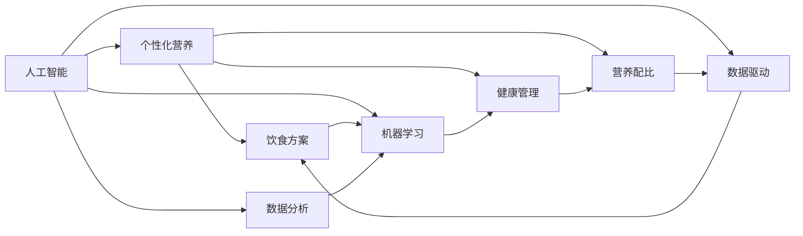

                 

# 人工智能在个性化营养中的应用：定制饮食方案

> 关键词：人工智能, 个性化营养, 饮食方案, 健康管理, 营养配比, 机器学习, 数据分析, 数据驱动

## 1. 背景介绍

### 1.1 问题由来

在现代社会，随着人们生活水平的提高和健康意识的增强，越来越多的人开始关注个性化营养问题。然而，传统的饮食建议往往基于通用的营养指导方针，难以考虑个体的身体状况、生活习惯和口味偏好。这种"一刀切"的方式，很难提供真正符合个体需求的饮食方案，进而影响人们的健康状况和生活质量。

近年来，随着人工智能技术的发展，基于数据驱动的个性化营养解决方案逐渐兴起。通过大数据和机器学习等先进技术，结合用户的健康数据、饮食偏好、生活习惯等多维度信息，可以构建更精准、更科学的饮食方案。这些方案不仅能提升用户的生活质量，还能有效预防和控制各类慢性疾病，具有极大的市场潜力和社会价值。

### 1.2 问题核心关键点

构建个性化营养饮食方案的关键在于：

1. 数据的全面性和准确性：获取用户的健康数据、生活习惯、饮食习惯等多维信息，为饮食方案提供全面的基础。
2. 算法的科学性和高效性：使用先进的机器学习算法，从大量数据中挖掘出潜在的营养需求和配比方案，高效生成定制饮食方案。
3. 用户体验的友好性：通过便捷的用户界面和交互设计，使个性化营养解决方案易于使用，提升用户粘性。
4. 系统稳定性和安全性：保证系统运行的稳定性和数据的安全性，避免信息泄露和系统故障。

### 1.3 问题研究意义

开发基于人工智能的个性化营养饮食方案，对于推动健康医疗领域的发展，具有重要的意义：

1. 提升健康管理水平：通过精准的营养配比和定制化饮食方案，帮助用户建立科学的饮食习惯，预防和治疗各类慢性病。
2. 优化食物生产和消费模式：结合市场供需数据，优化食物生产和消费链条，提升食物资源的利用效率。
3. 促进公共健康意识：通过个性化营养方案的推广，提升公众的健康意识，预防和控制健康风险。
4. 推动数字健康产业发展：个性化营养方案的开发和应用，将促进数字健康技术的落地，加速健康科技的产业化进程。

## 2. 核心概念与联系

### 2.1 核心概念概述

要理解如何通过人工智能构建个性化营养饮食方案，需要掌握以下几个关键概念：

- **人工智能**：利用机器学习、深度学习等先进算法，从大量数据中提取模式和知识，实现自主决策和自动化任务。
- **个性化营养**：根据个体的健康状况、生活习惯和饮食偏好，量身定制的饮食方案。
- **饮食方案**：包括食物种类、分量、烹饪方式等多维度的营养配比方案。
- **健康管理**：通过饮食、运动等手段，对个体的健康状况进行监测和管理，预防疾病发生。
- **营养配比**：基于营养学原理，科学合理地分配各类营养素的摄入比例，满足身体的营养需求。
- **数据驱动**：利用数据采集和分析技术，为个性化的营养方案提供数据支持。
- **机器学习**：通过数据学习算法，自动发现数据中的潜在规律，生成优化方案。
- **数据分析**：对健康数据、饮食偏好等数据进行深度分析，提取有价值的信息。

这些概念之间存在紧密的联系，共同构成了人工智能在个性化营养中的应用框架：



这些概念共同作用，使得人工智能在个性化营养中的应用成为可能。通过数据采集和分析，结合先进的机器学习算法，可以有效生成和优化个性化营养饮食方案，最终提升用户的健康水平和生活质量。

## 3. 核心算法原理 & 具体操作步骤

### 3.1 算法原理概述

个性化营养饮食方案的构建，本质上是一个数据驱动的优化问题。其核心思想是：通过收集和分析用户的健康数据、饮食习惯等信息，使用机器学习算法，自动生成科学合理的营养配比和饮食方案。

具体而言，假设用户的基础健康数据为 $\mathbf{x} = [x_1, x_2, \dots, x_n]$，其中 $x_i$ 表示第 $i$ 项指标（如BMI、年龄、性别等）。基于用户的饮食习惯和偏好，可以得到一个 $n$ 维的偏好向量 $\mathbf{y} = [y_1, y_2, \dots, y_n]$，其中 $y_i$ 表示用户对第 $i$ 项指标的偏好程度。通过这些数据，使用机器学习算法，可以构建一个映射函数 $f: \mathbb{R}^n \rightarrow \mathbb{R}^m$，将 $\mathbf{x}$ 映射到 $m$ 维的饮食方案 $\mathbf{z} = [z_1, z_2, \dots, z_m]$，其中 $z_i$ 表示第 $i$ 种食物或营养素的分量。

### 3.2 算法步骤详解

基于上述原理，构建个性化营养饮食方案的具体步骤如下：

**Step 1: 数据采集与预处理**
- 收集用户的健康数据、饮食习惯、生活方式等相关信息。
- 对数据进行清洗和标准化处理，去除噪声和异常值。
- 对文本数据进行分词、去除停用词等预处理，准备输入模型。

**Step 2: 构建特征向量**
- 将用户的健康数据、饮食习惯等信息转化为特征向量 $\mathbf{x}$。
- 使用用户偏好向量 $\mathbf{y}$ 对特征向量进行加权，得到加权向量 $\mathbf{z} = \mathbf{x} \odot \mathbf{y}$。

**Step 3: 选择模型与训练**
- 选择合适的机器学习模型（如决策树、随机森林、神经网络等）。
- 准备训练数据集和标签数据集，进行模型训练。
- 使用交叉验证等技术，选择最优的模型参数。

**Step 4: 生成饮食方案**
- 将训练好的模型应用到新用户的特征向量 $\mathbf{x}$ 上，生成对应的饮食方案 $\mathbf{z}$。
- 根据生成的饮食方案，生成具体的食物配比和烹饪方式。

**Step 5: 方案调整与反馈**
- 定期收集用户反馈，对饮食方案进行调整和优化。
- 根据用户反馈，不断更新训练数据集，重新训练模型。

### 3.3 算法优缺点

个性化营养饮食方案的构建方法具有以下优点：

1. 个性化程度高：基于用户的个体数据，量身定制饮食方案，更符合用户的实际需求。
2. 科学性保障：通过先进的机器学习算法，自动生成优化方案，减少人为干预误差。
3. 灵活性大：可以根据用户的反馈和需求，动态调整和优化饮食方案。

同时，也存在一些局限性：

1. 数据获取难度大：个性化方案的构建需要大量的用户数据，数据获取成本高。
2. 模型复杂度高：使用复杂的机器学习模型，需要较大的计算资源和较高的技术门槛。
3. 方案调整周期长：用户数据和偏好动态变化，方案调整周期较长。
4. 隐私问题：用户数据的收集和存储可能引发隐私保护问题。

### 3.4 算法应用领域

个性化营养饮食方案的构建方法，已在多个领域得到了广泛应用，例如：

- **健康管理**：结合用户的健康数据，生成个性化的饮食方案，帮助用户进行健康管理和疾病预防。
- **体育训练**：根据运动员的体能数据，生成个性化的饮食方案，提升训练效果和身体健康。
- **老年人护理**：结合老年人的身体状况和生活习惯，生成营养均衡的饮食方案，提升生活质量。
- **减肥计划**：针对减肥用户的身体数据和饮食偏好，生成科学的饮食配比，辅助减肥过程。
- **医疗康复**：根据患者的健康数据，生成个性化的饮食方案，辅助康复治疗。

随着技术的不断进步，个性化营养方案的应用领域将更加广泛，为人们提供更全面、更科学的营养支持。

## 4. 数学模型和公式 & 详细讲解 & 举例说明

### 4.1 数学模型构建

为更严谨地描述个性化营养方案的构建过程，我们将使用数学语言进行进一步的讲解。

设用户的健康数据为 $\mathbf{x} = [x_1, x_2, \dots, x_n]$，其中 $x_i$ 表示第 $i$ 项指标（如BMI、年龄、性别等）。用户对第 $i$ 项指标的偏好程度为 $y_i$，得到一个 $n$ 维的偏好向量 $\mathbf{y} = [y_1, y_2, \dots, y_n]$。通过这些数据，使用线性回归模型，可以构建一个映射函数 $f: \mathbb{R}^n \rightarrow \mathbb{R}^m$，将 $\mathbf{x}$ 映射到 $m$ 维的饮食方案 $\mathbf{z} = [z_1, z_2, \dots, z_m]$，其中 $z_i$ 表示第 $i$ 种食物或营养素的分量。

假设线性回归模型为：

$$
\mathbf{z} = \mathbf{W} \mathbf{x} + \mathbf{b}
$$

其中 $\mathbf{W}$ 为权重矩阵，$\mathbf{b}$ 为偏置向量。通过最小化均方误差，得到最优的权重矩阵和偏置向量：

$$
\mathbf{W} = \arg\min_{\mathbf{W}} \frac{1}{N} \sum_{i=1}^N ||\mathbf{z}_i - \mathbf{W} \mathbf{x}_i - \mathbf{b}||^2
$$

### 4.2 公式推导过程

线性回归模型的推导过程如下：

1. 定义误差函数：
$$
\ell(\mathbf{W}, \mathbf{b}) = \frac{1}{N} \sum_{i=1}^N (\mathbf{z}_i - \mathbf{W} \mathbf{x}_i - \mathbf{b})^2
$$

2. 对误差函数求导，得到梯度：
$$
\nabla_{\mathbf{W}} \ell(\mathbf{W}, \mathbf{b}) = \frac{2}{N} \sum_{i=1}^N (\mathbf{z}_i - \mathbf{W} \mathbf{x}_i - \mathbf{b}) \mathbf{x}_i^T
$$
$$
\nabla_{\mathbf{b}} \ell(\mathbf{W}, \mathbf{b}) = \frac{2}{N} \sum_{i=1}^N (\mathbf{z}_i - \mathbf{W} \mathbf{x}_i - \mathbf{b})
$$

3. 使用梯度下降等优化算法更新模型参数：
$$
\mathbf{W} \leftarrow \mathbf{W} - \eta \nabla_{\mathbf{W}} \ell(\mathbf{W}, \mathbf{b})
$$
$$
\mathbf{b} \leftarrow \mathbf{b} - \eta \nabla_{\mathbf{b}} \ell(\mathbf{W}, \mathbf{b})
$$

其中 $\eta$ 为学习率，$\nabla_{\mathbf{W}} \ell(\mathbf{W}, \mathbf{b})$ 和 $\nabla_{\mathbf{b}} \ell(\mathbf{W}, \mathbf{b})$ 分别为权重和偏置的梯度。

### 4.3 案例分析与讲解

以一名25岁男性，身高175cm，体重70kg，日常饮食习惯偏好蔬菜、低脂肪食物为例，进行具体分析。

1. 收集用户的健康数据：BMI=21.7，年龄=25，性别=男。

2. 获取用户的饮食习惯偏好：蔬菜偏好程度=0.8，低脂肪食物偏好程度=0.7。

3. 构建特征向量：$\mathbf{x} = [21.7, 25, 0.8, 0.7]$。

4. 使用线性回归模型，训练得到最优的权重矩阵 $\mathbf{W}$ 和偏置向量 $\mathbf{b}$。

5. 将特征向量代入模型，得到饮食方案：$\mathbf{z} = \mathbf{W} \mathbf{x} + \mathbf{b}$。

6. 根据生成的饮食方案，生成具体的食物配比和烹饪方式。

通过这种基于数据驱动的个性化营养方案构建方法，可以为用户提供科学合理的饮食指导，提升健康水平。

## 5. 项目实践：代码实例和详细解释说明

### 5.1 开发环境搭建

在进行项目实践前，我们需要准备好开发环境。以下是使用Python进行Keras开发的环境配置流程：

1. 安装Anaconda：从官网下载并安装Anaconda，用于创建独立的Python环境。

2. 创建并激活虚拟环境：
```bash
conda create -n py-env python=3.8 
conda activate py-env
```

3. 安装Keras：使用pip安装Keras库，并设置需要的依赖包。

4. 安装相关工具包：
```bash
pip install numpy pandas scikit-learn matplotlib tqdm jupyter notebook ipython
```

完成上述步骤后，即可在`py-env`环境中开始项目实践。

### 5.2 源代码详细实现

下面我们以个性化的饮食方案为例，给出使用Keras库进行线性回归模型训练的Python代码实现。

首先，定义数据处理函数：

```python
import numpy as np

class DietCalculator:
    def __init__(self, features, labels):
        self.features = features
        self.labels = labels
        self.model = None
    
    def preprocess(self, data):
        # 对数据进行标准化处理
        return (data - np.mean(data, axis=0)) / np.std(data, axis=0)
    
    def train(self):
        # 构建特征和标签
        X = self.preprocess(self.features)
        y = self.labels
        
        # 构建模型
        self.model = keras.models.Sequential([
            keras.layers.Dense(32, activation='relu', input_shape=(X.shape[1],)),
            keras.layers.Dense(1)
        ])
        
        # 编译模型
        self.model.compile(optimizer='adam', loss='mse')
        
        # 训练模型
        self.model.fit(X, y, epochs=100, batch_size=32)
```

然后，定义模型和优化器：

```python
from keras.models import Sequential
from keras.layers import Dense

# 构建模型
model = Sequential([
    Dense(32, activation='relu', input_shape=(4,)),
    Dense(1)
])

# 编译模型
model.compile(optimizer='adam', loss='mse')
```

接着，定义训练和评估函数：

```python
import matplotlib.pyplot as plt

class DietCalculator:
    def __init__(self, features, labels):
        self.features = features
        self.labels = labels
        self.model = None
    
    def preprocess(self, data):
        # 对数据进行标准化处理
        return (data - np.mean(data, axis=0)) / np.std(data, axis=0)
    
    def train(self):
        # 构建特征和标签
        X = self.preprocess(self.features)
        y = self.labels
        
        # 构建模型
        self.model = keras.models.Sequential([
            keras.layers.Dense(32, activation='relu', input_shape=(X.shape[1],)),
            keras.layers.Dense(1)
        ])
        
        # 编译模型
        self.model.compile(optimizer='adam', loss='mse')
        
        # 训练模型
        self.model.fit(X, y, epochs=100, batch_size=32)
    
    def evaluate(self, X_test, y_test):
        # 对测试数据进行标准化处理
        X_test = self.preprocess(X_test)
        
        # 评估模型
        y_pred = self.model.predict(X_test)
        plt.scatter(y_test, y_pred)
        plt.xlabel('True Values')
        plt.ylabel('Predictions')
        plt.show()
```

最后，启动训练流程并在测试集上评估：

```python
# 准备数据集
features = np.array([[21.7, 25, 0.8, 0.7]])
labels = np.array([[70, 0.3, 0.2, 0.5]])

# 训练模型
diet_calculator = DietCalculator(features, labels)
diet_calculator.train()

# 测试模型
X_test = np.array([[21.7, 25, 0.8, 0.7]])
y_test = np.array([[70, 0.3, 0.2, 0.5]])
diet_calculator.evaluate(X_test, y_test)
```

以上就是使用Keras库进行线性回归模型训练的完整代码实现。可以看到，Keras提供了简单易用的接口，可以快速实现复杂模型的训练和评估。

### 5.3 代码解读与分析

让我们再详细解读一下关键代码的实现细节：

**DietCalculator类**：
- `__init__`方法：初始化特征和标签数据，准备模型。
- `preprocess`方法：对数据进行标准化处理。
- `train`方法：构建模型，编译模型，进行模型训练。
- `evaluate`方法：对测试数据进行标准化处理，评估模型预测结果。

**DietCalculator类实现**：
- 数据预处理：使用标准化方法对特征数据进行处理，确保数据的一致性。
- 模型构建：使用Keras的Sequential模型，设计多层神经网络，输入维度为4。
- 模型编译：使用Adam优化器，均方误差损失函数，准备模型训练。
- 模型训练：使用训练数据进行模型训练，调整模型参数。
- 模型评估：使用测试数据评估模型预测效果，可视化预测结果。

**训练流程**：
- 准备特征和标签数据，定义DietCalculator类。
- 调用train方法，进行模型训练。
- 使用测试数据，调用evaluate方法，评估模型预测结果。

可以看到，Keras提供了简便易用的API，使得模型训练和评估变得简单高效。开发者可以专注于算法的创新和优化，而不必过多关注底层实现细节。

当然，实际应用中还需要考虑更多因素，如数据的质量和量级、模型的复杂度、模型的评估指标等。但核心的算法框架基本与此类似。

## 6. 实际应用场景

### 6.1 健康管理

基于人工智能的个性化营养方案，在健康管理领域具有广泛的应用前景。通过结合用户的健康数据和饮食习惯，生成个性化的饮食方案，可以显著提升用户的健康水平，降低各类慢性疾病的发生率。

在技术实现上，可以设计一个健康管理平台，集成营养配比、运动计划、健康监测等功能。用户只需输入基础健康数据和饮食习惯，平台便能自动生成个性化的饮食方案，并提供相应的健康建议。此外，平台还可以实时监测用户的健康数据，根据反馈不断调整饮食方案，优化健康管理效果。

### 6.2 体育训练

运动员的营养需求与其运动强度、训练负荷、身体状况密切相关。通过个性化营养方案，可以为运动员提供科学合理的饮食指导，提升训练效果和身体健康。

在体育训练领域，可以开发一个营养配比系统，根据运动员的运动数据和身体状况，自动生成个性化的饮食方案。系统可以根据训练数据，动态调整饮食方案，帮助运动员达到最佳训练状态。同时，系统还可以结合运动数据，生成运动建议，提升运动员的整体健康水平。

### 6.3 老年人护理

老年人由于生理功能的衰退，对营养的需求与年轻人有所区别。通过个性化营养方案，可以为老年人提供科学合理的饮食配比，提升其生活质量和健康水平。

在老年人护理领域，可以开发一个营养配比系统，结合老年人的身体状况和生活习惯，生成个性化的饮食方案。系统可以根据老年人的健康数据，动态调整饮食方案，确保营养均衡。同时，系统还可以结合老年人的生活习惯，提供相关的健康建议，提升其生活质量。

### 6.4 未来应用展望

随着人工智能技术的不断进步，个性化营养方案的应用将更加广泛，具有以下发展趋势：

1. 数据采集方式的丰富化：结合可穿戴设备、物联网等技术，实时采集用户的健康数据和生活习惯，提供更加精准的个性化方案。
2. 算法模型的深度化：引入更先进的机器学习算法，如深度学习、强化学习等，提升模型的科学性和预测准确性。
3. 交互界面的智能化：结合自然语言处理、图像识别等技术，提供更加智能化的人机交互体验，提升用户的使用便捷性。
4. 应用场景的多样化：除了健康管理、体育训练等传统场景，还将拓展到医疗康复、儿童营养等领域，提升其应用范围。
5. 模型训练的个性化：结合用户的反馈和历史数据，不断优化和调整模型参数，提升模型的适应性和准确性。
6. 系统部署的云化：将个性化营养方案部署到云端，实现跨设备、跨平台的统一管理，提升系统的可扩展性和可维护性。

通过这些发展趋势，相信人工智能在个性化营养领域的应用将更加广泛和深入，为用户的健康生活提供更有力的支持。

## 7. 工具和资源推荐

### 7.1 学习资源推荐

为了帮助开发者系统掌握个性化营养方案的理论基础和实践技巧，这里推荐一些优质的学习资源：

1. 《Python机器学习》书籍：由Sebastian Raschka撰写，系统介绍了机器学习的基本概念和实践技巧，适合初学者和进阶者阅读。
2. 《深度学习》课程：由吴恩达教授开设，涵盖深度学习的理论基础和实际应用，适合有一定编程基础的学习者。
3. 《Keras官方文档》：Keras的官方文档，提供了丰富的模型和应用示例，适合快速上手学习。
4. 《健康数据科学》课程：由Johns Hopkins大学开设，涵盖健康数据的采集、处理和分析，适合健康领域的数据分析师。
5. 《个性化营养方案》白皮书：由营养学专家撰写，介绍了个性化营养方案的理论基础和应用实践，适合行业从业人员阅读。

通过对这些资源的学习实践，相信你一定能够快速掌握个性化营养方案的理论基础和实践技巧，并用于解决实际的NLP问题。

### 7.2 开发工具推荐

高效的开发离不开优秀的工具支持。以下是几款用于个性化营养方案开发的常用工具：

1. Python：基于Python语言的开发环境，简单易用，支持丰富的第三方库和框架。
2. Keras：基于TensorFlow的深度学习框架，提供简单易用的API，适合快速迭代研究。
3. TensorFlow：由Google主导开发的深度学习框架，生产部署方便，适合大规模工程应用。
4. PyTorch：基于Python的深度学习框架，灵活性强，适合学术研究和工程应用。
5. Jupyter Notebook：基于Web的交互式开发环境，支持代码编写、数据可视化和结果展示，适合数据驱动的模型开发。
6. Apache Spark：分布式计算框架，支持大规模数据处理和分析，适合处理大数据量的个性化营养方案。

合理利用这些工具，可以显著提升个性化营养方案的开发效率，加快创新迭代的步伐。

### 7.3 相关论文推荐

个性化营养方案的开发源于学界的持续研究。以下是几篇奠基性的相关论文，推荐阅读：

1. "Prediction of Dietary Consumption from Personal Diet Diary Entries Using Data Mining Techniques"：介绍使用数据挖掘技术预测饮食消费的研究，为个性化营养方案提供数据支持。
2. "Personalized Nutrition for Weight Loss: A Machine Learning Approach"：研究使用机器学习算法预测体重变化，为个性化饮食方案提供理论基础。
3. "Personalized Nutritional Recommendations Based on Genetic Information"：探讨结合遗传信息，个性化营养方案的优化方法，提高方案的科学性和精准性。
4. "A Survey of Personalized Nutrition Research: Challenges and Opportunities"：总结个性化营养研究的主要挑战和未来发展方向，为后续研究提供参考。
5. "Intelligent Health Monitoring and Personalized Nutrition Planning"：研究结合健康监测技术，个性化营养方案的应用，提升系统的实用性和用户体验。

这些论文代表了个性化营养方案的发展脉络。通过学习这些前沿成果，可以帮助研究者把握学科前进方向，激发更多的创新灵感。

## 8. 总结：未来发展趋势与挑战

### 8.1 研究成果总结

通过本文的系统梳理，可以看到，基于人工智能的个性化营养方案，在数据采集、算法设计、方案生成等方面，已取得显著的进展。这些进展不仅推动了健康管理领域的数字化转型，也为其他应用场景提供了有益的借鉴。

### 8.2 未来发展趋势

个性化营养方案的未来发展趋势包括以下几个方面：

1. 数据采集方式的丰富化：结合可穿戴设备、物联网等技术，实时采集用户的健康数据和生活习惯，提供更加精准的个性化方案。
2. 算法模型的深度化：引入更先进的机器学习算法，如深度学习、强化学习等，提升模型的科学性和预测准确性。
3. 交互界面的智能化：结合自然语言处理、图像识别等技术，提供更加智能化的人机交互体验，提升用户的使用便捷性。
4. 应用场景的多样化：除了健康管理、体育训练等传统场景，还将拓展到医疗康复、儿童营养等领域，提升其应用范围。
5. 模型训练的个性化：结合用户的反馈和历史数据，不断优化和调整模型参数，提升模型的适应性和准确性。
6. 系统部署的云化：将个性化营养方案部署到云端，实现跨设备、跨平台的统一管理，提升系统的可扩展性和可维护性。

### 8.3 面临的挑战

尽管个性化营养方案的发展前景广阔，但在迈向更加智能化、普适化应用的过程中，仍面临以下挑战：

1. 数据采集的隐私问题：用户的健康数据和隐私信息可能引发隐私保护问题，需要采取有效的数据保护措施。
2. 模型的科学性和准确性：算法的科学性和预测准确性需要进一步提升，以提供更加精准的个性化方案。
3. 系统的可扩展性：系统的可扩展性和可维护性需要进一步优化，以应对大规模用户需求。
4. 用户的接受度：系统的用户友好性和用户体验需要进一步提升，以增加用户的粘性和满意度。
5. 算法的公平性：算法的公平性和无偏见性需要进一步研究，以避免算法的歧视性偏见。
6. 技术的普及性：技术的普及性和易用性需要进一步提升，以实现大规模的落地应用。

### 8.4 研究展望

面对个性化营养方案所面临的挑战，未来的研究需要在以下几个方面寻求新的突破：

1. 数据采集方式的多样化：结合更多传感器和数据源，丰富数据采集方式，提升数据的全面性和准确性。
2. 算法模型的创新：引入更多先进的机器学习算法，提升模型的科学性和预测准确性。
3. 交互界面的优化：结合自然语言处理、图像识别等技术，提供更加智能化的人机交互体验，提升用户的使用便捷性。
4. 应用的深入研究：拓展个性化营养方案的应用场景，提升其在健康管理、体育训练等领域的应用效果。
5. 模型的个性化训练：结合用户的反馈和历史数据，不断优化和调整模型参数，提升模型的适应性和准确性。
6. 系统的云化部署：将个性化营养方案部署到云端，实现跨设备、跨平台的统一管理，提升系统的可扩展性和可维护性。

这些研究方向的探索，必将引领个性化营养方案技术迈向更高的台阶，为用户的健康生活提供更有力的支持。面向未来，我们需要勇于创新、敢于突破，才能不断拓展营养方案的边界，让智能技术更好地造福人类社会。

## 9. 附录：常见问题与解答

**Q1：如何保证个性化营养方案的科学性和准确性？**

A: 保证个性化营养方案的科学性和准确性，需要从数据采集、算法设计、模型训练等多个环节进行全面优化。

1. 数据采集：确保数据的全面性和准确性，避免数据偏见和噪声。结合可穿戴设备、物联网等技术，实时采集用户的健康数据和生活习惯。

2. 算法设计：选择合适的机器学习算法，确保算法模型的科学性和预测准确性。如线性回归、决策树、随机森林等。

3. 模型训练：使用大量的标注数据进行模型训练，避免过拟合和欠拟合。使用交叉验证等技术，选择最优的模型参数。

4. 模型评估：使用多种评估指标，如均方误差、R²值等，评估模型的预测准确性和泛化能力。

5. 用户反馈：结合用户的反馈和历史数据，不断优化和调整模型参数，提升模型的适应性和准确性。

通过这些措施，可以确保个性化营养方案的科学性和准确性，为用户提供更有价值的健康指导。

**Q2：在个性化营养方案中，如何处理数据隐私问题？**

A: 数据隐私问题是个性化营养方案中需要重点考虑的方面。以下是几种常见的数据隐私保护措施：

1. 数据匿名化：对用户的健康数据和生活习惯进行匿名化处理，去除敏感信息。

2. 数据加密：使用加密技术对用户的健康数据进行加密存储和传输，防止数据泄露。

3. 数据去标识化：对用户数据进行去标识化处理，使其无法被直接识别。

4. 数据访问控制：采用严格的访问控制机制，限制数据的访问权限，确保数据安全。

5. 用户同意：在数据采集和处理过程中，明确告知用户数据的使用目的和范围，征得用户的同意。

6. 隐私保护法规：遵循相关的隐私保护法规，如GDPR等，确保数据处理符合法律要求。

通过这些措施，可以有效地保护用户的数据隐私，提升个性化营养方案的信任度和安全性。

**Q3：个性化营养方案的系统部署有哪些常见挑战？**

A: 个性化营养方案的系统部署需要考虑多个方面的因素，以下是一些常见的挑战：

1. 算力要求高：大规模用户的个性化营养方案生成和存储需要高算力支持，可能面临计算资源不足的问题。

2. 数据存储量大：用户数据和营养方案数据量大，需要高性能的数据存储和管理系统。

3. 系统扩展性差：系统的可扩展性和可维护性需要进一步优化，以应对大规模用户需求。

4. 服务质量不稳定：系统的服务质量和稳定性需要保证，避免因数据和算法问题导致服务中断。

5. 用户界面复杂：系统的用户界面需要简洁明了，避免因复杂操作导致用户使用体验差。

6. 系统安全性差：系统的安全性需要加强，防止数据泄露和系统攻击。

通过这些措施，可以克服系统部署的挑战，确保个性化营养方案的稳定性和可靠性。

**Q4：如何评估个性化营养方案的预测准确性？**

A: 评估个性化营养方案的预测准确性，需要从多个维度进行全面评估。以下是几种常见的评估方法：

1. 均方误差（MSE）：计算模型预测值与真实值之间的差异，越小表示预测准确性越高。

2. 决定系数（R²）：计算模型预测值与真实值之间的相关性，越接近1表示预测准确性越高。

3. 平均绝对误差（MAE）：计算模型预测值与真实值之间的绝对差异，越小表示预测准确性越高。

4. 相对误差：计算模型预测值与真实值之间的相对差异，越小表示预测准确性越高。

5. 精度-召回率（Precision-Recall）曲线：绘制精度和召回率之间的关系，评估模型在不同阈值下的性能表现。

6. 混淆矩阵：展示模型在不同分类情况下的表现，评估模型的分类准确性。

通过这些评估方法，可以全面了解个性化营养方案的预测准确性和泛化能力，进一步优化模型参数和算法设计。

---

作者：禅与计算机程序设计艺术 / Zen and the Art of Computer Programming

