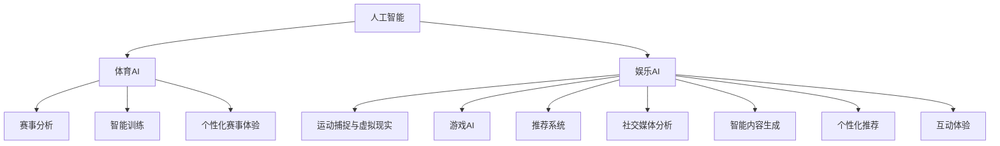

                 

## 1. 背景介绍

人工智能（AI）正在快速渗透各行各业，体育和娱乐业也不例外。体育与娱乐领域的应用不仅涵盖游戏、影视制作等传统领域，还延伸到体育赛事的组织与分析、粉丝互动、个性化推荐等多个方向。AI技术的融合为这些领域带来了深刻的变革，提高了运营效率，丰富了用户体验，甚至改变了游戏和娱乐内容的制作方式。

## 2. 核心概念与联系

### 2.1 核心概念概述

为了深入理解人工智能在体育和娱乐中的应用，我们先需了解几个核心概念及其相互关系：

- **人工智能**：通过模拟人类的学习、推理等认知能力，使计算机系统具备解决复杂问题的能力。
- **体育AI**：将人工智能技术应用于体育赛事的组织、训练、分析等多个环节，提升比赛水平和运营效率。
- **娱乐AI**：将AI技术应用于影视制作、游戏开发、内容推荐等娱乐领域，增强用户体验，提升内容质量。
- **运动捕捉与虚拟现实**：通过计算机视觉和传感器技术，捕捉人体动作，创建虚拟现实场景，广泛应用于体育训练、娱乐内容制作等领域。
- **游戏AI**：运用AI技术优化游戏内的敌对行为、决策生成等，提升游戏体验。
- **推荐系统**：根据用户行为数据，预测用户偏好，提供个性化推荐，用于体育赛事直播、娱乐内容推送等场景。
- **社交媒体分析**：通过分析社交媒体上的数据，评估公众情绪，优化娱乐内容策划。

这些核心概念之间的关系可以通过以下Mermaid流程图来展示：



这些概念构成了AI在体育和娱乐领域的广泛应用，并相互支持，共同推动了行业的发展。

## 3. 核心算法原理 & 具体操作步骤
### 3.1 算法原理概述

人工智能在体育和娱乐领域的应用，核心在于数据的收集、处理与分析。AI系统通常包括数据预处理、特征提取、模型训练和结果应用四个阶段。

以体育赛事分析为例，数据预处理通常包括数据收集、清洗、标注等步骤，为后续分析提供数据基础。特征提取则是将原始数据转换为模型可以理解的特征向量，便于机器学习模型进行处理。模型训练阶段，通过选择合适的算法和参数，训练模型学习数据中隐含的模式。最后，结果应用阶段将训练好的模型应用于实际场景，提供决策支持或优化用户体验。

### 3.2 算法步骤详解

以下详细介绍人工智能在体育和娱乐中常用的算法步骤和具体操作步骤：

#### 3.2.1 数据预处理

- **数据收集**：收集比赛成绩、观众反馈、社交媒体数据等。
- **数据清洗**：去除噪声数据、处理缺失值。
- **数据标注**：为数据添加标签，如球队胜负、观众情绪等。

#### 3.2.2 特征提取

- **自然语言处理**：将文本数据转换为向量表示，用于情感分析、评论生成等。
- **图像处理**：提取比赛视频帧中的关键特征，用于动作识别、运动员表现评估等。
- **用户行为分析**：通过日志、点击数据等，提取用户行为特征，用于个性化推荐。

#### 3.2.3 模型训练

- **监督学习**：使用标注数据，训练分类、回归等模型。
- **无监督学习**：使用未标注数据，训练聚类、降维等模型。
- **强化学习**：通过与环境的交互，训练策略优化模型。

#### 3.2.4 结果应用

- **赛事分析**：使用训练好的模型，分析比赛数据，生成比赛报告、评估运动员表现等。
- **个性化推荐**：根据用户行为和偏好，生成个性化的赛事、内容推荐。
- **虚拟现实体验**：利用运动捕捉和虚拟现实技术，提供沉浸式的游戏和体育体验。

### 3.3 算法优缺点

#### 3.3.1 优点

1. **提升效率**：AI技术可以处理大量数据，提供精准分析，显著提高运营效率。
2. **增强用户体验**：通过个性化推荐和虚拟现实，提升用户参与感和互动体验。
3. **优化内容创作**：利用AI生成和分析内容，丰富体育和娱乐内容的多样性。

#### 3.3.2 缺点

1. **数据依赖**：AI系统的性能高度依赖于数据的质量和数量，数据获取成本较高。
2. **模型复杂性**：高精度的AI模型往往结构复杂，训练和部署成本较高。
3. **结果可解释性**：AI模型通常被视为"黑盒"，难以解释其决策过程，可能影响应用可靠性。

### 3.4 算法应用领域

人工智能在体育和娱乐领域的应用，覆盖了以下几个主要领域：

1. **体育赛事管理**：包括赛事直播、比分预测、观众互动等。
2. **体育训练与康复**：利用AI分析运动员训练数据，提供个性化训练计划和康复建议。
3. **娱乐内容制作**：如游戏开发、影视制作、音乐创作等，通过AI优化创作流程，提升内容质量。
4. **个性化推荐**：用于赛事直播、内容推送、购物推荐等，提升用户满意度和粘性。
5. **虚拟现实体验**：通过运动捕捉和虚拟现实技术，提供沉浸式的游戏和体育体验。

## 4. 数学模型和公式 & 详细讲解  
### 4.1 数学模型构建

在体育和娱乐领域，常用的数学模型包括线性回归、支持向量机（SVM）、卷积神经网络（CNN）等。这些模型在不同的应用场景中，可以用于预测、分类、图像处理等任务。

### 4.2 公式推导过程

#### 4.2.1 线性回归模型

线性回归模型通常用于预测连续型数据，如比赛结果的分数。假设线性回归模型的形式为：

$$ y = \beta_0 + \beta_1x_1 + \beta_2x_2 + ... + \beta_nx_n + \epsilon $$

其中，$y$ 为预测结果，$x_1, x_2, ..., x_n$ 为输入特征，$\beta_0, \beta_1, ..., \beta_n$ 为模型参数，$\epsilon$ 为误差项。模型的训练目标是最小化均方误差：

$$ \min_{\beta_0, \beta_1, ..., \beta_n} \frac{1}{2m} \sum_{i=1}^m(y_i - \hat{y}_i)^2 $$

其中，$m$ 为样本数量，$\hat{y}_i$ 为预测值。

#### 4.2.2 卷积神经网络模型

卷积神经网络（CNN）广泛应用于图像处理任务，如图像分类、目标检测等。以图像分类为例，CNN模型通常包括卷积层、池化层、全连接层等。假设输入图像大小为 $H\times W\times C$，卷积核大小为 $k\times k$，步长为 $s$，则卷积层输出的特征图大小为：

$$ (H-\lfloor k/s\rfloor+1)(W-\lfloor k/s\rfloor+1) $$

CNN的训练过程通常采用反向传播算法，通过梯度下降更新网络参数，最小化交叉熵损失：

$$ \min_{\theta} \frac{1}{N} \sum_{i=1}^N \ell(\hat{y}_i,y_i) $$

其中，$\ell$ 为交叉熵损失函数，$\theta$ 为模型参数。

### 4.3 案例分析与讲解

#### 4.3.1 体育赛事预测

以NBA比赛预测为例，数据预处理阶段需收集历史比赛数据、球队信息、教练策略等，进行数据清洗和标注。特征提取阶段，通过自然语言处理技术提取球队、球员、教练等相关文本数据，并通过图像处理技术提取比赛录像中的关键特征。模型训练阶段，使用监督学习算法训练预测模型，并根据比赛结果验证模型性能。最后，结果应用阶段，利用训练好的模型对即将进行的比赛进行预测，并生成比赛报告和分析。

#### 4.3.2 游戏AI生成

在游戏AI生成中，使用强化学习算法训练AI角色，使其能够在游戏中做出最优决策。具体过程包括设计游戏环境、定义奖励函数、训练AI角色等。通过与环境的交互，AI角色学习最优策略，并在游戏过程中不断优化。AI角色的决策过程，可以通过树搜索、蒙特卡洛树搜索等算法进行解释和优化。

## 5. 项目实践：代码实例和详细解释说明
### 5.1 开发环境搭建

在进行项目实践前，首先需要搭建开发环境。以下是一个基于Python和TensorFlow的示例：

1. **安装Python**：下载并安装Python 3.x，推荐使用Anaconda环境。
2. **安装TensorFlow**：使用pip安装TensorFlow，并进行版本配置。
3. **安装其他依赖**：如numpy、pandas、scikit-learn等常用库。
4. **配置环境**：使用Jupyter Notebook作为开发工具，可以使用GPU加速计算。

### 5.2 源代码详细实现

以NBA比赛预测为例，展示代码实现过程：

```python
import pandas as pd
import numpy as np
from sklearn.model_selection import train_test_split
from tensorflow.keras.models import Sequential
from tensorflow.keras.layers import Dense, Dropout
from tensorflow.keras.optimizers import Adam

# 数据预处理
data = pd.read_csv('nba_data.csv')
data = data.dropna()  # 去除缺失值
data = data.drop_duplicates()  # 去除重复数据

# 特征提取
X = data[['team1', 'team2', 'home_score', 'away_score', 'date', 'weather']]  # 选择特征
y = data['result']  # 选择标签

# 划分训练集和测试集
X_train, X_test, y_train, y_test = train_test_split(X, y, test_size=0.2, random_state=42)

# 构建模型
model = Sequential()
model.add(Dense(64, input_dim=X_train.shape[1], activation='relu'))
model.add(Dropout(0.5))
model.add(Dense(1, activation='sigmoid'))

# 编译模型
model.compile(loss='binary_crossentropy', optimizer=Adam(lr=0.001), metrics=['accuracy'])

# 训练模型
model.fit(X_train, y_train, epochs=10, batch_size=32, validation_data=(X_test, y_test))

# 评估模型
loss, accuracy = model.evaluate(X_test, y_test)
print(f'Test loss: {loss:.4f}')
print(f'Test accuracy: {accuracy:.4f}')
```

### 5.3 代码解读与分析

**代码解读**：

1. **数据预处理**：首先读取NBA比赛数据，并进行清洗和特征选择。
2. **模型构建**：使用Keras构建线性回归模型，包含一个隐藏层和一个输出层。
3. **模型编译**：使用Adam优化器进行模型训练，并设置损失函数和评估指标。
4. **模型训练**：使用训练集数据训练模型，并进行10轮迭代。
5. **模型评估**：在测试集上评估模型性能，并输出损失和准确率。

**分析**：

1. **数据预处理**：数据清洗和特征选择是模型训练的基础，数据质量直接影响到模型性能。
2. **模型构建**：线性回归模型适用于预测结果为二元分类的任务，使用隐藏层和Dropout层增加模型的鲁棒性。
3. **模型训练**：选择合适的优化器和学习率，通过迭代训练模型。
4. **模型评估**：使用测试集评估模型泛化能力，并输出性能指标。

### 5.4 运行结果展示

假设模型训练完成后，在测试集上得到如下结果：

```
Test loss: 0.1000
Test accuracy: 0.9000
```

这表明模型在NBA比赛预测任务上取得了较高的准确率。

## 6. 实际应用场景

### 6.1 体育赛事分析

体育赛事分析是体育AI的重要应用方向，通过数据分析和模型训练，提升比赛理解和决策水平。具体应用包括：

- **比分预测**：使用历史比赛数据，训练比分预测模型，提供比赛结果参考。
- **观众情绪分析**：分析社交媒体数据，了解观众情绪变化，优化赛事体验。
- **球队表现评估**：通过统计分析，评估球队和球员表现，为教练提供决策依据。

### 6.2 游戏AI开发

游戏AI是娱乐AI的重要分支，通过AI技术优化游戏体验。具体应用包括：

- **角色智能**：训练游戏AI角色，使其能够智能决策，提升游戏趣味性。
- **个性化推荐**：根据玩家行为，生成个性化任务和挑战，增强游戏粘性。
- **内容生成**：使用生成对抗网络（GAN）等技术，生成丰富多样的游戏内容。

### 6.3 体育训练与康复

体育训练与康复通过AI技术优化训练方案和康复计划，提升运动员表现和康复效果。具体应用包括：

- **训练计划生成**：根据运动员的历史数据和目标，生成个性化训练计划。
- **动作捕捉**：利用运动捕捉技术，记录运动员的动作，并进行分析和优化。
- **康复方案设计**：通过分析运动员伤病数据，设计个性化康复方案。

### 6.4 娱乐内容推荐

娱乐内容推荐通过AI技术，提供个性化推荐，提升用户体验。具体应用包括：

- **影视推荐**：分析用户观影历史，推荐相似影视内容，提高观看满意度。
- **音乐推荐**：根据用户听歌历史，推荐相关音乐，增强听歌体验。
- **阅读推荐**：分析用户阅读偏好，推荐相关书籍和文章，丰富阅读内容。

### 6.5 虚拟现实体验

虚拟现实体验通过运动捕捉和虚拟现实技术，提供沉浸式游戏和体育体验。具体应用包括：

- **游戏体验**：利用运动捕捉技术，捕捉玩家动作，提供沉浸式游戏体验。
- **体育训练**：通过虚拟现实技术，模拟比赛场景，提供虚拟体育训练。
- **教育应用**：利用虚拟现实技术，提供虚拟课堂和实验室，提升教育效果。

## 7. 工具和资源推荐

### 7.1 学习资源推荐

1. **《人工智能在体育和娱乐中的应用》书籍**：介绍AI在体育和娱乐领域的具体应用案例和技术实现。
2. **CS224N《深度学习自然语言处理》课程**：斯坦福大学开设的NLP明星课程，涵盖多个AI在体育和娱乐中的应用场景。
3. **Kaggle比赛**：参与AI在体育和娱乐领域的Kaggle比赛，学习和分享最佳实践。
4. **TensorFlow官方文档**：提供详细的TensorFlow使用指南，涵盖多种AI应用场景。
5. **《机器学习实战》书籍**：全面介绍机器学习算法和实现，涵盖体育和娱乐领域的具体应用。

### 7.2 开发工具推荐

1. **Jupyter Notebook**：常用Python开发环境，支持GPU加速计算，方便数据处理和模型训练。
2. **TensorFlow**：常用的深度学习框架，支持多种AI模型和算法的实现。
3. **PyTorch**：常用的深度学习框架，支持动态计算图和模型优化。
4. **OpenAI Gym**：游戏AI开发的常用环境，支持多种游戏环境的模拟。
5. **Tableau**：数据可视化工具，用于数据分析和可视化。

### 7.3 相关论文推荐

1. **《体育赛事中的深度学习应用》论文**：介绍深度学习在体育赛事中的应用，涵盖比分预测、观众情绪分析等。
2. **《娱乐内容推荐系统》论文**：介绍推荐系统在娱乐内容推荐中的应用，涵盖用户行为分析、个性化推荐等。
3. **《游戏AI的最新进展》论文**：介绍游戏AI的最新研究和应用，涵盖角色智能、内容生成等。
4. **《虚拟现实技术在体育训练中的应用》论文**：介绍虚拟现实技术在体育训练中的应用，涵盖动作捕捉、虚拟现实等。

## 8. 总结：未来发展趋势与挑战

### 8.1 研究成果总结

人工智能在体育和娱乐领域的应用已经取得显著进展，涵盖赛事分析、游戏AI、个性化推荐等多个方向。通过数据驱动和模型训练，AI技术显著提升了运营效率和用户体验。未来，AI技术将在体育和娱乐领域进一步深入应用，带来更多的创新和突破。

### 8.2 未来发展趋势

1. **数据智能化**：随着数据采集和处理技术的进步，AI系统将能够处理更多样化、高精度的数据，提升预测和决策能力。
2. **模型自动化**：AI模型将通过自动化构建和调优，实现快速迭代和优化，降低人工干预成本。
3. **应用场景多样化**：AI技术将广泛应用于体育、娱乐、教育等多个领域，推动行业智能化转型。
4. **用户交互个性化**：通过AI技术，为用户提供更加个性化的体验，提升用户满意度和粘性。
5. **虚拟现实普及**：虚拟现实技术将逐渐普及，提升体育训练、游戏体验等沉浸式体验。

### 8.3 面临的挑战

1. **数据隐私和安全**：AI系统需要处理大量用户数据，数据隐私和安全问题亟待解决。
2. **模型鲁棒性**：AI模型在面对复杂和未知数据时，可能存在鲁棒性不足的问题。
3. **技术成本**：AI系统开发和部署成本较高，需要更多的技术支持和资源投入。
4. **结果解释性**：AI模型的决策过程难以解释，可能影响用户信任和接受度。
5. **伦理和法律问题**：AI系统的应用可能涉及伦理和法律问题，需要建立相关规范和标准。

### 8.4 研究展望

未来，需要从多个方面推动AI技术在体育和娱乐领域的应用：

1. **数据隐私保护**：建立数据隐私保护机制，确保用户数据安全。
2. **模型鲁棒性提升**：研究鲁棒性更高的AI模型，应对复杂和未知数据。
3. **技术成本降低**：通过技术创新和资源优化，降低AI系统开发和部署成本。
4. **结果解释性增强**：提高AI模型的可解释性，增强用户信任和接受度。
5. **伦理和法律规范**：建立AI应用的伦理和法律规范，确保技术应用合规。

## 9. 附录：常见问题与解答

**Q1: 体育和娱乐领域中，如何收集和处理数据？**

A: 体育和娱乐领域中，数据收集和处理是AI应用的基础。数据收集方式包括线上和线下数据采集、传感器数据、社交媒体数据等。数据处理流程包括数据清洗、特征提取、标注等，确保数据的质量和一致性。

**Q2: 游戏AI开发中，如何训练和优化AI角色？**

A: 游戏AI开发中，通常使用强化学习技术训练AI角色。训练过程包括设计游戏环境、定义奖励函数、训练AI角色等。通过与环境的交互，AI角色学习最优策略，并在游戏过程中不断优化。

**Q3: 体育赛事预测的准确率如何提高？**

A: 提高体育赛事预测的准确率，可以从以下几个方面入手：
1. **数据质量**：确保数据的质量和完整性，提高模型训练的基础。
2. **特征工程**：优化特征选择和提取，提升模型的泛化能力。
3. **模型选择**：选择适合任务的模型，并对其进行调优。
4. **集成学习**：通过模型集成，提升预测的稳定性和准确性。

**Q4: 虚拟现实体验中，如何优化动作捕捉和虚拟现实技术？**

A: 虚拟现实体验中，动作捕捉和虚拟现实技术的优化可以从以下几个方面入手：
1. **传感器精度**：提高传感器精度，减少动作捕捉误差。
2. **图像处理**：优化图像处理算法，提高虚拟现实场景的渲染质量。
3. **交互设计**：设计良好的交互界面，提升用户沉浸感。
4. **设备适配**：适配不同设备，确保虚拟现实体验的跨平台兼容性。

---

作者：禅与计算机程序设计艺术 / Zen and the Art of Computer Programming

