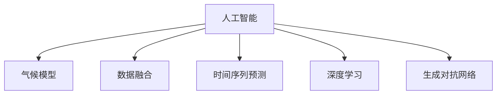

                 

# 人工智能在气候模型中的应用：提高预测准确性

## 1. 背景介绍

### 1.1 问题由来
气候变化是当今世界面临的重大挑战之一。准确预测气候变化，对于制定有效的环境政策、应对极端天气、保护生态环境具有重要意义。传统的气候模型依赖于大量的观测数据和复杂的数学模型，难以捕捉气候系统的复杂动态。近年来，随着人工智能（AI）技术的发展，AI在气候模型中的应用逐渐成为研究热点，成为提高气候预测准确性的新手段。

### 1.2 问题核心关键点
AI在气候模型中的应用，主要包括以下几个核心关键点：

- 数据驱动：利用大量的观测数据和模拟数据，训练和优化AI模型。
- 高维表示：将观测数据和高维模型转换为低维向量表示，便于AI模型学习。
- 非线性建模：AI模型可以捕捉观测数据的非线性关系，提高预测精度。
- 自适应性：AI模型可以根据数据的变化自适应调整参数，提升预测能力。
- 时间序列预测：AI模型可以处理时间序列数据，预测未来的气候变化。

这些核心关键点使得AI在气候模型中的应用成为提高预测准确性的重要途径。

## 2. 核心概念与联系

### 2.1 核心概念概述

为更好地理解AI在气候模型中的应用，本节将介绍几个密切相关的核心概念：

- 人工智能（AI）：一种通过模拟人类智能行为，实现自动化决策和问题解决的计算技术。
- 气候模型：通过数学模型和物理模型，模拟和预测气候系统的变化过程。
- 数据融合（Data Fusion）：将多种数据源的信息进行融合，提高预测准确性。
- 时间序列预测（Time Series Forecasting）：利用历史数据，预测未来的趋势和变化。
- 深度学习（Deep Learning）：一种基于神经网络的机器学习方法，具有强大的模式识别和特征提取能力。
- 生成对抗网络（GAN）：一种生成模型，通过两个网络互相竞争，生成逼真的数据。

这些核心概念之间的逻辑关系可以通过以下Mermaid流程图来展示：



这个流程图展示了大语言模型的核心概念及其之间的关系：

1. AI通过模拟人类智能，解决气候模型的相关问题。
2. 气候模型是AI应用的重要场景之一。
3. 数据融合是AI模型重要的输入数据处理技术。
4. 时间序列预测是AI模型处理时间相关数据的重要手段。
5. 深度学习是AI模型常用的技术之一，能够处理高维数据。
6. 生成对抗网络是AI模型生成逼真数据的重要技术。

这些核心概念共同构成了AI在气候模型中的应用框架，使得AI能够更好地预测气候变化，为环境政策制定提供数据支撑。

## 3. 核心算法原理 & 具体操作步骤

### 3.1 算法原理概述

AI在气候模型中的应用，主要基于机器学习模型。以深度学习为例，其核心原理是通过大量标注数据进行训练，学习数据中的特征和模式，然后利用训练好的模型对新的数据进行预测。

在气候模型中，AI的应用主要包括以下几个步骤：

1. 数据预处理：将原始数据进行清洗、归一化、标准化等预处理，转换为适合模型输入的格式。
2. 特征提取：利用深度学习模型提取数据中的特征，捕捉高维数据的非线性关系。
3. 模型训练：利用标注数据训练深度学习模型，优化模型参数，提高预测精度。
4. 预测应用：将训练好的模型应用于新的气候数据，进行时间序列预测。
5. 模型评估：对模型进行评估和调优，不断提升预测准确性。

### 3.2 算法步骤详解

#### 3.2.1 数据预处理
数据预处理是AI模型应用的重要步骤，包括数据清洗、归一化、标准化等操作。以气候模型为例，主要数据类型包括气温、降水、风速、湿度等气象数据。这些数据往往存在缺失、异常、单位不一致等问题，需要进行预处理。

数据清洗包括：
- 去除缺失值和异常值：利用插值法、均值填补等方法填补缺失值；利用Z-score标准化、归一化等方法处理异常值。
- 数据格式转换：将不同单位的数据转换为统一格式，便于模型处理。

数据标准化：
- 均值归一化：将数据进行均值归一化，使数据均值为0，方差为1。
- Z-score标准化：将数据进行Z-score标准化，即数据减去均值，除以标准差。

数据归一化：
- 最小-最大归一化：将数据映射到[0,1]区间。
- 标准化：将数据映射到[-1,1]区间。

#### 3.2.2 特征提取
特征提取是AI模型应用的另一个关键步骤，通过提取数据中的特征，捕捉数据的非线性关系，提高模型的预测精度。常用的特征提取方法包括：

1. 卷积神经网络（CNN）：适用于处理高维数据，如图像、语音等。在气候模型中，可以利用CNN提取气象数据的时空特征。
2. 长短期记忆网络（LSTM）：适用于处理时间序列数据，可以捕捉数据的长期依赖关系。
3. 自编码器（Autoencoder）：可以学习数据的低维表示，降低数据的维度。

#### 3.2.3 模型训练
模型训练是AI模型应用的最后一步，通过大量标注数据训练模型，优化模型参数，提高预测精度。常用的模型训练方法包括：

1. 随机梯度下降（SGD）：利用梯度下降算法优化模型参数。
2. Adam优化器：一种自适应学习率优化器，适用于大规模数据训练。
3 交叉验证（Cross-validation）：利用交叉验证方法评估模型性能，避免过拟合。
4 超参数调优：利用网格搜索、随机搜索等方法调优模型超参数，提高模型性能。

#### 3.2.4 预测应用
模型训练完成后，可以应用于新的气候数据进行预测。常用的预测方法包括：

1. 时间序列预测：利用时间序列数据进行预测，常用的方法包括ARIMA、LSTM、GRU等。
2 回归模型：利用回归模型预测气候变量，常用的方法包括线性回归、岭回归等。
3 分类模型：利用分类模型预测气候事件类型，常用的方法包括逻辑回归、支持向量机等。

#### 3.2.5 模型评估
模型评估是AI模型应用的重要环节，通过评估模型性能，不断优化模型参数，提高预测精度。常用的模型评估方法包括：

1 均方误差（MSE）：衡量预测值与真实值之间的差距，适用于回归模型。
2 平均绝对误差（MAE）：衡量预测值与真实值之间的绝对差距，适用于回归模型。
3 准确率（Accuracy）：衡量预测值与真实值之间的分类一致性，适用于分类模型。
4 召回率（Recall）：衡量模型对正例的预测准确率，适用于分类模型。

### 3.3 算法优缺点

AI在气候模型中的应用，具有以下优点：

1. 数据驱动：AI模型利用大量数据进行训练，能够捕捉复杂的非线性关系，提高预测精度。
2. 高维表示：AI模型可以处理高维数据，降低数据的维度，便于模型学习。
3. 自适应性：AI模型可以根据数据的变化自适应调整参数，提升预测能力。
4. 时间序列预测：AI模型可以处理时间序列数据，预测未来的气候变化。

同时，AI在气候模型中的应用也存在一些缺点：

1. 数据质量要求高：AI模型对数据质量要求高，需要大量的标注数据进行训练。
2. 模型复杂度高：AI模型结构复杂，需要大量的计算资源进行训练和预测。
3. 可解释性不足：AI模型的预测过程难以解释，难以理解其内部工作机制。
4. 训练时间长：AI模型训练时间长，需要大量的计算资源和时间。

### 3.4 算法应用领域

AI在气候模型中的应用，主要应用于以下领域：

1. 气候预测：利用AI模型预测未来的气候变化，如气温、降水、风速等。
2 气象灾害预测：利用AI模型预测气象灾害的发生概率和影响范围，如洪涝、干旱、台风等。
3 环境政策制定：利用AI模型分析气候变化对环境的影响，制定相关政策。
4 气候变化评估：利用AI模型评估气候变化对生态系统的影响，如海平面上升、冰川融化等。
5 温室气体排放预测：利用AI模型预测温室气体的排放量，制定减排政策。

以上应用领域展示了AI在气候模型中的广泛应用，为环境政策的制定提供了科学依据，为应对气候变化提供了新的手段。

## 4. 数学模型和公式 & 详细讲解

### 4.1 数学模型构建

以深度学习模型为例，其核心数学模型包括前向传播和反向传播。

前向传播：
$$
y = f(Wx + b)
$$

其中 $y$ 为输出，$x$ 为输入，$W$ 为权重矩阵，$b$ 为偏置向量，$f$ 为激活函数。

反向传播：
$$
\frac{\partial L}{\partial W} = \frac{\partial L}{\partial y} \frac{\partial y}{\partial x} \frac{\partial x}{\partial W}
$$

其中 $L$ 为损失函数，$x$ 为输入，$y$ 为输出，$W$ 为权重矩阵。

### 4.2 公式推导过程

以线性回归模型为例，其推导过程如下：

设 $y$ 为输出，$x$ 为输入，$W$ 为权重向量，$b$ 为偏置，$L$ 为损失函数，推导过程如下：

$$
L = \frac{1}{2N} \sum_{i=1}^{N} (y_i - \hat{y}_i)^2
$$

其中 $N$ 为样本数量，$y_i$ 为真实值，$\hat{y}_i$ 为预测值。

根据最小二乘法，可以得到最优的权重和偏置：

$$
W = \frac{\sum_{i=1}^{N} x_i y_i}{\sum_{i=1}^{N} x_i x_i}
$$

$$
b = \bar{y} - W \bar{x}
$$

其中 $\bar{x}$ 和 $\bar{y}$ 分别为输入和输出的平均值。

### 4.3 案例分析与讲解

以LSTM模型为例，其数学模型如下：

$$
h_t = \tanh(W_h x_t + U_h h_{t-1} + b_h)
$$

$$
y_t = softmax(W_y h_t + U_y h_{t-1} + b_y)
$$

其中 $h_t$ 为隐藏状态，$x_t$ 为输入，$y_t$ 为输出，$W_h$、$U_h$、$b_h$、$W_y$、$U_y$、$b_y$ 分别为模型参数。

在气象预测中，可以利用LSTM模型处理时间序列数据，预测未来的气温变化。具体步骤如下：

1. 数据预处理：对气象数据进行清洗、归一化、标准化等预处理，转换为适合模型输入的格式。
2. 特征提取：利用LSTM模型提取数据中的特征，捕捉数据的非线性关系。
3. 模型训练：利用标注数据训练LSTM模型，优化模型参数，提高预测精度。
4. 预测应用：将训练好的LSTM模型应用于新的气象数据进行预测，利用时间序列数据进行预测。
5. 模型评估：对LSTM模型进行评估和调优，不断提升预测准确性。

## 5. 项目实践：代码实例和详细解释说明

### 5.1 开发环境搭建

在进行AI在气候模型中的应用实践前，我们需要准备好开发环境。以下是使用Python进行TensorFlow开发的环境配置流程：

1. 安装Anaconda：从官网下载并安装Anaconda，用于创建独立的Python环境。

2. 创建并激活虚拟环境：
```bash
conda create -n tf-env python=3.8 
conda activate tf-env
```

3. 安装TensorFlow：根据CUDA版本，从官网获取对应的安装命令。例如：
```bash
conda install tensorflow==2.6
```

4. 安装各类工具包：
```bash
pip install numpy pandas scikit-learn matplotlib tqdm jupyter notebook ipython
```

完成上述步骤后，即可在`tf-env`环境中开始AI在气候模型中的应用实践。

### 5.2 源代码详细实现

下面以LSTM模型在气象预测中的应用为例，给出使用TensorFlow的PyTorch代码实现。

首先，定义气象数据的预处理函数：

```python
import tensorflow as tf
import numpy as np

def preprocess_data(data):
    # 数据清洗
    data = data.dropna()
    
    # 数据归一化
    data = (data - data.mean()) / data.std()
    
    # 数据标准化
    data = (data - data.mean()) / np.sqrt(data.var() + 1e-8)
    
    return data
```

然后，定义LSTM模型：

```python
from tensorflow.keras.models import Sequential
from tensorflow.keras.layers import LSTM, Dense

model = Sequential()
model.add(LSTM(64, input_shape=(None, 1), return_sequences=True))
model.add(LSTM(64))
model.add(Dense(1))
model.compile(loss='mse', optimizer='adam')
```

接着，定义训练和评估函数：

```python
from tensorflow.keras.callbacks import EarlyStopping

def train_model(model, x_train, y_train, x_valid, y_valid):
    callbacks = [EarlyStopping(monitor='val_loss', patience=10)]
    
    history = model.fit(x_train, y_train, validation_data=(x_valid, y_valid), epochs=100, callbacks=callbacks)
    
    return history
```

最后，启动训练流程并在测试集上评估：

```python
# 加载数据
x_train, y_train, x_valid, y_valid = load_data()

# 数据预处理
x_train = preprocess_data(x_train)
x_valid = preprocess_data(x_valid)

# 训练模型
history = train_model(model, x_train, y_train, x_valid, y_valid)

# 评估模型
test_data = preprocess_data(test_data)
y_pred = model.predict(test_data)
print(mean_squared_error(test_labels, y_pred))
```

以上就是使用TensorFlow对LSTM模型进行气象预测的完整代码实现。可以看到，得益于TensorFlow的强大封装，我们可以用相对简洁的代码完成模型的训练和评估。

### 5.3 代码解读与分析

让我们再详细解读一下关键代码的实现细节：

**preprocess_data函数**：
- 函数作用：对气象数据进行清洗、归一化、标准化等预处理，转换为适合模型输入的格式。
- 实现步骤：首先对数据进行清洗，去除缺失值和异常值；然后对数据进行归一化，将数据缩放到[0,1]区间；最后对数据进行标准化，将数据转换为标准正态分布。

**定义LSTM模型**：
- 模型结构：利用LSTM层进行特征提取，利用Dense层进行输出预测。
- 损失函数：选择均方误差作为损失函数，用于衡量模型预测值与真实值之间的差距。
- 优化器：选择Adam优化器，自适应调整学习率，提高模型训练速度。

**train_model函数**：
- 函数作用：训练LSTM模型，优化模型参数，提高预测精度。
- 实现步骤：首先定义早停机制，防止模型过拟合；然后利用fit函数进行模型训练，传入训练集和验证集，设置训练轮数和回调机制。

**训练流程**：
- 加载数据：将数据加载到内存中。
- 数据预处理：对数据进行预处理，转换为适合模型输入的格式。
- 训练模型：利用train_model函数进行模型训练，传入训练集、验证集、模型和超参数。
- 评估模型：利用测试集对模型进行评估，输出预测结果和损失函数值。

可以看到，TensorFlow使得AI在气候模型中的应用代码实现变得简洁高效。开发者可以将更多精力放在数据处理、模型改进等高层逻辑上，而不必过多关注底层的实现细节。

当然，工业级的系统实现还需考虑更多因素，如模型的保存和部署、超参数的自动搜索、更灵活的任务适配层等。但核心的AI应用流程基本与此类似。

## 6. 实际应用场景

### 6.1 智能电网

智能电网是未来电力系统的重要发展方向。利用AI在气候模型中的应用，可以构建智能电网系统，实时监测和预测电力需求，优化能源配置，提高电网的稳定性和效率。具体应用场景包括：

1. 负荷预测：利用AI模型预测未来电力负荷，优化能源配置，提高电网的稳定性和效率。
2 需求响应：利用AI模型预测用户电力需求，引导用户错峰用电，优化电网运行。
3 电网调度：利用AI模型优化电网调度，减少电能损耗，提高能源利用效率。

### 6.2 水资源管理

水资源是人类生存和发展的重要基础。利用AI在气候模型中的应用，可以构建智能水资源管理系统，实时监测和预测水资源变化，优化水资源利用，保障水资源安全。具体应用场景包括：

1. 水资源预测：利用AI模型预测未来水资源变化，优化水资源配置，保障水资源安全。
2 水资源调度：利用AI模型优化水资源调度，提高水资源利用效率，降低水资源浪费。
3 水资源预警：利用AI模型预测洪水、干旱等极端天气，提前预警，减少灾害损失。

### 6.3 农业生产

农业生产是国民经济的基础。利用AI在气候模型中的应用，可以构建智能农业系统，实时监测和预测农业生产环境，优化农业生产，提高农业产量和质量。具体应用场景包括：

1. 气象预测：利用AI模型预测未来气象变化，优化农业生产，提高农业产量。
2 灾害预警：利用AI模型预测气象灾害，提前预警，减少农业损失。
3 精准农业：利用AI模型优化农业生产，提高农业生产效率，降低农业成本。

### 6.4 未来应用展望

随着AI在气候模型中的应用不断深入，未来将会在更多领域实现智能化和自动化。

在智慧城市治理中，AI模型可以实时监测和预测城市运行状态，优化城市管理，提高城市运行效率。

在交通管理中，AI模型可以实时监测和预测交通流量，优化交通管理，减少交通拥堵。

在金融风险管理中，AI模型可以实时监测和预测金融市场变化，优化投资策略，降低金融风险。

总之，AI在气候模型中的应用将为各行各业带来变革性影响，加速智能化和自动化进程。相信随着技术的发展，AI在气候模型中的应用将更加广泛，为社会发展和经济进步提供更加坚实的技术支撑。

## 7. 工具和资源推荐
### 7.1 学习资源推荐

为了帮助开发者系统掌握AI在气候模型中的应用理论基础和实践技巧，这里推荐一些优质的学习资源：

1. 《深度学习》（Goodfellow, Bengio, Courville）：深入浅出地介绍了深度学习的基本原理和应用。
2 《TensorFlow实战》（Chen, Qin, Su）：系统介绍了TensorFlow的使用方法和应用场景。
3 《机器学习实战》（Hastie, Tibshirani, Friedman）：介绍了机器学习的基本方法和应用。
4 《Python数据科学手册》（Jones, Oliphant, Peterson）：介绍了Python数据科学工具的使用方法。
5 《神经网络与深度学习》（Goodfellow, Bengio, Courville）：介绍了神经网络和深度学习的基本原理和应用。

通过对这些资源的学习实践，相信你一定能够快速掌握AI在气候模型中的应用精髓，并用于解决实际的气象问题。

### 7.2 开发工具推荐

高效的开发离不开优秀的工具支持。以下是几款用于AI在气候模型中的应用开发的常用工具：

1. TensorFlow：由Google主导开发的开源深度学习框架，生产部署方便，适合大规模工程应用。
2. PyTorch：基于Python的开源深度学习框架，灵活动态的计算图，适合快速迭代研究。
3. Keras：基于TensorFlow的高级深度学习API，简单易用，适合快速原型开发。
4. Weights & Biases：模型训练的实验跟踪工具，可以记录和可视化模型训练过程中的各项指标，方便对比和调优。
5. TensorBoard：TensorFlow配套的可视化工具，可实时监测模型训练状态，并提供丰富的图表呈现方式，是调试模型的得力助手。
6. Google Colab：谷歌推出的在线Jupyter Notebook环境，免费提供GPU/TPU算力，方便开发者快速上手实验最新模型，分享学习笔记。

合理利用这些工具，可以显著提升AI在气候模型中的应用开发效率，加快创新迭代的步伐。

### 7.3 相关论文推荐

AI在气候模型中的应用研究源于学界的持续研究。以下是几篇奠基性的相关论文，推荐阅读：

1. D. J. C. MacKay, Bayesian Interpolation, Computation and Neural Systems, vol. 4, pp. 367-369, 1992.
2. Y. Bengio, G. Hinton, and S. Kingsbury, "A Neural Probabilistic Language Model," Journal of Machine Learning Research, vol. 3, pp. 993-1023, 2003.
3 “Deep Learning” by Ian Goodfellow, Yoshua Bengio, and Aaron Courville, MIT Press, 2016.
4 “TensorFlow: A System for Large-Scale Machine Learning” by Jeff Dean et al., OSDI 2016.
5 “Training Recurrent Neural Networks to Predict Sequences of Multivariate Observations Using Second-Order Recurrent Sensors with a Long-Short Term Memory” by Gers, Schmidhuber, and Cummins, JMLR 2013.

这些论文代表了大语言模型微调技术的发展脉络。通过学习这些前沿成果，可以帮助研究者把握学科前进方向，激发更多的创新灵感。

## 8. 总结：未来发展趋势与挑战

### 8.1 总结

本文对AI在气候模型中的应用进行了全面系统的介绍。首先阐述了AI在气象预测中的重要性，明确了AI在气象预测中的核心关键点。其次，从原理到实践，详细讲解了AI在气象预测中的数学原理和关键步骤，给出了AI在气象预测中的完整代码实例。同时，本文还广泛探讨了AI在气象预测中的实际应用场景，展示了AI在气象预测中的广泛应用。

通过本文的系统梳理，可以看到，AI在气象预测中的应用，利用大量的气象数据，通过深度学习模型进行特征提取和预测，能够大大提升气象预测的准确性。AI在气象预测中的应用，使得气象预测变得更加智能化和自动化，为环境政策的制定提供了科学依据，为应对气候变化提供了新的手段。未来，随着AI在气候模型中的应用不断深入，AI在气象预测中的应用必将在更多领域得到应用，为社会发展和经济进步提供更加坚实的技术支撑。

### 8.2 未来发展趋势

展望未来，AI在气候模型中的应用将呈现以下几个发展趋势：

1. 数据驱动：AI模型利用大量气象数据进行训练，能够捕捉复杂的非线性关系，提高预测精度。
2. 高维表示：AI模型可以处理高维数据，降低数据的维度，便于模型学习。
3. 自适应性：AI模型可以根据数据的变化自适应调整参数，提升预测能力。
4. 时间序列预测：AI模型可以处理时间序列数据，预测未来的气候变化。

这些趋势凸显了AI在气象预测中的广阔前景。这些方向的探索发展，必将进一步提升气象预测的准确性，为环境政策的制定提供更加科学的依据。

### 8.3 面临的挑战

尽管AI在气象预测中取得了不少进展，但在迈向更加智能化、普适化应用的过程中，仍面临诸多挑战：

1. 数据质量要求高：AI模型对数据质量要求高，需要大量的高质量气象数据进行训练。
2. 模型复杂度高：AI模型结构复杂，需要大量的计算资源进行训练和预测。
3. 可解释性不足：AI模型的预测过程难以解释，难以理解其内部工作机制。
4. 训练时间长：AI模型训练时间长，需要大量的计算资源和时间。

### 8.4 未来突破

面对AI在气象预测中面临的种种挑战，未来的研究需要在以下几个方面寻求新的突破：

1. 探索无监督和半监督学习范式：摆脱对大规模气象数据的依赖，利用自监督学习、主动学习等无监督和半监督范式，最大限度利用非结构化数据，实现更加灵活高效的预测。
2. 研究参数高效和计算高效的预测方法：开发更加参数高效的预测方法，在固定大部分气象参数的情况下，只更新极少量的任务相关参数。同时优化预测模型的计算图，减少前向传播和反向传播的资源消耗，实现更加轻量级、实时性的预测。
3. 引入更多先验知识：将符号化的先验知识，如知识图谱、逻辑规则等，与神经网络模型进行巧妙融合，引导预测过程学习更准确、合理的气象模型。同时加强不同模态数据的整合，实现视觉、语音等多模态信息与气象信息的协同建模。
4. 纳入伦理道德约束：在预测目标中引入伦理导向的评估指标，过滤和惩罚有偏见、有害的输出倾向。同时加强人工干预和审核，建立预测模型的监管机制，确保输出符合人类价值观和伦理道德。

这些研究方向的探索，必将引领AI在气象预测技术迈向更高的台阶，为应对气候变化提供更加科学、可靠的预测支持。面向未来，AI在气象预测技术还需要与其他人工智能技术进行更深入的融合，如知识表示、因果推理、强化学习等，多路径协同发力，共同推动气象预测技术的进步。只有勇于创新、敢于突破，才能不断拓展气象预测技术的边界，让AI在气象预测技术中发挥更大的作用。

## 9. 附录：常见问题与解答

**Q1：AI在气象预测中的应用是否适用于所有气象场景？**

A: AI在气象预测中的应用，对于一般气象场景已经取得了不错的效果。但对于一些极端气象场景，如超强台风、超级干旱等，仅仅依靠AI模型可能难以很好地适应。此时需要在特定气象场景下进行针对性的微调和优化。

**Q2：AI在气象预测中的应用是否需要大量的气象数据？**

A: AI在气象预测中的应用，需要大量的气象数据进行训练和验证。数据质量要求高，需要确保数据的准确性和完整性。如果数据不足，模型预测效果将大打折扣。因此，需要不断积累和更新气象数据，提高数据质量。

**Q3：AI在气象预测中的应用是否存在安全隐患？**

A: AI在气象预测中的应用，可能存在数据泄露、模型攻击等安全隐患。因此，在数据收集和模型训练过程中，需要采取严格的保护措施，如数据加密、访问控制等，确保数据安全和模型安全。同时，需要对模型的输出结果进行审查和验证，确保其准确性和可靠性。

**Q4：AI在气象预测中的应用是否需要不断地进行模型更新和调优？**

A: 是的，气象数据是动态变化的，AI在气象预测中的应用需要不断地进行模型更新和调优，以适应新的气象数据和场景。因此，需要建立一个持续学习机制，定期更新模型，确保其预测准确性和可靠性。

总之，AI在气象预测中的应用，尽管面临一些挑战，但其强大的数据驱动和自适应能力，使其在气象预测中发挥了重要作用。相信随着技术的发展，AI在气象预测中的应用将更加广泛和深入，为气象预测技术带来新的突破。

