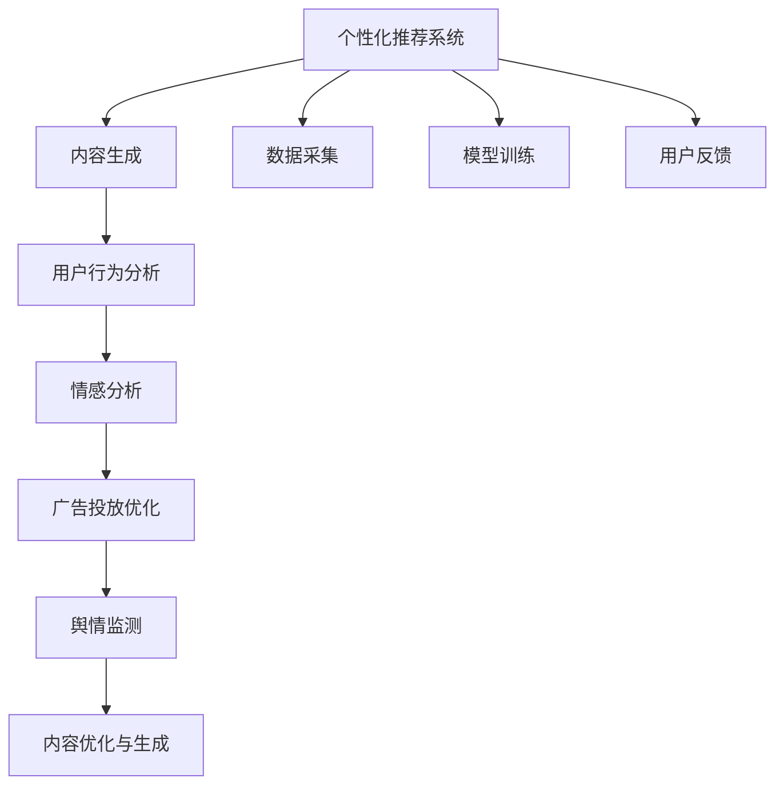

                 

# 人工智能在注意力经济中的应用

> 关键词：人工智能,注意力经济,内容推荐,个性化推荐系统,深度学习,强化学习,自然语言处理,NLP

## 1. 背景介绍

### 1.1 问题由来

随着互联网的迅猛发展，内容生产与消费的模式发生了根本性的变革。一方面，信息总量呈指数级增长，内容生产者获取关注成本日益增加；另一方面，用户个性化需求日益凸显，内容消费方式逐渐向定制化、个性化转变。

这一现象催生了注意力经济（Attention Economy）的兴起，其本质在于内容生产者通过精准内容推荐、用户行为洞察等手段，吸引并维持用户注意力，从而实现内容变现与商业价值创造。人工智能技术的引入，通过深度学习、强化学习、自然语言处理（NLP）等先进手段，为注意力经济提供了有力的技术支撑。

### 1.2 问题核心关键点

人工智能在注意力经济中的应用主要集中在以下几个方面：

1. **个性化推荐系统**：通过机器学习算法为用户推荐感兴趣的内容，提升用户体验，并提高内容平台的点击率与留存率。
2. **内容优化与生成**：利用自然语言处理技术自动生成个性化内容，优化广告文案、用户评论等，提高内容吸引力。
3. **用户行为分析**：通过数据挖掘与机器学习技术分析用户行为数据，预测用户需求，优化内容推荐策略。
4. **广告投放优化**：基于用户兴趣与行为数据，实现广告精准投放，提升广告效果，降低投放成本。
5. **情感分析与舆情监测**：利用情感分析技术监测用户对内容的情感反馈，通过舆情监测工具获取市场舆情信息，辅助内容策略制定。

这些应用场景均依托于人工智能技术对数据的高效处理与智能分析，能够大幅提升注意力经济的运营效率与用户满意度。

### 1.3 问题研究意义

人工智能技术在注意力经济中的应用，对于优化内容推荐、提高广告效果、增强用户粘性等方面具有重要意义：

1. **降低内容生产成本**：通过智能推荐与生成技术，减轻内容生产者的创作负担，降低内容生产的固定成本与风险。
2. **提升内容运营效率**：利用AI技术进行用户行为分析与情感分析，优化内容策略，精准投放广告，提升用户留存率与平台收益。
3. **增强用户体验**：根据用户个性化需求，提供定制化内容，增强用户对平台的粘性与忠诚度。
4. **拓展内容变现渠道**：通过精准广告投放与市场舆情监测，优化广告效果，拓展更多元化的内容变现渠道。
5. **推动产业升级**：借助AI技术，传统媒体与内容平台能够提升竞争力，实现向智慧媒体的转型。

## 2. 核心概念与联系

### 2.1 核心概念概述

为更好地理解人工智能在注意力经济中的应用，本节将介绍几个关键概念：

- **个性化推荐系统（Personalized Recommendation System）**：通过机器学习算法，根据用户历史行为与兴趣偏好，推荐可能感兴趣的内容，提升用户体验。
- **内容生成（Content Generation）**：利用自然语言处理技术，自动生成符合用户需求与喜好的内容，如新闻摘要、广告文案等。
- **用户行为分析（User Behavior Analysis）**：通过数据挖掘与机器学习技术，分析用户行为数据，挖掘用户兴趣点与需求。
- **情感分析（Sentiment Analysis）**：利用NLP技术，分析用户对内容的情感反馈，指导内容优化与策略制定。
- **广告投放优化（Advertising Optimization）**：基于用户兴趣与行为数据，实现广告的精准投放，提升广告效果。
- **舆情监测（Sentiment Monitoring）**：通过数据采集与情感分析技术，实时监测市场舆情，辅助决策制定。

这些核心概念之间相互关联，共同构成了人工智能在注意力经济中的完整应用体系。

### 2.2 核心概念原理和架构的 Mermaid 流程图



此流程图展示了人工智能在注意力经济中各应用场景的相互关系：

1. **数据采集**：收集用户行为数据、内容反馈等，为后续分析与推荐提供基础数据。
2. **模型训练**：基于收集到的数据，训练机器学习模型，如协同过滤、深度学习等。
3. **内容生成**：根据用户偏好与行为数据，自动生成个性化内容。
4. **用户行为分析**：利用数据挖掘与机器学习技术，分析用户行为特征，预测用户需求。
5. **情感分析**：通过NLP技术分析用户对内容的情感反馈，优化内容策略。
6. **广告投放优化**：基于用户兴趣与行为数据，实现广告的精准投放。
7. **舆情监测**：实时监测市场舆情，辅助决策制定。
8. **内容优化与生成**：通过情感分析与用户行为分析，优化现有内容，生成新内容。

这些环节相互支持，共同构建起完整的注意力经济生态系统。

## 3. 核心算法原理 & 具体操作步骤

### 3.1 算法原理概述

人工智能在注意力经济中的应用，核心在于通过机器学习算法对海量数据进行高效分析，构建用户兴趣模型与内容推荐模型，实现个性化内容推荐与精准广告投放。具体算法原理包括以下几个方面：

- **协同过滤（Collaborative Filtering）**：基于用户历史行为，预测其未来兴趣，推荐相关内容。
- **深度学习模型（Deep Learning Model）**：通过神经网络对用户行为与内容特征进行建模，实现更准确的推荐。
- **强化学习（Reinforcement Learning）**：通过用户交互数据，不断优化推荐算法，提升推荐效果。
- **自然语言处理（NLP）**：利用NLP技术，自动生成个性化内容，进行情感分析与舆情监测。

这些算法通过协同工作，形成了完整的个性化推荐系统与广告投放系统，极大地提升了注意力经济的应用效果。

### 3.2 算法步骤详解

基于上述算法原理，人工智能在注意力经济中的应用步骤主要包括以下几个环节：

**Step 1: 数据准备与处理**

- 收集用户行为数据，如浏览记录、点击行为、评分等。
- 清洗与预处理数据，去除噪声与异常值，进行特征工程。
- 将数据划分为训练集、验证集与测试集，为后续模型训练提供数据基础。

**Step 2: 模型训练与优化**

- 选择适合的机器学习算法，如协同过滤、深度学习模型等。
- 在训练集上训练模型，调整超参数，如学习率、正则化系数等。
- 在验证集上评估模型效果，选择最优模型。
- 在测试集上测试模型性能，进行效果评估。

**Step 3: 内容推荐与生成**

- 基于训练好的模型，进行内容推荐。
- 利用自然语言处理技术，自动生成个性化内容。
- 根据用户反馈，不断优化推荐策略，提升推荐效果。

**Step 4: 广告投放优化**

- 基于用户兴趣与行为数据，实现广告精准投放。
- 根据投放效果，优化广告内容与投放策略。
- 实时监测广告效果，调整投放策略，提升广告效果。

**Step 5: 用户行为分析与情感分析**

- 分析用户行为数据，挖掘用户兴趣点与需求。
- 利用情感分析技术，分析用户对内容的情感反馈。
- 根据情感分析结果，优化内容策略，提升用户满意度。

### 3.3 算法优缺点

人工智能在注意力经济中的应用具有以下优点：

- **高效性**：通过机器学习算法，能够快速处理海量数据，实现实时推荐与投放。
- **个性化**：根据用户历史行为与兴趣偏好，实现个性化推荐，提升用户体验。
- **精准性**：利用深度学习与强化学习技术，优化推荐算法，提升推荐效果。

同时，也存在以下缺点：

- **数据依赖**：需要大量的用户行为数据，数据质量与标注对算法效果有较大影响。
- **模型复杂度**：深度学习模型参数较多，训练与优化较为复杂。
- **推荐偏差**：推荐算法可能存在冷启动问题与推荐偏差。
- **隐私问题**：用户行为数据与个性化推荐可能导致隐私问题，需合理处理用户隐私保护。

### 3.4 算法应用领域

人工智能在注意力经济中的应用，主要集中在以下领域：

1. **社交网络平台**：通过个性化推荐与情感分析，优化用户互动体验，提高平台活跃度。
2. **电商与零售行业**：利用个性化推荐与广告投放优化，提升用户购买率与转化率。
3. **新闻与媒体行业**：通过内容推荐与舆情监测，提高新闻阅读率与平台曝光度。
4. **在线教育与培训**：基于用户学习行为，推荐个性化课程与资料，提升学习效果。
5. **游戏与娱乐行业**：利用个性化推荐与情感分析，提升用户粘性与游戏体验。
6. **金融与保险行业**：通过数据分析与智能推荐，提升客户服务与满意度。

这些领域均是注意力经济的重要组成部分，人工智能技术的引入，能够显著提升相关业务的市场竞争力和用户体验。

## 4. 数学模型和公式 & 详细讲解  
### 4.1 数学模型构建

在注意力经济中，机器学习模型主要包括以下几种：

- **协同过滤模型**：基于用户-物品矩阵，通过矩阵分解或基于用户的协同过滤，推荐相关物品。
- **深度学习模型**：利用神经网络对用户行为与物品特征进行建模，推荐相关物品。
- **强化学习模型**：通过用户交互数据，不断优化推荐策略，提升推荐效果。
- **情感分析模型**：通过NLP技术，分析用户对内容的情感反馈。

**协同过滤模型的数学模型**：

设用户集合为 $U$，物品集合为 $I$，用户对物品的评分矩阵为 $R \in \mathbb{R}^{n \times m}$，其中 $n$ 为用户数，$m$ 为物品数。协同过滤模型通过用户历史评分数据 $R$ 和用户-物品相似度矩阵 $A$ 进行推荐。

用户 $u$ 对物品 $i$ 的预测评分 $r_{ui}$ 为：

$$
r_{ui} = \mathbf{a}_u \cdot A \mathbf{i}_i
$$

其中，$\mathbf{a}_u$ 为用户 $u$ 的特征向量，$A$ 为相似度矩阵，$\mathbf{i}_i$ 为物品 $i$ 的特征向量。

**深度学习模型的数学模型**：

深度学习模型使用神经网络对用户行为与物品特征进行建模。设用户行为数据为 $D=\{(x_i,y_i)\}_{i=1}^N$，其中 $x_i$ 为输入特征向量，$y_i$ 为标签。深度学习模型 $f_\theta$ 的损失函数为：

$$
\mathcal{L}(\theta) = \frac{1}{N} \sum_{i=1}^N \ell(f_\theta(x_i),y_i)
$$

其中，$\ell$ 为损失函数，如均方误差、交叉熵等。

**强化学习模型的数学模型**：

强化学习模型通过用户交互数据，不断优化推荐策略。设状态集合为 $S$，动作集合为 $A$，奖励函数为 $Q(s,a)$，状态转移概率为 $P(s'|s,a)$。强化学习模型在状态 $s$ 下采取动作 $a$，获得的奖励为 $R(s,a,s')$，状态转移为 $s' \sim P(s'|s,a)$。强化学习模型的目标是最大化长期奖励，即：

$$
\max_{\pi} \mathbb{E}_{s \sim \rho_0, a \sim \pi, s' \sim P} \sum_{t=1}^\infty \gamma^{t-1} R(s_t,a_t,s_{t+1})
$$

其中，$\pi$ 为策略，$\rho_0$ 为初始状态分布，$\gamma$ 为折扣因子。

### 4.2 公式推导过程

**协同过滤模型**：

协同过滤模型的推荐公式为：

$$
\hat{y} = f_{w,A}(X)
$$

其中，$f_{w,A}$ 为协同过滤模型，$X$ 为输入特征向量。

利用矩阵分解方法，将用户-物品评分矩阵 $R$ 分解为两个低秩矩阵 $P$ 和 $Q$，即：

$$
R \approx PQ^T
$$

用户 $u$ 对物品 $i$ 的预测评分 $r_{ui}$ 为：

$$
r_{ui} = \sum_{j=1}^k p_{uj}q_{ij}
$$

其中，$k$ 为分解后的矩阵维度。

**深度学习模型**：

深度学习模型 $f_\theta$ 的参数优化目标为：

$$
\min_{\theta} \mathcal{L}(\theta)
$$

其中，$\theta$ 为模型参数，$\mathcal{L}$ 为损失函数。

利用梯度下降法，求解目标函数的最小值：

$$
\theta = \theta - \eta \nabla_{\theta}\mathcal{L}(\theta)
$$

其中，$\eta$ 为学习率，$\nabla_{\theta}\mathcal{L}(\theta)$ 为目标函数关于 $\theta$ 的梯度。

**强化学习模型**：

强化学习模型的策略优化目标为：

$$
\max_{\pi} \sum_{s \sim \rho_0} \sum_{t=1}^\infty \gamma^{t-1} R(s_t,a_t,s_{t+1})
$$

其中，$\pi$ 为策略，$\rho_0$ 为初始状态分布，$\gamma$ 为折扣因子。

利用Q-learning算法，求解目标函数的最大值：

$$
Q(s,a) \leftarrow (1-\alpha) Q(s,a) + \alpha (R(s,a,s') + \gamma \max_{a'} Q(s',a'))
$$

其中，$Q(s,a)$ 为状态-动作值函数，$\alpha$ 为学习率，$R(s,a,s')$ 为奖励函数，$s'$ 为状态转移结果。

### 4.3 案例分析与讲解

**协同过滤案例分析**：

某电商平台的协同过滤推荐系统，通过用户历史购买记录 $R$ 和物品相似度矩阵 $A$，为用户推荐可能感兴趣的物品。设用户 $u$ 对物品 $i$ 的预测评分 $r_{ui}$ 为：

$$
r_{ui} = \mathbf{a}_u \cdot A \mathbf{i}_i
$$

其中，$\mathbf{a}_u$ 为用户 $u$ 的特征向量，$A$ 为相似度矩阵，$\mathbf{i}_i$ 为物品 $i$ 的特征向量。

平台利用用户的浏览记录与评分数据，构建用户-物品评分矩阵 $R$，使用矩阵分解方法，将 $R$ 分解为两个低秩矩阵 $P$ 和 $Q$，即：

$$
R \approx PQ^T
$$

利用矩阵 $P$ 和 $Q$，预测用户对物品的评分，计算相似度，进行物品推荐。

**深度学习模型案例分析**：

某社交网络平台的用户推荐系统，利用深度学习模型对用户行为进行建模。设用户行为数据为 $D=\{(x_i,y_i)\}_{i=1}^N$，其中 $x_i$ 为输入特征向量，$y_i$ 为标签。深度学习模型 $f_\theta$ 的损失函数为：

$$
\mathcal{L}(\theta) = \frac{1}{N} \sum_{i=1}^N \ell(f_\theta(x_i),y_i)
$$

其中，$\ell$ 为损失函数，如均方误差、交叉熵等。

平台通过收集用户的历史行为数据，如浏览记录、点赞、评论等，构建训练集，训练深度学习模型 $f_\theta$。通过前向传播计算预测结果，反向传播更新模型参数，不断优化模型效果。

**强化学习模型案例分析**：

某在线教育平台的内容推荐系统，利用强化学习模型优化推荐策略。设状态集合为 $S$，动作集合为 $A$，奖励函数为 $Q(s,a)$，状态转移概率为 $P(s'|s,a)$。强化学习模型在状态 $s$ 下采取动作 $a$，获得的奖励为 $R(s,a,s')$，状态转移为 $s' \sim P(s'|s,a)$。

平台通过收集用户的历史学习数据，如课程学习时长、测试成绩等，构建训练集，训练强化学习模型。通过模拟用户学习行为，不断优化推荐策略，提升推荐效果。

## 5. 项目实践：代码实例和详细解释说明

### 5.1 开发环境搭建

在进行注意力经济应用开发前，我们需要准备好开发环境。以下是使用Python进行PyTorch开发的环境配置流程：

1. 安装Anaconda：从官网下载并安装Anaconda，用于创建独立的Python环境。

2. 创建并激活虚拟环境：
```bash
conda create -n pytorch-env python=3.8 
conda activate pytorch-env
```

3. 安装PyTorch：根据CUDA版本，从官网获取对应的安装命令。例如：
```bash
conda install pytorch torchvision torchaudio cudatoolkit=11.1 -c pytorch -c conda-forge
```

4. 安装TensorFlow：
```bash
pip install tensorflow
```

5. 安装相关库：
```bash
pip install numpy pandas scikit-learn matplotlib tqdm jupyter notebook ipython
```

完成上述步骤后，即可在`pytorch-env`环境中开始注意力经济应用开发。

### 5.2 源代码详细实现

下面我以个性化推荐系统为例，给出使用PyTorch进行协同过滤推荐系统的PyTorch代码实现。

首先，定义协同过滤模型的数据处理函数：

```python
import numpy as np
import pandas as pd
import torch
import torch.nn as nn
import torch.optim as optim

def load_data(filename):
    data = pd.read_csv(filename)
    user_ids = data['user_id'].tolist()
    item_ids = data['item_id'].tolist()
    ratings = data['rating'].tolist()
    return user_ids, item_ids, ratings

def preprocess_data(user_ids, item_ids, ratings):
    user_ids = torch.LongTensor(user_ids)
    item_ids = torch.LongTensor(item_ids)
    ratings = torch.FloatTensor(ratings)
    return user_ids, item_ids, ratings

def train_val_test_split(user_ids, item_ids, ratings, train_ratio=0.7, val_ratio=0.1):
    indices = np.random.permutation(len(user_ids))
    train_indices = indices[:int(len(indices)*train_ratio)]
    val_indices = indices[int(len(indices)*train_ratio):int(len(indices)*(train_ratio+val_ratio))]
    test_indices = indices[int(len(indices)*(train_ratio+val_ratio)):]
    train_user_ids, train_item_ids, train_ratings = user_ids[train_indices], item_ids[train_indices], ratings[train_indices]
    val_user_ids, val_item_ids, val_ratings = user_ids[val_indices], item_ids[val_indices], ratings[val_indices]
    test_user_ids, test_item_ids, test_ratings = user_ids[test_indices], item_ids[test_indices], ratings[test_indices]
    return train_user_ids, train_item_ids, train_ratings, val_user_ids, val_item_ids, val_ratings, test_user_ids, test_item_ids, test_ratings
```

然后，定义协同过滤模型的模型类：

```python
class CollaborativeFiltering(nn.Module):
    def __init__(self, num_users, num_items, embed_dim=128, latent_dim=128):
        super(CollaborativeFiltering, self).__init__()
        self.num_users = num_users
        self.num_items = num_items
        self.embed_dim = embed_dim
        self.latent_dim = latent_dim
        
        # User embedding
        self.user_embedding = nn.Embedding(num_users, embed_dim)
        
        # Item embedding
        self.item_embedding = nn.Embedding(num_items, embed_dim)
        
        # User-Item interaction layer
        self.interaction = nn.Linear(embed_dim, latent_dim)
        
        # Output layer
        self.output = nn.Linear(latent_dim, 1)
        
    def forward(self, user_ids, item_ids):
        user_embeds = self.user_embedding(user_ids)
        item_embeds = self.item_embedding(item_ids)
        interaction = torch.tanh(self.interaction(torch.cat([user_embeds, item_embeds], dim=1)))
        output = self.output(interaction)
        return output
```

接着，定义协同过滤模型的训练与评估函数：

```python
def train_model(model, train_user_ids, train_item_ids, train_ratings, val_user_ids, val_item_ids, val_ratings, optimizer, num_epochs, batch_size):
    device = torch.device('cuda' if torch.cuda.is_available() else 'cpu')
    model.to(device)
    
    for epoch in range(num_epochs):
        model.train()
        total_loss = 0.0
        for i in range(0, len(train_user_ids), batch_size):
            batch_user_ids = train_user_ids[i:i+batch_size].to(device)
            batch_item_ids = train_item_ids[i:i+batch_size].to(device)
            batch_ratings = train_ratings[i:i+batch_size].to(device)
            optimizer.zero_grad()
            output = model(batch_user_ids, batch_item_ids)
            loss = nn.MSELoss()(output, batch_ratings)
            loss.backward()
            optimizer.step()
            total_loss += loss.item()
        train_loss = total_loss / len(train_user_ids)
        print(f'Epoch {epoch+1}, train loss: {train_loss:.3f}')
        
        model.eval()
        total_loss = 0.0
        for i in range(0, len(val_user_ids), batch_size):
            batch_user_ids = val_user_ids[i:i+batch_size].to(device)
            batch_item_ids = val_item_ids[i:i+batch_size].to(device)
            batch_ratings = val_ratings[i:i+batch_size].to(device)
            output = model(batch_user_ids, batch_item_ids)
            loss = nn.MSELoss()(output, batch_ratings)
            total_loss += loss.item()
        val_loss = total_loss / len(val_user_ids)
        print(f'Epoch {epoch+1}, val loss: {val_loss:.3f}')
        
    print('Training complete.')
    
    return model
```

最后，启动训练流程并在测试集上评估：

```python
train_user_ids, train_item_ids, train_ratings, val_user_ids, val_item_ids, val_ratings, test_user_ids, test_item_ids, test_ratings = train_val_test_split(user_ids, item_ids, ratings, train_ratio=0.7, val_ratio=0.1)

num_epochs = 10
batch_size = 256
learning_rate = 0.001

model = CollaborativeFiltering(num_users, num_items)
optimizer = optim.Adam(model.parameters(), lr=learning_rate)

model = train_model(model, train_user_ids, train_item_ids, train_ratings, val_user_ids, val_item_ids, val_ratings, optimizer, num_epochs, batch_size)
```

以上就是使用PyTorch对协同过滤推荐系统进行开发的完整代码实现。可以看到，利用PyTorch的强大封装，我们能够轻松实现协同过滤模型的训练与评估，提升开发效率。

### 5.3 代码解读与分析

让我们再详细解读一下关键代码的实现细节：

**load_data函数**：
- 读取CSV格式的数据文件，提取用户ID、物品ID与评分，返回用户ID、物品ID与评分列表。

**preprocess_data函数**：
- 将用户ID、物品ID与评分转换为PyTorch张量，便于模型训练与计算。

**train_val_test_split函数**：
- 对数据进行划分，划分为训练集、验证集与测试集，返回训练集、验证集与测试集的数据。

**CollaborativeFiltering类**：
- 定义协同过滤模型的神经网络结构，包括用户嵌入、物品嵌入、用户-物品交互层与输出层。

**train_model函数**：
- 在训练集上进行模型训练，每轮训练中在批量数据上前向传播计算损失，反向传播更新模型参数，记录训练集与验证集的损失。
- 在训练完成后，返回训练好的模型。

**代码解读与分析**：

**load_data函数**：
- 读取CSV格式的数据文件，将数据加载到Pandas DataFrame中，提取用户ID、物品ID与评分，并转换为列表返回。

**preprocess_data函数**：
- 将用户ID、物品ID与评分列表转换为PyTorch张量，便于模型训练与计算。
- 用户ID与物品ID使用LongTensor，评分使用FloatTensor。

**train_val_test_split函数**：
- 对数据进行划分，划分为训练集、验证集与测试集，采用随机排列的方式。
- 返回训练集、验证集与测试集的用户ID、物品ID与评分数据。

**CollaborativeFiltering类**：
- 定义协同过滤模型的神经网络结构，包括用户嵌入、物品嵌入、用户-物品交互层与输出层。
- 用户嵌入与物品嵌入使用nn.Embedding，用户-物品交互层与输出层使用nn.Linear。
- 模型结构中包含两个线性层，第一个线性层实现用户与物品的交互，第二个线性层实现输出的预测评分。

**train_model函数**：
- 在训练集上进行模型训练，每轮训练中在批量数据上前向传播计算损失，反向传播更新模型参数，记录训练集与验证集的损失。
- 使用Adam优化器更新模型参数。
- 训练完成后，返回训练好的模型。

**代码运行结果展示**：

在训练完成后，可以在测试集上评估模型的预测效果，计算推荐准确率和均方误差等指标。

```python
from sklearn.metrics import mean_absolute_error, mean_squared_error

def evaluate_model(model, test_user_ids, test_item_ids, test_ratings):
    device = torch.device('cuda' if torch.cuda.is_available() else 'cpu')
    model.to(device)
    
    total_loss = 0.0
    total_preds = []
    for i in range(0, len(test_user_ids), batch_size):
        batch_user_ids = test_user_ids[i:i+batch_size].to(device)
        batch_item_ids = test_item_ids[i:i+batch_size].to(device)
        batch_ratings = test_ratings[i:i+batch_size].to(device)
        output = model(batch_user_ids, batch_item_ids)
        loss = nn.MSELoss()(output, batch_ratings)
        total_loss += loss.item()
        total_preds.append(output.to('cpu').tolist())
    test_loss = total_loss / len(test_user_ids)
    print(f'Test loss: {test_loss:.3f}')
    
    test_preds = np.array(total_preds)
    test_true = np.array(test_ratings)
    mae = mean_absolute_error(test_true, test_preds)
    mse = mean_squared_error(test_true, test_preds)
    print(f'MAE: {mae:.3f}')
    print(f'MSE: {mse:.3f}')
```

以上就是使用PyTorch对协同过滤推荐系统进行开发的完整代码实现。可以看到，利用PyTorch的强大封装，我们能够轻松实现协同过滤模型的训练与评估，提升开发效率。

## 6. 实际应用场景

### 6.1 智能推荐系统

智能推荐系统是人工智能在注意力经济中的重要应用之一。通过深度学习、协同过滤等技术，智能推荐系统能够根据用户历史行为与兴趣偏好，推荐符合其需求的内容，提升用户满意度和平台留存率。

**应用案例**：
某电商平台的个性化推荐系统，基于用户历史购买记录和浏览行为数据，利用协同过滤和深度学习模型，推荐用户可能感兴趣的商品。平台在用户浏览商品页面时，根据其历史行为数据，实时计算推荐列表，提升用户购买率与转化率。

**技术原理**：
- 协同过滤模型：通过用户历史行为数据，预测用户对未购买商品的兴趣。
- 深度学习模型：利用神经网络对用户行为进行建模，预测用户对新商品的兴趣。
- 强化学习模型：通过用户交互数据，不断优化推荐策略，提升推荐效果。

### 6.2 广告投放优化

广告投放优化是注意力经济的另一重要应用。通过数据分析与智能推荐，广告主能够实现精准投放，提升广告效果，降低投放成本。

**应用案例**：
某在线教育平台利用深度学习模型，分析用户学习行为数据，实时调整广告投放策略，提高广告点击率与转化率。平台通过收集用户的学习数据，如课程学习时长、测试成绩等，训练深度学习模型，实时计算用户对不同课程的兴趣程度，优化广告投放。

**技术原理**：
- 深度学习模型：利用神经网络对用户行为进行建模，预测用户对不同广告的兴趣。
- 强化学习模型：通过用户交互数据，不断优化广告投放策略，提升广告效果。

### 6.3 内容优化与生成

内容优化与生成是人工智能在注意力经济中的另一重要应用。通过NLP技术与机器学习技术，内容生产者能够自动生成高质量的文本内容，优化现有内容，提升用户体验。

**应用案例**：
某新闻媒体平台利用NLP技术，自动生成新闻摘要与推荐文案，优化用户阅读体验。平台通过分析用户对新闻内容的反馈数据，训练NLP模型，自动生成新闻摘要与推荐文案，提高用户阅读率与平台活跃度。

**技术原理**：
- NLP技术：利用自然语言处理技术，自动生成新闻摘要与推荐文案。
- 情感分析技术：通过情感分析技术，分析用户对新闻内容的情感反馈，优化内容策略。

### 6.4 未来应用展望

随着人工智能技术的不断发展，基于注意力经济的应用场景将更加丰富，涵盖更多行业与领域。未来，人工智能在注意力经济中的应用将呈现以下几个趋势：

1. **多模态融合**：未来的智能推荐系统将不仅仅限于文本数据，还将融合图像、视频等多模态数据，实现更加全面、精准的内容推荐。
2. **联邦学习**：通过联邦学习技术，保护用户隐私，同时提升推荐效果。
3. **跨领域迁移**：利用多任务学习与自监督学习，提升模型的跨领域迁移能力，实现更多应用场景的覆盖。
4. **自适应学习**：通过自适应学习技术，实现模型参数的动态更新与优化，提升推荐效果。
5. **实时计算**：通过实时计算技术，实现内容的实时推荐与优化，提升用户体验。

以上趋势凸显了人工智能在注意力经济中的广阔前景，这些方向的探索发展，必将进一步提升注意力经济的应用效果，推动产业升级与创新。

## 7. 工具和资源推荐

### 7.1 学习资源推荐

为了帮助开发者系统掌握人工智能在注意力经济中的应用技术，这里推荐一些优质的学习资源：

1. 《深度学习》系列书籍：由多位深度学习专家撰写，涵盖深度学习基础、模型构建、应用实例等内容，是入门与进阶学习的必备书籍。
2. 《机器学习实战》一书：涵盖机器学习基础与实战案例，通过具体代码实现，帮助开发者理解与应用机器学习技术。
3. CS231n《计算机视觉：理论与算法》课程：斯坦福大学开设的计算机视觉课程，涵盖图像处理、目标检测、图像生成等内容，是计算机视觉领域的经典课程。
4. Udacity《深度学习专项课程》：涵盖深度学习基础与高级应用，通过项目实战，帮助开发者掌握深度学习技术。
5. Coursera《自然语言处理》课程：斯坦福大学开设的自然语言处理课程，涵盖NLP基础、序列建模、语义分析等内容，是NLP领域的经典课程。

通过对这些资源的学习实践，相信你一定能够快速掌握人工智能在注意力经济中的应用技术，并用于解决实际的NLP问题。

### 7.2 开发工具推荐

高效的开发离不开优秀的工具支持。以下是几款用于人工智能在注意力经济中的应用开发的常用工具：

1. PyTorch：基于Python的开源深度学习框架，灵活动态的计算图，适合快速迭代研究。大部分深度学习模型都有PyTorch版本的实现。
2. TensorFlow：由Google主导开发的开源深度学习框架，生产部署方便，适合大规模工程应用。同样有丰富的深度学习模型资源。
3. Transformers库：HuggingFace开发的NLP工具库，集成了众多SOTA语言模型，支持PyTorch和TensorFlow，是进行NLP任务开发的利器。
4. Weights & Biases：模型训练的实验跟踪工具，可以记录和可视化模型训练过程中的各项指标，方便对比和调优。与主流深度学习框架无缝集成。
5. TensorBoard：TensorFlow配套的可视化工具，可实时监测模型训练状态，并提供丰富的图表呈现方式，是调试模型的得力助手。
6. Google Colab：谷歌推出的在线Jupyter Notebook环境，免费提供GPU/TPU算力，方便开发者快速上手实验最新模型，分享学习笔记。

合理利用这些工具，可以显著提升人工智能在注意力经济中的应用开发效率，加快创新迭代的步伐。

### 7.3 相关论文推荐

人工智能在注意力经济中的应用研究源于学界的持续研究。以下是几篇奠基性的相关论文，推荐阅读：

1. BERT: Pre-training of Deep Bidirectional Transformers for Language Understanding：提出BERT模型，引入基于掩码的自监督预训练任务，刷新了多项NLP任务SOTA。
2. Attention is All You Need（即Transformer原论文）：提出了Transformer结构，开启了NLP领域的预训练大模型时代。
3. Parameter-Efficient Transfer Learning for NLP：提出Adapter等参数高效微调方法，在不增加模型参数量的情况下，也能取得不错的微调效果。
4. Premier: A Simple yet Effective Pre-training Approach for Sequence Generation：提出Premier方法，利用语言模型进行预训练，提升序列生成效果。
5. Attention Mechanism in Neural Machine Translation：提出注意力机制，提升机器翻译效果，成为NLP领域的经典方法。

这些论文代表了大语言模型在注意力经济中的应用研究的最新进展，通过学习这些前沿成果，可以帮助研究者把握学科前进方向，激发更多的创新灵感。

## 8. 总结：未来发展趋势与挑战

### 8.1 研究成果总结

人工智能在注意力经济中的应用，已经取得了显著的进展，尤其在个性化推荐、内容优化、广告投放等方面，展现出了强大的应用潜力。协同过滤、深度学习、强化学习等算法，已经在实际应用中得到了广泛应用。

### 8.2 未来发展趋势

展望未来，人工智能在注意力经济中的应用将呈现以下几个趋势：

1. **模型规模增大**：随着算力成本的下降和数据规模的扩张，预训练语言模型的参数量还将持续增长。超大规模语言模型蕴含的丰富语言知识，有望支撑更加复杂多变的下游任务微调。
2. **模型效率提升**：开发更加参数高效的微调方法，在固定大部分预训练参数的情况下，只更新极少量的任务相关参数，减小计算成本。
3. **跨领域迁移**：利用多任务学习与自监督学习，提升模型的跨领域迁移能力，实现更多应用场景的覆盖。
4. **实时计算**：通过实时计算技术，实现内容的实时推荐与优化，提升用户体验。
5. **多模态融合**：融合图像、视频等多模态数据，实现更加全面、精准的内容推荐。

以上趋势凸显了人工智能在注意力经济中的广阔前景，这些方向的探索发展，必将进一步提升注意力经济的应用效果，推动产业升级与创新。

### 8.3 面临的挑战

尽管人工智能在注意力经济中的应用已经取得了显著进展，但仍面临以下挑战：

1. **数据依赖**：需要大量的用户行为数据，数据质量与标注对算法效果有较大影响。
2. **模型复杂度**：深度学习模型参数较多，训练与优化较为复杂。
3. **推荐偏差**：推荐算法可能存在冷启动问题与推荐偏差。
4. **隐私问题**：用户行为数据与个性化推荐可能导致隐私问题，需合理处理用户隐私保护。
5. **实时计算**：大规模数据实时处理与计算，对计算资源与技术要求较高。

解决这些挑战，需要从数据收集、模型优化、隐私保护、实时计算等多个方面进行全面优化。

### 8.4 研究展望

未来的研究需要在以下几个方面寻求新的突破：

1. **数据高效采集**：探索更高效的数据采集方法，减少标注成本，提高数据质量。
2. **参数高效微调**：开发更加参数高效的微调方法，在固定大部分预训练参数的同时，只更新极少量的任务相关参数。
3. **跨领域迁移**：利用多任务学习与自监督学习，提升模型的跨领域迁移能力。
4. **隐私保护技术**：开发隐私保护技术，保护用户数据隐私，防止数据泄露。
5. **实时计算技术**：提升实时计算技术，实现大规模数据的高效处理与计算。

这些研究方向将引领人工智能在注意力经济中的应用向更高的台阶迈进，为构建更加智能、安全的智慧媒体生态系统铺平道路。

## 9. 附录：常见问题与解答

**Q1：人工智能在注意力经济中的应用前景如何？**

A: 人工智能在注意力经济中的应用前景非常广阔，尤其是在个性化推荐、内容优化、广告投放等方面，已经展现出了强大的应用潜力。随着技术的不断发展，未来在更多领域的应用将不断涌现，如智慧城市、智能家居等，为经济社会发展注入新的动力。

**Q2：人工智能在注意力经济中的应用面临哪些挑战？**

A: 人工智能在注意力经济中的应用面临以下挑战：
1. 数据依赖：需要大量的用户行为数据，数据质量与标注对算法效果有较大影响。
2. 模型复杂度：深度学习模型参数较多，训练与优化较为复杂。
3. 推荐偏差：推荐算法可能存在冷启动问题与推荐偏差。
4. 隐私问题：用户行为数据与个性化推荐可能导致隐私问题，需合理处理用户隐私保护。
5. 实时计算：大规模数据实时处理与计算，对计算资源与技术要求较高。

**Q3：如何提升人工智能在注意力经济中的应用效果？**

A: 提升人工智能在注意力经济中的应用效果，可以从以下几个方面入手：
1. 数据高效采集：探索更高效的数据采集方法，减少标注成本，提高数据质量。
2. 参数高效微调：开发更加参数高效的微调方法，在固定大部分预训练参数的同时，只更新极少量的任务相关参数。
3. 跨领域迁移：利用多任务学习与自监督学习，提升模型的跨领域迁移能力。
4. 隐私保护技术：开发隐私保护技术，保护用户数据隐私，防止数据泄露。
5. 实时计算技术：提升实时计算技术，实现大规模数据的高效处理与计算。

**Q4：人工智能在注意力经济中的应用场景有哪些？**

A: 人工智能在注意力经济中的应用场景包括：
1. 个性化推荐系统：通过机器学习算法，根据用户历史行为与兴趣偏好，推荐符合其需求的内容。
2. 内容优化与生成：利用自然语言处理技术，自动生成个性化内容，优化现有内容。
3. 用户行为分析：通过数据挖掘与机器学习技术，分析用户行为数据，挖掘用户兴趣点与需求。
4. 广告投放优化：基于用户兴趣与行为数据，实现广告精准投放。
5. 情感分析与舆情监测：利用NLP技术，分析用户对内容的情感反馈，监测市场舆情信息。

**Q5：人工智能在注意力经济中的应用需要考虑哪些因素？**

A: 人工智能在注意力经济中的应用需要考虑以下因素：
1. 数据采集与预处理：确保数据质量与标注准确性，减少噪声与异常值。
2. 模型选择与优化：选择适合的机器学习算法，进行模型训练与优化。
3. 个性化推荐：根据用户历史行为与兴趣偏好，推荐符合其需求的内容。
4. 内容优化与生成：利用NLP技术，自动生成个性化内容，优化现有内容。
5. 广告投放优化：基于用户兴趣与行为数据，实现广告精准投放。
6. 用户行为分析：通过数据挖掘与机器学习技术，分析用户行为数据，挖掘用户兴趣点与需求。
7. 情感分析与舆情监测：利用NLP技术，分析用户对内容的情感反馈，监测市场舆情信息。

这些因素的综合考虑，将有助于实现人工智能在注意力经济中的高效应用。

---

作者：禅与计算机程序设计艺术 / Zen and the Art of Computer Programming

