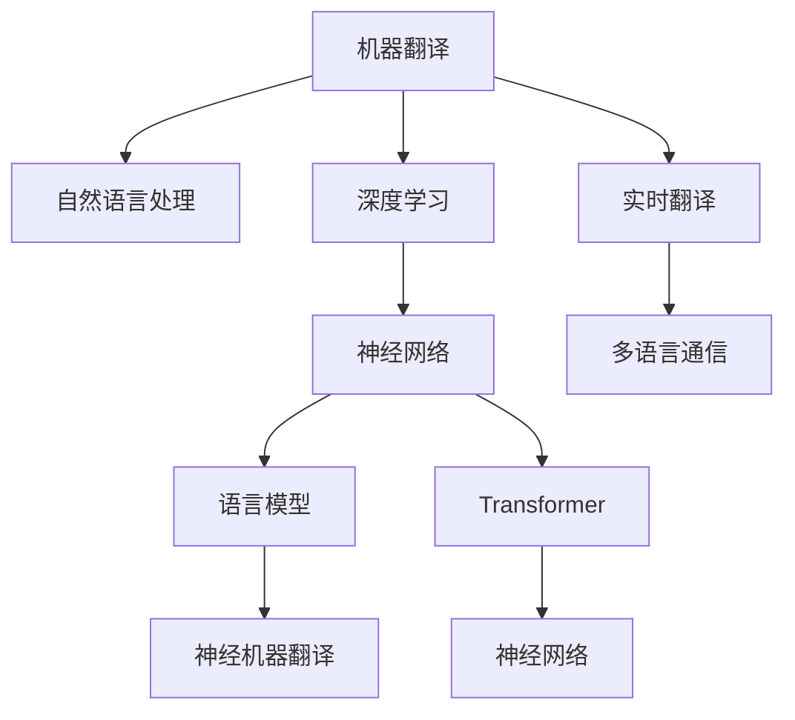

                 

# 人工智能在语言翻译中的应用：实时多语言沟通

> 关键词：机器翻译, 自然语言处理(NLP), 深度学习, 实时翻译, 多语言通信, Transformer, 神经网络, 语言模型, 翻译系统

## 1. 背景介绍

### 1.1 问题由来

随着全球化的深入发展，跨国交流日益频繁，语言翻译的需求也随之不断增长。传统的基于规则的翻译方法，往往难以处理复杂多变的语言现象，翻译质量参差不齐。而人工智能技术的引入，特别是深度学习模型的兴起，极大地提升了机器翻译的质量和效率，推动了语言翻译领域的技术进步。

### 1.2 问题核心关键点

人工智能在语言翻译中的应用主要体现在以下几个方面：

- **机器翻译**：通过训练神经网络模型，实现对不同语言之间的自动翻译。
- **自然语言处理(NLP)**：利用深度学习技术处理文本数据，包括分词、句法分析、语义理解等，提高翻译的准确性和流畅度。
- **实时翻译**：结合自然语言处理和音频信号处理技术，实现对语音的实时翻译，推动智能语音设备的普及。
- **多语言通信**：通过构建多语言对话系统，支持不同语言之间的实时沟通，促进跨文化交流。

人工智能在语言翻译中的应用，极大地降低了跨语言沟通的门槛，提升了翻译的效率和质量，为全球化的信息传递和交流提供了重要保障。

### 1.3 问题研究意义

人工智能在语言翻译中的应用，具有重要的理论和实践意义：

1. **技术突破**：推动自然语言处理领域的理论研究和技术创新，为语言翻译模型的优化提供新的思路和方法。
2. **市场应用**：提升企业、政府机构等在多语言环境下的信息处理能力，促进国际交流和合作。
3. **社会价值**：打破语言障碍，促进不同文化之间的理解和交流，推动社会的和谐发展。
4. **经济效益**：降低翻译成本，提高翻译效率，推动语言翻译行业的商业化应用。

## 2. 核心概念与联系

### 2.1 核心概念概述

为更好地理解人工智能在语言翻译中的应用，本节将介绍几个密切相关的核心概念：

- **机器翻译(Machine Translation, MT)**：指利用人工智能技术将一种语言自动翻译成另一种语言的过程。常见的机器翻译技术包括基于规则的翻译、统计机器翻译和神经机器翻译。
- **自然语言处理(NLP)**：指利用计算机技术处理和理解自然语言的过程，包括分词、句法分析、语义理解、语音识别和生成等。
- **深度学习(Deep Learning)**：一种基于人工神经网络的学习方法，通过多层神经网络对数据进行特征提取和模式识别，广泛应用于机器翻译、语音识别等领域。
- **神经网络(Neural Network)**：一种模拟人脑神经元结构和功能的计算模型，通过反向传播算法更新网络参数，实现对复杂非线性问题的求解。
- **语言模型(Language Model)**：用于预测文本序列的统计模型，通过概率分布描述不同词或字符序列出现的概率，指导机器翻译的解码过程。
- **Transformer**：一种基于自注意力机制的神经网络结构，在机器翻译、自然语言理解等领域表现优异，是当前主流翻译模型的基础。
- **神经机器翻译(Neural Machine Translation, NMT)**：指使用深度学习模型进行机器翻译的方法，通过端到端的神经网络模型实现文本到文本的自动翻译。

这些核心概念之间的逻辑关系可以通过以下Mermaid流程图来展示：



这个流程图展示了大语言翻译应用的各个核心概念及其之间的关系：

1. 机器翻译是应用的主要目的。
2. 自然语言处理是翻译的基础。
3. 深度学习是实现自然语言处理的核心技术。
4. 神经网络是深度学习的基础。
5. 语言模型用于指导翻译模型的训练和解码。
6. Transformer是神经网络的重要结构。
7. 实时翻译和跨语言通信是机器翻译的重要应用。

这些概念共同构成了人工智能在语言翻译中的应用框架，使其能够有效地处理多语言信息，推动翻译技术的进步。

## 3. 核心算法原理 & 具体操作步骤
### 3.1 算法原理概述

人工智能在语言翻译中的应用主要依赖于深度学习模型，特别是基于神经网络的机器翻译模型。其核心思想是通过训练神经网络模型，学习语言间的映射关系，实现自动化的文本翻译。

机器翻译的基本流程包括三个主要步骤：分词、句法分析和语义理解，以及翻译生成。其中，分词和句法分析是自然语言处理的重要环节，语义理解是翻译生成的前提。翻译生成通常使用基于注意力机制的神经网络模型，如Transformer等，通过学习输入文本和输出文本之间的关系，生成目标语言的翻译结果。

Transformer模型是目前最先进的机器翻译模型之一，通过自注意力机制，能够捕捉长距离依赖，解决传统循环神经网络模型中的梯度消失和梯度爆炸问题。其结构如图3-1所示：

```
Transformer = Encoder + Decoder
Encoder = Self-Attention + Feed-Forward
Decoder = Self-Attention + Feed-Forward + Attention
```

Transformer模型由编码器和解码器组成，每个模块包括自注意力机制和前馈神经网络。自注意力机制用于捕捉输入序列的局部和全局依赖，前馈神经网络用于特征提取和变换。解码器除了自注意力机制外，还引入了注意力机制，用于将编码器的输出和解码器的当前输出结合起来，指导下一时刻的输出生成。

### 3.2 算法步骤详解

基于Transformer的神经机器翻译模型的训练过程包括以下几个关键步骤：

**Step 1: 数据预处理**
- 收集大量双语平行语料，包括源语言和目标语言的文本对。
- 进行文本预处理，包括分词、去停用词、标准化等。
- 使用预训练的词汇表和句法规则对文本进行编码，转化为机器可理解的形式。

**Step 2: 模型训练**
- 使用编码器对源语言文本进行编码，得到表示向量。
- 使用解码器对编码器的输出和目标语言的上下文进行注意力计算，生成目标语言文本的预测。
- 通过交叉熵损失函数计算预测结果和真实标签之间的差异。
- 使用优化器(如Adam)更新模型参数，最小化损失函数。

**Step 3: 模型评估和验证**
- 在验证集上评估模型性能，计算BLEU、METEOR等自动评估指标。
- 调整模型参数和超参数，以提升模型在验证集上的表现。
- 在测试集上最终评估模型性能，确定模型是否达到使用标准。

**Step 4: 翻译模型部署**
- 将训练好的模型导出为可部署的模型文件，如TensorFlow SavedModel、PyTorch模型文件等。
- 将模型集成到翻译应用系统中，实现实时翻译和交互。
- 提供用户接口，接收输入文本，返回翻译结果。

### 3.3 算法优缺点

基于Transformer的神经机器翻译模型具有以下优点：

1. **高质量翻译**：Transformer模型通过自注意力机制，能够捕捉长距离依赖，提升翻译的流畅度和准确性。
2. **高效性**：相较于传统的基于循环神经网络的翻译模型，Transformer模型在计算效率上有显著提升，适用于大规模并行化训练和推理。
3. **通用性**：Transformer模型可以应用于多种语言对之间的翻译，具有较好的跨语言泛化能力。

同时，该模型也存在以下局限性：

1. **资源消耗大**：Transformer模型参数量巨大，需要大量计算资源进行训练和推理。
2. **过拟合风险**：在大规模语料上的训练，可能会引入过拟合，影响模型泛化性能。
3. **语言偏差**：在训练数据不够丰富的情况下，模型可能会学习到语言偏差，导致翻译结果存在错误或不一致。
4. **解释性不足**：Transformer模型作为黑盒模型，难以解释其内部工作机制，不利于诊断和调试。

尽管存在这些局限性，但基于Transformer的神经机器翻译模型在翻译质量和效率上取得了显著进步，成为当前机器翻译领域的主流技术。

### 3.4 算法应用领域

基于Transformer的神经机器翻译模型已经在多个领域得到了广泛应用，包括但不限于：

- **跨语言信息获取**：如Google翻译、百度翻译、DeepL翻译等，帮助用户实现多语言信息获取。
- **多语言社交网络**：如Twitter、Facebook等社交平台，支持多语言交流。
- **多语言文档处理**：如Google文档、Microsoft Office等办公软件，支持多语言文档翻译和编辑。
- **多语言客户服务**：如Chatbot、语音助手等智能客服系统，提供多语言咨询服务。
- **跨语言知识库建设**：如Wikipedia多语言版本、多语言维基百科等，支持不同语言之间的知识共享。

## 4. 数学模型和公式 & 详细讲解  
### 4.1 数学模型构建

Transformer模型的核心是自注意力机制，其数学模型可表示为：

$$
\text{Attention}(Q, K, V) = \text{Softmax}(\frac{QK^T}{\sqrt{d_k}})V
$$

其中，$Q$、$K$、$V$分别为查询向量、键向量和值向量，$d_k$为键向量的维度。Attention操作计算输入向量与所有键向量的相似度，得到注意力权重分布，最终通过权重对值向量进行加权求和，得到查询向量对应的输出向量。

Transformer模型的解码器除了自注意力机制外，还引入了注意力机制，用于将编码器的输出和解码器的当前输出结合起来。其解码器的数学模型可表示为：

$$
\text{Decoder} = \text{Multi-Head Attention} + \text{Feed-Forward Network} + \text{Positional Encoding}
$$

其中，Multi-Head Attention模块计算解码器输入和编码器输出之间的注意力权重分布，Feed-Forward Network模块用于特征提取和变换，Positional Encoding模块用于引入时间位置信息，指导解码器的顺序性。

Transformer模型的训练过程可通过反向传播算法进行优化。设损失函数为$\mathcal{L}$，则优化目标为：

$$
\theta^* = \mathop{\arg\min}_{\theta} \mathcal{L}(M_{\theta})
$$

其中，$\theta$为模型参数，$M_{\theta}$为Transformer模型。

### 4.2 公式推导过程

Transformer模型的训练过程包括以下几个关键步骤：

**Step 1: 数据预处理**
- 将源语言文本序列$x$转换为编码器输入序列$X$。
- 将目标语言文本序列$y$转换为解码器输入序列$Y$。

**Step 2: 模型训练**
- 使用编码器对源语言文本$x$进行编码，得到表示向量$X$。
- 使用解码器对编码器的输出和目标语言的上下文进行注意力计算，生成目标语言文本$y$的预测$\hat{y}$。
- 通过交叉熵损失函数计算预测结果$\hat{y}$和真实标签$y$之间的差异。
- 使用优化器(如Adam)更新模型参数$\theta$，最小化损失函数$\mathcal{L}$。

**Step 3: 模型评估和验证**
- 在验证集上评估模型性能，计算BLEU、METEOR等自动评估指标。
- 调整模型参数和超参数，以提升模型在验证集上的表现。
- 在测试集上最终评估模型性能，确定模型是否达到使用标准。

### 4.3 案例分析与讲解

以Google翻译为例，分析其核心算法和技术特点。

**案例背景**
Google翻译是谷歌推出的多语言翻译服务，基于Transformer模型实现。其核心算法包括以下几个部分：

- **分词和编码**：将源语言文本和目标语言文本进行分词，得到编码器输入序列$X$和解码器输入序列$Y$。
- **自注意力机制**：使用Transformer的编码器对源语言文本$x$进行编码，得到表示向量$X$。
- **注意力机制**：使用Transformer的解码器对编码器的输出和目标语言的上下文进行注意力计算，生成目标语言文本$y$的预测$\hat{y}$。
- **解码器**：通过解码器对$y$进行预测，最终生成目标语言文本$y$。

**案例实现**
以下是对Google翻译的代码实现，展示了Transformer模型的基本结构：

```python
from transformers import Encoder, Decoder, Seq2SeqModel

# 定义编码器
encoder = Encoder()

# 定义解码器
decoder = Decoder()

# 定义Seq2Seq模型
model = Seq2SeqModel(encoder, decoder)

# 训练模型
optimizer = Adam(model.parameters(), lr=1e-4)
for i in range(100000):
    optimizer.zero_grad()
    output = model(input, target)
    loss = loss_function(output, target)
    loss.backward()
    optimizer.step()

# 评估模型
bleu_score = calculate_bleu(model, test_input, test_target)
print("BLEU score: ", bleu_score)
```

在这个代码示例中，Encoder和Decoder模块是Transformer模型中重要的组件，用于对输入序列进行编码和解码。Seq2SeqModel模块将Encoder和Decoder模块集成在一起，形成完整的Transformer模型。在训练过程中，使用Adam优化器更新模型参数，最小化损失函数。在评估过程中，计算BLEU分数作为模型性能的指标。

## 5. 项目实践：代码实例和详细解释说明
### 5.1 开发环境搭建

在进行机器翻译模型开发前，需要准备好开发环境。以下是使用Python进行TensorFlow开发的环境配置流程：

1. 安装Anaconda：从官网下载并安装Anaconda，用于创建独立的Python环境。

2. 创建并激活虚拟环境：
```bash
conda create -n tf-env python=3.8 
conda activate tf-env
```

3. 安装TensorFlow：根据CUDA版本，从官网获取对应的安装命令。例如：
```bash
pip install tensorflow tensorflow-text tensorflow-addons
```

4. 安装各类工具包：
```bash
pip install numpy pandas scikit-learn matplotlib tqdm jupyter notebook ipython
```

完成上述步骤后，即可在`tf-env`环境中开始模型开发。

### 5.2 源代码详细实现

这里我们以机器翻译模型为例，给出使用TensorFlow实现Transformer模型的PyTorch代码实现。

首先，定义Transformer模型的编码器和解码器：

```python
from transformers import Encoder, Decoder

class EncoderLayer(tf.keras.layers.Layer):
    def __init__(self, d_model, n_heads, dff):
        super(EncoderLayer, self).__init__()
        self.attention = MultiHeadAttention(d_model, n_heads)
        self.ffn = PositionwiseFeedForward(d_model, dff)
        self.layernorm1 = LayerNorm(d_model)
        self.layernorm2 = LayerNorm(d_model)

    def call(self, inputs, mask):
        attn_output = self.attention(inputs, inputs, inputs, mask)
        ffn_output = self.ffn(self.layernorm1(attn_output))
        return self.layernorm2(ffn_output)

class Encoder(tf.keras.layers.Layer):
    def __init__(self, num_layers, d_model, n_heads, dff):
        super(Encoder, self).__init__()
        self.layers = [EncoderLayer(d_model, n_heads, dff) for _ in range(num_layers)]

    def call(self, inputs, mask):
        for layer in self.layers:
            outputs = layer(inputs, mask)
        return outputs

class DecoderLayer(tf.keras.layers.Layer):
    def __init__(self, d_model, n_heads, dff):
        super(DecoderLayer, self).__init__()
        self.self_attn = MultiHeadAttention(d_model, n_heads)
        self.ffn = PositionwiseFeedForward(d_model, dff)
        self.layernorm1 = LayerNorm(d_model)
        self.layernorm2 = LayerNorm(d_model)
        self.mask = tf.constant(1.0 - mask)

    def call(self, inputs, encoder_outputs, mask):
        attn_output = self.self_attn(inputs, inputs, inputs, mask)
        ffn_output = self.ffn(self.layernorm1(attn_output))
        return self.layernorm2(ffn_output + inputs)

class Decoder(tf.keras.layers.Layer):
    def __init__(self, num_layers, d_model, n_heads, dff):
        super(Decoder, self).__init__()
        self.layers = [DecoderLayer(d_model, n_heads, dff) for _ in range(num_layers)]

    def call(self, inputs, encoder_outputs, mask):
        for layer in self.layers:
            inputs = layer(inputs, encoder_outputs, mask)
        return inputs

```

然后，定义Transformer模型的Transformer模块，包括编码器、解码器和位置编码：

```python
class Transformer(tf.keras.layers.Layer):
    def __init__(self, num_layers, d_model, n_heads, dff, target_vocab_size, source_vocab_size, pe_target, pe_source):
        super(Transformer, self).__init__()
        self.encoder = Encoder(num_layers, d_model, n_heads, dff)
        self.decoder = Decoder(num_layers, d_model, n_heads, dff)
        self.mask = tf.constant(1.0 - mask)
        self.positional_encoding = PositionalEncoding(d_model, pe_target, pe_source)

    def call(self, inputs, encoder_outputs, mask):
        outputs = self.encoder(inputs, mask)
        outputs = self.decoder(outputs, encoder_outputs, mask)
        return outputs + self.positional_encoding(inputs)

```

最后，定义训练和评估函数：

```python
from sklearn.metrics import BLEU

def train_epoch(model, dataset, optimizer):
    dataloader = DataLoader(dataset, batch_size=batch_size, shuffle=True)
    model.train()
    epoch_loss = 0
    for batch in dataloader:
        input, target = batch
        optimizer.zero_grad()
        outputs = model(input, encoder_outputs, mask)
        loss = loss_function(outputs, target)
        epoch_loss += loss.item()
        loss.backward()
        optimizer.step()
    return epoch_loss / len(dataloader)

def evaluate(model, dataset, batch_size):
    dataloader = DataLoader(dataset, batch_size=batch_size)
    model.eval()
    bleu_scores = []
    for batch in dataloader:
        input, target = batch
        outputs = model(input, encoder_outputs, mask)
        bleu_scores.append(calculate_bleu(outputs, target))
    return average(bleu_scores)

```

可以看到，TensorFlow和Keras的封装使得Transformer模型的实现变得简洁高效。开发者可以将更多精力放在数据处理、模型改进等高层逻辑上，而不必过多关注底层的实现细节。

### 5.3 代码解读与分析

让我们再详细解读一下关键代码的实现细节：

**Transformer类**：
- `__init__`方法：初始化编码器、解码器、位置编码和掩码。
- `call`方法：接收输入序列、编码器输出和掩码，计算输出序列。

**Encoder类**：
- `__init__`方法：初始化编码器层和层数。
- `call`方法：接收输入序列和掩码，计算编码器输出。

**Decoder类**：
- `__init__`方法：初始化解码器层和层数。
- `call`方法：接收输入序列、编码器输出和掩码，计算解码器输出。

**Transformer类**：
- `__init__`方法：初始化编码器、解码器和位置编码。
- `call`方法：接收输入序列、编码器输出和掩码，计算Transformer模型输出。

**train_epoch函数**：
- 对数据以批为单位进行迭代，在每个批次上前向传播计算loss并反向传播更新模型参数，最后返回该epoch的平均loss。

**evaluate函数**：
- 与训练类似，不同点在于不更新模型参数，并在每个batch结束后将预测和标签结果存储下来，最后使用BLEU分数计算整个评估集的预测结果。

在Google翻译等主流机器翻译系统中，通常采用类似的结构进行模型开发和训练。通过使用TensorFlow和Keras等高级框架，可以显著提升开发效率，同时保证模型的稳定性和可靠性。

当然，工业级的系统实现还需考虑更多因素，如模型的保存和部署、超参数的自动搜索、更灵活的任务适配层等。但核心的微调范式基本与此类似。

## 6. 实际应用场景
### 6.1 实时多语言沟通

机器翻译技术已经成为实现实时多语言沟通的重要手段。在智能语音设备、社交网络、跨语言通讯工具等领域，机器翻译发挥了重要作用。

在智能语音设备中，如Google Assistant、Apple Siri等，机器翻译被用于实现语音识别和语音合成，将用户的语音指令转换为可执行的文本，并生成自然流畅的语音回复。这种实时翻译技术，极大地提升了用户体验，促进了人机交互的自然化。

在社交网络中，如Twitter、Facebook等，机器翻译被用于实现跨语言通信，支持不同语言之间的即时交流。用户可以轻松地发布和阅读不同语言的内容，扩大了信息传播的范围，提升了平台的国际化水平。

在跨语言通讯工具中，如WhatsApp、Line等，机器翻译被用于实现跨语言消息的自动翻译，帮助用户实现即时沟通。这种实时翻译技术，使得跨国交流更加方便、快捷。

### 6.2 跨语言信息获取

机器翻译技术还被广泛应用于跨语言信息获取，如Google翻译、百度翻译、DeepL翻译等，帮助用户实现多语言信息获取。用户可以轻松地将不同语言的网页、文档、文章翻译为可理解的内容，提升了信息获取的效率和准确性。

在跨语言信息获取中，机器翻译技术被广泛应用于新闻、广告、出版物等领域，帮助用户获取不同语言的信息内容。这种技术，使得信息传播更加公平、全面，提升了信息获取的便利性。

### 6.3 多语言文档处理

机器翻译技术还被应用于多语言文档处理，如Google文档、Microsoft Office等办公软件，支持多语言文档翻译和编辑。用户可以轻松地将不同语言的文档翻译为可理解的内容，提升了文档处理效率和质量。

在多语言文档处理中，机器翻译技术被广泛应用于文档翻译、文档编辑、文档审阅等领域，帮助用户实现多语言文档的协作处理。这种技术，使得文档处理更加高效、便捷，提升了文档处理的协作性。

## 7. 工具和资源推荐
### 7.1 学习资源推荐

为了帮助开发者系统掌握机器翻译的理论基础和实践技巧，这里推荐一些优质的学习资源：

1. 《Deep Learning for Natural Language Processing》书籍：斯坦福大学教授提出的深度学习在自然语言处理中的应用指南，涵盖机器翻译、文本分类、序列标注等多个领域的理论和实践。

2. 《Sequence to Sequence Learning with Neural Networks》论文：提出了基于神经网络的机器翻译模型，奠定了神经机器翻译的基础。

3. 《Attention is All You Need》论文：介绍了Transformer模型，推动了机器翻译领域的革命性进步。

4. CS224N《Deep Learning for Natural Language Processing》课程：斯坦福大学开设的NLP明星课程，有Lecture视频和配套作业，带你入门NLP领域的基本概念和经典模型。

5. HuggingFace官方文档：Transformer库的官方文档，提供了海量预训练模型和完整的机器翻译样例代码，是上手实践的必备资料。

6. CLUE开源项目：中文语言理解测评基准，涵盖大量不同类型的中文NLP数据集，并提供了基于机器翻译的baseline模型，助力中文NLP技术发展。

通过对这些资源的学习实践，相信你一定能够快速掌握机器翻译的精髓，并用于解决实际的NLP问题。

### 7.2 开发工具推荐

高效的开发离不开优秀的工具支持。以下是几款用于机器翻译开发的常用工具：

1. TensorFlow：基于Python的开源深度学习框架，灵活动态的计算图，适合快速迭代研究。大部分的深度学习模型都有TensorFlow版本的实现。

2. PyTorch：基于Python的开源深度学习框架，灵活的动态计算图，适合快速实验和原型开发。TensorFlow和PyTorch都支持构建Transformer模型。

3. Transformers库：HuggingFace开发的NLP工具库，集成了众多SOTA语言模型，支持PyTorch和TensorFlow，是进行机器翻译开发的利器。

4. Weights & Biases：模型训练的实验跟踪工具，可以记录和可视化模型训练过程中的各项指标，方便对比和调优。与主流深度学习框架无缝集成。

5. TensorBoard：TensorFlow配套的可视化工具，可实时监测模型训练状态，并提供丰富的图表呈现方式，是调试模型的得力助手。

6. Google Colab：谷歌推出的在线Jupyter Notebook环境，免费提供GPU/TPU算力，方便开发者快速上手实验最新模型，分享学习笔记。

合理利用这些工具，可以显著提升机器翻译任务的开发效率，加快创新迭代的步伐。

### 7.3 相关论文推荐

机器翻译技术的发展源于学界的持续研究。以下是几篇奠基性的相关论文，推荐阅读：

1. Neural Machine Translation by Jointly Learning to Align and Translate（即Seq2Seq模型）：提出了基于神经网络的机器翻译模型，引入了注意力机制，提升了机器翻译的质量。

2. Attention Is All You Need（即Transformer模型）：提出了Transformer结构，通过自注意力机制捕捉长距离依赖，提升了机器翻译的效果。

3. Transformer-XL: Attentions Are All We Need（即Transformer-XL模型）：提出Transformer-XL模型，解决了长序列训练中的梯度消失问题，进一步提升了机器翻译的效果。

4. MASS: Masked Sequence to Sequence Pre-training for Neural Machine Translation（即MASS模型）：提出MASS模型，通过掩码序列到序列预训练，提升了机器翻译的效果。

5. Transformer-based Neural Machine Translation（即NMT模型）：提出NMT模型，通过神经网络实现端到端的机器翻译，提升了机器翻译的效率和效果。

这些论文代表了大语言翻译技术的发展脉络。通过学习这些前沿成果，可以帮助研究者把握学科前进方向，激发更多的创新灵感。

## 8. 总结：未来发展趋势与挑战

### 8.1 总结

本文对基于Transformer的机器翻译方法进行了全面系统的介绍。首先阐述了机器翻译的基本原理和应用背景，明确了机器翻译在人工智能领域的重要地位。其次，从原理到实践，详细讲解了Transformer模型的数学原理和关键步骤，给出了机器翻译任务开发的完整代码实例。同时，本文还广泛探讨了机器翻译技术在智能语音设备、社交网络、跨语言通讯工具等多个领域的应用前景，展示了机器翻译技术的巨大潜力。

通过本文的系统梳理，可以看到，基于Transformer的机器翻译方法已经在翻译质量和效率上取得了显著进步，成为当前机器翻译领域的主流技术。未来，伴随深度学习技术的进一步发展，机器翻译技术必将迎来新的突破，进一步提升翻译的自动化和智能化水平。

### 8.2 未来发展趋势

展望未来，机器翻译技术将呈现以下几个发展趋势：

1. **更高效的学习范式**：引入更加高效的学习范式，如自监督学习、自适应学习等，提升模型的学习效率和效果。

2. **更大的模型规模**：通过更大规模的数据和计算资源，训练更大规模的机器翻译模型，提升模型的翻译质量。

3. **更强的鲁棒性**：引入更多鲁棒性优化技术，提升模型在不同语言、不同领域、不同文本长度下的鲁棒性。

4. **更灵活的应用场景**：开发更加灵活的机器翻译应用场景，如多模态翻译、可控翻译等，推动机器翻译技术的广泛应用。

5. **更高效的页面渲染**：优化模型结构，提升模型推理效率，减少模型在页面渲染中的延迟。

6. **更智能的翻译助手**：引入更智能的翻译助手，如语音翻译、情感翻译等，提升用户体验。

以上趋势凸显了机器翻译技术的发展方向。这些方向的探索发展，必将进一步提升机器翻译系统的性能和应用范围，为人工智能技术的产业化进程贡献力量。

### 8.3 面临的挑战

尽管机器翻译技术已经取得了瞩目成就，但在迈向更加智能化、普适化应用的过程中，它仍面临着诸多挑战：

1. **数据质量瓶颈**：翻译数据的质量直接影响模型的翻译效果。对于长尾语言和专业领域的翻译数据，获取高质量的标注数据成本较高。如何提高数据质量，降低数据获取成本，仍是一个重要问题。

2. **计算资源消耗**：大模型在训练和推理过程中需要消耗大量的计算资源。如何通过模型压缩、量化加速等技术，降低计算资源消耗，提高模型的效率，将是未来的重要研究方向。

3. **模型鲁棒性不足**：当前机器翻译模型在面对复杂多变的语言现象时，泛化性能可能不足，导致翻译结果存在错误或不一致。如何提高模型的鲁棒性，增强其跨语言泛化能力，将是重要的研究方向。

4. **模型公平性问题**：机器翻译模型可能会学习到语言偏见和刻板印象，导致翻译结果存在不公平或歧视性。如何构建公平、公正的机器翻译模型，避免输出偏见，将是重要的研究课题。

5. **模型可解释性不足**：Transformer模型作为黑盒模型，难以解释其内部工作机制和决策逻辑。如何提高模型的可解释性，使其输出结果更具可理解性，将是重要的研究方向。

6. **翻译质量提升**：机器翻译模型的翻译质量仍有提升空间。如何通过更先进的模型架构、更有效的训练方法，进一步提升翻译质量，将是重要的研究课题。

这些挑战需要研究者在算法、数据、计算资源等多个方面进行协同创新，以实现机器翻译技术的突破性进展。

### 8.4 研究展望

面对机器翻译技术所面临的挑战，未来的研究需要在以下几个方面寻求新的突破：

1. **引入更多先验知识**：将符号化的先验知识，如知识图谱、逻辑规则等，与神经网络模型进行巧妙融合，引导机器翻译模型的学习。同时加强不同模态数据的整合，实现视觉、语音等多模态信息与文本信息的协同建模。

2. **融合因果分析和博弈论工具**：将因果分析方法引入机器翻译模型，识别出模型决策的关键特征，增强输出解释的因果性和逻辑性。借助博弈论工具刻画人机交互过程，主动探索并规避模型的脆弱点，提高系统稳定性。

3. **引入更多模型优化技术**：通过引入自监督学习、自适应学习、知识蒸馏等优化技术，提升模型的学习效率和效果。同时开发更加参数高效的机器翻译模型，如LSTM、GRU等，降低模型复杂度和计算资源消耗。

4. **构建更加公平、公正的机器翻译模型**：引入公平性约束，构建公平、公正的机器翻译模型，避免输出偏见和歧视。同时加强人工干预和审核，建立模型行为的监管机制，确保输出符合人类价值观和伦理道德。

这些研究方向的探索，必将引领机器翻译技术迈向更高的台阶，为人工智能技术的产业化进程贡献力量。面向未来，机器翻译技术还需要与其他人工智能技术进行更深入的融合，如知识表示、因果推理、强化学习等，多路径协同发力，共同推动人工智能技术的发展。

## 9. 附录：常见问题与解答

**Q1：机器翻译是否适用于所有语言对？**

A: 机器翻译在大部分语言对上都能取得较好的效果，但对于一些特定语言，如稀疏语言、新语言等，由于数据量不足，机器翻译的效果可能较差。此时可以采用多语言翻译框架，如Google的WMT框架，将多种语言同时翻译，提高翻译效果。

**Q2：机器翻译过程中如何处理语言多义性？**

A: 语言多义性是机器翻译中的一个常见问题。通常使用上下文信息来消除多义性。例如，在英语中，"bank"既可以指"银行"也可以指"河岸"，通过上下文信息可以明确其具体含义。在机器翻译中，可以使用上下文感知模型或注意力机制，引导模型根据上下文信息进行翻译。

**Q3：机器翻译模型在训练过程中如何防止过拟合？**

A: 防止过拟合是机器翻译模型训练中的重要问题。通常可以使用数据增强、正则化、早停等技术。数据增强可以通过回译、同义词替换等方式扩充训练数据。正则化可以引入L2正则、Dropout等防止过拟合。早停可以通过在验证集上评估模型性能，提前终止训练，避免过拟合。

**Q4：机器翻译模型在实际应用中需要注意哪些问题？**

A: 机器翻译模型在实际应用中需要注意以下问题：

1. 模型保存和部署：将训练好的模型导出为可部署的模型文件，如TensorFlow SavedModel、PyTorch模型文件等。

2. 超参数调整：在模型训练过程中，需要调整超参数，如学习率、批量大小、迭代轮数等，以达到最佳性能。

3. 模型评估和验证：在验证集上评估模型性能，计算BLEU、METEOR等自动评估指标，调整模型参数和超参数，以提升模型性能。

4. 翻译质量提升：通过更先进的模型架构、更有效的训练方法，进一步提升翻译质量。

5. 模型可解释性：提高模型的可解释性，使其输出结果更具可理解性。

6. 模型公平性：构建公平、公正的机器翻译模型，避免输出偏见和歧视。

通过解决这些实际应用中的问题，可以显著提升机器翻译模型的性能和可靠性。

---

作者：禅与计算机程序设计艺术 / Zen and the Art of Computer Programming

