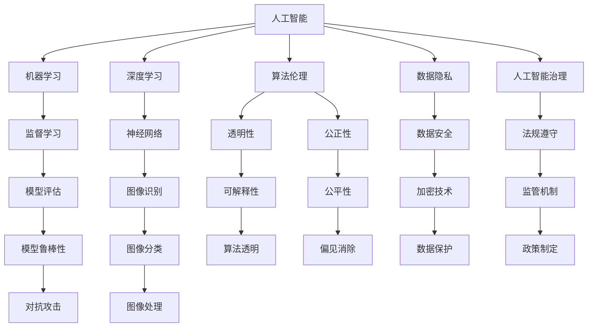

                 

# 人工智能：社会影响与思考

> 关键词：人工智能,社会影响,算法伦理,机器学习,深度学习,数据隐私,人工智能治理

## 1. 背景介绍

### 1.1 问题由来
随着人工智能（AI）技术的快速发展和普及，其在各个行业中的应用越来越广泛，如自动驾驶、智能医疗、智能制造、金融科技等。AI 技术的进步不仅提升了生产效率，也改变了人们的生活方式，但对社会也带来了深远的影响。例如，自动化可能导致大量工人失业，AI 算法的偏见可能导致不平等问题加剧，数据隐私和安全问题也引起了广泛关注。因此，如何全面、客观地认识和评估人工智能的社会影响，已成为全球关注的重要课题。

### 1.2 问题核心关键点
人工智能的社会影响可以从多个维度进行评估，包括技术伦理、就业影响、隐私安全、公平性等方面。不同利益相关者，如政府、企业、公众等，对这些影响的看法和关注点不同。因此，需要多角度、多层次地分析和思考，以形成一个全面而平衡的视角。

## 2. 核心概念与联系

### 2.1 核心概念概述

为更好地理解人工智能的社会影响，本节将介绍几个关键概念及其相互关系：

- **人工智能（AI）**：使用算法和数据处理技术，使计算机具备智能处理和学习的能力。AI 技术包括机器学习、深度学习、自然语言处理等分支。

- **算法伦理**：涉及如何在设计和实现算法时考虑伦理问题，确保算法决策的公正性、透明性和可解释性。

- **机器学习**：利用数据和算法让机器从经验中学习，以提高决策和预测的准确性。

- **深度学习**：一种特殊的机器学习方法，使用神经网络模型模拟人脑神经元之间的连接，以实现对复杂数据的处理和理解。

- **数据隐私**：指在数据收集、存储、处理和传输过程中，保护个人或企业信息的私密性。

- **人工智能治理**：涉及如何制定和执行规则，以确保 AI 技术的负责任使用，并解决 AI 可能带来的社会问题。

这些核心概念之间的逻辑关系可以通过以下 Mermaid 流程图来展示：



这个流程图展示了几组核心概念及其之间的联系：

1. 人工智能依赖于机器学习和深度学习等技术进行模型训练和优化。
2. 算法伦理关注模型的透明度、公正性等问题，确保算法的道德性。
3. 数据隐私和安全是人工智能应用中必须考虑的关键问题。
4. 人工智能治理涉及法规、监管等措施，确保 AI 技术的安全和负责任使用。

## 3. 核心算法原理 & 具体操作步骤
### 3.1 算法原理概述

人工智能的社会影响评估涉及多方面的因素，如技术伦理、就业影响、隐私安全、公平性等。这些评估需要依赖于相应的算法原理和方法。

**技术伦理评估**：涉及对 AI 决策过程的透明性和可解释性进行分析，以评估其伦理影响。例如，使用可解释的机器学习模型，可以更容易地识别算法决策的依据，从而进行伦理审查。

**就业影响评估**：使用经济模型和就业预测算法，分析 AI 技术对劳动力市场的影响。例如，使用劳动力市场模拟模型，可以预测不同技能水平的人群因 AI 技术而失业的风险。

**数据隐私和安全评估**：使用数据加密和匿名化技术，保护用户隐私。例如，使用差分隐私算法，可以在不泄露个体信息的前提下，提供数据统计分析。

**公平性评估**：使用公平性算法和模型，分析 AI 系统对不同群体的影响。例如，使用公平性约束和偏见检测算法，可以确保模型在不同人群中的公平性。

### 3.2 算法步骤详解

以算法伦理评估为例，介绍具体的评估步骤：

1. **数据准备**：收集和整理 AI 决策过程的数据，包括输入数据、模型参数和输出结果。
2. **模型分析和评估**：使用可解释性算法和工具，分析 AI 模型的内部工作机制，评估其透明性和可解释性。
3. **伦理审查**：结合伦理原则和法律法规，对 AI 模型进行伦理审查，确保其决策符合社会价值和伦理标准。
4. **改进和优化**：根据伦理审查的结果，对模型进行改进和优化，提高其透明性和公平性。

### 3.3 算法优缺点

**优点**：
1. **系统性**：通过算法和模型，可以对 AI 技术的影响进行全面、系统性的分析和评估。
2. **客观性**：算法和模型可以减少主观因素的干扰，提供客观的评估结果。
3. **可重复性**：算法和模型可以在不同的数据和情境下重复应用，确保评估结果的一致性和可靠性。

**缺点**：
1. **复杂性**：算法和模型需要复杂的计算和数据处理，可能存在技术瓶颈和限制。
2. **数据依赖性**：算法的有效性依赖于高质量的数据，数据的偏差可能导致算法结果的不准确。
3. **伦理风险**：算法和模型的设计和实现过程中，可能存在伦理风险，需要进一步的伦理审查和监管。

### 3.4 算法应用领域

算法伦理评估技术在多个领域有广泛的应用：

- **医疗领域**：使用 AI 模型进行疾病诊断和治疗决策时，需要考虑算法透明性和公平性，以确保医疗决策的公正性和安全性。
- **金融领域**：使用 AI 模型进行信用评估和金融风险管理时，需要确保算法的透明性和公正性，避免歧视和偏见。
- **司法领域**：使用 AI 模型进行法律判决和案件分析时，需要考虑算法的透明度和可解释性，以确保司法公正和公平。
- **教育领域**：使用 AI 模型进行个性化教育和评估时，需要确保算法的公平性和公正性，避免对不同群体的偏见。

## 4. 数学模型和公式 & 详细讲解 & 举例说明

### 4.1 数学模型构建

本节将使用数学语言对 AI 社会影响评估的算法模型进行更加严格的刻画。

设 $D$ 为 AI 模型处理的输入数据集，$X$ 为输入特征向量，$Y$ 为输出结果向量。假设计算模型为 $M:\mathcal{X} \rightarrow \mathcal{Y}$，其中 $\mathcal{X}$ 为输入空间，$\mathcal{Y}$ 为输出空间。模型的训练过程可表示为：

$$
M^* = \mathop{\arg\min}_{M} \mathcal{L}(D,M)
$$

其中 $\mathcal{L}$ 为损失函数，用于衡量模型输出与真实标签之间的差异。

### 4.2 公式推导过程

以公平性评估为例，推导公平性约束的数学模型。假设 AI 模型 $M$ 对不同群体的预测结果存在偏差，即：

$$
E_y[M(x)|y=k] \neq E_y[M(x)|y=\overline{k}]
$$

其中 $y=k$ 和 $y=\overline{k}$ 分别表示不同的群体。则公平性约束可以表示为：

$$
\mathcal{L}_{fair} = \frac{1}{2}\sum_{k=1}^{K} \frac{\lambda_k}{n_k}(E_y[M(x)|y=k] - E_y[M(x)|y=\overline{k}])^2
$$

其中 $\lambda_k$ 为群体的权重，$n_k$ 为群体的样本数量。该模型通过最小化群体之间的预测偏差，实现公平性评估。

### 4.3 案例分析与讲解

以医疗领域为例，分析 AI 模型的公平性评估。在医疗诊断中，AI 模型需要处理大量患者数据，进行疾病诊断和治疗方案推荐。为了确保模型的公平性，可以使用公平性约束对模型进行评估和优化。

假设 AI 模型 $M$ 在两个不同性别（男性和女性）的患者数据上进行了疾病诊断。如果模型对不同性别的诊断结果存在显著差异，即男性的准确率高于女性，则模型需要被调整以消除这种偏差。具体而言，可以使用以下步骤进行评估和优化：

1. **数据收集和处理**：收集两性患者的疾病诊断数据，并对其进行预处理和归一化。
2. **模型训练和评估**：使用训练集训练 AI 模型，并在验证集上进行公平性评估。
3. **公平性约束**：使用上述公平性约束模型，对模型的预测结果进行公平性约束，确保对两性患者的诊断结果一致。
4. **模型优化**：根据公平性约束的结果，对模型进行优化，调整模型的参数和权重，以消除性别偏见。

## 5. 项目实践：代码实例和详细解释说明
### 5.1 开发环境搭建

在进行 AI 社会影响评估的实践前，我们需要准备好开发环境。以下是使用 Python 进行 Scikit-learn 和 TensorFlow 开发的环境配置流程：

1. 安装 Anaconda：从官网下载并安装 Anaconda，用于创建独立的 Python 环境。
2. 创建并激活虚拟环境：
```bash
conda create -n ai-env python=3.8 
conda activate ai-env
```

3. 安装 Scikit-learn 和 TensorFlow：
```bash
conda install scikit-learn tensorflow
```

4. 安装其他必要的库：
```bash
pip install pandas matplotlib seaborn
```

完成上述步骤后，即可在 `ai-env` 环境中开始 AI 社会影响评估的实践。

### 5.2 源代码详细实现

下面以公平性评估为例，给出使用 Scikit-learn 进行模型训练和公平性约束的 Python 代码实现。

首先，导入必要的库和数据集：

```python
from sklearn.datasets import fetch_openml
from sklearn.model_selection import train_test_split
from sklearn.linear_model import LogisticRegression
from sklearn.metrics import accuracy_score
from sklearn.metrics import f1_score
from sklearn.metrics import confusion_matrix
import numpy as np
import pandas as pd

# 加载数据集
data = fetch_openml('wine', version=1, as_frame=True)
X = data.frame.data
y = data.frame.target

# 划分训练集和测试集
X_train, X_test, y_train, y_test = train_test_split(X, y, test_size=0.2, random_state=42)
```

然后，训练一个逻辑回归模型并进行公平性评估：

```python
# 训练模型
model = LogisticRegression(solver='liblinear', C=1.0)
model.fit(X_train, y_train)

# 评估模型
y_pred = model.predict(X_test)
accuracy = accuracy_score(y_test, y_pred)
f1 = f1_score(y_test, y_pred, average='macro')

# 输出评估结果
print('Accuracy:', accuracy)
print('F1 Score:', f1)

# 计算公平性约束
groups = pd.Categorical(y_test)
 fairness = confusion_matrix(y_test, y_pred, normalize=True)
 fairness_percentiles = fairness * 100
 fairness_percentiles
```

最后，可视化模型的公平性结果：

```python
import matplotlib.pyplot as plt

# 绘制混淆矩阵
plt.figure(figsize=(10, 5))
plt.title('Confusion Matrix')
plt.xlabel('Predicted Label')
plt.ylabel('True Label')
plt.imshow(fairness_percentiles, interpolation='nearest', cmap='Blues')
plt.colorbar()
plt.show()
```

以上就是使用 Scikit-learn 进行公平性评估的完整代码实现。可以看到，Scikit-learn 提供了丰富的机器学习模型和评估工具，使得模型的训练和公平性评估变得相对简单。

### 5.3 代码解读与分析

让我们再详细解读一下关键代码的实现细节：

**fetch_openml函数**：
- 用于从公开数据集中加载数据。这里加载了经典的 Wine 数据集，用于训练逻辑回归模型。

**train_test_split函数**：
- 用于将数据集划分为训练集和测试集，用于模型的训练和评估。

**LogisticRegression模型**：
- 使用逻辑回归模型进行疾病诊断，Scikit-learn 提供了多种不同的回归模型，如线性回归、决策树回归等，可以根据具体任务进行选择。

**accuracy_score和f1_score函数**：
- 用于计算模型的准确率和 F1 分数，衡量模型对不同群体的预测性能。

**confusion_matrix函数**：
- 用于计算模型的混淆矩阵，衡量模型在不同类别上的预测准确性和误差率。

**pandas库**：
- 用于数据处理和可视化，提供了强大的数据结构和数据分析工具。

通过上述步骤，我们完成了对逻辑回归模型的训练和公平性评估，最终通过可视化工具展示了模型在不同类别上的公平性表现。

## 6. 实际应用场景
### 6.1 医疗领域

AI 技术在医疗领域的应用越来越广泛，从疾病诊断到治疗方案推荐，AI 模型都在发挥着重要作用。然而，AI 模型在实际应用中可能存在偏见和不公平性，因此需要进行公平性评估和优化。

例如，假设 AI 模型用于预测患者是否需要手术治疗。如果模型对不同年龄、性别和种族的患者进行预测时存在显著差异，则需要进行公平性评估。具体而言，可以使用以下步骤：

1. **数据收集和处理**：收集不同年龄、性别和种族的患者数据，并对其进行预处理和归一化。
2. **模型训练和评估**：使用训练集训练 AI 模型，并在验证集上进行公平性评估。
3. **公平性约束**：使用上述公平性约束模型，对模型的预测结果进行公平性约束，确保对不同群体的预测结果一致。
4. **模型优化**：根据公平性约束的结果，对模型进行优化，调整模型的参数和权重，以消除偏见。

### 6.2 金融领域

在金融领域，AI 技术被广泛应用于信用评估、风险管理、欺诈检测等场景。然而，AI 模型可能存在性别、种族等方面的偏见，导致不公平的决策。因此，需要进行公平性评估和优化。

例如，假设 AI 模型用于评估客户的信用风险。如果模型对不同性别和种族的客户进行评估时存在显著差异，则需要进行公平性评估。具体而言，可以使用以下步骤：

1. **数据收集和处理**：收集不同性别和种族的客户数据，并对其进行预处理和归一化。
2. **模型训练和评估**：使用训练集训练 AI 模型，并在验证集上进行公平性评估。
3. **公平性约束**：使用上述公平性约束模型，对模型的预测结果进行公平性约束，确保对不同群体的预测结果一致。
4. **模型优化**：根据公平性约束的结果，对模型进行优化，调整模型的参数和权重，以消除偏见。

### 6.3 司法领域

AI 技术在司法领域的应用包括案件分析、法律判决等。然而，AI 模型可能存在性别、种族等方面的偏见，导致不公平的判决。因此，需要进行公平性评估和优化。

例如，假设 AI 模型用于辅助法律判决。如果模型对不同性别和种族的被告进行判决时存在显著差异，则需要进行公平性评估。具体而言，可以使用以下步骤：

1. **数据收集和处理**：收集不同性别和种族的被告数据，并对其进行预处理和归一化。
2. **模型训练和评估**：使用训练集训练 AI 模型，并在验证集上进行公平性评估。
3. **公平性约束**：使用上述公平性约束模型，对模型的预测结果进行公平性约束，确保对不同群体的预测结果一致。
4. **模型优化**：根据公平性约束的结果，对模型进行优化，调整模型的参数和权重，以消除偏见。

### 6.4 未来应用展望

随着 AI 技术的不断发展和应用，其在各个领域的影响将越来越广泛和深刻。未来，AI 技术将在以下几个方面发挥重要作用：

1. **自动化决策**：AI 技术将广泛应用于自动化决策，如自动化司法判决、自动化金融风险管理等，提升决策效率和准确性。
2. **个性化服务**：AI 技术将提供更加个性化和精准的服务，如个性化医疗、个性化教育等，提升用户体验和满意度。
3. **智能治理**：AI 技术将辅助政府和企业进行智能治理，如智能交通管理、智能环保等，提升治理效率和效果。
4. **跨领域应用**：AI 技术将在多个领域进行跨领域应用，如医疗和金融的结合、司法和教育的结合等，推动技术融合和创新。
5. **伦理和社会责任**：AI 技术将更加注重伦理和社会责任，确保技术应用符合社会价值观和伦理标准，保障社会公平和正义。

## 7. 工具和资源推荐
### 7.1 学习资源推荐

为了帮助开发者系统掌握 AI 社会影响评估的理论基础和实践技巧，这里推荐一些优质的学习资源：

1. 《人工智能伦理与社会影响》系列博文：由 AI 伦理专家撰写，深入浅出地介绍了 AI 伦理、社会影响等内容，帮助理解 AI 技术的伦理和道德问题。

2. CS223《机器学习》课程：斯坦福大学开设的机器学习经典课程，有 Lecture 视频和配套作业，涵盖机器学习的基本概念和前沿技术。

3. 《深度学习》书籍：Ian Goodfellow 等著，全面介绍了深度学习的基本原理和实践应用，适合初学者和专业人士。

4. arXiv 和 Google Scholar：最新的 AI 论文和研究成果，通过阅读前沿论文，可以了解 AI 技术的研究进展和趋势。

5. AI ethics and policy online courses：多个在线课程平台提供的 AI 伦理和政策课程，涵盖 AI 技术应用的伦理和社会问题。

通过对这些资源的学习实践，相信你一定能够全面理解 AI 社会影响的各个方面，并用于指导实际应用。

### 7.2 开发工具推荐

高效的开发离不开优秀的工具支持。以下是几款用于 AI 社会影响评估开发的常用工具：

1. Python：AI 领域的主流编程语言，提供了丰富的科学计算和数据分析库，如 Scikit-learn、TensorFlow、Pandas 等。

2. R：数据分析和统计分析领域的重要工具，提供了丰富的数据处理和可视化库，如 ggplot2、dplyr 等。

3. Jupyter Notebook：交互式编程环境，适合进行数据探索和模型调试，支持多种编程语言和库。

4. Tableau：数据可视化和业务智能工具，适合进行数据探索和结果展示，支持多种数据源和图表类型。

5. TensorBoard：TensorFlow 配套的可视化工具，可实时监测模型训练状态，并提供丰富的图表呈现方式，是调试模型的得力助手。

合理利用这些工具，可以显著提升 AI 社会影响评估的开发效率，加快创新迭代的步伐。

### 7.3 相关论文推荐

AI 社会影响评估的研究源于学界的持续研究。以下是几篇奠基性的相关论文，推荐阅读：

1. AI Now Report：AI 伦理和社会影响的年度报告，由 AI Now Institute 发布，涵盖 AI 技术应用中的伦理、法律、社会问题。

2. Machine Bias：关于 AI 模型偏见的研究论文，探讨了 AI 模型在不同群体上的不公平表现。

3. Algorithmic Fairness：关于算法公平性的研究论文，介绍了多种算法和模型，用于评估和优化 AI 模型的公平性。

4. Fairness, Accountability, and Transparency：关于 AI 公平性和透明性的研究论文，探讨了 AI 技术的透明性和可解释性问题。

5. Ethical Machine Learning：关于 AI 伦理的研究论文，探讨了 AI 技术的伦理问题，提出了 AI 伦理的框架和实践方法。

这些论文代表了大 AI 社会影响评估的研究方向，通过学习这些前沿成果，可以帮助研究者把握学科前进方向，激发更多的创新灵感。

## 8. 总结：未来发展趋势与挑战
### 8.1 总结

本文对 AI 技术社会影响进行了全面系统的介绍。首先阐述了 AI 技术在各个领域的应用和带来的社会影响，明确了 AI 技术带来的伦理、就业、隐私等复杂问题。其次，从原理到实践，详细讲解了 AI 技术在社会影响评估中的应用，包括技术伦理、就业影响、隐私安全、公平性等方面，给出了详细的算法原理和具体操作步骤。同时，本文还探讨了 AI 技术在实际应用中的挑战和未来发展方向，提供了多方面的参考和学习资源。

通过本文的系统梳理，可以看到，AI 技术在带来巨大便利和效率提升的同时，也带来了深远的社会影响。如何平衡技术创新和伦理道德，确保 AI 技术的负责任使用，已经成为全球关注的重要课题。未来，随着 AI 技术的不断发展和应用，其社会影响评估也将成为一个重要的研究方向，为 AI 技术的负责任应用提供重要的理论和方法指导。

### 8.2 未来发展趋势

展望未来，AI 技术社会影响评估将呈现以下几个发展趋势：

1. **多领域融合**：AI 技术将在多个领域进行跨领域融合，推动技术进步和应用创新。例如，AI 技术在医疗和金融的结合，将提升医疗诊断和金融风险管理的准确性和效率。
2. **伦理和社会责任**：AI 技术将更加注重伦理和社会责任，确保技术应用符合社会价值观和伦理标准，保障社会公平和正义。
3. **公平性优化**：AI 技术将注重公平性优化，确保不同群体的预测结果一致，避免偏见和不公平现象。
4. **透明性和可解释性**：AI 技术将注重透明性和可解释性，确保模型决策的公正性和透明性，避免黑箱问题。
5. **数据隐私和安全**：AI 技术将注重数据隐私和安全，确保数据处理和传输的保密性和安全性，保护用户隐私。

以上趋势凸显了 AI 技术社会影响评估的重要性和紧迫性。这些方向的探索发展，必将推动 AI 技术在多个领域的深入应用，为社会带来更多便利和效益。

### 8.3 面临的挑战

尽管 AI 技术社会影响评估已经取得了一定进展，但在迈向更加智能化、普适化应用的过程中，仍面临诸多挑战：

1. **数据质量问题**：AI 模型的效果依赖于高质量的数据，数据偏差可能导致模型结果的不准确。如何确保数据的多样性和代表性，是未来的一个重要挑战。
2. **算法偏见问题**：AI 模型可能存在偏见和歧视，导致不公平的决策和预测。如何消除算法偏见，确保模型的公平性和公正性，是未来的一个重要方向。
3. **伦理和社会责任问题**：AI 技术的应用可能带来伦理和社会问题，如何制定和执行规则，确保 AI 技术的负责任使用，是未来的一个重要课题。
4. **可解释性和透明性问题**：AI 模型的黑箱问题可能带来不透明和不可解释的决策，如何增强模型的透明性和可解释性，是未来的一个重要方向。
5. **技术复杂性问题**：AI 模型的训练和优化过程复杂，如何提高模型的鲁棒性和泛化能力，是未来的一个重要方向。

以上挑战凸显了 AI 技术社会影响评估的重要性和紧迫性。只有积极应对并寻求突破，才能实现 AI 技术的负责任使用，为社会带来更多便利和效益。

### 8.4 研究展望

面对 AI 技术社会影响评估所面临的诸多挑战，未来的研究需要在以下几个方面寻求新的突破：

1. **多领域应用**：进一步拓展 AI 技术在多个领域的应用，如医疗、金融、司法等，推动技术进步和应用创新。
2. **伦理和社会责任研究**：深入研究 AI 技术的伦理和社会责任问题，制定和执行相关的规则和政策，确保 AI 技术的负责任使用。
3. **公平性和透明性优化**：开发更加公平和透明的 AI 模型，确保不同群体的预测结果一致，避免偏见和不公平现象。
4. **数据隐私和安全保护**：加强数据隐私和安全保护，确保数据处理和传输的保密性和安全性，保护用户隐私。
5. **模型鲁棒性和泛化能力**：提高 AI 模型的鲁棒性和泛化能力，确保模型在不同场景下的稳定性和准确性。

这些研究方向的探索，必将引领 AI 技术社会影响评估技术迈向更高的台阶，为 AI 技术的负责任应用提供重要的理论和方法指导。面向未来，AI 技术社会影响评估技术还需要与其他人工智能技术进行更深入的融合，如知识表示、因果推理、强化学习等，多路径协同发力，共同推动 AI 技术的负责任应用和创新发展。

## 9. 附录：常见问题与解答

**Q1：AI 技术如何影响就业市场？**

A: AI 技术在提高生产效率、降低成本的同时，也带来了就业市场的新挑战。AI 技术可能取代一些重复性、低技能的工作，但也创造了新的就业机会，如 AI 开发、数据分析、技术支持等。因此，AI 技术对就业市场的影响是复杂和双面的，需要政府、企业和公众共同应对。

**Q2：如何评估 AI 模型的伦理问题？**

A: 评估 AI 模型的伦理问题需要综合考虑模型的透明性、公正性、可解释性等方面。具体而言，可以通过以下步骤进行评估：

1. **数据评估**：评估输入数据的多样性和代表性，确保数据集不包含偏见和歧视。
2. **模型评估**：使用可解释性算法和工具，分析模型的内部工作机制，评估其透明性和可解释性。
3. **伦理审查**：结合伦理原则和法律法规，对模型的决策过程进行伦理审查，确保其符合社会价值观和伦理标准。
4. **改进和优化**：根据伦理审查的结果，对模型进行改进和优化，提高其透明性和公平性。

**Q3：如何保护用户隐私？**

A: 保护用户隐私是 AI 技术应用中必须考虑的关键问题。以下是几种常见的隐私保护技术：

1. **数据匿名化**：对用户数据进行去标识化处理，保护用户隐私。例如，使用差分隐私算法，可以在不泄露个体信息的前提下，提供数据统计分析。
2. **数据加密**：使用加密技术保护用户数据在传输和存储过程中的安全性。例如，使用 SSL/TLS 协议加密数据传输，使用 AES 加密存储数据。
3. **访问控制**：设置访问权限，确保只有授权用户可以访问敏感数据。例如，使用 RBAC 和 ABAC 等访问控制技术，控制数据访问。

通过以上措施，可以有效保护用户隐私，确保 AI 技术的安全和负责任使用。

**Q4：如何提高 AI 模型的公平性？**

A: 提高 AI 模型的公平性需要综合考虑数据、模型和算法等多个方面。以下是几种常见的公平性优化技术：

1. **数据公平性**：确保训练数据的多样性和代表性，避免数据偏见。例如，在数据预处理阶段，对不同群体的数据进行均衡采样。
2. **模型公平性**：设计公平性约束和偏见检测算法，确保模型在不同群体中的预测结果一致。例如，使用公平性约束模型，对模型的预测结果进行公平性约束。
3. **算法公平性**：开发多种算法和模型，用于评估和优化 AI 模型的公平性。例如，使用对抗性公平算法，对模型进行公平性优化。

通过以上措施，可以有效提高 AI 模型的公平性，避免偏见和不公平现象。

**Q5：如何确保 AI 技术的负责任使用？**

A: 确保 AI 技术的负责任使用需要制定和执行相关的规则和政策，涵盖技术设计、开发、部署、监控等多个环节。以下是几种常见的技术和管理措施：

1. **技术设计**：在设计 AI 模型时，考虑伦理和社会责任问题，确保模型决策的公正性和透明性。例如，设计可解释性算法和工具，增强模型的透明性和可解释性。
2. **开发和测试**：在模型开发和测试过程中，进行全面的伦理和社会责任评估，确保模型的公正性和透明性。例如，使用伦理审查工具，评估模型的伦理问题。
3. **部署和监控**：在模型部署后，进行持续的监控和评估，确保模型的公正性和透明性。例如，设置异常告警机制，实时监测模型表现。
4. **政策制定**：制定和执行相关的法规和政策，确保 AI 技术的负责任使用。例如，制定 AI 伦理指南，引导 AI 技术的应用。

通过以上措施，可以有效确保 AI 技术的负责任使用，保障社会公平和正义。

---

作者：禅与计算机程序设计艺术 / Zen and the Art of Computer Programming

