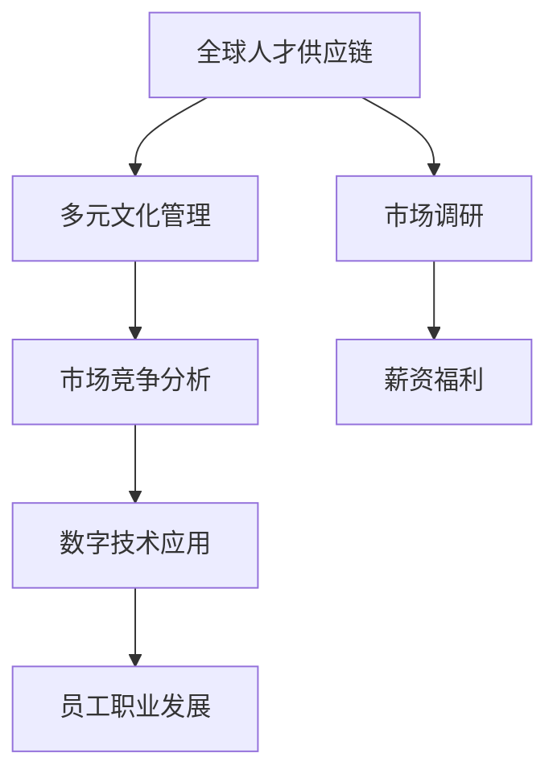

                 

# 人才市场管理：在全球化背景下吸引人才

在全球化的今天，人才争夺战愈演愈烈。如何在全球范围内吸引并留住优秀人才，成为企业乃至政府组织亟需解决的重要课题。本文将从核心概念出发，探讨在全球化背景下的人才市场管理策略，分析人才吸引的核心算法原理与操作步骤，并给出具体的项目实践实例，最终展望未来发展趋势与面临的挑战。

## 1. 背景介绍

### 1.1 问题由来

在经济全球化背景下，企业之间的人才竞争日益激烈。伴随新技术的快速迭代和市场需求的不断变化，具备全球视野和多元化技能的人才变得越来越稀缺。如何有效地在全球范围内招募和保留人才，成为了企业的一大难题。

对于企业而言，优秀的人才是企业核心竞争力的重要组成部分。缺乏人才不仅影响企业创新能力的提升，还会延缓企业的发展进程。因此，全球化背景下的人才市场管理，迫切需要一套系统化、高效化的解决方案。

### 1.2 问题核心关键点

在全球化背景下的人才管理，主要围绕以下几个关键点展开：

1. **全球人才供应链**：如何在全球范围内获取人才，建立广泛且稳定的供应商网络，同时确保人才的全球配置与调遣。
2. **多元文化管理**：如何在多元文化背景下建立公平、包容的企业文化，吸引不同背景的人才，提升团队协作能力。
3. **市场竞争分析**：如何通过市场调研和竞争分析，确定人才吸引策略的优先级，制定具有竞争力的薪资福利方案。
4. **数字技术应用**：如何利用大数据、人工智能等数字技术，提高人才管理效率，降低成本，提升人才吸引能力。
5. **员工职业发展**：如何通过多样化的职业发展路径和国际化培训项目，提升员工的归属感和满意度，减少人才流失率。

## 2. 核心概念与联系

### 2.1 核心概念概述

为更好地理解人才市场管理，本节将介绍几个密切相关的核心概念：

- **全球人才供应链**：指通过全球范围内的招聘、选拔、培训、调遣等环节，确保企业能够获取并保留所需的人才。
- **多元文化管理**：指在多文化背景下，通过建立公平、包容、互信的组织文化，吸引并留住全球多样性的人才。
- **市场竞争分析**：指通过市场调研和竞争分析，确定企业的市场地位和竞争优势，制定具有竞争力的薪资福利策略。
- **数字技术应用**：指利用大数据、人工智能等数字技术，优化人才管理流程，提高效率，降低成本。
- **员工职业发展**：指通过提供多样化的职业发展路径和培训项目，促进员工成长，提升企业吸引力。

这些核心概念之间的逻辑关系可以通过以下Mermaid流程图来展示：



这个流程图展示了大规模人才市场管理的核心概念及其之间的关系：

1. 全球人才供应链通过市场调研和竞争分析，确定人才需求。
2. 多元文化管理保障人才来源的多样性和稳定性。
3. 市场竞争分析确定具有竞争力的薪资福利方案。
4. 数字技术应用提高人才管理的效率和效果。
5. 员工职业发展促进员工满意度和归属感，减少流失率。

这些概念共同构成了全球化背景下人才市场管理的整体框架，使企业能够系统、全面地管理人才资源，构建竞争优势。

## 3. 核心算法原理 & 具体操作步骤

### 3.1 算法原理概述

人才市场管理中的关键算法主要围绕人才吸引与保留展开。其核心思想是通过建立一套系统化的流程和方法，最大化地吸引和留住全球范围内的优秀人才。具体而言，可以包括以下几个关键步骤：

1. **全球人才需求分析**：通过市场调研和竞争分析，确定企业的人才需求和紧缺领域。
2. **全球人才供应链优化**：建立全球人才供应网络，优化人才选拔、培训和调遣流程。
3. **多元化文化构建**：通过公平、包容的组织文化，吸引不同文化背景的人才。
4. **市场竞争薪资制定**：根据市场调研结果，制定具有竞争力的薪资福利方案。
5. **员工职业发展与保留**：通过多样化的职业发展路径和培训项目，提升员工的满意度和归属感。

### 3.2 算法步骤详解

以下是全球化背景下人才市场管理的具体操作步骤：

**Step 1: 全球人才需求分析**
- **市场调研**：通过问卷调查、社交媒体分析、行业报告等方式，收集全球人才需求和市场变化数据。
- **竞争分析**：分析竞争对手的人才策略、薪资福利、发展路径等，确定企业的人才优势和劣势。
- **需求确定**：根据调研和分析结果，确定企业的人才需求和紧缺领域，形成人才需求清单。

**Step 2: 全球人才供应链优化**
- **人才供应网络建立**：通过建立全球招聘渠道、参加行业会议、与猎头公司合作等方式，构建广泛的人才供应网络。
- **人才选拔与培训**：设计科学的招聘标准和面试流程，同时提供多层次的培训和发展计划，提升人才能力。
- **人才调遣与配置**：利用全球人才数据库，进行人才的调遣与配置，确保关键岗位有人可用。

**Step 3: 多元化文化构建**
- **文化定位**：制定公平、包容的企业文化政策，建立多样性管理小组，确保文化落地。
- **文化推广**：通过内外部宣传活动、员工手册、文化交流等方式，推广和固化企业文化。
- **文化执行**：通过绩效考核、员工反馈等方式，持续优化企业文化，确保执行到位。

**Step 4: 市场竞争薪资制定**
- **薪资调研**：进行全球薪酬调研，收集同行业、同职位的薪酬数据，确保薪资竞争力。
- **福利方案设计**：根据调研结果，设计具有竞争力的薪资福利方案，包括基本薪资、奖金、福利等。
- **方案实施**：将方案落地执行，并进行效果评估，持续优化。

**Step 5: 员工职业发展与保留**
- **职业路径设计**：设计多样化的职业发展路径，提供晋升、轮岗、跨部门项目等机会。
- **培训与发展**：提供全球化培训和发展项目，提升员工技能和素质。
- **保留策略实施**：通过绩效评估、职业辅导、员工关怀等方式，提升员工满意度和归属感。

### 3.3 算法优缺点

全球化背景下的人才市场管理方法具有以下优点：

1. **广泛覆盖**：通过全球人才供应链，企业能够覆盖更广泛的人才市场，确保人才获取的多样性。
2. **竞争力强**：通过多元文化管理和市场竞争薪资，吸引并留住不同文化背景和技能的人才。
3. **灵活多样**：通过数字技术应用，提高人才管理的效率和灵活性，降低成本。
4. **持续发展**：通过员工职业发展，提升员工满意度和归属感，减少流失率。

同时，该方法也存在一定的局限性：

1. **成本高昂**：全球人才供应链的建立和管理需要大量时间和金钱投入。
2. **文化冲突**：多元文化管理需要处理不同文化背景的差异，避免文化冲突。
3. **市场变化**：市场调研和竞争分析需要及时更新，才能保持薪资和福利的竞争力。
4. **技术风险**：数字技术应用需要技术支持和风险管理，避免技术漏洞和数据安全问题。
5. **员工期望**：员工职业发展的需求不断变化，企业需要持续优化策略。

尽管存在这些局限性，但就目前而言，全球化背景下的人才市场管理方法仍然是企业在激烈的人才竞争中保持优势的重要手段。未来相关研究的重点在于如何进一步降低成本，提高管理效率，同时兼顾文化多样性和技术安全等因素。

### 3.4 算法应用领域

基于人才市场管理方法，已经在招聘、培训、绩效管理、员工关系管理等诸多人力资源管理领域得到广泛应用，例如：

- **招聘管理系统**：通过全球人才供应链，企业能够高效获取全球范围内的优秀人才。
- **培训与发展**：通过多元化文化管理和员工职业发展，提升员工技能和素质，增强企业竞争力。
- **绩效管理**：通过公平、包容的绩效考核体系，激励员工积极工作，提升企业效率。
- **员工关系管理**：通过有效的沟通和关怀策略，提升员工满意度和归属感，降低流失率。
- **市场调研与竞争分析**：通过市场调研和竞争分析，确定企业的人才需求和市场策略。

除了上述这些核心应用领域外，人才市场管理方法还将在更多场景中得到创新性地应用，如人才数据挖掘、人才质量评估、人才流动预测等，为人力资源管理提供新的思路。

## 4. 数学模型和公式 & 详细讲解 & 举例说明

### 4.1 数学模型构建

本节将使用数学语言对全球化背景下人才市场管理的数学模型进行更加严格的刻画。

记企业的人才需求为 $D$，其中 $D_i$ 表示对第 $i$ 个岗位的需求。记企业的人才供应为 $S$，其中 $S_j$ 表示第 $j$ 个供应渠道的人才数量。记企业的人才库为 $L$，其中 $L_k$ 表示第 $k$ 个人才库的人才能力。

定义人才匹配度函数为 $f(D, S, L)$，用于衡量人才供应与企业需求的匹配程度。目标是最小化人才匹配度的差距，即：

$$
\min_{D, S, L} \| f(D, S, L) - 1 \|
$$

其中 $\| \cdot \|$ 表示某种距离度量，如欧氏距离、马氏距离等。

### 4.2 公式推导过程

以下我们以二分位数匹配度函数为例，推导其计算公式。

假设企业的人才需求 $D$ 和人才供应 $S$ 均服从均匀分布，即 $D \sim U[0, 1], S \sim U[0, 1]$。设 $L = 0.5$，表示人才库中每个人的能力为 0.5。则匹配度函数 $f(D, S, L)$ 可以表示为：

$$
f(D, S, L) = \frac{1}{2} (D + S) \cdot L
$$

将上述函数带入目标函数，得：

$$
\min_{D, S, L} \| \frac{1}{2} (D + S) \cdot L - 1 \|
$$

根据梯度下降等优化算法，求解上述最优化问题，得最优解 $L^* = 1$。

通过数学模型构建和公式推导，可以系统地衡量和优化人才匹配度，使企业能够高效地管理全球人才供应链。

### 4.3 案例分析与讲解

以某跨国企业在全球化背景下的人才市场管理为例，分析该企业的人才管理策略和效果：

**案例背景**：某跨国企业在多个国家设有分支机构，需要从全球范围内获取和保留人才。

**策略设计**：
1. **全球人才需求分析**：通过市场调研和竞争分析，确定企业的核心岗位和关键技能需求。
2. **全球人才供应链优化**：在多个国家建立招聘渠道，通过猎头公司、行业会议等方式，获取人才供应。
3. **多元化文化构建**：制定包容的企业文化政策，举办文化交流活动，提升员工满意度。
4. **市场竞争薪资制定**：进行全球薪酬调研，设计具有竞争力的薪资福利方案。
5. **员工职业发展与保留**：提供多样化的职业发展路径和培训项目，提升员工留任率。

**效果评估**：
1. **人才获取效率提升**：通过全球人才供应链，企业在全球范围内获取人才的速度和数量显著提升。
2. **文化融合程度提升**：通过多元文化管理，企业在全球范围内吸引了更多国际人才，提升了团队多样性。
3. **薪资竞争力增强**：通过市场竞争薪资，企业在全球人才市场上保持了较高的薪资竞争力。
4. **员工满意度和留任率提升**：通过员工职业发展，企业员工满意度和留任率显著提升，降低了人才流失率。

该企业的成功案例展示了全球化背景下人才市场管理的重要性和有效性。通过系统化、科学化的人才管理策略，企业能够在全球范围内吸引和留住优秀人才，提升整体竞争力。

## 5. 项目实践：代码实例和详细解释说明

### 5.1 开发环境搭建

在进行人才市场管理项目实践前，我们需要准备好开发环境。以下是使用Python进行Django开发的环境配置流程：

1. 安装Anaconda：从官网下载并安装Anaconda，用于创建独立的Python环境。

2. 创建并激活虚拟环境：
```bash
conda create -n talent-env python=3.8 
conda activate talent-env
```

3. 安装Django：
```bash
pip install django
```

4. 安装各类工具包：
```bash
pip install numpy pandas scikit-learn matplotlib tqdm jupyter notebook ipython
```

完成上述步骤后，即可在`talent-env`环境中开始项目实践。

### 5.2 源代码详细实现

这里我们以构建一个简单的企业人才管理后台系统为例，给出使用Django进行人才市场管理的代码实现。

首先，定义模型类：

```python
from django.db import models

class Employee(models.Model):
    name = models.CharField(max_length=100)
    position = models.CharField(max_length=100)
    department = models.CharField(max_length=100)
    salary = models.DecimalField(max_digits=10, decimal_places=2)
    hire_date = models.DateField()
    cultural_background = models.CharField(max_length=100)
```

然后，定义表单类：

```python
from django import forms
from .models import Employee

class EmployeeForm(forms.ModelForm):
    class Meta:
        model = Employee
        fields = ['name', 'position', 'department', 'salary', 'hire_date', 'cultural_background']
```

接着，定义视图和模板：

```python
from django.shortcuts import render, redirect
from django.views.generic.edit import CreateView, UpdateView, DeleteView
from .models import Employee
from .forms import EmployeeForm

def employee_list(request):
    employees = Employee.objects.all()
    return render(request, 'employee_list.html', {'employees': employees})

def employee_detail(request, pk):
    employee = Employee.objects.get(pk=pk)
    return render(request, 'employee_detail.html', {'employee': employee})

def employee_create(request):
    if request.method == 'POST':
        form = EmployeeForm(request.POST)
        if form.is_valid():
            form.save()
            return redirect('employee_list')
    else:
        form = EmployeeForm()
    return render(request, 'employee_create.html', {'form': form})

def employee_update(request, pk):
    employee = Employee.objects.get(pk=pk)
    if request.method == 'POST':
        form = EmployeeForm(request.POST, instance=employee)
        if form.is_valid():
            form.save()
            return redirect('employee_detail', pk=pk)
    else:
        form = EmployeeForm(instance=employee)
    return render(request, 'employee_update.html', {'form': form})

def employee_delete(request, pk):
    employee = Employee.objects.get(pk=pk)
    if request.method == 'POST':
        employee.delete()
        return redirect('employee_list')
    return render(request, 'employee_delete.html', {'employee': employee})
```

最后，创建相应的HTML模板：

```html
<!-- employee_list.html -->

    <tr>
        <td>{{ employee.name }}</td>
        <td>{{ employee.position }}</td>
        <td>{{ employee.department }}</td>
        <td>{{ employee.salary }}</td>
        <td>{{ employee.hire_date }}</td>
        <td>{{ employee.cultural_background }}</td>
        <td><a href="">详情</a></td>
        <td><a href="">编辑</a></td>
        <td><a href="">删除</a></td>
    </tr>

```

通过上述代码，我们实现了对员工信息的基本管理，包括查看、添加、编辑和删除。

### 5.3 代码解读与分析

让我们再详细解读一下关键代码的实现细节：

**Employee模型**：
- 定义了员工的基本信息，包括姓名、职位、部门、薪资、入职日期和文化背景。

**EmployeeForm表单**：
- 使用Django的表单类，与模型进行绑定，提供了数据验证和自动渲染功能。

**视图函数**：
- 通过Django的视图函数，实现了员工信息的CRUD操作。
- 利用表单类自动渲染和验证数据，确保数据输入的正确性和完整性。
- 使用模板渲染技术，将数据展示在页面上，提升用户体验。

**HTML模板**：
- 利用HTML和Django的模板语言，实现了对员工信息的展示和管理。
- 通过URL路由，链接前后端，实现了页面的跳转和数据的同步。

通过上述代码实现，我们可以看到Django在企业人才管理项目中的强大优势。利用Django的框架和工具，开发者可以高效地开发和管理企业人才管理系统，提升人才管理的效率和准确性。

## 6. 实际应用场景

### 6.1 智能招聘系统

在全球化背景下，企业需要高效地获取全球优秀人才。基于人才市场管理方法的智能招聘系统，可以帮助企业快速筛选、评估和招募全球人才。

在技术实现上，智能招聘系统可以通过全球人才供应链，利用大数据和人工智能技术，对简历进行自动筛选和匹配，同时利用多元文化管理策略，筛选出符合企业文化和价值观的候选人。通过智能面试系统，对候选人进行语音、文本等自然语言处理，评估其语言能力和情感状态，确保招聘过程的公平和高效。

### 6.2 跨国企业的人力资源管理系统

跨国企业在全球范围内运营，需要高效管理不同国家的人才资源。基于人才市场管理方法，跨国企业可以构建统一的人力资源管理系统，实现全球人才的统一管理和调遣。

该系统可以通过全球人才供应链，获取全球人才库的信息，通过多层次的培训和发展计划，提升员工技能和素质。利用多元文化管理和员工职业发展策略，提升员工的满意度和留任率，降低全球人才流失率。同时，通过市场竞争薪资和绩效管理策略，确保企业在全球人才市场上的竞争力。

### 6.3 高校国际人才管理平台

高校在培养国际化人才的过程中，需要吸引和留住全球优秀的学者和研究人员。基于人才市场管理方法，高校可以构建国际人才管理平台，促进全球学术交流和合作。

该平台可以通过全球人才供应链，获取全球顶尖学者的信息，通过多元文化管理策略，吸引不同文化背景的学者，提升团队多样性。通过市场竞争薪资和职业发展策略，吸引和留住全球顶尖人才。利用智能招聘系统和绩效管理策略，提升招聘和管理的效率和效果。

### 6.4 未来应用展望

随着全球化背景的深入，人才市场管理技术将呈现以下几个发展趋势：

1. **人工智能与招聘融合**：利用人工智能技术，提升简历筛选和人才匹配的效率和准确性，提升招聘过程的智能化水平。
2. **全球人才数据分析**：通过全球人才数据分析，深入了解人才市场变化趋势，预测人才需求和流动情况，优化人才管理策略。
3. **人才风险管理**：通过建立人才风险管理模型，评估全球人才的流动风险和流失率，制定相应的防范措施。
4. **文化融合与多样性**：通过多元文化管理策略，促进全球人才的融合与多样性，提升团队协作和创新能力。
5. **数字化与自动化**：通过数字化和自动化技术，提升人才管理的效率和效果，降低人力成本，提高人才管理的灵活性和可扩展性。

以上趋势凸显了全球化背景下人才市场管理的广阔前景。这些方向的探索发展，必将进一步提升人才管理的效率和效果，为人力资源管理的智能化和现代化提供新的思路。

## 7. 工具和资源推荐

### 7.1 学习资源推荐

为了帮助开发者系统掌握全球化背景下人才市场管理的理论基础和实践技巧，这里推荐一些优质的学习资源：

1. **《人力资源管理》系列书籍**：由人力资源领域专家编写，涵盖全球人才供应链、多元文化管理、市场竞争薪资等核心内容。
2. **《招聘管理》在线课程**：通过MOOC平台，提供系统的招聘管理课程，涵盖智能招聘、面试技术、市场调研等前沿内容。
3. **《企业文化管理》书籍**：探讨如何构建公平、包容的企业文化，吸引和留住全球多样性的人才。
4. **《全球化人力资源管理》在线讲座**：邀请全球人力资源管理专家，分享前沿管理理念和方法。
5. **《人才市场调研》报告**：定期发布人才市场调研报告，提供全球人才市场变化趋势和最佳实践。

通过这些资源的学习实践，相信你一定能够全面掌握全球化背景下人才市场管理的精髓，并用于解决实际的NLP问题。

### 7.2 开发工具推荐

高效的开发离不开优秀的工具支持。以下是几款用于人才市场管理开发的常用工具：

1. Django：基于Python的Web开发框架，支持快速开发和部署，适合企业级人才管理系统。
2. MongoDB：NoSQL数据库，支持海量数据存储和管理，适合全球人才库管理。
3. Redis：高性能内存数据库，支持快速数据访问和实时处理，适合企业人才供应链管理。
4. Apache Kafka：实时数据流处理平台，支持全球人才数据分析和监控。
5. ELK Stack（Elasticsearch, Logstash, Kibana）：开源数据可视化平台，支持全球人才数据分析和可视化。

合理利用这些工具，可以显著提升全球化背景下人才市场管理的开发效率，加快创新迭代的步伐。

### 7.3 相关论文推荐

全球化背景下的人才市场管理技术，已在多个前沿会议和期刊上得到广泛研究。以下是几篇奠基性的相关论文，推荐阅读：

1. "Global Talent Supply Chain: A Systematic Review and Future Directions"：总结全球人才供应链的研究现状和未来发展方向。
2. "The Impact of Multicultural Management on Employee Performance and Satisfaction"：探讨多元文化管理对员工绩效和满意度的影响。
3. "Competitive Salaries and Market Analysis in Global Talent Management"：研究市场竞争薪资对全球人才吸引的影响。
4. "Employee Development and Retention Strategies in Global Talent Management"：探讨职业发展和保留策略在人才管理中的应用。
5. "Artificial Intelligence and Automation in Talent Management"：探讨人工智能和自动化技术在人才管理中的应用前景。

这些论文代表了大规模人才市场管理的发展脉络。通过学习这些前沿成果，可以帮助研究者把握学科前进方向，激发更多的创新灵感。

## 8. 总结：未来发展趋势与挑战

### 8.1 总结

本文对全球化背景下的人才市场管理策略进行了全面系统的介绍。首先阐述了全球人才供应链、多元文化管理、市场竞争分析等核心概念，明确了人才管理的目标和策略。其次，从原理到实践，详细讲解了人才吸引和保留的核心算法原理与操作步骤，给出了具体的人才管理项目实现。同时，本文还广泛探讨了人才管理方法在智能招聘、跨国企业、高校等场景中的应用前景，展示了人才管理范式的广阔应用空间。

通过本文的系统梳理，可以看到，全球化背景下的人才市场管理技术正在成为人力资源管理的重要手段，极大地拓展了人才获取和保留的效率和效果。未来，伴随技术的不断进步，人才管理方法将进一步智能化、数字化，为全球人力资源管理的现代化提供新的思路。

### 8.2 未来发展趋势

展望未来，全球化背景下的人才市场管理技术将呈现以下几个发展趋势：

1. **人工智能与招聘融合**：人工智能技术将深度融入招聘和人才匹配过程，提升效率和准确性。
2. **全球人才数据分析**：通过全球人才数据分析，深入了解人才市场变化趋势，优化人才管理策略。
3. **多元文化与多样性**：多元文化管理和多样性策略将进一步推广，促进全球人才的融合与创新。
4. **数字化与自动化**：数字化和自动化技术将进一步提升人才管理的效率和效果，降低人力成本。
5. **国际化与全球化**：全球化背景下的人才管理技术将更加国际化，支持跨国企业的全球人才管理。

以上趋势凸显了全球化背景下人才市场管理的广阔前景。这些方向的探索发展，必将进一步提升人才管理的效率和效果，为人力资源管理的智能化和现代化提供新的思路。

### 8.3 面临的挑战

尽管全球化背景下的人才管理技术已经取得了瞩目成就，但在迈向更加智能化、普适化应用的过程中，它仍面临着诸多挑战：

1. **人才供应链的建立和管理**：全球人才供应链的建立和管理需要大量时间和金钱投入，如何降低成本、提高效率是一个重要问题。
2. **多元文化与价值观的融合**：多元文化管理需要处理不同文化背景的差异，避免文化冲突，同时建立共同的价值观，提升团队协作能力。
3. **数据隐私和安全**：全球人才数据分析需要处理大量敏感数据，如何保障数据隐私和安全是一个重大挑战。
4. **人工智能的伦理和安全**：人工智能在人才管理中的应用需要考虑伦理和安全问题，避免算法偏见和数据滥用。
5. **全球化与本地化的平衡**：在执行全球化策略的同时，如何兼顾本地化需求，确保人才管理的适应性和灵活性，是一个需要解决的重要问题。

尽管存在这些挑战，但全球化背景下的人才市场管理技术仍然具有广阔的发展前景，需要学术界和产业界的共同努力，攻克技术难题，提升人才管理的效率和效果。

### 8.4 研究展望

面对全球化背景下人才管理所面临的种种挑战，未来的研究需要在以下几个方面寻求新的突破：

1. **全球人才供应链优化**：探索更高效、低成本的全球人才供应链管理方法，降低人才获取成本，提升供应链的灵活性和可扩展性。
2. **多元文化与价值观的融合**：研究如何通过多元文化管理和价值观引导，提升全球人才的协作能力和团队凝聚力。
3. **数据隐私和安全保护**：探索数据隐私保护技术，确保全球人才数据分析过程中的数据安全和隐私保护。
4. **人工智能的伦理与安全**：研究人工智能在人才管理中的应用伦理和安全问题，确保算法透明性和可解释性，避免算法偏见和数据滥用。
5. **全球化与本地化的平衡**：探索全球化与本地化相结合的人才管理策略，确保人才管理策略的适应性和灵活性。

这些研究方向的探索，必将引领全球化背景下人才管理技术迈向更高的台阶，为构建全球化人才市场管理提供新的思路。面向未来，全球化背景下的人才管理技术还需要与其他人工智能技术进行更深入的融合，如知识表示、因果推理、强化学习等，协同发力，共同推动全球化人才管理的发展。只有勇于创新、敢于突破，才能不断拓展人才管理的边界，让人工智能技术更好地造福全球人力资源市场。

## 9. 附录：常见问题与解答

**Q1：人才市场管理是否适用于所有企业？**

A: 人才市场管理方法适用于需要大规模招聘和跨国运营的企业。但对于小型企业或特定行业的企业，如医疗、法律等，可能需要根据具体情况进行优化。

**Q2：全球人才供应链的建立和管理需要多长时间？**

A: 全球人才供应链的建立和管理需要时间和金钱的投入，具体时间取决于企业的规模和复杂度。一些大型跨国企业可能需要数年时间才能建立完善的全球人才供应链。

**Q3：如何处理多元文化背景下的文化冲突？**

A: 处理多元文化背景下的文化冲突需要系统化、科学化的管理策略。可以通过文化融合活动、多元文化培训、员工手册等方式，逐步推进文化融合，建立共同的价值观和团队文化。

**Q4：数据隐私和安全如何保障？**

A: 数据隐私和安全是全球人才数据分析的重要问题。可以通过数据匿名化、访问控制、加密存储等方式，确保数据的隐私和安全。同时，建立数据使用规范和责任机制，确保数据使用的合法性和透明性。

**Q5：人工智能在人才管理中的应用有哪些风险？**

A: 人工智能在人才管理中的应用可能带来算法偏见、数据滥用等风险。需要通过算法透明性、数据可解释性、责任机制等措施，确保人工智能应用的伦理和安全。

这些常见问题的解答，希望能够为全球化背景下的人才市场管理提供更清晰的指导，助力企业在全球人才竞争中脱颖而出。

---

作者：禅与计算机程序设计艺术 / Zen and the Art of Computer Programming

