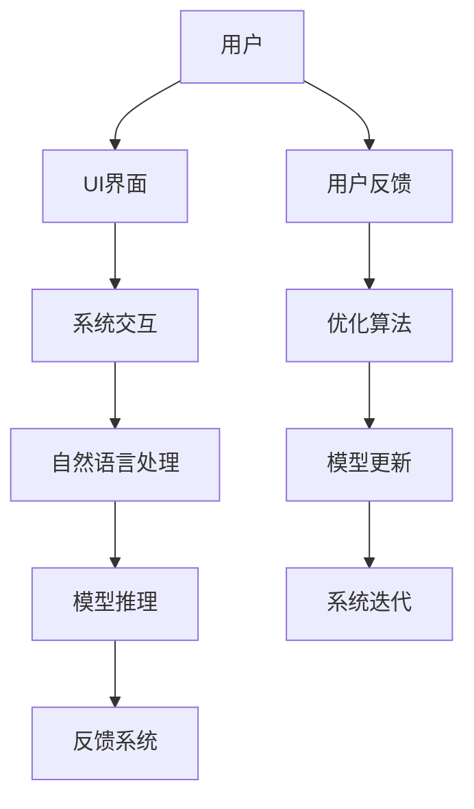

                 

## 1. 背景介绍

### 1.1 问题由来
近年来，随着技术的不断进步和应用场景的不断扩大，人机交互已经成为了一个至关重要的话题。无论是企业内部的自动化流程，还是日常生活中的智能家居和智能助手，人机交互系统的设计都在以惊人的速度改变着我们的生活和工作方式。然而，在快速发展的过程中，我们也面临着诸多挑战，如系统的响应速度、易用性、安全性等问题。这些问题不仅影响着用户体验，也限制了人机交互系统的应用范围。

### 1.2 问题核心关键点
为了解决这些问题，本文将深入探讨人机交互系统的设计原理和应用实践。我们将从核心概念出发，通过核心算法和操作步骤，详细介绍如何构建高效便捷的人类计算系统。同时，我们还将结合实际应用场景，展示人机交互技术在各行各业的应用，以及未来的发展趋势和面临的挑战。

## 2. 核心概念与联系

### 2.1 核心概念概述

为了更好地理解人机交互系统，我们需要了解几个关键概念：

- **人机交互(Human-Computer Interaction, HCI)**：是人与计算机之间通过界面进行通信和互动的过程。人机交互的目的是通过优化系统界面，使用户能够高效地完成任务。

- **用户界面(UI)**：是人机交互中最重要的组成部分，包括图形界面(GUI)、命令行界面(CLI)等，用于接收用户输入、呈现系统反馈。

- **用户体验(UX)**：是人机交互的核心目标，旨在提供愉悦、流畅的交互体验，提高用户满意度和使用效率。

- **自然语言处理(NLP)**：是人机交互中重要的技术之一，用于理解和生成自然语言，提高系统的智能化和人性化。

- **机器学习(ML)**：是通过算法和模型让计算机系统具备自主学习和改进能力，提高人机交互的个性化和智能化水平。

- **模型推理和优化**：是人机交互系统优化中的重要环节，通过不断调整和优化系统模型，提高系统的响应速度和准确性。

### 2.2 核心概念原理和架构的 Mermaid 流程图



这个流程图展示了人机交互系统的基本架构和工作流程。用户通过UI界面与系统进行互动，自然语言处理模块负责理解用户输入，模型推理模块根据输入进行计算并输出结果，反馈系统向用户展示计算结果，用户根据反馈进行调整。通过优化算法和模型更新，系统不断迭代优化，以提高交互效率和准确性。

## 3. 核心算法原理 & 具体操作步骤

### 3.1 算法原理概述

人机交互系统的核心算法原理是让用户能够通过直观、自然的方式与计算机进行互动。这涉及到以下几个关键技术：

- **用户界面设计(UI设计)**：通过合理的布局、颜色、字体等设计，优化用户操作流程，提高系统易用性。

- **自然语言处理(NLP)**：通过训练语言模型，实现对用户输入的自然语言理解，提供智能化的系统交互。

- **机器学习(ML)**：通过训练分类器、回归器等模型，实现对用户行为的预测和推荐，提高系统的智能化水平。

- **模型推理和优化**：通过优化模型结构、调整超参数等方法，提高系统推理速度和准确性，提升用户体验。

### 3.2 算法步骤详解

构建高效便捷的人机交互系统，通常包括以下几个关键步骤：

**Step 1: 设计用户界面(UI)**
- 确定系统目标和功能，设计合理的用户界面布局，选择直观易用的控件和操作方式。
- 考虑用户的需求和使用习惯，避免复杂的操作流程，减少用户认知负担。
- 进行用户测试，收集反馈，不断优化界面设计。

**Step 2: 实现自然语言处理(NLP)**
- 选择合适的语言模型和库，进行数据预处理和特征提取。
- 训练语言模型，实现对用户输入的自然语言理解。
- 实现基于模型的自动文本生成，提升系统智能化水平。

**Step 3: 构建机器学习模型**
- 选择适当的算法和数据集，训练分类器、回归器等模型。
- 进行模型调优，选择合适的超参数和特征，提高模型预测和推荐准确性。
- 集成多模型，实现系统的组合预测和推荐。

**Step 4: 进行模型推理和优化**
- 使用GPU、TPU等高性能设备，优化模型推理速度。
- 进行模型剪枝、量化等优化，减少模型参数和内存占用。
- 通过持续学习和在线优化，提升系统性能和适应性。

### 3.3 算法优缺点

人机交互系统的设计需要综合考虑多个方面，以下是其优缺点：

**优点：**
- 提高用户效率：通过直观、自然的操作方式，让用户能够高效完成任务。
- 提升用户体验：通过合理的UI设计和自然语言处理，提供愉悦、流畅的交互体验。
- 增强智能化水平：通过机器学习模型，实现对用户行为的预测和推荐。
- 适应性强：通过持续学习和在线优化，系统能够适应不断变化的用户需求。

**缺点：**
- 设计和实现复杂：需要综合考虑UI设计、NLP、ML等多个方面，设计和实现难度较大。
- 数据需求高：需要大量的标注数据和训练样本，数据获取和标注成本较高。
- 安全性问题：系统需要具备高安全性，防止数据泄露和恶意攻击。
- 维护成本高：系统需要定期维护和更新，保证稳定运行。

### 3.4 算法应用领域

人机交互技术已经在多个领域得到了广泛应用，包括但不限于：

- **企业自动化**：通过自动化流程、智能助手等，提高企业运营效率。
- **智能家居**：通过语音助手、智能家电等，提升家庭生活质量。
- **智能医疗**：通过智能诊断、健康管理等，提高医疗服务质量。
- **智能客服**：通过智能客服机器人，提高客户服务水平。
- **虚拟现实**：通过VR/AR设备，实现沉浸式交互体验。

## 4. 数学模型和公式 & 详细讲解 & 举例说明

### 4.1 数学模型构建

为了更好地理解人机交互系统，我们还需要建立相应的数学模型。以下是一些常用的数学模型：

- **决策树模型**：用于分类任务，通过树形结构对特征进行分割，生成决策树。
- **线性回归模型**：用于回归任务，通过线性关系对目标变量进行预测。
- **深度神经网络模型**：用于分类、回归、生成等任务，通过多层神经网络实现复杂特征提取和推理。
- **卷积神经网络模型**：用于图像处理任务，通过卷积操作提取图像特征，实现目标检测、分类等。

### 4.2 公式推导过程

以线性回归模型为例，进行公式推导：

假设数据集为 $(x_1, y_1), (x_2, y_2), \ldots, (x_n, y_n)$，其中 $x_i$ 为输入特征，$y_i$ 为目标变量。线性回归模型的目标是找到一个线性函数 $f(x) = wx + b$，使得预测值与真实值尽可能接近。通过最小化均方误差，可以求解出最优参数 $w$ 和 $b$。

$$
\min_{w, b} \frac{1}{n}\sum_{i=1}^n (y_i - f(x_i))^2
$$

通过求解上述优化问题，可以得到：

$$
w = (\sum_{i=1}^n x_i x_i^T)^{-1} \sum_{i=1}^n x_i y_i
$$
$$
b = \bar{y} - w\bar{x}
$$

其中 $\bar{x} = \frac{1}{n} \sum_{i=1}^n x_i$，$\bar{y} = \frac{1}{n} \sum_{i=1}^n y_i$。

### 4.3 案例分析与讲解

以智能客服系统为例，进行案例分析：

假设有一个智能客服系统，通过NLP技术理解用户输入，使用线性回归模型预测用户情绪，实现智能回答。具体步骤如下：

1. 收集用户咨询记录，提取文本特征。
2. 使用BERT等预训练模型，实现对用户输入的自然语言理解。
3. 训练线性回归模型，预测用户情绪。
4. 根据情绪分类，匹配最佳回复模板，生成系统回答。

通过不断优化模型和回答模板，可以大幅提升系统的回答准确性和用户体验。

## 5. 项目实践：代码实例和详细解释说明

### 5.1 开发环境搭建

为了进行人机交互系统的开发，我们需要搭建相应的开发环境：

1. 安装Python：选择Python 3.7或更高版本。
2. 安装相关的库：如TensorFlow、PyTorch、NLTK等。
3. 配置开发环境：如Jupyter Notebook、Visual Studio Code等。
4. 部署服务器：如AWS、Google Cloud等，用于上线系统。

### 5.2 源代码详细实现

以下是一个简单的智能客服系统的实现代码：

```python
import tensorflow as tf
from tensorflow.keras import layers
from transformers import BertTokenizer, BertForSequenceClassification
from sklearn.model_selection import train_test_split
import numpy as np
import pandas as pd

# 加载预训练模型和分词器
tokenizer = BertTokenizer.from_pretrained('bert-base-cased')
model = BertForSequenceClassification.from_pretrained('bert-base-cased', num_labels=3)

# 加载数据集
df = pd.read_csv('user_conversations.csv')
X = df['text'].tolist()
y = df['label'].tolist()

# 数据预处理
X = [tokenizer.encode(text) for text in X]
y = np.array(y)

# 划分训练集和测试集
X_train, X_test, y_train, y_test = train_test_split(X, y, test_size=0.2, random_state=42)

# 模型训练
model.compile(optimizer=tf.keras.optimizers.Adam(learning_rate=2e-5), loss=tf.keras.losses.SparseCategoricalCrossentropy(from_logits=True), metrics=['accuracy'])
model.fit(X_train, y_train, batch_size=32, epochs=10, validation_data=(X_test, y_test))

# 模型预测
y_pred = model.predict(X_test)
```

### 5.3 代码解读与分析

以上代码实现了使用BERT模型进行情绪分类任务的过程。关键点包括：

- 数据预处理：使用BertTokenizer对输入文本进行编码，转换为模型能够处理的形式。
- 模型构建：使用BertForSequenceClassification构建分类模型，指定3个情绪类别。
- 模型训练：使用Adam优化器进行训练，指定学习率、批大小、迭代轮数等超参数。
- 模型预测：使用训练好的模型进行预测，输出分类结果。

## 6. 实际应用场景

### 6.1 智能客服系统

智能客服系统通过人机交互技术，能够实现24小时不间断服务，快速响应客户咨询，用自然流畅的语言解答各类常见问题。具体应用场景包括：

1. 收集企业内部的历史客服对话记录，将问题和最佳答复构建成监督数据，在此基础上对预训练对话模型进行微调。
2. 微调后的对话模型能够自动理解用户意图，匹配最合适的答案模板进行回复。
3. 对于客户提出的新问题，还可以接入检索系统实时搜索相关内容，动态组织生成回答。

通过智能客服系统，企业能够显著提升客户咨询体验和问题解决效率。

### 6.2 智能家居

智能家居通过语音助手等技术，实现用户与家居设备的自然交互，提升生活便利性。具体应用场景包括：

1. 使用语音助手控制家电设备，如灯光、空调、窗帘等。
2. 通过语音输入，查询天气、新闻、股市等信息。
3. 实现智能家居设备的互联互通，提供个性化的智能推荐。

通过人机交互技术，智能家居系统能够更好地满足用户需求，提升生活质量。

### 6.3 智能医疗

智能医疗通过人机交互技术，实现对患者的智能诊断、健康管理等，提高医疗服务质量。具体应用场景包括：

1. 使用智能问诊系统，对患者的症状进行自动分析，提供诊断建议。
2. 通过智能健康管理，监测患者的身体指标，提供健康预警。
3. 使用智能推荐系统，推荐适合的药品和治疗方案。

通过智能医疗系统，医疗机构能够提高诊疗效率和准确性，提升患者满意度。

## 7. 工具和资源推荐

### 7.1 学习资源推荐

为了帮助开发者系统掌握人机交互技术，以下是一些优质的学习资源：

1. 《Human-Computer Interaction》课程：由MIT和Stanford等名校开设，涵盖人机交互设计的理论基础和实践技术。
2. 《Natural Language Processing》课程：由Coursera和edX等平台提供的NLP相关课程，涵盖自然语言处理的基本概念和算法。
3. 《Machine Learning》课程：由Coursera和Udacity等平台提供的机器学习课程，涵盖机器学习的基本概念和算法。
4. 《Deep Learning》书籍：由Ian Goodfellow等作者所著，全面介绍了深度学习的基本概念和算法。
5. 《Human-Computer Interaction》书籍：由Bruce Tognazzini等作者所著，涵盖了人机交互设计的历史、理论和实践。

通过对这些资源的学习实践，相信你一定能够快速掌握人机交互技术，并用于解决实际的NLP问题。

### 7.2 开发工具推荐

高效的人机交互系统开发离不开优秀的工具支持。以下是几款常用的工具：

1. Jupyter Notebook：用于编写和运行Python代码，支持多种库和框架。
2. Visual Studio Code：用于编写和调试代码，支持丰富的扩展和插件。
3. TensorFlow：用于训练和部署机器学习模型，支持多种硬件和平台。
4. PyTorch：用于训练和部署深度学习模型，支持动态图和静态图。
5. NLTK：用于处理自然语言文本，支持分词、词性标注等任务。

合理利用这些工具，可以显著提升人机交互系统的开发效率，加快创新迭代的步伐。

### 7.3 相关论文推荐

人机交互技术的研究源于学界的持续探索。以下是几篇经典的相关论文，推荐阅读：

1. "A Survey on Human-Computer Interaction"：由Ioannis Carageorgis等作者所著，综述了人机交互技术的研究进展和应用场景。
2. "Natural Language Processing"：由Daniel Jurafsky和James H. Martin等作者所著，介绍了自然语言处理的基本概念和算法。
3. "Machine Learning"：由Tom Mitchell所著，全面介绍了机器学习的基本概念和算法。
4. "Human-Computer Interaction"：由Pamela Greenwell等作者所著，详细介绍了人机交互设计的历史、理论和实践。

这些论文代表了人机交互技术的发展脉络。通过学习这些前沿成果，可以帮助研究者把握学科前进方向，激发更多的创新灵感。

## 8. 总结：未来发展趋势与挑战

### 8.1 总结

本文对人机交互系统进行了全面系统的介绍。首先阐述了人机交互系统的设计原理和应用实践，明确了人机交互在提升用户效率、改善用户体验方面的独特价值。其次，从核心算法和操作步骤，详细讲解了人机交互系统的构建过程，并给出了代码实现和运行结果。同时，本文还结合实际应用场景，展示了人机交互技术在各个领域的应用，以及未来的发展趋势和面临的挑战。

通过本文的系统梳理，可以看到，人机交互技术已经成为了现代社会的重要组成部分，极大地提升了用户的计算效率和生活质量。未来，随着技术的不断进步和应用场景的不断扩展，人机交互系统将进一步优化和完善，为人类社会的数字化转型注入新的动力。

### 8.2 未来发展趋势

展望未来，人机交互技术将呈现以下几个发展趋势：

1. **智能化的提升**：通过深度学习和自然语言处理技术，实现更智能、更自然的用户交互。
2. **个性化和定制化**：根据用户的行为和偏好，提供个性化的智能推荐和定制化服务。
3. **跨平台和跨设备**：实现跨平台和跨设备的人机交互，提高系统的兼容性和灵活性。
4. **实时性和动态性**：通过实时数据处理和动态优化，提高系统的响应速度和适应性。
5. **安全和隐私**：加强用户隐私保护和数据安全，防止数据泄露和恶意攻击。

这些趋势将进一步提升人机交互系统的智能化水平和用户体验，为人机交互技术的进一步发展奠定基础。

### 8.3 面临的挑战

尽管人机交互技术已经取得了显著的进展，但在迈向更加智能化、普适化应用的过程中，仍面临着诸多挑战：

1. **用户需求的多样性**：不同用户对系统的需求和期望各不相同，如何设计出既符合大众需求又具有个性化特色的系统，是一大挑战。
2. **系统的鲁棒性和稳定性**：人机交互系统需要具备高度的鲁棒性和稳定性，以应对不同环境和使用场景。
3. **数据隐私和安全**：如何保护用户隐私和数据安全，防止数据泄露和滥用，是必须面对的重要问题。
4. **跨领域和跨学科的融合**：人机交互技术的进一步发展需要跨领域和跨学科的深度融合，如心理学、社会学等，以提升系统的综合性和实用性。
5. **可持续发展的考虑**：在追求技术进步的同时，如何兼顾环境保护和可持续发展，也是未来需要重点考虑的问题。

正视人机交互技术面临的这些挑战，积极应对并寻求突破，将是大规模应用和普及的关键。

### 8.4 研究展望

面对人机交互技术所面临的挑战，未来的研究需要在以下几个方面寻求新的突破：

1. **多模态人机交互**：结合视觉、听觉、触觉等多模态信息，实现更自然、更全面的用户交互。
2. **自适应和个性化**：通过自适应算法和个性化推荐，提升系统的智能水平和用户体验。
3. **智能决策和推荐**：利用智能决策和推荐系统，提高系统预测和推荐的准确性。
4. **人机协同**：实现人机协同的工作方式，提升系统的效率和灵活性。
5. **可持续发展的技术**：发展可持续发展的技术，减少对环境的影响，推动技术进步与社会责任的平衡。

这些研究方向的探索，将为人机交互技术的进一步发展提供新的动力，推动人机交互系统的不断优化和完善。

## 9. 附录：常见问题与解答

**Q1：人机交互系统的设计和实现难度大吗？**

A: 人机交互系统的设计和实现确实需要综合考虑UI设计、NLP、ML等多个方面，设计和实现难度较大。但是，通过系统的迭代优化和不断实践，可以逐步提升设计和实现的能力。

**Q2：人机交互系统对数据的需求高吗？**

A: 人机交互系统需要大量的标注数据和训练样本，数据获取和标注成本较高。但是，随着深度学习和自然语言处理技术的不断进步，数据需求逐渐降低，越来越多的预训练模型可以直接应用于实际应用中。

**Q3：人机交互系统的安全性问题如何解决？**

A: 人机交互系统需要具备高安全性，防止数据泄露和恶意攻击。可以采用数据加密、访问控制等措施，加强系统安全防护。

**Q4：人机交互系统的维护成本高吗？**

A: 人机交互系统需要定期维护和更新，以保证系统的稳定运行。但是，通过自动化和持续学习的技术，可以降低维护成本，提高系统的可持续性。

**Q5：人机交互系统的用户隐私如何保护？**

A: 人机交互系统需要加强用户隐私保护，防止数据泄露和滥用。可以采用数据匿名化、隐私保护算法等措施，保护用户隐私。

总之，人机交互技术虽然面临诸多挑战，但在不断探索和实践中，未来的发展前景广阔。通过技术创新和系统优化，人机交互技术将进一步提升用户的计算效率和生活质量，推动社会的数字化转型。

