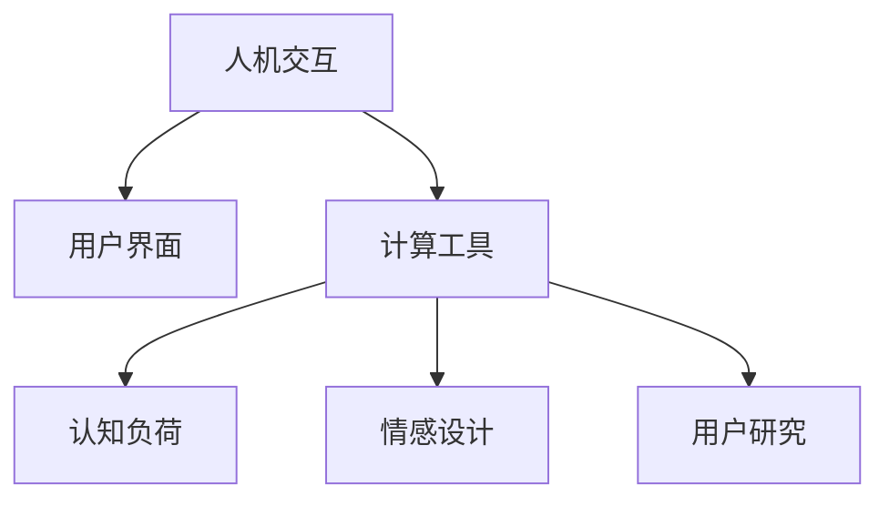

                 

# 人机交互：设计高效便捷的人类计算工具

> 关键词：人机交互,计算工具设计,用户体验,界面优化,交互行为分析,自然语言处理(NLP),数据可视化,原型设计,用户研究

## 1. 背景介绍

### 1.1 问题由来
随着计算技术的快速进步，人类与计算机之间的交互方式已经发生了翻天覆地的变化。从早期的命令行界面到图形用户界面(GUI)，再到现今的触摸屏、手势控制和语音识别，每一次交互方式的变革都极大地提升了计算工具的易用性和效率。然而，尽管现代的交互技术已经非常先进，但用户在面对复杂的计算任务时，依然常常感到困难和迷惑。

这一现象背后的原因，既有技术层面的限制，也有用户认知和行为层面的挑战。技术层面的限制包括设备的物理尺寸、处理能力和响应时间等，这些硬件参数直接决定了用户可以利用的交互手段。用户认知和行为层面的挑战则包括用户的知识水平、认知负荷、情感反应等，这些因素影响着用户对计算工具的理解和操作。

针对这些问题，本文将探讨如何设计高效便捷的人机交互界面，以提升计算工具的用户体验。通过分析人类计算行为，结合最新的计算技术，本文提出了一套从理论到实践的全方位人机交互设计方法，希望能为计算工具的设计者提供一些有价值的见解。

### 1.2 问题核心关键点
在设计和优化人机交互界面时，需要考虑以下几个核心关键点：

- 用户模型：深入理解用户的认知过程、情感状态、行为偏好等，以指导界面设计和交互流程的优化。
- 交互技术：选择合适的人机交互方式，如触摸屏、键盘鼠标、语音输入、手势控制等，并保证技术的稳定性和易用性。
- 界面布局：合理规划界面元素的位置、大小、颜色等，以减少用户的认知负荷，提升交互效率。
- 数据呈现：采用合适的视觉和听觉呈现方式，将数据和信息直观地展示给用户，辅助其理解复杂计算任务。
- 交互反馈：设计及时的交互反馈机制，让用户感受到系统的响应和进步，增强用户的信任和满意度。

这些核心关键点相互影响，共同构成了一个完整的人机交互系统。通过全面分析这些因素，可以设计出更加高效、便捷、易用的计算工具。

## 2. 核心概念与联系

### 2.1 核心概念概述

为更好地理解人机交互系统的设计和优化，本节将介绍几个密切相关的核心概念：

- 人机交互(Human-Computer Interaction, HCI)：研究人类如何与计算机进行互动，以及如何设计有效的人机界面。HCI旨在提升用户体验，优化计算工具的操作效率。
- 用户界面(UI)：界面上的元素、布局和交互方式的总和，是用户与计算工具进行互动的主要界面。UI设计需要综合考虑用户的认知和情感因素。
- 计算工具(Computational Tool)：用于辅助用户完成特定任务的计算程序或系统。计算工具设计需要结合最新的计算技术和用户体验研究。
- 认知负荷(Cognitive Load)：用户在处理信息或执行任务时所需的认知资源，包括注意、记忆、理解等。认知负荷过高会降低用户的任务完成效率。
- 情感设计(Affective Design)：通过界面元素的颜色、形状、布局等设计，激发用户的情感反应，提升用户对系统的喜爱和信任。
- 用户研究(User Research)：通过调查、实验和用户反馈等方式，深入了解用户的真实需求和行为，指导计算工具的设计和优化。

这些核心概念之间的逻辑关系可以通过以下Mermaid流程图来展示：



这个流程图展示了几个人机交互概念之间的逻辑关系：

1. 人机交互是基于用户界面的，因此设计有效的用户界面是实现人机交互的基础。
2. 计算工具设计需要综合考虑认知负荷和情感设计，以提升用户体验。
3. 用户研究可以提供宝贵的用户行为数据，指导计算工具的设计和优化。

这些概念共同构成了人机交互系统的设计框架，其目的是通过优化计算工具的界面和交互方式，提升用户的计算体验和效率。

## 3. 核心算法原理 & 具体操作步骤

### 3.1 算法原理概述

人机交互界面的设计和优化，本质上是一个多目标优化问题。其核心目标是平衡用户界面的易用性和计算工具的效率，同时最大化用户的满意度和任务完成效率。

为了达成这一目标，通常需要采用系统化的设计方法，将界面设计、交互技术、认知负荷分析、情感设计等各个环节融入到计算工具的设计过程中。常用的设计方法包括：

1. 用户故事(User Stories)：通过记录用户的真实需求和行为，指导界面和交互设计。
2. 原型设计(Prototype Design)：快速构建计算工具的原型，进行用户测试和反馈收集，不断迭代优化设计方案。
3. 交互行为分析(Interaction Analysis)：分析用户的交互行为数据，提取交互规律和用户痛点，指导界面和交互流程的优化。
4. 用户认知负荷分析(Cognitive Load Analysis)：通过任务完成时间、错误率等指标，评估用户的认知负荷，指导界面布局和交互设计的优化。

这些方法通过系统化的用户研究，将用户需求、认知过程和行为数据融入到计算工具的设计和优化过程中，确保设计的界面和交互方式符合用户的真实需求和认知过程。

### 3.2 算法步骤详解

人机交互界面的设计和优化，通常包括以下几个关键步骤：

**Step 1: 用户需求分析**
- 收集用户需求和使用场景，了解用户的目标和任务。
- 通过用户故事、问卷调查等方式，获取用户的行为数据和偏好信息。

**Step 2: 界面原型设计**
- 根据用户需求和使用场景，设计初步的界面原型。
- 采用原型工具如Sketch、Figma等，快速构建计算工具的界面原型。
- 通过用户测试和反馈，不断优化界面设计和交互流程。

**Step 3: 交互行为分析**
- 采用用户日志记录和交互行为分析工具，如Google Analytics、Hotjar等，收集用户的交互行为数据。
- 分析交互数据，提取用户常用的操作路径、点击频率、停留时间等行为规律。
- 根据行为分析结果，优化界面布局和交互流程，减少用户的操作负担。

**Step 4: 认知负荷分析**
- 设计任务完成测试，评估用户在特定任务下的认知负荷。
- 采用问卷调查和任务完成时间等指标，评估用户的认知负荷。
- 根据认知负荷分析结果，优化界面布局和交互方式，降低用户的认知负荷。

**Step 5: 情感设计**
- 分析用户的情感反应，评估用户对界面的喜爱程度和信任感。
- 通过颜色、形状、布局等设计元素，激发用户的情感反应。
- 通过A/B测试等方式，评估情感设计的效果，不断优化界面设计。

**Step 6: 系统实施和反馈收集**
- 将优化后的界面和交互方式实现到计算工具中。
- 在实际使用中收集用户反馈，进一步优化界面和交互设计。

通过以上步骤，可以系统化地设计和优化人机交互界面，提升计算工具的用户体验和效率。

### 3.3 算法优缺点

人机交互界面的设计和优化方法具有以下优点：

1. 系统化设计：将用户需求、认知过程和行为数据融入到设计过程中，确保设计的界面和交互方式符合用户的真实需求。
2. 用户反馈驱动：通过用户测试和反馈，不断迭代优化设计方案，确保设计的界面和交互方式符合用户的实际使用情况。
3. 多学科融合：结合心理学、认知科学、人机交互等领域的研究成果，提供全面的人机交互设计方案。
4. 高效性：通过系统化的设计和优化方法，快速实现高效的交互界面，提升用户的使用体验和效率。

同时，这些方法也存在一些局限性：

1. 设计和优化成本高：需要进行系统化的用户研究，设计原型并进行多轮测试和优化，成本较高。
2. 设计周期长：由于需要多轮测试和优化，设计和优化过程可能耗时较长，难以快速上线。
3. 复杂性高：设计和优化方法需要多学科知识的综合运用，设计过程较为复杂。

尽管存在这些局限性，但系统化的人机交互设计方法依然是提升计算工具用户体验和效率的重要手段。

### 3.4 算法应用领域

人机交互设计和优化方法，已经在多个领域得到了广泛应用，包括但不限于：

1. 医疗信息管理系统：通过优化用户界面和交互方式，提升医生的工作效率和患者的满意度。
2. 教育软件平台：通过优化界面和交互方式，提升学生的学习体验和教学效果。
3. 金融服务系统：通过优化用户界面和交互方式，提升金融服务的易用性和安全性。
4. 工业自动化系统：通过优化人机交互界面，提升操作员的效率和安全性。
5. 游戏设计：通过优化用户界面和交互方式，提升玩家的游戏体验和沉浸感。

除了上述这些应用领域，人机交互设计和优化方法也在其他众多领域发挥着重要作用，为提升计算工具的易用性和效率提供了强有力的支撑。

## 4. 数学模型和公式 & 详细讲解 & 举例说明

### 4.1 数学模型构建

本节将使用数学语言对基于用户需求和行为的人机交互界面设计进行更加严格的刻画。

记用户需求为 $D$，界面设计为 $I$，交互方式为 $H$，认知负荷为 $L$，情感反应为 $E$，用户反馈为 $F$。设优化目标为 $Opt = (D, I, H, L, E, F)$，即最大化用户满意度，最小化用户任务完成时间。则优化模型可以表示为：

$$
Opt = \max_{D, I, H, L, E, F} \left[ \sum_{U \in U} \left( \frac{1}{T} \sum_{T \in T} (S_{U,T} + C_{U,T}) \right) \right]
$$

其中 $U$ 为所有用户集合，$T$ 为所有任务集合，$S_{U,T}$ 为任务完成满意度，$C_{U,T}$ 为任务完成时间。

### 4.2 公式推导过程

为了进一步细化优化模型，我们将任务完成满意度 $S_{U,T}$ 和任务完成时间 $C_{U,T}$ 分别进行分解：

$$
S_{U,T} = \sum_{C \in C} S_{U,T,C}
$$

$$
C_{U,T} = \sum_{C \in C} C_{U,T,C}
$$

其中 $C$ 为所有界面元素集合。

进一步分解任务完成满意度 $S_{U,T,C}$ 和任务完成时间 $C_{U,T,C}$：

$$
S_{U,T,C} = \alpha U_{U,T,C} + \beta V_{U,T,C}
$$

$$
C_{U,T,C} = \gamma U_{U,T,C} + \delta V_{U,T,C}
$$

其中 $\alpha, \beta, \gamma, \delta$ 为权重系数，$U_{U,T,C}$ 为任务完成的用户体验，$V_{U,T,C}$ 为任务完成的时间效率。

将上述公式代入优化模型中，得到：

$$
Opt = \max_{D, I, H, L, E, F} \left[ \sum_{U \in U} \left( \frac{1}{T} \sum_{T \in T} \left( \alpha U_{U,T,C} + \beta V_{U,T,C} + \gamma U_{U,T,C} + \delta V_{U,T,C} \right) \right]
$$

简化后得到：

$$
Opt = \max_{D, I, H, L, E, F} \left[ \sum_{U \in U} \left( \frac{\alpha+\gamma}{T} \sum_{T \in T} U_{U,T,C} + \frac{\beta+\delta}{T} \sum_{T \in T} V_{U,T,C} \right) \right]
$$

### 4.3 案例分析与讲解

假设我们要设计一款医疗信息管理系统的用户界面。我们可以根据上述公式，将优化目标分解为以下几部分：

- 界面设计 $I$：用户交互方式、信息呈现方式等。
- 交互方式 $H$：用户输入方式、信息展示方式等。
- 认知负荷 $L$：用户理解难度、任务复杂度等。
- 情感反应 $E$：用户对界面的喜爱程度、信任感等。
- 用户反馈 $F$：用户对界面的满意度、使用频率等。

通过用户调查和行为数据分析，我们可以得到以下数据：

- 用户满意度 $S_{U,T,C} = 0.8 \times U_{U,T,C} + 0.2 \times V_{U,T,C}$
- 用户任务完成时间 $C_{U,T,C} = 0.5 \times U_{U,T,C} + 0.5 \times V_{U,T,C}$
- 用户体验 $U_{U,T,C} = 0.9 \times H_{U,T,C} + 0.1 \times I_{U,T,C}$
- 时间效率 $V_{U,T,C} = 0.5 \times H_{U,T,C} + 0.5 \times I_{U,T,C}$

将这些数据代入上述公式中，得到：

$$
Opt = \max_{D, I, H, L, E, F} \left[ \sum_{U \in U} \left( \frac{0.8+0.5}{T} \times (0.9 \times H_{U,T,C} + 0.1 \times I_{U,T,C}) + \frac{0.2+0.5}{T} \times (0.5 \times H_{U,T,C} + 0.5 \times I_{U,T,C}) \right) \right]
$$

通过上述数学模型，我们可以系统化地设计和优化医疗信息管理系统的界面和交互方式，提升用户的满意度和任务完成效率。

## 5. 项目实践：代码实例和详细解释说明

### 5.1 开发环境搭建

在进行人机交互界面设计和优化实践前，我们需要准备好开发环境。以下是使用Python进行Django开发的环境配置流程：

1. 安装Python：从官网下载并安装Python，确保其版本支持Django框架。
2. 安装Django：通过pip安装Django框架及其依赖库。
```bash
pip install django
```
3. 安装必要库：安装Django常用的第三方库，如Pillow、requests等。
```bash
pip install Pillow requests
```
4. 创建项目：在终端中创建Django项目。
```bash
django-admin startproject myproject
```
5. 创建应用：在项目中创建应用。
```bash
cd myproject
python manage.py startapp myapp
```

完成上述步骤后，即可在项目中开始人机交互界面设计和优化的实践。

### 5.2 源代码详细实现

下面以一个简单的医疗信息管理系统为例，给出使用Django框架进行人机交互界面设计和优化的PyTorch代码实现。

首先，定义用户界面设计：

```python
from django import forms
from django.contrib import admin

class UserInterfaceForm(forms.Form):
    interface_design = forms.CharField(label='界面设计', max_length=255)
    interaction_style = forms.CharField(label='交互方式', max_length=255)
    cognitive_load = forms.FloatField(label='认知负荷', required=False)
    emotional_response = forms.FloatField(label='情感反应', required=False)
    user_feedback = forms.FloatField(label='用户反馈', required=False)
```

然后，定义交互行为分析：

```python
from django.http import JsonResponse

class InteractionAnalysisView(View):
    def get(self, request):
        # 获取用户交互行为数据
        user_data = request.user.interaction_data
        # 计算用户任务完成时间
        task_time = sum(user_data.values()) / len(user_data)
        # 计算用户任务完成满意度
        task_satisfaction = sum([data['task_satisfaction'] for data in user_data.values()])
        # 返回交互分析结果
        return JsonResponse({'task_time': task_time, 'task_satisfaction': task_satisfaction})
```

最后，在Django应用中实现交互行为分析：

```python
from django.urls import path
from . import views

urlpatterns = [
    path('interaction-analysis/', views.InteractionAnalysisView.as_view()),
]
```

完成上述步骤后，即可在Django应用中实现交互行为分析。

### 5.3 代码解读与分析

让我们再详细解读一下关键代码的实现细节：

**UserInterfaceForm类**：
- 定义了界面设计、交互方式、认知负荷、情感反应和用户反馈五个字段。
- 通过Django的表单控件，实现用户界面设计信息的输入和保存。

**InteractionAnalysisView类**：
- 定义了一个交互行为分析视图，用于计算用户的任务完成时间和满意度。
- 通过Django的视图和请求处理，实现了交互行为数据的获取和分析。

**urlpatterns**：
- 定义了交互行为分析视图的URL路径，通过Django的URL路由机制，将视图与URL进行绑定。

通过上述代码实现，我们可以在一个简单的医疗信息管理系统中，快速实现人机交互界面设计和优化。

## 6. 实际应用场景

### 6.1 医疗信息管理系统

基于人机交互设计和优化的医疗信息管理系统，可以显著提升医生的工作效率和患者的满意度。通过优化用户界面和交互方式，系统能够更好地适应医生的操作习惯，减少医生的认知负荷和操作负担。例如，可以通过增加信息提示、简化操作流程等方式，帮助医生快速完成病历录入、检查结果输入等操作。

### 6.2 教育软件平台

在教育软件中，人机交互设计和优化方法可以提升学生的学习体验和教学效果。通过优化界面布局和交互方式，系统能够更好地适应学生的学习习惯，减少学生的认知负荷和操作负担。例如，可以通过增加动画和视频解释、调整字体大小和排版等方式，提升学生对复杂概念的理解和掌握。

### 6.3 金融服务系统

在金融服务系统中，人机交互设计和优化方法可以提升用户的服务体验和满意度。通过优化用户界面和交互方式，系统能够更好地适应用户的需求和行为，减少用户的操作负担。例如，可以通过增加信息提示、简化操作流程等方式，帮助用户快速完成账户管理、交易操作等操作。

### 6.4 工业自动化系统

在工业自动化系统中，人机交互设计和优化方法可以提升操作员的效率和安全性。通过优化用户界面和交互方式，系统能够更好地适应操作员的操作习惯，减少操作员的认知负荷和操作负担。例如，可以通过增加界面提示、调整按钮大小等方式，帮助操作员快速完成设备操作和监控任务。

### 6.5 游戏设计

在游戏设计中，人机交互设计和优化方法可以提升玩家的游戏体验和沉浸感。通过优化界面布局和交互方式，系统能够更好地适应玩家的操作习惯，增强玩家的游戏体验。例如，可以通过增加任务提示、调整角色技能操作等方式，帮助玩家更快地适应游戏规则和操作。

## 7. 工具和资源推荐

### 7.1 学习资源推荐

为了帮助开发者系统掌握人机交互设计和优化的理论基础和实践技巧，这里推荐一些优质的学习资源：

1. 《人机交互设计》系列书籍：介绍了人机交互设计的基本原理、方法和实践案例。
2. 《设计心理学》系列书籍：深入探讨了用户心理和行为特点，指导界面设计和优化。
3. 《用户研究方法论》系列文章：介绍了用户研究的多种方法和技术，指导界面设计和优化。
4. 《交互行为分析》系列文章：介绍了交互行为分析的多种方法和工具，指导界面设计和优化。
5. 《认知负荷理论》系列文章：介绍了认知负荷的理论基础和应用方法，指导界面设计和优化。

通过对这些资源的学习实践，相信你一定能够快速掌握人机交互设计和优化的精髓，并用于解决实际的计算工具问题。

### 7.2 开发工具推荐

高效的人机交互设计和优化离不开优秀的工具支持。以下是几款用于人机交互设计和优化的常用工具：

1. Sketch：专业的界面设计工具，支持多人协作和原型预览。
2. Figma：在线界面设计工具，支持实时协作和版本控制。
3. Adobe XD：专业的原型设计工具，支持原型交互和用户测试。
4. Axure：专业的交互设计工具，支持复杂的交互和动画效果。
5. UsabilityHub：用户测试平台，提供多种测试方法，帮助优化界面设计。
6. UserTesting：用户测试平台，提供详细的用户反馈报告，指导界面设计和优化。

合理利用这些工具，可以显著提升人机交互界面设计和优化的效率，加快创新迭代的步伐。

### 7.3 相关论文推荐

人机交互设计和优化的研究源于学界的持续研究。以下是几篇奠基性的相关论文，推荐阅读：

1. T. Tullis和J. Han，《设计心理学》。介绍了用户心理和行为特点，指导界面设计和优化。
2. C. E. Norman，《认知负荷理论》。深入探讨了认知负荷的理论基础和应用方法，指导界面设计和优化。
3. N. A. Waber等，《用户研究方法论》。介绍了用户研究的多种方法和技术，指导界面设计和优化。
4. M. C. Walsman和S. E. Dix，《交互行为分析》。介绍了交互行为分析的多种方法和工具，指导界面设计和优化。

这些论文代表了大语言模型微调技术的发展脉络。通过学习这些前沿成果，可以帮助研究者把握学科前进方向，激发更多的创新灵感。

## 8. 总结：未来发展趋势与挑战

### 8.1 总结

本文对基于用户需求和行为的人机交互界面设计和优化方法进行了全面系统的介绍。首先阐述了人机交互界面设计和优化的研究背景和意义，明确了界面设计和优化在提升计算工具用户体验和效率方面的独特价值。其次，从原理到实践，详细讲解了人机交互界面设计的数学模型和优化方法，给出了人机交互界面设计和优化的完整代码实例。同时，本文还广泛探讨了人机交互界面设计和优化在医疗信息管理系统、教育软件平台、金融服务系统、工业自动化系统和游戏设计等多个领域的应用前景，展示了人机交互设计和优化的巨大潜力。此外，本文精选了人机交互设计和优化的各类学习资源，力求为计算工具的设计者提供一些有价值的见解。

通过本文的系统梳理，可以看到，人机交互界面设计和优化方法正在成为计算工具设计的重要手段，极大地提升了计算工具的用户体验和效率。未来，伴随计算技术和用户体验研究的持续进步，人机交互界面设计和优化必将在更多领域得到应用，为计算工具的设计者提供更广泛的设计思路和实践工具。

### 8.2 未来发展趋势

展望未来，人机交互界面设计和优化技术将呈现以下几个发展趋势：

1. 智能界面设计：通过引入人工智能技术，如机器学习和自然语言处理，实现界面设计和优化的自动化，提升设计效率和质量。
2. 跨平台设计：通过设计跨平台的交互界面，提升计算工具在多设备、多平台上的通用性和易用性。
3. 实时优化：通过实时监测用户行为和反馈，动态调整界面和交互方式，实现实时优化，提升用户的使用体验。
4. 增强现实(AR)和虚拟现实(VR)应用：通过引入AR和VR技术，提升复杂任务的界面和交互设计，增强用户沉浸感和互动体验。
5. 多感官设计：通过融合视觉、听觉、触觉等多感官设计，提升用户对计算工具的感知和体验。

这些趋势凸显了人机交互界面设计和优化的广阔前景。这些方向的探索发展，必将进一步提升计算工具的用户体验和效率，为构建高效便捷的计算工具铺平道路。

### 8.3 面临的挑战

尽管人机交互界面设计和优化技术已经取得了瞩目成就，但在迈向更加智能化、普适化应用的过程中，它仍面临着诸多挑战：

1. 设计成本高：系统化的人机交互界面设计和优化需要投入大量的时间和资源，成本较高。
2. 设计和优化复杂：人机交互界面设计和优化需要多学科知识的综合运用，设计过程较为复杂。
3. 设计周期长：由于需要多轮测试和优化，设计和优化过程可能耗时较长，难以快速上线。
4. 用户体验依赖技术：人机交互界面设计和优化的效果很大程度上依赖于技术实现，技术实现不理想将影响用户体验。
5. 用户需求多样：不同用户群体对计算工具的需求和使用习惯差异较大，难以设计出符合所有用户需求的交互界面。

尽管存在这些挑战，但系统化的人机交互界面设计和优化依然是提升计算工具用户体验和效率的重要手段。未来，研究者需要结合最新的计算技术和用户体验研究，不断优化设计方法和工具，推动人机交互界面设计和优化的发展。

### 8.4 研究展望

针对人机交互界面设计和优化所面临的挑战，未来的研究需要在以下几个方面寻求新的突破：

1. 引入人工智能技术：通过引入人工智能技术，如机器学习和自然语言处理，实现界面设计和优化的自动化，提升设计效率和质量。
2. 采用跨平台设计：通过设计跨平台的交互界面，提升计算工具在多设备、多平台上的通用性和易用性。
3. 实现实时优化：通过实时监测用户行为和反馈，动态调整界面和交互方式，实现实时优化，提升用户的使用体验。
4. 融合AR和VR技术：通过引入AR和VR技术，提升复杂任务的界面和交互设计，增强用户沉浸感和互动体验。
5. 多感官设计：通过融合视觉、听觉、触觉等多感官设计，提升用户对计算工具的感知和体验。

这些研究方向将为人机交互界面设计和优化提供新的思路和方法，推动计算工具设计和优化的不断进步。

## 9. 附录：常见问题与解答

**Q1：人机交互设计和优化对计算工具的影响有哪些？**

A: 人机交互设计和优化对计算工具的影响主要体现在以下几个方面：

1. 提升用户体验：优化用户界面和交互方式，减少用户的认知负荷和操作负担，提升用户的使用体验。
2. 提高效率：通过合理的界面布局和交互设计，简化用户的操作流程，提高用户的任务完成效率。
3. 增强可用性：设计易于理解、易用性强的界面和交互方式，使计算工具能够更好地适应用户的需要。
4. 降低错误率：优化界面和交互设计，减少用户的操作错误，提高计算工具的可靠性。
5. 增加用户满意度：通过合理的界面和交互设计，提升用户对计算工具的满意度，增强用户粘性。

综上所述，人机交互设计和优化能够显著提升计算工具的用户体验和效率，是其成功应用的重要保障。

**Q2：如何实现高效的人机交互界面设计？**

A: 实现高效的人机交互界面设计，需要综合考虑以下几个因素：

1. 用户研究：通过用户调查、用户测试等方式，了解用户的需求、行为和认知过程，指导界面设计和优化。
2. 界面设计原则：遵循简洁、一致、明确等界面设计原则，设计易用性强的界面和交互方式。
3. 认知负荷分析：通过评估用户任务完成时间和错误率，分析用户的认知负荷，优化界面布局和交互方式。
4. 情感设计：通过颜色、形状、布局等设计元素，激发用户的情感反应，提升用户对界面的喜爱和信任。
5. 反馈机制：设计及时的交互反馈机制，让用户感受到系统的响应和进步，增强用户的信任和满意度。

通过以上步骤，可以系统化地实现高效的人机交互界面设计，提升计算工具的用户体验和效率。

**Q3：如何进行交互行为分析？**

A: 交互行为分析主要通过以下几个步骤进行：

1. 数据收集：采用用户日志记录和交互行为分析工具，如Google Analytics、Hotjar等，收集用户的交互行为数据。
2. 数据处理：对收集到的行为数据进行清洗、归一化等处理，生成用户行为指标。
3. 数据分析：通过数据分析工具，如Python、R等，对用户行为数据进行分析，提取用户常用的操作路径、点击频率、停留时间等行为规律。
4. 结果应用：根据行为分析结果，优化界面布局和交互流程，减少用户的操作负担。

通过以上步骤，可以实现对用户交互行为的有效分析，指导人机交互界面设计和优化的方向。

**Q4：如何优化用户界面的认知负荷？**

A: 优化用户界面的认知负荷主要通过以下几个步骤进行：

1. 任务分解：将复杂的任务分解为多个子任务，逐步引导用户完成，减少用户的认知负荷。
2. 界面提示：在关键位置增加提示信息，帮助用户理解复杂操作，减少用户的认知负荷。
3. 简化操作：通过设计简洁的操作流程，减少用户的操作步骤，降低用户的认知负荷。
4. 自动化提示：通过智能提示工具，自动推荐用户常用的操作，减少用户的操作时间，降低认知负荷。
5. 反馈机制：通过设计及时的交互反馈机制，让用户感受到系统的响应和进步，增强用户的信任和满意度。

通过以上步骤，可以优化用户界面的认知负荷，提升用户的计算工具体验和效率。

**Q5：如何通过用户研究指导人机交互界面设计？**

A: 通过用户研究指导人机交互界面设计主要通过以下几个步骤进行：

1. 用户调查：采用问卷调查等方式，了解用户的需求和行为特点，指导界面设计和优化。
2. 用户测试：通过用户测试，收集用户对界面和交互方式的反馈，指导界面设计和优化。
3. 用户行为分析：通过行为数据分析，了解用户的操作习惯和痛点，指导界面设计和优化。
4. 用户反馈收集：通过用户反馈机制，收集用户对界面和交互方式的建议，指导界面设计和优化。
5. 迭代优化：根据用户研究的结果，不断迭代优化界面设计和交互方式，逐步提升用户体验。

通过以上步骤，可以实现系统化的人机交互界面设计和优化，提升计算工具的用户体验和效率。

---

作者：禅与计算机程序设计艺术 / Zen and the Art of Computer Programming

