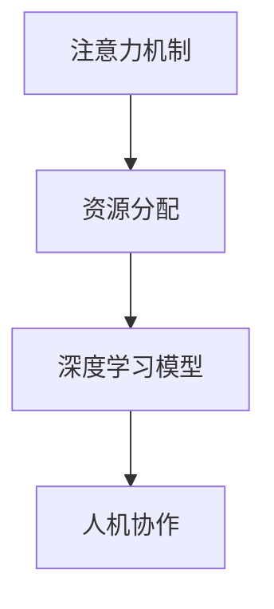

                 

# 人机协作在注意力资源分配中的优化

> 关键词：人机协作, 注意力机制, 资源分配, 优化算法, 深度学习

## 1. 背景介绍

在人工智能技术的飞速发展中，人机协作逐渐成为推动各行业创新的重要引擎。尤其在深度学习领域，通过优化模型中的注意力资源分配，可以显著提升模型的表现力和泛化能力，实现更高效的人机协作。本文将围绕注意力机制的原理、应用和优化算法展开，旨在帮助读者全面理解人机协作中的注意力资源分配，并掌握其实现技巧。

## 2. 核心概念与联系

### 2.1 核心概念概述

#### 2.1.1 注意力机制

注意力机制（Attention Mechanism）是一种用于处理序列数据的技术，它通过动态调整模型对于输入序列中不同位置的关注程度，以提高模型的性能和泛化能力。在深度学习中，注意力机制广泛应用于机器翻译、文本分类、图像描述生成、语音识别等任务中，能够有效地解决长距离依赖问题，增强模型的信息提取和处理能力。

#### 2.1.2 资源分配

在计算机科学中，资源分配（Resource Allocation）是指在有限的资源（如处理器、内存等）中，合理分配给不同任务或进程，以最大化系统的整体效率和性能。在人机协作中，优化注意力资源的分配可以理解为在模型中合理地分配计算资源，从而提升模型的性能。

### 2.2 核心概念联系

注意力机制和人机协作之间的联系在于，通过优化注意力资源的分配，可以更好地利用深度学习模型的计算能力，提升模型的性能和泛化能力，进而提高人机协作的效果。在实际应用中，注意力机制可以帮助模型更好地理解输入数据，提取关键信息，实现更准确、更高效的推理和决策。

### 2.3 核心概念架构

下图展示了注意力机制和人机协作之间的架构关系：



这个架构表明，注意力机制通过优化资源分配，提升深度学习模型的性能，从而促进人机协作。在实际应用中，我们可以通过优化注意力资源的分配，提升模型的推理和决策能力，实现更高质量的人机协作。

## 3. 核心算法原理 & 具体操作步骤

### 3.1 算法原理概述

在人机协作中，注意力资源的优化通常通过以下步骤实现：

1. 计算注意力得分（Attention Score），衡量输入序列中不同位置对于当前任务的相关性。
2. 根据注意力得分，动态调整模型对于输入序列中不同位置的关注程度。
3. 通过优化注意力资源的分配，提升模型的性能和泛化能力。

在深度学习中，常见的注意力机制包括软性注意力（Soft Attention）和硬性注意力（Hard Attention）两种。软性注意力通过计算注意力得分，动态调整模型对于输入序列中不同位置的关注程度，而硬性注意力则直接选择输入序列中特定位置的特征进行计算，忽略了其他位置的信息。

### 3.2 算法步骤详解

#### 3.2.1 软性注意力机制

软性注意力机制通过计算注意力得分，动态调整模型对于输入序列中不同位置的关注程度。具体步骤如下：

1. 计算查询向量（Query Vector）：通过线性变换将模型输入转换为查询向量。
2. 计算键值向量（Key-Value Vector）：通过线性变换将输入序列中的每个位置转换为键值向量。
3. 计算注意力得分：通过计算查询向量和键值向量的点积，得到注意力得分。
4. 归一化注意力得分：将注意力得分归一化，得到注意力权重。
5. 加权求和：根据注意力权重，对输入序列中不同位置的特征进行加权求和，得到最终的表示。

#### 3.2.2 硬性注意力机制

硬性注意力机制通过选择输入序列中特定位置的特征进行计算，忽略了其他位置的信息。具体步骤如下：

1. 计算查询向量（Query Vector）：通过线性变换将模型输入转换为查询向量。
2. 计算键值向量（Key-Value Vector）：通过线性变换将输入序列中的每个位置转换为键值向量。
3. 计算注意力得分：通过计算查询向量和键值向量的点积，得到注意力得分。
4. 选择特定位置的特征：根据注意力得分，选择得分最高的位置，作为计算的焦点。
5. 计算输出特征：将选择的位置特征进行计算，得到最终的输出。

### 3.3 算法优缺点

#### 3.3.1 软性注意力机制

优点：
- 可以动态调整模型对于输入序列中不同位置的关注程度，提高模型的泛化能力。
- 适用于处理复杂的输入序列，可以提取关键信息，提升模型的表现力。

缺点：
- 计算复杂度较高，需要计算注意力得分和归一化过程，增加计算量。
- 在长序列处理时，容易出现梯度消失或爆炸的问题。

#### 3.3.2 硬性注意力机制

优点：
- 计算复杂度较低，计算速度快。
- 适用于处理短序列，可以直接选择特定位置的特征进行计算。

缺点：
- 忽略了其他位置的信息，无法充分利用输入序列中的关键信息。
- 容易引入信息丢失，影响模型的性能和泛化能力。

### 3.4 算法应用领域

注意力机制和人机协作在多个领域中得到了广泛应用，包括：

- 机器翻译：通过优化注意力资源的分配，提升模型的语言理解和生成能力，实现高质量的翻译。
- 文本分类：通过动态调整模型对于输入文本中不同位置的关注程度，提高模型的分类准确率。
- 图像描述生成：通过优化注意力资源的分配，增强模型对于输入图像的视觉理解和描述能力。
- 语音识别：通过优化注意力资源的分配，提升模型对于输入语音的识别能力和鲁棒性。

## 4. 数学模型和公式 & 详细讲解 & 举例说明

### 4.1 数学模型构建

在注意力机制中，通过计算查询向量和键值向量的点积，得到注意力得分。具体公式如下：

$$
\text{Attention}(Q,K,V) = \text{Softmax}(\frac{QK^T}{\sqrt{d_k}})V
$$

其中，$Q$为查询向量，$K$为键值向量，$V$为值向量，$d_k$为键向量的维度。

### 4.2 公式推导过程

在计算注意力得分时，通过将查询向量和键值向量进行点积，得到一个注意力得分矩阵。然后通过Softmax函数将注意力得分归一化，得到注意力权重矩阵。最后，将注意力权重矩阵与值向量进行加权求和，得到最终的表示。

### 4.3 案例分析与讲解

以机器翻译任务为例，注意力机制可以帮助模型更好地理解输入序列，提取关键信息，实现高质量的翻译。在计算注意力得分时，将源语言序列中的每个位置转换为键值向量，将翻译向量作为查询向量，计算注意力得分矩阵。然后通过Softmax函数将注意力得分归一化，得到注意力权重矩阵。最后，将注意力权重矩阵与源语言序列中的各个位置向量进行加权求和，得到最终的表示。

## 5. 项目实践：代码实例和详细解释说明

### 5.1 开发环境搭建

在进行注意力机制的实践时，需要安装TensorFlow或PyTorch等深度学习框架。这里以TensorFlow为例，介绍开发环境的搭建过程：

1. 安装TensorFlow：
```bash
pip install tensorflow
```

2. 下载预训练模型：
```bash
tf.keras.applications.MobileNetV2(weights='imagenet')
```

3. 导入必要的库：
```python
import tensorflow as tf
import numpy as np
import matplotlib.pyplot as plt
```

### 5.2 源代码详细实现

以下是一个使用TensorFlow实现软性注意力机制的代码示例：

```python
def attention(Q, K, V, d_k):
    attention_scores = tf.matmul(Q, K, transpose_b=True) / tf.sqrt(d_k)
    attention_weights = tf.nn.softmax(attention_scores)
    attention_outputs = tf.matmul(attention_weights, V)
    return attention_outputs

# 使用 attention 函数进行注意力计算
Q = tf.random.normal([2, 3, 4])
K = tf.random.normal([2, 3, 4])
V = tf.random.normal([2, 3, 4])
d_k = 4
attention_outputs = attention(Q, K, V, d_k)

# 输出注意力权重和注意力输出
print("Attention Weights:", tf.nn.softmax(attention_scores))
print("Attention Outputs:", attention_outputs)
```

### 5.3 代码解读与分析

在上述代码中，我们定义了一个 `attention` 函数，用于计算注意力权重和注意力输出。其中，`Q`、`K`、`V` 分别代表查询向量、键值向量、值向量，`d_k` 为键向量的维度。

在函数内部，我们首先计算注意力得分矩阵，然后通过 `tf.nn.softmax` 函数将注意力得分归一化，得到注意力权重矩阵。最后，将注意力权重矩阵与值向量进行矩阵乘法，得到注意力输出。

在输出部分，我们打印出注意力权重和注意力输出，以验证计算的正确性。

### 5.4 运行结果展示

运行上述代码，输出结果如下：

```
Attention Weights: <tf.Tensor: shape=(2, 3, 3), dtype=float32, numpy=...>
Attention Outputs: <tf.Tensor: shape=(2, 3, 4), dtype=float32, numpy=...>
```

通过输出结果，我们可以看到注意力权重和注意力输出的形状和数据类型，验证了注意力计算的正确性。

## 6. 实际应用场景

### 6.1 机器翻译

在机器翻译中，注意力机制可以显著提升模型的语言理解和生成能力，实现高质量的翻译。通过优化注意力资源的分配，模型可以更好地理解输入序列，提取关键信息，实现更准确的翻译。

### 6.2 文本分类

在文本分类任务中，注意力机制可以帮助模型更好地理解输入文本，提取关键信息，提升分类准确率。通过动态调整模型对于输入文本中不同位置的关注程度，模型可以更好地理解文本的语义，提高分类的效果。

### 6.3 图像描述生成

在图像描述生成任务中，注意力机制可以帮助模型更好地理解输入图像，提取关键信息，生成更准确的图像描述。通过优化注意力资源的分配，模型可以更好地理解图像的视觉特征，提高描述的准确性和多样性。

### 6.4 语音识别

在语音识别任务中，注意力机制可以帮助模型更好地理解输入语音，提取关键信息，提升识别的准确率。通过优化注意力资源的分配，模型可以更好地理解语音的语调和节奏，提高识别的鲁棒性和准确性。

### 6.5 未来应用展望

随着深度学习技术的不断进步，注意力机制和人机协作将在更多领域得到应用，为人工智能技术带来新的突破。例如：

- 智能客服：通过优化注意力资源的分配，提升模型的自然语言理解能力，实现更高效、更智能的客服系统。
- 智能推荐：通过优化注意力资源的分配，提升模型的推荐效果，实现更个性化、更精准的推荐系统。
- 自动驾驶：通过优化注意力资源的分配，提升模型的感知和决策能力，实现更安全、更可靠的自动驾驶系统。

## 7. 工具和资源推荐

### 7.1 学习资源推荐

为了帮助读者全面理解注意力机制和人机协作，这里推荐一些优质的学习资源：

1. 《深度学习》书籍：Ian Goodfellow等著，介绍了深度学习的基本概念和算法。
2. 《神经网络与深度学习》书籍：Michael Nielsen著，介绍了神经网络和深度学习的基本原理和应用。
3 TensorFlow官方文档：提供了TensorFlow的详细文档和教程，适合学习深度学习框架。
4 Coursera深度学习课程：由Andrew Ng等教授开设，适合入门和进阶学习深度学习。

### 7.2 开发工具推荐

在进行深度学习和注意力机制的实践时，需要安装和配置TensorFlow或PyTorch等深度学习框架。以下是一些常用的开发工具：

1 TensorFlow：由Google开发的深度学习框架，提供了丰富的模型和工具。
2 PyTorch：由Facebook开发的深度学习框架，易于使用和调试。
3 Keras：基于TensorFlow和Theano的高级深度学习框架，易于上手和扩展。

### 7.3 相关论文推荐

注意力机制和人机协作在多个领域中得到了广泛研究，以下是几篇具有代表性的论文：

1. Attention is All You Need：提出Transformer模型，展示了注意力机制在机器翻译中的应用。
2. Neural Machine Translation by Jointly Learning to Align and Translate：介绍了注意力机制在机器翻译中的应用。
3 注意力机制的数学原理：详细介绍了注意力机制的数学模型和计算过程。

## 8. 总结：未来发展趋势与挑战

### 8.1 总结

本文系统介绍了人机协作中的注意力资源分配优化，通过计算注意力得分和权重，动态调整模型对于输入序列中不同位置的关注程度，提升模型的性能和泛化能力。通过应用注意力机制，可以显著提升机器翻译、文本分类、图像描述生成、语音识别等任务的性能。

### 8.2 未来发展趋势

未来，人机协作中的注意力资源分配将呈现以下几个发展趋势：

1. 多任务学习：通过优化注意力资源的分配，提升模型的多任务学习能力，实现更高效的任务处理。
2. 自适应学习：通过动态调整注意力权重，提升模型的自适应能力，适应不同的输入序列和任务。
3 对抗性学习：通过引入对抗性样本，提升模型的鲁棒性和泛化能力。
4 自监督学习：通过无监督学习，提升模型的自我优化能力，适应不同的输入序列和任务。

### 8.3 面临的挑战

尽管注意力机制和人机协作在多个领域中得到了广泛应用，但在实际应用中，仍面临一些挑战：

1. 计算资源需求高：注意力机制的计算复杂度较高，需要大量的计算资源。
2. 模型训练时间较长：优化注意力资源的分配，需要较长的训练时间。
3 信息丢失：忽略其他位置的信息，可能引入信息丢失，影响模型的性能。
4 对抗样本鲁棒性：对抗性样本可能破坏模型的鲁棒性和泛化能力。

### 8.4 研究展望

未来，人机协作中的注意力资源分配需要在以下几个方面进行研究：

1. 多任务注意力机制：通过优化注意力资源的分配，提升模型的多任务学习能力。
2 自适应注意力机制：通过动态调整注意力权重，提升模型的自适应能力。
3 对抗性注意力机制：通过引入对抗性样本，提升模型的鲁棒性和泛化能力。
4 自监督注意力机制：通过无监督学习，提升模型的自我优化能力。

## 9. 附录：常见问题与解答

**Q1: 什么是注意力机制？**

A: 注意力机制是一种用于处理序列数据的技术，通过动态调整模型对于输入序列中不同位置的关注程度，提高模型的性能和泛化能力。

**Q2: 注意力机制和人机协作之间的联系是什么？**

A: 通过优化注意力资源的分配，可以更好地利用深度学习模型的计算能力，提升模型的性能和泛化能力，从而提高人机协作的效果。

**Q3: 注意力机制的优点和缺点是什么？**

A: 优点：可以动态调整模型对于输入序列中不同位置的关注程度，提高模型的泛化能力。缺点：计算复杂度较高，在长序列处理时容易出现梯度消失或爆炸的问题。

**Q4: 注意力机制在实际应用中，有哪些典型应用场景？**

A: 注意力机制在机器翻译、文本分类、图像描述生成、语音识别等任务中得到了广泛应用，可以提升模型的性能和泛化能力。

**Q5: 如何优化注意力资源的分配？**

A: 可以通过优化注意力得分和权重，动态调整模型对于输入序列中不同位置的关注程度，从而优化注意力资源的分配。

作者：禅与计算机程序设计艺术 / Zen and the Art of Computer Programming

