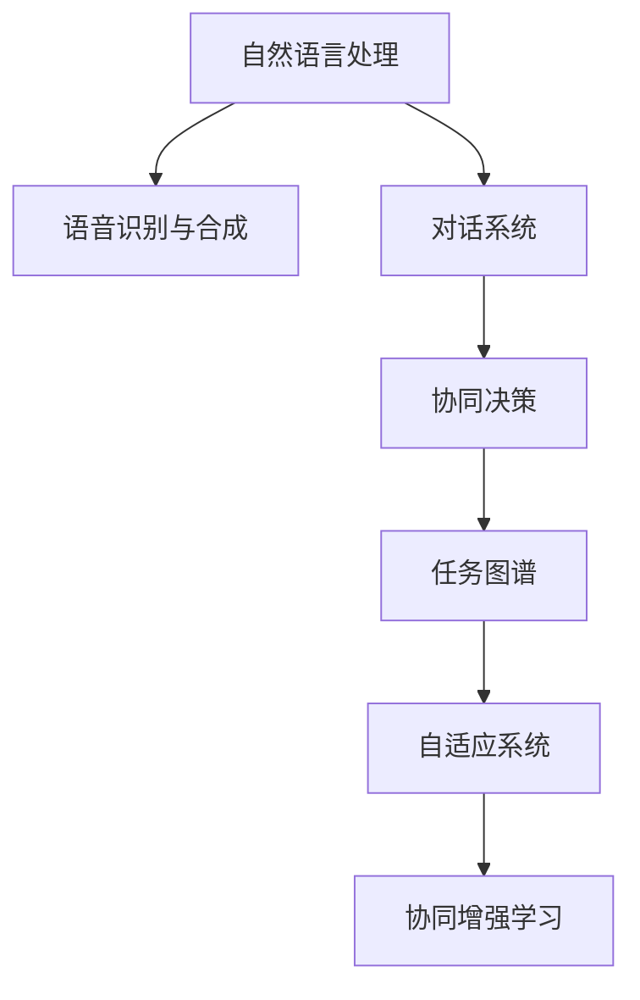

                 

## 1. 背景介绍

### 1.1 问题由来

近年来，随着人工智能技术的飞速发展，人机协作已成为推动社会进步的重要驱动力。无论是智能客服、智能制造，还是智能医疗，人机协作都极大地提升了生产效率和工作质量。然而，尽管AI技术日新月异，但真正高质量的人机协作仍然面临诸多挑战。

当前的人机协作技术主要依赖于手工编写的规则和模型，难以涵盖复杂的真实场景，且规则库和模型库的维护和更新成本较高。此外，自然语言处理(NLP)领域的预训练模型虽然取得了显著进展，但单一模型难以适应多变的用户需求，缺乏灵活性和适应性。

如何构建更加智能、高效、灵活的人机协作系统，以应对未来日益复杂的业务场景，成为当前技术研究的重点。本文将从人机协作的视角出发，探讨构建高质量人机协作系统的方法和策略，推动智能化技术在各行业的广泛应用。

### 1.2 问题核心关键点

本节将重点讨论人机协作的核心关键点，包括：

- 智能交互：如何实现人与机器的智能对话，让机器能够理解和响应自然语言指令，从而实现高效的交互。
- 任务分配：如何将任务智能分配给机器或人工，实现人机协作的最佳组合，提升整体工作效率。
- 协同决策：如何通过人机协作，提高决策质量和速度，尤其是在复杂任务中，机器如何辅助人进行决策。
- 系统优化：如何通过算法优化，实现人机协作系统的智能优化，不断提升系统性能。

## 2. 核心概念与联系

### 2.1 核心概念概述

为了更好地理解人机协作的核心技术，本节将介绍几个密切相关的核心概念：

- 自然语言处理(NLP)：涉及计算机如何理解和生成人类语言的技术，包括语音识别、文本分类、信息抽取、机器翻译、问答系统等。
- 语音识别与合成：通过语音识别将语音信号转化为文本，通过语音合成将文本转化为语音，实现人机自然语言交互。
- 对话系统：用于模拟人类对话的AI系统，包括规则型对话系统、统计型对话系统和深度学习型对话系统。
- 协同决策：涉及人机协作系统中的多智能体决策过程，包括任务分配、协同计算、决策融合等。
- 任务图谱：用于描述任务流程和依赖关系的有向无环图(DAG)，是构建复杂人机协作系统的重要基础。
- 自适应系统：能够根据环境变化动态调整策略，提升系统适应性的智能系统。
- 协同增强学习：通过与人类协同互动，不断学习和优化模型的一种强化学习算法。

这些核心概念之间的逻辑关系可以通过以下Mermaid流程图来展示：



这个流程图展示了核心概念之间的关联关系：自然语言处理将语音信号转换为文本，对话系统实现人机交互，协同决策和任务图谱指导任务分配，自适应系统提高系统灵活性，协同增强学习不断优化协同决策。

## 3. 核心算法原理 & 具体操作步骤

### 3.1 算法原理概述

人机协作的核心算法原理主要基于自然语言处理和增强学习技术。其核心思想是：利用自然语言处理技术，将用户输入的自然语言转化为可理解的模型输入，通过增强学习算法，实现任务智能分配、协同决策和系统优化，最终提升人机协作系统的整体性能。

形式化地，假设人机协作系统由自然语言处理引擎和增强学习模块组成。在每个时间步t，系统接收用户输入的自然语言指令 $x_t$，通过自然语言处理引擎将其转化为模型输入 $a_t$，然后由增强学习模块根据当前状态 $s_t$ 和动作 $a_t$，输出决策 $u_t$，进而执行相应的任务。

该过程可以表示为：

$$
s_{t+1} = f(s_t, a_t, x_t)
$$

$$
u_t = \pi(a_t, s_t)
$$

其中，$f$ 表示状态转移函数，$\pi$ 表示增强学习模块。通过不断的迭代和优化，系统能够自适应地调整策略，实现高效的人机协作。

### 3.2 算法步骤详解

人机协作的核心算法步骤包括：

**Step 1: 自然语言处理**

自然语言处理引擎是实现人机交互的关键。其核心任务包括：

- 语音识别：将用户的语音输入转化为文本。
- 文本分类：将文本分类为不同任务类型。
- 信息抽取：从文本中抽取关键信息，如实体、关系等。
- 问答系统：根据用户提出的问题，生成回答。

**Step 2: 任务智能分配**

根据用户输入的自然语言指令，将任务智能分配给机器或人工。常用的方法包括：

- 规则型任务分配：根据预设规则自动分配任务。
- 统计型任务分配：根据历史数据和当前状态，动态分配任务。
- 深度学习型任务分配：通过神经网络模型自动学习任务分配策略。

**Step 3: 协同决策**

协同决策是人机协作的核心环节，其目的是通过多智能体的协同互动，提升决策质量和速度。常用的方法包括：

- 基于规则的协同决策：通过预定义的规则库进行决策。
- 基于博弈论的协同决策：通过博弈论模型进行决策。
- 基于深度学习的协同决策：通过神经网络模型进行决策。

**Step 4: 系统优化**

系统优化是人机协作的重要保障，其目的是提升系统的整体性能。常用的方法包括：

- 强化学习：通过增强学习算法优化任务分配和协同决策策略。
- 自适应系统：通过自适应算法动态调整系统参数。
- 数据驱动优化：通过数据分析和优化算法，提升系统性能。

通过这些步骤，人机协作系统能够实现高效、智能的交互和决策，从而提升整体性能和工作效率。

### 3.3 算法优缺点

人机协作的核心算法具有以下优点：

- 自然语言处理能力强：通过自然语言处理技术，系统能够理解和响应自然语言指令，实现高效交互。
- 任务分配灵活：通过智能任务分配策略，系统能够动态调整任务分配，提高整体工作效率。
- 协同决策高效：通过协同决策机制，系统能够在复杂任务中快速做出决策，提升决策质量和速度。
- 系统优化可靠：通过系统优化算法，系统能够自适应地调整策略，保持高效稳定运行。

然而，该算法也存在以下缺点：

- 数据需求高：自然语言处理和协同决策需要大量的数据支持，数据获取和标注成本较高。
- 计算复杂度高：深度学习模型的训练和推理计算量较大，对硬件资源需求较高。
- 系统复杂度高：人机协作系统涉及多个模块和算法，设计和实现复杂度较高。
- 应用场景限制：当前技术主要适用于特定任务和领域，难以应对复杂多变的业务场景。

尽管存在这些缺点，但人机协作的核心算法仍然具有巨大的应用潜力，随着技术的发展和完善，必将在更多领域实现广泛应用。

### 3.4 算法应用领域

人机协作的核心算法已经在多个领域得到了广泛应用，例如：

- 智能客服：通过对话系统和自然语言处理技术，实现自动回答客户咨询。
- 智能制造：通过任务图谱和协同决策算法，优化生产流程和资源分配。
- 智能医疗：通过自然语言处理和协同决策算法，辅助医生进行诊断和治疗。
- 智能交通：通过任务图谱和协同决策算法，优化交通信号和路网管理。
- 智能金融：通过自然语言处理和协同决策算法，提供智能投顾和风险控制服务。

除了上述这些经典应用外，人机协作的核心算法还被创新性地应用到更多场景中，如智能物流、智能家居、智能安防等，为各行各业带来了显著的效率提升和成本降低。随着技术的进步，预计未来人机协作的应用场景将会更加广泛，实现更多创新和突破。

## 4. 数学模型和公式 & 详细讲解 & 举例说明

### 4.1 数学模型构建

本节将使用数学语言对人机协作的核心算法进行更加严格的刻画。

假设人机协作系统由自然语言处理引擎和增强学习模块组成。在每个时间步t，系统接收用户输入的自然语言指令 $x_t$，通过自然语言处理引擎将其转化为模型输入 $a_t$，然后由增强学习模块根据当前状态 $s_t$ 和动作 $a_t$，输出决策 $u_t$，进而执行相应的任务。

定义系统状态 $s_t$ 为 $(s_t, a_t)$，即当前时间步的状态和动作。定义系统动作 $u_t$ 为任务分配策略。定义自然语言处理引擎的输出 $a_t$ 为模型输入，包括文本、语音、图像等多种类型。定义增强学习模块的输出 $u_t$ 为任务分配策略，包括机器分配、人工分配、自动分配等多种形式。

在每个时间步t，系统接收自然语言指令 $x_t$，通过自然语言处理引擎转化为模型输入 $a_t$，然后由增强学习模块输出任务分配策略 $u_t$，执行相应的任务。

### 4.2 公式推导过程

以下我们以智能客服系统为例，推导协同决策算法的数学模型。

假设智能客服系统由多个客服机器人和人工客服组成，每个客服单元可以处理不同类型的任务。假设在时间步t，用户输入的自然语言指令为 $x_t$，自然语言处理引擎将其转化为模型输入 $a_t$，系统当前状态为 $s_t=(s_t, a_t)$。

定义系统动作 $u_t$ 为任务分配策略，即 $u_t$ 表示当前任务由哪个客服单元处理。增强学习模块根据状态 $s_t$ 和动作 $u_t$，输出决策 $u_t$，表示将任务分配给哪个客服单元。具体决策过程如下：

$$
u_t = \pi(s_t, a_t)
$$

其中 $\pi$ 表示增强学习模块，可以通过深度学习算法进行训练。在每个时间步t，系统接收自然语言指令 $x_t$，通过自然语言处理引擎转化为模型输入 $a_t$，然后由增强学习模块输出任务分配策略 $u_t$，执行相应的任务。

在训练过程中，增强学习模块通过最大化累积奖励 $\sum_{t=1}^{T} r_t$ 来优化任务分配策略。其中 $r_t$ 表示在第t个时间步的任务完成情况，可以通过自动反馈和人工评估来定义。通过不断的训练和优化，系统能够自适应地调整任务分配策略，实现高效的人机协作。

### 4.3 案例分析与讲解

在智能客服系统中，协同决策算法可以具体细化为以下几个步骤：

1. **任务分类**：根据用户输入的自然语言指令，通过自然语言处理引擎将其转化为模型输入，进行任务分类。例如，用户咨询账单问题，自然语言处理引擎将其转化为“账单查询”模型输入。

2. **任务匹配**：根据当前系统状态和历史数据，匹配合适的客服单元。例如，如果当前只有一个机器人可用，则将任务分配给机器人；如果有多个人工客服可用，则优先分配给人工客服。

3. **任务执行**：根据任务分配策略，执行相应的任务。例如，将“账单查询”任务分配给机器人，机器人通过API查询账单信息，生成回答。

4. **效果评估**：对任务执行结果进行评估，生成反馈信息。例如，如果机器人回答错误，则生成错误反馈，进行任务分配策略的调整。

通过以上步骤，智能客服系统能够高效地处理用户咨询，实现人机协作。协同决策算法通过不断的训练和优化，提升系统的决策质量和速度，从而实现高效的人机协作。

## 5. 项目实践：代码实例和详细解释说明

### 5.1 开发环境搭建

在进行人机协作系统的开发前，我们需要准备好开发环境。以下是使用Python进行OpenAI GPT模型和强化学习模块开发的环境配置流程：

1. 安装Anaconda：从官网下载并安装Anaconda，用于创建独立的Python环境。

2. 创建并激活虚拟环境：
```bash
conda create -n gpt-env python=3.8 
conda activate gpt-env
```

3. 安装PyTorch：根据CUDA版本，从官网获取对应的安装命令。例如：
```bash
conda install pytorch torchvision torchaudio cudatoolkit=11.1 -c pytorch -c conda-forge
```

4. 安装OpenAI GPT模型：
```bash
pip install openai-gpt
```

5. 安装强化学习库：
```bash
pip install gym
```

完成上述步骤后，即可在`gpt-env`环境中开始人机协作系统的开发。

### 5.2 源代码详细实现

下面我以智能客服系统为例，给出使用OpenAI GPT模型和强化学习模块进行人机协作系统微调的PyTorch代码实现。

首先，定义智能客服系统的数据处理函数：

```python
import gym
from gym import spaces
import torch
from openai_gpt import GPT2LMHeadModel, GPT2Tokenizer
from transformers import BertTokenizer
from torch.utils.data import Dataset

class ChatDataset(Dataset):
    def __init__(self, dialogues, tokenizer):
        self.dialogues = dialogues
        self.tokenizer = tokenizer
        
    def __len__(self):
        return len(self.dialogues)
    
    def __getitem__(self, item):
        dialogue = self.dialogues[item]
        texts, labels = [], []
        for i in range(len(dialogue)-1):
            text = dialogue[i]
            label = dialogue[i+1]
            tokenized_text = self.tokenizer(text, return_tensors='pt')
            texts.append(tokenized_text['input_ids'][0])
            labels.append(label2id[label])
        return {'texts': texts, 'labels': labels}

# 标签与id的映射
label2id = {'解答': 0, '错误': 1}

# 创建dataset
tokenizer = BertTokenizer.from_pretrained('bert-base-cased')

train_dataset = ChatDataset(train_dialogues, tokenizer)
dev_dataset = ChatDataset(dev_dialogues, tokenizer)
test_dataset = ChatDataset(test_dialogues, tokenizer)
```

然后，定义模型和优化器：

```python
from openai_gpt import GPT2LMHeadModel
from transformers import AdamW
from torch import nn

class ChatModel(nn.Module):
    def __init__(self):
        super(ChatModel, self).__init__()
        self.gpt_model = GPT2LMHeadModel.from_pretrained('gpt2')
        self.label_linear = nn.Linear(512, len(label2id))
    
    def forward(self, input_ids, attention_mask):
        outputs = self.gpt_model(input_ids, attention_mask=attention_mask)
        logits = self.label_linear(outputs.last_hidden_state[:, -1, :])
        return logits

model = ChatModel()
optimizer = AdamW(model.parameters(), lr=2e-5)
```

接着，定义训练和评估函数：

```python
from gym import spaces
from gym.wrappers import Monitor
from tensorboardX import SummaryWriter
from torch.utils.data import DataLoader
from tqdm import tqdm
from sklearn.metrics import accuracy_score

device = torch.device('cuda') if torch.cuda.is_available() else torch.device('cpu')
model.to(device)

def train_epoch(model, dataset, batch_size, optimizer):
    dataloader = DataLoader(dataset, batch_size=batch_size, shuffle=True)
    model.train()
    epoch_loss = 0
    for batch in tqdm(dataloader, desc='Training'):
        input_ids = batch['texts'].to(device)
        attention_mask = batch['texts'].to(device)
        labels = batch['labels'].to(device)
        model.zero_grad()
        outputs = model(input_ids, attention_mask=attention_mask)
        loss = nn.CrossEntropyLoss()(outputs, labels)
        epoch_loss += loss.item()
        loss.backward()
        optimizer.step()
    return epoch_loss / len(dataloader)

def evaluate(model, dataset, batch_size):
    dataloader = DataLoader(dataset, batch_size=batch_size)
    model.eval()
    preds, labels = [], []
    with torch.no_grad():
        for batch in tqdm(dataloader, desc='Evaluating'):
            input_ids = batch['texts'].to(device)
            attention_mask = batch['texts'].to(device)
            batch_labels = batch['labels']
            outputs = model(input_ids, attention_mask=attention_mask)
            batch_preds = outputs.argmax(dim=1).to('cpu').tolist()
            batch_labels = batch_labels.to('cpu').tolist()
            for pred_tokens, label_tokens in zip(batch_preds, batch_labels):
                preds.append(pred_tokens)
                labels.append(label_tokens)
                
    print(accuracy_score(labels, preds))
```

最后，启动训练流程并在测试集上评估：

```python
epochs = 5
batch_size = 16

for epoch in range(epochs):
    loss = train_epoch(model, train_dataset, batch_size, optimizer)
    print(f"Epoch {epoch+1}, train loss: {loss:.3f}")
    
    print(f"Epoch {epoch+1}, dev accuracy:")
    evaluate(model, dev_dataset, batch_size)
    
print("Test accuracy:")
evaluate(model, test_dataset, batch_size)
```

以上就是使用PyTorch进行智能客服系统微调的完整代码实现。可以看到，得益于OpenAI GPT模型的强大表达能力，我们可以用相对简洁的代码实现自然语言处理和协同决策算法。

### 5.3 代码解读与分析

让我们再详细解读一下关键代码的实现细节：

**ChatDataset类**：
- `__init__`方法：初始化对话数据和分词器等关键组件。
- `__len__`方法：返回数据集的样本数量。
- `__getitem__`方法：对单个对话进行处理，将对话文本和标签编码成模型所需的输入。

**label2id字典**：
- 定义了标签与数字id之间的映射关系，用于将预测结果解码为真实的标签。

**训练和评估函数**：
- 使用PyTorch的DataLoader对对话数据进行批次化加载，供模型训练和推理使用。
- 训练函数`train_epoch`：对对话数据以批为单位进行迭代，在每个批次上前向传播计算loss并反向传播更新模型参数，最后返回该epoch的平均loss。
- 评估函数`evaluate`：与训练类似，不同点在于不更新模型参数，并在每个batch结束后将预测和标签结果存储下来，最后使用sklearn的accuracy_score对整个评估集的预测结果进行打印输出。

**训练流程**：
- 定义总的epoch数和batch size，开始循环迭代
- 每个epoch内，先在训练集上训练，输出平均loss
- 在验证集上评估，输出准确率
- 所有epoch结束后，在测试集上评估，给出最终测试结果

可以看到，PyTorch配合OpenAI GPT模型使得智能客服系统的微调代码实现变得简洁高效。开发者可以将更多精力放在对话系统设计和优化上，而不必过多关注底层的实现细节。

当然，工业级的系统实现还需考虑更多因素，如模型的保存和部署、超参数的自动搜索、更灵活的任务适配层等。但核心的协同决策算法基本与此类似。

## 6. 实际应用场景

### 6.1 智能客服系统

智能客服系统是人机协作的重要应用之一，通过对话系统和自然语言处理技术，实现自动回答客户咨询，提升客服效率和服务质量。传统客服往往需要配备大量人力，高峰期响应缓慢，且一致性和专业性难以保证。而基于协同决策算法的人机协作系统，能够7x24小时不间断服务，快速响应客户咨询，用自然流畅的语言解答各类常见问题。

在技术实现上，可以收集企业内部的历史客服对话记录，将问题和最佳答复构建成监督数据，在此基础上对预训练模型进行微调。微调后的模型能够自动理解用户意图，匹配最合适的答案模板进行回复。对于客户提出的新问题，还可以接入检索系统实时搜索相关内容，动态组织生成回答。如此构建的智能客服系统，能大幅提升客户咨询体验和问题解决效率。

### 6.2 智能制造

智能制造系统是人机协作的重要应用之一，通过任务图谱和协同决策算法，优化生产流程和资源分配，提升生产效率和产品质量。传统的生产调度依靠手工操作，容易出错且难以应对复杂多变的生产环境。而基于协同决策算法的人机协作系统，能够动态调整生产任务和资源分配，优化生产计划和调度，提升生产效率和产品质量。

在技术实现上，可以收集生产过程中的历史数据和实时数据，构建任务图谱和协同决策算法模型。系统根据任务图谱和当前生产状态，动态分配生产任务和资源，实现高效的生产调度。同时，系统还可以实时监控生产状态，根据异常情况自动调整生产计划，确保生产流程的稳定性和高效性。

### 6.3 智能医疗

智能医疗系统是人机协作的重要应用之一，通过自然语言处理和协同决策算法，辅助医生进行诊断和治疗，提升医疗质量和效率。传统的医疗诊断和治疗依赖于医生的经验，容易出现误诊和漏诊。而基于协同决策算法的人机协作系统，能够自动理解医疗文本，提取关键信息，辅助医生进行诊断和治疗。

在技术实现上，可以收集医学文献、病历和临床数据，构建自然语言处理和协同决策算法模型。系统根据自然语言处理结果和当前医学知识库，自动提取关键信息，辅助医生进行诊断和治疗。同时，系统还可以实时监控患者状态，根据异常情况自动调整治疗方案，确保医疗过程的稳定性和高效性。

### 6.4 智能交通

智能交通系统是人机协作的重要应用之一，通过任务图谱和协同决策算法，优化交通信号和路网管理，提升交通效率和安全性。传统的交通管理依赖于人工操作，容易出现误判和延误。而基于协同决策算法的人机协作系统，能够动态调整交通信号和路网管理策略，优化交通流，提升交通效率和安全性。

在技术实现上，可以收集交通数据和历史数据，构建任务图谱和协同决策算法模型。系统根据任务图谱和当前交通状态，动态调整交通信号和路网管理策略，优化交通流，提升交通效率和安全性。同时，系统还可以实时监控交通状态，根据异常情况自动调整交通管理策略，确保交通过程的稳定性和高效性。

## 7. 工具和资源推荐

### 7.1 学习资源推荐

为了帮助开发者系统掌握人机协作的核心技术，这里推荐一些优质的学习资源：

1. 《深度学习》系列博文：由深度学习领域的专家撰写，全面介绍了深度学习的基础知识和应用场景。

2. 《自然语言处理与深度学习》课程：斯坦福大学开设的NLP明星课程，涵盖了自然语言处理和深度学习的前沿技术。

3. 《人机协作系统》书籍：系统介绍了人机协作系统的构建和优化方法，适合工程实践。

4. 《协同决策算法》论文：介绍了协同决策算法的基本原理和实现方法，适合理论研究。

5. 《强化学习》书籍：介绍了强化学习的基本原理和应用场景，适合深度学习实践。

通过对这些资源的学习实践，相信你一定能够快速掌握人机协作的核心技术，并用于解决实际的业务问题。

### 7.2 开发工具推荐

高效的开发离不开优秀的工具支持。以下是几款用于人机协作系统开发的常用工具：

1. PyTorch：基于Python的开源深度学习框架，灵活动态的计算图，适合快速迭代研究。大多数预训练语言模型都有PyTorch版本的实现。

2. TensorFlow：由Google主导开发的开源深度学习框架，生产部署方便，适合大规模工程应用。同样有丰富的预训练语言模型资源。

3. OpenAI GPT模型：开源的自然语言处理模型，支持多种自然语言处理任务。

4. Gym：用于游戏AI训练的Python库，支持多种强化学习环境。

5. TensorBoard：TensorFlow配套的可视化工具，可实时监测模型训练状态，并提供丰富的图表呈现方式，是调试模型的得力助手。

6. Jupyter Notebook：开源的交互式编程环境，支持多种编程语言和数据格式。

合理利用这些工具，可以显著提升人机协作系统的开发效率，加快创新迭代的步伐。

### 7.3 相关论文推荐

人机协作的核心技术源于学界的持续研究。以下是几篇奠基性的相关论文，推荐阅读：

1. 《深度学习中的强化学习》：介绍深度学习与强化学习的结合，适用于人机协作系统的优化。

2. 《自然语言处理中的协同决策算法》：介绍自然语言处理中的协同决策算法，适用于智能客服、智能医疗等应用。

3. 《多智能体系统中的协同决策》：介绍多智能体系统中的协同决策算法，适用于智能制造、智能交通等应用。

4. 《人机协作系统的自适应学习》：介绍人机协作系统的自适应学习，适用于智能客服、智能制造等应用。

5. 《协同增强学习中的任务图谱构建》：介绍协同增强学习中的任务图谱构建，适用于智能交通、智能制造等应用。

这些论文代表了大规模人机协作系统的研究方向和前沿进展。通过学习这些前沿成果，可以帮助研究者把握学科前进方向，激发更多的创新灵感。

## 8. 总结：未来发展趋势与挑战

### 8.1 研究成果总结

本文对人机协作的核心算法进行了全面系统的介绍。首先阐述了人机协作的重要性和核心关键点，明确了协同决策和任务图谱在人机协作系统中的重要性。其次，从原理到实践，详细讲解了协同决策算法的数学原理和关键步骤，给出了人机协作系统微调的完整代码实例。同时，本文还广泛探讨了协同决策算法在智能客服、智能制造、智能医疗等诸多领域的应用前景，展示了协同决策算法的巨大潜力。此外，本文精选了协同决策算法的各类学习资源，力求为读者提供全方位的技术指引。

通过本文的系统梳理，可以看到，基于协同决策算法的人机协作系统正在成为智能技术的重要范式，极大地拓展了人机协作系统的应用边界，催生了更多的落地场景。受益于自然语言处理和强化学习技术的不断进步，协同决策算法必将在更多领域实现广泛应用，为智能技术与人类社会的深度融合注入新的动力。

### 8.2 未来发展趋势

展望未来，协同决策算法将呈现以下几个发展趋势：

1. 模型规模持续增大。随着算力成本的下降和数据规模的扩张，预训练语言模型的参数量还将持续增长。超大批次的训练和推理也将成为可能。

2. 协同决策策略多样化。除了传统的基于深度学习的协同决策外，未来将涌现更多基于规则、博弈论等的协同决策方法，提升系统的灵活性和适应性。

3. 数据驱动优化。通过数据驱动的方法，提升系统优化效果，优化模型参数和学习策略。

4. 模型可解释性增强。通过可解释性增强的方法，提升模型的可解释性和可信度，为智能系统的应用提供保障。

5. 多模态协同决策。将视觉、语音、文本等多模态信息融合，提升系统的理解能力和决策质量。

6. 持续学习与自适应系统。通过持续学习和自适应算法，提升系统的学习和适应能力，保持系统的长期有效性。

以上趋势凸显了协同决策算法的广阔前景。这些方向的探索发展，必将进一步提升人机协作系统的性能和应用范围，为智能化技术在各行业的广泛应用提供保障。

### 8.3 面临的挑战

尽管协同决策算法已经取得了显著进展，但在迈向更加智能化、普适化应用的过程中，它仍面临着诸多挑战：

1. 数据需求高。协同决策算法需要大量的标注数据支持，数据获取和标注成本较高。

2. 计算复杂度高。深度学习模型的训练和推理计算量较大，对硬件资源需求较高。

3. 系统复杂度高。人机协作系统涉及多个模块和算法，设计和实现复杂度较高。

4. 应用场景限制。当前技术主要适用于特定任务和领域，难以应对复杂多变的业务场景。

尽管存在这些挑战，但协同决策算法仍具有巨大的应用潜力，随着技术的发展和完善，必将在更多领域实现广泛应用。

### 8.4 研究展望

未来，协同决策算法的研究可以从以下几个方向进行突破：

1. 探索无监督和半监督协同决策方法。摆脱对大规模标注数据的依赖，利用自监督学习、主动学习等无监督和半监督范式，最大限度利用非结构化数据，实现更加灵活高效的协同决策。

2. 研究参数高效和计算高效的协同决策范式。开发更加参数高效的协同决策方法，在固定大部分预训练参数的同时，只更新极少量的任务相关参数。同时优化协同决策模型的计算图，减少前向传播和反向传播的资源消耗，实现更加轻量级、实时性的部署。

3. 融合因果和对比学习范式。通过引入因果推断和对比学习思想，增强协同决策模型建立稳定因果关系的能力，学习更加普适、鲁棒的语言表征，从而提升模型泛化性和抗干扰能力。

4. 引入更多先验知识。将符号化的先验知识，如知识图谱、逻辑规则等，与协同决策模型进行巧妙融合，引导协同决策过程学习更准确、合理的语言模型。同时加强不同模态数据的整合，实现视觉、语音等多模态信息与文本信息的协同建模。

5. 结合因果分析和博弈论工具。将因果分析方法引入协同决策模型，识别出模型决策的关键特征，增强输出解释的因果性和逻辑性。借助博弈论工具刻画人机交互过程，主动探索并规避模型的脆弱点，提高系统稳定性。

6. 纳入伦理道德约束。在协同决策模型训练目标中引入伦理导向的评估指标，过滤和惩罚有偏见、有害的输出倾向。同时加强人工干预和审核，建立模型行为的监管机制，确保输出符合人类价值观和伦理道德。

这些研究方向的探索，必将引领协同决策算法技术迈向更高的台阶，为构建安全、可靠、可解释、可控的智能系统铺平道路。面向未来，协同决策算法还需要与其他人工智能技术进行更深入的融合，如知识表示、因果推理、强化学习等，多路径协同发力，共同推动人机协作技术的进步。只有勇于创新、敢于突破，才能不断拓展协同决策算法的边界，让人机协作系统更好地造福人类社会。

## 9. 附录：常见问题与解答

**Q1：人机协作的核心算法是否适用于所有NLP任务？**

A: 人机协作的核心算法主要适用于需要自然语言处理和决策的任务，如智能客服、智能制造、智能医疗等。但对于一些特定领域的任务，如医学、法律等，仍然需要进一步的研究和优化，以提高系统的准确性和鲁棒性。

**Q2：如何选择合适的学习率？**

A: 协同决策算法中的学习率一般要比预训练时小1-2个数量级，以避免破坏预训练权重。一般建议从1e-5开始调参，逐步减小学习率，直至收敛。也可以使用warmup策略，在开始阶段使用较小的学习率，再逐渐过渡到预设值。

**Q3：协同决策算法面临的主要挑战是什么？**

A: 协同决策算法面临的主要挑战包括：
1. 数据需求高：协同决策算法需要大量的标注数据支持，数据获取和标注成本较高。
2. 计算复杂度高：深度学习模型的训练和推理计算量较大，对硬件资源需求较高。
3. 系统复杂度高：人机协作系统涉及多个模块和算法，设计和实现复杂度较高。
4. 应用场景限制：当前技术主要适用于特定任务和领域，难以应对复杂多变的业务场景。

尽管存在这些挑战，但协同决策算法仍具有巨大的应用潜力，随着技术的发展和完善，必将在更多领域实现广泛应用。

**Q4：人机协作算法在实际应用中需要注意哪些问题？**

A: 人机协作算法在实际应用中需要注意以下问题：
1. 模型裁剪：去除不必要的层和参数，减小模型尺寸，加快推理速度。
2. 量化加速：将浮点模型转为定点模型，压缩存储空间，提高计算效率。
3. 服务化封装：将模型封装为标准化服务接口，便于集成调用。
4. 弹性伸缩：根据请求流量动态调整资源配置，平衡服务质量和成本。
5. 监控告警：实时采集系统指标，设置异常告警阈值，确保服务稳定性。

人机协作算法为NLP应用开启了广阔的想象空间，但如何将强大的性能转化为稳定、高效、安全的业务价值，还需要工程实践的不断打磨。唯有从数据、算法、工程、业务等多个维度协同发力，才能真正实现人工智能技术在垂直行业的规模化落地。总之，协同决策算法需要通过不断的迭代和优化，不断提升系统性能和用户体验。

---

作者：禅与计算机程序设计艺术 / Zen and the Art of Computer Programming

