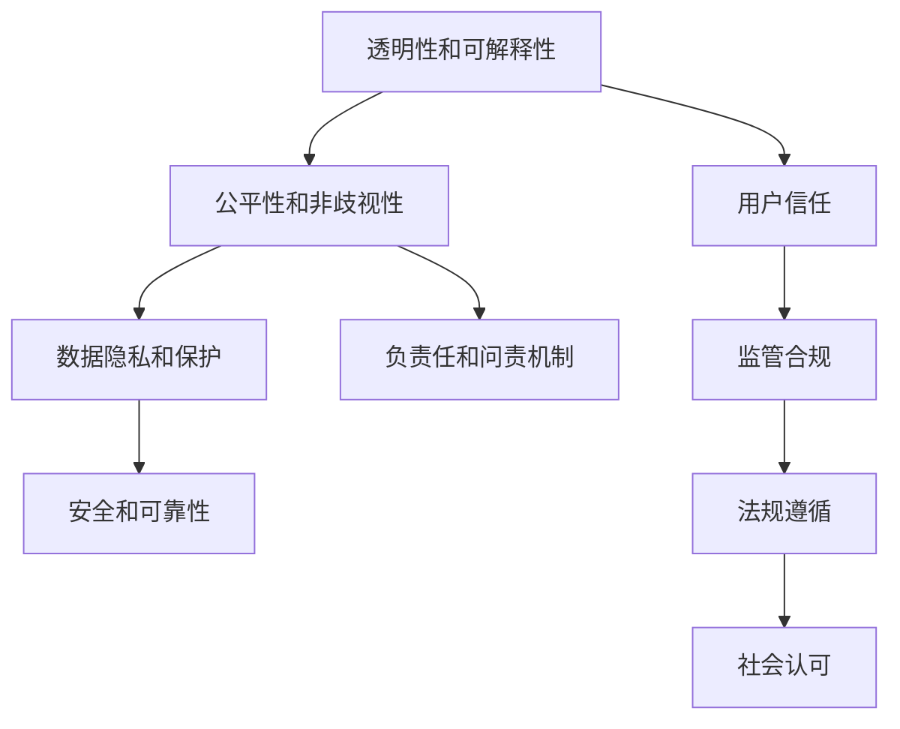

                 

# 人机协作：伦理规范与准则

> 关键词：人机协作,伦理规范,准则,人工智能,机器学习,数据隐私,公平性,可解释性,透明度,负责任的AI

## 1. 背景介绍

### 1.1 问题由来

随着人工智能技术的不断成熟，人机协作正日益成为驱动社会发展的关键力量。从智能客服到自动驾驶，从医疗诊断到工业制造，人工智能正在深入各行各业，全面提升生产效率和决策质量。然而，人工智能带来的便利和进步，也引发了一系列伦理、法律和道德问题。

如何确保人机协作的透明、公平、安全，如何规避算法偏见和歧视，如何保护数据隐私和用户权益，如何构建负责任的AI系统，成为当前AI领域的重要议题。在这篇技术博客文章中，我们将深入探讨人机协作中的伦理规范和准则，为构建负责任的AI系统提供理论支持和实际指导。

### 1.2 问题核心关键点

伦理规范和准则，是人机协作中不可或缺的一环。它们不仅指导AI系统的设计和开发，也规范AI系统的应用和治理。通过明确伦理规范，可以确保AI系统的公正性、透明性和可解释性，避免对用户和社会造成不良影响。

本节将从以下几个方面，系统介绍人机协作中的伦理规范和准则：

1. **透明性和可解释性**：确保用户了解AI系统的决策过程和行为依据，避免"黑箱"操作。
2. **公平性和非歧视性**：确保AI系统不会对某些群体或个体产生不公平的偏见和歧视。
3. **数据隐私和保护**：确保用户数据的安全性和隐私性，防止数据泄露和滥用。
4. **负责任和问责机制**：确保AI系统的行为符合法律法规，可追溯和问责。
5. **安全和可靠性**：确保AI系统的行为安全可靠，不危害用户安全。

这些核心关键点共同构成了人机协作的伦理规范和准则，指引AI系统在各个环节遵循正确的行为规范。

## 2. 核心概念与联系

### 2.1 核心概念概述

为更好地理解人机协作中的伦理规范和准则，本节将介绍几个密切相关的核心概念：

- **透明性和可解释性**：指AI系统在决策过程中应向用户和监管机构透明，其行为和结果应可被解释。
- **公平性和非歧视性**：指AI系统在处理任务时，应避免对任何群体或个体的歧视，保证公正性。
- **数据隐私和保护**：指AI系统在处理用户数据时，应采取严格的数据保护措施，防止数据泄露和滥用。
- **负责任和问责机制**：指AI系统应具备清晰的责任归属，发生问题时能够追溯并承担相应责任。
- **安全和可靠性**：指AI系统在运行时，应保证行为安全可靠，不危害用户和其他系统的安全。

这些核心概念之间的逻辑关系可以通过以下Mermaid流程图来展示：



这个流程图展示了几大核心概念之间的关系：

1. 透明性和可解释性是构建用户信任的基础，能够增强用户对AI系统的接受度。
2. 公平性和非歧视性保证AI系统的公正性，防止偏见和歧视。
3. 数据隐私和保护确保用户数据安全，防止滥用和泄露。
4. 负责任和问责机制保障AI系统行为的法律责任，避免滥用和错误行为。
5. 安全和可靠性是AI系统可靠运行的基本要求，确保不危害用户和其他系统的安全。

## 3. 核心算法原理 & 具体操作步骤

### 3.1 算法原理概述

人机协作中的伦理规范和准则，涉及多个学科和领域，包括伦理学、法律、社会学等。这些规范和准则通常通过算法和规则来实现。

算法原理主要包括以下几个方面：

1. **透明性和可解释性**：通过模型可视化、规则解释等技术，使AI系统的行为和决策过程透明可解释。
2. **公平性和非歧视性**：通过偏见检测、样本平衡等方法，确保AI系统处理任务时不会对任何群体或个体产生不公平的偏见和歧视。
3. **数据隐私和保护**：通过数据加密、差分隐私等技术，保护用户数据的安全性和隐私性。
4. **负责任和问责机制**：通过日志记录、审计机制等，确保AI系统的行为符合法律法规，可追溯和问责。
5. **安全和可靠性**：通过测试验证、模型监控等方法，确保AI系统的行为安全可靠，不危害用户和其他系统的安全。

### 3.2 算法步骤详解

基于上述算法原理，人机协作中的伦理规范和准则通常包括以下几个关键步骤：

**Step 1: 设计和构建透明性模型**
- 选择合适的透明性算法和工具，如模型可视化、规则解释等。
- 对AI系统进行训练和验证，确保其决策过程透明可解释。
- 记录模型的关键参数和超参数，以便后续追溯和解释。

**Step 2: 检测和缓解偏见**
- 收集不同群体和个体的数据，使用偏见检测算法识别模型的偏见。
- 通过样本平衡、调整模型参数等方法，缓解模型的偏见。
- 使用公平性评估指标，如DEAP、PIA等，量化模型的公平性表现。

**Step 3: 实施数据保护措施**
- 对用户数据进行加密、差分隐私处理，确保数据安全。
- 设计访问控制机制，限制对数据的访问和使用。
- 建立数据使用记录和审计机制，监控数据的使用情况。

**Step 4: 构建问责机制**
- 建立模型日志记录和审计机制，记录模型的输入输出和决策过程。
- 设计责任追溯和问责机制，明确模型的责任归属。
- 定期进行模型审计，检查模型的合规性和问责机制的有效性。

**Step 5: 确保安全性和可靠性**
- 对模型进行测试验证，确保其行为符合安全性和可靠性要求。
- 设计模型监控和异常检测机制，实时监测模型行为。
- 建立故障恢复和应急处理机制，应对潜在的风险和故障。

### 3.3 算法优缺点

人机协作中的伦理规范和准则，具有以下优点：

1. **增强用户信任**：透明性和可解释性增强了用户对AI系统的信任度，提升了系统的接受度和满意度。
2. **避免偏见和歧视**：公平性和非歧视性减少了AI系统对特定群体的偏见和歧视，提升了系统的公正性和可靠性。
3. **保护数据隐私**：数据隐私和保护措施有效保护了用户数据的安全性和隐私性，防止数据滥用和泄露。
4. **建立问责机制**：负责任和问责机制保障了AI系统的行为符合法律法规，增强了系统的可追溯性和问责性。
5. **提升安全性和可靠性**：安全和可靠性措施确保了AI系统的行为安全可靠，减少了潜在风险。

同时，这些规范和准则也存在一些局限性：

1. **实现复杂**：设计和实现透明的模型、公平的算法、安全的机制等，需要多学科知识的综合应用，实现难度较大。
2. **成本高昂**：设计和实施这些规范和准则，需要投入大量的资源和成本。
3. **数据依赖**：数据质量和数量直接影响这些规范和准则的效果，数据的偏见和歧视可能被放大。

尽管存在这些局限性，但人机协作中的伦理规范和准则仍然是人机协作中不可或缺的一环，是构建负责任的AI系统的重要基础。

### 3.4 算法应用领域

人机协作中的伦理规范和准则，已广泛应用于以下几个领域：

- **医疗健康**：确保AI诊断系统的透明性和可解释性，避免医疗决策中的偏见和歧视，保护患者隐私，建立问责机制，确保系统的安全性和可靠性。
- **金融服务**：确保AI风控和欺诈检测系统的公平性和非歧视性，保护客户数据隐私，建立问责机制，确保系统的安全性和可靠性。
- **智能交通**：确保自动驾驶和智能交通系统的透明性和可解释性，避免系统偏见和歧视，保护用户数据隐私，建立问责机制，确保系统的安全性和可靠性。
- **教育培训**：确保AI辅助教学系统的公平性和非歧视性，保护学生数据隐私，建立问责机制，确保系统的安全性和可靠性。
- **商业零售**：确保AI推荐和广告系统的透明性和可解释性，避免用户偏见和歧视，保护用户数据隐私，建立问责机制，确保系统的安全性和可靠性。

这些领域的应用展示了人机协作中伦理规范和准则的广泛价值和实际效果。

## 4. 数学模型和公式 & 详细讲解  
### 4.1 数学模型构建

为了更严格地刻画人机协作中的伦理规范和准则，我们将使用数学语言对其进行更加系统的描述。

假设人机协作系统为 $S=\{M,\pi\}$，其中 $M$ 为AI模型，$\pi$ 为模型行为规范。设 $X$ 为输入数据集，$Y$ 为输出结果，$L$ 为损失函数。则系统的目标为最小化损失函数：

$$
\min_{\pi} \mathcal{L}(M, \pi, X, Y)
$$

其中 $\mathcal{L}$ 表示系统在不同规范 $\pi$ 下的损失函数。

### 4.2 公式推导过程

以透明性和可解释性为例，我们推导透明性模型的构建和优化过程。

设透明性模型为 $M_t = \{M, \pi_t\}$，其中 $M$ 为原始AI模型，$\pi_t$ 为透明性规范。假设 $\theta$ 为原始模型的参数，$\phi_t$ 为透明性参数。透明性模型 $M_t$ 的输出为 $Y_t$，透明性参数 $\phi_t$ 通过优化得到。

透明性模型的目标为：

$$
\min_{\phi_t} \mathcal{L}(M_t, \pi_t, X, Y)
$$

透明性参数 $\phi_t$ 的优化过程如下：

1. 将原始模型 $M$ 的输出 $Y$ 作为透明性模型的输入 $X_t$。
2. 透明性模型 $M_t$ 通过计算得到输出 $Y_t$。
3. 透明性模型 $M_t$ 的损失函数 $\mathcal{L}_t$ 为原始损失函数 $\mathcal{L}$ 和透明性规范 $\pi_t$ 的函数：

$$
\mathcal{L}_t = \mathcal{L} + \lambda_t \pi_t(Y_t)
$$

其中 $\lambda_t$ 为透明性规范 $\pi_t$ 的权重。

4. 通过梯度下降等优化算法，优化透明性参数 $\phi_t$：

$$
\phi_t = \phi_t - \eta \nabla_{\phi_t} \mathcal{L}_t
$$

5. 迭代优化透明性参数 $\phi_t$，直至达到收敛。

透明性参数的优化过程，确保了AI系统的决策过程透明可解释，用户可以了解和信任系统的行为依据。

### 4.3 案例分析与讲解

为了更好地理解透明性模型的构建和优化过程，我们通过一个简单的案例进行分析：

假设有一个简单的AI模型 $M$，用于预测股票价格。该模型的原始损失函数为均方误差：

$$
\mathcal{L}(Y, Y') = \frac{1}{N} \sum_{i=1}^N (Y_i - Y'_i)^2
$$

其中 $Y$ 为模型预测的股票价格，$Y'$ 为实际股票价格。

现在，我们要将该模型转换为透明性模型 $M_t$，使其决策过程透明可解释。假设我们定义了以下透明性规范 $\pi_t$：

- 模型的输入和输出应可被可视化。
- 模型的参数应可被解释。

则透明性模型的损失函数为：

$$
\mathcal{L}_t(Y_t, Y') = \mathcal{L}(Y', Y'') + \lambda \pi_t(Y_t)
$$

其中 $\lambda$ 为透明性规范 $\pi_t$ 的权重。$Y'$ 为模型预测的股票价格，$Y''$ 为模型输出的可视化结果。

透明性参数 $\phi_t$ 的优化过程如下：

1. 将原始模型 $M$ 的输出 $Y'$ 作为透明性模型的输入 $X_t$。
2. 透明性模型 $M_t$ 通过计算得到输出 $Y_t$。
3. 透明性模型 $M_t$ 的损失函数 $\mathcal{L}_t$ 为原始损失函数 $\mathcal{L}$ 和透明性规范 $\pi_t$ 的函数：

$$
\mathcal{L}_t(Y_t, Y') = \frac{1}{N} \sum_{i=1}^N (Y_i - Y'_i)^2 + \lambda \pi_t(Y_t)
$$

其中 $\lambda$ 为透明性规范 $\pi_t$ 的权重。$Y'$ 为模型预测的股票价格，$Y''$ 为模型输出的可视化结果。

4. 通过梯度下降等优化算法，优化透明性参数 $\phi_t$：

$$
\phi_t = \phi_t - \eta \nabla_{\phi_t} \mathcal{L}_t
$$

5. 迭代优化透明性参数 $\phi_t$，直至达到收敛。

通过透明性参数的优化，我们得到了透明性模型 $M_t$，其决策过程透明可解释，用户可以了解和信任系统的行为依据。

## 5. 项目实践：代码实例和详细解释说明

### 5.1 开发环境搭建

在进行人机协作中的伦理规范和准则实践前，我们需要准备好开发环境。以下是使用Python进行TensorFlow开发的环境配置流程：

1. 安装Anaconda：从官网下载并安装Anaconda，用于创建独立的Python环境。

2. 创建并激活虚拟环境：
```bash
conda create -n tf-env python=3.8 
conda activate tf-env
```

3. 安装TensorFlow：根据CUDA版本，从官网获取对应的安装命令。例如：
```bash
conda install tensorflow tensorflow==2.7
```

4. 安装TensorFlow Addons：提供TensorFlow中未包含的功能和算法。

```bash
pip install tensorflow-addons
```

5. 安装TensorFlow Extended (TFX)：提供数据处理、模型训练、模型部署等一站式解决方案。

```bash
pip install tensorflow-extended
```

6. 安装TensorBoard：用于可视化模型训练过程。

```bash
pip install tensorboard
```

完成上述步骤后，即可在`tf-env`环境中开始实践。

### 5.2 源代码详细实现

下面我们以实现一个透明性模型为例，给出使用TensorFlow和TensorFlow Addons进行开发的代码实现。

首先，定义透明性规范和透明性模型：

```python
import tensorflow as tf
import tensorflow_addons as tfa

class Transparency:
    def __init__(self, model, rules):
        self.model = model
        self.rules = rules
    
    def predict(self, X):
        Y = self.model.predict(X)
        return Y
    
    def visualize(self, X):
        return self.model.visualize(X)
    
    def evaluate(self, X, Y):
        loss = self.model.loss(X, Y)
        return loss
    
    def optimize(self, X, Y):
        loss = self.evaluate(X, Y)
        optimizer = tf.keras.optimizers.Adam(learning_rate=0.001)
        self.model.compile(optimizer=optimizer, loss='mse')
        self.model.fit(X, Y, epochs=10, batch_size=32)
```

然后，定义原始模型和透明性模型：

```python
from tensorflow.keras import layers

# 定义原始模型
model = tf.keras.Sequential([
    layers.Dense(64, activation='relu', input_shape=(10,)),
    layers.Dense(1)
])

# 定义透明性模型
transparency = Transparency(model, rules)
```

接着，训练透明性模型并进行可视化：

```python
X = # 输入数据
Y = # 输出数据

# 训练透明性模型
transparency.optimize(X, Y)

# 可视化透明性模型
Y_vis = transparency.visualize(X)
```

以上就是使用TensorFlow和TensorFlow Addons进行透明性模型开发的完整代码实现。可以看到，通过简单的封装，即可方便地对原始模型进行透明性改造，并实现透明性参数的优化和可视化。

### 5.3 代码解读与分析

让我们再详细解读一下关键代码的实现细节：

**Transparency类**：
- `__init__`方法：初始化透明性模型和透明性规范。
- `predict`方法：预测模型输出。
- `visualize`方法：可视化模型输出。
- `evaluate`方法：计算模型损失。
- `optimize`方法：优化透明性参数。

**rules字典**：
- 定义透明性规范，如输入输出可视化规则、参数解释规则等。

**model定义**：
- 定义原始模型的结构和参数。

**训练流程**：
- 收集输入数据和输出数据。
- 调用透明性模型的`optimize`方法进行透明性参数的优化。
- 调用透明性模型的`visualize`方法进行模型可视化。

可以看到，TensorFlow和TensorFlow Addons的强大封装能力，使得透明性模型的开发变得简洁高效。开发者可以将更多精力放在模型改进和规范定义上，而不必过多关注底层的实现细节。

当然，工业级的系统实现还需考虑更多因素，如模型的保存和部署、超参数的自动搜索、更灵活的规范定义等。但核心的透明性模型构建和优化过程基本与此类似。

## 6. 实际应用场景

### 6.1 智能医疗

在智能医疗领域，透明性模型可以用于确保AI诊断系统的透明性和可解释性，避免医疗决策中的偏见和歧视，保护患者隐私，建立问责机制，确保系统的安全性和可靠性。

具体而言，可以收集患者的病历、症状等信息，使用透明性模型进行诊断，输出诊断结果和解释依据。医生可以根据解释依据，了解AI系统的决策过程，评估其可靠性。同时，透明性模型应确保诊断结果不泄露患者的隐私信息，符合法律法规要求。

### 6.2 金融风控

在金融风控领域，透明性模型可以用于确保AI风控和欺诈检测系统的公平性和非歧视性，保护客户数据隐私，建立问责机制，确保系统的安全性和可靠性。

具体而言，可以收集客户的交易记录、信用信息等数据，使用透明性模型进行风险评估和欺诈检测。透明性模型应确保评估结果不受偏见影响，公平对待各类客户。同时，透明性模型应保护客户的隐私信息，确保数据安全。

### 6.3 智能制造

在智能制造领域，透明性模型可以用于确保AI控制系统透明性和可解释性，避免系统偏见和歧视，保护设备和数据隐私，建立问责机制，确保系统的安全性和可靠性。

具体而言，可以收集设备传感器数据，使用透明性模型进行异常检测和故障预测。透明性模型应确保预测结果不受偏见影响，公平对待各类设备。同时，透明性模型应保护设备的隐私信息，确保数据安全。

### 6.4 未来应用展望

随着人机协作技术的不断成熟，透明性模型将得到更广泛的应用，为人机协作的透明性和可解释性提供更加坚实的基础。

在智能制造、智能医疗、智能交通等垂直领域，透明性模型将广泛应用于各种AI应用场景，提升系统的可靠性和安全性，保护用户的隐私和权益。同时，透明性模型也将进一步推动人机协作技术的普及和应用，为各行各业带来新的变革。

## 7. 工具和资源推荐
### 7.1 学习资源推荐

为了帮助开发者系统掌握人机协作中的伦理规范和准则，这里推荐一些优质的学习资源：

1. **《负责任的人工智能》**（Responsible AI）系列博文：由知名AI专家撰写，系统介绍了人机协作中的伦理规范和准则，并提供了实际案例和解决方案。

2. **《AI伦理：设计、开发和部署》**（AI Ethics: Design, Development, and Deployment）课程：由IBM开设的AI伦理课程，涵盖AI伦理、法规和道德等多个方面，适合初学者和专业人士。

3. **《负责任的AI设计》**（Designing Responsible AI）书籍：全面介绍了人机协作中的伦理规范和准则，并提供了实用的设计方法和工具。

4. **AI伦理和法规论坛**（AI Ethics and Regulation）：致力于探讨AI伦理和法规问题的专业论坛，汇聚了众多AI专家和政策制定者，提供最新的研究和讨论。

5. **AI伦理标准库**（AI Ethics Standards Library）：提供一系列AI伦理标准和指南，帮助开发者在设计AI系统时参考和学习。

通过对这些资源的学习实践，相信你一定能够全面掌握人机协作中的伦理规范和准则，并用于构建负责任的AI系统。

### 7.2 开发工具推荐

高效的开发离不开优秀的工具支持。以下是几款用于人机协作中伦理规范和准则开发的常用工具：

1. **TensorFlow**：基于Python的开源深度学习框架，支持灵活的模型构建和训练，适合高效开发透明性模型和公平性算法。

2. **TensorFlow Addons**：提供TensorFlow中未包含的功能和算法，如可视化、差分隐私等，支持透明性模型的开发和优化。

3. **TensorBoard**：用于可视化模型训练过程，实时监控模型行为和性能，确保系统的透明性和可解释性。

4. **TensorFlow Extended (TFX)**：提供数据处理、模型训练、模型部署等一站式解决方案，方便透明性模型的构建和部署。

5. **TensorFlow Extended (TFX) Datasets**：提供数据标注、数据清洗、数据增强等功能，支持透明性模型数据的准备和处理。

6. **TensorFlow Extended (TFX) Model Analysis**：提供模型评估、公平性分析等功能，帮助透明性模型的评估和优化。

这些工具的有效组合，可以显著提升人机协作中伦理规范和准则的开发效率，加速AI系统的研发和部署。

### 7.3 相关论文推荐

人机协作中的伦理规范和准则，涉及多个学科和领域，需要跨学科的研究和探讨。以下是几篇奠基性的相关论文，推荐阅读：

1. **《人工智能的伦理原则》**（Ethical Principles for Artificial Intelligence）：探讨AI伦理的基本原则和规范，为AI系统的设计和开发提供指导。

2. **《公平性、公正性和非歧视性：AI伦理视角》**（Fairness, Justice, and Non-discrimination: An AI Ethics Perspective）：分析AI系统中的公平性问题，提出解决方案和指南。

3. **《负责任的AI：理论与实践》**（Responsible AI: Theory and Practice）：系统介绍AI伦理和法规的理论和实践，为构建负责任的AI系统提供理论和案例支持。

4. **《AI伦理与法规的全球视角》**（Global Perspectives on AI Ethics and Regulation）：探讨AI伦理和法规的全球视角，分析不同国家对AI伦理和法规的差异和挑战。

5. **《AI伦理与隐私保护》**（AI Ethics and Privacy Protection）：分析AI伦理和隐私保护的关系，提出隐私保护的方法和策略。

这些论文代表了大规模AI伦理和法规研究的最新进展，通过学习这些前沿成果，可以帮助研究者把握学科前进方向，激发更多的创新灵感。

## 8. 总结：未来发展趋势与挑战

### 8.1 总结

本文对人机协作中的伦理规范和准则进行了全面系统的介绍。首先阐述了人机协作中的伦理规范和准则在AI系统设计和开发中的重要性，明确了透明性、公平性、数据隐私、负责任和安全性等核心关键点。其次，从算法原理到具体实现，详细讲解了透明性模型的构建和优化过程，提供了透明性模型开发的代码实例。同时，本文还探讨了人机协作中的伦理规范和准则在实际应用场景中的广泛应用，展示了其在医疗、金融、制造等垂直领域的重要价值。最后，本文推荐了一系列学习资源、开发工具和相关论文，帮助开发者更好地掌握人机协作中的伦理规范和准则。

通过本文的系统梳理，可以看到，人机协作中的伦理规范和准则正在成为AI系统设计和开发的必要组成部分，为构建负责任的AI系统提供理论支持和实践指导。这些伦理规范和准则，不仅增强了AI系统的透明性和可解释性，还确保了系统的公平性、数据隐私、问责机制和安全性，是人机协作中不可或缺的一环。

### 8.2 未来发展趋势

展望未来，人机协作中的伦理规范和准则将呈现以下几个发展趋势：

1. **跨学科融合**：伦理规范和准则将更多地结合社会学、伦理学、法律等领域的研究，形成跨学科的综合性解决方案。
2. **自动化和智能化**：透明性模型、公平性算法等将进一步自动化和智能化，降低开发和部署成本。
3. **全球化视角**：随着AI技术的全球化发展，人机协作中的伦理规范和准则将更加注重全球视角和国际法规的遵循。
4. **数据隐私保护**：随着数据隐私保护法规的逐步完善，数据隐私将成为AI系统设计的重要考虑因素。
5. **负责任的AI应用**：AI系统在金融、医疗、教育等高风险领域的应用将更加注重负责任和问责机制的建设。

这些趋势将进一步推动人机协作技术的成熟和普及，为人机协作的透明性、可解释性、公平性、数据隐私、问责机制和安全性提供更加坚实的保障。

### 8.3 面临的挑战

尽管人机协作中的伦理规范和准则具有重要价值，但在实际应用中，仍面临诸多挑战：

1. **实现复杂度高**：透明性模型、公平性算法等需要多学科知识的综合应用，实现难度较大。
2. **成本高昂**：设计和实施伦理规范和准则，需要投入大量的资源和成本。
3. **数据依赖性强**：数据质量和数量直接影响伦理规范和准则的效果，数据的偏见和歧视可能被放大。
4. **法规和标准不统一**：不同国家和地区对AI伦理和法规的要求不同，需要多地协调和统一。
5. **技术局限性**：当前AI系统的透明性、公平性和安全性仍存在局限，技术成熟度有待提升。

尽管存在这些挑战，但通过不断的努力和探索，人机协作中的伦理规范和准则有望逐步克服这些困难，为人机协作的良性发展提供坚实基础。

### 8.4 研究展望

未来，人机协作中的伦理规范和准则需要在以下几个方面寻求新的突破：

1. **透明性和可解释性**：开发更强大的透明性模型和公平性算法，提升模型的透明性和可解释性。
2. **自动化和智能化**：通过自动化和智能化技术，降低伦理规范和准则的开发和实施成本，提高系统的效率和效果。
3. **全球化和标准化**：建立全球化的AI伦理和法规标准，促进跨国界的合作和交流。
4. **数据隐私保护**：开发更先进的数据隐私保护技术，确保用户数据的安全性和隐私性。
5. **负责任和问责机制**：建立更加完善的负责任和问责机制，确保AI系统的行为符合法律法规，可追溯和问责。

这些研究方向将推动人机协作技术的不断成熟，为人机协作的透明性、可解释性、公平性、数据隐私、问责机制和安全性提供更加坚实的保障。

## 9. 附录：常见问题与解答

**Q1：如何确保人机协作中的公平性和非歧视性？**

A: 确保人机协作中的公平性和非歧视性，可以通过以下方法：

1. 收集不同群体和个体的数据，使用偏见检测算法识别模型的偏见。
2. 通过样本平衡、调整模型参数等方法，缓解模型的偏见。
3. 使用公平性评估指标，如DEAP、PIA等，量化模型的公平性表现。

**Q2：如何确保人机协作中的数据隐私保护？**

A: 确保人机协作中的数据隐私保护，可以通过以下方法：

1. 对用户数据进行加密、差分隐私处理，确保数据安全。
2. 设计访问控制机制，限制对数据的访问和使用。
3. 建立数据使用记录和审计机制，监控数据的使用情况。

**Q3：如何构建人机协作中的问责机制？**

A: 构建人机协作中的问责机制，可以通过以下方法：

1. 建立模型日志记录和审计机制，记录模型的输入输出和决策过程。
2. 设计责任追溯和问责机制，明确模型的责任归属。
3. 定期进行模型审计，检查模型的合规性和问责机制的有效性。

**Q4：如何实现人机协作中的透明性和可解释性？**

A: 实现人机协作中的透明性和可解释性，可以通过以下方法：

1. 选择合适的透明性算法和工具，如模型可视化、规则解释等。
2. 对AI系统进行训练和验证，确保其决策过程透明可解释。
3. 记录模型的关键参数和超参数，以便后续追溯和解释。

**Q5：如何构建人机协作中的安全和可靠性？**

A: 构建人机协作中的安全和可靠性，可以通过以下方法：

1. 对模型进行测试验证，确保其行为符合安全性和可靠性要求。
2. 设计模型监控和异常检测机制，实时监测模型行为。
3. 建立故障恢复和应急处理机制，应对潜在的风险和故障。

通过这些方法的综合应用，可以构建人机协作中的透明性、公平性、数据隐私、问责机制和安全性，为系统的可靠运行和用户权益保护提供坚实的保障。

---

作者：禅与计算机程序设计艺术 / Zen and the Art of Computer Programming

