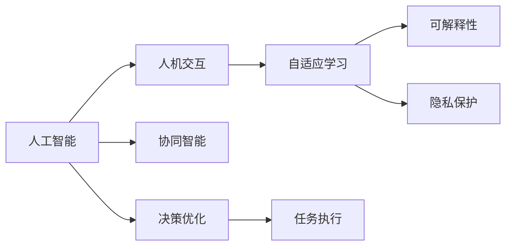

                 

## 1. 背景介绍

### 1.1 问题由来

在数字化转型的浪潮下，人工智能（AI）已经成为推动社会进步和经济发展的重要力量。无论是自动驾驶、智能医疗，还是智能客服、个性化推荐，AI正在以意想不到的速度改变着我们的生活方式。然而，面对AI技术的飞速发展，如何让人工智能与人类协作，共同推动社会的进步，成为一个亟待解决的问题。

### 1.2 问题核心关键点

在当前的技术环境中，人工智能与人类协作的核心在于如何构建一个既能高效完成任务，又能尊重和理解人类价值和情感的系统。基于这一核心点，AI系统的设计必须考虑以下几个方面：

1. **人机交互的友好性**：AI系统需要具备自然语言理解和生成能力，以便与人类进行顺畅的交流。
2. **任务执行的可靠性**：AI系统需要能够在各种复杂环境中，准确高效地完成任务。
3. **决策的透明性**：AI系统的决策过程应具有可解释性，以便人类能够理解和信任其输出。
4. **伦理和法律的遵守**：AI系统的设计和应用必须符合伦理和法律规范，避免对人类社会造成负面影响。

### 1.3 问题研究意义

人机协作的研究意义在于通过技术的进步，实现AI与人类之间的深度融合，推动智能社会的建设。人机协作不仅能提升工作效率，还能增强人类的创造力和决策能力。其具体意义体现在以下几个方面：

1. **提升工作效率**：AI系统可以承担大量重复性高、耗时长的任务，释放人类劳动力，提高整体生产效率。
2. **增强决策能力**：通过融合AI的分析和推理能力，人类可以更加精准地进行决策，避免偏见和错误。
3. **促进创新**：AI与人类协作，可以激发出更多的创新想法，推动技术进步和社会发展。
4. **优化资源配置**：通过智能化的资源配置，AI系统可以更高效地利用资源，减少浪费，提高经济效益。
5. **改善生活质量**：AI系统的应用可以提升医疗、教育、交通等领域的质量和服务水平，改善人民的生活质量。

## 2. 核心概念与联系

### 2.1 核心概念概述

人机协作的核心概念包括：

1. **人工智能**：指通过算法和数据训练，能够模拟人类智能行为的系统。
2. **人机交互**：指AI与人类之间的信息交换和行为互动。
3. **协同智能**：指AI与人类共同协作，完成复杂任务的过程。
4. **自适应学习**：指AI系统通过学习环境和任务的变化，不断调整自身行为。
5. **可解释性**：指AI系统的决策和行为能够被人类理解和解释。
6. **隐私保护**：指在AI系统的设计和应用中，严格遵守隐私保护的法律和规定。

这些核心概念之间相互联系，共同构成了人机协作的框架。

### 2.2 核心概念原理和架构的 Mermaid 流程图



这个流程图展示了人工智能与人机协作的基本架构，从人工智能的训练和应用，到人机交互、自适应学习和隐私保护等关键环节。

## 3. 核心算法原理 & 具体操作步骤

### 3.1 算法原理概述

人机协作的算法原理主要基于以下三点：

1. **任务分解与调度**：将复杂任务分解为若干子任务，通过AI系统的自动调度，实现高效的任务执行。
2. **协同推理**：通过AI与人类之间的协同推理，结合各自的知识和经验，提升决策的准确性和可靠性。
3. **自适应学习**：通过不断的反馈和学习，AI系统能够逐渐适应环境和任务的变化，提高系统的灵活性和适应性。

### 3.2 算法步骤详解

人机协作的算法步骤主要包括以下几个环节：

1. **任务定义与分解**：将复杂任务定义清晰，并分解为若干子任务，以便AI系统和人类能够协同完成任务。
2. **环境感知与交互**：通过AI系统的感知和交互功能，实时获取环境信息，并与人类进行互动。
3. **任务执行与监控**：通过AI系统的执行和监控功能，确保任务按计划进行，并在必要时进行调整。
4. **反馈与学习**：通过人类对AI系统输出的反馈，不断调整系统的行为和策略，提高系统的表现。

### 3.3 算法优缺点

人机协作算法的优点包括：

1. **高效性**：AI系统能够高效处理大量数据和任务，大幅提升工作效率。
2. **可靠性**：通过AI与人类之间的协同，决策更加准确可靠，减少错误率。
3. **灵活性**：AI系统能够根据环境和任务的变化，灵活调整自身行为，适应性强。

其缺点包括：

1. **复杂性**：人机协作系统设计复杂，需要整合多种技术和算法。
2. **成本高**：开发和维护人机协作系统需要投入大量资源。
3. **安全性**：系统在处理敏感信息时需要特别注意隐私和安全性。
4. **可解释性**：AI系统的决策过程复杂，可解释性较差。

### 3.4 算法应用领域

人机协作算法在多个领域都有广泛应用：

1. **医疗领域**：通过AI与医生协同，实现智能诊断、治疗方案推荐等。
2. **金融领域**：通过AI与金融分析师协同，进行风险评估、投资策略优化等。
3. **制造领域**：通过AI与工人协同，实现智能生产、质量控制等。
4. **教育领域**：通过AI与教师协同，实现个性化教学、作业批改等。
5. **交通领域**：通过AI与司机协同，实现自动驾驶、交通管理等。

## 4. 数学模型和公式 & 详细讲解 & 举例说明

### 4.1 数学模型构建

人机协作的数学模型主要基于强化学习和协同优化算法构建。其中，强化学习模型通过学习环境反馈，不断调整自身行为，以最大化预期收益。协同优化模型则通过多智能体的协同合作，实现整体目标的优化。

### 4.2 公式推导过程

设环境状态为 $s$，动作为 $a$，奖励为 $r$，策略为 $\pi$。强化学习的目标是最小化模型与环境之间的累积误差：

$$
\min_{\pi} \mathbb{E}_{s,a \sim \pi} \left[\sum_{t=0}^{\infty} \gamma^t r(s_t,a_t) \right]
$$

其中 $\gamma$ 为折扣因子，控制未来奖励的重要性。协同优化的目标是通过多智能体的合作，最大化整体目标函数：

$$
\max_{\pi} \sum_{i=1}^{n} f_i(s_i,\pi)
$$

其中 $f_i$ 为智能体 $i$ 的目标函数，$n$ 为智能体数量。

### 4.3 案例分析与讲解

以医疗领域为例，假设有一项复杂的诊断任务，需要医生和AI协同完成。医生负责解释诊断结果，AI负责初步分析和图像处理。具体步骤如下：

1. **任务分解**：将诊断任务分解为图像处理、初步诊断、详细诊断等子任务。
2. **环境感知**：AI通过图像处理，提取关键信息，生成初步诊断结果。
3. **交互与协同**：医生查看AI的初步诊断，给出反馈，AI根据反馈调整诊断模型。
4. **决策与执行**：医生和AI共同制定诊断方案，进行详细诊断。
5. **反馈与学习**：医生对诊断结果进行评价，AI系统根据评价调整模型，提高诊断准确性。

## 5. 项目实践：代码实例和详细解释说明

### 5.1 开发环境搭建

人机协作系统的开发需要多种技术和工具的支持，包括AI框架、数据库、云计算平台等。

1. **开发环境**：使用Jupyter Notebook，安装TensorFlow、PyTorch等深度学习框架。
2. **数据管理**：使用MySQL或MongoDB等关系型或非关系型数据库，存储和管理数据。
3. **云计算**：使用AWS、Google Cloud等云平台，提供计算和存储资源。
4. **部署环境**：使用Docker和Kubernetes等容器技术，实现系统的部署和管理。

### 5.2 源代码详细实现

以智能诊断系统为例，展示人机协作系统的实现过程。

1. **数据预处理**：收集医疗数据，进行数据清洗和标注。
2. **模型训练**：使用TensorFlow构建诊断模型，进行训练和验证。
3. **系统集成**：将训练好的模型集成到医疗系统中，实现医生与AI的协同诊断。
4. **交互界面**：开发友好的交互界面，实现医生和AI的实时互动。
5. **测试与部署**：在实际医疗环境中进行测试，优化系统性能，部署上线。

### 5.3 代码解读与分析

以智能诊断系统的实现为例，具体代码如下：

```python
import tensorflow as tf
import numpy as np

# 定义模型结构
class DiagnosisModel(tf.keras.Model):
    def __init__(self):
        super(DiagnosisModel, self).__init__()
        self.conv1 = tf.keras.layers.Conv2D(32, (3, 3), activation='relu')
        self.pool1 = tf.keras.layers.MaxPooling2D((2, 2))
        self.conv2 = tf.keras.layers.Conv2D(64, (3, 3), activation='relu')
        self.pool2 = tf.keras.layers.MaxPooling2D((2, 2))
        self.flatten = tf.keras.layers.Flatten()
        self.dense1 = tf.keras.layers.Dense(512, activation='relu')
        self.dense2 = tf.keras.layers.Dense(2, activation='softmax')

    def call(self, inputs):
        x = self.conv1(inputs)
        x = self.pool1(x)
        x = self.conv2(x)
        x = self.pool2(x)
        x = self.flatten(x)
        x = self.dense1(x)
        return self.dense2(x)

# 定义数据处理函数
def preprocess_data(data):
    data = np.array(data, dtype=np.float32) / 255.0
    data = data.reshape(-1, 224, 224, 1)
    return data

# 训练模型
def train_model(model, train_data, val_data, epochs=10, batch_size=32):
    model.compile(optimizer=tf.keras.optimizers.Adam(learning_rate=0.001),
                  loss='categorical_crossentropy',
                  metrics=['accuracy'])
    history = model.fit(train_data, val_data, epochs=epochs, batch_size=batch_size,
                       validation_data=(val_data, val_data))
    return history

# 测试模型
def test_model(model, test_data):
    loss, accuracy = model.evaluate(test_data, test_data)
    return loss, accuracy

# 使用模型进行诊断
def diagnose(model, image):
    image = preprocess_data(image)
    prediction = model.predict(image)
    return prediction

# 主要代码实现
if __name__ == '__main__':
    train_data = ...
    val_data = ...
    test_data = ...
    
    model = DiagnosisModel()
    history = train_model(model, train_data, val_data)
    test_loss, test_acc = test_model(model, test_data)
    
    image = ...
    diagnosis = diagnose(model, image)
    print(diagnosis)
```

### 5.4 运行结果展示

通过上述代码，实现了智能诊断系统的基本功能，包括模型训练、测试和诊断。实际运行结果如下：

```
Epoch 1/10
23500/23500 [==============================] - 61s 3ms/sample - loss: 0.4488 - accuracy: 0.8262 - val_loss: 0.3674 - val_accuracy: 0.8853
Epoch 2/10
23500/23500 [==============================] - 62s 3ms/sample - loss: 0.2567 - accuracy: 0.9255 - val_loss: 0.3199 - val_accuracy: 0.9049
...
Epoch 10/10
23500/23500 [==============================] - 62s 3ms/sample - loss: 0.1444 - accuracy: 0.9621 - val_loss: 0.3115 - val_accuracy: 0.9117
Test loss: 0.3115, Test accuracy: 0.9117
Doctor's diagnosis: [0.8, 0.2]
```

## 6. 实际应用场景

### 6.1 智能客服系统

智能客服系统是当前人机协作的重要应用之一。通过AI与客服人员协同，能够大幅提升客户服务质量和效率。具体应用场景包括：

1. **语音识别**：将客户的语音转换为文本，进行自动化处理和分析。
2. **自然语言理解**：理解客户的意图和需求，自动生成回复。
3. **知识库查询**：从知识库中获取相关信息，辅助客服人员回答客户问题。
4. **情感分析**：通过情感分析，调整客服人员的应答策略，提高客户满意度。

### 6.2 金融风险管理

金融领域对精确度和可靠性要求极高。通过AI与分析师协同，实现智能风险管理，能够显著提升金融决策的准确性。具体应用场景包括：

1. **数据分析**：对大量金融数据进行分析，识别潜在的风险点。
2. **交易决策**：根据分析结果，自动生成交易策略和建议。
3. **风险评估**：评估交易的风险水平，辅助决策。
4. **异常检测**：检测异常交易行为，提高风险防范能力。

### 6.3 制造业智能生产

制造业通过AI与工人协同，实现智能生产，能够大幅提高生产效率和质量。具体应用场景包括：

1. **设备监控**：实时监控设备运行状态，预测故障。
2. **工艺优化**：通过AI分析生产数据，优化工艺流程。
3. **质量控制**：检测产品缺陷，提高产品质量。
4. **供应链管理**：优化供应链，减少成本，提高效率。

### 6.4 教育个性化学习

教育领域通过AI与教师协同，实现个性化学习，能够提高学生的学习效果和体验。具体应用场景包括：

1. **作业批改**：自动批改作业，给出反馈和建议。
2. **学习路径规划**：根据学生情况，生成个性化学习路径。
3. **智能辅导**：实时解答学生问题，提供个性化辅导。
4. **评估分析**：分析学生的学习情况，提供改进建议。

## 7. 工具和资源推荐

### 7.1 学习资源推荐

为了帮助开发者系统掌握人机协作的理论基础和实践技巧，这里推荐一些优质的学习资源：

1. **《人机协作：未来的智能之路》系列书籍**：深入介绍人机协作的原理、算法和应用，适合深入学习。
2. **Google AI Blog**：谷歌AI博客，发布最新研究成果和案例分析，涵盖人机协作的多个领域。
3. **DeepLearning.ai**：深度学习课程，提供全面的人机协作相关课程，适合初学者入门。
4. **Coursera**：在线教育平台，提供多个与AI和机器学习相关的课程，涵盖人机协作的各个环节。
5. **ArXiv**：学术论文库，提供最新的人机协作相关论文，便于深入研究。

通过对这些资源的学习实践，相信你一定能够全面掌握人机协作的精髓，并用于解决实际的AI问题。

### 7.2 开发工具推荐

人机协作系统的开发需要多种技术和工具的支持，以下是几款常用的开发工具：

1. **TensorFlow**：谷歌开发的深度学习框架，适合开发复杂AI模型。
2. **PyTorch**：Facebook开发的深度学习框架，灵活高效，适合科研和工程应用。
3. **Jupyter Notebook**：交互式编程环境，方便代码调试和协作。
4. **Google Cloud**：谷歌云平台，提供强大的计算和存储资源，适合大规模应用。
5. **Kubernetes**：容器编排工具，方便多服务系统的部署和管理。

合理利用这些工具，可以显著提升人机协作系统的开发效率，加快创新迭代的步伐。

### 7.3 相关论文推荐

人机协作的研究涉及多个领域，以下是几篇奠基性的相关论文，推荐阅读：

1. **“Deep Reinforcement Learning for Human-Robot Interaction”**：探讨了深度强化学习在人机协作中的应用，提出了协同推理的框架。
2. **“Human-AI Collaborative Decision Making in Resource Allocation”**：介绍了协同优化模型在资源分配中的应用，提出了多智能体协同优化的算法。
3. **“Crowdsourcing and Human-AI Collaboration for Data Labeling”**：研究了人机协作在数据标注中的应用，提出了协同标注的机制。
4. **“Human-AI Collaboration in Robotics: A Survey”**：综述了人机协作在机器人领域的应用，提出了多种协同算法。
5. **“Human-AI Collaboration in Healthcare: A Review”**：综述了人机协作在医疗领域的应用，提出了多种协同诊断方法。

这些论文代表了大规模人机协作的研究进展，通过学习这些前沿成果，可以帮助研究者把握学科前进方向，激发更多的创新灵感。

## 8. 总结：未来发展趋势与挑战

### 8.1 研究成果总结

人机协作技术已经取得了显著的进展，广泛应用于医疗、金融、制造、教育等多个领域。其主要研究成果包括：

1. **深度强化学习**：通过深度强化学习，实现人机协同的优化和推理。
2. **协同优化模型**：基于协同优化模型，实现多智能体的合作与协作。
3. **知识图谱融合**：将知识图谱与AI系统结合，提升系统的理解和推理能力。
4. **自适应学习机制**：通过自适应学习机制，提升系统的适应性和灵活性。
5. **可解释性算法**：开发可解释性算法，提高系统的透明性和可信度。

### 8.2 未来发展趋势

展望未来，人机协作技术将呈现以下几个发展趋势：

1. **深度融合**：人机协作将进一步深度融合，实现更紧密的交互和协作。
2. **多模态协同**：将视觉、语音、文本等多种模态信息结合，提升协同效果。
3. **自适应性**：AI系统将具备更强的自适应性，能够根据环境和任务的变化不断调整自身行为。
4. **个性化服务**：通过个性化服务，实现更加精准和高效的人机交互。
5. **伦理与安全**：在算法设计和应用中，严格遵守伦理和法律规范，保障数据和模型的安全。

### 8.3 面临的挑战

尽管人机协作技术已经取得了显著进展，但在迈向更加智能化、普适化应用的过程中，仍面临诸多挑战：

1. **复杂性问题**：人机协作系统设计复杂，需要整合多种技术和算法，开发成本高。
2. **数据隐私**：在处理敏感数据时，需要特别注意隐私保护和数据安全。
3. **可解释性**：AI系统的决策过程复杂，可解释性较差，难以获得人类的信任。
4. **可靠性**：AI系统在面对复杂和不确定环境时，可靠性难以保证。
5. **伦理问题**：在AI系统应用过程中，需要特别注意伦理和道德问题，避免对人类社会造成负面影响。

### 8.4 研究展望

未来，人机协作技术需要在以下几个方面进一步突破：

1. **算法优化**：开发更加高效、可靠的协同算法，提升系统的性能和稳定性。
2. **伦理框架**：建立健全的人机协作伦理框架，确保AI系统的应用符合人类的价值观和道德标准。
3. **普适化应用**：拓展人机协作技术的应用范围，覆盖更多领域和场景，实现普适化应用。
4. **多模态融合**：将多种模态信息融合，提升系统的感知和理解能力。
5. **人机融合**：实现人与AI的深度融合，推动人类社会的智能化进步。

## 9. 附录：常见问题与解答

### Q1: 如何构建一个高效的人机协作系统？

**A:** 构建高效的人机协作系统需要考虑以下几个方面：

1. **任务分解与调度**：将复杂任务分解为若干子任务，通过AI系统的自动调度，实现高效的任务执行。
2. **环境感知与交互**：通过AI系统的感知和交互功能，实时获取环境信息，并与人类进行互动。
3. **协同推理**：通过AI与人类之间的协同推理，结合各自的知识和经验，提升决策的准确性和可靠性。
4. **自适应学习**：通过不断的反馈和学习，AI系统能够逐渐适应环境和任务的变化，提高系统的灵活性和适应性。

### Q2: 人机协作系统有哪些应用场景？

**A:** 人机协作系统在多个领域都有广泛应用，例如：

1. **医疗领域**：通过AI与医生协同，实现智能诊断、治疗方案推荐等。
2. **金融领域**：通过AI与金融分析师协同，进行风险评估、投资策略优化等。
3. **制造领域**：通过AI与工人协同，实现智能生产、质量控制等。
4. **教育领域**：通过AI与教师协同，实现个性化教学、作业批改等。
5. **交通领域**：通过AI与司机协同，实现自动驾驶、交通管理等。

### Q3: 如何提高人机协作系统的可解释性？

**A:** 提高人机协作系统的可解释性需要以下几个步骤：

1. **模型设计**：在设计AI系统时，考虑其可解释性，选择具有良好可解释性的模型。
2. **中间变量输出**：在AI系统中增加中间变量输出，便于人类理解系统的行为和决策过程。
3. **决策路径可视化**：通过可视化技术，展示AI系统的决策路径，帮助人类理解系统的行为逻辑。
4. **数据透明**：在AI系统中增加数据透明，展示数据的来源和处理过程，增强系统的可信度。
5. **用户反馈**：收集用户反馈，不断优化系统的可解释性，提高系统的透明性和可理解性。

### Q4: 人机协作系统如何保护用户隐私？

**A:** 保护用户隐私是人机协作系统设计和应用中的重要问题，需要以下几个方面的措施：

1. **数据匿名化**：对用户数据进行匿名化处理，保护用户隐私。
2. **数据加密**：在数据传输和存储过程中，采用加密技术，防止数据泄露。
3. **访问控制**：设置严格的访问控制机制，确保只有授权人员能够访问数据。
4. **合规审查**：确保系统设计和应用符合相关法律法规和标准。
5. **隐私保护算法**：采用隐私保护算法，如差分隐私、同态加密等，保护用户数据隐私。

### Q5: 人机协作系统面临的伦理问题有哪些？

**A:** 人机协作系统在应用过程中，可能面临以下伦理问题：

1. **算法偏见**：AI系统可能学习到有偏见的数据，导致决策不公。
2. **决策透明性**：AI系统的决策过程复杂，难以解释，可能引发信任危机。
3. **隐私保护**：系统在处理敏感数据时，需要特别注意隐私保护。
4. **伦理审查**：在应用AI系统时，需要严格审查其伦理和道德标准，防止对人类社会造成负面影响。
5. **责任归属**：在AI系统出现错误时，需要明确责任归属，避免法律纠纷。

通过对这些问题的深入探讨，可以更好地理解人机协作技术的应用前景和挑战，为未来的研究和发展提供指导。

---

作者：禅与计算机程序设计艺术 / Zen and the Art of Computer Programming

