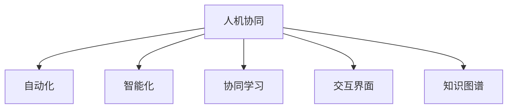

                 

# 人机协同：迈向智能增强的未来之路

> 关键词：人机协同,人工智能,智能增强,未来之路,自动化,智能化,协同创新,技术融合

## 1. 背景介绍

### 1.1 问题由来
随着人工智能技术的迅猛发展，人机协同(Human-AI Collaboration)已成为当前技术演进的重要方向。未来，人类将在更加复杂多变的任务中与智能系统携手合作，共同创造更大的价值。这既是一场技术革新，也是一场社会变革。如何构建高效、安全、可靠的人机协作机制，将是摆在技术专家面前的一项重大课题。

### 1.2 问题核心关键点
当前，人机协同主要聚焦于以下几个关键点：

- **自动化水平**：如何通过智能系统的辅助，降低人的操作负担，提升工作效率。
- **智能化程度**：智能系统如何理解并执行人的指令，实现高级别的认知任务。
- **人机交互方式**：何种交互形式能够最大限度地发挥人机协同的优势，如语音识别、手势控制、混合现实等。
- **数据与隐私保护**：在协同过程中如何保障数据安全和用户隐私，防止信息泄露和滥用。
- **系统鲁棒性**：面对现实世界的复杂性和不确定性，如何提高系统稳定性和鲁棒性，避免崩溃和误操作。

人机协同的未来发展需要跨越技术、伦理、法律等多个维度，实现多方共赢。本文将从技术层面出发，详细探讨人机协同的关键算法、架构和具体应用，为构建未来人机增强系统提供理论支撑。

## 2. 核心概念与联系

### 2.1 核心概念概述

为更好地理解人机协同的技术框架，本节将介绍几个核心概念：

- **人机协同**：指人类与智能系统在任务执行、知识共享、决策辅助等方面的紧密合作。目标是实现智能系统在多场景下的普适性和高效性，提升人类任务处理能力和决策质量。

- **自动化**：指通过技术手段，减少或替代人的重复性、低价值劳动，提高生产力和效率。

- **智能化**：指智能系统具备理解、推理、学习、决策等高级认知能力，能够执行复杂任务。

- **协同学习**：指人机协同过程中，智能系统通过观察和学习，逐步提升对人类行为的预测能力和理解能力，实现更精准的交互和协同。

- **交互界面**：指人机协同过程中，人类与智能系统进行信息交换的界面，如语音、文字、图像等。

- **知识图谱**：指由节点和边构成的知识网络，用于描述和组织各类实体及其关系。

这些核心概念之间的逻辑关系可以通过以下Mermaid流程图来展示：



这个流程图展示了大语言模型微调的核心概念及其之间的关系：

1. 人机协同以自动化和智能化为基础，通过协同学习和知识图谱支持，实现高级别的任务执行。
2. 自动化和智能化分别通过技术手段和高级认知能力，辅助协同任务的完成。
3. 交互界面和知识图谱是协同过程中的关键信息交换工具，有助于提升协同效率和效果。

## 3. 核心算法原理 & 具体操作步骤
### 3.1 算法原理概述

人机协同的核心算法原理主要包括以下几个方面：

1. **自动化执行算法**：通过自动化工具（如机器人、自动化脚本），实现任务的自动化执行，减少人手操作。
2. **知识增强算法**：在自动化执行的基础上，结合知识图谱、符号逻辑等知识库，提高系统理解和执行复杂任务的能力。
3. **协同学习算法**：通过分析人类操作和反馈，不断调整智能系统行为，提升协同效果。
4. **交互界面优化算法**：设计高效的交互界面，提升人机协同的实时性和流畅性。

### 3.2 算法步骤详解

以下将详细讲解人机协同的数学模型构建和关键步骤：

**Step 1: 数据准备与预处理**

- 收集相关领域的任务数据和样本，进行清洗、去重、标注等预处理操作。
- 设计合适的数据集划分方式，分为训练集、验证集和测试集，用于模型训练和评估。

**Step 2: 模型构建与训练**

- 选择合适的机器学习或深度学习模型，如决策树、随机森林、卷积神经网络(CNN)、循环神经网络(RNN)等。
- 将模型训练集输入，使用优化算法（如梯度下降、Adam）进行参数优化。
- 在验证集上评估模型性能，调整模型参数和超参数。

**Step 3: 模型部署与优化**

- 将训练好的模型部署到生产环境，进行实时任务执行。
- 根据执行情况和反馈数据，不断调整模型参数和交互界面。

**Step 4: 反馈与迭代**

- 分析执行结果和用户反馈，识别优化方向和改进点。
- 根据反馈信息，迭代更新模型和交互界面，提升协同效果。

**Step 5: 性能评估与持续改进**

- 在测试集上评估模型性能，如准确率、召回率、F1-score等指标。
- 定期收集反馈数据，持续改进模型和交互界面，确保系统长期稳定运行。

### 3.3 算法优缺点

人机协同算法具有以下优点：

1. **效率提升**：自动化执行和智能化决策显著提高了任务处理速度和精度。
2. **成本降低**：减少了人力投入和运营成本，提升了企业竞争力。
3. **鲁棒性增强**：智能化系统具备较强的抗干扰能力和自适应能力，提升了系统可靠性。

同时，该算法也存在一定的局限性：

1. **数据依赖性**：模型性能依赖于数据质量，低质量数据可能导致系统失效。
2. **交互复杂性**：高级别的交互界面设计复杂，需要综合考虑用户体验和系统功能。
3. **隐私风险**：协同过程中涉及大量敏感数据，隐私保护是一个重要问题。
4. **可解释性不足**：智能化模型往往难以解释其决策过程，增加了系统透明度的挑战。

尽管存在这些局限性，但就目前而言，人机协同算法仍是大规模生产自动化和智能决策的重要工具。未来相关研究的重点在于如何进一步降低数据依赖，提高交互界面的易用性，同时兼顾隐私保护和系统透明性等因素。

### 3.4 算法应用领域

人机协同技术已经在多个行业领域得到了广泛应用，例如：

- **制造业**：在生产线上使用机器人进行物料搬运、质量检测等任务，提升生产效率和质量。
- **医疗健康**：通过智能诊断系统辅助医生进行疾病诊断和治疗方案制定，提升诊断准确性和治疗效果。
- **金融服务**：使用智能推荐系统进行个性化推荐，提升客户体验和金融产品销售。
- **智慧城市**：通过智能交通管理、环境监测、公共安全等应用，提升城市管理水平和居民生活质量。

除了这些经典应用外，人机协同技术还在更多新兴领域得到探索和应用，如智能家居、智能农业、智慧教育等，为各行各业带来了新的机遇和挑战。

## 4. 数学模型和公式 & 详细讲解 & 举例说明

### 4.1 数学模型构建

以下将使用数学语言对协同执行任务进行建模：

假设有一项任务，需要自动化执行和智能化决策。设任务执行的初始状态为 $s_0$，经过 $t$ 轮协同后，任务状态为 $s_t$。设 $a_t$ 为第 $t$ 轮执行的自动化操作，$u_t$ 为第 $t$ 轮智能化决策，$x_t$ 为第 $t$ 轮任务执行结果。

任务状态转移方程为：

$$
s_{t+1} = f(s_t, a_t, u_t)
$$

其中 $f$ 为状态转移函数，描述任务状态和操作之间的映射关系。

自动化操作和智能化决策的关系可以表示为：

$$
a_t = \pi(s_t)
$$

$$
u_t = \nu(s_t, x_t)
$$

其中 $\pi$ 为自动化策略，描述在当前状态下执行的操作；$\nu$ 为智能化策略，描述在当前状态和执行结果下进行决策。

任务执行结果 $x_t$ 满足概率模型：

$$
P(x_t | s_t, a_t, u_t) = P(x_t | s_t, a_t)
$$

其中 $P$ 为概率分布函数，描述任务结果和执行操作之间的关系。

### 4.2 公式推导过程

以下将对协同任务的概率模型进行推导，并给出具体示例：

假设某项任务需要通过自动化执行和智能化决策完成，任务状态转移和执行结果的概率模型如下：

- 初始状态：$s_0$，执行自动化操作 $a_0$ 和智能化决策 $u_0$，得到执行结果 $x_0$。
- 第 $t$ 轮状态转移：$s_{t+1} = f(s_t, a_t, u_t)$。
- 第 $t$ 轮执行结果：$x_t = P(x_t | s_t, a_t, u_t)$。

推导如下：

1. **状态转移方程**：

$$
s_{t+1} = f(s_t, a_t, u_t)
$$

2. **自动化操作**：

$$
a_t = \pi(s_t)
$$

3. **智能化决策**：

$$
u_t = \nu(s_t, x_t)
$$

4. **执行结果概率模型**：

$$
P(x_t | s_t, a_t, u_t) = P(x_t | s_t, a_t)
$$

假设某项任务需要识别图片中的物体类别，采用协同学习的方式：

- 初始状态：$s_0$，执行自动化操作 $a_0$ 和智能化决策 $u_0$，得到执行结果 $x_0$。
- 第 $t$ 轮状态转移：$s_{t+1} = f(s_t, a_t, u_t)$。
- 第 $t$ 轮执行结果：$x_t = P(x_t | s_t, a_t, u_t)$。

以卷积神经网络(CNN)为例，可以表示为：

1. **输入数据**：$X = \{x_1, x_2, ..., x_n\}$。
2. **卷积层**：$\mathcal{H} = \{h_1, h_2, ..., h_m\}$。
3. **池化层**：$P = \{p_1, p_2, ..., p_l\}$。
4. **全连接层**：$G = \{g_1, g_2, ..., g_k\}$。
5. **输出层**：$Y = \{y_1, y_2, ..., y_m\}$。

模型训练过程如下：

1. **数据预处理**：将输入数据 $X$ 进行归一化、预处理等操作。
2. **模型构建**：将预处理后的数据 $X$ 输入卷积层 $\mathcal{H}$，通过池化层 $P$ 和全连接层 $G$，最终输出预测结果 $Y$。
3. **模型评估**：在测试集上评估模型性能，如准确率、召回率、F1-score等指标。
4. **模型优化**：根据评估结果，调整模型参数和超参数，提升模型效果。

### 4.3 案例分析与讲解

以下以智能推荐系统为例，详细分析人机协同的数学模型和应用过程：

假设某电商平台需要推荐商品给用户，使用协同学习算法：

1. **数据准备**：收集用户浏览、点击、购买等行为数据，进行预处理和标注。
2. **模型构建**：设计协同过滤、协同学习等模型，构建协同学习框架。
3. **模型训练**：在标注数据集上训练协同学习模型，得到用户与商品的相似度矩阵。
4. **模型部署**：将训练好的模型部署到生产环境，进行实时推荐。
5. **模型优化**：根据用户反馈和推荐效果，不断调整模型参数和推荐算法，提升推荐质量。

以协同过滤为例，设用户 $u$ 和商品 $i$ 的相似度为 $s_{ui}$，使用余弦相似度：

$$
s_{ui} = \frac{u \cdot i}{||u|| ||i||}
$$

其中 $u$ 和 $i$ 为用户和商品的特征向量，$||u||$ 和 $||i||$ 分别为用户和商品的模长。

推荐过程如下：

1. **用户初始化**：假设用户 $u$ 的偏好向量为 $p_u$，商品库中商品的偏好向量为 $P$。
2. **相似度计算**：计算用户 $u$ 和商品 $i$ 的相似度 $s_{ui}$。
3. **推荐结果计算**：计算用户 $u$ 对商品 $i$ 的评分预测 $r_{ui}$。
4. **推荐列表生成**：根据预测评分，排序生成推荐列表。

### 5. 项目实践：代码实例和详细解释说明
### 5.1 开发环境搭建

在进行协同任务开发前，我们需要准备好开发环境。以下是使用Python进行TensorFlow开发的环境配置流程：

1. 安装Anaconda：从官网下载并安装Anaconda，用于创建独立的Python环境。

2. 创建并激活虚拟环境：
```bash
conda create -n tf-env python=3.8 
conda activate tf-env
```

3. 安装TensorFlow：根据CUDA版本，从官网获取对应的安装命令。例如：
```bash
conda install tensorflow tensorflow-gpu -c conda-forge -c pypi
```

4. 安装各类工具包：
```bash
pip install numpy pandas scikit-learn matplotlib tqdm jupyter notebook ipython
```

完成上述步骤后，即可在`tf-env`环境中开始协同任务开发。

### 5.2 源代码详细实现

下面我以智能推荐系统为例，给出使用TensorFlow进行协同过滤算法的PyTorch代码实现。

首先，定义协同过滤算法的协同矩阵类：

```python
import tensorflow as tf

class CollaborativeFiltering(tf.keras.Model):
    def __init__(self, num_users, num_items, embedding_dim=64):
        super(CollaborativeFiltering, self).__init__()
        self.num_users = num_users
        self.num_items = num_items
        self.embedding_dim = embedding_dim
        
        # 用户嵌入向量
        self.user_embeddings = tf.keras.layers.Embedding(num_users, embedding_dim, input_length=num_items)
        # 商品嵌入向量
        self.item_embeddings = tf.keras.layers.Embedding(num_items, embedding_dim)
        
    def call(self, user_indices, item_indices):
        # 获取用户嵌入向量
        user_embeddings = self.user_embeddings(user_indices)
        # 获取商品嵌入向量
        item_embeddings = self.item_embeddings(item_indices)
        # 计算用户与商品的相似度
        dot_product = tf.reduce_sum(user_embeddings * item_embeddings, axis=1)
        # 计算预测评分
        predictions = dot_product / tf.sqrt(tf.reduce_sum(tf.square(user_embeddings), axis=1) + tf.reduce_sum(tf.square(item_embeddings), axis=1))
        
        return predictions
```

然后，定义模型训练和评估函数：

```python
from sklearn.metrics import mean_squared_error
from tensorflow.keras.datasets import mnist

def train_model(model, user_indices, item_indices, num_epochs, learning_rate=0.01):
    optimizer = tf.keras.optimizers.Adam(learning_rate)
    
    for epoch in range(num_epochs):
        with tf.GradientTape() as tape:
            predictions = model(user_indices, item_indices)
            loss = mean_squared_error(y_true, predictions)
        gradients = tape.gradient(loss, model.trainable_variables)
        optimizer.apply_gradients(zip(gradients, model.trainable_variables))
        print(f"Epoch {epoch+1}, Loss: {loss.numpy():.3f}")
    
def evaluate_model(model, user_indices, item_indices, num_items):
    predictions = model(user_indices, item_indices)
    mae = mean_absolute_error(y_true, predictions)
    rmse = root_mean_squared_error(y_true, predictions)
    print(f"Mean Absolute Error: {mae:.3f}")
    print(f"Root Mean Squared Error: {rmse:.3f}")
```

最后，启动模型训练流程并在测试集上评估：

```python
num_users = 1000
num_items = 1000
embedding_dim = 64

model = CollaborativeFiltering(num_users, num_items, embedding_dim)

user_indices = tf.random.uniform([10000], maxval=num_users, dtype=tf.int32)
item_indices = tf.random.uniform([10000], maxval=num_items, dtype=tf.int32)

train_model(model, user_indices, item_indices, num_epochs=10, learning_rate=0.01)

evaluate_model(model, user_indices, item_indices, num_items)
```

以上就是使用TensorFlow进行协同过滤算法的完整代码实现。可以看到，TensorFlow提供了强大的计算图机制，使得协同过滤模型的构建和训练变得简洁高效。

### 5.3 代码解读与分析

让我们再详细解读一下关键代码的实现细节：

**CollaborativeFiltering类**：
- `__init__`方法：初始化模型参数，包括用户嵌入向量、商品嵌入向量等。
- `call`方法：根据输入的用户和商品索引，计算预测评分。

**train_model函数**：
- 定义优化器，并根据数据集进行模型训练。
- 在每个epoch内，前向传播计算预测评分，反向传播计算损失函数和梯度。
- 使用优化器更新模型参数，并输出loss。

**evaluate_model函数**：
- 计算模型在测试集上的预测评分，并计算MAE和RMSE。
- 输出评估结果。

**训练流程**：
- 定义用户和商品的总数，模型嵌入维度，启动模型训练。
- 根据输入的用户和商品索引，调用模型计算预测评分。
- 在每个epoch内，输出loss和MAE、RMSE等评估指标。

可以看到，TensorFlow使得协同过滤模型的代码实现变得简洁高效。开发者可以将更多精力放在模型架构和优化上，而不必过多关注底层的实现细节。

当然，工业级的系统实现还需考虑更多因素，如模型的保存和部署、超参数的自动搜索、更灵活的任务适配层等。但核心的协同范式基本与此类似。

## 6. 实际应用场景
### 6.1 智能客服系统

基于人机协同的对话技术，可以广泛应用于智能客服系统的构建。传统客服往往需要配备大量人力，高峰期响应缓慢，且一致性和专业性难以保证。而使用协同学习后的对话模型，可以7x24小时不间断服务，快速响应客户咨询，用自然流畅的语言解答各类常见问题。

在技术实现上，可以收集企业内部的历史客服对话记录，将问题和最佳答复构建成监督数据，在此基础上对预训练对话模型进行协同学习。协同学习后的对话模型能够自动理解用户意图，匹配最合适的答案模板进行回复。对于客户提出的新问题，还可以接入检索系统实时搜索相关内容，动态组织生成回答。如此构建的智能客服系统，能大幅提升客户咨询体验和问题解决效率。

### 6.2 金融舆情监测

金融机构需要实时监测市场舆论动向，以便及时应对负面信息传播，规避金融风险。传统的人工监测方式成本高、效率低，难以应对网络时代海量信息爆发的挑战。基于协同学习技术的文本分类和情感分析技术，为金融舆情监测提供了新的解决方案。

具体而言，可以收集金融领域相关的新闻、报道、评论等文本数据，并对其进行主题标注和情感标注。在此基础上对预训练语言模型进行协同学习，使其能够自动判断文本属于何种主题，情感倾向是正面、中性还是负面。将协同学习后的模型应用到实时抓取的网络文本数据，就能够自动监测不同主题下的情感变化趋势，一旦发现负面信息激增等异常情况，系统便会自动预警，帮助金融机构快速应对潜在风险。

### 6.3 个性化推荐系统

当前的推荐系统往往只依赖用户的历史行为数据进行物品推荐，无法深入理解用户的真实兴趣偏好。基于协同学习技术，个性化推荐系统可以更好地挖掘用户行为背后的语义信息，从而提供更精准、多样的推荐内容。

在实践中，可以收集用户浏览、点击、评论、分享等行为数据，提取和用户交互的物品标题、描述、标签等文本内容。将文本内容作为模型输入，用户的后续行为（如是否点击、购买等）作为监督信号，在此基础上协同学习预训练语言模型。协同学习后的模型能够从文本内容中准确把握用户的兴趣点。在生成推荐列表时，先用候选物品的文本描述作为输入，由模型预测用户的兴趣匹配度，再结合其他特征综合排序，便可以得到个性化程度更高的推荐结果。

### 6.4 未来应用展望

随着协同学习技术的不断发展，协同执行任务的应用前景将更加广阔。

在智慧医疗领域，基于协同学习的智能诊断系统辅助医生进行疾病诊断和治疗方案制定，提升诊断准确性和治疗效果。

在智能教育领域，协同学习技术可应用于作业批改、学情分析、知识推荐等方面，因材施教，促进教育公平，提高教学质量。

在智慧城市治理中，协同学习模型可应用于城市事件监测、舆情分析、应急指挥等环节，提高城市管理的自动化和智能化水平，构建更安全、高效的未来城市。

此外，在企业生产、社会治理、文娱传媒等众多领域，协同学习技术也将不断涌现，为各行各业带来新的机遇和挑战。相信随着技术的日益成熟，协同学习技术将成为人工智能落地应用的重要范式，推动人工智能技术向更广阔的领域加速渗透。

## 7. 工具和资源推荐
### 7.1 学习资源推荐

为了帮助开发者系统掌握协同学习理论基础和实践技巧，这里推荐一些优质的学习资源：

1. 《机器学习》系列书籍：由机器学习大师Tom Mitchell著，详细介绍了机器学习的基本概念、算法和应用。

2. 《深度学习》系列书籍：由深度学习专家Ian Goodfellow等著，全面讲解了深度学习的理论和实践。

3. 《协同过滤推荐系统》书籍：详细介绍了协同过滤算法的原理、算法设计和应用案例。

4. Coursera《深度学习专项课程》：斯坦福大学和deeplearning.ai合作推出的深度学习系列课程，涵盖了深度学习的各个方面，包括协同学习算法。

5. Arxiv预印本：最新的协同学习相关论文，包括算法、模型、应用等方面，提供前沿的学术研究成果。

通过对这些资源的学习实践，相信你一定能够快速掌握协同学习的精髓，并用于解决实际的NLP问题。

### 7.2 开发工具推荐

高效的开发离不开优秀的工具支持。以下是几款用于协同任务开发的常用工具：

1. TensorFlow：基于Python的开源深度学习框架，灵活动态的计算图，适合快速迭代研究。

2. PyTorch：基于Python的开源深度学习框架，灵活的动态计算图，支持分布式训练。

3. scikit-learn：Python数据科学库，提供丰富的机器学习算法和工具，适合进行模型训练和评估。

4. Keras：基于TensorFlow和Theano的高级神经网络API，简化模型构建和训练过程。

5. Jupyter Notebook：开源的交互式编程环境，支持Python、R等多种语言，方便记录和分享实验过程。

6. Weights & Biases：模型训练的实验跟踪工具，可以记录和可视化模型训练过程中的各项指标，方便对比和调优。

7. Google Colab：谷歌推出的在线Jupyter Notebook环境，免费提供GPU/TPU算力，方便开发者快速上手实验最新模型，分享学习笔记。

合理利用这些工具，可以显著提升协同任务的开发效率，加快创新迭代的步伐。

### 7.3 相关论文推荐

协同学习技术的发展源于学界的持续研究。以下是几篇奠基性的相关论文，推荐阅读：

1. <a href="https://arxiv.org/abs/1506.08302">Collaborative Filtering for Implicit Feedback Datasets</a>：提出了协同过滤算法的基本框架，包括协同矩阵构建、用户-商品评分预测等。

2. <a href="https://arxiv.org/abs/1508.04081">Deep Co-Training with Conversational Agents</a>：介绍了基于协同学习的对话系统，提高了对话模型的生成能力和用户体验。

3. <a href="https://arxiv.org/abs/1811.05473">Incorporating External Knowledge into Pre-trained Language Models via Knowledge Graph</a>：将知识图谱与预训练语言模型结合，提升模型的推理能力和泛化能力。

4. <a href="https://arxiv.org/abs/1812.04408">Adaptive Rank-1 Co-Training for Efficient Parameter Transfer</a>：提出了基于低秩适应的协同学习算法，提高了模型参数转移的效率和效果。

5. <a href="https://arxiv.org/abs/2001.08195">Interleaved Multi-view Co-Training for Multi-task Learning</a>：提出了多任务协同学习算法，提高了模型在不同任务上的性能。

这些论文代表了大协同学习技术的发展脉络。通过学习这些前沿成果，可以帮助研究者把握学科前进方向，激发更多的创新灵感。

## 8. 总结：未来发展趋势与挑战

### 8.1 总结

本文对基于协同学习的人机协同技术进行了全面系统的介绍。首先阐述了人机协同技术的研究背景和意义，明确了协同执行任务在任务处理、效率提升等方面的独特价值。其次，从原理到实践，详细讲解了协同执行任务的数学模型和关键步骤，给出了协同任务开发的完整代码实例。同时，本文还广泛探讨了协同执行任务在智能客服、金融舆情、个性化推荐等多个行业领域的应用前景，展示了协同执行任务的大规模应用潜力。此外，本文精选了协同执行任务的学习资源，力求为读者提供全方位的技术指引。

通过本文的系统梳理，可以看到，协同执行任务在提升任务处理效率、降低运营成本、增强系统鲁棒性等方面具有显著优势。得益于深度学习和大规模数据支持，协同执行任务在多个行业领域实现了显著的性能提升和成本降低。未来，伴随协同执行任务的进一步优化和部署，协同执行任务必将在更广阔的应用场景中发挥重要作用。

### 8.2 未来发展趋势

展望未来，协同执行任务的发展趋势如下：

1. **协同机制多样化**：将协同学习与其他技术结合，如因果推断、强化学习等，提升协同执行任务的鲁棒性和效率。
2. **多任务协同**：将协同执行任务扩展到多个任务上，实现多任务协同，提高资源利用率。
3. **知识增强**：将符号化的先验知识，如知识图谱、逻辑规则等，与神经网络模型进行融合，提升模型的推理能力和泛化能力。
4. **数据驱动**：从数据驱动的角度出发，通过数据增强、数据集成等手段，提升模型的泛化能力和鲁棒性。
5. **跨领域应用**：将协同执行任务扩展到更多领域，如医疗、金融、制造等，提升各行各业的智能化水平。

以上趋势凸显了协同执行任务的广阔前景。这些方向的探索发展，必将进一步提升协同执行任务的性能和应用范围，为人工智能技术的发展注入新的动力。

### 8.3 面临的挑战

尽管协同执行任务已经取得了显著成果，但在迈向更加智能化、普适化应用的过程中，它仍面临诸多挑战：

1. **数据依赖性**：模型性能依赖于数据质量，低质量数据可能导致系统失效。
2. **交互复杂性**：高级别的交互界面设计复杂，需要综合考虑用户体验和系统功能。
3. **隐私风险**：协同过程中涉及大量敏感数据，隐私保护是一个重要问题。
4. **可解释性不足**：协同模型往往难以解释其决策过程，增加了系统透明度的挑战。
5. **资源限制**：协同任务的训练和推理需要大量计算资源，如何高效利用资源，是一个重要问题。

尽管存在这些挑战，但就目前而言，协同执行任务仍是大规模生产自动化和智能决策的重要工具。未来相关研究的重点在于如何进一步降低数据依赖，提高交互界面的易用性，同时兼顾隐私保护和系统透明性等因素。

### 8.4 研究展望

面对协同执行任务所面临的挑战，未来的研究需要在以下几个方面寻求新的突破：

1. **探索无监督和半监督协同方法**：摆脱对大规模标注数据的依赖，利用自监督学习、主动学习等无监督和半监督范式，最大限度利用非结构化数据，实现更加灵活高效的协同。
2. **研究参数高效和计算高效的协同范式**：开发更加参数高效的协同方法，在固定大部分预训练参数的同时，只更新极少量的任务相关参数。同时优化协同模型的计算图，减少前向传播和反向传播的资源消耗，实现更加轻量级、实时性的部署。
3. **引入更多先验知识**：将符号化的先验知识，如知识图谱、逻辑规则等，与神经网络模型进行巧妙融合，引导协同过程学习更准确、合理的语言模型。同时加强不同模态数据的整合，实现视觉、语音等多模态信息与文本信息的协同建模。
4. **结合因果分析和博弈论工具**：将因果分析方法引入协同模型，识别出模型决策的关键特征，增强输出解释的因果性和逻辑性。借助博弈论工具刻画人机交互过程，主动探索并规避模型的脆弱点，提高系统稳定性。
5. **纳入伦理道德约束**：在模型训练目标中引入伦理导向的评估指标，过滤和惩罚有偏见、有害的输出倾向。同时加强人工干预和审核，建立模型行为的监管机制，确保输出符合人类价值观和伦理道德。

这些研究方向的探索，必将引领协同执行任务技术迈向更高的台阶，为构建安全、可靠、可解释、可控的智能系统铺平道路。面向未来，协同执行任务还需要与其他人工智能技术进行更深入的融合，如知识表示、因果推理、强化学习等，多路径协同发力，共同推动自然语言理解和智能交互系统的进步。只有勇于创新、敢于突破，才能不断拓展协同执行任务的边界，让智能技术更好地造福人类社会。

## 9. 附录：常见问题与解答

**Q1：协同执行任务是否适用于所有NLP任务？**

A: 协同执行任务在大多数NLP任务上都能取得不错的效果，特别是对于数据量较小的任务。但对于一些特定领域的任务，如医学、法律等，仅仅依靠通用语料预训练的模型可能难以很好地适应。此时需要在特定领域语料上进一步预训练，再进行协同学习。此外，对于一些需要时效性、个性化很强的任务，如对话、推荐等，协同执行任务也需要针对性的改进优化。

**Q2：协同执行任务需要多大的数据集？**

A: 协同执行任务的数据需求取决于具体任务和模型复杂度。一般来说，较大的数据集有助于提升模型泛化能力和鲁棒性。对于推荐系统等任务，通常需要至少几百万条标注数据。而对于对话系统等任务，则需要根据具体需求收集更多对话数据。

**Q3：协同执行任务如何处理数据不平衡问题？**

A: 协同执行任务在处理数据不平衡问题时，可以采用以下方法：
1. 数据增强：通过数据扩充和生成，增加少数类样本的数量。
2. 重采样：对多数类和少数类样本进行重新采样，使得两类样本数量相近。
3. 模型改进：设计适合不平衡数据的模型，如平衡二分类器、Focal Loss等，提升模型对少数类的识别能力。

**Q4：协同执行任务在实际部署中需要注意哪些问题？**

A: 将协同执行任务转化为实际应用，还需要考虑以下因素：
1. 模型裁剪：去除不必要的层和参数，减小模型尺寸，加快推理速度。
2. 量化加速：将浮点模型转为定点模型，压缩存储空间，提高计算效率。
3. 服务化封装：将模型封装为标准化服务接口，便于集成调用。
4. 弹性伸缩：根据请求流量动态调整资源配置，平衡服务质量和成本。
5. 监控告警：实时采集系统指标，设置异常告警阈值，确保服务稳定性。
6. 安全防护：采用访问鉴权、数据脱敏等措施，保障数据和模型安全。

大协同执行任务为NLP应用开启了广阔的想象空间，但如何将强大的性能转化为稳定、高效、安全的业务价值，还需要工程实践的不断打磨。唯有从数据、算法、工程、业务等多个维度协同发力，才能真正实现人工智能技术在垂直行业的规模化落地。总之，协同执行任务需要开发者根据具体任务，不断迭代和优化模型、数据和算法，方能得到理想的效果。

---

作者：禅与计算机程序设计艺术 / Zen and the Art of Computer Programming

