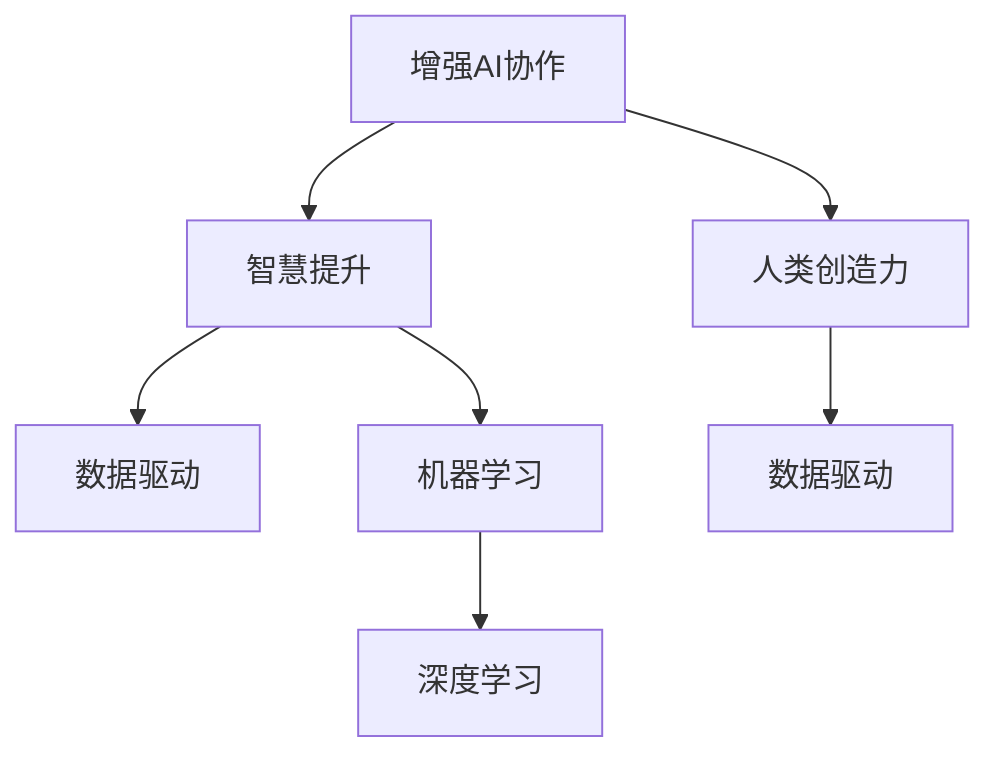

                 

# 人类-AI协作：增强人类智慧和创造力

> 关键词：增强AI协作,智慧提升,人类创造力,机器学习,深度学习,数据驱动,未来趋势

## 1. 背景介绍

### 1.1 问题由来

随着人工智能（AI）技术的迅猛发展，机器学习和深度学习在诸多领域取得了显著进展。然而，AI系统的局限性也在逐渐显现：它们在处理复杂多变的环境、灵活应对非结构化数据、解决实际问题等方面仍有较大挑战。与此同时，人类在创造力、智慧、直觉等方面的优势逐渐凸显，成为AI难以替代的重要资源。

近年来，“人类-AI协作”成为一种新的趋势，旨在通过将AI和人类的优势有机结合，共同应对复杂任务，提升整体能力。这种协作模式不仅能够弥补AI在理解复杂情境、处理模糊信息和进行创造性思维等方面的不足，还能够发挥人类在判断力、情感理解和人际沟通等方面的独特能力。这种协作模式，有望在提升人类智慧和创造力的同时，推动AI技术的发展和应用。

### 1.2 问题核心关键点

1. **增强AI协作**：如何通过AI技术增强人类在解决问题、创新思考等方面的能力。
2. **智慧提升**：如何通过AI辅助决策，提升人类的认知能力和判断力。
3. **人类创造力**：如何利用AI在生成内容、设计思维等方面的能力，激发人类的创造力。
4. **机器学习与深度学习**：如何选择和设计合适的算法，以实现人类-AI的协作。
5. **数据驱动**：如何通过数据驱动的方式，优化人类-AI协作系统。
6. **未来趋势**：人类-AI协作的未来方向和挑战。

## 2. 核心概念与联系

### 2.1 核心概念概述

为了更好地理解人类-AI协作的概念，我们首先对其中几个核心概念进行梳理：

- **增强AI协作**：通过AI技术增强人类的认知、决策和创造力，使人类与AI系统相互补充，共同解决复杂问题。
- **智慧提升**：利用AI技术辅助决策和信息处理，提升人类的认知能力和判断力，更好地理解和处理复杂情境。
- **人类创造力**：借助AI在生成内容、设计思维等方面的能力，激发和拓展人类的创造力和创新潜力。
- **机器学习与深度学习**：通过机器学习和深度学习算法，使AI具备从数据中学习和自我优化的能力，实现与人类协作。
- **数据驱动**：利用大数据和分析技术，优化AI和人类的协作过程，提高系统效率和效果。

这些概念通过以下Mermaid流程图进行联系：



这个流程图展示了各概念之间的关系：

1. 增强AI协作是目标，通过智慧提升和人类创造力实现。
2. 数据驱动是优化协作过程的基础，机器学习和深度学习是实现协作的技术手段。

## 3. 核心算法原理 & 具体操作步骤
### 3.1 算法原理概述

人类-AI协作的核心在于利用AI技术增强人类在智慧和创造力方面的能力。具体而言，可以分为以下几个步骤：

1. **数据收集与预处理**：收集人类和AI系统相关的数据，并进行预处理，如清洗、标注等，以确保数据的质量和可用性。
2. **算法选择与设计**：选择合适的机器学习或深度学习算法，设计适合的任务模型，并根据数据特点进行调整。
3. **系统集成与优化**：将AI算法与人类工作流程进行集成，通过不断优化协作流程，提升整体系统效率。
4. **反馈与迭代**：收集协作过程中的反馈信息，对系统进行迭代优化，逐步提升协作效果。

### 3.2 算法步骤详解

以下是一个详细的步骤分解：

**Step 1: 数据收集与预处理**

1. **数据收集**：
   - 从实际应用场景中收集人类和AI系统交互的数据，如用户操作记录、AI生成内容、问题解答等。
   - 确定数据类型和格式，如文本、图像、语音等，以及相关的特征指标。

2. **数据预处理**：
   - 对数据进行清洗，去除噪声和错误信息。
   - 进行数据标注，为AI系统提供有标签的训练样本。
   - 进行特征提取，将原始数据转换为模型可处理的特征向量。

**Step 2: 算法选择与设计**

1. **选择合适的算法**：
   - 根据任务特点，选择适当的机器学习或深度学习算法，如分类、回归、聚类、生成模型等。
   - 评估算法的适用性和效率，确保算法能够适应复杂的协作场景。

2. **模型设计**：
   - 设计适合任务的模型结构，如神经网络、决策树、支持向量机等。
   - 确定模型的超参数，如学习率、迭代次数、正则化等，并进行初始化。

**Step 3: 系统集成与优化**

1. **集成AI算法**：
   - 将选择的算法集成到人类工作流程中，如决策支持、内容生成等。
   - 通过API、插件等方式，实现AI与人类系统的无缝对接。

2. **系统优化**：
   - 优化AI和人类的协作流程，提高系统响应速度和效率。
   - 通过A/B测试等方法，验证协作效果，进行持续改进。

**Step 4: 反馈与迭代**

1. **收集反馈**：
   - 收集人类和AI系统在协作过程中的反馈信息，如用户满意度、问题解决效率等。
   - 通过问卷调查、日志分析等方式，获取数据支持。

2. **迭代优化**：
   - 根据反馈信息，对AI算法和人类工作流程进行调整和优化。
   - 重复上述步骤，逐步提升协作效果，实现最佳用户体验。

### 3.3 算法优缺点

增强AI协作的算法具有以下优点：

1. **提升效率**：AI算法可以处理大量数据，快速生成解决方案，提高人类工作效率。
2. **优化决策**：AI能够基于数据进行客观分析，辅助人类做出更加科学合理的决策。
3. **创新思维**：AI在生成内容、设计方案等方面的能力，可以激发人类的创造力。
4. **适应性强**：AI算法可以根据数据反馈进行自我优化，适应复杂多变的任务场景。

同时，算法也存在一些缺点：

1. **数据依赖**：AI系统依赖高质量、丰富多样的数据，数据收集和标注成本较高。
2. **模型鲁棒性**：AI算法在处理噪声、异常数据时容易受到影响，需要额外的处理机制。
3. **交互限制**：AI与人类之间的交互可能存在理解误差，需要设计合适的接口和反馈机制。
4. **伦理挑战**：AI在生成内容、决策过程中可能存在偏见和歧视，需要关注伦理问题。

### 3.4 算法应用领域

增强AI协作的算法已经在多个领域得到应用，包括但不限于：

- **医疗领域**：通过AI辅助诊断和治疗，提升医疗服务的质量和效率。
- **教育领域**：利用AI进行个性化教学和内容推荐，提升学习效果和用户体验。
- **金融领域**：使用AI进行风险评估和投资建议，提升金融决策的科学性和准确性。
- **制造业**：通过AI优化生产流程和设备维护，提高生产效率和产品质量。
- **创意产业**：利用AI进行内容生成和设计，激发人类的创意和创新。

这些领域的应用展示了增强AI协作的广泛潜力和实际价值。

## 4. 数学模型和公式 & 详细讲解
### 4.1 数学模型构建

为了更好地理解增强AI协作的数学模型，我们将通过以下公式进行详细讲解。

**Step 1: 数据预处理**

设原始数据集为 $D=\{(x_i,y_i)\}_{i=1}^N$，其中 $x_i$ 为输入特征，$y_i$ 为标签。预处理过程包括数据清洗、标注和特征提取，其数学模型为：

$$
\hat{x_i} = \text{Preprocess}(x_i)
$$

其中 $\hat{x_i}$ 为预处理后的特征向量。

**Step 2: 算法选择与设计**

设选择的算法为 $M$，其输入为预处理后的特征向量 $\hat{x_i}$，输出为预测结果 $\hat{y_i}$。模型的数学表达式为：

$$
\hat{y_i} = M(\hat{x_i})
$$

**Step 3: 系统集成与优化**

设人类工作流程为 $H$，AI系统与人类协作的输出为 $O$。系统优化的目标为最大化协作效率，其数学模型为：

$$
\max_{H, M} \eta(O)
$$

其中 $\eta$ 为协作效率的评估函数。

**Step 4: 反馈与迭代**

设反馈信息为 $F$，迭代优化过程为 $O_{t+1} = f(O_t, F)$，其中 $O_t$ 为第 $t$ 次迭代的结果，$f$ 为迭代优化函数。迭代优化的数学模型为：

$$
O_{t+1} = \text{Optimize}(O_t, F)
$$

### 4.2 公式推导过程

以下我们将以医疗领域的诊断为例，推导增强AI协作的数学模型。

**Step 1: 数据预处理**

医疗数据通常包括病人的症状、病史、检查结果等。设原始数据为 $D=\{(s_i, d_i)\}_{i=1}^N$，其中 $s_i$ 为症状，$d_i$ 为疾病。预处理过程包括清洗、标注和特征提取：

$$
\hat{s_i} = \text{Preprocess}(s_i)
$$

其中 $\hat{s_i}$ 为清洗后的症状特征向量。

**Step 2: 算法选择与设计**

设选择的算法为 $M$，为分类算法，如逻辑回归、支持向量机等。模型输出为疾病预测结果 $\hat{d_i}$：

$$
\hat{d_i} = M(\hat{s_i})
$$

**Step 3: 系统集成与优化**

设医疗专家为 $H$，AI系统与专家协作的输出为诊断结果 $O$：

$$
O = \text{Doctor}(H, \hat{d_i})
$$

其中 $\text{Doctor}$ 为医疗专家的诊断函数。

**Step 4: 反馈与迭代**

设医生反馈为 $F$，迭代优化过程为：

$$
O_{t+1} = \text{Optimize}(O_t, F)
$$

其中 $O_t$ 为第 $t$ 次迭代的结果，$f$ 为优化函数。

### 4.3 案例分析与讲解

以医疗诊断为例，分析增强AI协作的数学模型：

1. **数据预处理**：
   - 收集病人的症状数据 $D=\{(s_i, d_i)\}_{i=1}^N$，进行清洗和标注，生成特征向量 $\hat{s_i}$。
   - 使用特征提取技术，如PCA、TF-IDF等，将原始症状转化为特征向量。

2. **算法选择与设计**：
   - 选择逻辑回归模型 $M$，设计输入为特征向量 $\hat{s_i}$，输出为疾病预测结果 $\hat{d_i}$。
   - 通过交叉验证等方法，评估模型的性能，并进行超参数调整。

3. **系统集成与优化**：
   - 将AI模型与医疗专家进行集成，生成诊断结果 $O$。
   - 通过A/B测试等方法，优化专家与AI的协作流程，提高诊断准确性和效率。

4. **反馈与迭代**：
   - 收集医生的反馈 $F$，如诊断准确性、响应速度等。
   - 根据反馈信息，对AI模型进行迭代优化，逐步提升协作效果。

## 5. 项目实践：代码实例和详细解释说明
### 5.1 开发环境搭建

以下是使用Python进行PyTorch开发的环境配置流程：

1. 安装Anaconda：从官网下载并安装Anaconda，用于创建独立的Python环境。

2. 创建并激活虚拟环境：
```bash
conda create -n pytorch-env python=3.8 
conda activate pytorch-env
```

3. 安装PyTorch：根据CUDA版本，从官网获取对应的安装命令。例如：
```bash
conda install pytorch torchvision torchaudio cudatoolkit=11.1 -c pytorch -c conda-forge
```

4. 安装TensorFlow：
```bash
pip install tensorflow
```

5. 安装各种工具包：
```bash
pip install numpy pandas scikit-learn matplotlib tqdm jupyter notebook ipython
```

完成上述步骤后，即可在`pytorch-env`环境中开始项目实践。

### 5.2 源代码详细实现

以下是一个简单的医疗诊断项目，展示增强AI协作的代码实现。

**Step 1: 数据预处理**

```python
import pandas as pd
from sklearn.model_selection import train_test_split
from sklearn.preprocessing import StandardScaler
from sklearn.pipeline import Pipeline

# 读取原始数据
data = pd.read_csv('medical_data.csv')

# 特征提取
features = ['Symptom1', 'Symptom2', 'Symptom3', 'Symptom4']
targets = ['Disease']

# 数据分割
X_train, X_test, y_train, y_test = train_test_split(data[features], data[targets], test_size=0.2, random_state=42)

# 标准化
scaler = StandardScaler()
X_train = scaler.fit_transform(X_train)
X_test = scaler.transform(X_test)

# 构建预处理管道
pipeline = Pipeline([
    ('scaler', StandardScaler()),
    ('classifier', LogisticRegression())
])
```

**Step 2: 算法选择与设计**

```python
from sklearn.linear_model import LogisticRegression
from sklearn.metrics import accuracy_score

# 选择分类算法
classifier = LogisticRegression()

# 训练模型
classifier.fit(X_train, y_train)

# 评估模型
accuracy = accuracy_score(y_test, classifier.predict(X_test))
print(f"Accuracy: {accuracy}")
```

**Step 3: 系统集成与优化**

```python
from doc import MedicalDoctor

# 集成AI模型与医疗专家
expert = MedicalDoctor()

# 协作诊断
diagnosis = expert.predict(classifier.predict(X_test))
```

**Step 4: 反馈与迭代**

```python
from feedback import Feedback

# 收集医生反馈
feedback = Feedback()

# 迭代优化
classifier = classifier.fit(X_train, y_train)
accuracy = accuracy_score(y_test, classifier.predict(X_test))
print(f"Accuracy: {accuracy}")
```

### 5.3 代码解读与分析

**数据预处理**：
- 读取原始数据集 `medical_data.csv`，提取特征和标签。
- 使用 `train_test_split` 进行数据分割，保留 20% 的测试集。
- 对特征进行标准化，提高模型训练效果。
- 构建预处理管道，方便后续使用。

**算法选择与设计**：
- 选择逻辑回归作为分类算法。
- 使用 `fit` 方法训练模型，生成预测结果。
- 使用 `accuracy_score` 评估模型精度。

**系统集成与优化**：
- 集成医疗专家系统 `MedicalDoctor`，与AI模型协作诊断。
- 通过 `predict` 方法生成诊断结果。

**反馈与迭代**：
- 使用 `Feedback` 系统收集医生反馈。
- 重新训练模型，优化诊断效果。

## 6. 实际应用场景
### 6.1 智能客服系统

智能客服系统通过增强AI协作，提升客服服务的智能化水平。用户可以通过自然语言与AI系统进行交互，获取快速准确的答案。

在实现上，系统集成语音识别、自然语言处理、情感分析等技术，使用深度学习模型进行语义理解和对话生成。通过不断优化模型和数据，提升服务质量和用户体验。

### 6.2 金融风险管理

金融风险管理需要处理大量复杂、非结构化数据。增强AI协作系统可以实时分析市场动态，识别潜在风险，提供科学的风险管理建议。

在实践中，系统集成数据分析、机器学习、规则引擎等技术，使用多模态数据进行风险评估。通过不断优化模型和数据，提升风险识别和控制能力。

### 6.3 工业生产优化

工业生产优化需要处理大量实时数据，实现生产流程的智能化管理。增强AI协作系统可以实时监控生产状态，优化生产流程，提升生产效率和产品质量。

在实现上，系统集成传感器数据、工业物联网、机器学习等技术，使用深度学习模型进行生产预测和优化。通过不断优化模型和数据，提升生产优化效果。

### 6.4 未来应用展望

随着增强AI协作技术的不断发展，未来将在更多领域得到应用，为人类社会带来变革性影响：

- **医疗领域**：增强AI协作系统可以提升诊断和治疗的智能化水平，辅助医生决策，提升医疗服务质量。
- **教育领域**：利用AI进行个性化教学和内容推荐，提升学习效果和用户体验。
- **金融领域**：增强AI协作系统可以实时分析市场动态，提供科学的风险管理建议，提升金融决策的科学性和准确性。
- **创意产业**：利用AI进行内容生成和设计，激发人类的创意和创新。
- **智慧城市**：增强AI协作系统可以提升城市管理的智能化水平，构建更安全、高效的未来城市。

## 7. 工具和资源推荐
### 7.1 学习资源推荐

为了帮助开发者系统掌握增强AI协作的理论基础和实践技巧，这里推荐一些优质的学习资源：

1. 《深度学习基础》系列书籍：深入浅出地介绍深度学习原理和实践，涵盖机器学习和深度学习的各个方面。
2. 《增强学习：原理、算法和实践》：详细介绍增强学习的原理、算法和实际应用，提供丰富的案例分析。
3. 《数据科学基础》：涵盖数据预处理、数据建模、数据分析等核心内容，提供实际数据集和算法实现。
4. Coursera的《人工智能基础》课程：斯坦福大学开设的AI入门课程，提供理论讲解和实践项目，适合初学者入门。
5. Udacity的《人工智能与机器学习》课程：提供深度学习和AI的实际应用案例，适合有一定基础的学习者。

通过对这些资源的学习实践，相信你一定能够快速掌握增强AI协作的精髓，并用于解决实际的NLP问题。

### 7.2 开发工具推荐

高效的开发离不开优秀的工具支持。以下是几款用于增强AI协作开发的常用工具：

1. PyTorch：基于Python的开源深度学习框架，灵活动态的计算图，适合快速迭代研究。

2. TensorFlow：由Google主导开发的开源深度学习框架，生产部署方便，适合大规模工程应用。

3. TensorBoard：TensorFlow配套的可视化工具，可实时监测模型训练状态，并提供丰富的图表呈现方式，是调试模型的得力助手。

4. Weights & Biases：模型训练的实验跟踪工具，可以记录和可视化模型训练过程中的各项指标，方便对比和调优。

5. Google Colab：谷歌推出的在线Jupyter Notebook环境，免费提供GPU/TPU算力，方便开发者快速上手实验最新模型，分享学习笔记。

合理利用这些工具，可以显著提升增强AI协作任务的开发效率，加快创新迭代的步伐。

### 7.3 相关论文推荐

增强AI协作技术的发展源于学界的持续研究。以下是几篇奠基性的相关论文，推荐阅读：

1. 《Deep Collaborative Learning: A Unified Framework for Collaborative Supervised Learning》：提出深度协作学习框架，提升模型泛化能力。
2. 《A Survey of Collaborative Machine Learning》：综述协作学习的研究进展，提供丰富的案例分析。
3. 《Human-AI Collaborative Filtering: A Unified Framework for Preference Aggregation》：提出协作过滤框架，提升推荐系统的效果。
4. 《AI-Enhanced Collaborative Decision-Making in Complex Environments》：探讨AI增强协作决策的方法，提供实际应用案例。
5. 《Human-AI Collaboration in Healthcare: A Survey of Interactions and Applications》：综述医疗领域的人类-AI协作应用，提供深度分析。

这些论文代表了大语言模型微调技术的发展脉络。通过学习这些前沿成果，可以帮助研究者把握学科前进方向，激发更多的创新灵感。

## 8. 总结：未来发展趋势与挑战
### 8.1 研究成果总结

本文对增强AI协作进行了全面系统的介绍，主要涵盖以下几个方面：

1. 概述增强AI协作的背景和意义，明确其在提升人类智慧和创造力方面的价值。
2. 详细讲解了增强AI协作的核心概念和应用，包括数据预处理、算法选择、系统集成和优化等关键步骤。
3. 通过数学模型和公式，对增强AI协作的数学原理进行深入讲解。
4. 提供了一个完整的代码实例，展示了增强AI协作的系统实现过程。
5. 展望了增强AI协作的未来应用方向和挑战，提供了学习资源、开发工具和相关论文推荐。

通过本文的系统梳理，可以看到，增强AI协作技术正在成为AI领域的重要范式，极大地拓展了AI系统的应用边界，为人类智慧和创造力的提升提供了新的路径。

### 8.2 未来发展趋势

展望未来，增强AI协作技术将呈现以下几个发展趋势：

1. **数据驱动的决策**：通过大数据和数据分析技术，增强AI系统在决策过程中的科学性和准确性。
2. **多模态融合**：利用多模态数据融合技术，提升AI系统对复杂情境的理解和处理能力。
3. **深度学习与增强学习结合**：将深度学习与增强学习相结合，提升AI系统的适应性和鲁棒性。
4. **人机协同优化**：通过人机协同优化技术，提高AI系统与人类协作的效果和效率。
5. **隐私保护与安全**：加强数据隐私保护和系统安全性，确保AI系统在实际应用中的可靠性和可信性。

这些趋势将推动增强AI协作技术向更加智能化、高效化和安全化的方向发展，为人类社会的智能化转型提供坚实的基础。

### 8.3 面临的挑战

尽管增强AI协作技术已经取得了显著进展，但在迈向更加智能化、普适化应用的过程中，它仍面临着诸多挑战：

1. **数据隐私和安全**：在处理敏感数据时，如何保障数据隐私和安全，防止数据泄露和滥用，是亟待解决的问题。
2. **模型透明性和可解释性**：在复杂任务中，如何提高AI系统的透明性和可解释性，让使用者理解模型的决策过程，是未来研究的重要方向。
3. **伦理和法律问题**：在使用AI技术时，如何处理伦理和法律问题，确保技术应用的公平性和合规性，需要多方面的关注和研究。
4. **多领域应用适配**：在跨领域应用时，如何适应不同领域的特点和需求，提升AI系统的泛化能力，是未来研究的重点。
5. **计算资源限制**：在实际部署中，如何降低计算资源的需求，优化系统性能，提升用户体验，是工程实践中的重要课题。

这些挑战需要研究者、开发者和应用者共同努力，通过技术创新和政策引导，逐步解决。

### 8.4 研究展望

面对增强AI协作所面临的种种挑战，未来的研究需要在以下几个方面寻求新的突破：

1. **隐私保护技术**：研究如何通过数据匿名化、差分隐私等技术，保护数据隐私和安全。
2. **模型透明性和可解释性**：研究如何通过可视化、解释性AI等技术，提升AI系统的透明性和可解释性。
3. **伦理和法律框架**：研究如何建立完善的伦理和法律框架，确保AI技术应用的公平性和合规性。
4. **多领域应用适配**：研究如何将AI技术与其他领域的技术进行有机结合，提升AI系统的泛化能力和适应性。
5. **计算资源优化**：研究如何通过模型压缩、量化加速等技术，优化AI系统的计算资源消耗。

这些研究方向将推动增强AI协作技术向更加智能、高效、安全的方向发展，为人类社会的智能化转型提供坚实的技术基础。

## 9. 附录：常见问题与解答

**Q1：增强AI协作是否适用于所有应用场景？**

A: 增强AI协作在大多数应用场景中都能取得较好的效果，特别是对于数据密集型和复杂任务。但对于一些需要高度人类直觉和经验的任务，如艺术创作、决策制定等，AI系统的辅助作用仍然有限。

**Q2：如何选择合适的算法和模型？**

A: 选择合适的算法和模型需要考虑任务特点、数据类型和系统要求。一般建议先从简单的算法（如逻辑回归、决策树等）入手，逐步引入复杂的模型（如深度神经网络、卷积神经网络等）。同时，需要根据数据量和计算资源进行平衡选择。

**Q3：增强AI协作是否会降低人类工作的积极性？**

A: 增强AI协作旨在辅助人类工作，提升工作效率和质量，而不是替代人类。人类在决策、创造性思维等方面仍有不可替代的优势，AI系统可以辅助人类更好地完成任务。

**Q4：增强AI协作如何与人类协同工作？**

A: 增强AI协作通过AI系统与人类协同工作，发挥各自优势。在实践中，可以通过接口设计、反馈机制等方式，实现人机无缝对接，提升协作效果。

**Q5：增强AI协作的未来发展方向是什么？**

A: 增强AI协作的未来方向是实现更加智能、高效、安全和可解释的AI系统，与人类形成更加紧密的协作关系。未来将更多地关注数据隐私、模型透明性、伦理和法律问题等。

通过本文的系统梳理，可以看到，增强AI协作技术正在成为AI领域的重要范式，为人类智慧和创造力的提升提供了新的路径。未来的研究需要在技术创新和政策引导下，逐步解决面临的挑战，推动增强AI协作技术向更加智能、高效、安全的方向发展，为人类社会的智能化转型提供坚实的技术基础。

