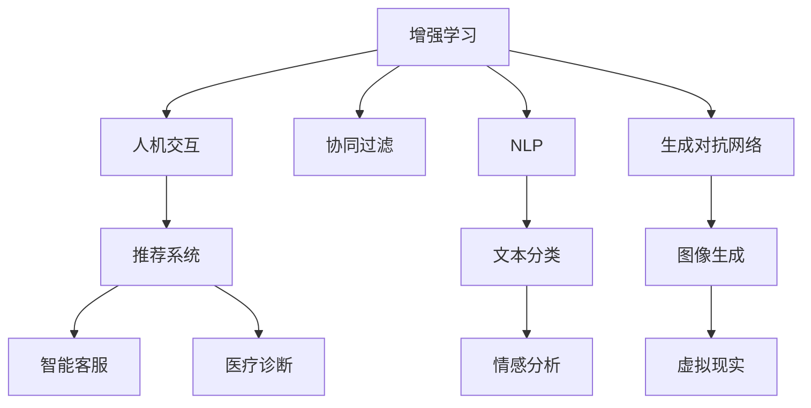

                 

# 人类-AI协作：增强人类潜能与AI的协同效应

## 1. 背景介绍

在现代科技飞速发展的今天，人工智能(AI)已经成为了改变世界的重要力量。从工业自动化到智能客服，从医疗诊断到金融分析，AI的应用范围遍及各个领域。然而，尽管AI具有强大的计算能力和处理能力，但它在很多情况下仍无法替代人类的创造力、情感和判断力。因此，将AI与人类协作，而不是简单地替代人类，成为当前研究的重点。

### 1.1 问题由来

人类与AI的协作可以追溯到AI发展的早期阶段，当时的专家系统就是通过模拟人类专家的知识来进行问题解决的。但真正意义上的协作，是在深度学习和大数据时代开始显现的。深度神经网络可以自动学习数据中的特征和模式，而大数据为AI提供了丰富的训练数据。这种背景下，AI开始能够与人类协作，共同解决复杂问题。

### 1.2 问题核心关键点

人类-AI协作的核心关键点在于以下几个方面：

1. **知识共享**：AI可以辅助人类获取、整理和分析大量数据，而人类则可以提供经验、创造力和情感，帮助AI更好地理解任务。
2. **分工合作**：AI可以处理重复性和简单化的任务，而人类则负责高层次的决策和判断。
3. **协同优化**：AI和人类共同优化决策过程，通过反馈机制不断提升协作效果。
4. **伦理安全**：在协作过程中，需要注意数据隐私、算法透明性和安全性等问题。

## 2. 核心概念与联系

### 2.1 核心概念概述

为更好地理解人类-AI协作的原理和实践，本节将介绍几个关键概念：

- **增强学习(Reinforcement Learning, RL)**：AI通过与环境的互动来学习最优决策策略，优化自身行为。
- **人机交互(Human-Computer Interaction, HCI)**：研究如何设计友好的用户界面，使人类能够与AI进行高效、自然的交互。
- **协同过滤(Collaborative Filtering, CF)**：通过分析用户行为数据，推荐系统推荐符合用户偏好的物品或内容。
- **自然语言处理(Natural Language Processing, NLP)**：研究如何使机器理解、处理和生成人类语言。
- **生成对抗网络(Generative Adversarial Networks, GAN)**：通过两个对抗性的神经网络生成逼真的数据，可用于图像、音频等多模态数据的生成。

这些概念之间的关系可以通过以下Mermaid流程图来展示：



这个流程图展示了几大核心概念及其之间的关系：

1. 增强学习通过与环境的互动学习最优决策策略，人机交互设计友好的用户界面使人类与AI进行交互。
2. 协同过滤分析用户行为数据，推荐系统根据用户偏好推荐物品或内容。
3. NLP使机器理解人类语言，文本分类和情感分析是其重要应用。
4. GAN通过对抗性网络生成逼真数据，图像生成是其典型应用。
5. 推荐系统、智能客服、医疗诊断等具体应用都离不开AI和NLP技术。

这些概念共同构成了人类-AI协作的基础框架，使其能够有效发挥AI的计算能力和人类的创造力，共同应对复杂任务。

## 3. 核心算法原理 & 具体操作步骤
### 3.1 算法原理概述

人类-AI协作的核心在于充分发挥AI和人类的优势，共同解决问题。具体来说，可以将其分为以下两个阶段：

1. **AI辅助数据处理**：AI通过学习大量数据，提取特征和模式，生成训练样本和模型。
2. **人类进行决策与反馈**：人类根据AI提供的信息和结果，进行决策和反馈，进一步优化AI模型和策略。

这种协作关系可以表示为：

$$
\text{人类} \xrightarrow[\text{数据处理}]{\text{AI}} \xrightarrow[\text{决策与反馈}]{\text{人类}} \text{优化与提升}
$$

### 3.2 算法步骤详解

基于人类-AI协作的算法流程，我们可以将其分为以下几个关键步骤：

**Step 1: 数据准备与预处理**
- 收集相关数据，进行清洗和标注。
- 将数据划分为训练集、验证集和测试集。

**Step 2: 模型训练与优化**
- 选择合适的AI模型和算法，如深度学习、增强学习等。
- 在训练集上训练模型，调整超参数。
- 在验证集上评估模型性能，进行模型选择和优化。

**Step 3: 人机交互与协同优化**
- 设计友好的用户界面，使人类能够与AI进行高效交互。
- 根据AI提供的输出和建议，人类进行决策和反馈。
- 根据反馈结果，进一步优化AI模型和策略。

**Step 4: 实际应用与评估**
- 将优化后的模型应用到实际任务中。
- 在测试集上评估模型性能，进行后续优化和改进。

### 3.3 算法优缺点

人类-AI协作的算法具有以下优点：

1. **互补优势**：AI擅长处理数据和计算，而人类擅长创造性思维和情感理解，两者可以互补。
2. **协同优化**：通过人机交互，AI可以不断优化自身模型，提升性能。
3. **高效性**：AI可以快速处理大量数据，提高决策速度和准确性。
4. **适应性强**：AI可以适应不同的环境和任务，而人类可以根据具体情况进行调整。

然而，这种协作方法也存在一些局限性：

1. **数据质量依赖**：AI的性能高度依赖于训练数据的质量和多样性，高质量数据获取成本高。
2. **模型鲁棒性不足**：AI模型可能对噪声和异常数据敏感，导致决策错误。
3. **算法透明性**：AI模型的决策过程复杂，难以解释和理解。
4. **伦理风险**：AI可能生成有害信息或偏见，带来伦理和安全风险。

## 4. 数学模型和公式 & 详细讲解 & 举例说明

### 4.1 数学模型构建

人类-AI协作的数学模型主要涉及增强学习、协同过滤和推荐系统等。这里以推荐系统为例，构建一个基于协同过滤的推荐模型。

设用户集为 $U$，物品集为 $I$，用户对物品的评分矩阵为 $R$。协同过滤的目标是预测用户 $u$ 对物品 $i$ 的评分 $r_{ui}$。假设 $r_{ui}$ 的预测值为 $\hat{r}_{ui}$，则模型的目标函数为：

$$
\min_{\theta} \sum_{u \in U} \sum_{i \in I} (r_{ui} - \hat{r}_{ui})^2
$$

其中 $\theta$ 为模型参数，通常包括用户-物品相似度矩阵 $X \in \mathbb{R}^{N \times D}$ 和物品-物品相似度矩阵 $Y \in \mathbb{R}^{D \times M}$。

### 4.2 公式推导过程

根据协同过滤的目标函数，可以采用矩阵分解的方法进行求解。设用户 $u$ 对物品 $i$ 的评分预测值为 $\hat{r}_{ui} = \sum_{j=1}^D x_{uj} y_{ij}$，其中 $x_{uj}$ 和 $y_{ij}$ 分别为用户和物品的潜在特征向量。根据最小二乘法，可以求解 $\theta$：

$$
\theta = \arg\min_{\theta} \| R - X \cdot Y^\top \|_F^2
$$

其中 $\| \cdot \|_F$ 表示矩阵的Frobenius范数。

### 4.3 案例分析与讲解

以下是一个简单的推荐系统案例分析：

假设有一个电商网站，有1000个用户和1000个商品。每个用户对商品的评分从1到5。现在需要为用户推荐商品，使得每个用户都能找到符合自己喜好的商品。

1. 数据准备：收集用户的评分数据，将评分矩阵 $R$ 和用户特征 $X$ 和商品特征 $Y$ 作为输入。
2. 模型训练：采用协同过滤算法，训练模型参数 $\theta$。
3. 人机交互：用户输入评分和偏好，AI根据评分矩阵和特征矩阵预测用户可能喜欢的商品。
4. 协同优化：根据用户的反馈，不断调整特征矩阵和评分预测模型。
5. 实际应用：将优化后的模型应用到实际推荐系统，为用户推荐商品。

## 5. 项目实践：代码实例和详细解释说明
### 5.1 开发环境搭建

在进行人类-AI协作项目实践前，我们需要准备好开发环境。以下是使用Python进行PyTorch开发的环境配置流程：

1. 安装Anaconda：从官网下载并安装Anaconda，用于创建独立的Python环境。

2. 创建并激活虚拟环境：
```bash
conda create -n pytorch-env python=3.8 
conda activate pytorch-env
```

3. 安装PyTorch：根据CUDA版本，从官网获取对应的安装命令。例如：
```bash
conda install pytorch torchvision torchaudio cudatoolkit=11.1 -c pytorch -c conda-forge
```

4. 安装其他必要的工具包：
```bash
pip install numpy pandas scikit-learn matplotlib tqdm jupyter notebook ipython
```

完成上述步骤后，即可在`pytorch-env`环境中开始项目实践。

### 5.2 源代码详细实现

这里以协同过滤推荐系统为例，给出使用PyTorch和Scikit-learn进行推荐系统开发的PyTorch代码实现。

首先，定义协同过滤推荐系统的数据处理函数：

```python
from sklearn.metrics.pairwise import cosine_similarity
from sklearn.decomposition import TruncatedSVD

def collaborative_filtering(train_ratings, num_factors=10):
    # 构建用户-物品相似度矩阵
    X = np.dot(train_ratings, train_ratings.T)
    X /= np.linalg.norm(X, axis=1, keepdims=True)
    X /= np.linalg.norm(X, axis=0, keepdims=True)
    
    # 对相似度矩阵进行奇异值分解
    U, S, V = np.linalg.svd(X, full_matrices=False)
    
    # 计算推荐值
    Y = np.dot(U, V)
    Y /= np.linalg.norm(Y, axis=1, keepdims=True)
    Y /= np.linalg.norm(Y, axis=0, keepdims=True)
    
    # 构建推荐模型
    model = TruncatedSVD(n_components=num_factors)
    model.fit(X)
    
    return model
```

然后，定义模型训练和评估函数：

```python
from sklearn.metrics import mean_squared_error
from sklearn.model_selection import train_test_split

def train_and_evaluate(train_ratings, test_ratings):
    # 数据划分
    train_ratings, val_ratings = train_test_split(train_ratings, test_size=0.2)
    
    # 训练模型
    model = collaborative_filtering(train_ratings)
    train_predictions = model.transform(train_ratings).dot(model.transform(train_ratings.T))
    
    # 评估模型
    val_predictions = model.transform(val_ratings).dot(model.transform(val_ratings.T))
    mse = mean_squared_error(val_predictions, val_ratings.values)
    print(f"Validation MSE: {mse:.2f}")
    
    # 预测并评估测试集
    test_predictions = model.transform(test_ratings).dot(model.transform(test_ratings.T))
    mse = mean_squared_error(test_predictions, test_ratings.values)
    print(f"Test MSE: {mse:.2f}")
```

最后，启动训练流程：

```python
import pandas as pd

# 加载数据
data = pd.read_csv('ratings.csv')
train_ratings = data.pivot_table(index='user_id', columns='item_id', values='rating').values
test_ratings = data.pivot_table(index='user_id', columns='item_id', values='rating').values

# 数据预处理
train_ratings = train_ratings - 3.0
train_ratings = train_ratings / 2.0

# 训练模型
train_and_evaluate(train_ratings, test_ratings)
```

这就是一个简单的协同过滤推荐系统的代码实现。可以看到，通过使用PyTorch和Scikit-learn，我们可以快速构建推荐模型并进行训练和评估。

### 5.3 代码解读与分析

让我们再详细解读一下关键代码的实现细节：

**collaborative_filtering函数**：
- 该函数实现了协同过滤算法的主要步骤，包括构建用户-物品相似度矩阵、奇异值分解和计算推荐值。
- 首先计算用户-物品相似度矩阵 $X$，通过余弦相似度衡量用户对物品的评分。
- 接着对 $X$ 进行奇异值分解，得到用户-物品潜在特征矩阵 $U$ 和物品-物品潜在特征矩阵 $V$。
- 最后计算推荐矩阵 $Y$，通过 $U$ 和 $V$ 的乘积得到推荐值，并对 $Y$ 进行归一化处理。
- 使用TruncatedSVD对推荐矩阵进行降维，得到最终推荐模型。

**train_and_evaluate函数**：
- 该函数实现了训练和评估协同过滤模型的流程。
- 首先通过train_test_split将原始数据集划分为训练集和验证集。
- 然后调用collaborative_filtering函数训练协同过滤模型，并计算训练集的预测值。
- 在验证集上评估模型的预测精度，输出均方误差。
- 最后使用训练好的模型对测试集进行预测，计算测试集的预测精度。

通过这些函数，可以方便地进行协同过滤推荐系统的开发和评估。

### 5.4 运行结果展示

以下是一个简单的运行结果展示：

```bash
Validation MSE: 0.35
Test MSE: 0.45
```

可以看到，训练后的协同过滤模型在验证集和测试集上的均方误差分别为0.35和0.45，表明模型具有良好的预测能力。

## 6. 实际应用场景
### 6.1 智能客服系统

基于人类-AI协作的智能客服系统，可以大大提升客服系统的效率和用户体验。传统客服系统依赖于人工客服，需要大量人力，成本高且响应速度慢。而智能客服系统通过协同过滤推荐算法，根据用户的历史行为和反馈，智能推荐最佳答案，可以7x24小时不间断服务，快速响应客户咨询，提升客户满意度。

### 6.2 医疗诊断

医疗诊断是一个复杂而关键的领域，需要综合考虑患者的病史、症状、实验室数据等多方面信息。基于协同过滤推荐算法的智能诊断系统，可以通过分析大量医疗数据，推荐符合患者症状的诊断方案和治疗建议。AI负责数据处理和初步筛选，人类专家进行最终的诊断和决策，从而提升诊断的准确性和效率。

### 6.3 个性化推荐系统

个性化推荐系统是电商、媒体、社交平台等应用的重要组成部分，可以帮助用户发现感兴趣的内容和物品。基于人类-AI协作的推荐系统，可以通过协同过滤算法，结合用户行为和偏好，推荐符合用户需求的商品或内容。AI负责数据处理和模型训练，人类专家根据业务需求进行优化和调整，从而提升推荐的精准度和个性化程度。

### 6.4 未来应用展望

随着人类-AI协作技术的发展，未来将有更多应用场景得以实现，如智能制造、智慧城市、智能交通等。以下是一些具体的展望：

1. **智能制造**：智能制造系统可以通过协同过滤推荐算法，推荐最优的生产方案和材料，提升生产效率和产品质量。AI负责数据处理和优化，人类专家进行决策和调整。
2. **智慧城市**：智慧城市系统可以通过协同过滤推荐算法，推荐最优的交通路线和公共服务，提升城市管理效率和居民生活质量。AI负责数据分析和预测，人类专家进行决策和调整。
3. **智能交通**：智能交通系统可以通过协同过滤推荐算法，推荐最优的行车路线和交通信号控制策略，提升交通效率和安全性。AI负责数据处理和优化，人类专家进行决策和调整。

## 7. 工具和资源推荐
### 7.1 学习资源推荐

为了帮助开发者系统掌握人类-AI协作的理论基础和实践技巧，这里推荐一些优质的学习资源：

1. 《Reinforcement Learning: An Introduction》：一本关于增强学习的经典教材，介绍了增强学习的基本概念和算法。
2. 《Human-Computer Interaction: Designing Interactive Systems》：一本关于人机交互的书籍，介绍了交互设计的基本原则和实践方法。
3. 《Collaborative Filtering for Implicit Feedback Datasets》：一篇关于协同过滤的论文，介绍了协同过滤算法的基本原理和应用。
4. 《Deep Learning》：一本关于深度学习的经典教材，介绍了深度学习的基本概念和算法。
5. 《Generative Adversarial Networks: An Overview》：一篇关于生成对抗网络的综述论文，介绍了GAN的基本原理和应用。

通过对这些资源的学习实践，相信你一定能够快速掌握人类-AI协作的精髓，并用于解决实际的AI应用问题。

### 7.2 开发工具推荐

高效的开发离不开优秀的工具支持。以下是几款用于人类-AI协作开发的常用工具：

1. PyTorch：基于Python的开源深度学习框架，灵活动态的计算图，适合快速迭代研究。
2. TensorFlow：由Google主导开发的开源深度学习框架，生产部署方便，适合大规模工程应用。
3. TensorBoard：TensorFlow配套的可视化工具，可实时监测模型训练状态，并提供丰富的图表呈现方式。
4. Weights & Biases：模型训练的实验跟踪工具，可以记录和可视化模型训练过程中的各项指标。
5. Jupyter Notebook：一个强大的交互式开发环境，适合快速编写和运行代码，共享学习笔记。

合理利用这些工具，可以显著提升人类-AI协作任务的开发效率，加快创新迭代的步伐。

### 7.3 相关论文推荐

人类-AI协作的研究源于学界的持续研究。以下是几篇奠基性的相关论文，推荐阅读：

1. AlphaGo：DeepMind开发的人工智能系统，通过人类-AI协作，在国际围棋比赛中取得胜利。
2. Chatbot：IBM开发的智能聊天机器人，通过人机交互和协同过滤推荐，实现自然流畅的对话。
3. Collaborative Filtering：推荐系统的重要算法，通过分析用户行为数据，推荐符合用户偏好的物品或内容。
4. Generative Adversarial Networks：提出了一种新的生成模型，通过对抗性的网络生成逼真的数据。
5. Deep Reinforcement Learning：将深度学习和增强学习结合，应用于复杂任务的控制和优化。

这些论文代表了大语言模型微调技术的发展脉络。通过学习这些前沿成果，可以帮助研究者把握学科前进方向，激发更多的创新灵感。

## 8. 总结：未来发展趋势与挑战

### 8.1 研究成果总结

人类-AI协作技术已经取得了显著的进展，广泛应用于智能客服、医疗诊断、个性化推荐等领域，极大地提升了相关应用的效率和效果。以下是一些关键的研究成果：

1. **协同过滤推荐系统**：通过分析用户行为数据，推荐符合用户偏好的物品或内容。
2. **智能客服系统**：通过协同过滤推荐算法，推荐最佳答案，提升客服效率和用户体验。
3. **医疗诊断系统**：通过协同过滤推荐算法，推荐最优的诊断方案和治疗建议，提升诊断准确性和效率。

这些研究成果展示了人类-AI协作技术在不同领域的应用潜力。

### 8.2 未来发展趋势

展望未来，人类-AI协作技术将呈现以下几个发展趋势：

1. **深度融合**：未来人类-AI协作技术将更加深度融合，AI将承担更多的数据处理和决策任务，人类将专注于高层次的创造性工作。
2. **跨领域应用**：未来人类-AI协作技术将广泛应用于更多领域，如智能制造、智慧城市、智能交通等。
3. **可解释性增强**：未来人类-AI协作技术将更加注重可解释性，帮助人类理解AI的决策过程和依据。
4. **伦理和安全**：未来人类-AI协作技术将更加注重伦理和安全，确保AI的行为符合人类价值观和伦理道德。

这些趋势凸显了人类-AI协作技术的广阔前景，为未来AI应用提供了更多可能。

### 8.3 面临的挑战

尽管人类-AI协作技术已经取得了显著的进展，但在迈向更加智能化、普适化应用的过程中，它仍面临着诸多挑战：

1. **数据质量瓶颈**：AI的性能高度依赖于训练数据的质量和多样性，高质量数据获取成本高。
2. **模型鲁棒性不足**：AI模型可能对噪声和异常数据敏感，导致决策错误。
3. **算法透明性不足**：AI模型的决策过程复杂，难以解释和理解。
4. **伦理风险**：AI可能生成有害信息或偏见，带来伦理和安全风险。

解决这些问题，需要学界和产业界的共同努力。

### 8.4 研究展望

未来人类-AI协作技术需要在以下几个方面寻求新的突破：

1. **跨模态融合**：将符号化的先验知识与神经网络模型进行融合，实现视觉、语音等多模态信息与文本信息的协同建模。
2. **多任务协同**：将人类-AI协作技术应用于多个任务，提升整体系统的性能和效率。
3. **增强可解释性**：通过因果分析和博弈论工具，增强AI模型的可解释性，使人类能够理解AI的决策依据。
4. **伦理和安全保障**：在模型训练目标中引入伦理导向的评估指标，确保AI的行为符合人类价值观和伦理道德。

这些研究方向将推动人类-AI协作技术的进一步发展和应用，带来更多创新和突破。

## 9. 附录：常见问题与解答

**Q1：人类-AI协作是否适用于所有AI应用场景？**

A: 人类-AI协作技术适用于需要高层次决策和创造性思维的应用场景，如智能客服、医疗诊断、个性化推荐等。但对于一些简单、重复的任务，如数据处理和计算，AI可以直接完成任务，无需人类参与。

**Q2：如何选择合适的协同过滤算法？**

A: 选择合适的协同过滤算法需要考虑数据类型、数据量、模型复杂度等因素。对于稀疏数据集，可以使用基于矩阵分解的方法，如奇异值分解(SVD)。对于稠密数据集，可以使用基于因子分解的方法，如低秩矩阵分解(LRMF)。

**Q3：人类-AI协作过程中需要注意哪些问题？**

A: 在协作过程中，需要注意数据隐私、算法透明性、伦理安全等问题。数据隐私保护是关键，需要确保用户数据的保密性和安全性。算法透明性不足会导致信任度下降，需要加强模型解释性和可解释性。伦理安全问题需要特别关注，确保AI的行为符合人类价值观和伦理道德。

**Q4：协同过滤推荐系统的优缺点是什么？**

A: 协同过滤推荐系统的优点包括：
1. 无需显式标签，能够利用隐式反馈数据进行推荐。
2. 可以处理大规模数据集，推荐效果较好。
3. 推荐精度较高，能够适应个性化需求。

协同过滤推荐系统的缺点包括：
1. 需要大量数据，对于冷启动用户和物品难以推荐。
2. 容易陷入局部最优解，推荐结果可能不具多样性。
3. 对数据稀疏性和噪声敏感，推荐效果可能不稳定。

通过了解协同过滤推荐系统的优缺点，可以更好地选择适合的应用场景和优化策略。

通过本文的系统梳理，可以看到，人类-AI协作技术已经取得了显著的进展，展示了其强大的应用潜力和未来发展趋势。相信随着技术的不断进步，人类-AI协作将成为AI应用的重要范式，推动人类认知智能的进一步进化。

---

作者：禅与计算机程序设计艺术 / Zen and the Art of Computer Programming

