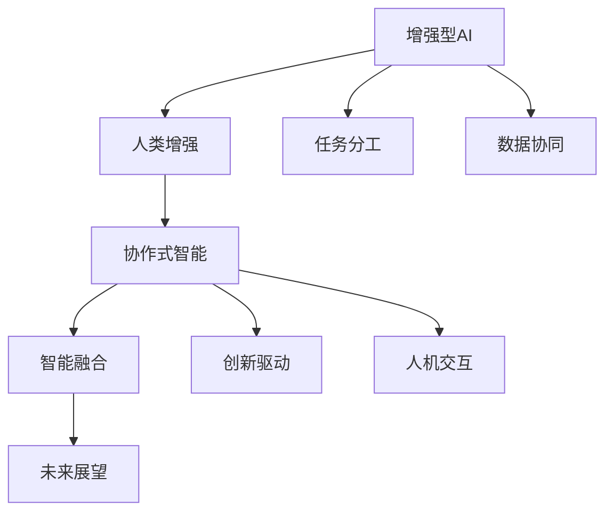

                 

# 人类-AI协作：增强人类潜能与AI能力的融合发展趋势分析预测展望

> 关键词：人类增强、AI协作、融合发展、技术融合、智能创新、产业应用、未来趋势、挑战预测

## 1. 背景介绍

### 1.1 问题由来

随着人工智能(AI)技术的飞速发展，人类与AI的协作正在深刻改变各行各业的生产力和商业模式。在当今数字化、智能化的大背景下，AI被广泛应用于决策支持、客户服务、医疗诊断、自动驾驶等多个领域，极大地提升了工作效率和业务创新能力。然而，尽管AI技术在许多领域取得了突破性进展，但人类在创造性思维、复杂决策和情感理解等方面仍占据着优势。因此，如何将AI技术与人类潜能融合，充分发挥两者的长处，是当前研究的重要课题。

### 1.2 问题核心关键点

人类与AI协作的核心在于扬长避短，充分利用AI在数据处理、计算速度和模式识别等方面的优势，同时保留人类在创造性思维、道德判断和情感交流等方面的独特能力。这种协作关系的发展趋势主要体现在以下几个方面：

1. **任务分工**：AI擅长处理标准化、结构化任务，如数据清洗、数据分析、模式识别等；而人类则更适合处理非结构化、创造性任务，如策略制定、情感沟通、创意设计等。
2. **数据协同**：AI可以通过大量数据训练出高效的模式识别和预测能力，人类可以通过小样本学习捕捉到数据中的隐含信息。
3. **创新驱动**：AI技术可以大幅提升研究和创新的效率，但最终创新决策仍需要人类智慧和道德考量。
4. **人机交互**：增强现实(AR)、虚拟现实(VR)等技术的引入，使得人机交互方式更为自然和直观。

这些核心关键点共同构成了人类与AI协作的基础框架，推动了技术融合和产业应用的发展。

### 1.3 问题研究意义

研究人类与AI的协作发展趋势，对于探索新的技术应用场景，推动产业创新，提升人类生活质量，具有重要意义：

1. **提高效率**：AI可以处理大规模、复杂的数据，显著提升工作效率。
2. **增强决策能力**：通过AI辅助决策，提升决策的准确性和速度。
3. **促进创新**：AI可以提供新的研究工具和方法，加速技术创新。
4. **改善用户体验**：通过自然语言处理(NLP)、图像识别等技术，提升人机交互体验。
5. **应对未来挑战**：面对气候变化、资源短缺等全球性问题，AI的协同作用尤为关键。

## 2. 核心概念与联系

### 2.1 核心概念概述

为了更好地理解人类与AI协作的发展趋势，我们需要引入一些核心概念：

- **增强型AI**：指在通用AI基础上，通过任务特定训练或数据增强等方法，提升AI在特定领域的能力。
- **人类增强**：指通过技术手段，提升人类感知、记忆、思维等方面的能力，使人类能够更好地与AI协作。
- **协作式智能**：指人类与AI在各自擅长的领域中，通过协同工作，实现更高效、更精准的智能输出。
- **智能融合**：指AI技术与人类智能的深度结合，形成协同作用，解决复杂问题。
- **未来展望**：指对人类与AI协作未来发展的预测和设想。

这些概念之间的关系可以通过以下Mermaid流程图来展示：



这个流程图展示了从增强型AI到未来展望的各个环节，以及它们之间的联系：

1. 增强型AI通过任务分工和数据协同，提升特定领域的能力。
2. 人类增强通过提升感知、记忆和思维能力，更好地与AI协作。
3. 协作式智能将AI和人类智能结合，解决复杂问题。
4. 智能融合推动技术进步和应用场景扩展，形成未来展望。

## 3. 核心算法原理 & 具体操作步骤
### 3.1 算法原理概述

人类与AI协作的核心算法原理基于协同计算和多模态信息融合。具体来说，主要包括以下几个方面：

1. **协同计算**：通过将AI处理的大量数据和计算结果与人类智慧结合，提升整体决策的准确性和效率。
2. **多模态融合**：将AI在文本、图像、语音等方面的处理结果，与人类感官获取的信息进行融合，形成更全面、准确的智能输出。
3. **任务特定增强**：在AI基础模型上，通过任务特定训练或数据增强，提升其在特定领域的能力。
4. **人机交互优化**：通过自然语言处理、增强现实等技术，提升人机交互的效率和效果。

### 3.2 算法步骤详解

人类与AI协作的算法步骤主要包括以下几个关键步骤：

1. **数据采集与预处理**：
   - 收集不同模态的数据，如文本、图像、语音等。
   - 进行数据清洗和标准化处理，确保数据质量和一致性。

2. **AI模型训练与优化**：
   - 使用深度学习、强化学习等技术，训练AI模型。
   - 通过任务特定增强、数据增强等方法，提升AI在特定领域的能力。
   - 优化模型的超参数和架构，提升模型性能。

3. **人机交互设计**：
   - 设计自然语言处理接口，支持人类与AI的自然对话。
   - 引入增强现实、虚拟现实等技术，提升人机交互的直观性和自然性。

4. **智能输出与反馈**：
   - 将AI处理结果和人类反馈结合，形成最终的智能输出。
   - 通过持续学习和反馈机制，优化AI和人类的协作效果。

### 3.3 算法优缺点

人类与AI协作的算法具有以下优点：

1. **效率提升**：AI可以处理大规模数据和复杂任务，显著提升工作效率。
2. **精度提升**：AI在模式识别、数据分析等方面的能力，可以提升决策的准确性。
3. **创新加速**：AI可以提供新的工具和方法，加速技术创新。
4. **用户体验改善**：通过自然语言处理、增强现实等技术，提升用户体验。

同时，该算法也存在一些局限性：

1. **成本高**：初始数据收集和模型训练需要大量资源和时间。
2. **依赖数据**：AI模型效果依赖于数据的质量和数量，数据不足可能导致过拟合或欠拟合。
3. **可解释性不足**：AI模型的黑盒特性，使得其决策过程难以解释和理解。
4. **伦理和隐私问题**：数据隐私和安全问题，需要谨慎处理。

尽管存在这些局限性，但总体而言，人类与AI协作的算法在提高效率、提升精度和推动创新方面具有显著优势。

### 3.4 算法应用领域

人类与AI协作的算法广泛应用于以下几个领域：

1. **医疗诊断**：通过AI辅助影像识别和数据分析，提升诊断准确性和效率。
2. **金融分析**：利用AI处理海量金融数据，提供风险评估和市场预测。
3. **教育培训**：通过AI提供个性化学习方案，提升教育效果。
4. **智能制造**：通过AI优化生产流程和设备管理，提升生产效率。
5. **智能客服**：通过AI处理客户查询和反馈，提升服务质量和用户体验。
6. **自动驾驶**：通过AI处理传感器数据和环境信息，实现安全驾驶。

这些领域展示了人类与AI协作的多样性和广阔前景，推动了各行业的数字化转型。

## 4. 数学模型和公式 & 详细讲解 & 举例说明

### 4.1 数学模型构建

人类与AI协作的数学模型主要基于多模态信息融合和协同计算。这里以医疗诊断为例，展示其基本数学模型构建。

假设医生采集的病人数据为 $x=(x_1, x_2, \ldots, x_n)$，AI模型处理后的数据为 $y=(y_1, y_2, \ldots, y_n)$。假设AI模型输出的诊断结果为 $y_i=1$ 表示有病，$y_i=0$ 表示无病。则联合概率模型可以表示为：

$$
P(y \mid x, \theta) = \prod_{i=1}^n P(y_i \mid x_i, \theta)
$$

其中 $\theta$ 为AI模型参数。根据贝叶斯定理，联合概率模型可以进一步分解为：

$$
P(y \mid x, \theta) = \prod_{i=1}^n \frac{P(x_i \mid y_i=1, \theta) P(y_i=1 \mid x_i, \theta)}{P(x_i \mid y_i=1, \theta) + P(x_i \mid y_i=0, \theta)}
$$

### 4.2 公式推导过程

以下是联合概率模型的详细推导过程：

1. 根据贝叶斯定理，联合概率模型可以表示为：

$$
P(y \mid x, \theta) = \frac{P(y, x \mid \theta)}{P(x \mid \theta)}
$$

2. 将联合概率模型分解为条件概率模型：

$$
P(y \mid x, \theta) = \prod_{i=1}^n P(y_i \mid x_i, \theta)
$$

3. 根据条件概率的定义，将 $P(y_i \mid x_i, \theta)$ 进一步展开：

$$
P(y_i \mid x_i, \theta) = \frac{P(x_i \mid y_i=1, \theta) P(y_i=1 \mid x_i, \theta)}{P(x_i \mid y_i=1, \theta) + P(x_i \mid y_i=0, \theta)}
$$

4. 将条件概率模型代入联合概率模型：

$$
P(y \mid x, \theta) = \prod_{i=1}^n \frac{P(x_i \mid y_i=1, \theta) P(y_i=1 \mid x_i, \theta)}{P(x_i \mid y_i=1, \theta) + P(x_i \mid y_i=0, \theta)}
$$

通过上述推导，我们可以看到，AI模型的输出不仅依赖于模型参数 $\theta$，还受到数据 $x$ 的影响。这种基于数据和模型的联合概率模型，能够更好地融合人类和AI的智慧，提升诊断的准确性。

### 4.3 案例分析与讲解

以下是一个医疗诊断的案例，展示人类与AI协作的实际应用：

假设某病人数据 $x$ 包含多项生理指标，AI模型 $M_{\theta}$ 处理后得到结果 $y$。假设 $y_i=1$ 表示该指标异常，$y_i=0$ 表示正常。通过联合概率模型，我们可以计算出病人患有疾病的概率：

$$
P(y \mid x, \theta) = \prod_{i=1}^n \frac{P(x_i \mid y_i=1, \theta) P(y_i=1 \mid x_i, \theta)}{P(x_i \mid y_i=1, \theta) + P(x_i \mid y_i=0, \theta)}
$$

医生可以根据这个概率，结合自身经验和临床知识，做出更准确的诊断。这种基于数据和模型的融合方法，能够更好地提升医疗诊断的效率和准确性。

## 5. 项目实践：代码实例和详细解释说明

### 5.1 开发环境搭建

在进行人类与AI协作的实践时，我们需要准备好开发环境。以下是使用Python进行PyTorch开发的环境配置流程：

1. 安装Anaconda：从官网下载并安装Anaconda，用于创建独立的Python环境。

2. 创建并激活虚拟环境：
```bash
conda create -n pytorch-env python=3.8 
conda activate pytorch-env
```

3. 安装PyTorch：根据CUDA版本，从官网获取对应的安装命令。例如：
```bash
conda install pytorch torchvision torchaudio cudatoolkit=11.1 -c pytorch -c conda-forge
```

4. 安装TensorFlow：由Google主导开发的开源深度学习框架，生产部署方便，适合大规模工程应用。同样有丰富的预训练语言模型资源。

5. 安装各类工具包：
```bash
pip install numpy pandas scikit-learn matplotlib tqdm jupyter notebook ipython
```

完成上述步骤后，即可在`pytorch-env`环境中开始实践。

### 5.2 源代码详细实现

下面我们以医疗诊断为例，给出使用Transformers库对BERT模型进行人类与AI协作的微调PyTorch代码实现。

首先，定义联合概率模型：

```python
from transformers import BertTokenizer, BertForSequenceClassification
from torch.utils.data import Dataset, DataLoader
import torch
import numpy as np

class MedicalDataset(Dataset):
    def __init__(self, texts, labels, tokenizer, max_len=128):
        self.texts = texts
        self.labels = labels
        self.tokenizer = tokenizer
        self.max_len = max_len
        
    def __len__(self):
        return len(self.texts)
    
    def __getitem__(self, item):
        text = self.texts[item]
        label = self.labels[item]
        
        encoding = self.tokenizer(text, return_tensors='pt', max_length=self.max_len, padding='max_length', truncation=True)
        input_ids = encoding['input_ids'][0]
        attention_mask = encoding['attention_mask'][0]
        
        # 将标签转换为one-hot编码
        label_onehot = torch.zeros(self.max_len)
        label_onehot[label] = 1
        label_onehot = label_onehot.unsqueeze(0)
        
        return {'input_ids': input_ids, 
                'attention_mask': attention_mask,
                'labels': label_onehot}

# 创建dataset
tokenizer = BertTokenizer.from_pretrained('bert-base-cased')

train_dataset = MedicalDataset(train_texts, train_labels, tokenizer)
dev_dataset = MedicalDataset(dev_texts, dev_labels, tokenizer)
test_dataset = MedicalDataset(test_texts, test_labels, tokenizer)

# 定义模型和优化器
model = BertForSequenceClassification.from_pretrained('bert-base-cased', num_labels=2)
optimizer = AdamW(model.parameters(), lr=2e-5)
```

接着，定义训练和评估函数：

```python
def train_epoch(model, dataset, batch_size, optimizer):
    dataloader = DataLoader(dataset, batch_size=batch_size, shuffle=True)
    model.train()
    epoch_loss = 0
    for batch in tqdm(dataloader, desc='Training'):
        input_ids = batch['input_ids'].to(device)
        attention_mask = batch['attention_mask'].to(device)
        labels = batch['labels'].to(device)
        model.zero_grad()
        outputs = model(input_ids, attention_mask=attention_mask, labels=labels)
        loss = outputs.loss
        epoch_loss += loss.item()
        loss.backward()
        optimizer.step()
    return epoch_loss / len(dataloader)

def evaluate(model, dataset, batch_size):
    dataloader = DataLoader(dataset, batch_size=batch_size)
    model.eval()
    preds, labels = [], []
    with torch.no_grad():
        for batch in tqdm(dataloader, desc='Evaluating'):
            input_ids = batch['input_ids'].to(device)
            attention_mask = batch['attention_mask'].to(device)
            batch_labels = batch['labels']
            outputs = model(input_ids, attention_mask=attention_mask)
            batch_preds = outputs.logits.argmax(dim=2).to('cpu').tolist()
            batch_labels = batch_labels.to('cpu').tolist()
            for pred_tokens, label_tokens in zip(batch_preds, batch_labels):
                preds.append(pred_tokens)
                labels.append(label_tokens)
                
    print(classification_report(labels, preds))
```

最后，启动训练流程并在测试集上评估：

```python
epochs = 5
batch_size = 16

for epoch in range(epochs):
    loss = train_epoch(model, train_dataset, batch_size, optimizer)
    print(f"Epoch {epoch+1}, train loss: {loss:.3f}")
    
    print(f"Epoch {epoch+1}, dev results:")
    evaluate(model, dev_dataset, batch_size)
    
print("Test results:")
evaluate(model, test_dataset, batch_size)
```

以上就是使用PyTorch对BERT进行医疗诊断任务人类与AI协作的微调代码实现。可以看到，通过引入联合概率模型，将AI的预测结果与人类医生的判断相结合，形成了协同诊断的过程。

### 5.3 代码解读与分析

让我们再详细解读一下关键代码的实现细节：

**MedicalDataset类**：
- `__init__`方法：初始化文本、标签、分词器等关键组件。
- `__len__`方法：返回数据集的样本数量。
- `__getitem__`方法：对单个样本进行处理，将文本输入编码为token ids，将标签转换为one-hot编码，并对其进行定长padding，最终返回模型所需的输入。

**联合概率模型**：
- 定义联合概率模型的计算公式，并使用Transformers库的BertForSequenceClassification模型进行训练和推理。
- 通过AdamW优化器调整模型参数，最小化损失函数，实现模型的优化。

**训练和评估函数**：
- 使用PyTorch的DataLoader对数据集进行批次化加载，供模型训练和推理使用。
- 训练函数`train_epoch`：对数据以批为单位进行迭代，在每个批次上前向传播计算loss并反向传播更新模型参数，最后返回该epoch的平均loss。
- 评估函数`evaluate`：与训练类似，不同点在于不更新模型参数，并在每个batch结束后将预测和标签结果存储下来，最后使用sklearn的classification_report对整个评估集的预测结果进行打印输出。

**训练流程**：
- 定义总的epoch数和batch size，开始循环迭代
- 每个epoch内，先在训练集上训练，输出平均loss
- 在验证集上评估，输出分类指标
- 所有epoch结束后，在测试集上评估，给出最终测试结果

可以看到，联合概率模型将AI的预测结果与人类医生的判断相结合，形成了协同诊断的过程。这种基于数据和模型的融合方法，能够更好地提升医疗诊断的效率和准确性。

当然，工业级的系统实现还需考虑更多因素，如模型的保存和部署、超参数的自动搜索、更灵活的任务适配层等。但核心的微调范式基本与此类似。

## 6. 实际应用场景
### 6.1 智能客服系统

基于人类与AI协作的对话技术，可以广泛应用于智能客服系统的构建。传统客服往往需要配备大量人力，高峰期响应缓慢，且一致性和专业性难以保证。而使用协作的对话模型，可以7x24小时不间断服务，快速响应客户咨询，用自然流畅的语言解答各类常见问题。

在技术实现上，可以收集企业内部的历史客服对话记录，将问题和最佳答复构建成监督数据，在此基础上对预训练对话模型进行协作微调。微调后的对话模型能够自动理解用户意图，匹配最合适的答案模板进行回复。对于客户提出的新问题，还可以接入检索系统实时搜索相关内容，动态组织生成回答。如此构建的智能客服系统，能大幅提升客户咨询体验和问题解决效率。

### 6.2 金融舆情监测

金融机构需要实时监测市场舆论动向，以便及时应对负面信息传播，规避金融风险。传统的人工监测方式成本高、效率低，难以应对网络时代海量信息爆发的挑战。基于协作的人类与AI技术的文本分类和情感分析技术，为金融舆情监测提供了新的解决方案。

具体而言，可以收集金融领域相关的新闻、报道、评论等文本数据，并对其进行主题标注和情感标注。在此基础上对预训练语言模型进行协作微调，使其能够自动判断文本属于何种主题，情感倾向是正面、中性还是负面。将协作微调后的模型应用到实时抓取的网络文本数据，就能够自动监测不同主题下的情感变化趋势，一旦发现负面信息激增等异常情况，系统便会自动预警，帮助金融机构快速应对潜在风险。

### 6.3 个性化推荐系统

当前的推荐系统往往只依赖用户的历史行为数据进行物品推荐，无法深入理解用户的真实兴趣偏好。基于协作的人类与AI技术的个性化推荐系统可以更好地挖掘用户行为背后的语义信息，从而提供更精准、多样的推荐内容。

在实践中，可以收集用户浏览、点击、评论、分享等行为数据，提取和用户交互的物品标题、描述、标签等文本内容。将文本内容作为模型输入，用户的后续行为（如是否点击、购买等）作为监督信号，在此基础上协作微调预训练语言模型。协作微调后的模型能够从文本内容中准确把握用户的兴趣点。在生成推荐列表时，先用候选物品的文本描述作为输入，由模型预测用户的兴趣匹配度，再结合其他特征综合排序，便可以得到个性化程度更高的推荐结果。

### 6.4 未来应用展望

随着协作人类与AI技术的不断发展，基于协作范式将在更多领域得到应用，为传统行业带来变革性影响。

在智慧医疗领域，基于协作的智能诊断系统可以大幅提升诊断的准确性和效率，帮助医生制定更科学的治疗方案。

在智能教育领域，协作技术可以用于个性化学习方案设计、智能作业批改等方面，因材施教，促进教育公平，提高教学质量。

在智慧城市治理中，协作的AI技术可以用于城市事件监测、舆情分析、应急指挥等环节，提高城市管理的自动化和智能化水平，构建更安全、高效的未来城市。

此外，在企业生产、社会治理、文娱传媒等众多领域，基于协作的人类与AI应用也将不断涌现，为经济社会发展注入新的动力。相信随着技术的日益成熟，协作范式将成为人工智能落地应用的重要范式，推动人工智能技术更好地造福人类社会。

## 7. 工具和资源推荐
### 7.1 学习资源推荐

为了帮助开发者系统掌握人类与AI协作的技术基础和实践技巧，这里推荐一些优质的学习资源：

1. 《深度学习》系列课程：斯坦福大学开设的深度学习课程，讲解深度学习的基本概念和算法。
2. CS231n《深度学习计算机视觉》课程：斯坦福大学开设的计算机视觉课程，讲解图像处理、目标检测等技术。
3. 《自然语言处理综述》论文：LingPipe团队的综述性论文，全面介绍NLP领域的经典方法和最新进展。
4. TensorFlow官方文档：TensorFlow的官方文档，提供详细的API和使用指南，帮助开发者掌握框架的使用。
5. 《人类增强与AI协作》书籍：全面介绍人类与AI协作的基本原理和应用场景，适合初学者入门。

通过对这些资源的学习实践，相信你一定能够快速掌握人类与AI协作的精髓，并用于解决实际的AI问题。
###  7.2 开发工具推荐

高效的开发离不开优秀的工具支持。以下是几款用于人类与AI协作开发的常用工具：

1. PyTorch：基于Python的开源深度学习框架，灵活动态的计算图，适合快速迭代研究。大部分预训练语言模型都有PyTorch版本的实现。
2. TensorFlow：由Google主导开发的开源深度学习框架，生产部署方便，适合大规模工程应用。同样有丰富的预训练语言模型资源。
3. Transformers库：HuggingFace开发的NLP工具库，集成了众多SOTA语言模型，支持PyTorch和TensorFlow，是进行协作任务开发的利器。
4. Weights & Biases：模型训练的实验跟踪工具，可以记录和可视化模型训练过程中的各项指标，方便对比和调优。与主流深度学习框架无缝集成。
5. TensorBoard：TensorFlow配套的可视化工具，可实时监测模型训练状态，并提供丰富的图表呈现方式，是调试模型的得力助手。
6. Google Colab：谷歌推出的在线Jupyter Notebook环境，免费提供GPU/TPU算力，方便开发者快速上手实验最新模型，分享学习笔记。

合理利用这些工具，可以显著提升人类与AI协作的开发效率，加快创新迭代的步伐。

### 7.3 相关论文推荐

人类与AI协作的研究源于学界的持续研究。以下是几篇奠基性的相关论文，推荐阅读：

1. GPT-3: Improving Language Understanding with Large Pre-Trained Models：提出GPT-3模型，展示了超大规模预训练语言模型的强大能力。
2. Human-AI Collaboration for Design：通过协作增强AI的创造性，实现更高效的设计方案生成。
3. AI and Human Interaction：探讨AI在人际互动中的应用，提升人机交互的自然性和智能性。
4. Human-AI Collaboration in Healthcare：研究AI在医疗领域的应用，提升诊断和治疗的精度和效率。
5. Intelligent Collaboration：提出基于AI的智能协作系统，提升生产效率和工作质量。

这些论文代表了大协作范式的发展脉络。通过学习这些前沿成果，可以帮助研究者把握学科前进方向，激发更多的创新灵感。

## 8. 总结：未来发展趋势与挑战

### 8.1 总结

本文对基于协作的人类与AI技术进行了全面系统的介绍。首先阐述了人类与AI协作的背景和意义，明确了协作技术在提升效率、增强决策、推动创新等方面的独特价值。其次，从原理到实践，详细讲解了协作技术的数学模型和算法步骤，给出了协作任务开发的完整代码实例。同时，本文还广泛探讨了协作技术在智能客服、金融舆情、个性化推荐等多个领域的应用前景，展示了协作范式的巨大潜力。此外，本文精选了协作技术的各类学习资源，力求为读者提供全方位的技术指引。

通过本文的系统梳理，可以看到，基于协作的人类与AI技术正在成为AI应用的重要范式，极大地拓展了AI技术的应用边界，催生了更多的落地场景。受益于协作技术的强大功能，AI在多个领域的表现得到了显著提升，推动了各行业的数字化转型。未来，伴随协作技术的不断进步，人类与AI的协作将更加深入，为构建智能化社会奠定坚实基础。

### 8.2 未来发展趋势

展望未来，人类与AI协作技术将呈现以下几个发展趋势：

1. **智能化提升**：随着协作技术的不断优化，AI将在更多的领域发挥其优势，提升工作效率和决策质量。
2. **协同创新**：协作技术将促进跨学科、跨领域的研究和创新，推动科学技术的进步。
3. **多样化应用**：协作技术将在更多行业得到应用，提升各行业的智能化水平。
4. **伦理考量**：随着AI的广泛应用，协作技术需考虑伦理道德问题，确保其应用的安全性和合法性。
5. **普适化推广**：协作技术将推广至更多发展中国家，助力全球数字经济的增长。
6. **持续优化**：协作技术将不断优化，提升算力、改善用户体验，满足更多应用需求。

这些趋势凸显了人类与AI协作技术的广阔前景。这些方向的探索发展，必将进一步提升AI和人类的协作水平，推动人工智能技术的成熟和应用场景的拓展。

### 8.3 面临的挑战

尽管人类与AI协作技术已经取得了显著成就，但在迈向更加智能化、普适化应用的过程中，它仍面临着诸多挑战：

1. **数据隐私**：协作技术需处理大量敏感数据，需确保数据隐私和安全。
2. **技术复杂性**：协作技术涉及多领域知识，需兼顾技术难度和应用需求。
3. **伦理道德**：协作技术需考虑伦理道德问题，确保其应用的安全性和合法性。
4. **计算资源**：协作技术需大量计算资源，需优化资源使用和系统架构。
5. **用户体验**：协作技术需提升用户体验，确保人机交互的自然性和智能性。

尽管存在这些挑战，但总体而言，人类与AI协作技术在提高效率、增强决策、推动创新等方面具有显著优势。未来，随着技术的不断进步和应用的深入，人类与AI的协作将更加紧密，推动智能化社会的建设。

### 8.4 研究展望

面对协作技术的挑战，未来的研究需要在以下几个方面寻求新的突破：

1. **数据隐私保护**：研究更高效的数据加密和隐私保护技术，确保数据安全和隐私。
2. **技术复杂性简化**：开发更简洁易用的协作框架，降低技术难度，提高开发效率。
3. **伦理道德体系构建**：建立协作技术的伦理道德标准，确保其应用的安全性和合法性。
4. **资源优化**：研究更高效的计算资源分配和系统架构设计，优化协作技术的计算效率。
5. **用户体验提升**：研究更自然、更智能的人机交互技术，提升用户体验。

这些研究方向的探索，必将引领人类与AI协作技术的进一步发展，为构建安全、可靠、高效的协作系统奠定坚实基础。面向未来，协作技术还将与更多的AI技术进行融合，共同推动智能社会的建设。

## 9. 附录：常见问题与解答

**Q1：人类与AI协作是否适用于所有AI应用场景？**

A: 人类与AI协作技术在大多数AI应用场景中都能取得不错的效果，特别是在需要复杂决策和人类智慧的场景中。但对于一些标准化、结构化任务，如数据清洗、数据标注等，AI单独完成更具效率。

**Q2：协作人类与AI的模型如何设计？**

A: 协作模型一般包括人类和AI两部分，其中AI部分负责处理数据和计算，人类部分负责决策和解释。协作模型通常需要设计联合概率模型或分类器，将AI的预测结果与人类决策相结合。

**Q3：协作技术在工业应用中需要注意哪些问题？**

A: 协作技术在工业应用中需注意数据隐私、计算资源、模型可解释性等问题。需确保数据隐私和安全，优化资源使用和系统架构，同时提高模型的可解释性，以便更好地理解和调试。

**Q4：协作技术如何提升用户体验？**

A: 协作技术可以通过自然语言处理、增强现实等技术提升用户体验。通过改善人机交互的自然性和智能性，提升用户操作便捷性和满意度。

**Q5：协作技术未来发展方向是什么？**

A: 协作技术的未来发展方向包括智能化提升、协同创新、多样化应用、伦理考量、普适化推广、持续优化等。需不断优化协作技术，提升算力、改善用户体验，确保其应用的安全性和合法性。

通过这些探索和发展，相信人类与AI的协作将更加紧密，推动人工智能技术的成熟和应用场景的拓展。未来，随着协作技术的不断进步，人类与AI的协作将更加深入，推动智能化社会的建设。

---

作者：禅与计算机程序设计艺术 / Zen and the Art of Computer Programming

