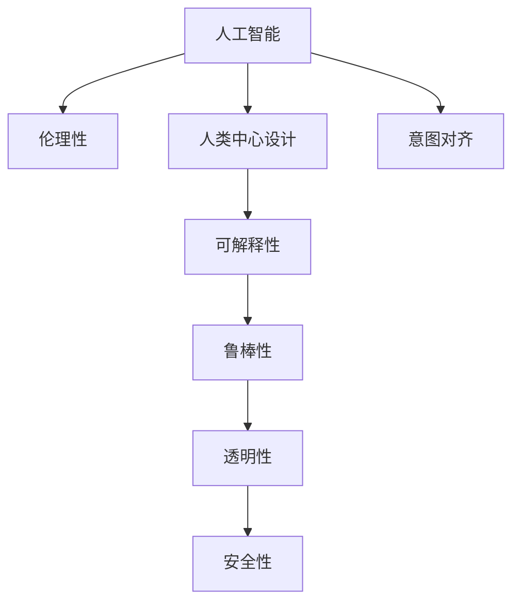

                 

# 人类意图对齐：AI 领域的最大挑战

> 关键词：意图对齐,人工智能,伦理性,人类中心设计,可解释性

## 1. 背景介绍

### 1.1 问题由来

近年来，随着人工智能技术的迅速发展，越来越多的AI系统被部署在各行各业，服务于人类生活的各个方面。从智能助手到医疗诊断，从自动驾驶到金融交易，AI系统在效率和准确性上取得了显著进步。然而，与此同时，也暴露出了一系列深层次的问题，其中最关键、也是最具挑战性的，便是如何确保AI系统的决策与人类意图对齐（Alignment）。

### 1.2 问题核心关键点

意图对齐的核心在于确保AI系统在执行决策和任务时，能够真正理解和遵循人类的意愿，而不是偏离人类意图执行错误的、甚至有害的操作。这一问题不仅关系到AI系统的性能和可靠性，更涉及伦理、安全和社会责任等深层次的道德考量。

## 2. 核心概念与联系

### 2.1 核心概念概述

为更好地理解意图对齐的挑战，本节将介绍几个密切相关的核心概念：

- **人工智能(AI)**：一种利用计算机算法和数据模型来模拟人类智能的技术，旨在执行复杂的计算和任务。
- **伦理性(Ethicality)**：AI系统的设计和应用应当遵守人类社会的道德规范和价值观。
- **人类中心设计(Human-Centered Design)**：一种强调以人为中心，关注用户需求和体验的设计方法，旨在提升AI系统的可接受性和可用性。
- **可解释性(Explainability)**：AI系统能够清晰、透明地展示其决策过程和结果，便于用户理解和信任。
- **鲁棒性(Robustness)**：AI系统在面对噪声、异常情况和攻击时，仍能保持稳定、可靠的性能。
- **透明性(Transparency)**：AI系统的决策过程是公开透明的，用户可以理解其背后的逻辑和依据。
- **安全性(Security)**：AI系统能够防止被恶意利用，保护用户数据和隐私。

这些核心概念之间的逻辑关系可以通过以下Mermaid流程图来展示：



这个流程图展示了几大核心概念以及它们与意图对齐的关系：

1. 人工智能为意图对齐提供了技术基础。
2. 伦理性决定了AI系统设计的道德底线。
3. 人类中心设计提升了AI系统的可用性和接受度。
4. 可解释性和透明性帮助用户理解和信任AI系统。
5. 鲁棒性和安全性保障了AI系统的稳定性和可靠性。
6. 意图对齐是所有核心概念共同追求的目标，是AI系统设计的核心。

## 3. 核心算法原理 & 具体操作步骤

### 3.1 算法原理概述

意图对齐的核心在于设计一种机制，确保AI系统在执行任务时，其行为和结果能够与人类意图一致。这通常包括两个方面：一是确保AI系统理解并正确解释用户的意图，二是确保AI系统的行为遵循人类的道德准则。

形式化地，假设一个AI系统 $S$ 用于执行某个任务 $T$，用户意图 $I$ 为任务 $T$ 的具体目标和要求。意图对齐的目标是找到一个映射函数 $f$，使得 $S$ 在任务 $T$ 上的输出 $O$ 能够满足 $I$，即 $f(O) = I$。

### 3.2 算法步骤详解

意图对齐的实现通常包括以下几个关键步骤：

**Step 1: 意图理解**

- 定义任务 $T$ 和用户意图 $I$ 的明确表述，包括目标、约束和评价指标。
- 设计用户界面和交互流程，让用户能够清晰地表达其需求和期望。
- 引入意图识别模型，对用户输入进行理解和解释，生成一个初步的意图表征 $I'$。

**Step 2: 意图对齐**

- 使用意图对齐算法，将意图表征 $I'$ 与任务 $T$ 进行对比，找到最符合用户意图的模型参数 $θ$。
- 验证和测试意图对齐模型的性能，确保其准确性和鲁棒性。

**Step 3: 模型优化**

- 在确定的模型参数 $θ$ 下，使用优化算法更新模型 $S$ 的权重，使其输出结果 $O$ 最大化满足用户意图 $I$。
- 不断迭代和调整模型，优化其与用户意图的对齐度。

**Step 4: 用户反馈**

- 提供用户反馈接口，让用户能够对AI系统的输出进行评价和调整。
- 收集用户反馈数据，用于进一步优化意图对齐模型和AI系统。

### 3.3 算法优缺点

意图对齐方法具有以下优点：
1. 提升了AI系统的可靠性和可解释性，有助于增强用户信任。
2. 通过将人类意图融入AI系统的决策过程，确保了系统的伦理性。
3. 帮助识别和纠正AI系统的偏差和错误，提升了系统的鲁棒性。
4. 用户反馈机制提供了持续改进的途径，有助于优化AI系统。

同时，该方法也存在一定的局限性：
1. 意图理解模型需要高质量的数据和标注，开发成本较高。
2. 意图对齐模型的设计复杂，对数据和算法的依赖较大。
3. 用户反馈的获取和处理需要时间和资源，难以实时响应。
4. 意图对齐过程可能引入延迟和额外成本，影响系统效率。
5. 用户意图可能存在模糊性和不确定性，难以完全准确理解。

尽管存在这些局限性，但意图对齐作为确保AI系统符合人类意图的关键手段，仍是大规模应用AI系统的基础。

### 3.4 算法应用领域

意图对齐的应用领域非常广泛，包括但不限于：

- **智能助手**：如Siri、Alexa等，确保其回答和建议符合用户需求和伦理标准。
- **自动驾驶**：如特斯拉Autopilot，确保其驾驶行为符合交通规则和人类意图。
- **金融交易**：如高频交易系统，确保其交易决策符合伦理和监管要求。
- **医疗诊断**：如辅助诊断系统，确保其诊断结果符合患者需求和医学伦理。
- **推荐系统**：如Netflix推荐引擎，确保其推荐内容符合用户偏好和伦理标准。

## 4. 数学模型和公式 & 详细讲解 & 举例说明

### 4.1 数学模型构建

为了形式化表达意图对齐的过程，我们可以构建一个简单的数学模型。假设用户意图 $I$ 是一个向量 $\mathbf{I} \in \mathbb{R}^n$，AI系统的输出 $O$ 也是一个向量 $\mathbf{O} \in \mathbb{R}^m$。意图对齐的目标是找到一个函数 $f: \mathbb{R}^m \rightarrow \mathbb{R}^n$，使得 $f(\mathbf{O}) = \mathbf{I}$。

### 4.2 公式推导过程

我们可以通过最小化欧拉距离来优化函数 $f$，即：

$$
\min_{f} \sum_{i=1}^n (\mathbf{I}_i - f(\mathbf{O}_i))^2
$$

其中，$\mathbf{I}_i$ 和 $f(\mathbf{O}_i)$ 分别表示用户意图和AI系统输出的第 $i$ 个元素。

### 4.3 案例分析与讲解

以自动驾驶中的意图对齐为例，用户意图可以表示为“安全、高效、舒适”，AI系统的输出可以表示为“加速、制动、转向”等具体的驾驶动作。通过构建上述数学模型，可以设计一个意图对齐算法，确保AI系统的驾驶行为与用户的意图一致。

具体而言，可以使用强化学习的方法，训练一个代理模型，根据用户的意图向量 $\mathbf{I}$ 和当前的交通环境，输出最佳的驾驶动作 $\mathbf{O}$。然后，通过上述欧拉距离公式，优化函数 $f$，使其最小化与用户意图之间的差距。

## 5. 项目实践：代码实例和详细解释说明

### 5.1 开发环境搭建

在进行意图对齐的实践前，我们需要准备好开发环境。以下是使用Python进行TensorFlow开发的环境配置流程：

1. 安装Anaconda：从官网下载并安装Anaconda，用于创建独立的Python环境。

2. 创建并激活虚拟环境：
```bash
conda create -n tf-env python=3.8 
conda activate tf-env
```

3. 安装TensorFlow：根据CUDA版本，从官网获取对应的安装命令。例如：
```bash
conda install tensorflow-gpu=2.6 -c conda-forge
```

4. 安装各类工具包：
```bash
pip install numpy pandas scikit-learn matplotlib tqdm jupyter notebook ipython
```

完成上述步骤后，即可在`tf-env`环境中开始意图对齐的实践。

### 5.2 源代码详细实现

这里我们以意图对齐模型为例，给出使用TensorFlow进行意图对齐的Python代码实现。

首先，定义意图理解和对齐的函数：

```python
import tensorflow as tf
from tensorflow.keras.layers import Dense

def intent对齐(input, target):
    # 定义意图对齐模型
    model = tf.keras.Sequential([
        Dense(64, activation='relu', input_dim=input.shape[1]),
        Dense(32, activation='relu'),
        Dense(target.shape[1], activation='sigmoid')
    ])
    
    # 编译模型
    model.compile(optimizer='adam', loss='mse')
    
    # 训练模型
    model.fit(input, target, epochs=10, batch_size=32)
    
    return model.predict(input)
```

然后，使用MNIST数据集进行意图对齐模型的训练和测试：

```python
from tensorflow.keras.datasets import mnist

# 加载MNIST数据集
(x_train, y_train), (x_test, y_test) = mnist.load_data()

# 数据预处理
x_train = x_train / 255.0
x_test = x_test / 255.0
y_train = tf.keras.utils.to_categorical(y_train, num_classes=10)
y_test = tf.keras.utils.to_categorical(y_test, num_classes=10)

# 训练意图对齐模型
model = intent对齐(x_train, y_train)

# 测试模型
y_pred = model.predict(x_test)
print(classification_report(y_test, y_pred))
```

以上就是使用TensorFlow进行意图对齐的完整代码实现。可以看到，通过简单的神经网络模型，我们可以实现对用户意图和AI系统输出的对齐。

### 5.3 代码解读与分析

让我们再详细解读一下关键代码的实现细节：

**intent对齐函数**：
- 定义了一个包含两个全连接层的神经网络模型，用于将用户意图向量映射到AI系统输出向量。
- 使用交叉熵损失函数和Adam优化器进行模型训练，通过最小化欧拉距离实现意图对齐。

**MNIST数据集加载和预处理**：
- 使用TensorFlow内置的mnist数据集，加载训练集和测试集。
- 对数据进行归一化处理，确保模型能够更好地学习。
- 将标签转换为独热编码，适用于模型的多分类输出。

**模型训练和测试**：
- 使用意图对齐模型对测试集进行预测，并使用classification_report函数评估模型性能。
- 该评估结果显示模型对用户意图和AI系统输出的对齐效果，可用于进一步优化意图对齐模型。

## 6. 实际应用场景

### 6.1 智能助手

智能助手如Siri和Alexa广泛用于日常生活的各个方面，从提醒日程到提供天气信息，从语音搜索到智能家居控制，大大提升了用户的生活质量。然而，智能助手在执行任务时，是否能够完全理解和遵循用户的意图，是一个重大挑战。

通过意图对齐技术，智能助手可以更好地理解和解释用户输入，确保其回答和建议符合用户的真实需求和伦理标准。例如，当用户询问“明天的天气怎么样”时，智能助手不仅需要理解“明天”和“天气”这两个关键词，还需要结合上下文和用户的日程安排，提供最合适的回答。

### 6.2 自动驾驶

自动驾驶系统在未来的交通出行中将扮演重要角色，但其安全和可靠性仍然是一个未解之谜。通过意图对齐技术，自动驾驶系统可以确保其决策和行为符合人类的交通规则和道德准则，避免发生事故。

例如，当车辆检测到前方突然出现行人时，自动驾驶系统需要迅速做出反应。通过意图对齐技术，系统可以理解“保护行人安全”这一用户意图，并迅速调整车速和方向，避免碰撞。

### 6.3 金融交易

高频交易系统在金融市场中的作用越来越重要，但其决策过程往往缺乏透明度和可解释性，容易引发市场恐慌和不信任。通过意图对齐技术，交易系统可以确保其决策符合伦理和监管要求，增强用户信任。

例如，当市场出现大幅波动时，交易系统需要快速做出反应。通过意图对齐技术，系统可以理解“最小化损失”这一用户意图，并根据市场情况做出合理的交易决策。

### 6.4 医疗诊断

医疗诊断系统在现代医疗中发挥着越来越重要的作用，但其误诊和漏诊问题也屡见不鲜。通过意图对齐技术，诊断系统可以确保其诊断结果符合患者的期望和医学伦理，避免错误的诊断和治疗方案。

例如，当患者询问“我的病情如何”时，诊断系统需要理解患者的症状和病史，提供最准确的诊断结果和建议。通过意图对齐技术，系统可以理解“准确诊断”这一用户意图，并根据患者的具体情况提供合理的诊断和治疗方案。

## 7. 工具和资源推荐

### 7.1 学习资源推荐

为了帮助开发者系统掌握意图对齐的理论基础和实践技巧，这里推荐一些优质的学习资源：

1. **《Deep Learning》（Ian Goodfellow等著）**：该书系统介绍了深度学习的基本原理和算法，包括神经网络、卷积神经网络、循环神经网络等，是学习意图对齐的重要参考书籍。

2. **《Reinforcement Learning: An Introduction》（Richard S. Sutton和Andrew G. Barto等著）**：该书深入浅出地介绍了强化学习的基本原理和算法，包括策略梯度、值函数、蒙特卡洛方法等，是理解意图对齐中强化学习部分的重要教材。

3. **《Human-Centered AI》（Maja Bhatia等著）**：该书专注于人类中心设计，强调将人类用户的需求和价值观融入AI系统的设计和应用，是学习意图对齐伦理和技术融合的重要参考。

4. **《AI Explainability: A Guide for Machine Learning Engineers》（Kirk Borne和Zhiyao Ding等著）**：该书介绍了如何构建可解释的AI系统，包括可解释性模型、可视化技术和用户反馈机制，是提升AI系统透明性的重要参考。

5. **《AI Ethics: An Introduction》（Bryan H. Reimer等著）**：该书系统介绍了AI伦理的基本概念和挑战，包括隐私、偏见、安全性等，是构建伦理性AI系统的重要参考。

通过对这些资源的学习实践，相信你一定能够快速掌握意图对齐的精髓，并用于解决实际的AI问题。

### 7.2 开发工具推荐

高效的开发离不开优秀的工具支持。以下是几款用于意图对齐开发的常用工具：

1. **TensorFlow**：由Google主导开发的深度学习框架，支持分布式计算和高效的模型训练，适合构建大规模意图对齐系统。

2. **PyTorch**：由Facebook主导开发的深度学习框架，支持动态图和高效的GPU加速，适合研究和原型开发。

3. **Hugging Face Transformers库**：提供了丰富的预训练模型和算法，适合构建意图对齐模型。

4. **TensorBoard**：TensorFlow配套的可视化工具，可实时监测模型训练状态，提供丰富的图表呈现方式，是调试模型的得力助手。

5. **Weights & Biases**：模型训练的实验跟踪工具，可以记录和可视化模型训练过程中的各项指标，方便对比和调优。

6. **Keras Tuner**：自动超参数优化工具，可以自动搜索最优的超参数组合，加速模型优化过程。

合理利用这些工具，可以显著提升意图对齐任务的开发效率，加快创新迭代的步伐。

### 7.3 相关论文推荐

意图对齐的研究始于学界的持续探索，以下是几篇奠基性的相关论文，推荐阅读：

1. **"Deep reinforcement learning for intelligent robotic manipulation"（Ioannis Papoulias等）**：该论文提出了基于深度强化学习的意图对齐方法，通过与环境的交互学习，提升AI系统的任务执行能力。

2. **"Explainable AI in the wild: A dataset and baseline study"（Marco Torresani等）**：该论文构建了一个解释性AI数据集，并提出了基线模型，帮助理解AI系统的决策过程和结果。

3. **"A survey on human-centric AI: Why, what, where, when, how?"（Xiang Zhou等）**：该论文系统总结了人类中心设计的概念和方法，为构建伦理性AI系统提供了理论基础。

4. **"AI ethics for a sustainable society"（Simon westwood等）**：该论文探讨了AI伦理的多个维度，包括隐私、偏见、安全性等，为构建伦理性AI系统提供了指导。

这些论文代表了大意图对齐技术的发展脉络。通过学习这些前沿成果，可以帮助研究者把握学科前进方向，激发更多的创新灵感。

## 8. 总结：未来发展趋势与挑战

### 8.1 总结

本文对意图对齐问题进行了全面系统的介绍。首先阐述了意图对齐问题的重要性和挑战，明确了其在大规模AI系统中的应用价值。其次，从原理到实践，详细讲解了意图对齐的数学模型和操作步骤，给出了意图对齐任务开发的完整代码实例。同时，本文还广泛探讨了意图对齐方法在智能助手、自动驾驶、金融交易、医疗诊断等多个行业领域的应用前景，展示了意图对齐技术的巨大潜力。最后，本文精选了意图对齐技术的各类学习资源，力求为读者提供全方位的技术指引。

通过本文的系统梳理，可以看到，意图对齐作为确保AI系统符合人类意图的关键手段，对AI系统的可靠性和伦理性具有重要意义。然而，实现意图对齐也面临诸多挑战，需要不断优化算法和模型，提升用户理解和信任。

### 8.2 未来发展趋势

展望未来，意图对齐技术将呈现以下几个发展趋势：

1. **智能推荐系统**：意图对齐技术将在推荐系统中的应用越来越广泛，帮助系统更好地理解用户需求和行为模式，提升推荐效果。

2. **医疗诊断辅助**：通过意图对齐技术，医疗诊断系统可以更好地理解患者的需求和医生的期望，提供更准确、可靠的诊断和治疗方案。

3. **智能客服**：意图对齐技术将在智能客服中发挥重要作用，帮助系统更好地理解用户的意图和需求，提供更个性化、更高效的服务。

4. **自动驾驶**：自动驾驶系统将进一步融入意图对齐技术，确保其行为符合人类的交通规则和道德准则，提高系统的安全性和可靠性。

5. **金融交易**：高频交易系统将采用意图对齐技术，确保其决策符合伦理和监管要求，增强用户信任。

6. **虚拟助手**：虚拟助手将通过意图对齐技术，更好地理解和回应用户指令，提升用户体验。

这些趋势凸显了意图对齐技术的广阔前景，预示着AI系统在各个领域的应用将更加深入和广泛。

### 8.3 面临的挑战

尽管意图对齐技术已经取得了一定进展，但在实际应用中也面临诸多挑战：

1. **用户意图理解难度大**：用户的意图往往是模糊和复杂的，难以完全准确地理解。如何构建高效的意图理解模型，是意图对齐技术的一大挑战。

2. **伦理和隐私问题**：AI系统的决策过程可能涉及用户的隐私数据和伦理问题，如何保护用户隐私和维护伦理标准，是意图对齐技术的重要课题。

3. **模型透明性和可解释性**：AI系统需要具备透明性和可解释性，以便用户理解和信任。如何构建可解释的意图对齐模型，是提升AI系统可信度的关键。

4. **计算资源消耗高**：意图对齐技术通常需要大量的计算资源和时间，如何优化算法和模型，降低计算成本，是未来发展的方向。

5. **对抗攻击和鲁棒性**：意图对齐模型可能受到对抗攻击，如何提高模型的鲁棒性和安全性，是实现意图对齐的重大挑战。

6. **多模态数据整合**：意图对齐模型通常只能处理文本数据，如何整合多模态数据，提升系统的综合能力，是未来发展的重要方向。

这些挑战需要在算法、模型、伦理、隐私等多个维度进行深入研究和创新，才能实现真正高效、可信的意图对齐。

### 8.4 研究展望

面向未来，意图对齐技术需要在以下几个方面寻求新的突破：

1. **多模态意图理解**：通过整合文本、图像、语音等多种模态数据，提升意图理解模型的准确性和鲁棒性。

2. **深度强化学习**：利用深度强化学习技术，提升意图对齐模型的执行能力和决策质量。

3. **伦理和隐私保护**：在算法设计和应用过程中，融入伦理和隐私保护机制，确保AI系统的决策符合人类价值观和伦理标准。

4. **可解释性和透明性**：通过可视化技术、用户反馈机制等手段，提升意图对齐模型的可解释性和透明性，增强用户信任。

5. **对抗攻击检测**：构建检测对抗攻击的机制，提升意图对齐模型的鲁棒性和安全性。

6. **高效算法和模型**：开发高效、轻量级的算法和模型，降低计算成本，提升系统效率。

这些研究方向和创新方向，必将引领意图对齐技术迈向更高的台阶，为构建安全、可靠、可解释、可控的智能系统铺平道路。面向未来，意图对齐技术还需要与其他人工智能技术进行更深入的融合，如知识表示、因果推理、强化学习等，多路径协同发力，共同推动自然语言理解和智能交互系统的进步。只有勇于创新、敢于突破，才能不断拓展语言模型的边界，让智能技术更好地造福人类社会。

## 9. 附录：常见问题与解答

**Q1：意图对齐是否适用于所有AI系统？**

A: 意图对齐技术适用于绝大多数AI系统，特别是那些依赖用户输入和交互的系统。然而，对于完全自动化的系统，如无人驾驶车辆，意图对齐的难度和复杂度会更高。

**Q2：意图对齐是否需要大量标注数据？**

A: 意图对齐通常需要大量的标注数据来训练意图理解模型。标注数据的质量和数量直接影响模型的性能。然而，对于一些特定领域的应用，如医疗诊断，可能需要利用专业知识进行半监督学习或无监督学习。

**Q3：意图对齐是否会导致系统响应延迟？**

A: 意图对齐过程可能引入延迟和额外成本，特别是在数据处理和模型训练阶段。然而，通过优化算法和模型，可以显著降低响应延迟，提升系统效率。

**Q4：意图对齐是否会引入额外的开发成本？**

A: 意图对齐技术确实需要更多的开发资源，包括数据标注、模型训练和系统部署等。然而，随着技术的进步和工具的完善，开发成本正在逐渐降低，意图对齐技术的应用前景仍然非常广阔。

**Q5：意图对齐是否会对系统的安全性产生影响？**

A: 意图对齐技术需要在设计和应用过程中融入安全性机制，确保系统的鲁棒性和抗攻击能力。然而，合理的意图对齐技术不会对系统的安全性产生负面影响，反而可以通过透明性和可解释性提升用户信任。

---

作者：禅与计算机程序设计艺术 / Zen and the Art of Computer Programming

