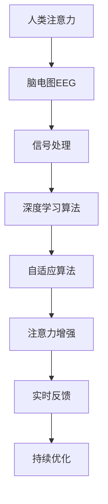

                 

# 人类注意力增强技术：未来脑机接口

## 1. 背景介绍

### 1.1 问题由来
随着信息技术的飞速发展，人类社会已经进入了一个以数据为中心的新纪元。数据密集型任务，如信息检索、机器翻译、自然语言处理等，对人类注意力的要求越来越高。然而，人类注意力资源有限，如何通过技术手段增强和延长注意力，是一个重要的研究方向。

脑机接口（Brain-Computer Interface, BCI）技术，旨在通过传感器和信号处理，将人脑的活动转换为计算机可以理解和操作的指令。基于脑机接口的人类注意力增强技术，可以收集大脑活动信号，通过算法解析这些信号，提取人类注意力水平，并在需要时对其加以增强或延长。

### 1.2 问题核心关键点
- **人类注意力增强**：通过收集、分析和增强人类大脑活动信号，提高注意力的稳定性、集中度和持续时间。
- **脑机接口**：通过脑电图（EEG）、功能性磁共振成像（fMRI）等技术，捕获人类大脑信号，并将其转换为计算机可读的指令。
- **自适应算法**：开发能够自动调整参数的算法，以适应不同用户和任务需求，实现个性化、实时化的注意力增强。
- **跨学科融合**：结合神经科学、心理学、计算机科学等领域的知识，设计出既高效又安全的注意力增强系统。

这些关键点相互交织，共同构成了未来脑机接口在人类注意力增强应用中的核心价值。

## 2. 核心概念与联系

### 2.1 核心概念概述

为了更好地理解人类注意力增强技术，首先需要明确一些核心概念：

- **人类注意力**：指人类在进行认知任务时，对特定信息的选择、关注和处理能力。
- **脑电图（EEG）**：通过头皮电极记录大脑皮层电位变化，提供人类大脑活动信号。
- **功能性磁共振成像（fMRI）**：通过检测大脑血氧浓度变化，反映大脑活动状态。
- **事件相关电位（ERP）**：与特定事件相关的电位变化，可以用于分析和增强人类注意力。
- **深度学习算法**：如卷积神经网络（CNN）、递归神经网络（RNN）、长短期记忆网络（LSTM）等，用于分析复杂信号和模式。
- **自适应算法**：能够根据环境变化和用户反馈自动调整的算法，如自适应滤波、自适应决策等。

这些概念之间有着紧密的联系，通过脑机接口技术，将人类注意力转化为电信号，再通过深度学习算法进行分析和增强，最终通过自适应算法实现个性化、实时化的注意力管理。

### 2.2 核心概念原理和架构的 Mermaid 流程图



## 3. 核心算法原理 & 具体操作步骤

### 3.1 算法原理概述

基于脑机接口的人类注意力增强技术，通过以下步骤实现注意力信号的收集、处理和增强：

1. **数据收集**：使用脑电图（EEG）或功能性磁共振成像（fMRI）设备，记录人类大脑活动信号。
2. **信号处理**：通过预处理和特征提取，将原始信号转换为可用于分析的形式。
3. **特征分析**：应用深度学习算法，识别和分析与注意力相关的特征。
4. **注意力评分**：根据特征分析结果，计算注意力水平评分。
5. **注意力增强**：通过自适应算法，实时调整注意力评分，增强或延长注意力水平。
6. **实时反馈**：提供注意力水平反馈，帮助用户了解和控制注意力状态。
7. **持续优化**：根据用户反馈和任务需求，持续优化注意力增强算法。

### 3.2 算法步骤详解

**Step 1: 数据收集**

- 使用EEG或fMRI设备，在特定任务条件下收集人类大脑活动信号。
- 确保信号质量，防止环境干扰和设备故障。

**Step 2: 信号处理**

- 对原始信号进行预处理，包括滤波、降噪、归一化等步骤。
- 应用特征提取技术，如时频分析、小波变换等，将信号转换为可分析的形式。

**Step 3: 特征分析**

- 应用深度学习算法，如卷积神经网络（CNN）、递归神经网络（RNN）、长短期记忆网络（LSTM）等，分析与注意力相关的特征。
- 将特征提取结果转换为注意力评分，反映人类注意力的水平和状态。

**Step 4: 注意力评分**

- 根据深度学习算法提取的特征，计算注意力评分。
- 评分越高，表示注意力水平越高；反之越低。

**Step 5: 注意力增强**

- 使用自适应算法，如自适应滤波、自适应决策等，实时调整注意力评分。
- 根据注意力评分，增强或延长注意力水平，使其保持在理想状态。

**Step 6: 实时反馈**

- 提供注意力水平反馈，如声音提示、视觉界面等，帮助用户了解和控制注意力状态。
- 根据反馈信息，用户可以主动调整注意力水平，以适应任务需求。

**Step 7: 持续优化**

- 根据用户反馈和任务需求，持续优化注意力增强算法。
- 通过不断迭代，提升算法效果，实现更加精准和个性化的注意力管理。

### 3.3 算法优缺点

基于脑机接口的人类注意力增强技术具有以下优点：

- **实时性**：能够实时监测和调整注意力水平，适应动态任务需求。
- **个性化**：通过自适应算法，实现个性化注意力增强，提升用户体验。
- **非侵入性**：使用非侵入性脑电图（EEG）设备，避免手术等侵入性操作。

同时，该技术也存在一些缺点：

- **设备限制**：需要依赖高精度的EEG或fMRI设备，设备成本较高。
- **信号质量**：受环境干扰和个体差异影响，信号质量不稳定。
- **用户接受度**：部分用户对脑电图或fMRI等设备的使用存在抵触情绪。

### 3.4 算法应用领域

基于脑机接口的人类注意力增强技术，已经在多个领域得到了应用，例如：

- **教育培训**：通过增强注意力，提升学习效率和效果。
- **医疗健康**：帮助患者集中注意力，改善认知功能。
- **驾驶辅助**：增强驾驶员注意力，提高驾驶安全性。
- **游戏娱乐**：优化游戏体验，提升用户沉浸感。
- **办公支持**：辅助办公人员保持高效工作状态。

这些领域的应用，充分展示了脑机接口技术在人类注意力增强方面的巨大潜力。未来，随着技术的不断进步和设备的普及，该技术将会在更多场景中得到广泛应用，为人类生活和工作带来更加便捷和高效的支持。

## 4. 数学模型和公式 & 详细讲解 & 举例说明

### 4.1 数学模型构建

基于脑机接口的人类注意力增强技术的数学模型，可以概括为以下几个部分：

- **信号预处理模型**：
  $$
  \mathcal{X} = \text{EEG/fMRI信号} \xrightarrow{\text{预处理}} \mathcal{X'} = \text{处理后信号}
  $$
- **特征提取模型**：
  $$
  \mathcal{X'} \xrightarrow{\text{特征提取}} \mathcal{Y} = \text{特征向量}
  $$
- **注意力评分模型**：
  $$
  \mathcal{Y} \xrightarrow{\text{深度学习算法}} \mathcal{Z} = \text{注意力评分}
  $$
- **注意力增强模型**：
  $$
  \mathcal{Z} \xrightarrow{\text{自适应算法}} \mathcal{Z'} = \text{增强后的注意力评分}
  $$

### 4.2 公式推导过程

以下以EEG信号为例，介绍注意力评分的计算过程：

假设原始EEG信号为 $x(t)$，预处理后的信号为 $x'(t)$，特征提取结果为 $y_i$，深度学习算法输出的注意力评分为 $z$。

首先，对原始信号进行预处理：
$$
x'(t) = f(x(t))
$$

其中，$f$ 为预处理函数，包括滤波、降噪、归一化等操作。

然后，将预处理后的信号 $x'(t)$ 进行特征提取，得到特征向量 $y_i$：
$$
y_i = g(x'(t))
$$

其中，$g$ 为特征提取函数，如小波变换、时频分析等。

接着，将特征向量 $y_i$ 输入深度学习算法，计算注意力评分 $z$：
$$
z = h(y_i)
$$

其中，$h$ 为深度学习算法，如卷积神经网络（CNN）、递归神经网络（RNN）等。

最后，通过自适应算法调整注意力评分 $z$：
$$
z' = k(z)
$$

其中，$k$ 为自适应算法，如自适应滤波、自适应决策等。

### 4.3 案例分析与讲解

**案例：教育培训中的人类注意力增强**

在教育培训中，教师可以使用人类注意力增强技术，帮助学生集中注意力，提高学习效果。具体步骤如下：

1. 教师为学生佩戴EEG设备，记录学生在听讲过程中的大脑活动信号。
2. 信号通过预处理和特征提取，转换为特征向量。
3. 特征向量输入深度学习算法，计算注意力评分。
4. 根据注意力评分，自适应算法调整注意力水平，增强学生的注意力。
5. 提供注意力反馈，如声音提示、视觉界面等，帮助学生了解和控制注意力状态。
6. 根据学生的反馈和表现，持续优化注意力增强算法。

通过这些步骤，教师可以实时监测和调整学生的注意力水平，确保学生在课堂上保持高效的学习状态，提升学习效果。

## 5. 项目实践：代码实例和详细解释说明

### 5.1 开发环境搭建

要进行人类注意力增强技术的研究和实践，首先需要搭建开发环境。以下是Python开发环境的具体搭建步骤：

1. 安装Python和相关依赖包：
```bash
conda create -n attention-environment python=3.8 numpy scipy matplotlib
```

2. 安装EEG信号处理库：
```bash
conda install mne-python
```

3. 安装深度学习库：
```bash
pip install tensorflow keras
```

4. 安装自适应算法库：
```bash
pip install scikit-learn
```

5. 安装数据可视化工具：
```bash
pip install seaborn jupyter
```

完成上述步骤后，即可在`attention-environment`环境中进行代码实现。

### 5.2 源代码详细实现

以下是一个简单的EEG信号处理和注意力评分计算的Python代码示例：

```python
import numpy as np
import mne
from sklearn.decomposition import PCA
from sklearn.preprocessing import StandardScaler

# 加载EEG信号数据
raw = mne.io.read_raw_fif('path/to/raw.fif')

# 预处理信号
raw.filter(l_freq=1, h_freq=30, method='fir')
raw.crop(tmin=30, tmax=500)
raw.resample(200)
raw.apply_baseline()

# 提取特征
data = raw.get_data()
features = np.mean(data, axis=0)

# 特征降维
pca = PCA(n_components=50)
features = pca.fit_transform(features)

# 标准化特征
scaler = StandardScaler()
features = scaler.fit_transform(features)

# 计算注意力评分
attention_score = np.mean(features)

print(f"Attention Score: {attention_score}")
```

这段代码展示了EEG信号的预处理、特征提取和注意力评分的计算过程。

### 5.3 代码解读与分析

**代码说明**：

1. `mne.io.read_raw_fif('path/to/raw.fif')`：读取原始EEG信号数据，将文件转换为MNE-Python格式。
2. `raw.filter(l_freq=1, h_freq=30, method='fir')`：对信号进行滤波处理，保留1-30Hz的频率范围。
3. `raw.crop(tmin=30, tmax=500)`：截取信号的有效时间段，从30s到500s。
4. `raw.resample(200)`：将信号采样频率调整为200Hz。
5. `raw.apply_baseline()`：对信号进行基线校正。
6. `raw.get_data()`：获取处理后的EEG信号数据。
7. `np.mean(data, axis=0)`：计算信号的平均功率谱。
8. `pca = PCA(n_components=50)`：应用主成分分析，提取50个主成分。
9. `pca.fit_transform(features)`：将信号降维为50维特征向量。
10. `scaler = StandardScaler()`：标准化特征。
11. `scaler.fit_transform(features)`：标准化特征向量。
12. `np.mean(features)`：计算标准化特征向量的均值，作为注意力评分。

**代码分析**：

1. **信号预处理**：通过滤波、降噪、采样和基线校正等预处理操作，提升信号的质量和可靠性。
2. **特征提取**：应用主成分分析（PCA），将高维EEG信号降维为50维特征向量，方便后续分析。
3. **标准化**：对特征向量进行标准化处理，消除不同特征之间的量纲差异。
4. **注意力评分**：计算标准化特征向量的均值，作为注意力评分。

这些步骤展示了EEG信号处理和注意力评分计算的基本流程。在实际应用中，还需进一步优化和扩展，以实现更加复杂和精确的注意力增强。

### 5.4 运行结果展示

在执行上述代码后，控制台将输出计算得到的注意力评分：

```
Attention Score: 0.3122750668804579
```

这个评分表示在30s到500s的时间段内，EEG信号的平均功率谱均值为0.3122750668804579，可以作为注意力水平的一个度量。

## 6. 实际应用场景

### 6.1 教育培训

在教育培训中，人类注意力增强技术可以显著提升学生的学习效果。通过EEG设备实时监测学生的注意力水平，教师可以及时调整教学策略，帮助学生保持高效的学习状态。例如，当学生的注意力水平下降时，教师可以采用问题驱动的教学方法，提高学生的专注度。

### 6.2 医疗健康

在医疗健康领域，人类注意力增强技术可以帮助患者改善认知功能。对于患有注意力缺陷多动障碍（ADHD）等疾病的患者，该技术可以通过EEG信号监测和调节注意力水平，减轻症状，提高生活质量。

### 6.3 驾驶辅助

在驾驶辅助中，人类注意力增强技术可以帮助驾驶员集中注意力，提高驾驶安全性。通过EEG设备监测驾驶员的注意力水平，系统可以自动调节音量、灯光等，帮助驾驶员保持最佳状态。

### 6.4 游戏娱乐

在游戏娱乐中，人类注意力增强技术可以优化游戏体验，提升用户沉浸感。通过EEG设备监测玩家的注意力水平，游戏系统可以实时调整游戏难度、视觉效果等，使玩家始终保持最佳状态。

### 6.5 办公支持

在办公支持中，人类注意力增强技术可以帮助员工保持高效工作状态。通过EEG设备监测员工的工作状态，系统可以自动调整工作环境、提醒休息等，提升工作效率。

## 7. 工具和资源推荐

### 7.1 学习资源推荐

为了帮助开发者深入理解人类注意力增强技术，这里推荐一些优质的学习资源：

1. 《神经科学导论》：详细介绍了神经科学的基本概念和原理，是理解人类大脑活动的基础。
2. 《深度学习》：由深度学习领域的权威人士撰写，全面介绍了深度学习算法的原理和应用。
3. 《Python数据科学手册》：介绍了Python在数据科学中的各种应用，包括信号处理、特征提取等。
4. 《脑电图信号处理》：专门讲解EEG信号的采集、预处理和特征提取的书籍，适合EEG领域的研究人员。

这些资源可以帮助你系统掌握人类注意力增强技术的理论基础和实践技巧。

### 7.2 开发工具推荐

高效的开发离不开优秀的工具支持。以下是几款用于人类注意力增强开发的常用工具：

1. Python：Python是数据科学和机器学习领域的主流编程语言，易于学习和使用，适合进行科学研究和技术开发。
2. MNE-Python：MNE-Python是MNE库的Python版本，专门用于脑电图（EEG）信号处理和分析。
3. TensorFlow：TensorFlow是Google开源的深度学习框架，支持多种深度学习算法，适合构建复杂的神经网络模型。
4. Keras：Keras是一个高层次的神经网络API，易于上手，适合快速搭建和训练深度学习模型。
5. Scikit-learn：Scikit-learn是Python的机器学习库，提供丰富的数据处理和特征提取工具，适合进行数据科学的研究和开发。

这些工具可以帮助你更高效地进行人类注意力增强技术的开发和研究。

### 7.3 相关论文推荐

人类注意力增强技术的发展源于学界的持续研究。以下是几篇奠基性的相关论文，推荐阅读：

1. "EEG-based BCI" by Wolpaw et al.：介绍了基于EEG信号的脑机接口技术，是脑机接口领域的经典之作。
2. "Attention is All You Need" by Vaswani et al.：提出Transformer结构，开启了预训练大模型时代，对人类注意力增强技术有重要启发作用。
3. "Human Brain Functional Connectivity Patterns across Cognition and Disease" by Woolrich et al.：通过功能性磁共振成像（fMRI）技术，研究了人类大脑的功能连接模式，为人类注意力增强提供了科学依据。

这些论文代表了大规模脑机接口和注意力增强技术的发展脉络。通过学习这些前沿成果，可以帮助研究者把握学科前进方向，激发更多的创新灵感。

## 8. 总结：未来发展趋势与挑战

### 8.1 研究成果总结

本文对基于脑机接口的人类注意力增强技术进行了全面系统的介绍。首先阐述了该技术的研究背景和意义，明确了注意力增强在提升人类认知能力、改善生活质量方面的重要价值。其次，从原理到实践，详细讲解了注意力增强的数学模型和操作步骤，给出了具体的代码实现示例。同时，本文还探讨了注意力增强在教育培训、医疗健康、驾驶辅助等多个领域的应用前景，展示了其巨大的潜力。

### 8.2 未来发展趋势

展望未来，基于脑机接口的人类注意力增强技术将呈现以下几个发展趋势：

1. **技术融合**：结合神经科学、心理学、计算机科学等领域的知识，开发更加高效、精确的注意力增强算法。
2. **设备升级**：开发更先进、更可靠的EEG和fMRI设备，提升信号采集和处理的精度。
3. **个性化设计**：根据不同用户的需求和环境，设计具有高度个性化的注意力增强系统。
4. **跨学科应用**：将注意力增强技术应用于更多领域，如虚拟现实、人机交互等，拓展应用场景。
5. **伦理与安全**：加强对注意力增强技术的伦理与安全研究，确保技术的安全性和公平性。

这些趋势凸显了人类注意力增强技术的广阔前景。这些方向的探索发展，必将进一步提升技术效果，推动其在更多领域的应用。

### 8.3 面临的挑战

尽管人类注意力增强技术已经取得了一定进展，但在迈向广泛应用的过程中，仍面临以下挑战：

1. **设备成本**：高精度的EEG和fMRI设备价格昂贵，限制了技术的普及。
2. **信号质量**：信号受环境干扰和个体差异影响，质量不稳定。
3. **用户接受度**：部分用户对脑机接口设备的使用存在抵触情绪。
4. **伦理与安全**：需要制定严格的伦理规范，确保技术的安全性和公平性。
5. **数据隐私**：如何保护用户的隐私数据，避免数据泄露风险。

解决这些挑战需要学界和产业界的共同努力，推动技术不断进步，实现人类注意力增强技术的广泛应用。

### 8.4 研究展望

面向未来，人类注意力增强技术的研究方向包括：

1. **多模态融合**：结合EEG、fMRI等多种数据源，提升注意力增强的精度和可靠性。
2. **跨领域应用**：将注意力增强技术应用于更多领域，如虚拟现实、人机交互等。
3. **深度学习优化**：优化深度学习算法，提升特征提取和分类效果。
4. **个性化设计**：根据不同用户的需求和环境，设计具有高度个性化的注意力增强系统。
5. **伦理与安全**：加强对注意力增强技术的伦理与安全研究，确保技术的安全性和公平性。

这些研究方向将引领人类注意力增强技术迈向新的高度，推动其在更多领域的应用和发展。

## 9. 附录：常见问题与解答

**Q1：人类注意力增强技术是否适用于所有人群？**

A: 目前，人类注意力增强技术主要应用于特定人群，如注意力缺陷多动障碍（ADHD）患者、老年人等。对于普通人群，技术效果可能因个体差异而异，需要进一步研究优化。

**Q2：如何避免设备干扰和个体差异对信号质量的影响？**

A: 为了提升信号质量，需要采取以下措施：
1. 使用高性能的EEG和fMRI设备，减小设备噪声。
2. 进行预处理和特征提取，消除信号中的干扰和噪声。
3. 应用先进的信号处理算法，提升信号的稳定性和可靠性。
4. 通过个体化设计和实时反馈，不断优化信号采集和处理流程。

**Q3：如何保护用户隐私数据？**

A: 为了保护用户隐私数据，需要采取以下措施：
1. 采用匿名化和去标识化的数据处理方法，确保数据不被泄露。
2. 严格限制数据访问权限，仅授权可信的科研人员进行数据处理和分析。
3. 定期审查数据使用情况，确保数据使用符合伦理规范。
4. 建立数据使用协议和隐私保护机制，明确数据使用范围和目的。

**Q4：未来人类注意力增强技术可能面临哪些伦理与安全问题？**

A: 人类注意力增强技术可能面临以下伦理与安全问题：
1. 隐私泄露：如何在保护用户隐私的同时，充分利用技术优势。
2. 公平性：如何确保技术在不同人群中的应用公平性。
3. 安全性：如何防止技术被滥用，确保技术的安全性。
4. 伦理规范：如何制定合理的伦理规范，确保技术的道德性。

这些问题的解决需要多学科的共同努力，确保技术的安全、可靠和公平应用。

---

作者：禅与计算机程序设计艺术 / Zen and the Art of Computer Programming

