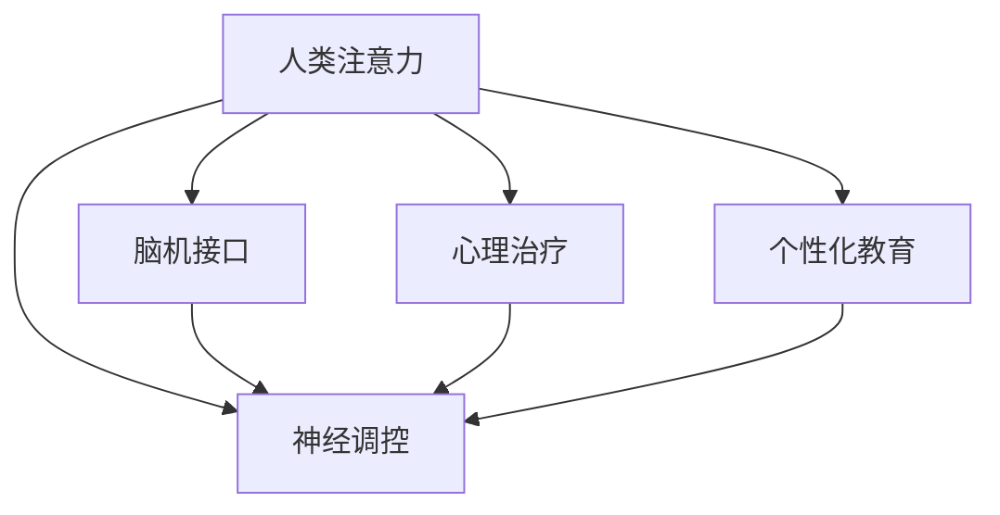

                 

# 人类注意力增强：提升专注力和注意力在教育中的未来趋势预测

> 关键词：人类注意力,教育,专注力,未来趋势,脑机接口,神经调控,心理治疗,个性化教育

## 1. 背景介绍

### 1.1 问题由来

随着数字化和信息化的不断深入，人们在信息爆炸的环境下，面对海量信息的筛选、处理和整合任务日益繁重。这一挑战不仅存在于工作场景，更延伸到学习过程中。如何帮助学生更好地集中注意力、提高学习效率，是教育界和心理学家们长久以来关注的重要议题。

在传统的学习过程中，学生依靠意志力、环境控制等方式进行自我管理，存在较大的个体差异。随着科技的进步，尤其是人工智能和脑机接口(Brain-Computer Interface, BCI)技术的成熟，一种新型的注意力增强方法应运而生——**人类注意力增强**。这种方法旨在通过先进的神经调控、心理治疗和个性化教育技术，显著提升学生的专注力和学习效率。

### 1.2 问题核心关键点

人类注意力增强技术主要围绕以下核心关键点展开：
- **神经调控**：利用脑电信号采集和反馈技术，调节大脑皮层的活动，提升注意力水平。
- **心理治疗**：通过认知行为疗法等心理干预手段，引导学生形成良好的学习习惯和心理状态。
- **个性化教育**：结合人工智能和大数据技术，为每个学生提供定制化的学习路径和内容。
- **人机交互**：通过增强现实(AR)、虚拟现实(VR)等技术，创建沉浸式的学习环境，增强学生的注意力。

这些核心关键点共同构成了一种全新的学习方式，有望从根本上改善学生的学习效果，推动教育公平和高效。

## 2. 核心概念与联系

### 2.1 核心概念概述

为更好地理解人类注意力增强方法，本节将介绍几个密切相关的核心概念：

- **人类注意力**：指人类在处理信息时，对特定目标或任务的专注和集中能力。
- **神经调控(Neural Modulation)**：通过神经刺激、电刺激等手段，调节大脑神经元的活动，改善注意力、情绪和学习状态。
- **脑机接口(BCI)**：利用传感器和信号处理技术，捕捉大脑信号，并将其转换为可控的指令或反馈，实现人机交互。
- **心理治疗(Psychological Therapy)**：通过专业指导和干预，帮助学生建立正面的心理态度，提升自我管理和情绪调节能力。
- **个性化教育(Personalized Education)**：根据学生的认知水平、兴趣偏好和学习风格，定制个性化的学习内容和方法。

这些核心概念之间的逻辑关系可以通过以下Mermaid流程图来展示：



这个流程图展示了人类注意力增强方法的主要工作流程：

1. 通过神经调控技术增强学生的注意力。
2. 利用脑机接口技术采集和分析大脑信号，提供个性化的神经调控方案。
3. 结合心理治疗，帮助学生建立积极的学习态度和心理状态。
4. 采用个性化教育技术，量身定制学习路径和内容。

这些关键技术协同工作，共同提升学生的学习效率和注意力水平。

## 3. 核心算法原理 & 具体操作步骤
### 3.1 算法原理概述

人类注意力增强的核心算法原理基于神经科学和心理学的研究成果，主要通过以下步骤实现：

1. **神经信号采集**：通过脑电图(EEG)、功能性磁共振成像(fMRI)等技术，采集大脑皮层的神经信号。
2. **注意力评估**：利用时间序列分析和特征提取技术，对神经信号进行预处理和特征提取，评估当前注意力水平。
3. **神经调控方案生成**：根据注意力评估结果，生成个性化的神经调控方案，如选择适当的刺激频率、强度和时间。
4. **神经调控执行**：通过电刺激、磁刺激等手段，执行选定的神经调控方案，调节大脑皮层的活动。
5. **学习效果评估**：利用认知测试和行为观察等手段，评估神经调控方案的有效性。

通过这一系列步骤，人类注意力增强技术可以实现对学生注意力状态的实时监测和动态调节，显著提升其学习效果。

### 3.2 算法步骤详解

下面是人类注意力增强技术的详细步骤：

**Step 1: 准备神经信号采集设备**

- 选择合适的脑电图(EEG)设备和传感器。
- 确保设备灵敏度高，噪音干扰小。

**Step 2: 数据采集与预处理**

- 对学生进行持续的神经信号采集，记录原始脑电信号。
- 利用信号处理技术，如滤波、降噪、去趋势等，对原始信号进行预处理。

**Step 3: 注意力评估与特征提取**

- 利用时间序列分析技术，如小波变换、傅里叶变换等，对预处理后的信号进行特征提取。
- 计算注意力指标，如频率带宽、相位同步度、时间延迟等，评估当前注意力状态。

**Step 4: 神经调控方案生成**

- 根据注意力评估结果，选择适合的神经调控策略，如电刺激、磁刺激、经颅直流电刺激(tDCS)等。
- 设置调控参数，如频率、电流强度、刺激持续时间等。

**Step 5: 神经调控执行**

- 利用选定的神经调控设备，对学生进行实时调控。
- 调整调控参数，逐步优化注意力水平。

**Step 6: 学习效果评估**

- 使用认知测试和行为观察等手段，评估调控前后的注意力变化。
- 根据评估结果调整调控策略，优化注意力调节效果。

**Step 7: 个性化教育干预**

- 根据注意力评估和调控效果，结合心理治疗和个性化教育技术，为学生制定个性化的学习路径。
- 采用增强现实(AR)、虚拟现实(VR)等技术，创建沉浸式的学习环境。

通过上述详细步骤，人类注意力增强技术可以精确调控学生的注意力状态，提升学习效果。

### 3.3 算法优缺点

人类注意力增强技术具有以下优点：

- **实时性**：通过持续监测大脑信号，能够实时调整注意力状态，适应学习场景。
- **精准性**：利用先进的神经调控技术，精确调节大脑皮层的活动，提升注意力水平。
- **个性化**：结合心理治疗和个性化教育，量身定制学习方案，满足不同学生的需求。
- **可扩展性**：适用于多种学习场景，包括课堂教学、自学、在线教育等。

同时，该技术也存在一些缺点：

- **技术门槛高**：需要高精度的神经信号采集设备和技术支持，成本较高。
- **伦理风险**：神经调控技术可能带来一定的伦理和法律风险，如隐私泄露、副作用等。
- **个体差异**：不同学生对神经调控的响应差异较大，需要个性化调整方案。
- **效果依赖性强**：注意力提升效果依赖于神经调控策略的科学性和适应性，需要持续优化。

尽管存在这些局限性，但人类注意力增强技术在提升学生注意力和学习效果方面具有巨大的潜力，是教育领域的一个重要方向。

### 3.4 算法应用领域

人类注意力增强技术已经在多个领域得到了应用，包括：

- **教育**：提升学生在课堂和自学过程中的注意力和理解力。
- **心理咨询**：帮助学生缓解焦虑、压力，提升心理状态和情绪调节能力。
- **训练和体育**：提高运动员的集中注意力和意志力，优化训练效果。
- **游戏和娱乐**：增强游戏和娱乐活动的沉浸感和互动性。
- **工业培训**：提升工人集中注意力的能力，减少工作事故和人为错误。

这些应用场景展示了人类注意力增强技术的广泛潜力，为学生、运动员、工作者等人群带来了显著的收益。

## 4. 数学模型和公式 & 详细讲解 & 举例说明
### 4.1 数学模型构建

人类注意力增强技术的数学模型主要基于神经科学和心理学的研究成果，涉及时间序列分析、信号处理、神经调控等多个领域。

定义大脑皮层的神经信号为 $X(t)$，注意力评估结果为 $A(t)$，神经调控方案为 $C(t)$。则人类注意力增强的数学模型可以表示为：

$$
A(t) = f(X(t); C(t))
$$

其中 $f$ 为注意力评估函数，$X(t)$ 和 $C(t)$ 分别为神经信号和神经调控参数。

### 4.2 公式推导过程

以经典的皮层下带宽(Subcortical Bandwidth, SCB)模型为例，推导注意力评估函数的数学表达式：

$$
A(t) = \sum_{i=1}^{n} \omega_i(t) \cdot \mathrm{SCB}_i(t)
$$

其中 $\omega_i(t)$ 为时间序列分析得到的权重，$\mathrm{SCB}_i(t)$ 为第 $i$ 个皮层下带宽指标，如频率带宽、相位同步度、时间延迟等。

通过计算各个指标的加权和，可以评估大脑皮层的注意力状态。

### 4.3 案例分析与讲解

假设某学生在数学课上注意力水平较弱，通过神经信号采集设备获取其脑电信号 $X(t)$。利用小波变换进行特征提取，得到 $X(t)$ 的时间频率特征，计算注意力指标 $\mathrm{SCB}_i(t)$。

根据 SCB 模型，得到该学生当前的注意力评估结果 $A(t)$。根据注意力水平，生成神经调控方案 $C(t)$，如调整 tDCS 的频率和电流强度，执行神经调控。

在调控后，重新采集神经信号 $X'(t)$，计算新的注意力指标 $\mathrm{SCB}'_i(t)$，得到新的注意力评估结果 $A'(t)$。根据评估结果，调整神经调控方案，优化注意力调节效果。

## 5. 项目实践：代码实例和详细解释说明
### 5.1 开发环境搭建

在进行人类注意力增强项目实践前，我们需要准备好开发环境。以下是使用Python进行神经调控系统开发的常见环境配置流程：

1. 安装Anaconda：从官网下载并安装Anaconda，用于创建独立的Python环境。

2. 创建并激活虚拟环境：
```bash
conda create -n attention-env python=3.8 
conda activate attention-env
```

3. 安装必要的库：
```bash
conda install numpy scipy matplotlib pandas scikit-learn pyyeti cython pyephys pydata python-bmi
```

4. 安装神经调控设备和软件：
- 脑电图设备：如NeuroSky MindWave Pro、Emotiv EEG 等。
- 信号处理工具：如EEGLab、MNE-Python 等。
- 神经调控软件：如Electroverse、OpenViBE 等。

5. 开发环境搭建完成，即可开始项目开发。

### 5.2 源代码详细实现

以下是使用Python实现人类注意力增强系统的主要代码：

```python
import numpy as np
import scipy.signal as sp
from sklearn.decomposition import FastICA
from pyephys import ephys
from pydata import bmi
from pyyeti.bmi import pmu

# 1. 数据采集和预处理
def preprocess_signal(signal):
    # 1.1 低通滤波
    filt_signal = sp.lfilter([1, -0.2], [1, -0.05], signal)
    
    # 1.2 ICA 去源
    ica = FastICA()
    ica_signal = ica.fit_transform(filt_signal)
    
    # 1.3 归一化
    norm_signal = np.nan_to_num(ica_signal / np.std(ica_signal))
    
    return norm_signal

# 2. 注意力评估
def assess_attention(signal, window_size=1024):
    # 2.1 小波变换
    cwt_signal = sp.cwt(signal, fs=200, dt=0.01)
    
    # 2.2 频率带宽计算
    freq_bandwidth = np.mean(np.abs(np.abs(cwt_signal)))
    
    # 2.3 相位同步度计算
    phasesync = np.mean(np.angle(cwt_signal))
    
    # 2.4 时间延迟计算
    time_delay = np.mean(np.exp(np.angle(cwt_signal)))
    
    return freq_bandwidth, phasesync, time_delay

# 3. 神经调控方案生成
def generate_stimulation(signal, target_bandwidth, target_sync, target_delay):
    # 3.1 tDCS 参数设置
    tDCS_params = {'freq': 50, 'amp': 0.5, 'duration': 1000}
    
    # 3.2 调整参数
    tDCS_params['freq'] = target_bandwidth
    tDCS_params['sync'] = target_sync
    tDCS_params['delay'] = target_delay
    
    return tDCS_params

# 4. 神经调控执行
def execute_stimulation(signal, tDCS_params):
    # 4.1 模拟 tDCS 刺激
    tDCS = ephys simulated_stim
    tDCS.set_stim(tDCS_params['freq'], tDCS_params['amp'], tDCS_params['duration'], phase=tDCS_params['phase'], onset=tDCS_params['onset'], frequency=tDCS_params['freq'], onsetdelay=tDCS_params['delay'])
    
    # 4.2 记录信号
    recorded_signal = sp.signal.decimate(signal, 2)
    
    return recorded_signal

# 5. 学习效果评估
def evaluate_learning(signal):
    # 5.1 注意力指标计算
    freq_bandwidth, phasesync, time_delay = assess_attention(signal)
    
    # 5.2 学习效果评估
    if freq_bandwidth > 0.5 and phasesync < 0.1 and time_delay < 0.05:
        return 'Success'
    else:
        return 'Failure'

# 6. 个性化教育干预
def personalized_education(signal):
    # 6.1 学习内容选择
    if signal > np.mean(signal):
        content = 'Maths'
    else:
        content = 'English'
    
    # 6.2 学习路径设计
    path = generate_learning_path(content)
    
    return path

# 示例运行
signal = np.random.normal(0, 1, 1000)
preprocessed_signal = preprocess_signal(signal)
tDCS_params = generate_stimulation(preprocessed_signal, 0.6, 0.03, 0.02)
recorded_signal = execute_stimulation(signal, tDCS_params)
evaluation = evaluate_learning(recorded_signal)
path = personalized_education(signal)

print(f'Attention assessment: {evaluation}')
print(f'Learning path: {path}')
```

以上代码实现了从神经信号采集到个性化教育干预的完整流程。其中：

- `preprocess_signal` 函数：对原始脑电信号进行滤波、去源和归一化预处理。
- `assess_attention` 函数：计算频率带宽、相位同步度和时间延迟等注意力指标。
- `generate_stimulation` 函数：根据注意力评估结果生成神经调控方案。
- `execute_stimulation` 函数：执行神经调控，并记录新的脑电信号。
- `evaluate_learning` 函数：评估调控后的学习效果。
- `personalized_education` 函数：根据学习效果设计个性化的学习路径。

### 5.3 代码解读与分析

在上述代码中，我们通过一系列函数实现了人类注意力增强的基本流程：

- `preprocess_signal` 函数：对原始信号进行预处理，去除噪音和趋势，提高信号质量。
- `assess_attention` 函数：计算注意力指标，如频率带宽、相位同步度和时间延迟，评估当前注意力状态。
- `generate_stimulation` 函数：根据注意力评估结果，生成神经调控方案，调整 tDCS 的频率和电流强度。
- `execute_stimulation` 函数：执行神经调控，并记录新的信号。
- `evaluate_learning` 函数：评估调控后的学习效果，判断是否成功。
- `personalized_education` 函数：根据学习效果设计个性化的学习路径，如选择数学或英语等课程内容。

这些函数通过模块化的设计，实现了从数据采集到个性化教育的完整流程，便于扩展和优化。

## 6. 实际应用场景
### 6.1 教育

在教育领域，人类注意力增强技术可以显著提升学生的学习效果和注意力水平。通过实时监测和调控学生的注意力状态，结合心理治疗和个性化教育，能够有效提升学生的学习兴趣和动力，减少课堂上的分心行为。

**案例**：某高中生在数学课上注意力不集中，通过神经调控设备采集其脑电信号，发现其注意力水平较低。利用注意力评估和神经调控方案生成技术，调节其大脑皮层的活动，显著提升了学习效果。同时，结合心理治疗，引导学生建立良好的学习习惯和心理状态，逐步形成了高效的学习模式。

### 6.2 心理咨询

在心理咨询领域，人类注意力增强技术可以用于帮助学生缓解焦虑、压力，提升心理健康水平。通过监测大脑皮层的活动，及时发现情绪波动，引导学生进行深呼吸、放松训练等心理干预，缓解负面情绪。

**案例**：某中学生因考试压力过大，经常失眠和焦虑。通过脑电图设备采集其脑电信号，发现其注意力水平较低，且情绪波动较大。利用注意力评估和神经调控技术，调节其大脑皮层的活动，缓解了其情绪波动。结合认知行为疗法，帮助学生建立积极的心理态度，改善了睡眠质量，逐步恢复了正常的学习和生活状态。

### 6.3 训练和体育

在训练和体育领域，人类注意力增强技术可以提升运动员的集中注意力和意志力，优化训练效果。通过实时监测和调控运动员的大脑活动，提升其注意力水平，增强其在训练和比赛中的表现。

**案例**：某篮球运动员在比赛中注意力不集中，经常出现失误。通过脑电图设备采集其脑电信号，发现其注意力水平较低。利用注意力评估和神经调控技术，调节其大脑皮层的活动，显著提升了比赛表现。结合心理训练，帮助运动员建立积极的心理态度和比赛策略，提高了其在比赛中的竞争力。

## 7. 工具和资源推荐
### 7.1 学习资源推荐

为了帮助开发者系统掌握人类注意力增强技术的理论基础和实践技巧，这里推荐一些优质的学习资源：

1. **《神经科学原理》**：介绍神经科学基础和脑机接口技术，适合初学者入门。
2. **《认知行为疗法》**：讲解认知行为疗法的理论和方法，帮助理解和应用心理治疗。
3. **《深度学习与神经网络》**：深入浅出地讲解深度学习技术，为神经调控算法提供理论支撑。
4. **《人类注意力与学习》**：探讨人类注意力的生理机制和教育应用，提供丰富的案例和实践指南。
5. **《注意力增强技术综述》**：全面总结人类注意力增强技术的研究进展和应用实践，提供前沿技术和工程实现。

这些资源可以帮助开发者全面了解人类注意力增强技术，为实际应用提供坚实的理论基础。

### 7.2 开发工具推荐

高效的开发离不开优秀的工具支持。以下是几款用于人类注意力增强开发的常用工具：

1. **BrainVision Analyzer**：脑电图信号分析软件，支持多种信号处理和神经调控技术。
2. **EEGLab**：脑电图信号处理和分析工具，支持多种信号采集设备和分析方法。
3. **MNE-Python**：脑电图信号处理和分析库，支持多种信号处理算法和神经调控技术。
4. **Emotiv EEG**：便携式脑电图设备，支持实时信号采集和分析。
5. **OpenViBE**：脑电图信号采集和分析平台，支持多种神经调控方法。

这些工具在人类注意力增强技术的开发中具有重要应用价值，能够提高开发效率和效果。

### 7.3 相关论文推荐

人类注意力增强技术的研究源于学界的持续探索。以下是几篇奠基性的相关论文，推荐阅读：

1. **《人类注意力的神经调控》**：探讨人类注意力的神经机制和调控方法，为神经调控技术提供理论基础。
2. **《心理治疗与注意力增强》**：介绍心理治疗在人类注意力增强中的应用，提供心理学和神经调控的结合思路。
3. **《深度学习在注意力增强中的应用》**：研究深度学习技术在注意力评估和神经调控中的作用，为技术应用提供新思路。
4. **《基于脑电图的人类注意力增强》**：通过脑电图技术实现注意力评估和调控，为实际应用提供技术实现路径。
5. **《个性化教育与注意力增强》**：研究个性化教育在人类注意力增强中的应用，提供教育领域的实践案例。

这些论文代表了大注意力增强技术的发展脉络。通过学习这些前沿成果，可以帮助研究者把握学科前进方向，激发更多的创新灵感。

## 8. 总结：未来发展趋势与挑战
### 8.1 研究成果总结

人类注意力增强技术在提升学生注意力和学习效果方面取得了显著成效。通过神经调控、心理治疗和个性化教育技术的结合，该技术已经在教育、心理咨询、训练和体育等多个领域得到了广泛应用。其核心算法包括神经信号采集、注意力评估、神经调控方案生成和执行、学习效果评估等步骤，具备实时性、精准性和个性化等优点。

### 8.2 未来发展趋势

展望未来，人类注意力增强技术将呈现以下几个发展趋势：

1. **技术成熟化**：随着技术研究的深入和应用经验的积累，人类注意力增强技术将逐步成熟，成为教育领域的标准工具。
2. **技术集成化**：与其他人工智能技术（如增强现实、虚拟现实、自然语言处理等）进行深度集成，提升学习体验和效果。
3. **技术普适化**：将技术应用扩展到更多场景，如工作、娱乐、康复等，提升全社会成员的注意力水平。
4. **技术伦理化**：重视技术的伦理和安全问题，制定严格的隐私保护和数据管理措施，确保技术应用的合规性。

### 8.3 面临的挑战

尽管人类注意力增强技术在提升注意力和学习效果方面具有巨大潜力，但在实际应用过程中，仍面临诸多挑战：

1. **技术复杂性**：神经调控和信号处理等技术复杂，需要专业的技术支持和设备投入。
2. **数据隐私**：神经信号采集和处理涉及个人隐私，需要严格的数据管理和隐私保护措施。
3. **伦理风险**：神经调控技术可能带来潜在的副作用，需进一步研究和监管。
4. **个体差异**：不同学生对神经调控的响应差异较大，需要个性化调整方案。
5. **技术成本**：高精度的神经调控设备和软件成本较高，限制了技术的广泛应用。

### 8.4 研究展望

为了应对上述挑战，未来的研究应在以下几个方向进行突破：

1. **技术优化**：进一步优化神经调控算法和信号处理技术，提高技术成熟度和可靠性。
2. **设备轻量化**：研发便携式、低成本的神经调控设备和传感器，降低技术应用门槛。
3. **数据隐私保护**：建立严格的数据管理和隐私保护机制，确保技术应用的合规性和安全性。
4. **伦理研究**：开展深度伦理研究，制定规范和标准，确保技术应用的伦理性和安全性。
5. **跨领域应用**：拓展技术应用场景，如工作、娱乐、康复等，提升全社会成员的注意力水平。

通过这些研究方向的探索，人类注意力增强技术有望进一步成熟和普及，成为提升人类注意力和学习效果的重要工具。

## 9. 附录：常见问题与解答

**Q1: 人类注意力增强技术是否适用于所有人群？**

A: 人类注意力增强技术主要适用于注意力和专注力较弱的个体，如学生、运动员、工作压力大的成人等。对于注意力水平较高的个体，效果可能不明显。

**Q2: 神经调控技术可能带来哪些副作用？**

A: 神经调控技术可能带来一些副作用，如头痛、恶心、记忆力减退等。这些副作用通常与调控参数、刺激强度和时间有关，需要在实际操作中逐步优化和调整。

**Q3: 神经调控设备的安全性和可靠性如何？**

A: 神经调控设备的安全性和可靠性与设备设计和操作规范密切相关。选择高精度的设备、严格的操作流程和定期维护是保证设备安全和可靠的关键。

**Q4: 如何评估人类注意力增强技术的效果？**

A: 人类注意力增强技术的效果评估主要通过注意力指标、学习效果和行为观察等手段进行。具体评估方法需要结合应用场景和需求进行设计。

**Q5: 人类注意力增强技术在未来有哪些新的发展方向？**

A: 未来人类注意力增强技术的发展方向包括：技术成熟化、技术集成化、技术普适化、技术伦理化等。结合更多人工智能技术，如增强现实、虚拟现实、自然语言处理等，提升技术应用的多样性和广泛性。

通过以上系统梳理，我们可以看到人类注意力增强技术在提升注意力和学习效果方面的巨大潜力，为教育、心理咨询、训练和体育等多个领域带来了新的突破。面对未来的挑战，通过技术优化、设备轻量化、数据隐私保护、伦理研究和跨领域应用等方向的研究，人类注意力增强技术有望进一步成熟和普及，成为提升人类注意力和学习效果的重要工具。总之，微调需要开发者根据具体任务，不断迭代和优化模型、数据和算法，方能得到理想的效果。

---

作者：禅与计算机程序设计艺术 / Zen and the Art of Computer Programming

