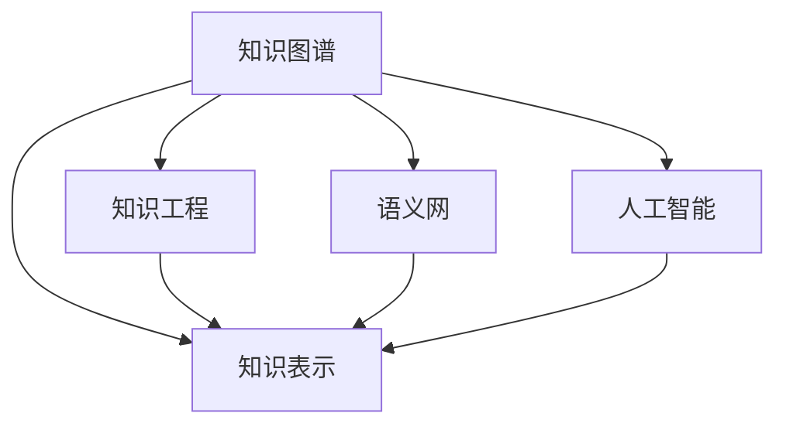

                 

# 人类的知识与权力：知识就是力量

> 关键词：知识图谱,知识表示,知识工程,语义网,人工智能,深度学习,知识发现

## 1. 背景介绍

### 1.1 问题由来

随着信息技术的快速发展，人类进入了“大数据”时代，知识的获取、存储和处理方式正在发生深刻变化。数据量的爆炸式增长带来了知识获取的便捷性，但同时也带来了数据过载和知识碎片化的问题。如何高效地组织和利用知识，已成为现代社会的重要议题。

知识图谱作为一种组织和表示知识的有效方式，在人工智能、搜索引擎、推荐系统等领域得到了广泛应用。通过构建知识图谱，可以将各种形式的知识（如文本、图像、音频等）转化为结构化的知识表示，从而支持更加智能化、情境化的信息检索和推理。

本文旨在探讨知识图谱的原理、构建方法及其在人工智能中的应用，深入挖掘知识图谱在知识发现、问题解答、信息检索等任务中的潜力，并展望其未来发展趋势和面临的挑战。

### 1.2 问题核心关键点

知识图谱的构建涉及以下几个关键问题：
- 知识表示：如何将知识以结构化的形式进行编码和存储。
- 知识获取：如何从大规模无序数据中抽取结构化知识。
- 知识融合：如何综合多源异构知识，构建统一的知识体系。
- 知识推理：如何基于知识图谱进行逻辑推理和问题解答。

这些问题的解决不仅依赖于计算机科学的方法，还涉及认知科学、信息科学、语言学等多个学科的知识。本文将从这些角度出发，全面剖析知识图谱的核心概念和构建方法，并探讨其在人工智能领域的应用前景。

## 2. 核心概念与联系

### 2.1 核心概念概述

为更好地理解知识图谱的构建与应用，本节将介绍几个密切相关的核心概念：

- **知识图谱(Knowledge Graph)**：一种结构化的知识表示方式，由节点和边组成，节点表示实体和概念，边表示实体之间的关系。
- **知识表示(Knowledge Representation)**：将知识以形式化、结构化的方式进行编码和表示，常用的知识表示方法包括本体、语义网、向量空间模型等。
- **知识工程(Knowledge Engineering)**：将知识转化为计算机可理解的形式，构建知识库和管理知识库的工程过程，涉及知识获取、知识建模、知识推理等环节。
- **语义网(Semantic Web)**：通过使用W3C的RDF等标准，将互联网上的数据转化为语义化的形式，支持基于语义的搜索和推理。
- **人工智能(Artificial Intelligence)**：通过模拟人类智能行为，实现问题解答、知识发现、信息检索等功能，是知识图谱的重要应用领域之一。

这些核心概念之间的逻辑关系可以通过以下Mermaid流程图来展示：



这个流程图展示的知识图谱的核心概念及其之间的关系：

1. 知识图谱通过知识表示方法，将知识结构化编码。
2. 知识工程是对知识获取、建模、推理等过程进行工程化处理。
3. 语义网通过语义化标准，将互联网数据转化为可推理的形式。
4. 人工智能利用知识图谱进行知识推理、问题解答等高级智能任务。

## 3. 核心算法原理 & 具体操作步骤
### 3.1 算法原理概述

知识图谱的构建通常遵循“先表示，再推理”的原则，即先通过知识表示方法将知识结构化，再利用推理机制进行知识融合和推理。知识表示的准确性和推理的有效性是知识图谱构建的关键。

形式化地，假设知识图谱由实体节点 $E$ 和关系节点 $R$ 组成，可以表示为：

$$
G = (E, R)
$$

其中 $E$ 表示实体集合，$R$ 表示关系集合，每个实体节点由属性和值组成：

$$
e = (A_1, V_1, A_2, V_2, ..., A_n, V_n)
$$

其中 $A_i$ 表示第 $i$ 个属性，$V_i$ 表示第 $i$ 个属性对应的值。

知识推理是指通过已有的知识图谱，利用逻辑推理机制，获取新知识的过程。常用的推理方法包括基于规则的推理、基于统计的推理和基于神经网络的推理等。

### 3.2 算法步骤详解

知识图谱的构建通常包括以下几个关键步骤：

**Step 1: 收集知识源数据**

知识图谱的构建首先需要大量高质量的原始数据，可以通过互联网抓取、数据库查询、文献抽取等方式获取。常用的数据源包括维基百科、百度百科、学术期刊、社交网络等。

**Step 2: 数据清洗与预处理**

原始数据往往包含噪声、重复和错误信息，需要进行数据清洗和预处理。数据清洗包括去重、去噪、格式化等操作，数据预处理包括分词、实体识别、关系抽取等。

**Step 3: 知识表示与编码**

将清洗后的数据转化为结构化的知识表示，常用的知识表示方法包括本体、RDF、向量空间模型等。需要选择合适的知识表示框架，对数据进行编码。

**Step 4: 知识融合与推理**

知识融合是指将多源异构知识进行综合，构建统一的知识图谱。常用的知识融合方法包括本体对齐、实体对齐、关系对齐等。知识推理是指通过已有的知识图谱，利用逻辑推理机制，获取新知识的过程。

**Step 5: 验证与评估**

构建后的知识图谱需要进行验证和评估，常用的评估指标包括召回率、精确率、F1值等。需要根据具体应用场景，选择合适的评估方法，确保知识图谱的准确性和可靠性。

**Step 6: 部署与使用**

知识图谱的构建最终目的是服务于实际应用，需要将其部署到生产环境中，供各类应用系统调用。常用的部署方式包括Web服务、API接口、嵌入式系统等。

以上是知识图谱构建的一般流程。在实际应用中，还需要针对具体任务进行优化设计，如改进数据清洗算法、选择合适的知识表示方法、优化推理引擎等，以进一步提升知识图谱的构建效果。

### 3.3 算法优缺点

知识图谱构建方法具有以下优点：
1. 结构化表示：知识图谱通过结构化的形式，清晰地表示实体和关系，便于计算机处理和推理。
2. 高效推理：知识图谱利用逻辑推理机制，支持高效的查询和推理，可用于信息检索、问题解答等任务。
3. 可扩展性：知识图谱可动态扩展，支持实时更新和维护，适应数据动态变化的需求。

同时，该方法也存在一定的局限性：
1. 数据依赖：知识图谱的构建高度依赖数据源的质量和数量，获取高质量数据是关键。
2. 复杂性高：知识图谱构建过程涉及多个环节，工作量大、复杂度高。
3. 处理开销大：知识图谱推理过程涉及复杂的逻辑计算，处理开销较大。
4. 动态维护难：知识图谱需要实时更新和维护，动态维护的难度较大。

尽管存在这些局限性，但知识图谱在信息检索、推荐系统、自然语言处理等领域的应用前景广阔，是构建智能应用的重要基础。

### 3.4 算法应用领域

知识图谱在多个领域得到了广泛应用，例如：

- 知识发现与推理：用于支持基于知识的搜索引擎，支持复杂查询和语义搜索。
- 信息检索与问答：通过构建知识图谱，可以提供更加智能化的信息检索和问题解答服务。
- 推荐系统：通过将用户行为、商品属性等知识整合到知识图谱中，可以提供更加精准的推荐服务。
- 自然语言处理：通过利用知识图谱中的知识，可以提升机器翻译、文本摘要等NLP任务的效果。
- 社交网络分析：通过将社交网络中的关系结构化表示，可以支持基于社交图谱的分析与挖掘。

除了上述这些经典应用外，知识图谱还在医疗、金融、教育、公共安全等多个领域得到了创新性的应用，为各行各业带来了新的创新机会。

## 4. 数学模型和公式 & 详细讲解 & 举例说明

### 4.1 数学模型构建

知识图谱的构建通常涉及实体抽取、关系抽取、知识融合和推理等多个环节。本节将从知识表示和推理两个方面，详细讲解知识图谱的数学模型构建方法。

#### 4.1.1 知识表示

知识图谱的知识表示方法主要有本体(Ontology)、RDF(RDF/OWL)和向量空间模型等。本节以RDF为例，介绍知识表示的数学模型。

在RDF框架下，知识图谱可以表示为三元组集合：

$$
G = \{(r,s,o)|r\in R,s\in S,o\in O\}
$$

其中 $r$ 表示关系，$s$ 表示实体，$o$ 表示属性或属性值。

### 4.2 公式推导过程

以下我们以信息检索任务为例，推导知识图谱在信息检索中的应用。

假设知识图谱中包含一个关于“苹果”的实体：

```
<http://example.org/apple> a <http://www.w3.org/2000/01/rdf-schema#Class>
```

查询“苹果”的详细信息：

```
PREFIX ex: <http://example.org/>
SELECT ?apple ?fruits
WHERE {
  ex:apple ex:hasFruit ?fruits .
}
```

查询结果：

```
<http://example.org/apple> <http://example.org/hasFruit> <http://example.org/appleFruits>
<http://example.org/appleFruits> <http://www.w3.org/2000/01/rdf-schema#Label> "苹果的水果"
```

### 4.3 案例分析与讲解

在上述示例中，通过RDF表示的实体和关系，可以进行基于图谱的推理，从而获取新知识。例如，查询苹果的水果，可以根据图谱中的关系“hasFruit”，找到对应的属性“appleFruits”，再获取其属性值“苹果的水果”。

在实际应用中，可以利用查询语言（如SPARQL）对知识图谱进行灵活查询，从而支持多种应用场景。例如，可以查询某产品的用户评价，可以通过以下SPARQL语句：

```SPARQL
PREFIX ex: <http://example.org/>
SELECT ?user ?review
WHERE {
  ex:product ex:hasReview ?review .
  ex:user ex:hasReviewed ?product .
}
```

## 5. 项目实践：代码实例和详细解释说明
### 5.1 开发环境搭建

在进行知识图谱构建实践前，我们需要准备好开发环境。以下是使用Python进行PyTorch开发的环境配置流程：

1. 安装Anaconda：从官网下载并安装Anaconda，用于创建独立的Python环境。

2. 创建并激活虚拟环境：
```bash
conda create -n knowledge-env python=3.8 
conda activate knowledge-env
```

3. 安装PyTorch：根据CUDA版本，从官网获取对应的安装命令。例如：
```bash
conda install pytorch torchvision torchaudio cudatoolkit=11.1 -c pytorch -c conda-forge
```

4. 安装Grapheine库：
```bash
pip install grapheine
```

5. 安装各类工具包：
```bash
pip install numpy pandas scikit-learn matplotlib tqdm jupyter notebook ipython
```

完成上述步骤后，即可在`knowledge-env`环境中开始知识图谱构建实践。

### 5.2 源代码详细实现

下面以构建一个简单的知识图谱为例，给出使用Grapheine库对RDF数据进行构建的PyTorch代码实现。

首先，定义RDF数据：

```python
from grapheine import Graph
from grapheine.rdf import RDFGraph

graph = RDFGraph()
graph.add_triple((graph.create_uri('ex:Apple'), graph.create_literal('a'), graph.create_literal('http://www.w3.org/2000/01/rdf-schema#Class'))
graph.add_triple((graph.create_uri('ex:Apple'), graph.create_uri('ex:hasFruit'), graph.create_uri('ex:AppleFruits')))
graph.add_triple((graph.create_uri('ex:AppleFruits'), graph.create_literal('http://www.w3.org/2000/01/rdf-schema#Label'), graph.create_literal('苹果的水果')))
```

然后，进行知识图谱推理：

```python
from grapheine.query import SPARQLQuery

query = SPARQLQuery(
    PREFIX ex: <http://example.org/>, 
    'SELECT ?apple ?fruits WHERE { ex:apple ex:hasFruit ?fruits }'
)

results = graph.query(query)
for row in results:
    print(row)
```

以上代码实现了将“苹果”的实体及其关系存储到RDF图谱中，并使用SPARQL查询获取苹果的水果信息。可以看到，通过Grapheine库，可以方便地构建和查询知识图谱，进行高效的知识推理。

### 5.3 代码解读与分析

让我们再详细解读一下关键代码的实现细节：

**RDF数据定义**：
- `graph.create_uri`方法用于创建实体或资源，如`ex:Apple`。
- `graph.create_literal`方法用于创建属性或属性值，如`a`。
- `graph.add_triple`方法用于添加三元组，表示实体与关系之间的连接。

**SPARQL查询**：
- `SPARQLQuery`类用于定义SPARQL查询，可以灵活设置查询条件和返回结果。
- `PREFIX`用于定义命名空间，如`ex:`。
- `SELECT`用于定义查询结果的变量，如`?apple`、`?fruits`。
- `WHERE`用于定义查询条件，如`ex:apple ex:hasFruit ?fruits`。

**查询结果输出**：
- `results`是一个迭代器，用于遍历查询结果。
- 通过`row`获取每行结果，并进行输出。

可以看到，通过使用Grapheine库，可以很方便地构建和查询知识图谱，支持多种知识表示方法，如RDF、本体等。开发者可以根据具体需求，选择合适的库和工具，进行高效的知识图谱构建。

## 6. 实际应用场景
### 6.1 智能问答系统

基于知识图谱的智能问答系统，能够利用结构化的知识图谱进行复杂查询和推理，从而快速、准确地回答用户问题。在技术实现上，可以构建基于知识图谱的查询引擎，结合自然语言处理技术，对用户问题进行理解和解析，在知识图谱中进行查询和推理，最后生成答案。

例如，当用户询问“苹果树是什么科”时，系统可以查询知识图谱，找到“苹果”实体及其对应的关系“hasFruit”，再获取“苹果Fruits”实体的关系“hasFamily”，最终找到“Malus”，即苹果所属的科。

### 6.2 推荐系统

推荐系统可以利用知识图谱中的实体和关系，进行更加精准和个性化的推荐。例如，当用户浏览某本书籍时，系统可以查询知识图谱，获取该书所属的作者、出版社、主题等信息，再结合用户的历史行为数据，进行综合推荐。

在实际应用中，可以利用知识图谱中的多源异构数据，综合考虑用户、物品和上下文等多种因素，进行更加智能的推荐。例如，可以基于知识图谱构建推荐图谱，利用图谱中的实体和关系，生成推荐路径和序列，支持冷启动和个性化推荐。

### 6.3 信息检索

知识图谱可以用于构建基于语义的搜索引擎，支持复杂的查询和推理，提供更加精准和智能的信息检索服务。例如，当用户查询“苹果的营养成分”时，系统可以查询知识图谱，找到“苹果”实体及其对应的关系“hasFruit”，再获取“苹果Fruits”实体的关系“hasNutrition”，最终获取苹果的营养成分信息。

在实际应用中，可以利用知识图谱进行语义搜索和知识推理，支持实体、属性和关系的复杂查询，提高信息检索的准确性和效率。

### 6.4 未来应用展望

随着知识图谱技术的不断成熟，其在人工智能领域的应用前景广阔，将带来以下几个趋势：

1. **多源数据融合**：未来知识图谱将整合更多种类的数据，如图像、视频、音频等，进行多模态融合，构建更加全面的知识图谱。
2. **智能推理**：利用深度学习等技术，提高知识图谱推理的精度和效率，支持更复杂的推理任务。
3. **实时更新**：知识图谱需要实时更新和维护，支持动态知识的获取和更新，适应数据动态变化的需求。
4. **知识注入**：结合专家知识库和规则库，注入先验知识，增强知识图谱的完备性和准确性。
5. **跨领域应用**：知识图谱将应用于更多领域，如医疗、金融、教育等，提供智能化的服务。

这些趋势凸显了知识图谱技术的广阔前景，未来必将在人工智能领域发挥更大的作用，推动智能系统的进步。

## 7. 工具和资源推荐
### 7.1 学习资源推荐

为了帮助开发者系统掌握知识图谱的原理和实践技巧，这里推荐一些优质的学习资源：

1. 《知识图谱理论与应用》系列博文：由知识图谱技术专家撰写，深入浅出地介绍了知识图谱的原理、构建方法及其在人工智能中的应用。

2. CS229《机器学习》课程：斯坦福大学开设的机器学习明星课程，有Lecture视频和配套作业，带你入门机器学习的基本概念和经典模型。

3. 《语义Web基础与实践》书籍：介绍了语义网的基本概念和实践方法，是学习知识图谱的重要基础。

4. Knowledge Graphs & Semantic Web with Python：通过Python代码实现知识图谱的构建和查询，帮助开发者快速上手知识图谱构建实践。

5. Grapheine官方文档：Grapheine库的官方文档，提供了详细的API接口和示例代码，是学习知识图谱构建的重要资源。

通过对这些资源的学习实践，相信你一定能够快速掌握知识图谱的精髓，并用于解决实际的AI问题。
###  7.2 开发工具推荐

高效的开发离不开优秀的工具支持。以下是几款用于知识图谱构建开发的常用工具：

1. Grapheine：Python知识图谱库，提供了丰富的API接口和示例代码，支持RDF、本体等多种知识表示方法。

2. Neo4j：基于图数据库的知识图谱管理工具，支持大规模知识图谱的存储和查询。

3. VisualDlime：可视化知识图谱构建工具，支持多种知识表示方法，提供了可视化的构建界面。

4. RDF Explorer：可视化RDF数据查询和展示工具，支持复杂查询和语义展示。

5. OntoGraph：可视化本体构建工具，支持OWL本体的构建和查询。

合理利用这些工具，可以显著提升知识图谱构建任务的开发效率，加快创新迭代的步伐。

### 7.3 相关论文推荐

知识图谱和语义网的研究源于学界的持续研究。以下是几篇奠基性的相关论文，推荐阅读：

1. FrameNet：FrameNet项目是知识图谱的先驱，通过建立语言框架和句法框架，支持知识图谱的构建和应用。

2. DBpedia：DBpedia是一个基于维基百科的知识图谱，包含大量结构化的知识数据，是知识图谱研究的重要资源。

3. RDFS：RDFS（Resource Description Framework Schema）是RDF的扩展，定义了知识图谱中的类、属性和方法等基本概念。

4. OWL：OWL（Web Ontology Language）是本体的描述语言，用于定义和描述知识图谱中的实体、属性和关系等。

5. Translator for Computationally Tractable Inference in OWL (TCI-OWL)：利用深度学习技术，提高OWL本体的推理效率和准确性。

这些论文代表了大语言模型微调技术的发展脉络。通过学习这些前沿成果，可以帮助研究者把握学科前进方向，激发更多的创新灵感。

## 8. 总结：未来发展趋势与挑战
### 8.1 总结

本文对知识图谱的原理、构建方法及其在人工智能中的应用进行了全面系统的介绍。首先阐述了知识图谱在人工智能领域的背景和意义，明确了知识图谱在知识发现、问题解答、信息检索等任务中的独特价值。其次，从原理到实践，详细讲解了知识图谱的数学模型和构建步骤，给出了知识图谱构建的完整代码实例。同时，本文还广泛探讨了知识图谱在智能问答、推荐系统、信息检索等诸多领域的应用前景，展示了知识图谱技术的广阔潜力。此外，本文精选了知识图谱技术的各类学习资源，力求为读者提供全方位的技术指引。

通过本文的系统梳理，可以看到，知识图谱作为组织和表示知识的有效方式，正在成为人工智能领域的重要基础。这些概念和方法的深入理解和应用，将大大提升人工智能系统的性能和效果，推动智能技术的普及和落地。

### 8.2 未来发展趋势

展望未来，知识图谱技术将呈现以下几个发展趋势：

1. **知识图谱融合**：未来的知识图谱将融合多种数据源，支持多源异构数据的整合和统一，构建更加全面和准确的知识图谱。
2. **实时知识图谱**：知识图谱将具备实时更新的能力，支持动态知识获取和维护，适应数据动态变化的需求。
3. **多模态知识图谱**：未来的知识图谱将支持多种形式的数据，如图像、视频、音频等，进行多模态融合，构建更加全面的知识表示。
4. **深度学习与知识图谱结合**：结合深度学习技术，提高知识图谱推理的精度和效率，支持更复杂的推理任务。
5. **智能推理引擎**：开发高效的推理引擎，支持大规模知识图谱的推理和查询，提高推理的效率和准确性。

以上趋势凸显了知识图谱技术的广阔前景，未来必将在人工智能领域发挥更大的作用，推动智能系统的进步。

### 8.3 面临的挑战

尽管知识图谱技术已经取得了瞩目成就，但在迈向更加智能化、普适化应用的过程中，仍面临诸多挑战：

1. **数据质量问题**：知识图谱构建高度依赖数据源的质量和数量，获取高质量数据是关键。
2. **知识表示复杂性**：知识图谱的构建和表示方法复杂，需要较高的技术门槛和专业技能。
3. **推理效率问题**：知识图谱推理过程涉及复杂的逻辑计算，推理效率较低。
4. **动态维护困难**：知识图谱需要实时更新和维护，动态维护的难度较大。
5. **系统复杂性**：知识图谱构建和应用系统复杂，需要多学科知识的支持和协同。

这些挑战需要学界和产业界的共同努力，才能克服知识图谱技术在应用中的瓶颈，进一步推动其在人工智能领域的发展。

### 8.4 研究展望

面向未来，知识图谱技术需要在以下几个方面寻求新的突破：

1. **自动化知识图谱构建**：开发自动化知识图谱构建工具，降低技术门槛，推动知识图谱的普及和应用。
2. **跨领域知识图谱构建**：构建跨领域的知识图谱，支持多领域知识的整合和应用，推动知识图谱技术在更多领域的应用。
3. **知识图谱与深度学习结合**：结合深度学习技术，提高知识图谱推理的精度和效率，支持更复杂的推理任务。
4. **多模态知识图谱**：支持多种形式的数据，如图像、视频、音频等，进行多模态融合，构建更加全面的知识表示。
5. **智能推理引擎**：开发高效的推理引擎，支持大规模知识图谱的推理和查询，提高推理的效率和准确性。

这些研究方向的探索，必将引领知识图谱技术迈向更高的台阶，为构建更加智能、普适的知识图谱提供新的思路和技术手段。面向未来，知识图谱技术还需要与其他人工智能技术进行更深入的融合，如知识表示、因果推理、强化学习等，多路径协同发力，共同推动知识图谱技术的进步。

## 9. 附录：常见问题与解答

**Q1：知识图谱构建的复杂性高，如何降低技术门槛？**

A: 知识图谱构建的复杂性主要在于其需要跨多个学科的知识，包括计算机科学、认知科学、信息科学等。为了降低技术门槛，可以借助自动化工具和框架，如Grapheine、Neo4j等，提供可视化的构建界面和API接口，降低开发者对专业知识的依赖。同时，可以借鉴OWL、RDF等标准，简化知识表示和构建过程。

**Q2：知识图谱推理的效率较低，如何解决？**

A: 知识图谱推理的效率较低主要是由于其涉及复杂的逻辑计算，可以利用深度学习等技术，提高推理的精度和效率。例如，可以利用深度学习模型对知识图谱进行表示学习，生成知识图谱的向量表示，支持高效的推理和查询。同时，可以开发高效的推理引擎，支持分布式计算和并行推理，提高推理的效率和可扩展性。

**Q3：知识图谱的动态维护困难，如何解决？**

A: 知识图谱的动态维护主要依赖于数据源的实时更新和维护。可以采用分布式存储和并行计算技术，提高数据更新和推理的速度。同时，可以结合增量更新和增量推理技术，减少计算开销，提高动态维护的效率。

**Q4：知识图谱的构建需要大量数据，如何获取高质量数据？**

A: 高质量数据的获取是知识图谱构建的关键。可以采用数据爬虫、数据抓取等技术，获取大规模的互联网数据。同时，可以结合知识工程方法，进行数据清洗和预处理，去除噪声和重复数据，提高数据的质量和可用性。此外，可以利用公共数据集、开放数据平台等资源，获取高质量的知识图谱数据。

**Q5：知识图谱的构建与推理需要多学科知识，如何协同合作？**

A: 知识图谱的构建和推理需要跨学科的知识和技能，需要多学科团队的协同合作。可以组建跨学科的研究团队，包括计算机科学家、认知科学家、信息科学家等，共同设计和实施知识图谱构建和推理项目。同时，可以借鉴其他领域的经验和方法，如生物信息学、化学信息学等，借鉴其数据获取、知识表示和推理方法，推动知识图谱技术的进步。

这些问题的回答将帮助开发者更好地理解知识图谱技术，克服其实践中的难题，推动知识图谱技术在人工智能领域的应用和发展。

---

作者：禅与计算机程序设计艺术 / Zen and the Art of Computer Programming

